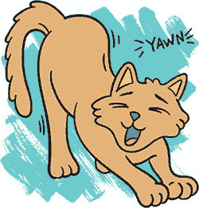

## 牧猫游戏：你的第一个 PuzzleScript 游戏

在本章中，我们将制作我们自己的 PuzzleScript 游戏。具体来说，它将是一个关于牧猫的游戏。（关于猫的游戏永远不会太多。记住这一点，当你成为一位著名的游戏设计师时。）你可以在 *[`w.itch.io/herding-cats/`](https://w.itch.io/herding-cats/)* 玩这个游戏。玩完游戏后，我们将讲解如何制作它！


在 *牧猫游戏* 中，你的目标是与每一关中的不同猫咪成为朋友。按键盘上的 **X** 键开始，然后使用键盘上的箭头键进行移动。如果你犯了错误并想重做动作，可以按 **Z** 键倒回时间。按 **R** 键重新开始当前关卡。（大多数 PuzzleScript 游戏都使用相同的按键来玩游戏。）

在每一关的开始时，所有的猫都会在睡觉。当你叫醒一只猫时，它会开始跟着你走。一只被叫醒的猫会跟随你到处走，但这可能会让你在某些地方卡住。

游戏可能会变得棘手。你不必解决每一关才能继续阅读章节！只要对游戏的运作方式有个大致了解即可。

### 打开一个空白项目

让我们从一个空白游戏开始。前往 *[`www.puzzlescript.net/`](https://www.puzzlescript.net/)* 并点击 **制作游戏**。通过点击 PuzzleScript 顶部的 **加载示例** 下拉菜单并选择 **空白项目** 来清除你的 PuzzleScript 工作区。

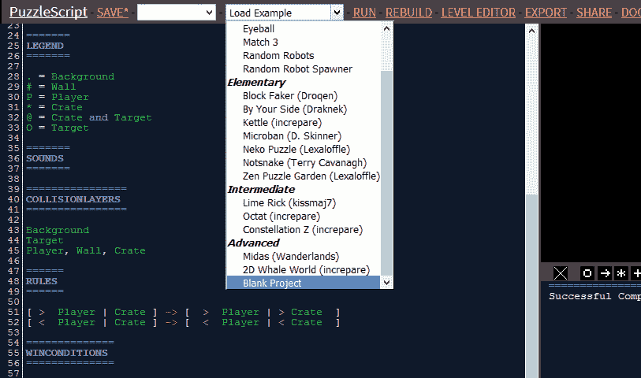

你应该会看到一个完全空白的 PuzzleScript 项目，像这样。

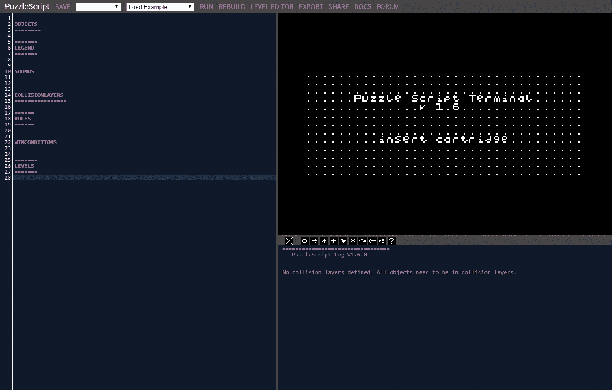

接下来，你将在脚本的顶部，`OBJECTS` 之前添加游戏标题和你的名字。点击第一行的开头，按三次 ENTER 键，将 `OBJECTS` 部分向下移动腾出空间，然后添加以下几行：

```
title Herding Cats!
author anna anthropy
homepage www.puzzlescript.net
```

结果应该像这样。

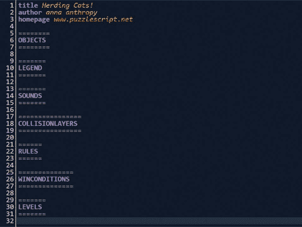

如果你犯了错误并需要撤销，按住 CTRL 键并按 **Z**。在你将使用的工具中，CTRL-Z 几乎是通用的撤销快捷键。

现在让我们看看如何创建物体。

### 创建物体

游戏中的每个物体都必须看起来像某种东西。物体的外观给玩家提供了关于它作用的重要信息。例如，在 *简单推箱子游戏* 中，所有可推动的物体看起来像是有平坦且易于推动的侧面的盒子。玩家有手臂，表示他们可以推动物体。

PuzzleScript 让你使用像素来绘制物体。*像素*（由*picture element*一词组成）只是一个单独的颜色点。PuzzleScript 中的物体宽度为 5 像素，高度为 5 像素，总共 25 像素。例如，这是我绘制的一个门。

```
Door
Brown White Blue
11111
10001
10001
10021
10001
```

你画出的图片是由数字组成的；每个数字代表一个像素。像素对应的数字与我们想要该像素显示的颜色有关。

从上到下，你会看到第一行是物体的名称（`Door`），第二行是我想要的颜色，然后是下方的 25 个像素的数字。因为我想要一扇棕色的门、一个白色的框架和一个蓝色的门把手，所以我在第二行输入这些颜色为`Brown White Blue`。当你输入这些单词时，它们应该显示为对应的颜色。

接下来，我使用表示每种颜色的数字逐个像素地输入颜色的位置。计算机从 0 开始计数，所以我输入的第一个颜色`Brown`是颜色`0`，`White`是颜色`1`，`Blue`是颜色`2`。每种颜色所代表的数字也会显示为相应的颜色，因此你可以想象当你输入颜色时，渲染出来的图像是什么样子。（请记住，在这个`Door`示例中，如果你尝试输入大于 2 的数字，比如 3 或 4，数字将显示为白色，因为你只用 0、1 和 2 来定义颜色。）

**注意：** 如果你很难记住计算机从 0 开始计数，可以想象一群人排队等厕所。如果我站在队伍最前面，前面有多少人？零！如果我站在队伍前面那个人后面，前面有多少人？一个！接下来是 2，3，再接下来是 4。排队的五个人编号为 0、1、2、3 和 4。

*Herding Cats*需要一些物体，现在让我们开始绘制它们！

#### 绘制背景

在*Herding Cats*中绘制物体时，我们首先需要一个`Background`。每个 PuzzleScript 游戏必须有一个背景。让我们在`OBJECTS`部分开始绘制一个看起来像草的背景：

```
========
OBJECTS
========
Background
DarkGreen Green
01000
10010
00100
01001
00010
```

零是深绿色，一是普通绿色。我把它们分散开，像小草一样，因为我想创建一个图像，当它重复时，会呈现出一个到处散布着草的小田野。

记住，在这段代码中，我们只画了一个宽 5 像素、高 5 像素的草地方块。但在游戏中我们永远不会只看到一个草地方块，而是会看到许多这样的背景方块，就像这样。

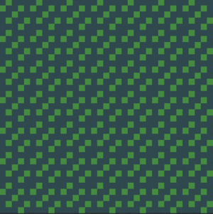

现在我们将在`OBJECTS`部分添加一些墙壁。

#### 绘制墙壁

为了画出带有堆叠砖块图案的墙壁，并让它们看起来更像砖墙，可以使用`Red`作为砖块的颜色，`DarkBrown`作为砖缝的颜色。然后填充像素，使棕色的砂浆交错于红色砖块之间：

```
Wall
Red DarkBrown
01000
01000
11111
00010
11111
```

我的墙有四块砖，但你可以让你的墙看起来任何你想要的样子。当这些块出现在屏幕上时，它会看起来像是一面连续的砖墙。

在我们实际看到墙壁在游戏中的样子之前，我们需要在`LEGEND`部分添加更多的要求。

#### 将背景和墙壁添加到图例中

任何我们希望在关卡开始时出现的物体都需要在`LEGEND`部分有一个符号。现在，为背景和墙壁添加符号：

```
=======
LEGEND
=======
. = Background
# = Wall
```

我选择**.**作为背景瓦片的符号，因为它周围有很多空白空间。相反，我选择了`#`来表示墙壁，因为它密集、方正，像墙壁一样。尽量选择让你联想到对象的符号，这样你一眼就能看出关卡的样子。

#### 创建碰撞层

每当我们向游戏中添加一个对象时，记得也要将它添加到`COLLISIONLAYERS`部分！让我们这样添加我们的墙对象：

```
================
COLLISIONLAYERS
================
Background
Wall
```

`COLLISIONLAYERS`部分中的每一行代表一个独立的层。`Background`有自己的层。其他所有东西——墙壁、玩家和猫——将位于第二个碰撞层。如果墙壁和猫不在同一层，猫就能穿过墙壁。那样的话，猫也太厉害了，甚至可以惊艳。

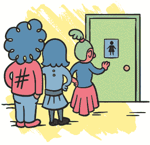

#### 创建一个示例关卡

现在我们已经将墙壁添加到`LEGEND`和`COLLISIONLAYERS`部分，让我们在`LEVELS`部分创建一个示例关卡，看看我们的`Background`和`Wall`对象是什么样子。使用背景和墙壁的符号来创建一个关卡：

```
=======
LEVELS
=======
###....
#.#.###
#.###.#
#.....#
##..###
.####..
```

点击**运行**，然后按下键盘上的**X**键，查看我们刚刚绘制的关卡。我将我的墙画得非常弯曲，这样我就能真正了解墙在使用中的样子。

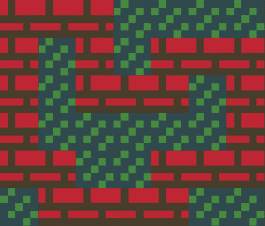

现在你可以看到背景和墙壁的样子了，你可能想要更改它们。每当你更改任何对象的外观后，点击**重建**，你的示例关卡会更新并展示新外观。这是跟踪你在工作中修改的对象外观的好方法。

#### 绘制玩家

现在我们需要一个玩家角色。在`OBJECTS`部分，我画了一个有粉色头发、白色裙子和两只小手的玩家（反正我是这么画的）。你可以通过选择颜色并用这些颜色填充像素来让你的玩家看起来像你想要的样子。但注意图中灰色的点（`.`）。

```
Player
Brown Pink White
.111.
.0011
.0011
.222.
02220
```

在 PuzzleScript 中绘制对象时，代码中的点（`.`）表示一个像素是透明的。在点所在的位置，你将能够看到透过该部分的背景（通常是背景）。

背景上不需要有透明像素，因为背景后面没有东西。而且，我们也不需要看到墙壁后面的内容，因为墙壁本身是方形的。但玩家不是方形的，所以我们会用透明像素填充他们图像中未使用的部分。

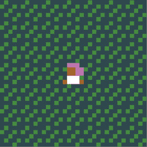

每当某个物体移动时（比如玩家），给它一个透明的背景是个好主意，这样我们就能知道它在什么地方移动。之前我提到过，通过物体的外观来显示它们可以做什么。例如，玩家站在草地上看起来可以移动，而那些与背景没有任何重叠的僵硬方形墙壁看起来像是固定不动的。

#### 绘制猫

最后也是最重要的，我们需要添加我们的猫。让我们思考一下 *Herding Cats* 中的猫。它们做什么？当它们清醒时，它们会跟着玩家走，而当它们睡觉时，它们就睡着，直到有人把它们叫醒。为了让 *Herding Cats* 按照我们想要的方式运作，我们需要两种不同类型的猫：一种是固定不动的，我们称之为 `SleepingCat`，另一种是跟随玩家的，我们称之为 `AwakeCat`。

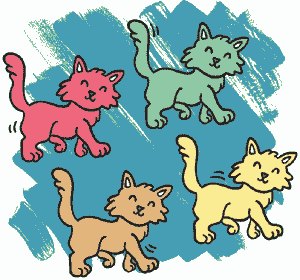

我们将从 `OBJECTS` 部分绘制两个不同的对象，创建两种基本类型的猫。

```
SleepingCat
Black Yellow
.....
0.0..
101..
00000
.0000
AwakeCat
Black Yellow
0.0..
101.0
00000
.0000
.0..0
```

睡觉的猫躺着。和大多数睡觉的猫一样，你看不见它的腿，因为它们都藏在下面。这只猫看起来是静止的。但清醒的猫站立着，准备跟随玩家。

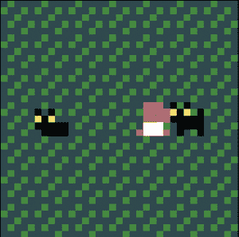

点击屏幕顶部的 **保存** 按钮保存目前为止的工作。建议经常保存，以防你不小心关闭了窗口，或者电脑崩溃，或者猫跳到键盘上。（如果你已经保存了游戏，可以点击 **加载** 菜单，在保存按钮旁边加载已保存的游戏版本。）

现在是休息一下、抚摸另一只猫或做个三明治的好时机。待会见！

### 使用你的对象

在我们能够使用新对象之前，我们需要告诉 PuzzleScript 如何处理这些对象，通过将它们添加到代码的 `LEGEND` 和 `COLLISIONLAYERS` 部分。进入图例，为玩家和睡觉的猫对象选择一个符号，如下所示：

```
. = Background
# = Wall
P = Player
m = SleepingCat
```

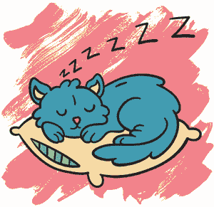

`AwakeCat` 对象没有符号，因为图例为 PuzzleScript 提供了我们希望用来构建关卡的所有对象列表。我为 `SleepingCat` 选择了 `m`，因为它看起来像是一只小猫坐着，腿弯曲在下面。（很可爱，对吧？）由于所有关卡一开始猫都在睡觉，所以在关卡开始时只有睡觉的猫。只有当一只睡觉的猫醒来时，清醒的猫才会出现！

#### 添加更多的碰撞层

我们只需要为我们的物体设置两个碰撞层：`Background` 和其他所有物体。将以下几行添加到 `COLLISIONLAYERS` 部分。接下来，我们要将玩家和两种猫添加到 `COLLISIONLAYERS` 部分。

```
Background
Player, SleepingCat, AwakeCat, Wall
```

背景位于单独的图层上，其他所有物体都在它上面移动。玩家、睡觉的猫、清醒的猫和墙壁都在同一图层上，这样它们才能互相碰撞并妨碍彼此。否则，它们将无法相互碰撞。如果你可以直接穿过墙壁，那么墙壁就不算真正的墙壁了。

接下来，我们需要更新我们的测试关卡。但是在此之前，先保存你的工作！

#### 创建一个测试关卡

让我们创建一个测试关卡，以确保我们游戏中的一切都按预期工作。在`LEVELS`部分输入类似以下的代码，确保关卡包含图例中的每个对象：`Wall`（`#`）、`SleepingCat`（`m`）、一个`Player`（`p`）和`Background`空间（`.`）。一定要在中间添加一堵墙，而不仅仅是在边缘！

```
=======
LEVELS
=======
#######
#..#..#
#.m#m.#
#..#..#
#.....#
#..p..#
#######
```

点击**Save**，然后点击**Run**。你应该能看到游戏的标题屏幕出现在屏幕右侧的窗口中，如图所示。


现在按下键盘上的**X**键开始游戏。你应该能看到你创建的测试关卡。

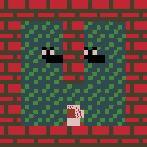

酷！现在通过箭头键移动玩家来测试你的关卡。玩家应该能够移动，但不能穿过墙壁或猫。确保所有物体都正常工作。猫会待在那里，因为我们还没有添加规则告诉它们该做什么。

#### 为猫创建规则

现在我们将添加一条规则，声明当`Player`对象接触到`SleepingCat`对象时，沉睡的猫应该醒来并变成`AwakeCat`对象。将此规则添加到你的代码的`RULES`部分：

```
======
RULES
======
[ Player | SleepingCat ] -> [ Player | AwakeCat ]
```

这条规则意味着如果`Player`在`SleepingCat`旁边，它就会变成一个在`AwakeCat`旁边的`Player`。点击 PuzzleScript 屏幕顶部的**Rebuild**，让 PuzzleScript 将你所做的所有更改添加到你正在玩的游戏中。然后尝试将玩家移到猫旁边，看看它们是否会醒来。

猫应该醒来了，但它们有点迟：它们不是在你碰到它们的时候醒来，而是在下一个移动时才醒来。为了让你明白我的意思，走近一只猫然后走开。猫会在玩家下一次移动后才醒来，而不是玩家走到它旁边时就醒来。我们希望猫在看到玩家时就马上警觉起来！猫，你们怎么回事？

为了理解目前游戏玩法中的问题，想一想规则是如何工作的：

1.  玩家决定要向哪个方向移动。

1.  PuzzleScript 检查所有规则，并根据规则所指示的内容进行任何更改。

1.  一切想要移动的东西最终都会移动。

你按下箭头键，将玩家移动到猫旁边，玩家变成了一个移动中的`> Player`。接着，PuzzleScript 检查规则，看看玩家是否在猫旁边。因为玩家还没有接近任何猫，猫保持沉睡，`> Player`终于移动了。然后 PuzzleScript 等待下一次箭头键按下，猫仍然保持沉睡！当你再次按下箭头键时，玩家再次变成`> Player`，PuzzleScript 再次检查规则。这一次它发现玩家在猫旁边，所以猫变成了醒着的猫，玩家也移开了。

为了解决游戏中的这一问题，我们向规则中添加了关键字`late`，这样它将在玩家移动后立即检查玩家是否在猫旁边，而不是在玩家下一次移动之前。新的规则如下所示：

```
late [ Player | SleepingCat ] -> [ Player | AwakeCat ]
```

在规则前面加上`late`告诉 PuzzleScript 在物体移动后检查规则，而不是在移动之前。实际上，我们为 PuzzleScript 处理规则的方式添加了另一个步骤，因此会发生以下情况：

1.  玩家决定移动的方向。

1.  PuzzleScript 检查所有规则，并根据规则的指示进行任何更改。

1.  所有想要移动的物体最终都会移动。

1.  PuzzleScript 检查所有`late`规则，并根据它们的指示进行任何更改。

现在，猫咪应该在玩家移动后立即醒来，而不是等到下一个周期再醒来！测试一下这段代码。（如果你的猫咪已经醒着，可能需要点击“运行”来开始一个新游戏。）当玩家靠近时，你的猫咪应该立刻警觉起来。

#### 让猫咪跟随玩家

现在让我们添加这个规则，让醒着的猫咪跟随玩家：

```
======
RULES
======
late [ Player | SleepingCat ] -> [ Player | AwakeCat ]
[ > Player ] [ AwakeCat ] -> [ > Player ] [ > AwakeCat ]
```

这个规则中没有竖线符号（`|`），因为`[ > Player | AwakeCat ]`意味着玩家和猫咪必须相邻，猫咪才能移动。但我们希望猫咪能和整个小组一起移动，无论小组是什么形状。因此，最简单的方法是让猫咪无论离玩家多远，都做相同的动作。只要猫咪是醒着的，它就应该跟着玩家一起移动。为了实现这一点，我们将`Player`和`AwakeCat`对象分别用方括号括起来，这意味着它们不需要紧挨着。玩家和猫咪可以处于任何位置，规则仍然会触发。实质上，这个新规则表明，如果玩家试图移动，每只醒着的猫都会尝试朝同一方向移动。

点击**重建**并试试看！唤醒猫咪并让它们开始移动！假装你是猫咪的晨间操教练！让我们把尾巴摇起来！

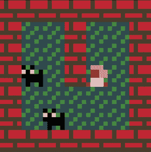

游戏仍然没有完全按照预期工作。现在，小组并没有保持在一起。例如，如果你被墙壁挡住了，但猫咪朋友却没有，猫咪会继续走，结果小组会散开。为了让小组的形状变得重要，我们需要确保小组保持在一起。

如果我们让小组保持在一起，我们还需要确保小组外的猫咪能够将其他猫咪加入小组。否则，一旦玩家唤醒了几只猫，它们就会被困在猫群中间，无法接触到任何新的猫咪！

我们面临两个挑战：我们希望玩家和猫咪一起移动，并且希望允许已经在组内的猫咪唤醒其他猫咪，就像玩家一样。幸运的是，这两个问题有相同的解决方法。

### 定义对象的属性

为了解决游戏玩法中的两个问题，我们需要让同样的规则适用于玩家和猫对象。我们本可以为每条规则写两个版本——一个给玩家，一个给猫咪——但这样一来，如果我们想改变规则，就得改两次。而且如果我们想添加新规则，也得写两次！程序员有一个特点，就是我们比较懒。为什么要做多余的工作，当我们可以和自己真实的猫咪玩呢？让我们第一次就让代码干净高效。

我们将使用`LEGEND`部分告诉 PuzzleScript 以相同方式对待不同类型的对象。`LEGEND`部分不仅允许我们告诉 PuzzleScript 哪些符号代表哪些对象，它还允许我们告诉 PuzzleScript 哪些单词代表哪些对象，这样我们就可以用一个词将玩家和猫咪包括在同一个小组里。

#### 允许猫咪叫醒其他猫咪

让我们在传说中添加一项条目，描述任何可以作为玩家小组成员的对象，无论是玩家还是跟着他们的猫咪。这样，组中的任何成员（玩家或猫咪）都可以叫醒睡着的猫咪。我们将把这种类型的对象称为`WakerUpper`。

```
WakerUpper = Player or AwakeCat
```

现在在我们的规则中，我们不再检查玩家是否靠近睡着的猫咪，而是检查任何`WakerUpper`是否靠近睡着的猫咪。记住，玩家和任何已经加入他们小组的猫咪都算作`WakerUpper`。

我们将通过修改这一行，将`WakerUpper`添加到我们当前的`late`规则中：

```
late [ Player | SleepingCat ] -> [ Player | AwakeCat ]
```

到此为止：

```
late [ WakerUpper | SleepingCat ] -> [ WakerUpper | AwakeCat ]
```

现在游戏中的猫咪应该能够叫醒其他猫咪了。当前的规则会查找任何被标记为`WakerUpper`的对象，传说中将玩家和已醒来的猫咪定义为`WakerUpper`。试着玩玩看游戏，然后保存你的进度！

#### 保持猫咪在一起

我们已经解决了第一个问题：猫咪可以叫醒其他猫咪。接下来，我们需要弄清楚如何在移动时防止小组分裂。

首先，让我们确定为什么小组会分裂。记住，`>`符号表示某物*正在尝试*移动。由于以下规则，每当玩家尝试移动时，所有的猫都会尝试朝同一方向移动：

```
[ > Player ] [ AwakeCat ] -> [ > Player ] [ > AwakeCat ]
```

但是，如果玩家再次尝试移动且被阻挡，每只猫仍然会尝试移动，导致小组分裂。

为了保持玩家和猫咪作为一个小组，我们需要在小组中的任何成员被阻挡时，停止小组中所有人的移动。我们可以通过添加另一个规则并使用关键字`cancel`来实现：

```
======
RULES
======
late [ WakerUpper | SleepingCat ] -> [ WakerUpper | AwakeCat ]
[ > Player ] [ AwakeCat ] -> [ > Player ] [ > AwakeCat ]
[ > WakerUpper | Wall ] -> cancel
```

该规则声明：“如果一个`WakerUpper`尝试移动到墙壁里，停止所有人的移动。”每个人都会停留在原地。因为我们使用了`WakerUpper`，这个规则会检查玩家和所有醒着的猫，确保小组保持在一起。

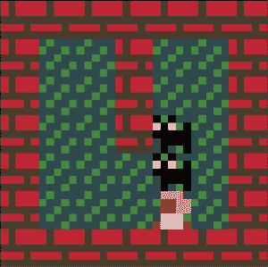

请记住，PuzzleScript 会从上到下读取你编写的所有脚本，就像你读书一样。PuzzleScript 按照它们的顺序执行你的规则，从最上面开始，直到最底部。我们希望“如果一个 `WakerUpper` 尝试移动到墙壁中”这一规则发生在最后，所有 `WakerUpper` 成员决定好它们的移动位置之后。所以，请确保这个最后的规则位于 `RULES` 部分的最底部！

保存你的工作，然后尝试玩一下游戏。玩家和猫咪会保持在同一个队伍中吗？

### 赢得游戏

之前，我们决定游戏的目标是唤醒所有的猫，并让它们加入你的队伍。好吧，我们已经唤醒了关卡中的所有猫。

但是关卡仍然没有结束，因为我们还没有为 PuzzleScript 添加检查获胜条件的内容。

有些游戏可以永无止境，但这个游戏不是。要想赢得 *Herding Cats*，我们需要添加一个获胜条件。什么样的获胜条件才合适呢？好吧，*Herding Cats* 的目标就是让所有的猫都加入你的队伍。为了实现这一目标，我们需要唤醒所有的猫！那么，试试看这个作为我们的获胜条件：

```
No SleepingCat
```

如果没有更多的睡觉猫，并且所有猫都已经醒来，你就赢了。

将 `No SleepingCat` 这一行添加到 `WINCONDITIONS` 部分，然后运行你的游戏，看看你是否能赢得关卡。当最后一只猫醒来时，你应该看到`Win Condition Satisfied`这一信息，如下所示。

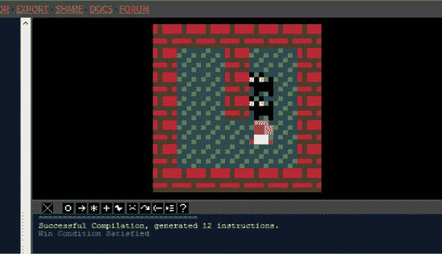

然后你会回到标题画面。

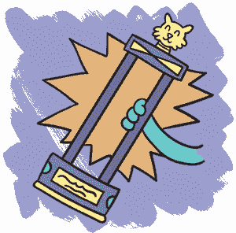

### 添加音效

为了让游戏更加有趣和好玩，我们来为游戏添加一些音效。看到游戏屏幕下方的这些小按钮了吗？试着点击其中的每一个！

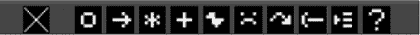

这些按钮会产生不同的音效，比如跳跃声、激光射击声和鸟鸣声。最右侧的随机音效按钮会给你一个完全随机的音效，最左侧的 X 按钮则会清空游戏屏幕下方的信息面板，并删除你添加的任何音效！使用 X 按钮时要小心：你可不希望不小心删除掉一些你喜欢的音效，可能还会继续用到哦！

每次点击一个按钮，比如鸟按钮时，都会出现类似 `birdSound: 40166309` 的一行。这个数字是 PuzzleScript 可以理解的音效格式。当你点击一个数字时，你应该能听到那个声音。当你找到喜欢的声音时，记下它的编号。

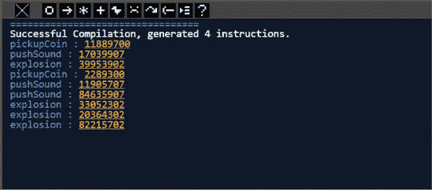

尝试找一个音效，能够激动人心地表示你赢得了这一关！带有加号的能量增强音效按钮可能是一个不错的选择。不断点击它，直到你找到一个喜欢的声音。然后将这个音效的编号输入到游戏的 `SOUNDS` 部分，如下所示：

```
=======
SOUNDS
=======
Endlevel 72533508
```

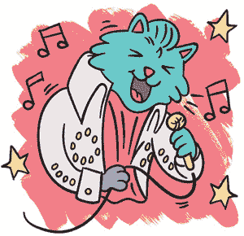

关键词 `Endlevel` 告诉 PuzzleScript 在关卡结束时播放这个音效。现在再次运行你的游戏，尝试赢得这一关。当你获胜时，你能听到那个酷炫的音效吗？

那么，如何在猫咪醒来时加入一个声音呢？找到一个听起来像“喵”的音效，然后将它添加到你的声音列表中，就像这样：

```
sfx0 9963503
```

代码`sfx0`代表“音效 0”。如果你添加另一个音效，你就会用`sfx1`，然后是`sfx2`，依此类推。（记住，0 总是排队在厕所前面的人编号！）

你可以随时通过将它放在规则的末尾来让`sfx0`声音播放，就像这样：

```
late [ WakerUpper | SleepingCat ] -> [ WakerUpper | AwakeCat ] sfx0
```

这一行代码告诉 PuzzleScript 在每次执行唤醒猫咪的规则时播放`sfx0`，也就是说，每次猫咪醒来时都会播放。

保存你的游戏并进行测试。聆听你游戏现在拥有的奇异视频游戏音效的美妙交响曲。*宏伟！*

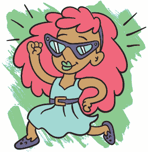

### 你学到了什么

现在你知道了构成 PuzzleScript 游戏的所有部分。你知道如何绘制构成游戏的对象，添加规则来告诉游戏如何处理这些对象，并设置碰撞层来告诉游戏哪些对象与哪些对象交互。你还知道`LEGEND`部分告诉 PuzzleScript 哪些单词和符号代表哪些对象。你学到了如何添加胜利条件来完成游戏，并添加声音使游戏更有趣且更具表现力。

我们还没有深入讨论的一个重要部分是关卡。在下一章中，你将学习如何使用 PuzzleScript 内置的便捷关卡编辑器为你的游戏制作关卡。你还将学习如何利用关卡设计讲述你的游戏故事。休息一下，我们将在第三章再见！
