## 3

《驱赶猫咪》：利用关卡设计讲述故事

在本章中，你将学习*关卡设计*，它是游戏中每个关卡的蓝图。一个关卡可以是游戏中的一个场景、一个房间、一个区域，或者是游戏旅程中的一部分。例如，《驱赶猫咪》中的每个难题就是一个关卡。你可以把整个游戏想象成一个由多个关卡组成的塔：每个关卡堆叠在一起，玩家逐个通过这些关卡。

关卡设计讲述故事。它展示了游戏中重要的元素，并可以教会玩家游戏的基本理念。例如，在《驱赶猫咪》中，你有时需要利用一只猫去接触另一只猫。你可以利用关卡设计来发展这些理念；以更复杂、更困难的方式使用它们；并将它们混合起来，创造一些出乎意料的内容。关卡设计可以给玩家带来惊喜，或让他们产生不同的情感，如聪明、兴奋、害怕、沮丧或好奇。

将每个关卡看作是一个小型游戏，每个关卡都有自己的挑战和解决方案。角色可能相同，但每个新关卡的情境都会发生变化；每个新关卡都能让玩家更多地了解角色和游戏。

### 使用关卡编辑器

在这一节中，我们将使用 PuzzleScript 内置的关卡编辑器为《驱赶猫咪》创建关卡。我们将识别《驱赶猫咪》中的重要理念，并弄清楚如何将它们呈现给玩家。然后我们将基于这些理念构建关卡。我们会考虑什么样的关卡设计是好的，以及哪些关卡能构成一个节奏合理、完整的游戏。同时，我们也会在过程中讲述一个小故事。

让我们从使用内置关卡编辑器构建最小的可能关卡开始。在你的 PuzzleScript 游戏的`LEVELS`部分输入以下内容来构建一个关卡。或者访问*bit.ly/catswithoutlevels*，下载没有关卡的完整编程版游戏。

```
=======
LEVELS
=======
###
#m#
#.#
#p#
###
```

这将创建你的第一个关卡，其中有一只猫（`m`），玩家的起始位置（`p`），它们之间的空位（`.`）和墙壁（`#`）。

#### 玩一个关卡

要玩你刚刚输入的关卡，可以使用一个便捷的快捷键：按住键盘上的 CTRL 键（Mac 上是 COMMAND 键），然后点击该关卡。它应该会立即弹出并准备好开始游戏，如图所示。

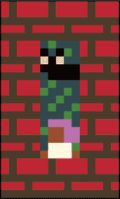

*几乎是最小的* 《驱赶猫咪》 *关卡你可以创建的*

按上箭头键唤醒小猫并获胜！

#### 编辑一个关卡

现在，让我们编辑你刚刚输入的关卡，使其变得更有趣。要进入编辑模式，再次按住 CTRL 键点击该关卡，并在按住 CTRL 键的同时，按下**E**键。应该会出现一排对象，包括字母*S*、一些草地、墙壁、玩家和一只猫，见下图所示。（猫应该只是一对黄色的眼睛，因为它是在黑色背景上的黑猫。）我们将称之为关卡编辑器的*调色板*。

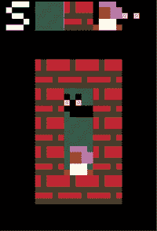

*编辑模式*

从调色板中点击一个对象进行选择，然后点击关卡中的位置放置它。试着选择猫咪，然后点击关卡中的玩家，将玩家变成猫咪。要删除已放置的对象，右键点击它们。

#### 放大关卡

要放大关卡，点击一个边缘，然后将鼠标移至关卡的最左、最右、顶部或底部。鼠标指针应该从一个框变成十字准线（`+`）。当鼠标指针变成十字准线时点击，以在该方向上增加一行或一列关卡。右键点击以缩小关卡。试着将关卡变大，然后重新绘制墙壁以适应新关卡。下面是一个放大后的关卡，里面有两只猫咪的样子。

**注意：** 在编辑关卡时，要播放关卡，按下方向键。（如果你之前将玩家变成了猫咪，可能需要为游戏添加一个新的玩家。）

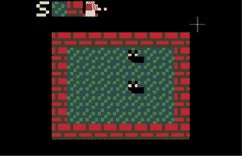

*放大后的关卡*

#### 保存并打印你的关卡

完成编辑后，点击调色板中的**S**保存关卡。游戏下方的框框应该会显示出你新关卡的文本版本。


*PuzzleScript 关卡也可以用文本表示。*

请注意，文本版本会显示关卡在当前时刻的代码。所以，如果你在编辑模式中移动了玩家，代码中应该显示玩家的新位置。但如果你唤醒了所有的猫咪，代码中应该没有显示猫咪，因为`LEGEND`部分没有关于醒着的猫咪的代码。

在编辑关卡时，确保多次点击**S**，以确保不会意外丢失你的工作！

#### 将新关卡添加到你的游戏

一旦你完成了在编辑模式下更新关卡，你需要将更新后的 PuzzleScript 代码复制并粘贴到游戏的`LEVELS`部分。

要复制并粘贴新关卡，首先高亮显示关卡的文本版本。接着，右键点击并选择**复制**，将关卡文本复制到操作系统的剪贴板。（你看不到剪贴板；文本会在背后被隐形保存。）然后，右键点击`LEVELS`下方，选择**粘贴**将新关卡粘贴到游戏的`LEVELS`部分！你也可以拖放高亮显示的文本到`LEVELS`部分。

结果应该是这样的。

```
=======
LEVELS
=======
########
#...m..#
#......#
#...m..#
#......#
#......#
########
```

#### 测试你的关卡

要测试你的关卡而不完全重置它，按下**R**（重置）。但要小心！按下 R 会将你的关卡重置为你首次按 E 进入编辑模式之前的状态。如果你在开始编辑后修改了关卡，按下 R 将撤销你所有的修改！啊！

但有一个解决方法：要测试关卡，按两次**E**（一次退出编辑模式，再一次进入编辑模式），然后玩你的关卡。现在，当你按下**R**时，关卡应该会恢复到按 E 时的状态。点击**S**按钮以打印你的关卡。

在你制作关卡时，一定要多玩几次，并且更频繁地保存进度。

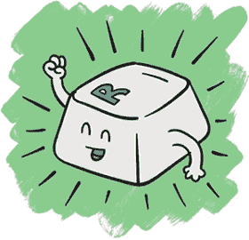

### 关卡讲述故事

让我们为我们的*驯猫*游戏制作一些关卡。什么样的起始关卡会比较好？你游戏的第一个关卡应该介绍游戏的故事（玩家尝试与猫咪交朋友），并向玩家展示每个关卡的目标，即唤醒猫咪。

这张图展示了我设计的一个起始关卡。看看你能否在编辑器中重建它。

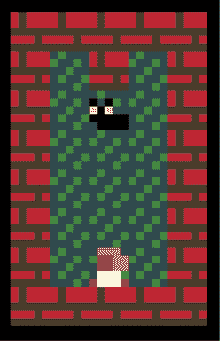

*第 1 关：猫咪朋友 #1*


第一个关卡非常简单：当玩家接触到猫咪时，关卡就结束了。玩家还不知道他们为何要与猫咪交朋友。但你可以通过在 PuzzleScript 中添加一条消息来帮助他们理解游戏的背景。在你游戏的`LEVELS`部分，输入`Message`，后面跟上你想要显示的消息（例如，`哦，一只小猫！`）。你输入的消息会在关卡之间显示在屏幕上（但不会显示`Message`这个词）。

```
=======
LEVELS
=======
Message Oh, a kitty!
########
#...m..#
#......#
#...m..#
#......#
#......#
########
Message Hi, kitty.
```

让我们加入消息`哦，一只小猫！`，让它在游戏开始时的第一刻就出现，确立这只小猫的重要性。然后，在关卡结束时，我们显示消息`嗨，小猫。`，告诉玩家遇见这只小猫是他们的任务。玩家还会看到一些提示文本，提醒他们按 X 继续游戏，正如这里所示。

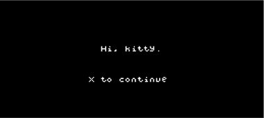

*这就是游戏中消息的样子。*

这完成了我们为*驯猫*设计的第一个关卡！到这个关卡结束时，玩家应该了解游戏的基本目标。

### 关卡教玩家游戏规则

我们已经引入了将猫咪作为游戏目标的概念。接下来，我们需要让玩家理解的一个重要规则是，猫咪会跟随玩家。我们如何设计一个关卡来教会玩家这个规则呢？

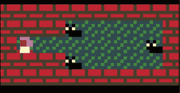

*第 2 关：猫咪喜欢跟随玩家。*

要完成第二关，玩家必须通过两只猫咪，才能到达右边的第三只猫。随着玩家经过猫咪，它们会竖起耳朵跟随玩家。当玩家遇到所有的猫咪时，关卡就结束了。

#### 故障排除

那么，第一个关卡的猫咪呢？它会一直跟随玩家吗？我们来修改一下关卡，加入一只猫咪伙伴。现在关卡的样子是这样的。

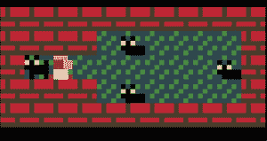

*第 2B 关：玩家与第 1 关的猫咪朋友一起开始第 2 关。*

创建这个关卡并试试看。哎呀，出现问题了。你找到了吗？

当你移动玩家时，第 1 关的猫咪不会跟随。你可以回去把猫咪叫醒，但我们希望猫咪*已经*在跟随玩家了，因为它是我们在第 1 关交到的朋友！

问题出在我们在第二章中设置的 PuzzleScript 规则。告诉 PuzzleScript 将沉睡的猫变为醒着的猫的规则是一个晚触发的规则，只有在玩家移动时才会触发。但由于玩家还没有移动，因此没有任何规则被触发！

#### 关卡开始时的规则

幸运的是，我们可以通过确保所有规则在每个关卡开始时都运行，从而解决第一个猫咪朋友跟随玩家的问题，在玩家进行任何操作之前。为了实现这一点，只需在你的 PuzzleScript 代码开始处添加`run_rules_on_level_start`，如下所示。

```
title Herding Cats
author anna anthropy
homepage www.puzzlescript.net
run_rules_on_level_start
```

现在点击**重建**并重新开始关卡。新的猫咪应该会跟随玩家。玩家应该通过和第一关的猫咪朋友一起走来开始第二关。当他们经过左边的两只猫时，猫咪们会醒来并开始跟随他们。然后，随着三只猫的随行，玩家遇到了第四只也是最后一只猫，关卡完成。为了让故事更加完整，我们再加上一条信息。

```
message Oh, hi to you too!
```

这本身就是一个小故事！

### 关卡挑战玩家运用所学知识

到目前为止，我们已经教会玩家，碰到的猫咪会跟随他们，而目标是让每只猫都跟随他们。现在他们知道了这些规则，让我们设计一个谜题，挑战他们运用所学的知识。

你能设计一个关卡，迫使玩家仔细考虑他们唤醒猫咪的顺序吗？

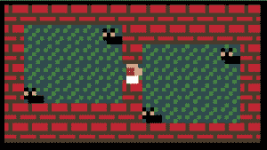

*第 3 关：紧凑适应！*

第 3 关有两个房间，每个房间有两只猫，且它们之间有一个非常狭窄的通道。如果玩家在驱赶猫咪时不小心，他们将无法通过这个缝隙，如图所示。试着解决这个关卡。你看到了这个关卡如何测试玩家所学的知识吗？

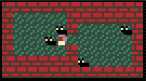

*第 3 关：卡住了！*

如果玩家没有仔细考虑他们队伍的形状，他们会卡住！

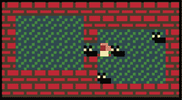

*第 3 关解决方案*

要通过这个关卡，玩家需要把所有猫咪排列在一起，使它们能顺利通过狭窄的洞口。

### 从错误中学习

让我们尝试以不同的方式排列第 3 关的猫咪。我们将它们横向排列，而不是对角线排列。这会如何影响玩家思考如何组织他们的队伍呢？

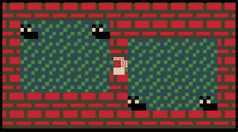

*3B 关卡：如果猫咪的排列方式不同，会怎样？*

每个玩家的思维方式都有些不同。但很可能，玩家在这种排列方式下会更容易找到解决方案。猫咪们已经按正确的方式排好，能够通过狭窄的洞口！那么，这种改变会让关卡变得更好吗？

我会说不，因为*犯错误是游戏的重要部分*。在*牧猫*中，当玩家犯错并卡住时，他们意识到需要更加仔细地思考他们的猫朋友在哪里。当他们犯错时，他们学会了游戏的运作方式以及解决难题时需要如何思考。出错是很重要的！

### 设计你自己的关卡！

尝试为游戏设计一些你自己的关卡！这里有一些想法：

+   **制作一个比上一个关卡难一点的关卡。** 然后试着做一个稍微比这个更难的关卡！制作一个适中的难度关卡比做一个非常难的关卡要难得多。想象一下，如果你最喜欢的游戏跳过了中间的关卡，直接进入最难的关卡，你根本不知道该怎么办：这些过渡关卡帮助你学习如何应对更难的挑战！如果你做了一个太难的关卡，想想看你可以做些什么来简化它。

+   **在最小的屏幕空间内制作你能做出的最难关卡。** 仔细考虑你放置物体的位置。你*真的*需要多少个物体才能做出一个有趣的关卡？

+   **制作讲故事的关卡！** 当第一个关卡结束时，玩家与一只猫交朋友，第二个关卡开始时那只猫朋友还在旁边，这就是讲故事！这是一个简单的故事，但它让玩家关心这个游戏。你还能想出什么方法来讲述简单的故事？

+   **做一些多人玩家的关卡。** 当你加入多个玩家物体时，你能设计出什么样的难题？

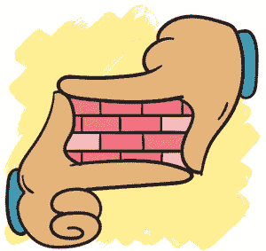

记得在制作关卡时玩一下自己设计的关卡！留意你在玩每个关卡时的想法和感受。在一个关卡中，你的第一反应是什么？是朝着某个方向走吗？如果是，为什么？如果关卡的某些部分感觉有点粗糙，那就改善它，然后再玩一次！随着你制作关卡，你会发展出自己的关卡设计直觉。

当你完成游戏后，让朋友们来玩你的关卡，了解他们如何体验这些关卡。记住，作为游戏开发者，你了解游戏的所有内容。但对你来说简单的东西，可能对别人来说很困难。看到别人对你的创作有何反应是非常重要的。

当你在看别人玩你的关卡时，注意观察他们的操作。尽量抵制向他们解释他们该做什么，或者你为什么以某种方式设计某个部分的冲动。你的目标应该是了解玩家在你不在场时会做什么。

成为一名优秀的关卡设计师需要很多工作。倾听你自己的直觉和其他人的反馈。你做的关卡越多，你的设计技巧就会越好！

### 分享你的游戏

当你完成了你的 PuzzleScript 游戏后，你可以分享它！分享一个 PuzzleScript 游戏非常简单！只需要点击屏幕顶部的**Share**按钮。你需要创建一个 GitHub 账号。

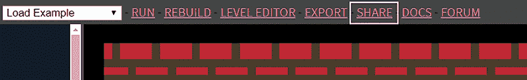

*点击分享按钮生成指向你游戏的链接。*

当你点击“分享”时，PuzzleScript 会生成两个链接：一个打开你的游戏在 PuzzleScript 编辑器中，另一个则是通向可玩的游戏。

将第二个链接分享给朋友们，让他们可以玩你的游戏！他们也可以通过点击页面底部的**黑客**链接来在编辑器中打开你的游戏。

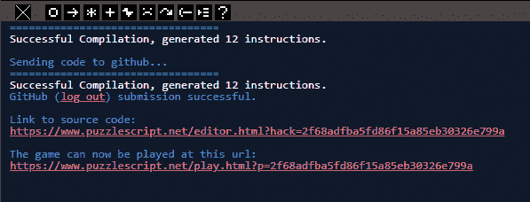

*PuzzleScript 会生成指向你游戏的链接。*

你还可以通过点击屏幕顶部的**导出**将游戏保存到你的电脑。导出游戏会在你的电脑上创建一个 HTML 文件，你可以打开这个文件来玩你完成的游戏。这个版本没有黑客链接，因此如果你想保密你的游戏代码，可以将它导出并上传到一个免费的网页，如*[`neocities.org`](https://neocities.org)*！

### 奖励挑战

这里是我为*放牧猫*添加的几个图形技巧，让游戏看起来更有趣。你能弄明白是怎么做的吗？如果需要一些提示，可以打开我完成的游戏版本，访问*[`w.itch.io/herding-cats`](https://w.itch.io/herding-cats)*，看看我是如何做的。

#### 不同形状的关卡

第一个图形技巧很简单。关卡不再完全是矩形，而是各种不同的形状。

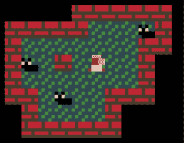

*创建具有独特形状的关卡*

这个技巧很简单！我只是做了一个完全黑色的对象，并用它来填充墙外的空间。因此，关卡看起来不再是大矩形，而是具有独特形状。

#### 四种猫

另一个图形上的变化更复杂：不仅仅是一个类型的猫，而是四种不同的猫，正如你在这里看到的。

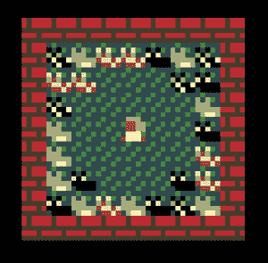

*睡眠和醒来的猫*

这个技巧涉及创建四种猫的睡眠和醒来版本，以及一个通用的猫对象，放置在关卡中。在关卡开始时，每个通用猫会*随机*变成四种猫中的一种。（阅读我完成的游戏版本中的`规则`部分，看看这是如何发生的！）

关于编辑器的一点说明：如果你在添加新对象后重建游戏，关卡编辑器可能会混淆对象的顺序。每次添加新对象后，请点击**运行**按钮，确保 PuzzleScript 正确更新。你在关卡中或更改对象外观时，点击**重建**仍然是可以的。

### 你学到了什么

好了，这就是*放牧猫*的内容！在这一章中，你学会了如何使用 PuzzleScript 的关卡编辑器来讲故事、教玩家规则，并挑战玩家对规则的理解。

接下来，你将制作一个名为*机器人劫案*的游戏，并学习如何创建激光等障碍物。你还将探索一些巧妙的方法，利用关卡编辑器使你的游戏更有趣。不久后，你将成为 PuzzleScript 的大师！
