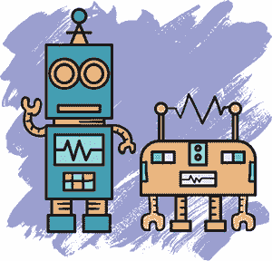

## 机器人抢劫：创建规则和障碍

在本章中，你将从头开始构建*机器人抢劫*游戏。你将制作两个机器人对象，玩家可以用它们来通过每个关卡。你还会创建背景和其他物体，如箱子、枪支和面板。你将使用 PuzzleScript 规则使这些物体以有趣的方式相互作用。

回想一下第二章，在你的代码中的`RULES`部分，你可以编写指令，将一种物体转换成另一种物体。

### 机器人抢劫游戏的工作原理

在*机器人抢劫*中，两个机器人合作盗取数据银行。每个机器人都有不同的能力，因此玩家需要在它们之间切换来解决难题。游戏中有需要避免的安全机器人和激光，还有需要偷走的宝藏。你可以在*[`tinyurl.com/robotheist/`](http://tinyurl.com/robotheist/)*找到这个游戏。游戏是这样的。

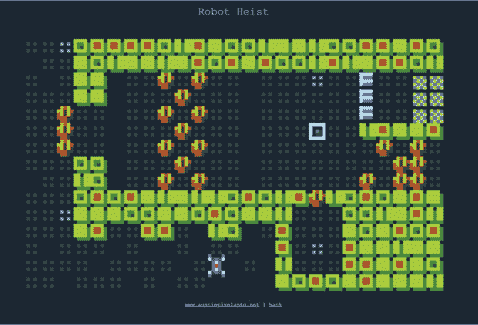

*机器人抢劫示例关卡*

游戏开始时只有一个名为 Vertibot 的机器人，因为我们希望玩家在引入第二个机器人之前先学会基础操作。Vertibot 可以垂直推动物体（上下）。在游戏的后期，玩家将遇到另一个名为 Horibot 的机器人，它可以水平推动物体（左右）。为了充分利用它们不同的推动能力，玩家必须让 Vertibot 和 Horibot 合作来解决游戏中的难题。

### 头脑风暴物体和互动

在我开始制作*机器人抢劫*游戏之前，我仔细考虑了我想在游戏中加入哪些物体。我不只是想要酷炫的物体：我想要那些能够以引人入胜的方式相互作用的物体。选择游戏的物体就像选角，剧中如果没有角色互相对话，那将非常无聊。

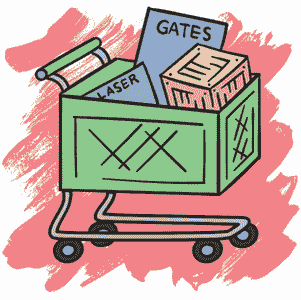

我构思的物体包括机器人（玩家角色）、可以推动的箱子、可以开关的门、安全激光和巡逻警卫机器人。这些物体之间的互动如下：

**机器人（玩家角色）** 机器人可以推动箱子并开关门。他们需要避免激光和警卫。

**箱子** 机器人可以推动箱子来阻挡激光或保持门打开。箱子也可以阻挡警卫，因此机器人可以把箱子放在警卫的路径上来迷惑警卫。

**门** 机器人和警卫可以开关门。箱子可以用来保持门打开。门关闭时会阻挡激光，打开时则让激光通过。

**激光** 激光会抓住试图穿越的机器人，但机器人可以用箱子或门来阻挡激光。警卫也能阻挡激光，因此机器人有时可以趁警卫阻挡激光时悄悄通过。

**警卫** 警卫可以开关门或阻挡激光。警卫可以抓住机器人，因此机器人应该避开它们。机器人可以用箱子来阻挡警卫的路径。

这是我的角色阵容！因为我可以让它们相互互动，所以我应该能够制作许多有趣的关卡。

### 入门

PuzzleScript 会记住你保存的最后 20 个版本，但之后的版本它会忘记。你可以点击窗口顶部的**加载**菜单查看已保存的版本。

在你开始一个新项目之前，一定要先复制前一个项目！最简单的方法是点击**共享**，就像你要分享游戏一样，并保存链接。当你点击该链接时，你应该能看到**hack**按钮，它可以让你再次访问游戏的代码。

**注意：**你也可以将所有代码复制并通过电子邮件发送给自己。点击**导出**按钮来创建一个游戏的 HTML 副本。要在 HTML 文件中找到游戏代码，可以用纯文本编辑器打开它。位于“sourceCode=”和“;compile”之间的文本就是你的游戏代码！将未格式化的代码复制并粘贴到一个免费的格式化工具中，比如*[`www.freeformatter.com/javascript-escape.html`](https://www.freeformatter.com/javascript-escape.html)*，然后点击**UNESCAPE**。你现在应该能看到完整的游戏代码。

在你备份了旧项目之后，就可以开始新项目了。点击**加载示例**▸**空白项目**从头开始创建一个新游戏。

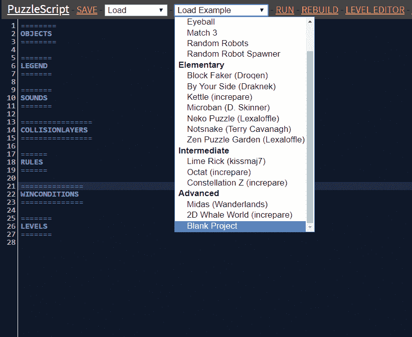

*创建一个新项目*

给你的新游戏添加一个标题和作者。你可以像这样在代码的开头添加它们：

```
title Robot Heist
author anna anthropy
```

请记住，标题和作者应放在代码的`OBJECTS`部分之前。现在你已经为你的新游戏命名，准备好开始向游戏中添加对象了。

#### 创建对象

对象是你代码中非常重要的一部分，因为它们概述了组成游戏的所有项目。每当你向游戏中添加新元素时，都会按照这些步骤在代码的`OBJECTS`部分为其创建一个对象。

1.  向`OBJECTS`部分添加一个对象，给它命名并指定外观。

1.  将对象添加到`LEGEND`部分，以便它能出现在关卡编辑器中。

1.  将对象添加到`COLLISIONLAYERS`部分。如果有对象没有碰撞层，PuzzleScript 就无法运行，因为它不知道如果这些对象接触到另一个对象该怎么办。

1.  编写规则，告诉 PuzzleScript 对象应该做什么。

首先，我们添加一些最基本的对象：背景和某种固体墙壁。

```
=======
OBJECTS
=======
Background
Green
Wall
LightGreen DarkGreen
00001
00001
00001
00001
11111
```

你的背景和墙壁可以像这些一样，或者你可以使用自己的颜色。请记住，如果你只给一个对象指定了颜色，而没有指定数字像素，那么这个对象就会呈现为一个单色方块。例如，在本章开头显示的示例关卡中，我将背景设置为`绿色`，而没有包含数字像素，这意味着它将是一个纯绿色。但我为墙壁列出了两种颜色：`浅绿色`和`深绿色`。然后我在下面使用数字网格来指定外层像素为深绿色，以便在浅绿色的内部周围形成一个边框。

在我们能使用这些对象之前，需要将它们添加到`LEGEND`部分。

#### 创建图鉴

向图鉴中添加一个对象会使它在关卡编辑器中出现，以便我们能够用它绘制。让我们将背景和墙壁添加到`LEGEND`部分，并为每个对象分配一个符号，如下所示：

```
=======
LEGEND
=======
. = Background
# = Wall
```

并非所有对象都需要出现在图鉴中。例如，有些对象在关卡开始时永远不会出现，因此我们不需要在关卡编辑器中显示它们。我们很快会制作一些这样的对象。

现在将你的新对象添加到`COLLISIONLAYERS`部分：

```
================
COLLISIONLAYERS
================
Background
Wall
```

请记住，只有当对象位于同一碰撞层时，它们才会相互碰撞。由于背景和墙壁对象位于不同的层（每个对象在自己的代码行上），它们可以共享相同的空间而不发生碰撞。这使得墙壁可以位于背景瓦片的上方，背景瓦片充当地面。

我们不需要为这些对象添加任何规则，因为我们只需要它们显示在屏幕上。我们从这一点开始添加的任何其他固体对象都需要与墙壁处于相同的碰撞层，因为墙壁应该能够阻止其他对象穿过它们。

既然我们有了基本的构建模块，是否就可以运行游戏了？不，别着急！PuzzleScript 不会让你运行游戏，除非它有一个玩家对象。我们来看看我们的两个玩家机器人是如何工作的！

### 玩家切换

想一想我们希望玩家对象做什么。我们想要两个机器人同时出现在屏幕上，但玩家一次只能控制其中一个。玩家可以随时在两个机器人之间切换。

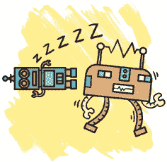

一种思考这种场景的方式是，始终只有一个机器人处于*醒着*状态，而另一个则处于*睡眠*状态。（就像《*Herding Cats*》中的猫一样！）当玩家按下*行动键*时，睡着的机器人醒来，醒着的机器人则进入睡眠状态。

我们可以编程设定行动键（X 键或空格键）执行我们希望的任何操作，玩家可以在游戏中按下它。在我们的游戏中，我们将使用行动键允许玩家在机器人之间切换。这意味着我们总共需要四个对象来完成这个疯狂的方案。因为我们有两个不同的机器人，每个机器人需要两种可能的状态：醒着或睡着。

我们的机器人还需要一些物品来推动，因此在创建四个机器人对象时，我们来制作一个箱子对象。使用以下代码将四个机器人对象和箱子对象添加到游戏中。

```
Vertibot
blue pink
.000.
.101.
.000.
.111.
.000.

VertibotSleeping
blue gray
.000.
.101.
.000.
.111.
.000.

Horibot
orange blue
.....
01010
00000
01110
.....

HoribotSleeping
orange gray
.....
01010
00000
01110
.....

Crate
yellow brown
00000
01110
01110
01110
00000
```

如你所见，我画的 Vertibot（垂直机器人）看起来又高又瘦，而 Horibot（水平机器人）则显得矮胖，这样可以很容易地区分它们。我让每个机器人的睡眠状态与醒着的状态不同，通过将睡眠中的机器人涂成灰色。玩家应该能仅通过颜色区分出哪个机器人醒着，哪个机器人睡着了。箱子是一个方形物体，周围有黄色边框，内部是棕色的。

#### 更新图鉴

现在我们需要将新对象放入图例中，以便在关卡中使用它们。我选择了字母 *I* 代表 Vertibots，因为它高且垂直，而 *H* 代表 Horibot。让我们更新 `LEGEND` 部分，如下所示：

```
=======
LEGEND
=======
. = Background
# = Wall
I = Vertibot
H = HoribotSleeping
* = Crate
```

我们现在添加到图例中的任何对象应该都会出现在关卡编辑器中。你可能会注意到我们只在图例中添加了两个机器人对象：醒着的 Vertibot 和睡着的 Horibot。原因是我们在关卡编辑器中绘制的是每个关卡的起始位置。换句话说，我们正在设计游戏开始时关卡的外观。每当一个关卡开始时，一个机器人应该是醒着的，另一个是睡着的。为了保持一致性，我决定在每个关卡开始时，Vertibot 总是醒着的，而 Horibot 总是睡着的。

PuzzleScript 不会让我们运行游戏，直到我们有了玩家对象。没有它，PuzzleScript 不知道在玩家按下按键时应该移动哪一个对象。幸运的是，图例允许我们定义组。你可以使用一个组来包含多个对象，然后用相同的名称引用它们。例如，我们可以创建一个名为 `Player` 的组，并通过将以下代码添加到 `LEGEND` 部分将两个机器人都添加进去：

```
Player = Vertibot or Horibot
```

通过编写 `Vertibot or Horibot`，我们指定只有一个醒着的机器人版本算作玩家。因为 `VertibotSleeping` 和 `HoribotSleeping` 不算作玩家，所以它们在玩家运行游戏时不会移动。

PuzzleScript 允许你在屏幕上同时拥有任意数量的玩家。但在我们的游戏中，两个机器人永远不会同时醒着。无论哪个机器人醒着，它都会充当玩家，并在玩家按下箭头键时移动。

#### 更新碰撞层

因为如果一个对象没有碰撞层，PuzzleScript 将无法运行，我们需要将所有新添加的对象放入 `COLLISIONLAYERS` 部分。我们希望机器人能撞到墙壁并能够推动箱子，因此我们应该确保机器人、箱子和墙壁都在同一个碰撞层上，如下所示：

```
================
COLLISIONLAYERS
================
Background
Wall, Vertibot, VertibotSleeping, Horibot, HoribotSleeping, Crate
```

目前，唯一应该放在单独碰撞层上的对象是背景，它位于自己的代码行中。保存你的游戏，然后点击**重建**以确保游戏中的所有内容正常运行。如果一切正常，游戏窗口下方应该会出现 `编译成功` 的消息。

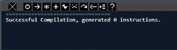

*编译成功信息*

如果代码出现问题，比如某些对象没有在 `COLLISIONLAYERS` 部分，或者你忘了将玩家添加到 `LEGEND` 部分，你可能会看到一个明亮的红色错误信息，类似于下面的样子。

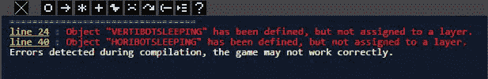

*编译错误信息*

我们已经完成了 `COLLISIONLAYERS` 部分的更新，现在让我们创建一个操作键，允许玩家在机器人之间切换。

#### 编写切换角色的规则

如前所述，我们可以编程让行动键执行任何我们希望的操作。按下 X 键或空格键都可以触发 PuzzleScript 中的动作。玩家可以选择他们更舒适的按键。玩家用方向键移动时，也可以使用行动键进行跳跃、拉开开关、戴上帽子，或执行任何当玩家按下行动键时规则定义的操作。

在我们的游戏中，行动键会通过唤醒一个机器人并让另一个进入睡眠来切换角色。请记住，直到我们编写规则告诉 PuzzleScript 该做什么之前，行动键不会有任何作用。所以让我们在`RULES`部分添加以下规则：

```
======
RULES
======
(switching characters)
[action Horibot] [ VertibotSleeping ] -> [ HoribotSleeping ] [ Vertibot ]
[action Vertibot] [ HoribotSleeping ] -> [ VertibotSleeping ] [ Horibot ]
```

PuzzleScript 会忽略括号内的内容，因此`(switching characters)`只是一个提醒我用的注释，帮助我在稍后查看代码时记得这部分代码的功能。

下方的两行代码会检查玩家按下行动键的时机，然后切换每个机器人的睡眠与清醒状态。在 PuzzleScript 中，行动键是基于条件的，类似于移动。例如，`> Horibot`代表一个正在移动的 Horibot，而`action Horibot`代表一个正在执行动作的 Horibot。

如果清醒的 Horibot 满足行动条件，它会变成`HoribotSleeping`，而`VertibotSleeping`则变成清醒状态的`Vertibot`。如果是`Vertibot`在执行动作，它就会进入睡眠状态，而清醒的 Horibot 则会醒来。

请注意，由于角色被分别放在不同的方括号中，它们不需要在彼此旁边才能使切换规则生效。在 PuzzleScript 规则中，我们使用一组方括号将物体组合在一起。一个方括号内有一系列用竖线分隔的物体，表示这些物体在关卡网格中是相邻的（例如，`[ Vertibot | HoribotSleeping ]`）。如果我们将两个物体放在一起*没有*使用竖线，意味着这两个物体共享同一个空间（例如，`[ Vertibot Background ]`）。我们稍后会详细讲解这种格式！

如果我们将一个物体放在它自己的方括号组里，另一个物体放在另一个方括号组里，这意味着这两个物体位于不同的网格空间中（例如，`[ Vertibot ] [ HoribotSleeping ]`）。它们可以相邻，也可以在关卡的不同位置。PuzzleScript 只检查它们是否在同一层级、同一时刻。

由于每个规则中都列出了这两个角色，它们必须处于相同的层级才能使切换规则生效。这意味着，如果只有一个角色在该层级，程序将忽略这些规则。如果我们想设计只有一个角色的关卡，这样的设计就很完美，正如我们在这个案例中所做的！

请注意，即使物体位于不同的位置，规则的左侧和右侧也需要有相同数量的物体。如果你输入了`[ Vertibot ] [ HoribotSleeping ] -> [ VertibotSleeping ]`，PuzzleScript 会给出错误信息。它不知道如何处理`HoribotSleeping`！

让我们花点时间确保我们写的规则有效。

### 构建测试关卡

为了测试我们的规则，我们将创建一个快速测试关卡，以确保目前为止游戏中的所有内容都能正常工作。在`LEVELS`部分输入以下文本：

```
======
LEVELS
======
#########
#.......#
#.I...H.#
#.......#
#...*...#
#.......#
#########
```

这个关卡包括了我们到目前为止添加的所有物体。从图例中回忆一下，`I`和`H`是机器人，`*`是箱子，`#`是墙壁，`.`是背景。点击**保存**，然后点击**运行**。现在，当你开始游戏时，应该能看到类似这样的画面。

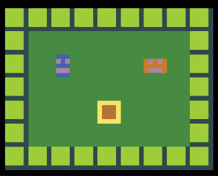

*测试关卡*

这个关卡看起来不如最终游戏中的美观，但目前我们只是想确保基本功能正常。尝试按方向键来移动角色，使用 X 键或空格键在它们之间切换。移动一个角色，切换到另一个，移动*那个*角色，然后切换回来。机器人应该不能穿过墙壁或箱子，因为它们在同一碰撞层上。

但我们不希望箱子仅仅停住机器人。我们希望机器人能够*推动*箱子！让我们添加一些规则来实现这个目标。

### 添加推动规则

这里有一些规则，允许两个机器人推动箱子：

```
(pushing)
horizontal [ > Horibot | Crate ] -> [ > Horibot | > Crate ]
vertical [ > Vertibot | Crate ] -> [ > Vertibot | > Crate ]
```

这个规则与我们在第一章的演示游戏中看到的规则类似，只是这次包括了`horizontal`和`vertical`。PuzzleScript 规则可以应用于四个不同的方向。我们可以通过给 PuzzleScript 指定特定的方向，如`left`或`right`或`down`，来指定规则应用的方向。在这个例子中，`horizontal`表示左右，`vertical`表示上下。这个规则告诉程序，移动的 Horibot 只能左右移动箱子，而移动的 Vertibot 只能上下移动箱子。

点击**保存**，然后点击**重建**。尝试推动箱子。每个机器人应该能够推动箱子朝两个方向移动：水平的左和右，或者垂直的上下。

#### 创建可推动物体的组

现在我们的机器人可以推动箱子了，但如果清醒的机器人能够推动正在睡觉的机器人怎么办？这将创造更多的团队合作机会，并减少交通堵塞。例如，如果睡着的机器人挡住了清醒的机器人的路，玩家就不必切换到睡觉的机器人来移动它，而可以直接将其推开。

在传奇中，我们使用一个组来告诉 PuzzleScript，Vertibot 和 Horibot 都算作玩家。同样，我们可以更新传奇，声明箱子和正在睡觉的机器人算作可推动物体。请注意，推送组是我们自己创建的。单词“pushable”对 PuzzleScript 来说没有任何意义，直到我们告诉它它的含义。在我们定义了推送组之后，我们可以编写规则，指示机器人推动所有可推动物体，而不仅仅是箱子。

在`LEGEND`部分添加这一行代码，告诉 PuzzleScript 箱子和正在睡觉的机器人都算作可推动物体。

```
Pushable = Crate or VertibotSleeping or HoribotSleeping
```

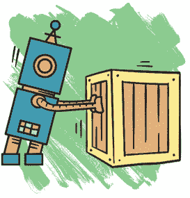

现在，当我们编写规则时，使用`Pushable`这个词，告诉 PuzzleScript 检查这三种物体中的任何一种。让我们回去修改之前编写的推动规则，使其检查可推动物体，而不是箱子。将所有`Crate`的实例替换为`Pushable`，使代码如下所示：

```
(pushing)
horizontal [ > Horibot | Pushable ] -> [ > Horibot | > Pushable ]
vertical [ > Vertibot | Pushable ] -> [ > Vertibot | > Pushable ]
```

一个正在朝某个物体移动的机器人，现在如果该物体被定义为`Pushable`（可推动物体），例如箱子和机器人正在睡觉的伙伴，它就可以推动该物体。点击**Rebuild**并尝试一下。当然，Horibot 只能水平推动正在睡觉的 Vertibot，而 Vertibot 只能垂直推动正在睡觉的 Horibot。

#### 允许角色推动多个物体

当你尝试将箱子推入一个正在睡觉的机器人，或者将一个正在睡觉的机器人推入箱子时，会发生什么？它会停下，你不能再推动它了。目前的规则只允许一个角色一次推动一个可推动物体。但是，能够推动物体的能力是每个机器人唯一的超级能力。所以只要在正确的方向，它们应该能够推动任意数量的物体。

为了允许机器人一次推动多个物体，请在`RULES`部分的现有推动规则下添加这一行代码：

```
(pushing)
horizontal [ > Horibot | Pushable ] -> [ > Horibot | > Pushable ]
vertical [ > Vertibot | Pushable ] -> [ > Vertibot | > Pushable ]
[ > Pushable | Pushable ] -> [ > Pushable | > Pushable ]
```

请注意，这个规则不是方向性的，因为 Vertibot 和 Horibot 已经有规则告诉它们可以推动的方向。记住，PuzzleScript 按从上到下的顺序运行规则，我们希望这个新规则发生在推动开始之后。该规则检查一个可推动物体是否被推向另一个物体，如果是，规则会告诉第二个可推动物体朝相同的方向移动。而且因为 PuzzleScript 可以多次运行每个规则，如果第二个可推动物体被推向第三个物体，那么第三个物体也会朝相同的方向移动，依此类推。现在我们的机器人可以推动任意数量的物体，只要有空间。

### 创建胜利条件

玩家如何才能在*机器人抢劫*关卡中获胜并进入下一关？我们可以通过定义胜利条件来指定这一点。在我们的游戏中，玩家在两个角色都到达出口时满足胜利条件，出口是关卡中的一个物理位置。

要将这个条件添加到*机器人抢劫*中，我们首先需要创建一个新的`Exit`对象，如下所示。

```
Crate
yellow brown
00000
01110
01110
01110
00000
.....

Exit
white black
01010
10101
01010
10101
01010
```

当机器人站在出口上时，关卡就完成了！我把我的出口做成了一个黑白棋盘格的旗帜样式。

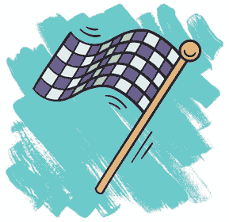

将 `Exit` 对象添加到你的 `LEGEND` 部分，像这样：

```
=======
LEGEND
=======
. = Background
# = Wall
I = Vertibot
H = HoribotSleeping
* = Crate
X = Exit
Player = Vertibot or Horibot
Pushable = Crate or VertibotSleeping or HoribotSleeping
```

当然，我使用了 `X` 来代表 `Exit`。

#### 将 Exit 添加到碰撞层

与我们向游戏中添加的每个对象一样，我们需要将 `Exit` 分配给一个碰撞层。但我们会将它放在与机器人不同的碰撞层上，因为我们希望机器人能站在出口上。你可以把出口想象成赛车道尽头地面上画的一种黑白棋盘图案。更新 `COLLISIONLAYERS` 部分，像这样：

```
================
COLLISIONLAYERS
================
Background
Exit
Wall, Vertibot, VertibotSleeping, Horibot, HoribotSleeping, Crate
```

`Exit` 的放置为其提供了一个独立的层，这意味着其他对象无法与它发生碰撞。事实上，`COLLISIONLAYERS` 部分列表中排得越靠前的对象，在游戏中的显示位置就越靠后。例如，游戏中的背景层是最靠后的。出口层位于背景层前面，固体物体（机器人和箱子）层则位于出口层前面。

现在我们准备编写赢的条件。它应该声明两只机器人都需要站在 `Exit` 对象上才能赢得关卡。我们可以试试类似这样的方法：

```
==============
WINCONDITIONS
==============
all Vertibot on Exit
all HoribotSleeping on Exit
```

但这个条件只在 Vertibot 清醒而 Horibot 睡着时有效。如果情况正好相反呢？或者如果只有一只机器人在关卡里呢？我们需要写一些更灵活的代码。

#### 为赢的条件创建 Buddy 组

幸运的是，我们也可以使用组来设置赢的条件。就像我们创建一个可推组来让箱子和睡着的机器人变成可推物体一样，我们也可以创建一个新的组，使得机器人无论是睡着还是清醒，都算作同一类物体。让我们通过添加以下行来更新 legend：

```
Player = Horibot or Vertibot
Pushable = Crate or HoribotSleeping or VertibotSleeping
Buddy = Player or HoribotSleeping or VertibotSleeping
```

请注意，因为 `Player` 已经包含了 `Horibot` 和 `Vertibot`，我们可以直接使用 `Player` 来创建一个新的组，叫做 `Buddy`，包含这两个机器人。现在，每当我们提到 `Buddy` 时，我们指的就是处于任何状态下的机器人，无论是睡着还是清醒。

让我们使用 `Buddy` 更新我们的 `WINCONDITIONS` 部分：

```
==============
WINCONDITIONS
==============
all Buddy on Exit
```

代码 `all Buddy` 指的是当前关卡中的所有 `Buddy` 对象。如果关卡中只有一个机器人，那么 `all Buddy` 就只表示那一个机器人。如果关卡中有两个机器人，`all Buddy` 就表示这两个机器人。因为处于睡眠状态和清醒状态的机器人都算作 `Buddy` 对象，所以它们的状态并不重要。只要当前关卡中的所有 `Buddy` 对象都位于 `Exit` 对象上，赢的条件就满足了。

还有一件事！为了确保两个机器人都能站到出口上，每个关卡需要至少有两个 `Exit` 空间。像这里这样，给关卡添加两个 `Exit` 空间：

```
======
LEVELS
======
#########
#.......#
#.I...H.#
#.......#
#...*...#
#X.....X#
#########
```

你可以在 `LEVELS` 部分的代码中添加两个 X，或者你也可以使用关卡编辑器添加 `Exit` 空间（查看第三章以了解如何操作）。更新后的关卡应该像这样：

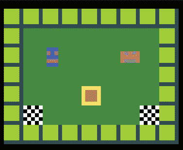

*为每个机器人创建出口*

既然我们已经创建了`Exit`对象并定义了我们的胜利条件，现在让我们通过创建开关门来让游戏更有趣。

### 制作开关门

我们决定制作可以开关的门，这样可以促进两个机器人的团队合作。因为这些门只有在机器人保持门打开时才会打开，所以一个机器人必须保持门打开，而另一个机器人则通过门。

门是我们游戏中的一个好点子，但它们到底是如何工作的呢？为了保持思路简单，你可以把门想象成一种可以开关的墙。当它开启时，它与机器人和其他固体物体在同一碰撞层上，起到墙壁的作用。但当它关闭时，它在另一个碰撞层上，机器人可以越过它。在关闭状态下，门更像是地板。

我们还需要某种触发器或开关来控制门的开关。你是否曾经看过电影，其中某人踩到地板上的隐藏面板，然后一个秘密通道打开，或者一堆毒箭从墙中射出？我们将借鉴这个想法，做一个触发开关面板，机器人可以踩上去打开门。这个方案是个不错的选择，因为它意味着其他固体物体，如箱子和警卫，也可以激活这些开关。当游戏发现面板上方有固体物体时，门将处于地板模式。如果没有物体在开关面板上，门将处于墙壁模式。

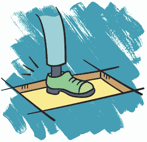

#### 创建门对象

我们已经确定了三种不同的对象，来让门工作。与每个机器人有两个版本（睡着和醒着）类似，我们也需要两个版本的门：开和关。我们将关闭版本放在与机器人相同的碰撞层上。打开版本将放在不同的碰撞层上。第三个对象是触发面板，用于打开门。

我们先从将这些对象添加到游戏中并描述它们的外观开始。

```
GateClosed
blue darkblue
00001
00001
00001
00001
11111

GateOpen
darkblue black
00001
00001
00001
00001
11111

Panel
blue
00000
0...0
0...0
0...0
00000
```

*创建门和面板对象*

当多个对象协同工作时，比如面板和门，最好让它们看起来相似。这样可以帮助玩家理解这两个对象之间的关系。在这里，我将`GateClosed`和`Panel`做成了相同的颜色，以便它们匹配。我还将`GateOpen`做成了蓝色，但使用了较深的色调，以便它与背景相似。这会让玩家知道他们可以通过它。

#### 将门添加到图例和碰撞层

现在我们需要将这些对象添加到图例中，这样我们就可以在关卡编辑器中使用它们。我选择了字母* T *（`T`）表示门，因为它看起来有点像栅栏，选择了斜杠（`/`）表示面板，因为它看起来像一个可以拉动的杠杆。

```
T = GateClosed
/ = Panel
```

我们不需要为开门设置符号，因为门会一开始就处于关闭状态，我们只定义了每个关卡的开始。

最后，我们需要将新对象添加到`COLLISIONLAYERS`部分。通过像下面这样更新`COLLISIONLAYERS`部分，添加高亮显示的对象：

```
Background
Exit, Panel, GateOpen
Wall, Vertibot, VertibotSleeping, Horibot, HoribotSleeping,
Crate, GateClosed
```

因为我们希望机器人能够踩在面板上或穿过任何开着的门，所以它们处于与机器人不同的层次。但我们希望机器人能与关门碰撞，因此`GateClosed`与机器人处于相同的层次。记住，碰撞层越接近列表的顶部，位置越靠后。这就是为什么我们需要确保机器人能够踩上的物体出现在代码中高于机器人，而不是低于它们。

#### 编写门的规则

现在，我们可以编写规则来告诉我们的面板和门该怎么做。那么我们的门是如何工作的呢？

+   面板上有固体物体意味着门是开着的

+   面板上没有固体物体意味着门是关着的

哪些固体物体可以激活面板？机器人，当然，还有箱子，所以机器人可以利用它们来保持门开着。让守卫操作面板也会很有趣。听起来我们需要一个新的组来包含所有可以激活面板的物体。让我们通过向图例中添加以下内容来定义一个新的组，称为`Depressor`（我称这个组为`Depressor`，是因为这些物体能够*压下*地板上的面板，而不是因为它们让人沮丧）：

```
Depressor = Player or Pushable
```

再次，我使用了两个已经定义的组来命名我想包含在`Depressor`组中的所有物体。第一个是`Player`，它包括两个机器人处于清醒状态的版本，第二个是`Pushable`，它包括两个机器人处于睡眠状态的版本，以及箱子。这很方便，因为如果我以后再引入一个可推动物体，我只需要更新`Pushable`组即可。由于`Pushable`组在`Depressor`组中，它将会自动更新！

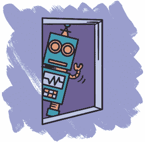

现在，让我们通过添加以下代码，将我们的想法转化为 PuzzleScript 可以理解的规则：

```
(gates)
late [ Panel no Depressor ] [ GateOpen ] -> [ Panel no
Depressor ] [ GateClosed ]
late [ Panel Depressor ] [ GateClosed ] -> [ Panel Depressor ]
[ GateOpen ]
```

第一条规则规定，当面板上没有压板时，开门应变为关门。第二条规则规定，当面板上*有*压板时，关门应变为开门。

回想一下我们如何检查两个物体是否相邻。例如，在`[ SleepingCat | WakerUpper ]`中，竖线表示这两个物体处于不同的空间，但紧挨着。若我们不使用线来分隔两个物体，这意味着它们处于同一个空间。所以`[Panel Depressor]`表示空间中包含一个面板和一个压板正踩在该面板上。类似地，`[Panel no Depressor]`表示该空间内有一个面板，但上面没有压板。自然，两个物体只有在它们处于不同的碰撞层时才能共享同一空间，这就是为什么我们在上一节中将面板和压板放在不同的碰撞层的原因。

当我们将两个单独的、括起来的项目放在一起时，比如 `[Panel Depressor]` 和 `[GateClosed]`，这意味着我们在寻找这两种状态同时出现在关卡中的任何地方，但不一定是紧挨着的。所以 `[Panel Depressor] [GateClosed]` 检查的是面板上的压制器 *无论在哪里* 和关闭的门 *无论在哪里*。如果这个条件满足，我们就把关闭的门变成打开的门。

完整的规则是 `late [ Panel Depressor ] [ GateClosed ] -> [ Panel Depressor ] [ GateOpen ]`。注意，在箭头的右侧，`GateClosed` 已经变成了 `GateOpen`，但是面板和压制器没有改变。我们不希望它们改变，所以为了告诉 PuzzleScript，我们在箭头两边都以相同的方式写它们。

另外，注意到这两个规则都是延迟执行的。你在第三章中学到，延迟规则是在移动后发生的，而不是发生在移动之前。因为我们希望门在机器人踩上面板后打开，所以我们将这个规则设置为延迟执行。

#### 测试门

让我们构建一个新的测试关卡，确保我们的门和面板按预期工作。我画了一个包含两个机器人、一个长门、一个面板和一个箱子的关卡，机器人需要推箱子到面板上，见下图：

```
###########
#.......T.#
#.i.....T.#
#.......T.#
#...*...T.#
#.......T.#
#.h.../.T.#
#.......T.#
###########
```

你可以手动在 `LEVELS` 部分输入这段代码，或者使用关卡编辑器。（按 **E** 进入编辑模式，然后点击角落的 **S** 按钮查看关卡的文本版。）

现在 *进行游戏测试*。游戏测试是尝试尽可能多的游戏功能，以确保它们能正常工作。尽量做你能想到的各种动作，看看代码如何处理不同的场景。想象你是一个侦探，小心翼翼地寻找隐藏的 bug。现在游戏中有一个 bug，你能找到吗？

为了找到这个 bug，让一个机器人站在面板上并保持门开启。接下来，将另一个机器人移到打开的门上方。

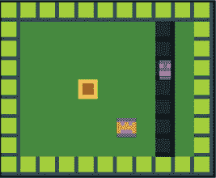

*保持门开启*

然后让两个机器人站在打开的门上。最后，切换回第一个机器人，让它从面板上走开。会发生什么？

*砰！* 机器人永远消失，因为关闭的门对象和角色对象处于同一个碰撞层。两个位于同一碰撞层的物体不能共享同一个空间，因此当开门变为关门时，机器人消失了。

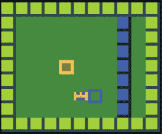

*寻找 bug*

为了修复这个 bug，我们需要告诉 PuzzleScript 做一些通常的操作，*除非* 在特定的情况下。在这个例子中，我们希望 `GateOpen` 变成 `GateClosed`，*除非* 上面已经有压制器。换句话说，当压制器在打开的门上时，门不应关闭，以防压制器消失。

让我们通过将 `[GateOpen]` 更改为 `[GateOpen no Depressor]` 来更新我们的规则，见下图：

```
(gates)
late [ Panel no Depressor ] [ GateOpen no Depressor ] ->
 [ Panel no Depressor ]
 [ GateClosed ]
```

更新规则为`[ GateOpen no Depressor ]`告诉 PuzzleScript，如果面板上没有压迫物，只有没有压迫物的打开门应该关闭，*除非*有压迫物站在上面。点击**Rebuild**重新运行游戏，尝试通过做之前导致机器人消失的相同操作来重现这个 bug。现在，当一个物体位于打开的门上时，门就无法关闭，即使另一个物体正在激活开关。但当打开的门上没有物体时，门应该关闭。

### 添加安全激光

现在我们已经创建了箱子和门，并编写了它们如何交互的规则，我们准备引入*安全激光*，这是机器人可以通过使用门和箱子避开的威胁！为此，我们将制作一把激光枪，每回合都会发射激光。如果激光击中机器人，玩家就会失败！但如果激光击中另一个固体物体，比如箱子或门，它会在那停止。

#### 创建激光物体

让我们从绘制物体开始。我们需要三个物体：

```
Gun
grey darkgray
..0..
.101.
00100
.101.
..0..

LaserVertical
red
..0..
..0..
..0..
..0..
..0..

LaserHorizontal
red
.....
.....
00000
.....
.....
```

激光枪（`Gun`）呈十字形，两个激光（`LaserVertical`和`LaserHorizontal`）是红色光束。垂直激光，顾名思义，上下发射，水平激光左右发射。

#### 将激光添加到图例中

由于我们只需要将物体添加到图例中，而这些物体只会出现在关卡的最开始，我们只需要添加枪，这些枪肯定会出现在关卡开始时。激光只在枪发射时出现，因此我们不需要在这里给它们一个符号。我用加号（`+`）表示枪，因为它本身也是加号形状的。

```
+ = Gun
```

在我们开始编写规则之前，你能想到需要加入图例的任何组吗？例如，创建一个用于阻挡激光的物体组会很有用，比如墙壁、关闭的门和箱子。我们将这些物体分到一个名为`Blocker`的新组中，如下所示：

```
Blocker = Wall or GateClosed or Crate or Gun
```

这行代码告诉 PuzzleScript，`Wall`、`GateClosed`和`Crate`都可以阻挡激光。我们在这里没有使用`Pushable`组，因为它包含了处于休眠状态的 Vertibot 和 Horibot，我们希望它们在激光击中时触发警报。需要注意的是，我们也希望`Gun`能够阻挡激光，因为我们希望激光从我们的枪口发射，而不是*穿过*它们。

由于我们有两种不同的激光，我们将它们添加到`Laser`组中，以便轻松引用这两种激光。这样应该更容易检查某物是否被激光击中。如果没有这个组，我们就必须做两个独立的检查，一个针对每种激光。

```
Laser = LaserVertical or LaserHorizontal
```

#### 将激光添加到碰撞层

现在让我们将新物体添加到`COLLISIONLAYERS`部分。

```
Background
Exit, Panel, GateOpen
LaserVertical
LaserHorizontal
Vertibot, VertibotSleeping, Horibot, HoribotSleeping, Crate,
Wall, GateClosed, Gun
```

我们将枪放置在与机器人可以碰撞的所有其他固体物体相同的层上。不同的激光位于不同的层上，因为我们希望激光束能够穿过固体物体。

请注意，每个激光都在自己的碰撞层上。原因是，如果它们在同一层上，垂直激光束就能阻挡水平激光，反之亦然！在现实生活中，激光只是光束，一束激光无法阻挡另一束激光，还是可以的？如果有科学家在读这篇文章，请告诉我！

#### 编写激光规则

我们创建的激光物体只是激光束的一小部分，足够大到只能在给定的关卡中占用一个格子。如果我们把它们排成一排，就会得到一个更长的激光。我们希望激光继续延伸，直到它们碰到一个`Blocker`。以下规则实现了这个效果：

```
(lasers)
horizontal [ Gun | no Blocker ] -> [ Gun | LaserHorizontal ]
vertical [ Gun | no Blocker ] -> [ Gun | LaserVertical ]
```

首先，我们需要让激光枪开火。激光枪会在没有被阻挡物挡住的方向发射激光束。PuzzleScript 会在四个方向（上、下、左、右）检查规则，除非你告诉它做其他设置。我们不希望水平方向的激光上下发射，或垂直方向的激光左右发射。所以，我们告诉 PuzzleScript 水平方向的激光水平发射，垂直方向的激光垂直发射，分别使用`horizontal`和`vertical`。

在这种情况下，`horizontal [ Gun | no Blocker ] -> [ Gun | LaserHorizontal ]`检查激光枪旁边是否没有阻挡物，如果为真，激光枪旁边的格子会变成水平激光束。我们用相同的思路来处理垂直激光束。

#### 测试激光

让我们回到`LEVELS`部分来测试我们的激光规则。通过更新代码，使其如下所示，来为测试关卡添加激光：

```
#############
#.......T...#
#.i.....T...#
#.......T.+.#
#...*...T...#
#.......T...#
#.h.../.T...#
#.......T...#
#############
```

我将激光放在门后面，这样我可以测试门是否像预期的那样阻挡激光。点击**重建**来运行游戏，你应该能看到类似下面的效果。

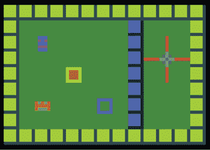

*带激光枪的测试关卡*

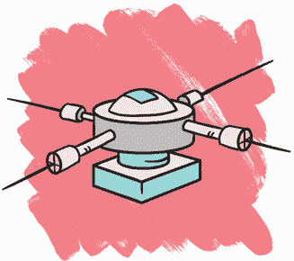

如你所见，激光会发射，但激光束只在每个方向上延伸一个格子。激光束太短了！我们需要添加一个规则，使得激光束会延伸，直到最终碰到一个阻挡物。PuzzleScript 中的所有物体都是相同大小的。为了创建一个更长的激光束，我们将把多个激光物体排成一行。我们需要添加一个规则来实现这个效果。

再次，我们将为垂直激光和水平激光创建独立的规则。如果每个激光在每个方向上都延伸，那会是*极其危险*的，正如你能想象的那样。相反，我们将水平激光向左右延伸，垂直激光向上下延伸。在现有的激光规则下面添加以下代码行：

```
(lasers)
horizontal [ Gun | no blocker ] -> [ Gun | LaserHorizontal ]
vertical [ Gun | no blocker ] -> [ Gun | LaserVertical ]
vertical [ LaserVertical | no blocker ] -> [ LaserVertical |
LaserVertical ]
horizontal [ LaserHorizontal | no blocker ] ->
[LaserHorizontal | LaserHorizontal ]
```

这些额外的规则会检查激光束旁边的空格。就像我们检查没有压力器的面板时使用`[ Panel no Depressor ]`一样，我们使用`[ LaserVertical | no blocker ]`来检查旁边没有阻挡物的激光。如果激光束旁边的空间没有阻挡物，我们就通过将`no blocker`替换为`LaserVertical`或`LaserHorizontal`来延伸激光到那个空间。但是如果该空间中有阻挡物，规则会在这里停止。

PuzzleScript 会重复执行一条规则，直到它停止，然后再继续执行下一条规则。因此，这条规则会在激光路径的所有相邻空间中继续执行，只要这些空间没有阻挡物。由于这条规则，激光束会从枪口水平和垂直方向连续射出。

要测试更新后的激光规则，点击**重建**并检查激光束是否延伸到墙壁上。同时，尝试使用面板打开大门。激光应该穿过打开的大门。

#### 修复激光 BUG

激光仍然存在问题。如果你离开面板，大门会关闭并阻挡激光，但激光束会继续穿过大门的另一边。

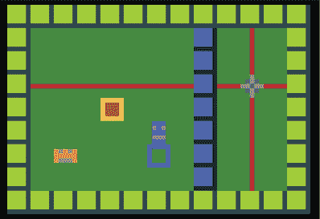

*测试关卡展示激光 BUG*


游戏设计过程通常包括向游戏中添加一些代码，检查它如何运行，进行一些小的更改，然后再检查一次。每次我们这样做时，都会离我们想要的游戏状态更近一步。在这种情况下，我们需要调整激光规则，以便关闭的大门能够完全阻挡激光束。

为了做到这一点，我们需要提醒自己 PuzzleScript 游戏中的每回合是如何进行的。每当玩家按下一个键（无论是方向键还是行动键），PuzzleScript 就会执行一回合。这是回合中发生的事情：

1.  PuzzleScript 会标记任何试图移动的玩家对象（在规则中，这看起来像`> Vertibot`而不是`Vertibot`）。

1.  PuzzleScript 会按照从上到下的顺序尽可能多次执行每条规则。

1.  任何标记为移动的对象都会移动。

1.  PuzzleScript 会尽可能多次执行所有*延迟*的移动规则，按从上到下的顺序。

我们当前规则的问题在于，当激光被阻挡物切断时，我们没有去除激光。让我们添加以下规则来解决这个问题：

```
(lasers)
[ laser ] -> [ ]
horizontal [ Gun | no blocker ] -> [ Gun | LaserHorizontal ]
vertical [ Gun | no blocker ] -> [ Gun | LaserVertical ]

vertical [ LaserVertical | no blocker ] -> [ LaserVertical |
LaserVertical ]
horizonta l [ LaserHorizontal | no blocker ] -> [
LaserHorizontal | LaserHorizontal ]
```

在这里，我们使用之前定义的`laser`组。这个简单的补充告诉 PuzzleScript，任何不再连接到枪的激光束应该消失。该规则还告诉 PuzzleScript，在激光束被关闭的大门阻挡后，将激光转变为空格以消除激光束。接着，PuzzleScript 会创建新的激光，将它们延伸出去，消除上一个回合剩余的激光。方括号表示空格，所以`[ laser ] -> [ ]`告诉 PuzzleScript 找到所有激光对象并将其移除。然后，我们会根据关卡的*当前*布局重新绘制激光。

点击**重建**并再次运行此测试！尝试几次站在面板上并离开。我们稍微接近了一些，但程序仍然有些问题。当机器人从面板上走下时，激光束*会*被切断，但这只会在下一回合发生！

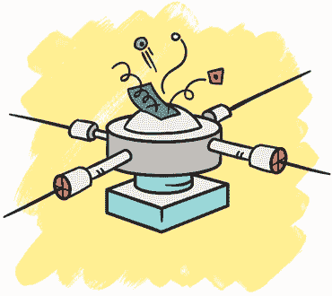

幸运的是，有一个简单的解决方案来修复这个延迟。在任何给定的回合中，PuzzleScript 会按顺序执行每个规则，然后对象根据规则移动。现在，控制激光的规则发生在机器人移上或移下面板*之前*。让我们确保这些规则发生在移动*之后*，我们可以通过简单地让激光规则在*稍后*执行来实现，如下所示：

```
(lasers)
[ laser ] -> [ ]
late horizontal [ Gun | no blocker ] -> [ Gun |
LaserHorizontal ]
late vertical [ Gun | no blocker ] -> [ Gun | LaserVertical ]

late vertical [ LaserVertical | no blocker ] -> [
LaserVertical | LaserVertical ]
late horizontal [ LaserHorizontal | no blocker ] -> [
LaserHorizontal | LaserHorizontal ]
```

还要注意，激光并不会立即发射。它们会等你走完一步后才会发射。要让激光立即开始发射，只需在你的 PuzzleScript 代码的最开始，在游戏名称下添加 `run_rules_on_level_start`，如下所示：

```
title Robot Heist
author anna anthropy
run_rules_on_level_start
norepeat_action
```

你可能已经注意到，当你按住操作按钮切换角色时，选择会迅速闪烁。`norepeat_action` 命令确保无论你按住多长时间，操作按钮只会切换一次角色。

完成后，尝试以下挑战。

### 挑战任务

尝试制作四种不同的激光，每种激光只能朝一个方向发射：上、下、左和右。

在完成的*机器人劫案*游戏中，有两种类型的门和面板，粉色和蓝色。还有一些门，在压制器踩到面板时关闭，而不是打开。看看你能否在自己的游戏中实现这种效果！

如果你需要帮助，尝试点击*机器人劫案*中的**hack**链接（*[`tinyurl.com/robotheist/`](http://tinyurl.com/robotheist/)）查看这个代码是如何工作的。

### 你学到了什么

到目前为止，你已经成功创建了*机器人劫案*游戏的基本构建模块，包括玩家将用来在关卡中导航的两个机器人对象、提供背景的墙壁以及其他物品，如箱子、枪支和面板。你学会了为这些物品编写规则，使它们以有趣的方式相互作用。你还创建了激光等障碍物，其中一些物品可以阻挡它们。但现在，我们的激光并不是真正的威胁，因为它们什么都不做。

在下一章中，你将探索游戏设计中*失败*的概念，并学习如何为玩家提高游戏难度。你还将通过创建自动移动的障碍物来探索 PuzzleScript 的“实时”模式。到时候见！
