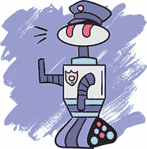

## 5

机器人抢劫：失误的后果

现在我们的游戏中有了激光，危险成为一种可能性，这意味着玩家有可能*失败*。在游戏中，失败意味着什么？

在 *放养猫咪* 中，玩家可能会卡住，不得不重新开始关卡，那就是一种失败的表现。在这种情况下，当玩家犯错时，他们需要重新尝试。所以，可以把失败看作是玩家学习的一个过程。每次玩家犯错，他们就学到下次不该做什么。当我们思考如何让激光工作时，也使用了同样的思维方式。一款好的游戏总是清晰地告诉玩家他们做错了什么。

所有游戏都需要让玩家失败吗？完全不！有些游戏只是关于探索、讲故事或者抚摸狗。抚摸狗的体验能失败吗？在某些情境下，失败是没有意义的。


*机器人抢劫* 则是关于尝试在不被发现的情况下闯入银行。被抓住的可能性让游戏变得更加激动人心和紧张。由于玩家如果不小心可能会失败，因此当他们成功时，也会有种自己智胜游戏的感觉。面对挑战给玩家提供了克服障碍的机会，这可以激励他们击败游戏。我们来看看如何让失败看起来像是失败。

### 被抓住

在 *机器人抢劫* 中，被抓住是什么样的呢？记住，失败是犯错并从中学习的过程。我们应该确保当玩家失败时，他们明白自己犯了什么错，并理解这个错误是什么。只有这样，他们才能从中学习。

点击**重建**并尝试让机器人穿过激光。会发生什么？*什么都不发生！*

我们需要决定当激光击中机器人时，失败的表现和声音是什么样的。或许当机器人触发安全激光时，应该响起警报？我们可以播放警报声来提醒玩家他们做错了什么。

玩家还需要知道自己做错了什么，以便能够改变策略。我们会通过让他们在被捕时停下来来让玩家意识到这一点。这样，如果他们是在踩到激光时被捕，玩家就能看到*那*是错误所在。我们将把两个机器人都变成红色（因为他们是*当场被抓住*的），以显示他们无法再移动。即使只有一个机器人被发现，当警报响起时，两个机器人都会被抓住。

我们需要在游戏中添加两个新对象，作为每个机器人被捕后的红色版本，如下所示。

```
VertibotCaught
red darkgray
.000.
.101.
.000.
.111.
.000.

HoribotCaught
red darkgray
.....
01010
00000
01110
.....
```

`VertibotCaught` 和 `HoribotCaught` 只是将 `Vertibot` 和 `Horibot` 变成了红色。我们不需要担心将这些新对象添加到图例中，因为机器人永远不会在已经被捕获的状态下开始游戏：那将是一个非常难赢的游戏！

让我们思考一下，是否可以在此时将一些组添加到图例中，以便更容易编写我们的规则。如果醒着的机器人走进激光，睡着的机器人也应该被抓住。因此，不管机器人是醒着还是睡着都不应该有影响。让我们创建一些组，让我们能够引用每个机器人，而不管它们处于什么状态。

将这两个组添加到`LEGEND`部分：

```
Vbot = Vertibot or VertibotSleeping
Hbot = Horibot or HoribotSleeping
```

我们将这些组命名为`Vbot`和`Hbot`，因为`Vertibot`和`Horibot`已经被使用了；它们指的是醒着的机器人。在这里，我们告诉 PuzzleScript，`Vertibot`和`VertibotSleeping`算作`Vbot`，而`Horibot`和`HoribotSleeping`算作`Hbot`。现在我们可以使用`Vbot`和`Hbot`来检查机器人是否被抓住以及它们是否醒着。

接下来，我们需要一个警报声音。

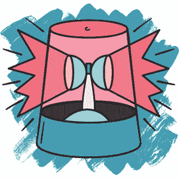

#### 添加声音效果

我们的“你被抓住了！”的声音不需要完全像警报，但它*应该*听起来很有威胁感！当玩家听到这个声音时，他们应该立刻意识到有*麻烦*发生了。点击声音效果按钮直到找到你喜欢的声音（试试*、:(或?按钮）。然后将声音复制并粘贴到脚本的`SOUNDS`部分。或者，你可以复制下面显示的数字：

```
=======
SOUNDS
=======
sfx0 72277508
```

在 PuzzleScript 中，每个声音都是一组数字。在使用它之前，我们必须给声音命名。我们将这个声音命名为`sfx0`，当我们将这个名字添加到规则中时，声音就会在规则运行时播放。

#### 将被捕获的机器人添加到碰撞层

现在我们准备将被捕获的机器人对象放到碰撞层上。试着自己完成这一步！确保它们与其他机器人对象在同一碰撞层上。

点击**重建**，为了安全起见，请确保没有错误！如果你忘记将新对象添加到`COLLISIONLAYERS`部分，你可能会看到类似下面的错误信息：

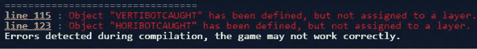

*错误信息*

通常，错误信息会告诉你忘记做了什么。在这种情况下，很明显错误是由于对象没有分配到碰撞层所导致的。如果你看到这个错误，进入`COLLISIONLAYERS`部分，确保将对象添加进去！

#### 编写被捕获的规则

让我们编写一些规则，让机器人在触碰到激光时变成被捕获的状态。请记住，你可以通过将两个对象都放在方括号中并且不使用竖线分隔来表示它们在同一空间中。因为无论机器人是醒着还是睡着被抓住都没有关系，所以我们将简单地使用我们之前创建的`Vbot`和`Hbot`组。在`RULES`部分的现有代码下方添加以下行：

```
(getting caught)
late [ Vbot Laser ] -> [ VertibotCaught ] sfx0
late [ Hbot Laser ] -> [ HoribotCaught ] sfx0
```

这些规则被标记为*晚*，因为我们希望它们发生在机器人走进激光之后，而不是之前。确保在每条规则的末尾加上`sfx0`，这样当规则执行时，你的酷炫音效就会播放。

点击**重建**并尝试程序。当你将一个机器人移入激光时，它应该像这样变红。

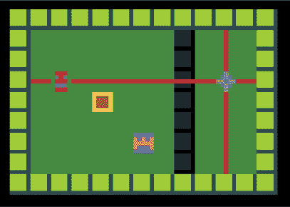

*测试被抓住的规则*

尝试使用一个机器人推另一个正在睡觉的机器人进入激光。睡着的机器人应该在接触到激光束时也变红。因为根据规则，角色的被抓状态不算作玩家，所以它们变红后，你不应该能够移动它们。*当场被抓！*

现在，只有触碰到激光的机器人会被抓住。但我们希望它们都被抓住，即使只有一个犯错了。让我们添加一个规则，确保两个机器人都会被抓住。

```
(getting caught)
late [ Vbot Laser ] -> [ VertibotCaught ] sfx0
late [ Hbot Laser ] -> [ HoribotCaught ] sfx0
late [ VertibotCaught ] [ Hbot ] -> [ VertibotCaught ] [ HoribotCaught ]
late [ HoribotCaught ] [ Vbot ] -> [ HoribotCaught ] [ VertibotCaught ]
```

有了这个规则，当 PuzzleScript 检测到`Vertibot`被抓住时，`Horibot`也会被抓住，反之亦然。因为你在箭头的同一侧使用了两个不同的方括号对，所以这两个对象可以出现在房间的*任何地方*。回想一下，当我们早先编写切换规则时，两个对象各自拥有方括号意味着它们不需要靠在一起。这个规则确保了如果警报响起，机器人在哪里都无关紧要：它们都会被抓住。

点击**重建**来测试这个新规则！现在两个角色应该同时被抓住。

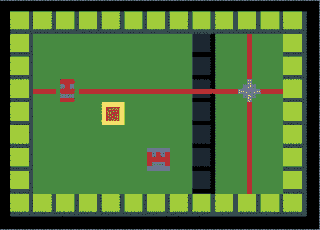

*两个机器人都被抓住了*

你可以看到，当`Horibot`触发警报，穿过激光时，`Horibot`和`Vertibot`都会变红，表示它们被抓住了。

但是请注意，发生了一些奇怪的事情。角色被抓住了，但你也收到了`Win Condition Satisfied`（获胜条件满足）消息，关卡结束了！这正是我们不希望发生的情况。赢得胜利是与失败相反的！为什么我们会*赢*而不是失败呢？

#### 更新获胜条件

让我们再戴上侦探帽，弄明白为什么当`Vertibot`和`Horibot`被抓住时，获胜条件会被满足。由于 PuzzleScript 给了我们`Win Condition Satisfied`（获胜条件满足）消息，也许我们应该检查一下`WINCONDITIONS`部分，它现在看起来是这样的：

```
==============
WINCONDITIONS
==============
all Buddy on Exit
```

我们的`Buddy`组目前包含`Horibot`、`Vertibot`、`HoribotSleeping`和`VertibotSleeping`。回想一下，`all Buddy on Exit`意味着屏幕上的所有伙伴，不管有多少，都应该在`Exit`对象上，玩家才能完成这一关。即使屏幕上*没有*伙伴，`Buddy`分组也应成立。问题是，当`Vertibot`和`Horibot`变成`VertibotCaught`和`HoribotCaught`时，它们不再算作伙伴，因为`VertibotCaught`和`HoribotCaught`不属于`Buddy`组。

这意味着当机器人被捕时，没有任何对象可以满足胜利条件。而且，由于没有不在出口处的伙伴，PuzzleScript 就认为胜利条件已满足。计算机比我们更有逻辑性，但它们远没有我们聪明。当 PuzzleScript 检查胜利条件`all Buddy on Exit`时，它会确保除了出口外，任何地方都没有伙伴。如果完全没有伙伴，那么在 PuzzleScript 看来，屏幕上的所有伙伴（也就是零个！）都在出口上。

幸运的是，我们的游戏中可以有多个胜利条件。让我们在`WINCONDITIONS`部分添加新的胜利条件，指定当两名机器人都被捕时玩家不能获胜，如下所示：

```
all Buddy on Exit
no VertibotCaught
no HoribotCaught
```

代码`no VertibotCaught`检查关卡中是否没有`VertibotCaught`对象。要赢得关卡，所有胜利条件需要同时满足，因此，如果 PuzzleScript 发现任何被捕的机器人，即使它们都在出口处，关卡也无法获胜。

这个新的胜利条件应该可以正常工作（试试看！）。不过，我们可以通过创建一个包含被捕机器人的小组来进一步简化这个条件，我们将其命名为`Trouble`。将这行代码添加到`LEGEND`部分：

```
Trouble = VertibotCaught or HoribotCaught
```

所以我们将通过`no Trouble`来结束关卡。如果玩家能够将两个伙伴都带到出口而没有遇到任何`Trouble`，则获胜。现在我们可以利用`Trouble`小组来简化我们的`WINCONDITIONS`部分代码，像这样：

```
==============
WINCONDITIONS
==============
all Buddy on Exit
no Trouble
```

现在我们已经编写了机器人如何与激光互动，以及这如何影响游戏结果的规则，接下来让我们加入更多的威胁，来让我们的游戏更有趣。

### 添加机器人守卫

我们将在游戏中加入第二个威胁——机器人保安，它们会巡逻数据银行。如果机器人守卫发现了 Vertibot 或 Horibot，玩家将失败！

挑战在于让守卫自己行动，因为编程这一过程可能非常复杂。你玩过*捉迷藏*吗？找到你朋友的位置需要做出很多决策。你可能知道你所在区域里最好的藏身点。你了解你的朋友，你知道哪个朋友总是通过选择最聪明的藏身点来让你吃惊。你记得你已经查看过哪些地方。有时你还会回头看看，以防有人悄悄从背后接近。人类可以综合所有这些信息来快速做出决策。那我们怎么可能编程一个像人类一样聪明的游戏守卫呢？

幸运的是，我们不必这么做，因为这只是一个机器人守卫。如果它遵循一个非常简单的模式也是可以的。事实上，如果守卫的行为是可预测的，可能会更好。例如，如果它反复走相同的路线，玩家就能预测它的路径并绕过它。如果守卫和真实人类一样聪明，我们的游戏将无法获胜。

我们可以编写最简单的代码来实现这种巡逻运动，即让守卫沿直线移动，然后在撞到墙壁时转弯。我们可以让它继续向前移动并保持转向，直到最终返回到起点并重新开始。

#### 创建守卫物体

让我们从创建物体开始。我们需要四个守卫物体：每个守卫可以移动的方向（上、下、左和右）各一个。我们从一个物体开始，当它撞到墙壁时，再将其转换成下一个类型的物体。使用四个不同物体的好处是，我们可以根据守卫移动的方向改变每个物体的外观。这样，玩家可以通过观察屏幕来看到守卫的移动方向。

让我们向游戏中添加四个新物体。

```
GuardUp
gray red
..0..
.010.
00000
00000
.000.

GuardRight
gray red
.00..
0000.
00010
0000.
.00..

GuardDown
gray red
.000.
00000
00000
.010.
..0..

GuardLeft
gray red
..00.
.0000
01000
.0000
..00.
```

我们将它们命名为`GuardUp`、`GuardRight`、`GuardDown`和`GuardLeft`。如你所见，红色像素应该向玩家指示每个物体可以移动的方向。

#### 将守卫添加到图例和碰撞层

现在我们需要将这些守卫添加到图例中。我们还需要为每个方向分配一个符号，以便我们可以使用它来选择守卫的起始方向。将以下代码添加到`LEGEND`部分的现有代码中：

```
8 = GuardUp
6 = GuardRight
2 = GuardDown
4 = GuardLeft
```

我选择这些数字作为符号，是因为它们在键盘数字键区（看起来像计算器部分）的位置。上箭头在 8 号键，右箭头在 6 号键，依此类推。当我在关卡中看到这些数字并忘记它们代表哪个方向时，我只需看一下键盘上的数字键区来提醒自己。

我们还将在图例中添加一个`Guard`组，这样我们就可以引用所有守卫物体，而不管守卫面朝哪个方向，像这样：

```
Buddy = Player or HoribotSleeping or VertibotSleeping
Guard = GuardUp or GuardRight or GuardDown or GuardLeft
Depresser = Player or Pushable or Guard
Blocker = Wall or GateClosed or Crate or Gun or Guard
```

请注意，`Guard`组应当在脚本中的`Depresser`组之前。原因是我们希望守卫能够像其他压板物体一样踩在面板上，并能作为阻挡物阻挡激光。在我们将`Guard`添加到`Depresser`和`Blocker`组之前，我们需要先告诉 PuzzleScript 守卫是什么。只有*那时*，我们才能告诉 PuzzleScript 守卫既可以是压板物体，也可以是阻挡物。

最后但同样重要的是，确保将所有四个守卫物体添加到碰撞层中。将它们放在与机器人以及所有其他固体物体相同的层上。然后点击**重建**以确保没有任何错误。

现在让我们编写使守卫巡逻的规则。

#### 编写使守卫向前移动的规则

守卫的运动有两个部分：它先向前移动，然后当它撞到墙壁时，向右转。

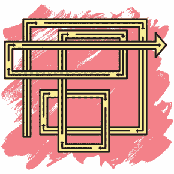

首先让我们通过向`RULES`部分添加以下内容来添加向前移动：

```
(guardbots)
left [ GuardLeft ] -> [ > GuardLeft ]
down [ GuardDown ] -> [ > GuardDown ]
right [ GuardRight ] -> [ > GuardRight ]
up [ GuardUp ] -> [ > GuardUp ]
```

每次转弯时，我们只需将守卫转换为移动中的守卫。由于这四条规则是有方向性的，`>`符号简单地匹配规则的方向。例如，`GuardLeft`总是向左移动，`GuardDown`总是向下移动，依此类推。

制作一个简单的测试关卡，检查这个脚本现在是否有效。确保你的测试关卡中包括所有四个对象，如下所示：

```
########
#..6...#
#......#
#..I..2#
#8..H..#
#......#
#...4..#
########
```

尝试玩一下你的关卡！你应该会看到类似的情况。

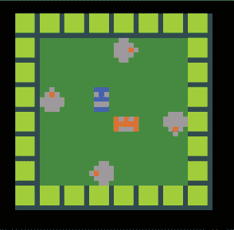

*守卫测试关卡*

如果你的守卫从你放置它们的位置前进一步，那是因为`run_rules_on_level_start`的作用！别担心——当我们稍后启用实时模式时，这不会是问题。守卫应该仅在玩家移动时才会移动。来回摆动玩家并观察守卫的行为。它们会向前移动，直到撞到墙壁。然后它们会卡住，因为我们还没有告诉它们碰到墙壁时该怎么办。让我们告诉它们在碰到东西后转向右边。

**注意：** 如果你收到“尝试访问一个不存在的关卡”的错误信息，请尝试点击**重新构建**并开始一局新游戏。

#### 编写向右转的规则

在我们让守卫转向之前，先在图例中定义一个新的组，名为`Obstacle`，用于所有可能阻碍守卫的物体。将以下内容添加到`LEGEND`部分：

```
Guard = GuardUp or GuardRight or GuardDown or GuardLeft
Obstacle = Wall or Crate or GateClosed or Gun or Guard
```

新的`Obstacle`组包括所有守卫可能撞到的固体物体。

现在我们可以添加规则，让守卫在碰到任何障碍物时转向。守卫每当碰到东西时都会顺时针（向右）转向。我们通过用另一个指向新方向的物体完全替换守卫来使其转向。要实现这一点，请将以下内容添加到`RULES`部分：

```
(guardbots)
left [ GuardLeft ] -> [ > GuardLeft ]
down [ GuardDown ] -> [ > GuardDown ]
right[ GuardRight ] -> [ > GuardRight ]
up[ GuardUp ] -> [ > GuardUp ]

[ > GuardLeft | Obstacle ] -> [ GuardUp | Obstacle ]
[ > GuardDown | Obstacle ] -> [ GuardLeft | Obstacle ]
[ > GuardRight | Obstacle ] -> [ GuardDown | Obstacle ]
[ > Guardup | Obstacle ] -> [ GuardRight | Obstacle ]
```

当守卫试图移动到障碍物上时，它会被转变成朝下一个顺时针方向的守卫对象。`GuardLeft`变成`GuardUp`，`GuardUp`变成`GuardRight`，`GuardRight`变成`GuardDown`，`GuardDown`变成`GuardLeft`。

请注意，我已经将规则分组，以便所有守卫同时向前移动，然后所有守卫同时转向，因为规则是按从上到下的顺序执行的。现在点击**保存**。要看看改变规则顺序时会发生什么，尝试将`[ > GuardLeft | Obstacle ] -> [ GuardUp | Obstacle ]`规则移到`up [ GuardUp ] -> [ > GuardUp ]`规则之前。然后尝试将规则分组，使每个守卫对象的移动和转向规则在一起。

```
(guardbots)
left [ GuardLeft ] -> [ > GuardLeft ]
[ > GuardLeft | Obstacle ] -> [ GuardUp | Obstacle ]

down [ GuardDown ] -> [ > GuardDown ]
[ > GuardDown | Obstacle ] -> [ GuardLeft | Obstacle ]

right [ GuardRight ] -> [ > GuardRight ]
[ > GuardRight | Obstacle ] -> [ GuardDown | Obstacle ]

up [ GuardUp ] -> [ > GuardUp ]
[ > GuardUp | Obstacle ] -> [ GuardRight | Obstacle ]
```

点击**重新构建**并尝试使用这个更新的代码玩游戏。你应该会发现其中一个守卫与其他守卫的行为不同。在这个例子中，`GuardLeft`在碰到墙壁后变成了`GuardUp`。但是由于代码的位置错误，`GuardUp`在转向后立即向前移动了一步，而不是像其他守卫一样在原地转向并等待下一步。这就是为什么在编写规则时，考虑规则执行的顺序非常重要的原因。当`GuardLeft`撞到墙壁时，它变成`GuardUp`并立即向上移动；而其他守卫在转向后需要等待一个回合才能移动。你能逐条阅读这些规则，看看为什么会这样吗？

在规则的早期，`GuardLeft`变成了`GuardUp`。但后面的规则将`GuardUp`向上移动。因为`GuardLeft`的转向规则发生在`GuardUp`的移动规则之前，所以守卫在同一回合内就转向并移动了！

点击**加载**菜单并返回到你上次保存的游戏。

#### 抓住入侵者

让我们创建一些规则，通过在`RULES`部分的 guardbots 区块中添加这两行，来让守卫真正地*抓住*Horibot 和 Vertibot：

```
(guardbots)
left [ GuardLeft ] -> [ > GuardLeft ]
down [ GuardDown ] -> [ > GuardDown ]
right [ GuardRight ] -> [ > GuardRight ]
up [ GuardUp ] -> [ > GuardUp ]

[ > Guard | Hbot ] -> [ Guard | HoribotCaught ] sfx0
[ > Guard | Vbot ] -> [ Guard | VertibotCaught ] sfx0
```

现在，如果一个守卫试图进入任一机器人，机器人会变成被抓住的等效状态，并同时触发警报声音。（我知道守卫是机器人守卫，但每当我提到“机器人”时，我指的只是 Vertibot 和 Horibot。）

注意，分组如何帮助我们编写更少的规则。`Guard`组包括四种不同的守卫对象，而`Hbot`和`Vbot`分别包括两个对象：机器人睡着和清醒的版本。如果没有分组，我们需要编写 16 个不同的规则来覆盖所有不同的组合！

点击**重建**来测试你的游戏。试着把一个机器人移动到守卫的巡逻路径前面。然后尝试把一个睡着的机器人放在守卫的巡逻路径前。当守卫撞到机器人时，机器人应该像走进激光时一样变成红色。

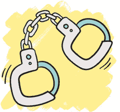

#### 测试守卫

之前，我们把守卫放在了`Depresser`和`Blocker`组中。让我们创建一些测试关卡来测试这些功能。

这是一个测试守卫如何与面板互动的关卡。

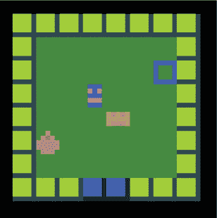

*测试守卫和面板*

因为守卫是一个“压下”器，所以当守卫移动到面板上时，门应该打开，而当守卫离开面板时，门应该关闭。如果你希望门保持打开更长时间，试着将多个面板排成一排，这样守卫就需要更长时间才能通过它们。

接下来，尝试制作一个关卡来测试守卫是否会阻挡激光。你能想出一个关卡，让机器人需要与守卫的行动配合，才能躲过激光吗？

作为最后的测试，让我们看看当守卫撞到死胡同时会发生什么。制作一个像下面这样的关卡。

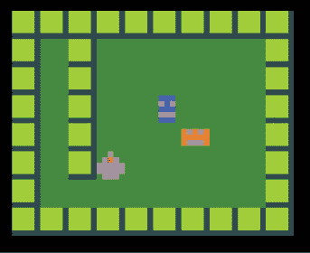

*测试守卫在死胡同中的表现*

当守卫撞到左上角的死胡同时，它会转向右边。接着它立即撞到另一面墙并再次转向右边。现在它应该开始向下走。当它返回到底部并撞到那里的墙时，你认为会发生什么？你应该会看到类似这样的情景。

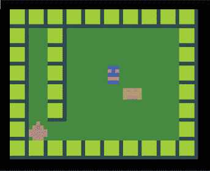

*守卫卡在死胡同路径中*

它应该再次转向右边，正如我们所要求的那样。它应该转身并开始向上走。这个守卫将会永远上下移动，不会返回到原来的巡逻路径。在你设计关卡时，请牢记这个例子，以免犯同样的错误！

### 实时模式

到目前为止，我们制作的所有游戏都叫做*回合制*游戏。在回合制游戏中，一位玩家进行一轮，然后下一位玩家接着进行一轮，就像在玩*跳棋*一样。在* Herding Cats *中，猫只在玩家移动时才会移动。

在*Robot Heist*中，我们希望角色能自动移动。目前，游戏中的保安只有在玩家移动时才会移动。但如果我们将游戏切换到实时模式，它们将会自己移动，即使玩家没有移动。实时模式指的是基于现实世界中已经过去的时间来控制游戏对象的移动，而不是基于玩家角色的移动。

实时模式与回合制游戏有什么不同？首先，存在一个*时间压力*的元素。即使玩家没有移动，守卫也在巡逻。这意味着玩家无法长时间坐着思考下一步该怎么走。就像在一次真正的盗窃中，玩家必须迅速思考和行动。它还有助于营造这些守卫有自己生活的感觉，超越了玩家的存在。毕竟，现实中的保安可不会等待入侵者的许可再行动吧？

#### 实时移动物体

让我们通过开启 PuzzleScript 的实时模式，让物体自动移动。我们可以告诉 PuzzleScript 我们希望物体多频繁地移动，比如每秒一次。然后，每经过一秒，PuzzleScript 就会运行所有规则，无论玩家是否已经移动。

要开启实时模式，只需在你的 PuzzleScript 代码开头添加以下一行：

```
title Robot Heist
author anna anthropy
run_rules_on_level_start
realtime_interval 0.2
```

`realtime_interval` 后面的数字告诉 PuzzleScript 游戏规则应多频繁运行，单位是秒。所以 `realtime_interval 1` 表示每秒运行一次。`0.5` 则表示每半秒一次，即每秒两次。我们的示例中是 `realtime_interval 0.2`，即每 0.2 秒运行一次，相当于每秒五次。

实时模式最好在添加 PuzzleScript 的一些可选功能时使用，比如`throttle_movement`和`norepeat_action`（后者在第四章中添加）。将它们都加在实时模式下方，如下所示：

```
title Robot Heist
author anna anthropy
run_rules_on_level_start
realtime_interval 0.2
throttle_movement
norepeat_action
```

`throttle_movement`功能限制玩家的移动速度。如果没有它，连续按下箭头键可能会让你比只按住箭头键时移动得更快。如果世界上所有事物都以和玩家相同的速度移动，这倒也没什么大不了的，但如果其他一切都按自己的速度运动，那就很重要了。如果游戏中的每个人物在玩家移动时都一起移动也没什么问题。但如果守卫按自己的速度行动，玩家就能通过快速按键比他们移动得更快。由于这款游戏是关于计划和策略的，而不是关于狂按按钮的，我们将使用`throttle_movement`来防止玩家通过狂按按钮来获胜。

没有`norepeat_action`时，按住动作键将会在两个机器人之间持续切换，这意味着很容易不小心切换次数比预期的更多。此外，`norepeat_action`确保玩家在重新按下动作键之前先松开它。添加这两个功能使得游戏更加用户友好。

点击**重建**，看守卫们如何运动！即使你的机器人没有移动，它们也应该开始独立移动，形成一个优美的同步芭蕾舞。

现在尝试移动机器人。*哇！*

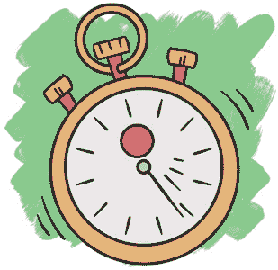

当你移动机器人时，你应该能看到守卫们会加速并且每当你移动时就会迅速移动！哇！这是怎么回事？

#### 检查静止的玩家

与正常调用回合（运行规则、然后移动对象、再运行延迟移动）不同，PuzzleScript 的实时模式每 0.2 秒就会调用一次回合。所以即使玩家没有按下任何键，守卫的规则也会被执行。但我们没有考虑到当玩家按下一个键时，PuzzleScript 仍然会调用回合。这意味着守卫每 0.2 秒独立移动一次，并且在玩家移动时*再次*移动。我们希望守卫独立于玩家移动，而不是在玩家移动时更快地移动。

我们需要让守卫每 0.2 秒*仅*移动一次，但*不*在玩家移动时移动。为此，我们只需要在尝试移动守卫时检查玩家是否处于*静止*状态。回到`RULES`部分的守卫移动规则，像这样在每个箭头的两侧添加`[ stationary Player ]`：

```
left [ GuardLeft ] [ stationary Player ] -> [ > GuardLeft ]
[ stationary Player ]
down [ GuardDown ] [ stationary Player ] -> [ > GuardDown ]
[ stationary Player ]
right [ GuardRight ] [ stationary Player ] -> [ > GuardRight ]
[ stationary Player ]
up [ Guardup ] [ stationary Player ] -> [ > Guardup ]
[stationary Player ]
```

添加`[ stationary Player ]`使得守卫仅在某个地方有一个静止（不移动的）玩家时才会向前移动。请注意，这不会改变玩家的任何行为。这些规则仅确保守卫每 0.2 秒移动一次，但*不*在玩家机器人移动时移动。

点击**重建**并尝试移动。无论玩家做什么，守卫的速度应该保持不变。

### 额外挑战：让它看起来更好

下面是我在《机器人抢劫》的完成版本中添加的一些额外细节，使游戏看起来更具吸引力。挑战按照难度排序。你能弄明白怎么编写这些脚本吗？如果你需要帮助，可以破解我完成的《机器人抢劫》游戏，看看我是怎么做的。

**挑战 1：让角色比一个单一空间更大** 如果你仔细观察《机器人抢劫》中的玩家机器人，你会发现它们稍微大于大多数 PuzzleScript 对象的 5 × 5 像素大小。事实上，每个玩家机器人是由三个独立的对象组成的，这些对象一起移动。

**挑战 2：随机化墙壁** 防止墙壁看起来过于相似的一种方法是创建一些稍微不同的墙壁对象。每当关卡开始时，每堵墙都会随机改变外观。这些墙壁的行为是相同的，但它们为关卡增添了视觉多样性。

**挑战 3：添加动画** 在实时游戏中，我们可以让物体随着时间变化而改变外观并进行动画处理。例如，坚固的金色超导体——机器人试图偷走的宝藏——通过在三个不同的物体之间切换，每个物体代表一个动画帧，闪闪发光。

**挑战 4：电线连接** 为了让玩家更容易将面板与它们控制的门连接起来，我画了从面板到门的电线。这些电线的工作方式与激光非常相似：在关卡开始时，玩家环顾四周寻找相邻的电线，并在它们之间画出连接。

### 你学到了什么

在本章中，你增加了*输掉*游戏的功能。你让激光和机器人守卫能够抓住玩家，为游戏增添了紧张感。你学会了什么是失败，以及为什么你可能想让玩家有输掉的可能性。你还让守卫实时移动，巡逻寻找机器人，而不是等待它们移动。

现在你拥有了一组完整的物体：机器人主角、可推的箱子、可以打开和关闭的门、安全激光以及巡逻的守卫。你准备将所有这些物体结合成充满动作的关卡。在下一章中，你将实现这一目标。
