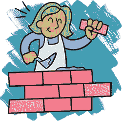

## 机器人抢劫：完善你的关卡设计

现在，所有的操作员都已到位，作为真正的策划者，你可以开始规划这次世纪大抢劫。你可以从前两章中建立的游戏开始，或者访问 *[`tinyurl.com/robotsneedlevels/`](https://tinyurl.com/robotsneedlevels/)*，找到一个已经完全编程的 *Robot Heist* 版本，等待你添加一些关卡！

### 头脑风暴故事

到目前为止，我们有了两个拥有不同能力的角色，还有一堆供他们互动的物体。我们如何让游戏感觉像是一场抢劫呢？在开始设计关卡之前，让我们先想想故事的结构。这些关卡将融入什么样的故事结构？当我制作 *Robot Heist* 时，我花了一些时间进行头脑风暴，提出了许多游戏的创意，并尝试只使用那些好的创意。

我们希望 Vertibot 和 Horibot 一起合作完成这次抢劫。我们如何将这一想法呈现给玩家呢？一种方法是让玩家一开始只控制一个机器人。如果玩家从 Vertibot 开始，他们会发现有些事情在找到 Horibot 之前根本无法完成。这在我们考虑难度时也很有意义。与此同时，管理两个不同的机器人可能会非常棘手。一开始让玩家只控制一个机器人，可以让他们在第二个机器人出现之前有时间掌握基本操作。

因为这是一次抢劫，让我们假设 Horibot 因为很久以前犯下的抢劫罪被关进了监狱。Vertibot 的第一个任务是 *将他救出去*。一旦他们重逢，他们就能完成最后的任务，*为一生奠定基础*。如果他们要偷的宝物是一个可以推动的物体，比如箱子，而且他们必须一起合作将它从银行带出去，这样他们就真的需要使用团队合作了！

现在我们对故事的整体框架有了一个大概的了解，让我们将其映射出来：

**第一章：越狱** Vertibot 独自闯入机器人监狱，救出 Horibot。

**第二章：银行劫案** 重逢后的 Vertibot 和 Horibot 一起合作闯入数据银行。

**第三章：逃亡** Vertibot 和 Horibot 找到了纯金超导体，并通过最大限度的合作将其带走。

好的，现在我们有了关于游戏如何开始的想法。在我们制作关卡之前，让我们看看关卡编辑器中有什么！

### 探索调色板

如果你从之前提到的 URL 加载了预编程的游戏，你可能会想知道关卡编辑器中的所有物体是什么。如果你正在制作自己的游戏，可以跳过这一部分。以下是 *Robot Heist* 关卡编辑器中的内容：


+   **守卫和激光枪**有四个不同的版本，每个版本朝不同的方向。

+   **地面**有三个不同的版本：普通、崎岖和空白。明亮的灰色崎岖地面会阻挡箱子被推到其上。而且，巡逻的守卫不会跨越空白地面，所以你可以利用它们来塑造守卫的路径。

+   **墙壁**有两种不同的颜色，纯粹是为了风格的原因。

+   **电线段**沿地面绘制电线（在我的关卡中，我用它们来绘制从门到开关面板的线路）。这些看起来像是点，但当它们与其他电线段相邻时，会形成一条连续的线。第一个电线段在普通背景瓦片上绘制一条线（包含四个点）；第二个在空白背景上绘制一条线（没有点）；第三个则绘制一条穿过墙壁的线。关于这些电线不用太担心。

+   **宝藏**是纯金超导体。如果一个超导体出现在关卡中，玩家只能通过让两个机器人*以及*超导体一起到达出口来完成关卡。

+   **门**有两种颜色：蓝色和粉色。它们也有两种状态：开启和关闭。不管门在关卡开始时是什么状态，把物体放到相同颜色的面板上会使门切换到另一个状态。（关闭的门会开启，开启的门会关闭。）

在这个版本的游戏中，Vertibot 总是从清醒状态开始关卡，而 Horibot 则从睡眠状态开始。这意味着你可以制作只有 Vertibot 的关卡，但无法制作只有 Horibot 的关卡。如果你想制作只有 Horibot 的关卡，你需要为他的清醒状态物体设计一个符号。

记住，这些只是图例中有符号的物体。现在你知道了这些物体的分布，我们可以开始制作一些关卡了！

### 创建你的第一个关卡

关卡设计的一个特点是它让玩家接触到所有重要的游戏元素。*机器人抢劫*有五个重要元素：切换机器人、推动箱子、打开门、避开激光和躲避守卫。我们能设计出介绍这些物体或概念的关卡吗？我们应该从哪一个开始？

好吧，门没有箱子就无法保持开启状态。而没有箱子来阻挡激光，你也走不远。看起来推动箱子是玩家需要理解的第一个概念，所以让我们从一个教会他们这一点的关卡开始。

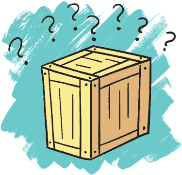

#### 引入新物体

因为我在游戏开始时只有 Vertibot，并且后续才引入角色切换，我希望我的第一个关卡能够介绍推动箱子的概念，并让玩家意识到他们只能垂直推动物体。

这样的关卡应该是什么样子的？先尝试自己设计一个吧。然后我会解释我是如何设计我的第一个*机器人抢劫*关卡的。在你尝试之前，别往下看！

你的关卡是什么样子的？它是否在教授玩家推动的同时，也让他们明确只能垂直推动物体？

这是我设计的内容。

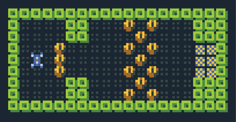

*水平关卡示例*

我尝试制作一个水平的关卡，其中物体看起来应该水平移动，但如果玩家尝试那样做，他们会发现自己做不到。为什么呢？还记得我们在第四章讨论过失败的重要性吗？通过尝试那些他们不能做的动作，玩家学会了游戏的规则！

这个关卡有两个主要部分：第一部分展示了一个玩家无法通过的门，直到他们推开箱子。这个部分只是为了引入垂直推箱子的概念。玩家在理解两个概念之前实际上无法进入关卡的第二部分：

+   他们可以推箱子。

+   他们只能垂直推箱子。

关卡的第二部分建立在前面理解的基础上。为了穿过那堵箱子墙，玩家需要通过垂直推箱子、水平移动，并重复这些动作直到穿越过去。这和他们在关卡开始时做的动作相同，但他们必须更加深思熟虑。好的关卡设计是先引入一个概念，然后再基于这个概念进行扩展！

退出方块位于屏幕的右侧。这是玩家第一次看到它们。他们怎么知道它们是关卡的目标呢？因为它们位于与玩家起始位置相对的屏幕另一侧！关卡形成了一条视觉路径，将玩家的视线从左侧的 Vertibot 起始位置引导到右侧的出口。这就是所谓的*构图*：稍后我会详细讲解这个概念！

#### 添加第二个概念

我们将在这个关卡中引入另一个基本概念。玩家想要推箱子的一个最重要原因是保持大门打开。让我们通过简单介绍大门来结束这个关卡。

现在，在这个关卡中会发生三个动作，从左到右：首先，玩家学会了垂直推箱子。其次，他们通过运用这一知识穿越障碍。第三，玩家遇到了一个只有当物体在面板上时才会打开的大门。解决方法是将一个箱子垂直推到面板上。关卡的每个部分都强调了同一个概念：垂直推箱子非常重要！

但是这个最后的动作有一些问题。玩家有可能被卡住，并不得不重新开始关卡。

如果玩家将最后一个箱子推下去，或者将它推到面板上方，箱子就会卡住。因为墙壁阻挡了玩家绕过去并从另一边推箱子，玩家也会被困住。他们必须重启关卡，当他们离关卡的终点如此接近时，这真的是一个很大的遗憾！有办法解决这个问题吗？

#### 创建颠簸的地面

为了解决卡住的问题，我为游戏创建了一个新物体，即本章前面提到的颠簸地板。这种地板会阻止箱子前进，但玩家仍然可以在上面行走。我们可以利用这些地板防止玩家将箱子推到墙壁上并卡住，无法再推动。

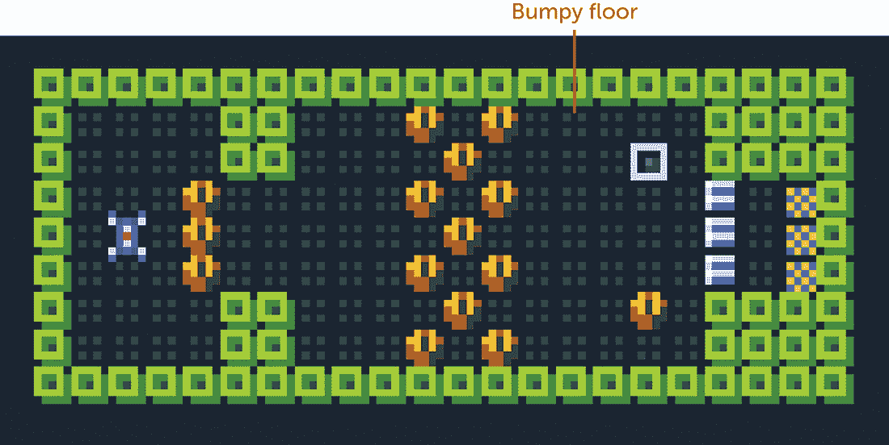

*颠簸地板的示例*

颠簸地板是带有明亮灰色点的瓷砖。如果你在游戏中还没有实现这些地板，它们非常容易制作。只需在`RULES`部分的其他推箱子代码行后添加这一行：

```
[ > Pushable | Gravel ] -> [ Pushable | Gravel ]
```

我将这个物体命名为`Gravel`（碎石）。如果玩家试图将任何东西推到`Gravel`物体上，它将取消该物体的移动。但是玩家仍然可以自由地走到它上面。

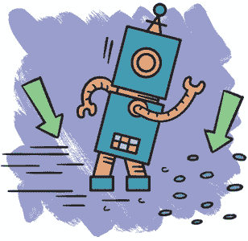

也许你会想，我之前花时间强调让玩家犯错和搞砸是很重要的，为什么在这里又要阻止玩家失败呢？这有几个原因：

+   这一部分关卡的目的是教会玩家面板和箱子是如何互动的。如果他们在箱子到达面板之前将其卡住，那他们什么也学不到。游戏看起来就像是坏掉了。

+   这是第一关，玩家仍在学习基础。以后，我们可以给他们更多犯错的空间。把这些颠簸地板看作是*训练轮*。在后续关卡中，当玩家已经知道自己在做什么时，我们可以去掉这些训练轮。

+   当玩家接近关卡的终点时搞砸，真的是一点也不好玩。

像这样添加“训练轮”只是让游戏玩法稍微变得容易一些，帮助玩家在熟悉基础操作时更加顺利。

### 改进你的第一关

作为关卡设计师，你应该始终试玩你的关卡，看看它们运作得如何，并找到改进它们的方法。第一关中的门部分还有改进的空间。为什么呢？因为我希望确保玩家能够学到关于面板和门的重要概念。了解面板只有在上面有物体时才会打开门是至关重要的。如果玩家站在面板上，门就会打开；当他们离开面板时，门会重新关闭。这就是为什么他们需要箱子的原因。

可是，如果玩家一看到箱子，就直接把它推上去，甚至不尝试先站在面板上呢？那样的话，他们会错过这个关键步骤和它所提供的信息。

有没有办法能让玩家更有可能先站在面板上，再把箱子推到面板上呢？为此，我把面板放在门前，箱子则放在一旁。现在，推箱子变成了一个谜题：玩家必须先将箱子推下去，然后绕过它再把箱子推上去。另一方面，面板就在眼前，玩家更有可能先去查看眼前的物体，而不是去尝试那个离得比较远的谜题。

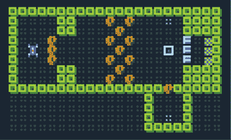

*引导玩家到面板*

总是试着思考玩家在你设计的关卡中会做什么。这很难，但尽量想象你自己在玩自己的关卡，第一次看到它们时，你可能会采取什么样的行动？你不一定会知道，这就是为什么让其他人玩你的游戏很重要；然而，你通常可以做出一些不错的猜测！

#### 为关卡赋予结构

一个关卡是玩家需要解决或探索的一系列挑战。但它也代表着一个虚构的地方，更不用说屏幕上的图像了。当我们作为关卡设计师思考时，应该同时考虑这些方面。我们的关卡是怎样的地方？它看起来是什么样的？

在*机器人抢劫*中，Vertibot 闯入一个高安全级别的机器人监狱，去营救 Horibot。我如何让一个关卡让玩家感觉像是*突破进入*的呢？

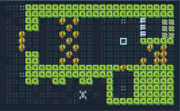

*完成关卡的结构*

在完成的关卡中，玩家一开始就在某个地方的外面！我把设计的关卡转化为一个更大建筑的一角，即机器人监狱。现在玩家从外面开始，必须突破进入才能完成关卡。

你可以把关卡看作是玩家看的图片。*构图*意味着不同画面元素的平衡以及它们之间的关系。为了让玩家感觉他们处于一个地方的外部，我花了很多心思在构图上。

#### 在关卡中创建区域

第一个关卡由两个 L 形组成：一个在外面，另一个在里面。外面的 L 形没有边界：它通向屏幕的边缘。里面的 L 形有很厚的边界：轮廓是两层墙的厚度。我还让外面的监狱墙看起来有点像城堡顶部的城垛。我希望它看起来像是为了防止人们进入而建造的东西。

我使用了一些其他的小技巧，让内外 L 形看起来不同。在外面，我使用了空旷的地板空间，让地面看起来斑驳不规则——想象一下山坡上的草地斑块。

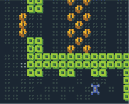

*不规则斑驳地板*

注意到地面最斑驳的地方是玩家所在的位置，然后它逐渐向机器人监狱的门口变得不那么斑驳。我想用地面引导玩家的视线，从他们的起始位置引导到他们需要去的地方。尽管外面的地面很斑驳，*内部*的地面却完全规则，就像银行大厅的地板一样。

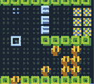

*常规地板图案*

我使用了另一种技巧，将无法水平推动物体和突破进入某个地方这两个主题联系在一起：有两条走廊通向关卡的外面，其中一条被箱子堵住。由于 Vertibot 只能垂直推动，它们被迫找到第二条通过的方式（箱子和门的谜题）。总是寻找方法，尽量用你的关卡讲述简单的故事！

我还在关卡前添加了一条消息，介绍了 Vertibot 角色，并给玩家一些指示：只要你是 Vertibot，你只能垂直推物体。

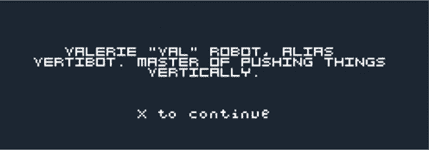

*给玩家指示*

这是完成的关卡！尝试玩一下完成的*机器人盗窃案*游戏的前几个关卡，网址是 *[`tinyurl.com/robotheist/`](http://tinyurl.com/robotheist/)*。你能辨认出每个关卡在教学什么以及如何教学吗？

### 为两个机器人设计关卡

第一个关卡是专为 Vertibot 设计的，但*机器人盗窃案*的核心主题是让两个机器人共同合作，通过挑战。你能设计一些关于团队合作的关卡吗？以下部分为你提供了一些可以作为起点的想法。

#### 基本的团队合作

这是一个非常简单的示例，展示了如何使用门来迫使合作：一个机器人只有在另一个机器人按住两侧面板之一时，才能通过这扇门。

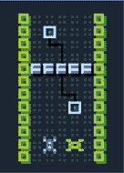

*轮流保持门开启*

让两个机器人通过，需要每个机器人轮流为另一个机器人撑住门。

#### 使用箱子

这是一个更复杂的示例：为了保持门开启，机器人们需要将箱子推到面板上。

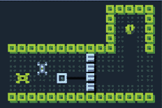

*到达箱子*

因为箱子位于面板的上方和右侧，所以每个机器人都需要推箱子并保持门的开启。注意，我使用了地面图案来展示从箱子到需要推送的位置的路径。

在下一个场景中，机器人必须更加紧密地协调他们的动作。

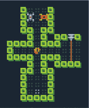

*与箱子共同工作*

Horibot 必须站在恰当的位置，当 Vertibot 将箱子推到他面前时，他才能推箱子。随着玩家在团队合作上越来越熟练，你可以设计需要更复杂协调的关卡。

#### 分开机器人

你觉得这个想法怎么样？在机器人学会合作之后，试着把它们分开！

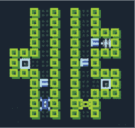

*机器人分开*

即使他们处于不同的区域，他们仍然需要通过开门和阻挡激光来互相照应。关卡设计的一个酷点是，一旦玩家认为他们已经掌握了所有机制，你就可以加入一些意外的变化，让他们保持警觉！

每个想法都是一个时刻，适合融入更大的层面。你能围绕这些想法构建哪些层次？你能提出不同的挑战吗？

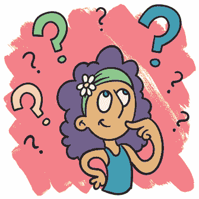

### 将所有内容汇总

在向玩家介绍了不同的物体之后，我们可以开始将它们组合起来。一个结合了激光和门的关卡是什么样的？如果是一个结合了箱子和守卫的关卡呢？

这是我制作的一个关卡，结合了激光、门和守卫。它是我做的第一个关卡之一，最终几乎没有改变地出现在了成品游戏中。

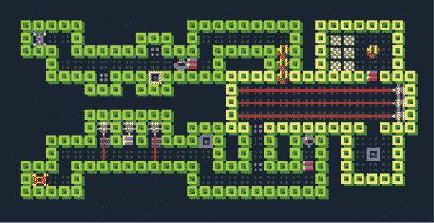

*一个包含激光、门和守卫的关卡*

在这个关卡中，守卫在它的房间内巡逻，走到蓝色面板上或从上面走开。当它站在面板上时，阻碍通往出口的门会打开。当它离开面板时，阻挡激光的门会打开，如果玩家站在错误的位置，就会被激光击中！这个关卡的重点是玩家利用正确的时机通过屏幕。

这个关卡只有在玩家已经学会了门、激光和守卫以及它们的工作方式之后才会生效。在你将这些物体组合在一起之前，你需要单独介绍每个物体；否则，玩家根本不会知道发生了什么。

### 你学到的内容

在本章中，你更深入地了解了关卡设计。关卡设计引入概念，构建这些概念，并以有趣且出乎意料的方式将它们结合在一起。一个关卡是由一系列挑战组成的，但它也是一个虚拟的场所和一个图像。当你作为关卡设计师思考时，应该同时考虑这三个角度。并且始终寻找让你的关卡更加有趣的方式。

这就是我们在*机器人抢劫*上花费的所有时间。如果你对后面的关卡长什么样感到好奇，可以在 PuzzleScript 编辑器中看看它们。记住，你可以按住 CTRL 键点击任何一个关卡，将其加载到游戏中。

你现在是一个 PuzzleScript 大师了！恭喜你！在接下来的最后一章，我将推荐一些其他值得一玩的 PuzzleScript 游戏，并提出一些游戏设计挑战供你尝试。
