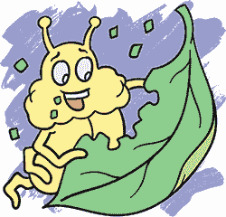

## 第二章：Leaf Me Alone！：Scratch 基础

Scratch 是一个制作动画、游戏和电影的好工具。在本书中，我们将专注于制作游戏，因此我们的项目将富有趣味并具互动性。Scratch 几乎是自给自足的：例如，如果你需要一个游戏角色，可以直接在 Scratch 中绘制它，或者上传你已有的图像。你还可以选择一个内置的 Scratch 角色。

我们将使用 Scratch 简单的基于块的编程语言来编写游戏的互动部分。Scratch 使用一种块状系统，表示不同的功能。它们像拼图一样拼接在一起，形成完整的代码行。

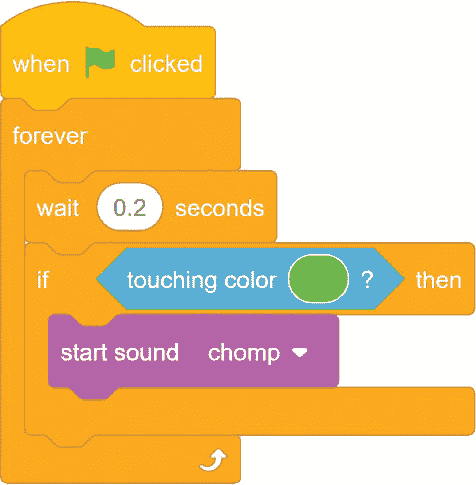

*Scratch 代码块如何拼接在一起*

这些代码块堆栈告诉你游戏中的物体该做什么。正如你将很快看到的，使用 Scratch 中的代码块非常简单。

### 入门 Scratch

首先，你需要注册一个自己的 Scratch 账号。它是免费的，注册后，你可以开始保存和分享你的游戏。在你的网页浏览器中，打开 Scratch 官方网站：[`scratch.mit.edu/`](https://scratch.mit.edu/)。

在 Scratch 网站上，点击右上角的**加入 Scratch**。系统会提示你填写电子邮件地址和一些个人信息。然后，你将收到一封电子邮件，要求你确认邮箱地址。检查你的收件箱并点击邮件中的链接。咻！你现在应该已经拥有了自己的 Scratch 账号。

*Scratch 主页*

如果你还没有进入 Scratch 编辑器，点击 Scratch 主页顶部的**创建**按钮。你将看到一个空白的白色框，里面有一只微笑的橙色猫，如下图所示。这个框就是游戏窗口，是编辑器中玩家唯一能看到的部分。那只猫就是你的第一个精灵。接下来我们来聊聊什么是精灵，以及你可以用它做什么。

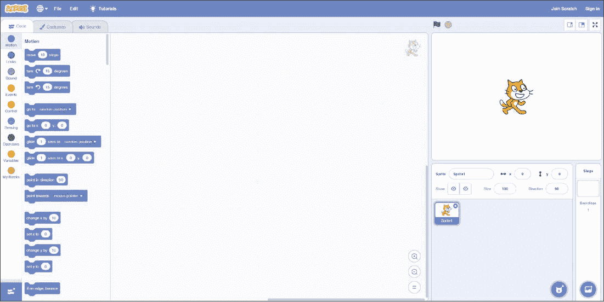

*打开 Scratch 编辑器*

那只橙色的猫是`Scratchy`，Scratch 的吉祥物。每当创建一个新的 Scratch 项目时，`Scratchy`都会自动包含在其中，旨在鼓励更多的人制作关于猫的游戏。

`Scratchy` 喜欢千层面吗？`Scratchy` 讨厌星期一吗？没人知道。但我们*确实*知道，`Scratchy` 是一个*角色精灵*，也就是 Scratch 游戏中的任何可以做某事的物体，比如改变外观或播放音乐。每个精灵都可以附加脚本、服装和声音。*脚本*是由一组拼接在一起的代码块组成的，告诉精灵该做什么。*服装*是精灵的一张快照或一帧，你可以用它来创建动画。例如，`Scratchy`现在的姿势就是`Scratchy`附带的两种默认服装之一。点击左上角的**服装**标签（位于代码和声音之间），查看`Scratchy`精灵的服装。

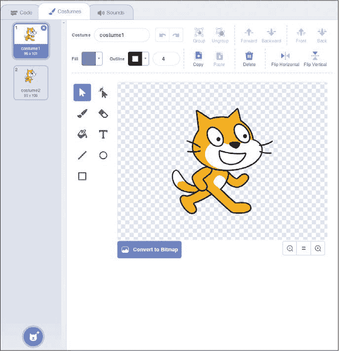

Scratchy *有两种服装*

当你像翻书一样点击一个然后再点击另一个，`Scratchy`应该看起来像是在走路。我们将使用服装来为精灵动画或改变它们的外观。

精灵还可以播放音效。例如，`Scratchy`附带了一种喵喵声。点击声音标签中的**播放**按钮听听看。

### *Leaf Me Alone*（我吃这片叶子时，请别打扰我）

我们将创建一个简单的 Scratch 游戏，名为*Leaf Me Alone (While I Eat This Leaf)*。它讲述了一只饥饿的小虫子，想吃一片叶子并且希望能独自享用。你可以先在* [`scratch.mit.edu/projects/117199134/`](https://scratch.mit.edu/projects/117199134/)* 上玩这个游戏，然后我们将一起制作它。

*探索* Leaf Me Alone *游戏*

点击绿色旗帜开始游戏。小虫子会自动向前移动！按左箭头或右箭头可以让虫子改变方向。当虫子吃到叶子时，它会留下咀嚼的痕迹。这只小虫子从不停止吃东西。当你想停止游戏时，点击右上角的红色停止标志。如果你再次点击绿色旗帜，游戏会重新开始。

看起来很简单吧？现在，让我们从*头开始*制作这个游戏！

#### 创建你自己的精灵

你需要为*Leaf Me Alone*游戏绘制*自己的*精灵。Scratch 的一个酷功能是，你可以使用鼠标为你的游戏绘制角色。然后，你可以给它们指令，让它们做不同的事情。即使它们画得乱七八糟或者不完美，也没关系。不要担心！

右键点击`Scratchy`并点击**删除**。*咔嚓！* `Scratchy`消失了。（你不会听到真正的*咔嚓*声，我是编的。）

接下来，看看游戏窗口下方的精灵列表。

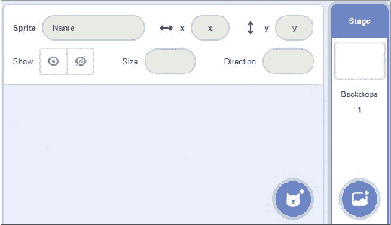

*打开精灵列表*

*舞台*，现在是一个普通的白色矩形，是游戏的背景。当你点击它时，它应该会被蓝色高亮包围。因为我们删除了`Scratchy`，所以现在舞台上没有精灵。让我们通过添加一个新精灵来修复这个问题！

将鼠标悬停在舞台下方的猫咪图标上，显示出四个按钮。点击**选择精灵**从精灵库中选择一个精灵。画笔按钮让你创建自己的精灵。惊喜按钮选择一个随机精灵，而上传按钮让你使用来自电脑的图片。

#### 绘制奇怪的虫子

让我们点击**画笔**为我们的游戏绘制一个精灵。然后点击**服装**标签。现在你进入了服装窗口，可以为你新的精灵绘制服装。

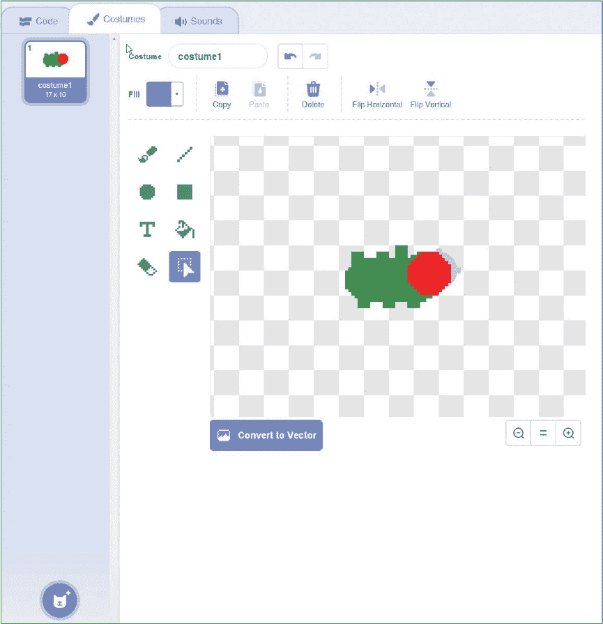

*为你的虫子绘制新服装*

在绘图区域的左侧是绘图工具菜单。确保选择了画笔工具。在绘图区域的顶部是颜色选择器。画笔图标右侧有一个数字，你可以更改它来控制画笔的大小。

我画了一个毛毛虫，但你可以画任何你喜欢的虫子。你应该在绘图区域中看到一个小的加号（+）。那是角色的中心点：把虫子的头画在那里，让它的头部大约和加号（+）一样大。

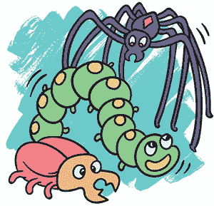

那只虫子真小！为了让绘图更容易，可以使用右下角的放大镜按钮进行缩放，这样你就能更清楚地看到虫子了。带加号（+）的放大镜可以放大，带减号（–）的放大镜可以缩小。你可以通过查看游戏窗口来看到角色在正常大小下的样子。

你可以随意设计你的虫子外观，但一定要确保它朝向右边。Scratch 会在虫子绕叶子走动时自动旋转它，但角色应该总是从朝向右边开始。所以，如果你想给虫子设计一个奇特的大屁股，确保它的屁股朝向左边，和头部的方向相反。

如果在绘制角色时犯了错误，点击撤销按钮，它是你绘图区上方的左箭头。这个按钮会撤销你刚才的操作。如果你决定不想撤销那个操作，可以点击重做按钮，它是绘图区上方的右箭头。

当你对虫子的外观满意时，再次查看舞台下方的角色列表。你的虫子应该出现在那里，但它会被命名为`empty`。这个名字对虫子来说并不合适，但你可以更改它。在舞台下方的角色字段中输入你新的名字。可以把它改成像`奇怪的虫子`或`我的完美创作`之类的名字。

#### 绘制背景

舞台和角色很像，它也有自己的脚本、服装和声音。舞台的服装叫做*背景*。你为舞台创建的任何图像都会成为整个游戏窗口的背景。你可以制作多个背景，并在游戏的不同时刻之间切换它们。例如，游戏的第一关可能发生在森林中，第二关可能发生在水下。对于*Leaf Me Alone*，我们只需要一个背景，因为只有一关。让我们现在就绘制它。

点击**舞台**（角色列表右侧的空白白色矩形）。舞台下方应该显示`1 个背景`字样。其下是一个蓝色按钮，带有舞台图标，它的功能和选择角色按钮一样。将鼠标悬停在上面会显示四个按钮，功能与角色按钮相同，但适用于背景。

我们不打算制作一个新的背景，而是直接在我们开始时使用的空白白色背景上绘制。如果你不在绘图窗口中，点击**背景**选项卡。现在让我们绘制游戏的背景：一片大大的多汁的叶子，供虫子食用。

如果你放大画面以绘制小虫，你可能仍然处于放大视图。点击两个放大镜中间的按钮 (**=**) 以恢复到正常视图。你应该能够看到整个背景。如果你能看到边缘的滑动条来滚动视图，这意味着你仍然处于放大状态。

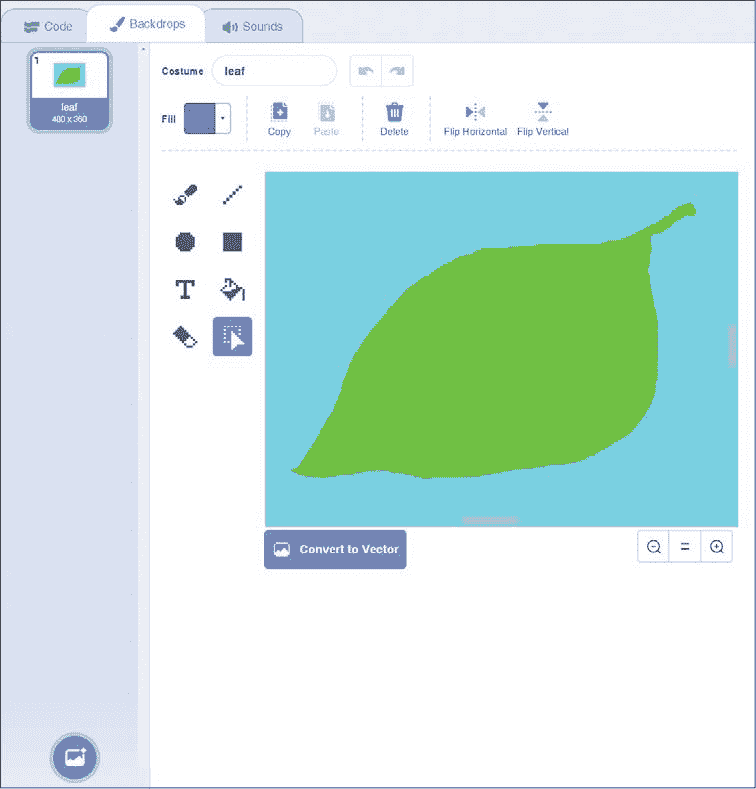

*绘制叶子背景*

我们将使用两种颜色来绘制这个背景：一种用于背景，另一种用于叶子。（我使用了天蓝色作为背景色，叶绿色作为叶子色。）现在使用两种颜色在这里非常重要，等你以后编写程序时，这一点会特别有用，所以现在不要添加更多颜色。你还可以通过点击文本框中的 `backdrop1` 来重新命名背景，并输入一个新的名称。

现在我们有了小虫和叶子，是时候让小虫动起来了。

#### 使用事件积木

点击 Sprite 列表中的小虫，然后确保你处于代码标签下。右侧的空白区域是我们将积木拼接在一起，编写角色指令的地方。左侧有几个类别，里面包含了我们可以选择的不同积木。点击几个类别，看看它们包含哪些代码积木。

例如，点击**事件**查看**事件**积木，它们可以让你感知事件并触发其他代码积木：

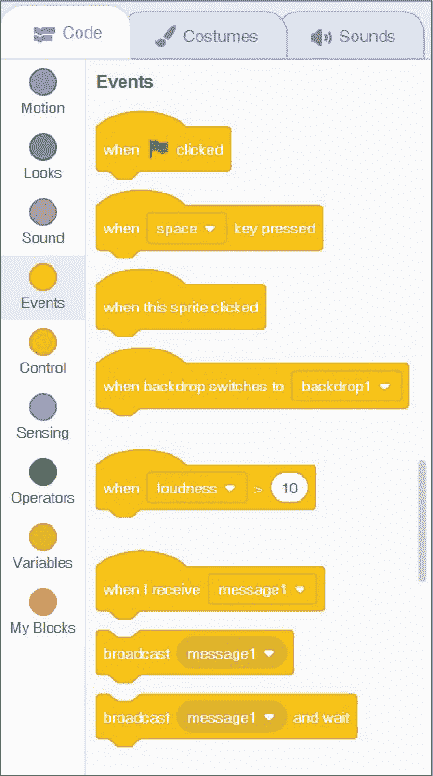

*探索**事件**积木*

大多数类别都很容易理解。**运动**积木控制运动。**外观**积木改变角色的外观。**声音**积木播放声音。

你编写的每一组编程积木都以一个**事件**积木开始。点击**事件**，你会看到所有的**事件**积木都有大圆顶。就像厨师按照指示做蛋糕一样，Scratch 总是从上到下读取指令。请记住，**事件**积木*总是*排在第一位；所有其他积木只能附加在它下面。

***事件**积木总是排在第一位（最上面）。*

事件回答了一个重要问题 *我什么时候做这个？* 我们现在要使用的**事件**积木是 `when green flag clicked`。点击并拖动它到右侧区域。

回想一下，你是通过点击绿色旗帜开始了示例游戏。游戏有一个 `when green flag clicked` 事件，它告诉程序当玩家点击绿色旗帜时执行代码积木。我们的游戏也将以这个**事件**积木开始。接下来，我们将编写代码，告诉小虫如何移动。

#### 移动小虫

想象一只虫子在墙上爬行，并且它沿着奇怪、弯曲的路径前进。这种运动非常容易模仿。虫子可以继续向前移动，直到玩家让它向左或向右转。为了让小虫移动，我们将使用 Scratch 提供的前进和转弯积木。玩家必须尽力引导小虫不停地移动，让游戏更有趣。

让我们先让虫子向前移动。那个让精灵向前移动的模块只会让精灵向前移动一步。因为我们不希望虫子只移动一步就停下来，所以我们需要添加一个循环。*循环*是一个模块，使某件事情多次发生。为了让我们的虫子一直移动，我们将使用一个循环模块，重复执行*移动*指令，直到绿旗被点击。

点击**控制**类别，找到所有处理*分支*的模块，这些模块用于编写在特定情况下会执行的不同脚本。可以将分支代码想象成从主干部分生长出来的树枝。当游戏中的不同事件发生时，Scratch 会执行分支中的特定部分。在分支模块的侧面，有空槽可以放置其他模块。例如，*循环*是一种分支形式，可能根据不同情况有不同的结果。

我们想使用最简单的循环，也就是`forever`循环。一旦`forever`循环开始，它就会一直运行，直到游戏结束。我们使用`forever`循环是因为我们希望虫子在游戏运行期间一直移动。点击并拖动一个`forever`循环，连接到`when green flag clicked`模块的底部。模块的阴影会出现，表示你可以将其连接到一起。

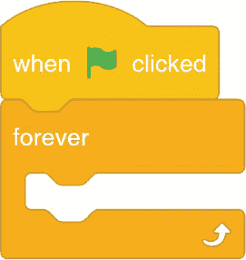

*附加一个永远循环模块*

你可以在`forever`循环中放入任意数量的其他代码块。循环会按从上到下的顺序运行其中的模块，然后跳回循环的开始，重复执行它们。`forever`循环会继续重复循环，直到你点击停止标志结束游戏。

我们将把一个`move () steps`模块添加到`forever`循环中，让我们的虫子永远移动。你可以在**运动**类别中找到这个模块。我们还将添加一个模块，防止虫子移出舞台，因为玩家将看不见虫子，而且它可能会迷路。所以，我们将把一个`if on edge, bounce`模块添加到循环中，当虫子碰到舞台边缘时，它会改变方向。

点击**运动**。点击并拖动`move 10 steps`和`if on edge, bounce`模块到`forever`循环中。

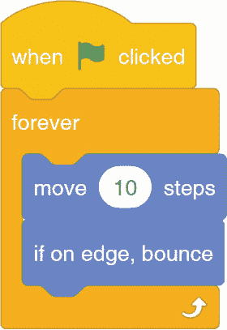

*创建一个运动循环*

`move 10 steps`模块让一个精灵按当前面朝的方向移动 10 步。双击数字 10 来更改虫子将要移动的步数。步数越少，虫子移动得越慢。我把步数改为 5。

点击绿旗测试你的代码。虫子应该开始向右移动，直到碰到舞台的边缘；然后它会反向移动，走回左边，再次改变方向向右移动。如此反复。

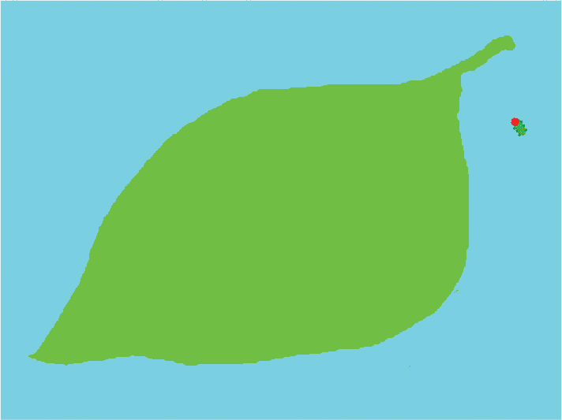

*测试虫子的移动*

当你的游戏运行时，刚刚创建的代码积木堆栈周围应该会出现一个发光效果。这个发光效果表示小虫目前正在按照这一堆代码的指令执行。例如，如果你没有使用`forever`循环，发光效果将在该堆代码运行完毕后消失。你可以利用这个发光效果来追踪 Scratch 在任何时候运行代码的哪些部分，帮助确保你的程序的每个部分都能正常运行。这个发光效果在你之后调试代码时非常有用！

#### 控制小虫

我们的小虫只能沿直线移动，但我们希望玩家可以通过箭头键让小虫向左和向右转。首先，我们需要检查玩家是否按下了可以让小虫转向的键。其次，当我们知道玩家按下的是哪个键（左箭头或右箭头）时，我们需要让小虫朝正确的方向转动。

我们将再次使用分支结构，以及`if () then`积木，首先检查玩家是否按下了某个键；然后（只有在这个条件满足时）才让小虫转向。再次强调，所有与分支结构相关的积木都在**控制**类别中。

点击并拖动一个`if () then`积木，将其放置在`if on edge, bounce`积木下方的`forever`循环内。我们将`if () then`积木放入`forever`循环中，这样只要游戏运行，玩家就能控制小虫转向。

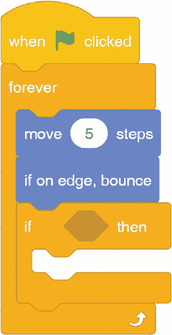

*使用 if () then 积木*

`if () then`积木中间的六边形空洞用于放置**感知**积木。**感知**积木用于检查是否发生了某个特定的动作，例如两个精灵是否接触，或者玩家是否按下了某个键。**感知**积木呈尖角形状，像它们所适配的空洞一样是六边形的。点击并拖动**感知**积木`if key space pressed?`，将其放入`if () then`积木的空洞中。

因为空格键不是我们要检查的键，所以点击它旁边的小黑三角，选择下拉菜单中的左箭头。此时，积木应该显示为`if key left arrow pressed? then`。

当玩家按下左箭头键时，我们希望小虫向左转！在**运动**类别中，找到`turn left 15 degrees`积木。它上面应该有一个逆时针的箭头。将该积木拖动过来并连接到`if key left arrow pressed? then`积木的下方。两个积木之间的空隙会亮起，显示出连接的位置。最后，将`turn left 15 degrees`积木中的 15 改为 10，使得左转的角度稍微小一些。

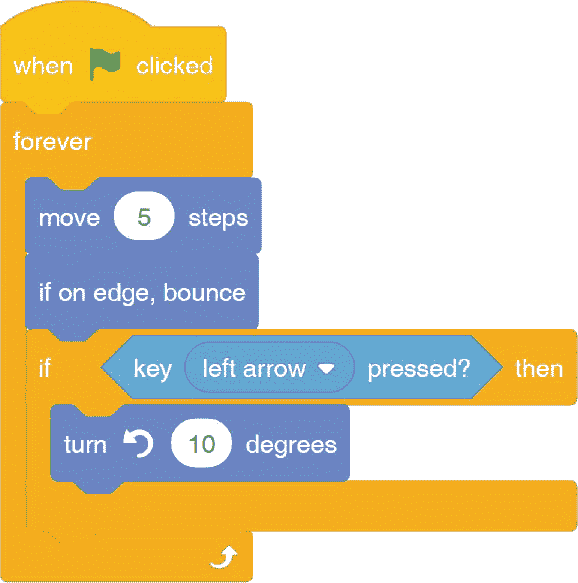

*检查玩家是否按下左箭头键*

运行游戏，看看你是否能通过按住左箭头键让小虫绕圈转！现在我们也来让小虫向右转。

右键点击`if key left arrow pressed? then`块并选择**复制**。包含`turn left 10 degrees`块的该块副本应该出现在你的光标下。将这个复制的`if () then`块放置在前一个`if () then`块下方。

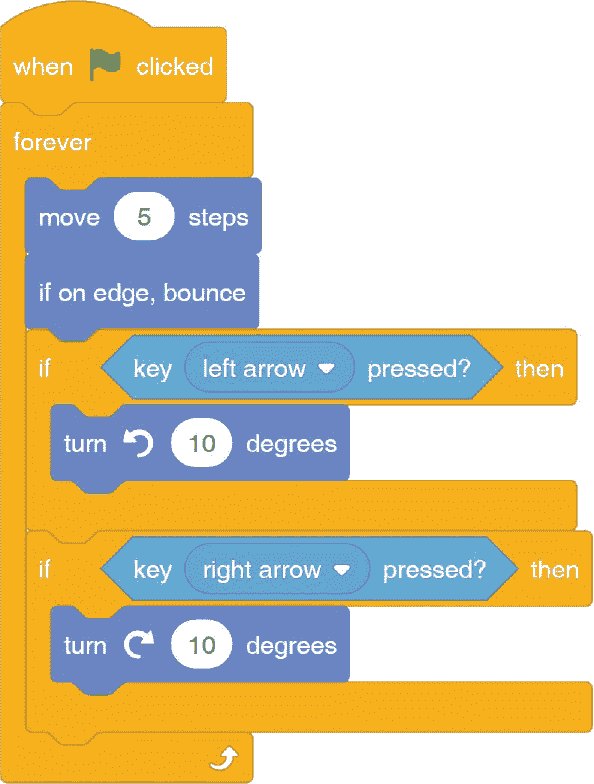

*检查玩家是否按下右箭头键*

确保点击`left arrow`旁边的黑色箭头并将其更改为右箭头。然后通过点击并拖动将`turn left 10 degrees`块移回左侧的块列表。接下来，找到**运动**块`turn right 15 degrees`（它有一个顺时针箭头）。将该块放入`if key right arrow pressed? then`块中，并将数字改为 10（否则，虫子向右转时的角度会与向左转时不同）。

再次测试你的代码，确保按下左箭头键时，虫子向左转，按下右箭头键时，虫子向右转，且不按任何键时，虫子直行。

如果你按住右箭头键，虫子却向左转，说明你忘记替换`if key right arrow pressed? then`分支中的块！如果虫子在没有按下箭头键时仍不断转动，说明你把转向块放进了主`forever`循环中，而不是放在`if () then`分支里！检查你的代码块与书中显示的代码，确保所有块都在正确的位置。

#### 使用笔块在叶子上咀嚼洞口

现在我们的虫子在叶子上四处移动，但它还没有真正地造成破坏。让我们让它咀嚼叶子，留下咬洞的痕迹！

为此，我们将使用**笔**块。想象一下一个大规模生产的房间清洁机器人，上面贴着一个记号笔，它在厨房地板上直线移动，吓到你的猫：设备会在地板上留下轨迹，显示它移动过的地方。（不要在家里尝试这个！）就像这个清洁机器人一样，一个精灵可以用笔在背景上画线。

我们将在叶子上画出天空的颜色，使它看起来像是虫子咬破了叶子。这就是为什么要将叶子背景设为单一颜色的重要原因！

要添加**笔**块，点击屏幕左下角的蓝色按钮。这将弹出一个扩展库。点击**笔**扩展以将其添加。我们需要将所有的**笔**块放置在`forever`循环之前，而不是里面，因为我们希望它们仅在游戏开始时执行一次。可以将这一部分代码看作是设置区域。

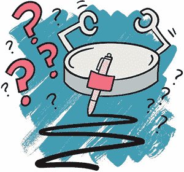

添加`设置笔刷颜色为`积木。我们通过点击`设置笔刷颜色为`积木中的彩色框，点击弹出菜单底部的吸管工具，然后点击舞台的背景来设置笔刷颜色为天空的颜色。接着，添加`设置笔刷大小为`积木，并将大小调整为 5，因为这看起来是适合虫子嘴巴的合理大小。然后添加`笔下`积木以开始绘制，就像将钢笔放到纸上一样。（`笔上`积木停止绘制。）

请注意，既有`设置笔刷大小为`积木，也有`更改笔刷大小为`积木。*设置*将笔刷大小设为特定值，如 1、10 或 187。*更改*则是将一个数字加到现有的笔刷大小上。如果笔刷大小为 1，使用`设置笔刷大小为 1`积木时，笔刷大小仍然是 1。如果笔刷大小为 1，使用`更改笔刷大小为 1`积木时，笔刷大小将变为 2，因为你给 1 加了 1。别弄混了！

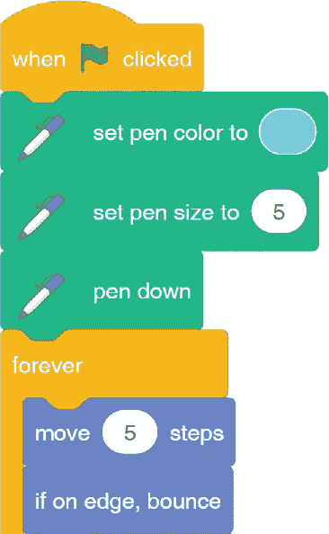

*在循环之前添加**笔刷**积木*

当你所有的**笔刷**积木都就位后，点击绿色旗帜。虫子现在应该会在叶片上留下轨迹，就像它在咀嚼一样。使用箭头键，试着让虫子画出大而弯曲的线条。

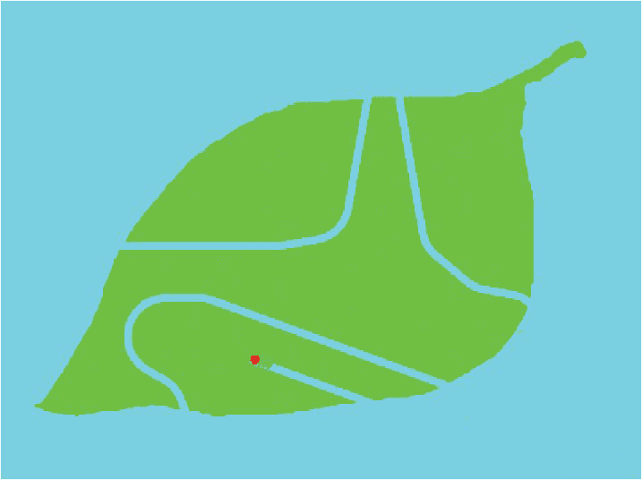

*虫子留下了一条蓝色的轨迹，看起来就像虫子在咀嚼叶子！*

我们的虫子现在正在叶子上画线，但这些线看起来有点太整齐平滑，不像是饥饿虫子留下的孔洞。让我们通过改变画线的方式，使其看起来更*有啃痕*。

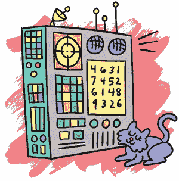

点击另一个`设置笔刷大小为`积木（*设置*而不是*更改*），并将其拖入`永远`循环，如下图所示。

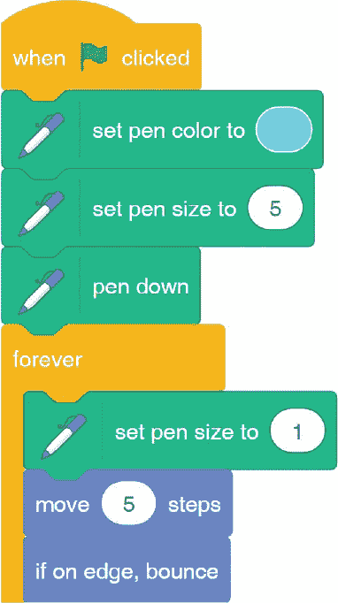

*变换笔刷大小，让虫子咬痕看起来更逼真*

我们希望将`设置笔刷大小为`积木放在`永远`循环里，这样我们就能在虫子每次移动时反复改变笔刷大小。我们将随机改变它。

你已经知道，填入一个新数字就可以改变积木中的数字。那么，有些 Scratch 积木也能通过你填入的数字来计算数字。这些积木在**运算符**类别中，如下所示。

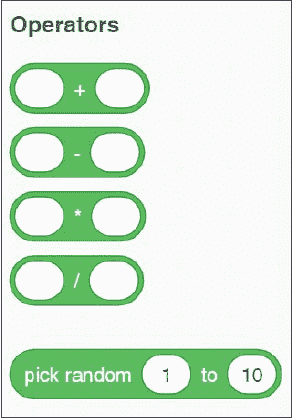

***运算符**积木*

**运算符**积木执行数学运算。任何圆形积木都可以插入任何其他积木的圆形孔中（包括其他圆形积木！）。前四个积木执行简单的数学功能：加法、减法、乘法和除法。我们将使用第五个积木：点击`从 1 到 10 随机选择`，并直接将其拖放到`设置笔刷大小为 1`积木上的数字 1 上，如下所示。任何圆形积木都可以插入任何其他积木的圆形孔中（包括其他圆形积木！）。

*随机化笔刷大小*

`pick random` 操作符会在你指定的两个数字之间随机选择一个数字。在我们的代码中，数字可能在 1 到 10 之间，但也可能包含 1 和 10。将这个块作为 `forever` 循环的一部分，每次虫子移动时，笔的大小都会变化。

现在，虫子留下的痕迹应该看起来像是由单独的咬痕组成的，因为每次咬痕的大小会稍有不同。点击旗帜并看看会发生什么！

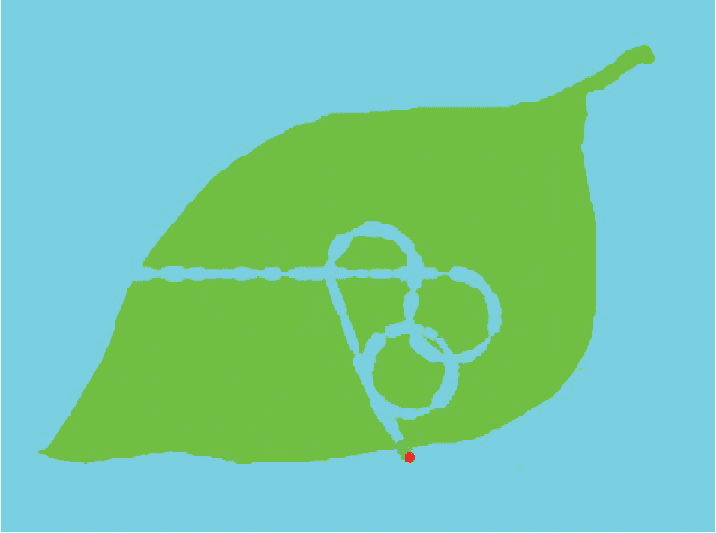

*使用随机化的笔画让虫子的咬痕看起来更逼真*

新的线条看起来更像咬痕——*很棒！*

但请注意，虫子之前吃过的所有咬痕依然存在。它们永远不会消失！让我们添加一些指令，确保每次运行游戏时都有一个干净的叶子。

#### 每局游戏从新开始

为了在每次游戏开始时刷新游戏，我们将在代码的设置部分添加三个代码块：`forever` 循环开始之前的部分。设置代码在游戏开始时执行一次，直到游戏重新开始时才会再次执行。

刷新游戏所需的前两个代码块是 **运动** 代码块 `go to x: y:` 和 `point in direction`。这两个代码块确保虫子每次都从相同的位置开始。我们需要的第三个块是 **笔** 代码块 `erase all`，它将用于清除虫子在上一局游戏中绘制的痕迹。

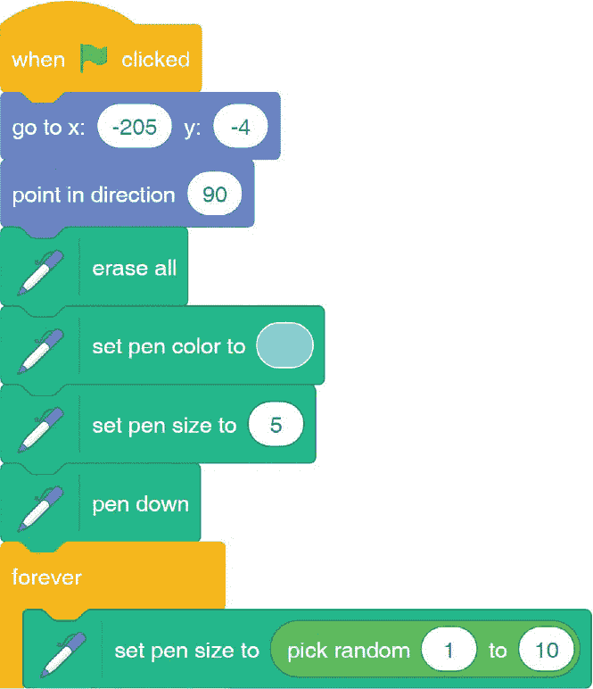

*刷新游戏的代码块*

##### 使用网格

`go to x: y:` 块可以将精灵移动到屏幕上的任何位置，你可以通过两个数字 *x* 和 *y* 来定义该位置。在 Scratch 中，我们使用网格上的数字来定位不同对象的位置。可以想象在舞台上有一个看不见的网格。这个网格由两条数轴组成，它们在屏幕中心相交。水平线上的数字（*x*）向右增加，向左减少。垂直线上的数字（*y*）向上增加，向下减少。任何位于水平数轴中心左侧或垂直数轴中心下方的数字都是负数。

*x* 值是精灵在水平线上的位置，*y* 值是精灵在垂直线上的位置。屏幕上的每个可能位置都有一个 *x* 坐标和 *y* 坐标，指示它距离屏幕中心的距离。例如，在游戏屏幕的右下角，您可以看到显示鼠标当前位置的 *x* 和 *y* 坐标。观察这些数字如何随着鼠标在屏幕上移动而变化。

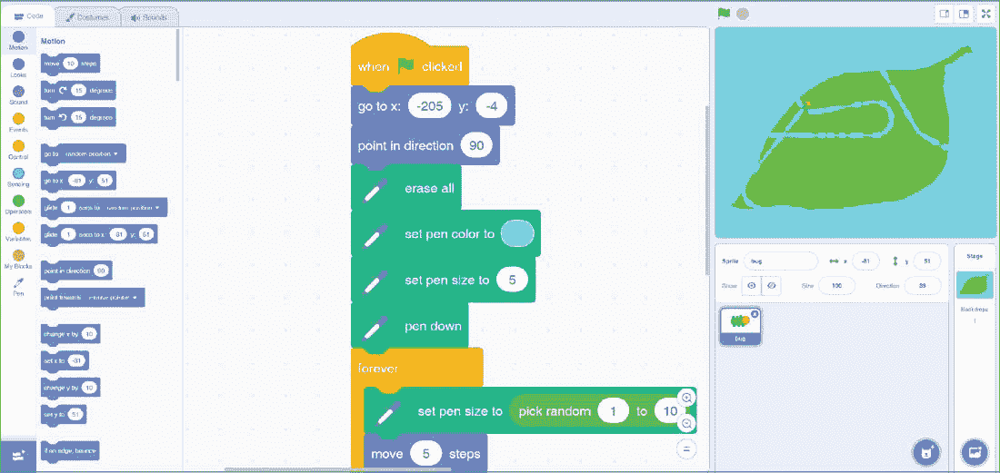

*使用 x 和 y 坐标跟踪鼠标位置*

##### 设置虫子起始位置

`go to x: y:` 块始终以精灵的当前位置开始。（尝试将虫子拖动到屏幕的不同位置；`go to x: y:` 块中的数字会发生变化。）

设置虫子起始位置的一个简单方法是，先将虫子拖动到你希望它在游戏开始时的位置。然后将`go to x: y:`积木拖到设置区域的代码堆栈中。虫子当前位置的坐标会自动填充。

##### 设置虫子的起始方向

`go to x: y:`积木设置了虫子的起始位置，但不影响虫子的起始方向。要设置虫子的起始方向，你需要使用`point in direction`积木。点击`point in direction`积木上的三角形，然后从下拉菜单中选择 90 度，这是我们希望虫子开始时所朝的方向。

每个方向都有一个与之对应的数字。在 Scratch 中，当虫子转动时，其方向数字会发生变化。方向数字表示精灵所面向的角度。可以想象一个圆圈，圆周上有一条数字线，精灵位于圆圈的中心。精灵方向为 0 时，表示它正面朝上（即圆圈的顶部）。每个数字被称为*度数*，圆圈的角度范围是从 0 到 360 度。随着度数的变化，精灵所面向的方向也会发生变化。例如，90 度会将精灵的起始方向转向右侧，这是我们希望精灵在游戏开始时面对的方向。

*精灵的方向（以度数表示）*

##### 重置背景

`erase all`积木会清除目前为止所绘制的所有笔迹，让我们的叶子恢复原貌，焕然一新。将`erase all`积木直接放在`go to x: y:`积木和`point in direction`积木的下方，这样它们将在玩家点击绿旗时首先执行。

点击绿旗运行游戏，确保所有积木都能正常工作。每次点击绿旗时，游戏都会重置。游戏应该每次都以相同的状态开始。

#### 检查虫子与叶子之间的接触

为了更好地表现虫子正撕裂这片叶子的效果，我们可以在虫子咀嚼时播放咀嚼音效。为此，我们首先需要检查虫子是否接触到叶子。如果我们在任何时候都播放音效，无论虫子是否在叶子上，都会与屏幕上发生的情况不符。因此，我们需要确保检查虫子与叶子之间的接触。

为了检查接触，我们将使用一个**控制**积木和一个**感应**积木，当虫子在叶子上时，通过分支代码来处理，就像我们之前检查左右箭头按键一样。为了保持代码整洁，我们会添加第二个`when green flag clicked`积木，而不是将其添加到现有的积木中。这样，我们就会有两个相同的积木堆栈，它们都以`when green flag clicked`积木开始。

创建像这样的两个堆栈效果很好。事实上，你可以根据需要创建任意多个相同的事件。当你点击绿色旗帜开始游戏时，*所有*的`when green flag clicked`事件都会同时运行。当你希望运行多个有不同时间间隔的循环时，或者你只是想像现在一样组织代码时，这个技巧会非常有用。

从**事件**中点击并拖动一个新的`when green flag clicked`模块，开始创建新的代码堆栈。将它放在另一个模块旁边，形成一个新的堆栈。然后给它添加一个自己的`forever`模块。我们使用`forever`模块，因为我们希望虫子在整个游戏过程中一直检查是否接触到叶子。在`forever`模块中，放入一个`if () then`模块。

要检查虫子是否接触到叶子，将`if touching color ? then`模块放入`if () then`模块内部。当你点击模块中的颜色框时，会弹出一个菜单；点击吸管工具，然后点击叶子，颜色框中的颜色就会变成叶子的颜色。

*检查虫子是否接触到某种颜色*

因为我们只用一种颜色绘制了叶子，所以我们只需要检查虫子是否接触到那种颜色。接下来，我们将在树枝内部添加想要播放的声音。

#### 播放声音

点击**声音**模块类别，将`play sound pop until done`模块拖到`if touching color ? then`分支中。在 Scratch 中，精灵默认带有`pop`声音。你可以点击“声音”标签播放声音。

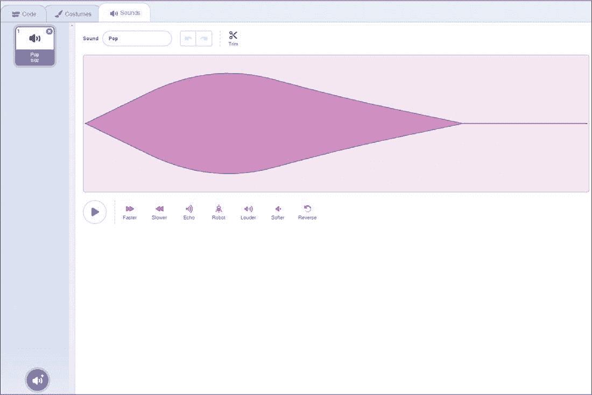

*播放 pop 音效*

一个精灵可以附加多个脚本和服装，同时也可以有多个声音。目前，虫子唯一的声音是`pop`，但这并不是虫子吃叶子时可能发出的声音。让我们找一个更合适的声音。

Scratch 自带了一个庞大的音效库，包括人声打击、动物声音和音乐。点击**选择声音**按钮来添加声音。将鼠标悬停在按钮上，可以显示其他选项。录音按钮让你录制声音，惊喜按钮会为你随机选择一个声音，而上传按钮则允许你从电脑上传声音。

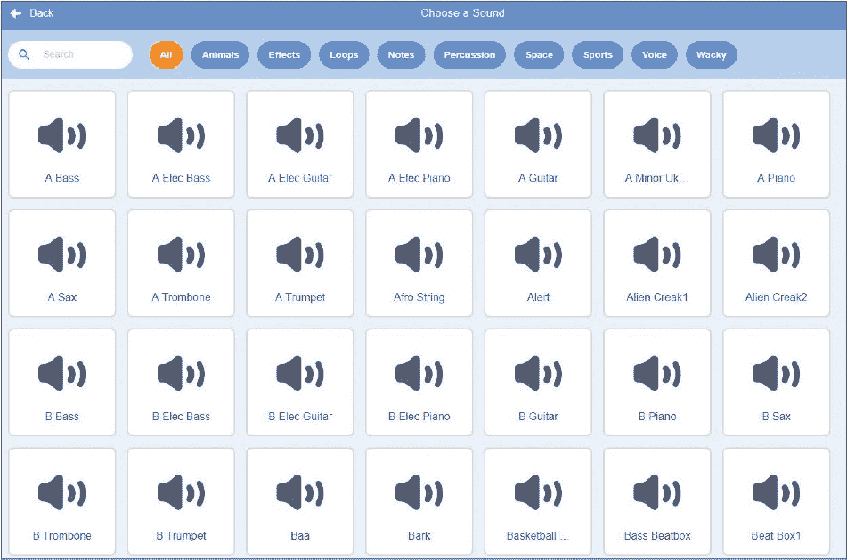

*探索声音库*

在声音库中，你会找到很多声音！点击**动物**类别来缩小列表范围。将鼠标悬停在声音上可以听到它们。尝试找到一个虫子吃东西的声音。当你找到喜欢的声音时，双击它，将其添加到精灵的声音列表中。尝试使用`chomp`声音作为这个例子。

现在虫子有了新的音效，返回到代码标签。点击`play sound until done`模块上的三角形，将声音从`pop`更改为`chomp`。现在虫子在吃叶子时应该会播放咀嚼的音效。运行游戏，听听效果如何！

听起来有点怪——绝对不像预览中的样子！游戏只有在虫子移开叶子后才会播放完整的音效。原因是虫子在接触到叶子时就尝试播放声音；然而，每当虫子与叶子接触时，声音会在*每一瞬间*重新开始播放，甚至是小于一秒的时间。所以听起来像是一个持续的嗡嗡声，而不是一系列清晰的声音。我们需要使用**控制**类别中的 `wait` 块，让虫子等待足够长的时间以播放完整的音效，才能重新播放声音。

将 `wait 1 seconds` 块拖入你的代码堆栈中，放在 `if () then` 块的上方。将它放在*分支之前*，而不是分支内部。否则，它会检查虫子是否接触到叶子*然后*等待一秒钟才播放声音。

0.2 秒的时间间隔在“咬合”之间有点长。让我们试试使用 0.2 秒，也就是两分之一秒。对于游戏来说，一秒钟是相当长的时间！

*在重新播放音效前等待*

现在运行游戏。通过在每次“咬合”之间加入 0.2 秒的延迟，“咬合”声应该会听起来更好。*咬咬咬咬咬咬咬*。

### 组织你的代码

我们的游戏基本完成了，但让我们花点时间思考如何最好地视觉布局代码区域。你应该将精灵的指令放在哪里？块需要在正确的位置连接，否则它们无法正常工作。

现在，我谈论的不是那些有明显正确答案的情况。我说的是那些不影响代码运行，但*却*影响别人阅读时代码外观的决策。例如，当你使用两个不同的 `when green flag clicked` 堆栈时，你应该把它们放在哪里？一个放在另一个下面吗？还是并排放置？

这个问题是关于形式，而不是功能。这完全是个人喜好的问题。对于 Scratch 来说，两个代码堆栈是上下排列还是并排排列并不重要。它们可以杂乱无章地堆叠在一起，只要代码块连接得正确，Scratch 仍然会运行它们。那么，堆栈的排列顺序真的有关系吗？

是的，确实是这样！你的代码区域就像是你脑袋里的空间。你如何组织代码区域，反映了你的思维过程以及你如何构思你的游戏。当代码区域杂乱无章时，你的思绪也会混乱，难以理解。如果有玩家点击 **查看内部** 按钮来看看你在游戏中是如何做的，你脚本的排列方式会在是否能让他们理解上产生很大影响。

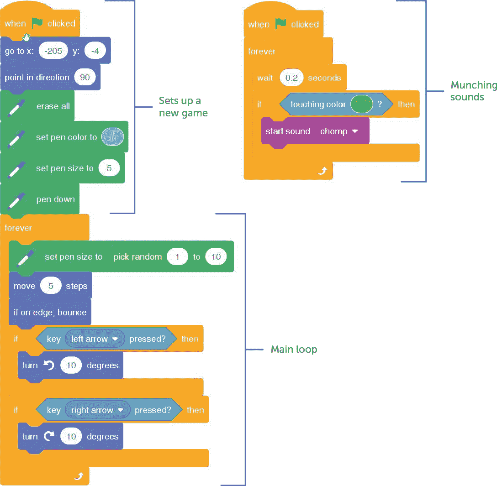

*组织* “Leaf Me Alone” *代码堆栈*

精心设计的布局有助于你整理思路，帮助你记住每个脚本部分的功能，并且让其他查看你作品的人能更清楚地理解你的脚本。

将相关的模块放在一起对我来说最有意义。例如，把`当绿旗点击时`的事件放在一起是合逻辑的，因为它们会同时开始并同时运行。

Scratch 提供了一些有用的功能来整理你的代码。当你右击编程区域时，你可以点击**整理模块**来整齐地排列所有模块，或者点击**添加注释**来为你的代码附加备注。你甚至可以通过右击某个模块并选择**添加注释**来为特定模块添加注释。注释帮助向其他人解释这个模块在游戏中的作用（也帮助你记住这个模块的功能）。注释不会改变代码的执行方式——它们只是让人类更容易理解！

你的游戏布局不必完全与我的布局相同。但你使用的布局应该对你有意义。把代码标签中的模块重新排列，像是在整理你的思路一样。

### 挑战等级

利用你现在拥有的 Scratch 知识，尝试这个可选任务：让你的虫子在吃完叶子后打嗝。要实现这个功能，你可能需要使用以下内容：

+   一个`永远`循环来确保打嗝不是一次性效果

+   一个**传感**模块来检查虫子是否在叶子上

+   一个`等待`模块来确保打嗝不会发生得太频繁

+   一点随机性来保持游戏的趣味性

+   一个打嗝声音（试着用电脑的麦克风录制你自己的打嗝声。尽力模拟一个假打嗝！）

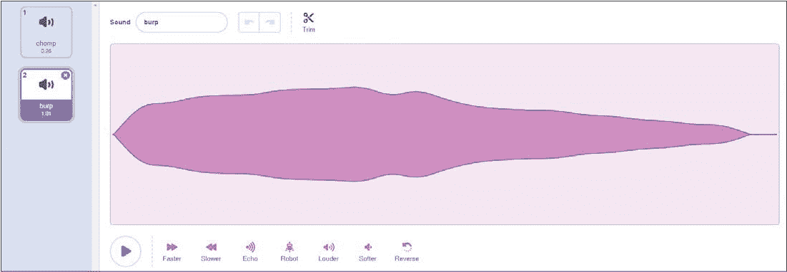

*录制你自己的打嗝声*

如果你需要帮助完成这个任务，点击**查看内部**按钮，看看我怎么做的！(*不是打嗝的声音，只是代码。*)

### 分享你的游戏

现在你需要做的就是将你的游戏与世界分享！目前，除了你自己，没人能看到你的游戏。你可以尽情地修改它——没有人在看！在你分享游戏之前，确保你已经完成了所有的更改和最终调整。分享之后，其他人就可以找到并玩你的游戏，所以在分享之前一定要确认一切就绪。不过不用担心；在你分享之后，你还可以继续修改它，或者暂时取消分享来进行更改。

Scratch 编辑器顶部有两个按钮：分享和查看项目页面。现在先不要点击分享。你还需要做一些调整才能将游戏公开。

点击**查看项目页面**，进入玩家在查看你的游戏时所看到的页面。

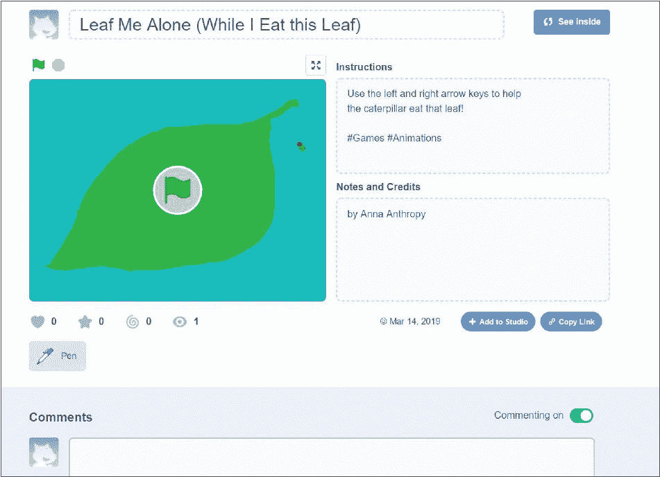

*查看项目页面*

在页面顶部有一个方便的提醒，告诉你还没有分享这个游戏。你应该填写说明，告诉玩家如何玩游戏（例如，“使用左右箭头键帮助毛毛虫吃掉那片叶子！”），并添加备注和致谢（例如，你的名字或“我最得意的作品！”）。

使用标签（#）创建指向该词搜索结果的链接。例如，尝试将你的用户名、游戏标题或像 *games* 和 *animations* 这样的词语作为关键字，帮助其他人找到你的游戏。

当游戏完成时，点击**分享**。现在，Scratch 网站上的人们可以找到你的游戏，或者你可以通过给他们链接来与朋友分享。你已经完成了你的第一个游戏！

最后一个细节：点击右上角的用户名，然后点击下拉菜单中的**我的作品**，进入你的个人“我的作品”页面。“我的作品”页面会跟踪你所有的项目，无论是已完成还是未完成，已分享还是未分享。你还可以查看有多少人查看了你的游戏，浏览所有项目，甚至通过点击“取消分享”链接来取消分享一个你已经分享的游戏。

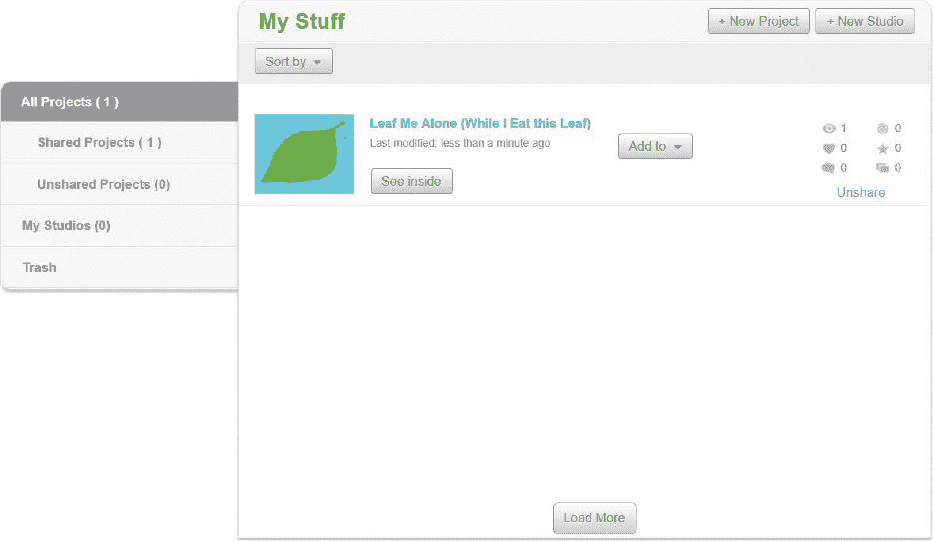

*在“我的作品”页面查看所有你的项目*

将“我的作品”页面视为你的个人秘密总部。在这里，你可以将所有邪恶的 Scratch 计划释放到毫无戒心的大众中！或者，你也可以跟踪你正在进行的每一个项目。

### 你学到了什么

你在这一章学到了很多有用的知识！你使用了 Scratch 的基于积木的编程创建了游戏的背景和角色。你还学会了如何使用循环，如何获取玩家的输入，以及如何使用条件语句和分支。在 Scratch 中，你可以使用 *x* 坐标和 y 坐标来跟踪角色在屏幕上的位置。你知道如何在完成游戏后分享它，并且知道如何利用“我的作品”页面来跟踪你所有酷炫的项目。

在第二章中，我们将制作一个随着玩家进步而变得更加具有挑战性的游戏。我们还会讨论更多高级的编程理念，比如编写代码让角色自己复制。到时见！
