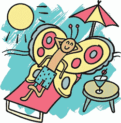

## 奇怪的虫子大餐：收集物品并避开障碍物

让我们将我们做的小叶子游戏转换成 *奇怪的虫子大餐*，它有更完整的故事情节。这个游戏不像原来的游戏那样让虫子永远吃叶子，而是从简单开始，逐渐变难，最终达到一个结局。我们将讨论一些视频游戏中最常见的元素——收集和避开物品！我们还将探索时间压力，这是实时游戏中最基本的特征之一。

你还将学习一些 Scratch 的其他功能，诸如以下内容：

+   使用克隆来创建更多精灵

+   创建并跟踪你自己的变量

+   创建你自己的事件，并用它们在不同的精灵之间传递消息

+   使用一些动画效果

你可以在 *[`scratch.mit.edu/projects/117389078/`](https://scratch.mit.edu/projects/117389078/)* 玩 *奇怪的虫子大餐*。

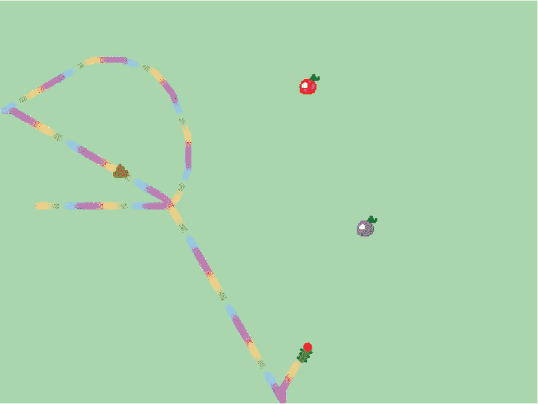

*奇怪的虫子大餐* 预览

这只奇怪的虫子想通过吃掉所有的浆果来尽可能变得更大！但是如果虫子吃得不够快，浆果会坏掉。而且，每次虫子吃掉一个浆果时，它会留下些许难闻的东西，你可能想要避免它。你能完成游戏的结局吗？（这有点难，所以如果你不能完成，试试让你的版本更简单。）

玩得够多后，让我们深入并开始制作游戏吧！

### 复制一个项目并进行更改

这一次，我们不从头开始……（你懂我的意思）。相反，让我们通过将之前的项目复制到一个新项目上来进行构建。在“我的作品”页面或游戏的项目页面上，点击 **查看内部** 打开 *Leaf Me Alone*。

如果你还没有创建你自己的 *Leaf Me Alone* 版本，可以在 *[`scratch.mit.edu/projects/117199134/`](https://scratch.mit.edu/projects/117199134/)* 上找到这个游戏，然后点击右上角的 **Remix** 按钮来获得你自己的副本进行修改。

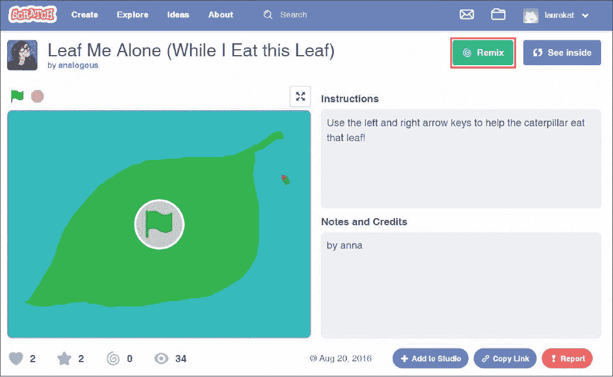

*创建一个* Leaf Me Alone 的副本

一旦你保存了一个*Leaf Me Alone*的 remix 版本，点击 **文件 ▸ 另存为副本** 来创建一个新的游戏副本继续工作。它的新名称应该类似于“Leaf Me Alone copy”。点击名称将其更改为 **奇怪的虫子大餐**（或者一个更好的名称）。

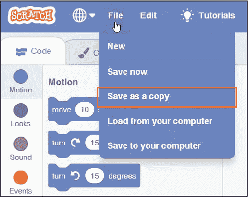

*保存一个* Leaf Me Alone 的副本

因为我们是从一个现有的项目开始，所以我们已经有了一个可以让虫子前进的循环和让玩家向左向右转动的事件。我们将对这些进行微调，以便做出我们要制作的新游戏。

*奇怪的虫子大餐* 需要一些虫子操控技巧，玩家需要在追逐小浆果的同时避开障碍物。为了让虫子最初更容易操控，我们将它的移动速度改为 3。现在，它应该每次循环移动 3 步，而不是 5 步。

### 整理你的代码

由于我们不需要叶片咀嚼的声音，我们将把那整个堆栈从脚本区移除。点击最上方的“当绿色旗帜被点击”块，选择该堆栈中的所有其他块，然后将其拖出脚本区。（确保移除的是那个发出咀嚼声音的较短堆栈，而不是那个控制小虫移动的堆栈！）

我们还会将左右转向的分支移出来，单独制作一个“当绿色旗帜被点击”堆栈，如下页所示。

制作两个代码堆栈是一个可选步骤，用于防止主循环所在的堆栈过长而无法显示在屏幕上。别忘了也给新的堆栈加上一个自己的`forever`循环。有时候，这种整理有助于你更好地跟踪代码。现在，你就能知道每个代码堆栈是用于设置和主游戏循环，还是用于按按钮和转向。

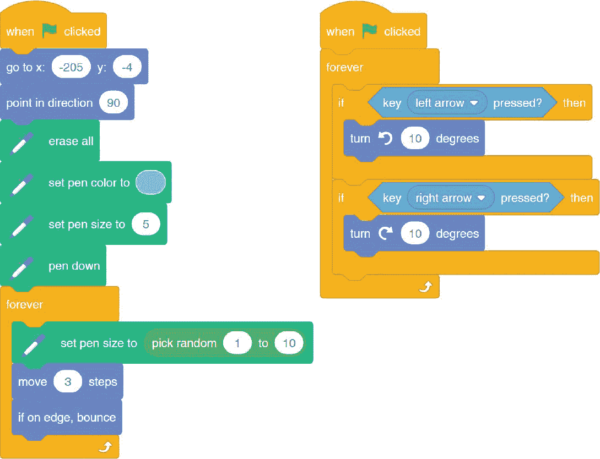

*重新整理现有的堆栈*

在我们开始制作新游戏之前，让我们对现有代码做一个小的改动。

### 留下彩虹轨迹

对于这个游戏，我们将使用笔来实现整洁的彩虹效果，而不是叶子吃掉的效果。这样，小虫无论走到哪里都会留下彩虹轨迹。因为这个游戏的核心是小虫的扭动运动，看到小虫走过的轨迹会让游戏更加有趣。

让我们修改主循环，让小虫的表现有所不同。

首先，我们删除`set pen color to`块。因为我们会循环使用彩虹的所有颜色，所以起始颜色不重要。

接下来，我们添加一个`set pen saturation to 50`块，来增加颜色的饱和度，因为我们希望彩虹看起来非常浅淡、柔和。如果将饱和度设置为 100，你将得到一个非常深的彩虹。将饱和度设置为 0 则会使其全部变为白色。

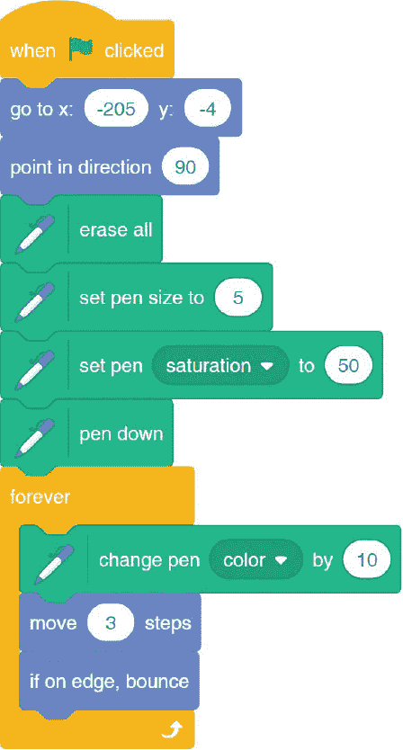

*留下彩虹轨迹的代码*

最后也是最重要的更改是移除循环内的`set pen size`块（即那个创建随机洞口咬痕效果的块），并用`change pen color by 10`块替换它。这个块会产生彩虹效果。

在 Scratch 中，笔的颜色就像 x 或 y 坐标一样，仅仅是一个数字。通过加减这个数字，我们可以改变小虫绘制时的颜色。通过使用更大或更小的数字，我们可以改变彩虹颜色切换的速度。我们在这里使用的是 10，但你可以通过实验找到你最喜欢的数字。

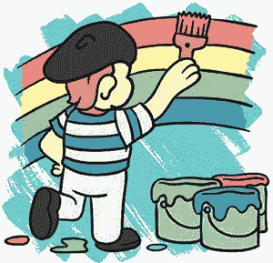

我们还通过创建一个新的背景图像并删除旧的背景图像来去除了背景中的叶片。（你可以在点击舞台后，通过背景标签来进行此操作。）使用一个纯色背景来让彩虹更突出。如果你想要更有创意，你也可以画一个全新的背景。但彩虹效果本身就能让背景变得有趣，所以不需要额外的装饰。大家都喜欢彩虹！还有什么比这更好呢？

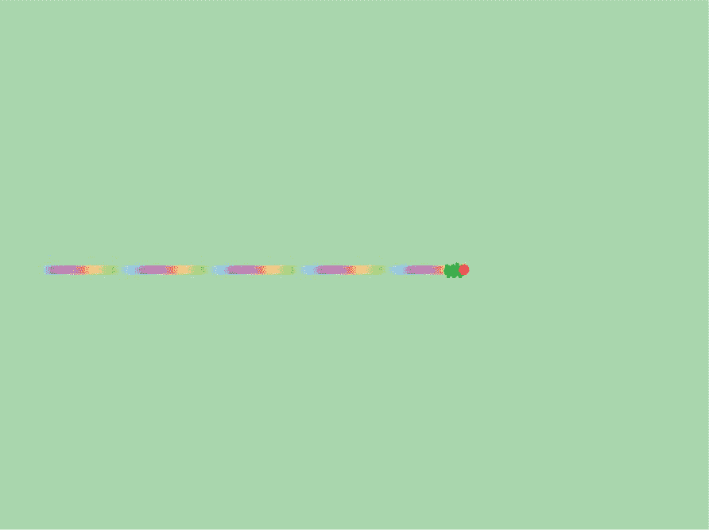

*测试彩虹轨迹*

### 制作虫子食物

现在让我们做一些浆果给我们的虫子吃。点击精灵菜单中看起来像画笔的**绘图**按钮。

绘制一个浆果，并让它成为一个稍微小一点的红色圆圈，放在不比虫子大多少的+号上。你可以在顶部加一个小叶子，并在上面加一个小白点，表示光线照射的地方。

完成后，点击右下角的**精灵**框（它会被称为`Empty`），并将其值更改为 Berry。将服装名称的值（左上角的撤销按钮旁边）更改为 costume1。现在，我们希望我们的浆果做什么呢？

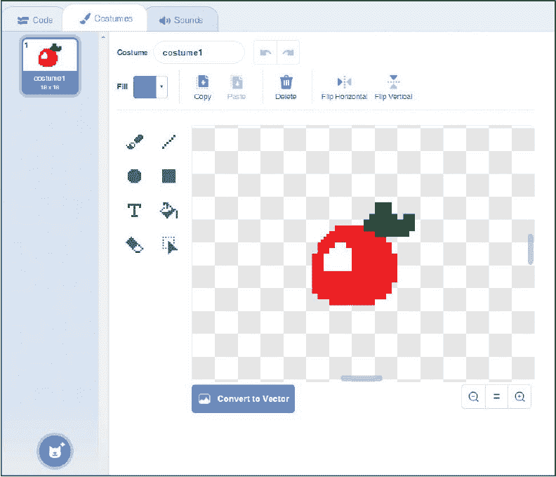

*绘制浆果*

让我们花点时间思考一下像这样的物体在游戏中的作用。许多游戏中都有金币、戒指、宝石或其他玩家需要在难以到达的地方收集的物品。但这些物品在游戏中到底*起什么作用*呢？

在《奇怪虫子大餐》游戏中，浆果给玩家提供了与控制虫子移动相关的*任务*。像浆果这样的物品可以激励玩家理解虫子的移动方式，并挑战他们提高控制虫子的能力。

我们将让浆果随机出现在屏幕上的不同位置，玩家可以尝试将虫子移动到它们的位置。我们如何制作多个浆果呢？最显而易见的方式是制作多个浆果精灵。但即使我们制作了比如五个相同的浆果精灵，我们仍然只有五个精灵。而且，如果我们想要更改其中一个的代码，我们就必须*在所有五个精灵中*都做出相同的更改。这工作量太大了。相反，我们只会制作*一个*浆果精灵，它可以*克隆*自己。

#### 让精灵克隆自己

克隆只是精灵在游戏运行时生成的副本。任何精灵都可以在任何时候生成自己的克隆，前提是它被编程为这样做。克隆不是具有自己代码的独立对象。我们通过编程原始精灵来创建它们，然后使用为克隆专门设计的一些特殊积木告诉它克隆后该做什么。注意，克隆会在游戏结束时消失。

首先，我们将编写代码让浆果精灵传送到屏幕上的一个随机位置，然后克隆自己。克隆出来的浆果会静止等待玩家尝试去吃它。然后原始的浆果会等待几秒钟，再次传送并制作*另一个*克隆，依此类推。原始浆果将不断传送并生成克隆，而这些克隆将是玩家吃掉的浆果。让我们看看这段代码是如何实现的。

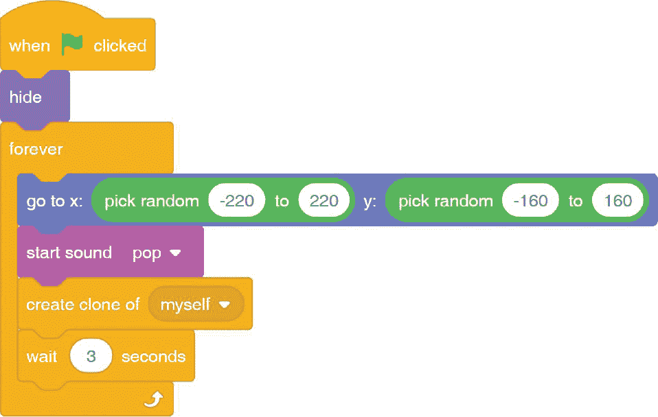

*制作自我克隆浆果的代码*

首先，浆果会*隐藏*，因为这个原始浆果只是用来生成克隆体的。玩家应该只能看到克隆的浆果。（`hide`块在**外观**下。）当它变得不可见时，它开始循环。它会移动到屏幕上的一个随机位置，播放*pop*（每个精灵开始时的声音效果），并克隆自己。它在每次克隆之间暂停三秒钟，然后再次开始循环，产生一个新的克隆体。所有与克隆相关的块都在**控制**下。

#### 使用负数

`go to x: y:` 块将`x`设置为-220 到 220 之间的随机数，将`y`设置为-160 到 160 之间的随机数。这些数字来自第一章中提到的坐标系统。

当你在游戏区域内移动鼠标，并观察角落里的 x 和 y 坐标时，数字会朝中间变小。屏幕的中心点是(0, 0)。如果你向右移动，x 的数字会增大，最大为 240。如果你向左移动，数字会减小。小于 0 的数字是*负数*。

负数就像是普通数字的镜像，所以如果你从 0 中减去 1，你得到的是-1；如果你从 0 中减去 100，你得到的是-100。就像普通数字一样，离 0 越远，数字越大。最左边的 x 位置是-240，它是右边 240 的镜像。y 位置从屏幕顶部的 180 到屏幕底部的-180。

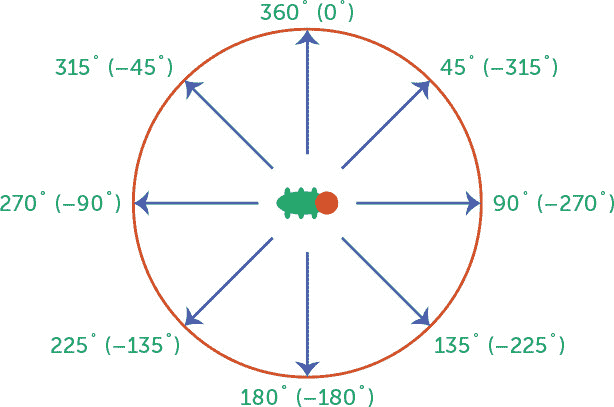

#### 创建一个无浆果区域

如果我们将`x`设置为`pick random -240 to 240`，将`y`设置为`pick random -180 to 180`，我们就能覆盖屏幕上的每个可能位置。那么为什么要使用-220 到 220 和-160 到 160 呢？因为小虫会从屏幕的边缘反弹，我们不希望浆果出现在离边缘太近的地方，这样就会让它们变得不公平，难以收集。为了避免这种情况，我们在屏幕边缘创建了一个 20 个无浆果坐标的缓冲区，通过从 240 和 180 中减去 20，得到 220 和 160。

现在试着运行游戏。你可能什么也看不见，但你应该能听到每三秒钟一次的爆炸声。这是因为克隆体现在都是不可见的。由于原始的浆果在克隆自己之前会*隐藏*，因此克隆体也一开始就是不可见的浆果！

由于浆果的克隆体是在你点击绿旗开始游戏后创建的，它们没有`when green flag clicked`事件。这是好事，因为否则它们会像原始浆果一样四处传送并自我克隆，屏幕很快就会被浆果覆盖。当你与克隆体一起工作时，最好仅在你想要*原始*精灵（而不是克隆体）做的事情时使用`when green flag clicked`事件。我们将使用一个特殊的事件来为只想让*克隆体*做的事情编写代码。

**注意：**记住，克隆体在游戏停止时会消失，所以不必担心不可见的浆果会堵塞你的游戏。

现在是时候让这些克隆体做点事情了。它们可以首先通过`show`块让自己再次显示出来。

#### 告诉克隆浆果该做什么

我们将使用`when I start as a clone`事件来告诉克隆体该做什么。尽管它是一个事件，你会在**控制**类别下找到它和其他所有与克隆相关的块。`when I start as a clone`事件让你编写只适用于克隆体的代码。原始精灵永远不会看到这个事件。`when I start as a clone`块中的第一个内容将是克隆体在创建后执行的第一个动作。

我们的浆果克隆体做的第一件事应该是用**外观**类别中的`show`块让自己可见。

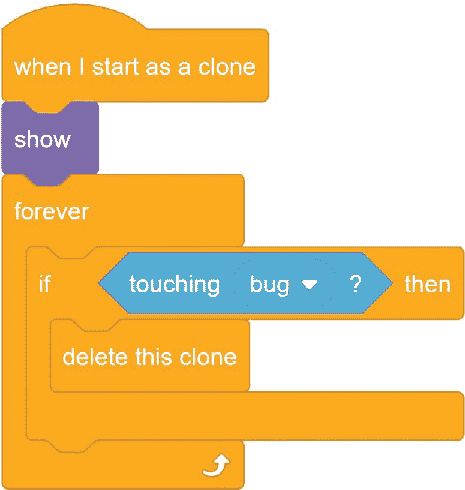

*在克隆体创建后立即告诉它们该做什么*

由于我们可以创建任意数量的克隆体，我们也可以将它们移除。这个能力非常有用，否则克隆体可能会失控！为了在虫子吃掉浆果后移除它们，我们使用条件判断首先检查浆果是否接触到虫子。如果接触到虫子，我们就删除它，表示虫子已经吃掉了这颗浆果。确保这个检查发生在`forever`循环中，这样浆果就可以不断检查这个条件。

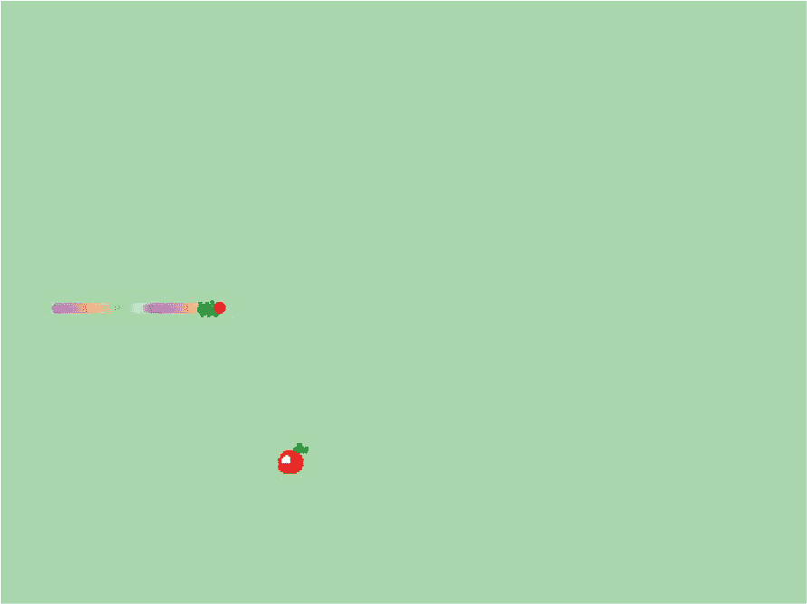

*测试浆果是否会弹出*

尝试运行程序！每三秒钟，屏幕上应该会出现一颗新的浆果，虫子触碰到它时它会消失。你能多快吃掉这些浆果？

#### 广播消息

当虫子吃掉浆果后，浆果就消失有点缺乏高潮。我们可以改成每当虫子吃掉一颗浆果时，虫子会稍微变大一点。为此，我们需要一种方式让浆果向虫子发送一条信息，告诉虫子它已经吃掉了浆果。当虫子收到这条消息时，它会运行一个特殊事件，告诉它要变得更大。

在 Scratch 中，这叫做广播和接收消息。当一个精灵*广播*一条消息时，这条消息会同时发送给游戏中的所有其他精灵。任何有该消息`when I receive`事件的精灵，在收到消息后会执行与该事件相关的代码。没有该消息事件的精灵会忽略它。这就像你在 Instagram 上发布一张照片。你将它发送给全世界，但只有关注你的人才能看到。

你可以在**事件**下找到所有与广播和接收消息相关的块，如下所示。

*广播下拉菜单*

将`broadcast message1`块拖入`if touching bug`分支中，放在`delete this clone`上方。我们希望浆果检查是否接触到虫子，给虫子发送一条信息，然后消失。默认信息是`message1`，但你可以通过点击`broadcast`块上的三角形来更改浆果发送的信息。点击新建消息创建一条名为`yum`的新消息。

现在点击虫子并为它添加一个新的堆栈，堆栈从`when I receive yum`事件开始。你可能需要点击`when I receive yum`块上的三角形并将消息更改为`yum`。

*创建“当我收到 yum”块*

现在，当虫子收到`yum`消息时，它可以播放它的咀嚼音效，并且变得稍微大一点。我们还可以把笔刷大小变大，这样随着虫子变大，虫子的彩虹轨迹也会变得更大。

确保你在虫子的设置代码中也添加一个`set size to 100%`的块（在`when green flag clicked`堆栈中），这样当你重新启动游戏时，它会重置大小！否则，虫子会一直变得越来越大（100%是精灵的原始大小）。

现在尝试吃一些浆果，看看你的虫子和它的彩虹轨迹如何变大！*咻咻咻。*

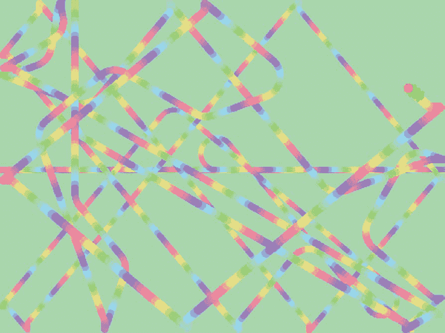

*看着你的虫子长大！*

### 添加时间压力

从玩家点击绿旗的那一刻起，我们的游戏就开始计时了。作为游戏设计师，我们应该思考如何利用时间。例如，我们可以决定玩家应该在一个关卡中花费多少时间，怪物开始追逐玩家前需要多久，或者玩家有多少时间抓住一只翅膀球，避免它飞出可及范围。时间是一个强大的工具，当我们有意识地使用它时。

当节奏太慢时，玩家可能会感到无聊，因为他们感受不到紧迫感。游戏节奏太快时，玩家会觉得自己根本跟不上。在这两种情况下，他们都会失去兴趣，因为他们做的任何事情都不会觉得有后果。

但如果我们有意识地使用时间，我们可以通过保持节奏来让游戏保持活力。例如，在*奇怪的虫子大快朵颐*中，浆果每三秒就会出现。玩家需要使用正确的*时机*在恰当的时刻让虫子转动，吞下浆果。但他们有足够的时间收集浆果，而且浆果会永远存在。

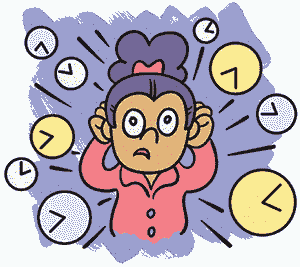

现在，玩家有足够的时间收集浆果，所以这款游戏没有太多前进的动力。但是，如果我们通过让浆果变坏来增加*时间压力*，比如像水果在放置一周后变坏那样？那玩家就会有理由尽快抓住它们。

我们还可以让坏的浆果逆转玩家的进度，把坏浆果变成障碍物，虫子必须避开这些障碍。这会在玩家无法及时吃掉浆果时制造压力和后果。

让我们来讨论一下如何让一个好的浆果变坏。

#### 使用动画让坏的浆果

为了让玩家理解浆果正在变坏，我们需要一种方式向他们展示这一点。我们还需要展示浆果快要变坏的程度，以便给玩家时间反应。视觉效果是传达游戏状态信息的绝佳方式。

我们将为浆果制作不同的服装，玩家可以看到它的颜色变化，逐步变成一个坏掉的浆果。接着，我们将展示不同的浆果成熟阶段，制作一个小动画。

##### 绘制服装

打开浆果的**Costumes**选项卡。此时，浆果只有一件服装（通过在撤销箭头旁边的框中输入名称，给它命名为`costume1`）。右键点击该服装，选择**duplicate**以复制该服装并命名为`costume2`。不要更改`costume1`。我们将在`costume2`上绘制一些大紫色斑点，使它看起来像是从红色变成腐烂紫色的中间阶段。

右键点击`costume2`制作另一个副本，即`costume3`。使用油漆桶工具在`costume3`上剩余的红色部分添加更多紫色斑点。现在浆果完全变成紫色了。

复制`costume3`制作`costume4`，并在其上画一些蓝色斑点，变成蓝紫色的浆果。然后将`costume5`完全涂成蓝色，表现出浆果正在腐烂的状态。

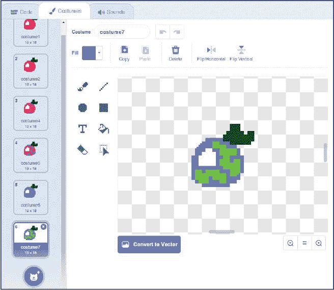

*为你的浆果绘制服装*

我们希望浆果的颜色变化能够可见，随着它越来越接近最终的腐烂形态。这里我们绘制了七个服装，从纯红色开始，接着变成紫色，再变蓝，最后是带有大块绿色斑点的蓝色，`costume7`展示了你不想吃的那种腐烂浆果。

通过观察浆果在每个阶段的服装颜色，玩家应该能知道浆果离变得不可食用还有多远。红色是完美的，紫色是即将腐烂的中间阶段，蓝色表示已经开始变坏。绿色且斑驳则代表腐烂了。

##### 编写动画代码

让我们来看看如何让浆果克隆体轮流展示所有的服装。

我们需要使用`when I start as a clone`为每个事件创建两个独立的事件。一个事件检测与虫子的接触，另一个事件处理所有视觉效果，比如让浆果可见，重置它的外观为`costume1`，然后进行动画处理。

由于这些堆栈涉及不同的时机（一个使用`forever`循环，另一个使用`wait`和`repeat`），它们不能放在同一个堆栈中。当两段代码有不同的时机时，我们必须将它们放在不同的事件中，即使这两个事件在同一时间启动。这样它们就不会互相干扰。

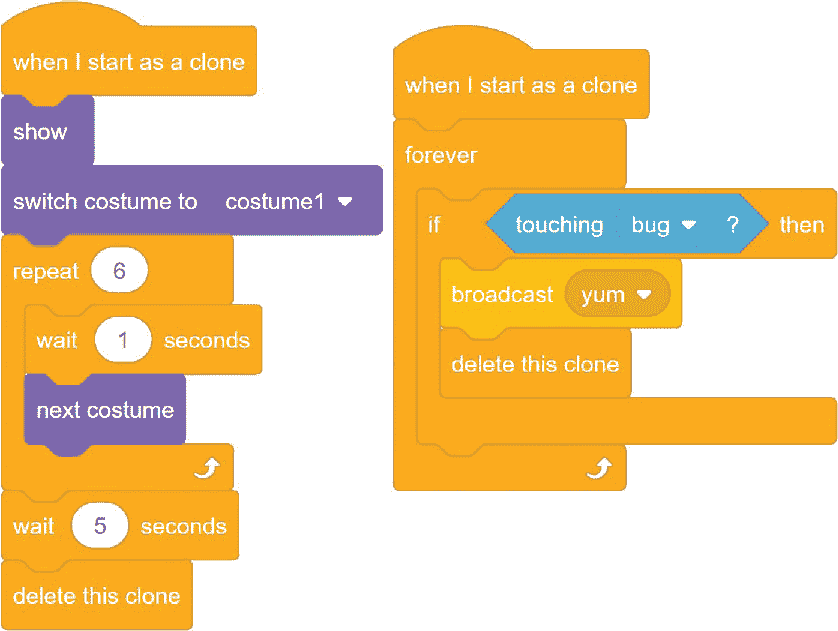

*为你的浆果制作腐烂动画*

在视觉堆栈中，我们使用`repeat 6`循环，每次服装变换之间间隔一秒。`repeat`块像`forever`块，但不同的是，它并不是无限次重复里面的内容，而是根据你指定的次数重复。这里我们使用`repeat 6`，因为一共有六个帧，直到最后一个显示腐烂斑驳浆果的帧（`costume7`）。

在`repeat`块执行指定次数后，Scratch 会退出该分支并继续执行下面的代码。在这个例子中，代码等待五秒钟，然后删除克隆。这样，腐烂的浆果会停留足够长的时间成为障碍，但不会永远存在。否则，游戏会变得太难。

运行游戏并观察你的浆果变坏。

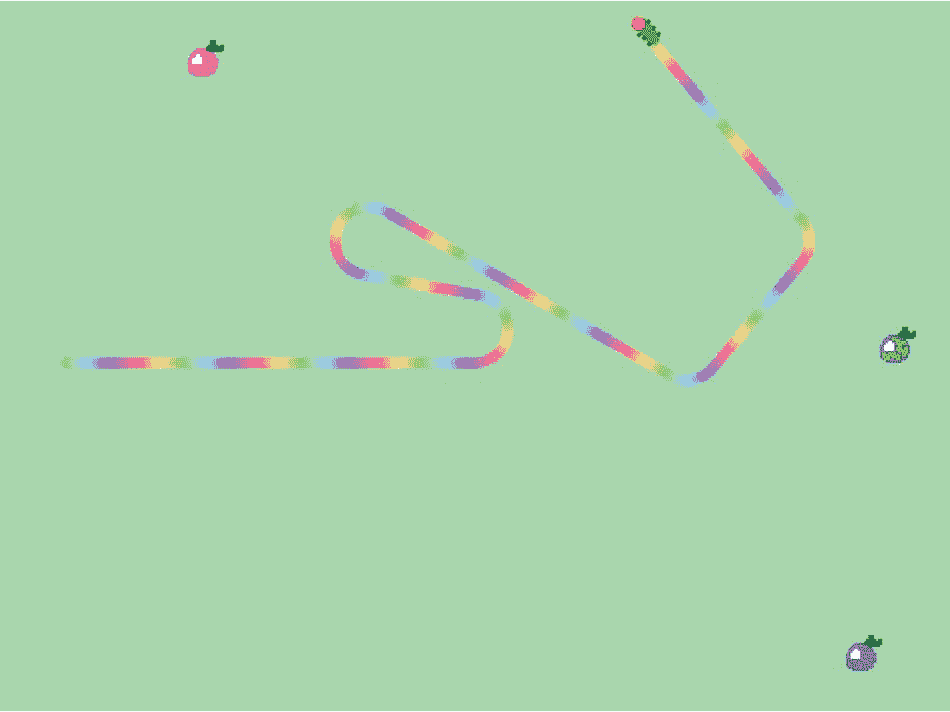

*测试浆果如何腐烂*

当一个浆果出现时，玩家有六秒钟的时间可以吃掉它，否则它会变坏。这段时间刚好足够从屏幕上的任何位置到达浆果。然后它会保持坏状态五秒钟，直到最终消失。但现在，你仍然可以在浆果变坏后吃掉它而没有任何后果。我们还没有让它们在变坏时做出不同的反应。接下来，我们就来做这件事。

#### 使用 if 和 else 进行分支

我们使用了`if () then`块来检查虫子是否接触到叶子或浆果。现在，我们将使用`if / else`块来决定当虫子接触到浆果时，浆果是好还是坏。`if / else`块（在**控制**下）有两个分支：一个是`if`分支，另一个是`else`分支。如果条件为真，第一个分支的代码会执行；如果条件不为真，第二个（`else`）分支的代码会执行。

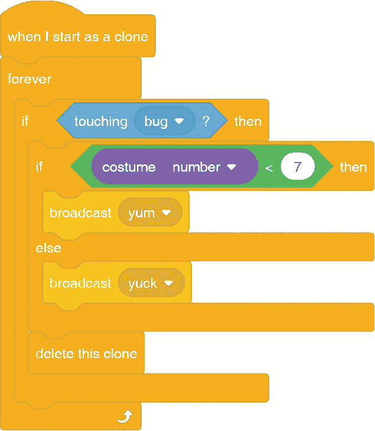

*检查浆果是否适合食用*

让我们拆解这个堆栈以理解它。最外层的块是`forever`循环，因为我们希望这个浆果不断检查虫子是否碰到它。`forever`循环内嵌套的是`if touching bug`块，用来执行碰撞检查。首先，我们检查虫子是否真的碰到浆果，然后*再*检查浆果是什么类型。

下一级是`if / else`块：`if costume number < 7 then broadcast yum, else broadcast yuck`。`costume number`（在**外观**下）显示的是精灵当前呈现的服装编号。`<`符号表示“小于”，用于检查服装编号是否小于 7。你可以在**运算符**下找到`<`块。坏的浆果服装是`costume7`。我们希望当浆果的服装编号为 7 时，虫子采取一个动作；当服装编号小于 7 时，虫子采取另一个动作。

*如果*服装编号在 1 到 6 之间，浆果仍然适合食用，我们广播`yum`信息。或者*否则*，如果服装编号为 7 且浆果已经变坏，我们通过点击三角形然后选择**新消息**广播`yuck`信息。

无论浆果是好是坏，我们都需要*删除这个克隆*。删除浆果不属于`if / else`块的一部分，而是在该块评估后执行。无论浆果是否健康，我们都希望它消失。

就是这样，关于浆果的部分到此为止。

#### 记录“yuck”信息

为了让虫子接收到`yuck`消息并做出相应的反应，我们将通过对着麦克风说“呕”来录制一个新声音。当虫子接收到`yuck`消息时，游戏会播放这个声音，然后虫子会变小。

当虫子吃到一个好的浆果时，它会变大 10，因此我们也要让虫子缩小 10。我们可以通过让虫子变大-10 来缩小虫子，这和说它变小 10 是一样的。我们还要让栅栏变小，以匹配虫子的新大小。

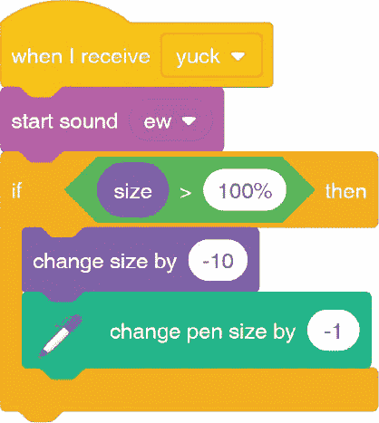

*让虫子在接收到 yuck 消息时说“呕”*

我们在大小变化前添加条件`if size > 100%`，以确保虫子不会变得比它的初始大小更小。（记住，100%是精灵的初始大小。）如果我们不设置这个条件，虫子可能因为吃太多坏浆果而缩小到消失！

让我们测试一下游戏。试着让虫子变大，然后再把它缩小到原来的大小。检查一下虫子是否不能变得比它的初始大小更小。

### 便便障碍物

现在我们的游戏有了虫子要避免的障碍物。更重要的是，虫子知道当它与障碍物碰撞时该怎么做。当它接收到`yuck`消息时，它会按照`yuck`堆栈中的代码执行。我们也可以使用`yuck`堆栈来添加其他障碍物。我们要做的就是让新的障碍物对象在虫子接触到它们时广播`yuck`消息。

我有一个完美的障碍物想法：便便！听我说完：虫子吃东西时会拉屎，对吧？我的专业背景并不在昆虫消化系统方面，但虫子很可能有时会拉屎。利用便便作为障碍物将是一个有趣的方式，将所有现有的游戏元素联系在一起：虫子、浆果和食用这些浆果。

当虫子吃下一颗浆果时，它会消化这个小吃一秒钟，然后它后面会出现一点便便。这些便便就像坏浆果一样起作用。如果虫子碰到它的便便，它会广播`yuck`消息，虫子会变小。避开便便！

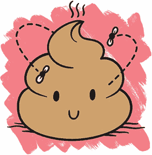

#### 为什么便便障碍物有效

便便障碍物永远不会出现在虫子*前方*。浆果会随机出现在各个位置，有时会出现在虫子前面，玩家根本无法避开它们。但是玩家*想要*收集浆果，所以这就像一个免费的奖励。如果便便障碍物出现在虫子前面，那就不公平了。

由于虫子的便便总是出现在虫子后面，它有助于游戏的前进动力。虫子会持续向前移动，因此便便给玩家一个理由去避免重新走过自己的路径，推动他们始终探索屏幕的其他部分。

创建便便作为障碍物的另一个卖点是，每个玩你游戏的人都已经理解它是怎么回事。每个人都会拉屎，并且本能地知道要避开它。

#### 通过让精灵克隆其他精灵来制作便便

为了创建我们的便便障碍物，将鼠标悬停在 **Choose a Sprite** 菜单上，点击 **Paint** 按钮，画一些恶心的东西，并将精灵重命名为 `poop`。如果便便让你恶心，你可以让你的虫子留下奇怪的虫蛋，或者在它后面留下嚼碎的小浆果，就像小苹果核一样。没有人愿意碰那些！

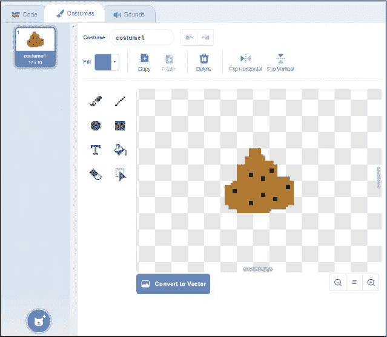

*画虫子的便便*

这里有一些画好便便的小贴士：点击绘图区下方调色板旁的小彩虹盒子，选择更多颜色。这个新彩虹调色板右侧的滑块可以让你调整颜色的亮度或暗度。如果你稍微把调色板弄暗一点，你应该能选到一个很棒的便便棕色。为了让它看起来更恶心，可以将画笔大小设为非常小，并在便便上画一些微小的黑点。这样。壮观！

#### 编写便便障碍物的代码

与浆果不同，我们不会让便便克隆体自己出现。便便不会自己出现，而是虫子吃了浆果后才会生成便便。因此，我们将告诉虫子使用 `create clone of myself` 块来制造便便克隆体。点击 `myself` 旁边的三角形并将其更改为 `poop`。

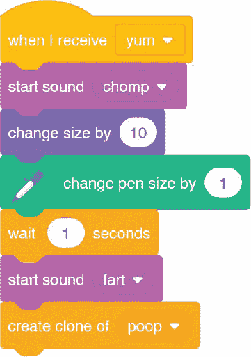

*克隆便便*

虫子在 `when I receive yum` 事件中生成便便克隆体。添加一个 `wait 1 secs` 块和一个 `play sound` 块，并将声音设置为 `fart`。现在，当虫子吃掉浆果时，它会按照指示改变大小，消化 1 秒钟，播放放屁声，并生成一个便便克隆体。（你可以通过对着麦克风吹口哨录制放屁声。）

**注意：** 如果虫子在等待克隆便便的过程中吃了另一个浆果，`when I receive yum` 事件会从头开始，`wait` 也会重新开始。这意味着当虫子非常快速地吃掉多个浆果时，可能只会出现一个便便。

现在让我们使用 `when I start as a clone` 事件来告诉 `poop` 克隆体它们在出现后应该做什么。

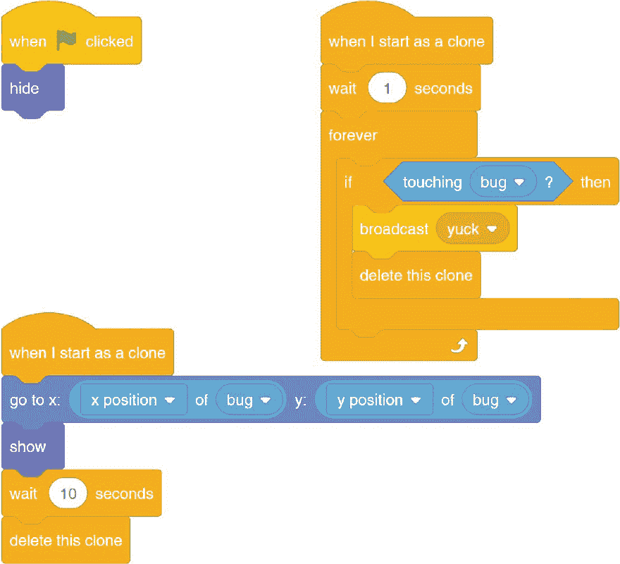

*告诉便便克隆体做什么的代码*

`poop` 代码分成了三个堆栈。这样做的原因是，`forever` 循环和 `wait 10 seconds` 块需要在各自的堆栈中运行。此外，`when green flag clicked, hide` 堆栈应该仅在开始新游戏时运行。以下是每个堆栈的功能：

**隐藏原始便便** 第一个堆栈让原始 `poop` 精灵消失，因为我们只想让便便以克隆形式出现。

**让便便出现在虫子后面** 左下方的 `when I start as a clone` 堆栈让便便与虫子一样从相同的 x 和 y 坐标位置开始。（你可以在 **Sensing** 类别下找到 `x position` 块。）如果没有这个瞬移块，新的便便就会出现在原始 `poop` 精灵被隐藏的位置，而不是出现在虫子的轨迹中。然后我们告诉 `poop` 克隆体 *显示* 自己，等待 10 秒钟，再将自己删除。便便和生活中的一切一样，都是暂时的。如果它不是暂时的，游戏就会变得太难。

**检查粪便接触** 右侧的`当我作为克隆体开始`堆栈检查虫子是否接触到`粪便`克隆体。当虫子碰到`粪便`时，`粪便`会广播`恶心`并自我删除。这与坏浆果的情况差不多。注意，它在开始检查与虫子的接触之前会等待一秒钟。这是因为每个`粪便`从与虫子相同的位置开始。如果它不等一秒钟再开始检查，虫子会在`粪便`出现的瞬间撞上它，*太恶心了*。

运行你的游戏。检查粪便是否出现，是否消失，*以及*当虫子碰到它们时，它们是否作为障碍物有效。满地的粪便。

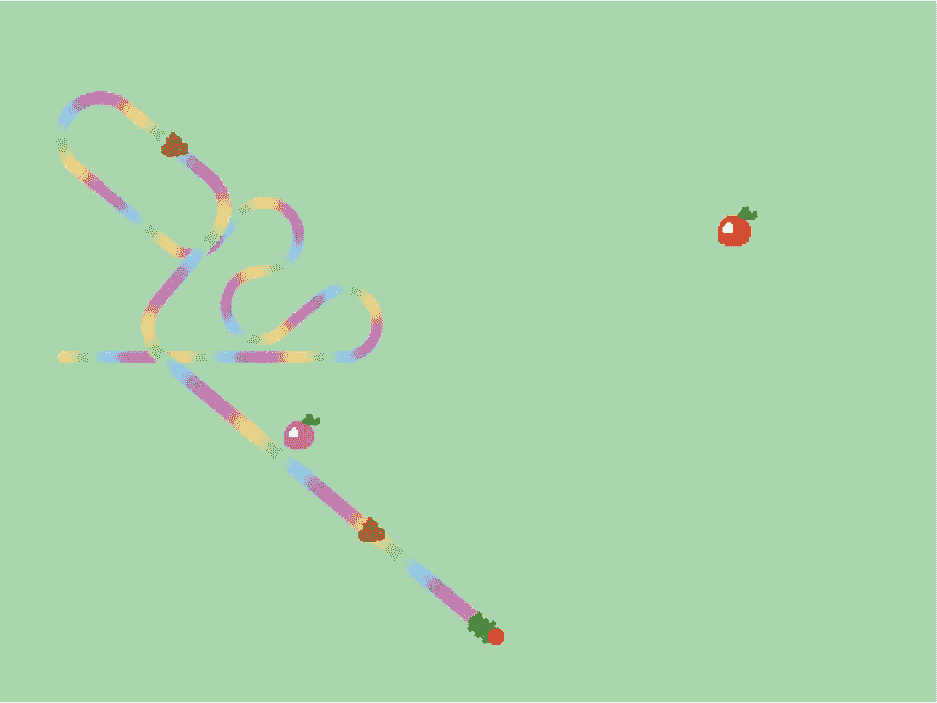

*使用粪便测试游戏*

### 提高赌注

现在我们的游戏充满了令人兴奋的物体。小虫有道具可以收集，也有障碍物需要避开，比如坏的浆果和粪便。但也许如果游戏有更多的故事情节，或者随着游戏的进行，紧张感逐渐加剧，游戏会显得更完整一些？比如，如果玩家做得越好，游戏变得越难，怎么样？现在，小虫吃东西会变大，虽然随着游戏进展，它变得稍微难以避免障碍，但这并不会让游戏变得太不一样。如果小虫变得越大，*它移动的速度也越快*，会怎么样？

这样的话，玩家表现得越好，游戏就越难。如果游戏变得太难，虫子撞到障碍物，它会缩小，游戏也会变得更慢、更容易。加入这种玩法可以让游戏适应玩家的技能水平。

#### 创建我们自己的变量

为了在虫子移动时跟踪其速度，我们需要使用一个变量。我们之前已经使用过变量：当我们告诉角色`去到 x 100`时，我们在改变它的`x`变量。当我们改变角色的画笔颜色时，我们在改变颜色变量。我们还可以创建自己的变量，用它们来跟踪我们想要的任何内容，比如虫子的速度。

点击代码选项卡中的**变量**类别，然后点击**创建变量**。

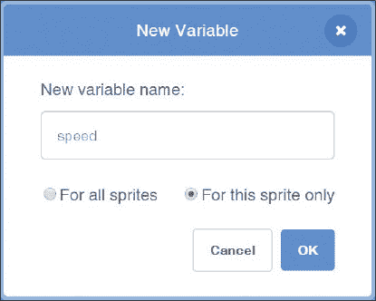

*为速度创建一个新变量*

给你的变量命名为**速度**，并将其设置为**仅限该角色**。这样做可以更容易跟踪，因为只有虫子需要知道它的速度。

在你命名并创建变量后，Scratch 会生成一些新的方块，帮助你与其一起使用。

第一个新方块是一个圆形的`值`方块，你可以把它放入任何需要值的方块位置。在这种情况下，我们将使用虫子的当前速度作为值。有方块可以将变量设置为特定的数字，或者像更改任何其他角色属性（如方向或服装号）一样，通过添加数字来改变它。还有一些方块可以显示或隐藏变量。它们到底是做什么的呢？

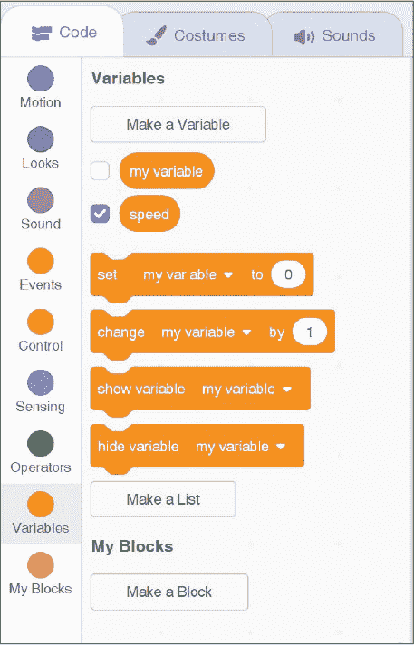

*为你的新变量创建方块*

你应该看到`speed`值块旁边有一个勾选框。如果勾选了，你应该能看到游戏角落中显示的`speed`变量的值。

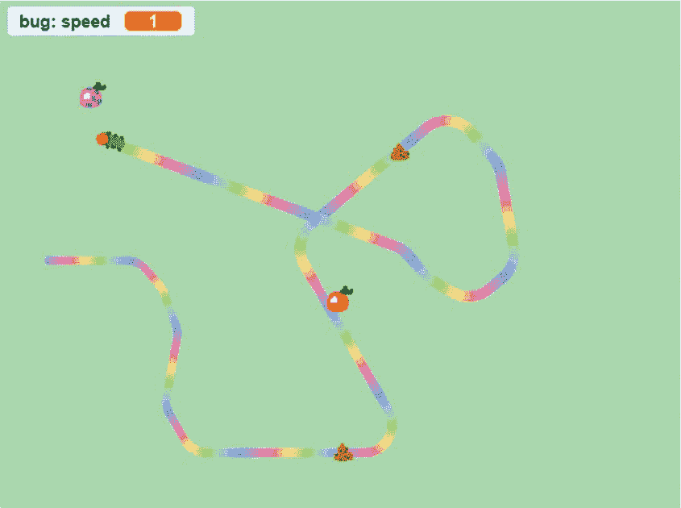

*显示速度*

这个显示在测试游戏时非常有用。你可以随时看到变量的值，以确保它按预期工作。当你取消选中该框时，显示会消失。在分享游戏之前，你可能希望取消选中该变量。但有时你可能想在完成的游戏中保留一个变量的可见性。例如，如果显示的信息是你希望玩家知道的内容，比如当前分数或他们收集的杯形蛋糕数量，你会保持它可见。

让我们使用`speed`变量块来改变游戏进行过程中虫子的速度。

#### 改变速度

使用`speed`变量非常简单。首先，确保在主循环开始之前，在虫子的设置阶段将速度设置为 0。

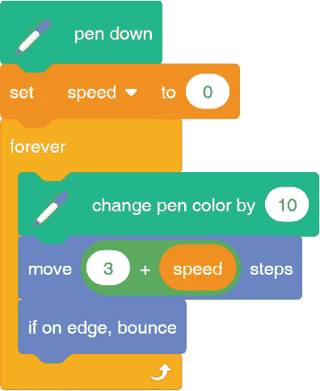

*改变虫子的速度*

然后，让我们改变虫子每次循环后移动的距离。要让虫子按`3 + speed`步数移动，你需要从**运算符**中抓取加法块`+`，并将`speed`值块拖入`+`块的第二个插槽。最小速度将是 3，即虫子的当前速度。`speed`变量从 0 开始，记录虫子在其起始速度基础上获得的速度。

现在我们有一个起始点，每当虫子吃到一颗浆果时，就增加它的速度，并在它撞到障碍物时减速。我们可以使用`change speed by`块来实现这一点。

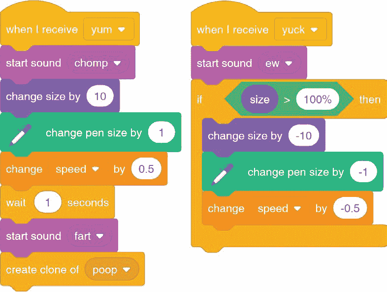

*使用通过块改变速度*

一个好的增量是 0.5 秒，即 1 的一半，或五分之一秒。如果增量是 1，虫子会加速得太快。尝试不同的数字。检查游戏角落的速度显示，确保吃浆果让虫子变得更快，撞到障碍物则使其减速。

### 结束游戏

在*奇怪的虫子大吃一顿*中，虫子吃得越多，它就变得越大、越快。但目前，虫子可以变得多大或多快并没有实际限制。虫子会不断地增长。我们可以选择虫子生长的某个点，并说到此为止！我们可以在虫子达到一定大小或以一定速度移动时触发某些事件。例如，当虫子变得非常巨大时，它可以变成一只蝴蝶，而不是继续变大。

如何决定终点在哪里？多快算是太快？打开速度显示，玩一会游戏。尝试找到一个既快速又困难且紧张的点，但又不至于*过于*快速、困难或紧张。找到*接近*游戏变得太难的那个点，记住速度变量的数字。对我来说，7.5 似乎是一个合适的最高速度。

我们希望游戏的结尾是壮观且令人印象深刻的。当玩家到达游戏的终点时，他们应该知道这一点，并感到自己得到了奖励。但是，在我们编写代码之前，让我们选择一个新的服装来代表虫子进化后的形态，并为其变身添加一些音乐。

#### 选择蝴蝶服装

转到虫子的**服装**标签。如果你愿意，你可以为虫子绘制一个新的服装，例如一只比原始虫子大得多的多彩蝴蝶（但依然朝右！）。在这个例子中，我将从 Scratch 的内置库中选择一套蝴蝶服装。

将鼠标悬停在服装菜单上，然后点击**选择服装**按钮，弹出一个图片菜单。这个菜单应该类似于我们从中挑选“咀嚼效果”的声音库。你也可以点击**动物**类别，便于找到蝴蝶。我喜欢`Butterfly2-b`，因为它最具色彩感且依然有点奇怪。一个奇怪的虫子长成一只奇怪的蝴蝶，不是吗？

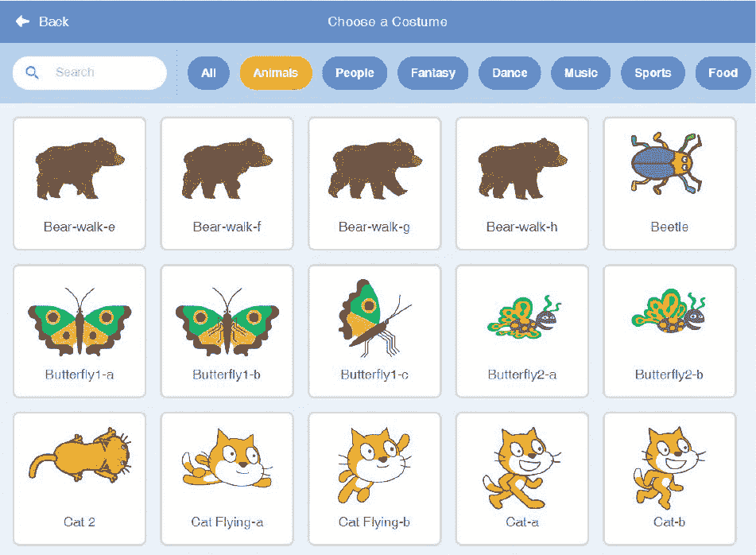

*选择蝴蝶服装*

让我们为变身选择一些音乐。再次，我们将从声音库中找到一些短小的音乐片段。查看**Loops**类别，找到一个叫做`dance magic`的曲目。它听起来像是在变身成蝴蝶时会听到的音乐。

#### 编写变形代码

使用简单的分支，我们将编写变身的代码。当虫子吃掉一颗浆果时，我们通过条件语句来检查虫子的速度和大小是否足以进行变身。如果虫子还没有达到它的大小和速度限制，游戏将继续，虫子只会变得更大更快。（我们将使用速度 7.5 来检查它是否达到这个速度。）如果它足够快，我们将广播新的消息`evolve`。

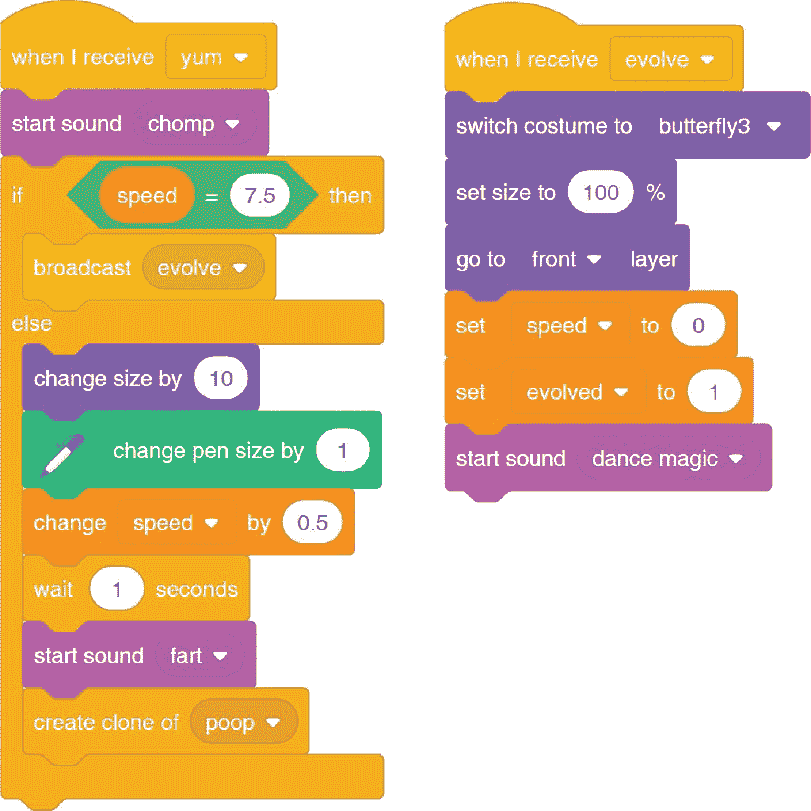

*将你的虫子变成蝴蝶*

正如你所见，我们创建了一个`当我收到 evolve 时`事件来处理实际的变身。是的，这意味着精灵可以接收它们也可以广播的消息！我们可以使用广播让一个精灵在另一个事件进行中的时候运行一个事件。这个`evolve`事件将虫子的服装改为`butterfly`，并将它的大小重置为`100%`。否则，虫子将变得超级巨大，因为此时虫子的大小是它初始大小的两倍多！

然后，事件将蝴蝶发送到最前面。“将它送到最前面”意味着将它放到比其他物体更靠近屏幕的位置。想象一下，一堆照片放在你的厨房桌子上。我们希望蝴蝶能在所有其他精灵前面，这样它才能在它那雄伟的翅膀上飞翔。如果我们不把它送到最前面，克隆的浆果和便便看起来就像是在蝴蝶前面，这样就会显得很奇怪。

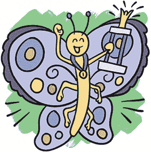

然后，事件将虫子的速度改回 0（这样它会优雅地飘动，而不是极速飞行），设置一个新变量`evolved`为 1，并播放`dance magic`的音乐。

`evolved`变量跟踪游戏是否已获胜。当你创建`evolved`变量时，确保它是一个`For all sprites`类型的变量。我们希望游戏中的每个精灵都能知道游戏是否结束。

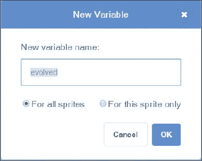

*创建 evolved 变量*

我们还可以使用`evolved`变量来给蝴蝶添加一个酷炫的变色效果。在**外观**下，`change color effect by`块可以改变精灵的外观。你可以设置这个块来做各种不同的效果，比如旋转、像素化和幽灵效果，这使得精灵变得透明。

为了创造一个五彩斑斓的蝴蝶，我们将使用颜色选项。这个选项将精灵的所有颜色改变为其他颜色，类似于我们通过循环使用笔的颜色来创建彩虹效果。

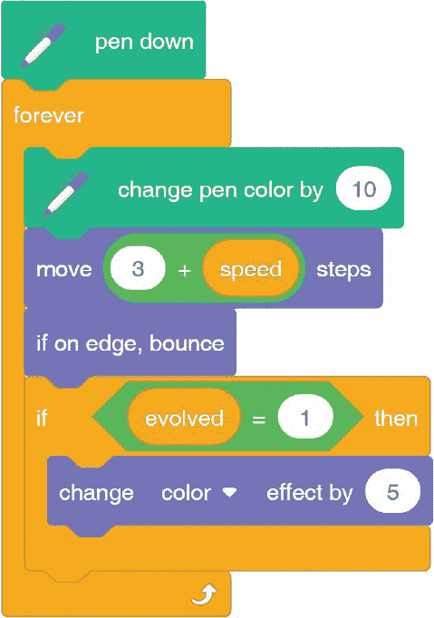

*改变蝴蝶的颜色*

在虫子的主循环中，使用条件语句检查`evolved`变量是否等于 1。如果是，执行变色效果。正常的移动、绘图和碰撞屏幕边缘的行为仍然应该发生，所以我们不希望改变这些。

重要的是确保虫子在设置阶段将其服装切换回原始的怪异虫子形态。将`switch costume to costume1`块和`set evolved to 0`块添加到`when flag clicked`事件中。这两个块将重置蝴蝶结局中改变的变量。否则，当你重新启动游戏时，可能会从蝴蝶形态开始游戏！

好的，试试你的游戏，看看它是否有效。你能到达游戏的结局并把虫子变成蝴蝶吗？

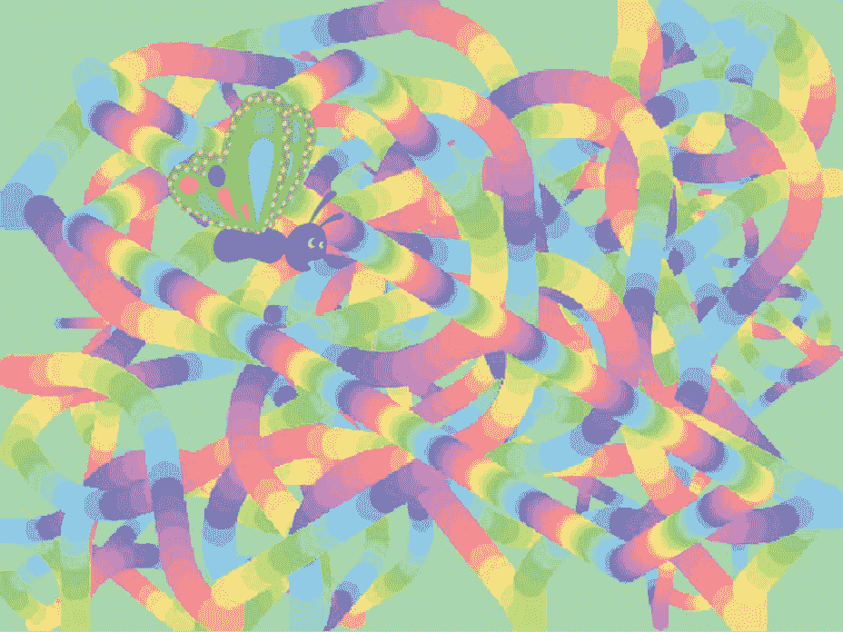

*变身完成！*

### 改变蝴蝶的行为

如果你能够把虫子变成蝴蝶，你会注意到蝴蝶仍然可以吃浆果、拉屎，并且变大或变小。蝴蝶应该是虫子的最终形态，超越了虫子的生命极限。它也应该在空中飞翔，不再需要担心粪便或坏的浆果。

因为我们把`evolve`设为*通用变量*，即所有对象都能看到的变量，所以我们可以在浆果和粪便上添加条件，防止它们在虫子进化后继续检查与虫子的碰撞。以下是`poop`精灵的条件代码。

我们检查`evolved`变量是否等于`0`，这意味着虫子还没有进化成蝴蝶。只有*在此之后*我们才会检查是否与虫子发生接触。

*检查虫子是否变成蝴蝶*

你可以在浆果上使用相同的条件：用一个条件来防止原始浆果在玩家获胜后生成克隆，用另一个条件来防止克隆在虫子变成蝴蝶后继续与虫子发生接触。只要确保你的代码块正确嵌套。

最重要的是，确保所有应该在虫子进化之前发生的事情都在分支内部，而不是外部。

### 添加起始消息

现在我们的游戏有了一个结局。但要*真正*让它完整，我们也要在开始时加入一些东西。我们将添加一条小消息，告诉玩家他们应该做什么，那就是大快朵颐地吃莓果！

在**外观**下，你会找到一些代码块，让我们的精灵在小气泡中说话。使用这些代码块，在点击旗帜时给玩家显示一条介绍性消息。

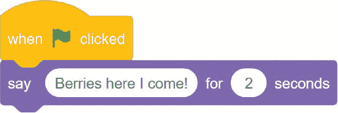

*添加起始消息*

由于时间限制，我们将这条消息放入一个独立的代码块中。如果它和主循环放在同一个代码块里，主循环将不会开始，直到气泡消息消失。虫子将会冻结，直到消息消失，而不是像一只真正饥饿的虫子那样，一边说话一边移动。

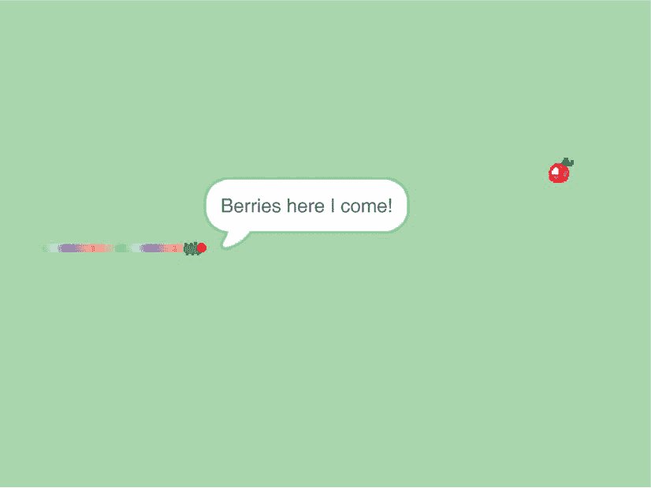

*起始消息的样子*

### 可选的尝试内容

如果你想要一些挑战，下面是对*怪异虫子大吃特吃*的额外修改建议。所有这些都可以使用你目前所学的技能来完成。如果你需要提示，可以在你的网页浏览器中打开我的游戏版本，然后点击**查看内部**来查看游戏的内部结构。点击**重混**来创建并保存你自己的副本，你可以对其进行修改。

**练习 1：为莓果和便便的出现和消失制作动画。**

物体可以逐渐出现、缩小消失或渐渐消失，而不是突然出现和消失。除了使用服装外，还可以尝试图形效果，比如幽灵效果或大小变化。你可以让莓果看起来像是通过变大然后缩小来“扭曲”进来的，用`repeat`代码块让它逐渐变小，直到它恢复到正常大小。（回想一下，精灵的原始大小总是 100%。）一坨便便也可以通过缩小消失，直到完全消失。发挥创意吧！

**练习 2：在虫子第一次吃到坏莓果时显示一条消息，警告玩家这些莓果有问题。**

添加一条消息，如“呸！绿色莓果已经坏掉了！”技巧是让这条消息*仅在虫子第一次吃到坏莓果时*出现。确保警告只发生在坏莓果上，而不是便便上！为了风格，你希望文字气泡从虫子那里出现，而不是从莓果那里。你可能需要使用一个变量来跟踪消息是否已经出现过，并用广播消息告诉虫子显示文字气泡。

### 你学到了什么

在这一章中，我们讨论了一些更高级的想法。你学会了如何创建自己的变量来跟踪数据。你编程让精灵自我克隆，这样你就可以有多个相同的精灵副本。通过广播消息，你为精灵提供了一种相互通信的方式。你还了解了时间压力以及如何使用它来让游戏更加刺激。

在下一章，我们将讨论如何在 Scratch 中制作更大型的游戏，包括拥有多个关卡和场景的游戏。我们将探索这些关卡可能是什么样的。

Scratch 是学习编程的一个很好的方式。你了解 Scratch 的越多，越能为学习“严肃的成人”编程语言做好准备。但基本概念是一样的。如果你只是对制作酷炫游戏感兴趣，Scratch 是一个非常优秀的选择。现在，让我们来制作一些更棒的 Scratch 游戏。我们在第三章见！
