## 第四章：Hatlight：一款洞穴探索平台游戏

在本章中，你将结合所有学到的编程、角色设计与动画、以及关卡设计的知识，在 Scratch 中制作属于你自己的平台游戏。*平台游戏*是像*超级马里奥兄弟*这样的游戏的 fancy 名称，其中玩家可以看到游戏世界的剖面图，主要通过跳跃在悬空的的平台上移动，就像这里展示的那样。

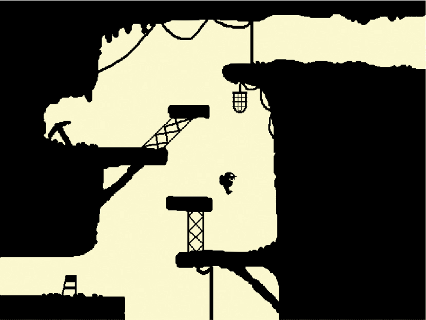

*我们将创建的平台游戏*

如果你不想担心编程，可以访问*[`tinyurl.com/hatlightempty/`](http://tinyurl.com/hatlightempty/)*，这里有一个已写好平台引擎代码的游戏版本。你只需要进行关卡设计。

### 关于 Hatlight

让我们预览一下完成版的*Hatlight*游戏，让你了解我们正在制作的内容。在这个游戏中，你将扮演一名探险者，使用头灯（装在帽子上的手电筒）来探索一个又大又弯曲的洞穴。因为地下很黑，你需要依靠你可靠的头灯来照亮道路，如下图所示。如果你能找到一些电池，就可以让光线变得更强。

在以下链接玩游戏：*[`scratch.mit.edu/projects/122190314/`](https://scratch.mit.edu/projects/122190314/)*。你可以使用左右箭头键进行移动，使用上箭头键跳跃。（你也可以使用空格键跳跃，或者甚至使用 Z 键——选择哪个键位更自然由你！）

总共有七个电池！你能找到多少个？

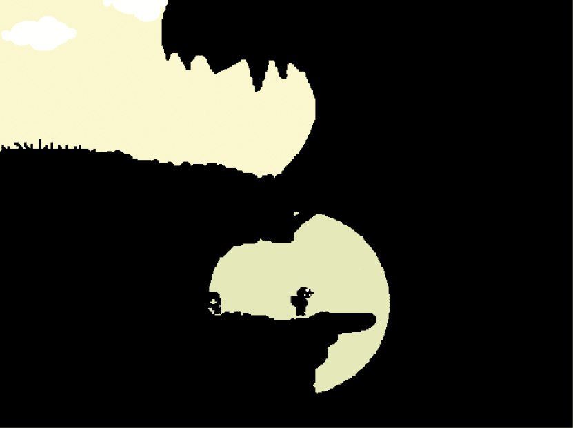

*使用头灯进行探索！*

### 编程平台移动

当你制作像*Hatlight*这样的游戏时，你需要考虑玩家的移动方式。玩家通过移动与游戏世界互动，因此我们希望让平台上的移动感觉自然。

平台移动是一个庞大的项目，所以让我们将其分解成更小的部分。将大任务分解成小部分的过程称为*分解*。我们将编写四种类型的移动：

+   横向行走。

+   跳跃（当然啦！）。

+   在没有可站立物体的地方掉落。

+   攀爬倾斜或不平的表面。（这意味着我们可以绘制自己的关卡，而不用担心地面是否平坦。我们的游戏将发生在一个洞穴中，所以我们希望有*很多*颠簸的地面。）

如果我们一次只处理一部分内容，创建游戏会更容易。

#### 创建碰撞箱精灵

让我们从创建一个包含所有玩家平台动作代码的精灵开始。

在 Scratch 中创建一个新项目并打开画图编辑器。使用**矩形**工具绘制一个平滑、完美的矩形，像这样。

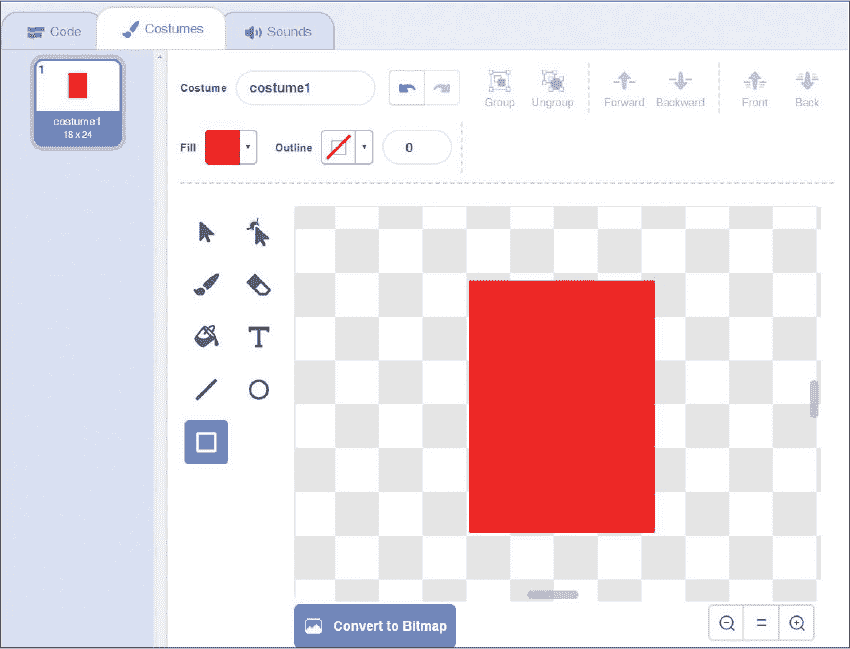

*绘制碰撞箱矩形*

不要让碰撞箱太大！我们需要在屏幕上留出足够的空间，以便玩家能够跳跃和探索。当玩家在奔跑、跳跃并从一个平台跳到另一个平台时，我们需要检查 *碰撞*。碰撞让我们知道玩家是否撞到墙壁。如果发生这种情况，我们可以说：“嘿！你和墙壁不该在同一个地方。”然后我们可以把玩家移到墙壁外面。

**注意：** 在下一章中，我们将创建另一个精灵来处理玩家的动画。这个精灵将与碰撞箱一起移动，并根据碰撞箱的状态改变服装。目前，碰撞箱看起来是完全平坦和矩形的，目的是为了让碰撞检测更容易。

当 Scratch 检查两个精灵是否接触时，精灵的 *精确形状* 很重要。例如，如果玩家的精灵有一个非常长的鼻子，他们可能会通过鼻尖挂在平台上！

为了防止这种情况发生，我们将确保 Scratch 始终检查碰撞，通过让我们的精灵看起来像一个整齐的矩形。这种形状有时被称为 *碰撞箱* 或 *边界框*。在完成的游戏中，它将是不可见的。稍后我们会为主角添加更好的动画效果。

确保你的碰撞箱居中在 `+` 上。将精灵命名为 `Hitbox`。

#### 绘制测试区域

在编写 `Hitbox` 精灵的代码之前，让我们先创建一个测试区域，在其中试验我们的移动并确保其按预期工作。

创建一个名为 `Walls` 的精灵，它将包含我们游戏中的所有固体对象：墙壁、地板和天花板。下图展示了我们希望玩家与之碰撞的所有对象。

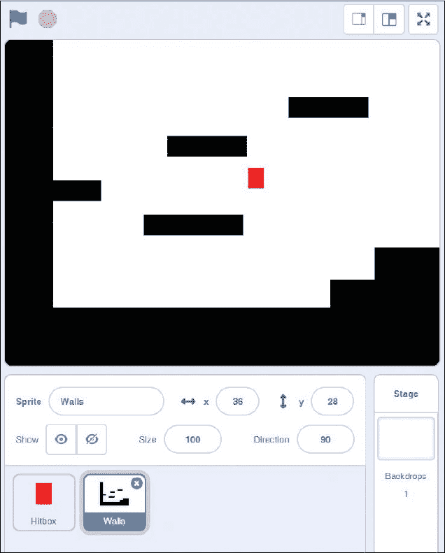

*创建墙壁*

精灵绘制窗口的完整大小与 Scratch 的游戏窗口大小相同，因此你可以将对象绘制到边缘。如你所见，示例展示了测试关卡。我们使用矩形工具绘制了所有楼层的直线。稍后在本章中，当我们为玩家添加代码以让其爬过崎岖的地面时，我们会让这些楼层看起来不那么规则。现在，保持简单即可。

确保你的 `Walls` 精灵准确地放置在游戏屏幕内。这里有一个方便的小技巧：给 `Walls` 精灵添加代码块 `go to x: 0 y: 0`。然后双击代码块将精灵定位到屏幕的中间位置。（你可以在之后删除代码块。）

我们稍后会将所有关卡作为不同的服装放入 `Walls` 精灵中。但目前，我们只需要一些墙壁和平台，供玩家在其中奔跑。

#### 用事件组织我们的代码

我们的平台游戏将涉及大量的代码。我们已经确定了需要编写的四种不同类型的移动。如果我们在编写代码之前没有决定如何组织它，代码将变得 *非常* 混乱，难以追踪。

幸运的是，我们已经识别出代码中需要的不同部分：走路、跳跃、下落和攀爬。因此，我们不会创建一个很长的栈，而是会为每个部分创建小的栈。

##### 创建事件链

每个栈都需要以一个事件开始，因此我们会为每个需要的栈创建不同的事件。回想一下，在 Scratch 中，精灵可以接收它自己广播的消息。这意味着我们可以通过广播下一个消息来结束每个栈，从而创建一个等效于`forever`循环的效果。最后一个事件将回调到第一个事件，代码会不断重复。

在`Hitbox`精灵中创建这些事件。

**注意：** `wrap`事件用于从一个屏幕移动到另一个屏幕。我们稍后会回到这个问题！

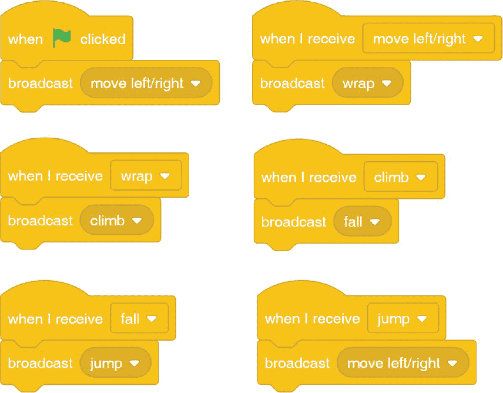

*创建事件序列*

现在我们有一系列按顺序播放的事件，每个事件都会广播下一个，最终循环回到开始。尽管这些事件中还没有代码，但我们已经有了一个基本的工作结构来构建我们的游戏。

让我们更详细地探索每个事件。

#### 创建变量

我们将首先通过变量标签定义一些变量。我们会把变量放在`绿旗点击`事件中，在实际的循环开始之前，如下所示。我们只希望它们在游戏开始时设置一次。

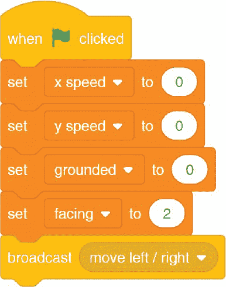

*为绿旗点击事件创建变量*

`grounded`变量是一种特殊类型的变量，称为*布尔*变量，它只有两个值，比如 true 或 false，开或关，等等。在这个例子中，`grounded`的值始终是 0 或 1。如果它是 0，玩家在空中；如果它是 1，玩家就在地面上。我们可以利用这个值确保玩家在跳跃之前已经站在地面上。

类似于我们在编程中定义变量的方式，我们将这些变量设置为我们希望它们在游戏开始时的值。每次游戏开始时，程序都会重置这四个变量。

### 编程玩家移动

现在我们已经定义了变量并设置了它们的默认值，我们可以开始编写每个栈的程序了。

#### 左右移动

我们将编写的第一个栈是`向左/向右移动`栈。完整的栈应该像这样。

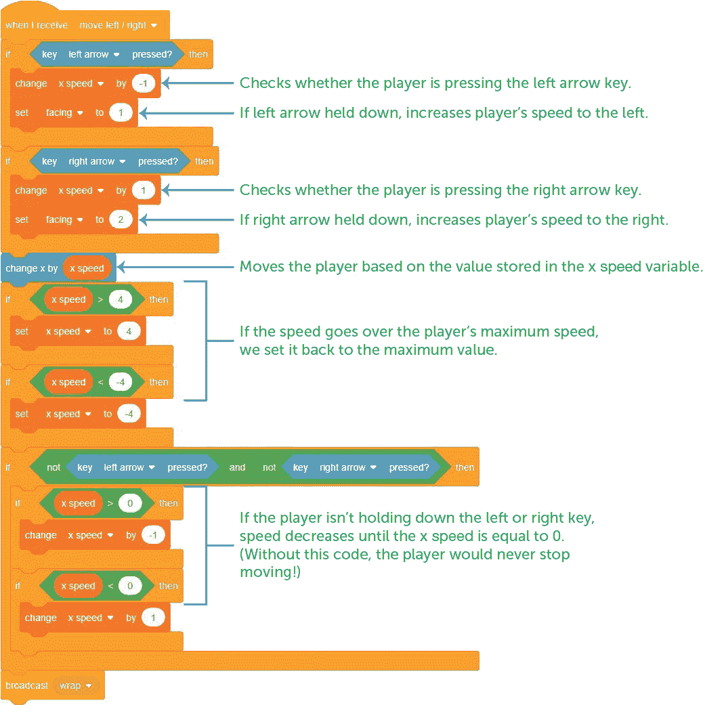

*移动代码*

现在让我们一步一步地看看这个栈是如何工作的。注意，正值表示玩家向右移动，负值表示玩家向左移动，就像在数轴上一样。

#### 攀爬斜坡和台阶

到目前为止，我们已经编程了玩家在平坦表面上如何移动。但我们还没有编程如何处理斜坡或台阶。

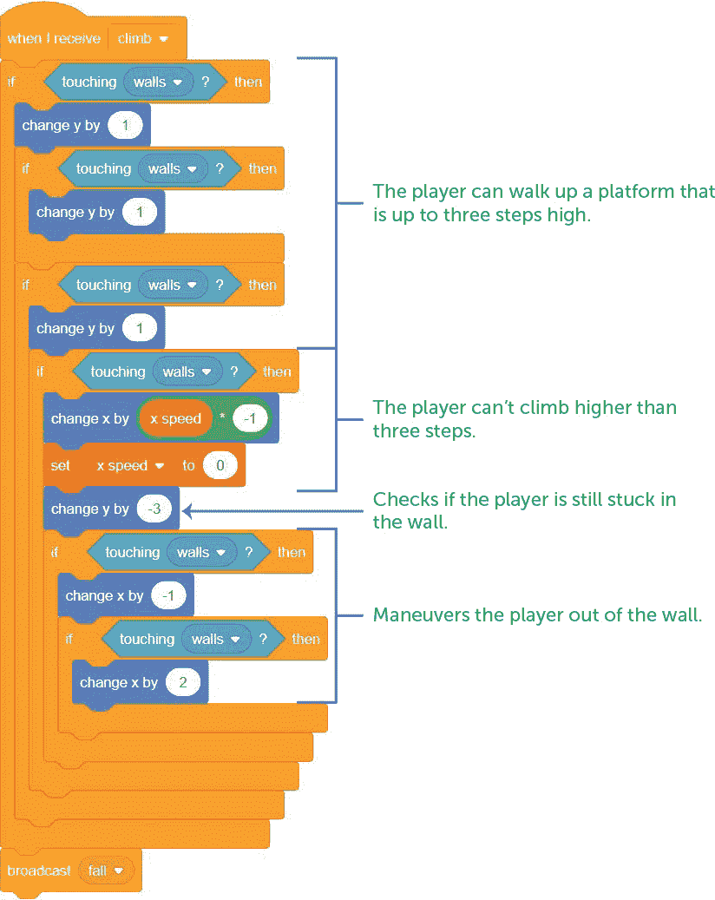

*攀爬代码*

让我们编程让玩家爬坡和爬台阶，只要这些坡度不是太陡或太高。玩家只能走上小于三阶的坡道或台阶。如果玩家走了超过三阶的台阶，这意味着坡道太陡或者他们撞到了墙壁。所以如果玩家走到一个太高的坡道或台阶，无法爬过时，我们就让玩家无法通过它。这里是完整的`climb`代码。

最后这个`if () then`语句块用于紧急情况下让玩家从墙壁中松脱，确保他们永远不会卡在墙里！

#### 下落

这是`fall`代码，用于确定玩家在没有接触地面时应该如何下落。

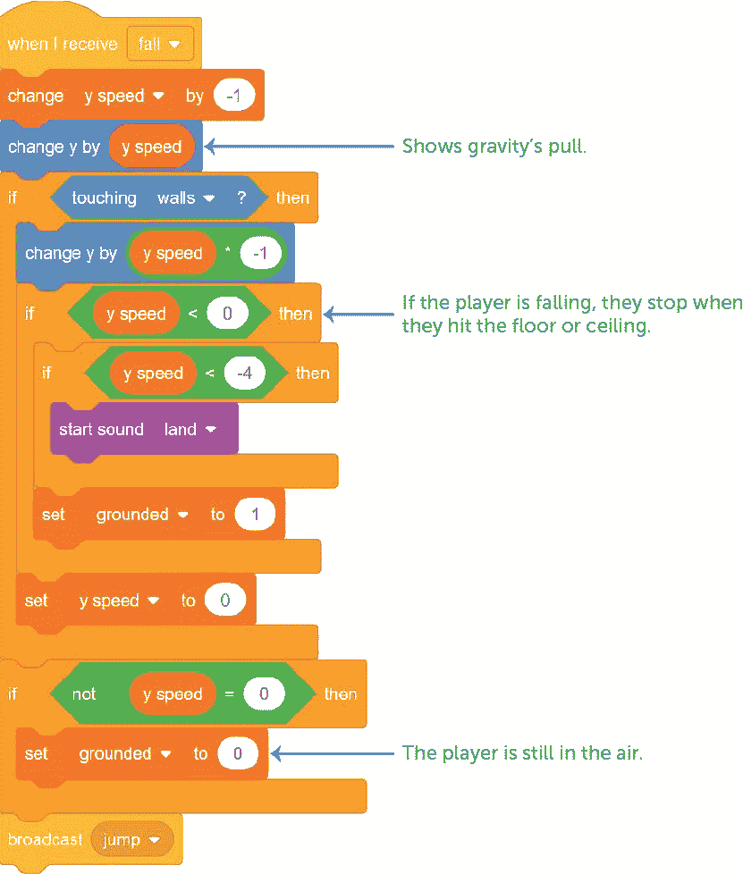

*坠落代码*

记住，负数表示向下，正数表示向上。由于玩家的`y speed`，他们不会完全与地面对齐，而是可能略微重叠。如果发生这种情况，我们通过将`y speed`乘以-1 来撤销他们的最后一个动作，使玩家反向移动。

如果`y speed`是负数，意味着玩家在下落时撞到了地面。如果是正数，则意味着玩家在跳跃时撞到了天花板。无论是哪种情况，我们都会将他们的`y speed`设为 0，因为他们停止了下落。

#### 跳跃

接下来，我们将看看如何编程实现玩家的跳跃动作。这是`jump`的代码。

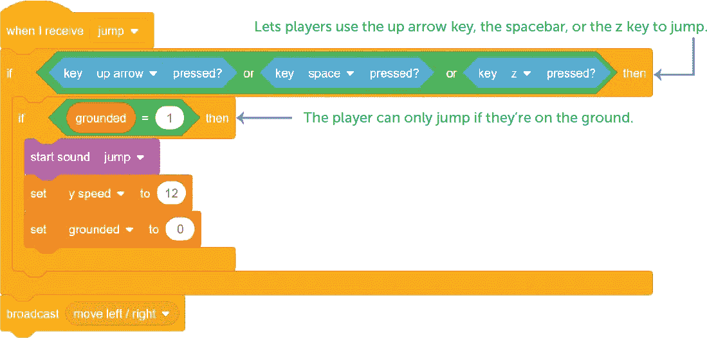

*跳跃代码*

#### 使用变量创造自然运动

为什么我们使用`x speed`和`y speed`变量，而不是直接改变`x`和`y`？例如，为了将玩家的速度设置为 10，我们*可以*每当玩家按下右箭头键时，直接将玩家的`x`增加 10。

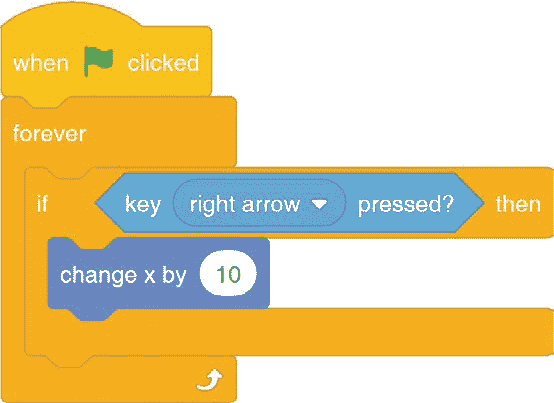

*不使用变量的加速*

在这个示例中，玩家要么停止了（速度为 0），要么在移动（速度为 10）。程序不允许出现介于两者之间的任何速度。这导致了看起来不自然的二元运动。

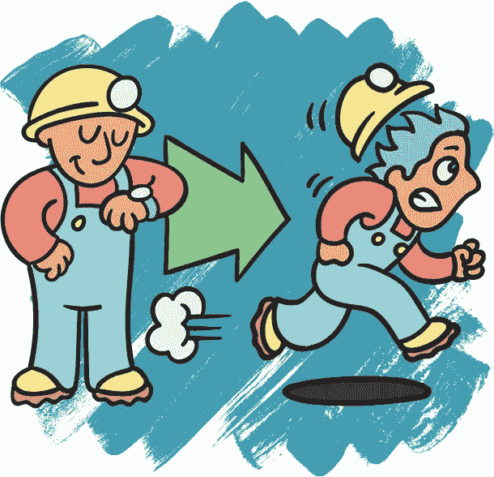

*二元运动*

但如果我们在一系列动作中逐渐增加玩家的速度，就能创造出更自然的运动感觉，让玩家从慢速开始，逐渐加速到全速。

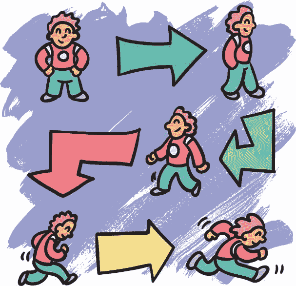

*逐渐加速*

类似地，我们也可以让玩家减速，而不是立即停止。

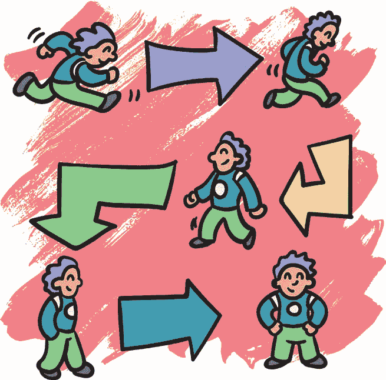

*减速*

如果你还没有，尝试在你的测试关卡中运行你的代码。确保你将`broadcast wrap`块改为`broadcast climb`，因为我们还没有编写`wrap`部分。通过添加一个倾斜的地面来更改测试关卡。如果玩家跳得不够高，无法到达平台，则降低平台的高度。或者更改玩家跳跃的初始速度。（如你在`jump`代码中看到的，设置为 12。）

你可以通过修改代码块中的数字来改变游戏的感觉。例如，尝试改变重力值或玩家的跳跃速度、玩家的最大行走速度或加速速度。你能让玩家的移动感觉像是在月球上吗？你能让玩家的动作感觉非常沉重吗？如果你非常自信，尝试编写双重跳跃的代码！

### 创建一个有趣的探索世界

平台游戏非常有趣，因为它们给我们提供了一种有趣的思考空间的方式。在现实生活中，下方总是位于下方，上方总是位于上方。由于重力的作用，通常向下移动比向上移动容易。这意味着到达更高的地方可能会比较困难，并且需要更多的努力。

但在我们的探索平台游戏中，玩家可以自由地以他们喜欢的方式探索世界，限制较少。这确实意味着我们需要从不同的角度来思考空间。我们必须考虑平台的不同部分是如何互相连接的。

为了让玩家真正感受到他们在探索，我们需要创建一个比单一屏幕更大的世界，但它会保持一致。例如，如果玩家走出一个屏幕的右侧，他们应该能通过向左走回到最初的地方。这样，玩家可以逐渐熟悉世界的不同部分以及它们是如何连接的。

你有没有曾经因发现一条到达某个地方的新路线而感到兴奋？在那一刻，你对你的社区有了更深的了解：事情开始像拼图一样连接起来！我们可以通过创造一个有趣的世界让玩家产生这种感觉，去探索。

#### 使用变量创建一个网格地图

就像你所在社区的街区一样，我们将把屏幕安排成一个网格。我们将从一个 4 × 4 的房间网格开始，总共 16 个！既不大也不小。我们会给每个房间编号，以便追踪它们，就像这样。

| 1 | 2 | 3 | 4 |
| --- | --- | --- | --- |
| 5 | 6 | 7 | 8 |
| 9 | 10 | 11 | 12 |
| 13 | 14 | 15 | 16 |

将网格想象成漫画书页面上的面板。看看这个网格，我们可以轻松地弄清楚如何从一个屏幕移动到另一个屏幕。向右移动一个屏幕，我们只需将数字加 1。房间 1 + 1 = 房间 2。向左移动，我们减去 1。向上或向下移动，我们需要进入不同的行。例如，如果我们想从房间 2 移动到房间 6，我们需要加 4。要回到上面，我们需要减去 4。

向上或向下移动一行需要加或减去 4，因为每行有 4 个空间。但在一个 5 × 5 的网格中，向下移动一行需要加 5！

这种移动有时被称为*快速翻页*，因为屏幕不是逐渐滚动，而是跳到一个新的图像，就像翻书一样。

我们将使用一个变量来跟踪玩家所在的屏幕。

#### 屏幕之间的移动

我们将使用 `Walls` 精灵来存储所有的屏幕。它为每个房间都有一个服装，并在玩家走出一个屏幕进入另一个屏幕时更换服装。首先，让我们编写代码来实现从一个屏幕到另一个屏幕的移动，使用以下代码。

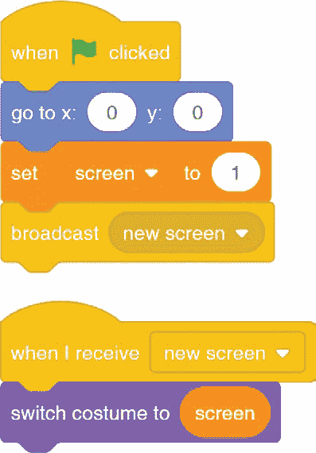

*换屏代码*

你可以看到我们使用了一个新变量 `screen` 和一个新事件 `new screen`。当游戏开始时，`Walls` 精灵将 `screen` 变量设置为 1，然后广播 `new screen` 事件，将其服装更改为与玩家所在屏幕匹配。从现在开始，主要是玩家精灵会切换屏幕。

##### 测试屏幕切换

现在为 `Walls` 精灵添加 15 个新服装，总共 16 个。现在可以先将它们留空，如果你只是将它们命名为 `costume2`、`costume3` 等也是可以的。事实上，最好在它们的名称中使用数字。只要确保数字准确并按正确顺序排列即可！

我们应该填充的一个服装是 `costume2`，这样我们就可以测试屏幕切换是否正常工作。这个屏幕的外观不重要，但尽量使屏幕边缘的平台与第一个屏幕中的平台对齐。最简单的方法是使用选择工具高亮显示上一屏幕的边缘，然后将其复制粘贴到新屏幕中。

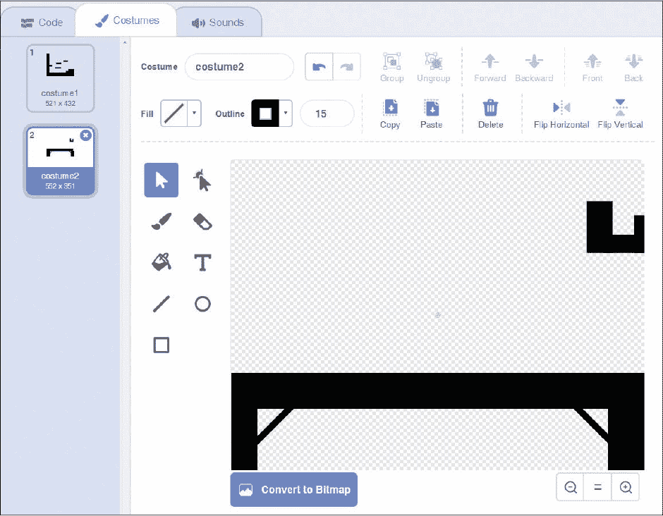

*将上一屏幕的边缘复制粘贴到 `costume2`。*

#### 编写屏幕切换代码

我们在代码中为 `move left/right` 堆栈和 `climb` 堆栈之间添加了一个 `wrap` 部分，但它被留空了。现在让我们来填充它！

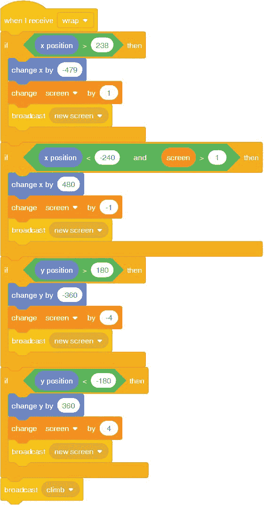

*换屏代码*

我们希望玩家能够从屏幕的一侧走出去，然后出现在下一个屏幕。例如，如果他们从屏幕 1 的右侧离开，应该出现在屏幕 2 的左侧。我们将为玩家可以移动的四个方向编写代码：上、下、左、右。

对于每个方向，我们需要做以下事情：

1.  **检查玩家是否在屏幕边缘之外：** 记住，`x` 从左侧的 –240 到右侧的 240，`y` 从顶部的 180 到底部的 –180。

1.  **将玩家移动到屏幕的相对边缘：** 当玩家从一个屏幕的底部离开时，他们应该进入下一个屏幕的顶部。

1.  **调整屏幕变量：** 当玩家上下移动时，每次需要移动 –4 或 4 个屏幕。

1.  **广播新屏幕事件：** 这会让所有其他精灵知道屏幕已经切换，因此 `Walls` 精灵将更换到与当前屏幕编号匹配的服装。

你可能需要根据 `Hitbox` 精灵的大小调整 `x` 和 `y` 位置的值。Scratch 会在精灵离开屏幕前将其停止，这意味着较大的精灵可能无法达到 x 位置 –240。在这种情况下，你可以尝试使用 –239。不断调整值，直到代码按你希望的方式工作。

#### 使用光明与黑暗

为了增强探索的感觉，我们将限制玩家看到的范围，仅限于从他们的帽灯发出的光圈。这是一个非常简单的效果。所有的墙壁和平台都是黑色的。当我们在它们后面放一个黑色背景时，玩家无法看到墙壁的位置。通过在黑色背景和黑色墙壁之间放置一个小的光场，我们创建了一个玩家可以看到墙壁的区域。

当然，这只有在所有墙壁和背景颜色相同的情况下才有效。如果墙壁与背景颜色不同，玩家会看到一切，游戏中的神秘感会减少，探索也没有什么意义。如果你希望墙壁可见，可以使用其他颜色来绘制墙壁，比如洞穴墙上的发光苔藓或岩浆裂缝。

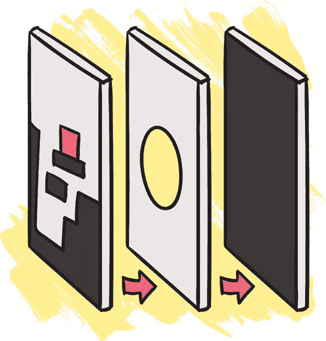

*在背景和墙壁之间创建光场*

使用**椭圆**工具创建一个新的精灵来表示光束。你可以将这个精灵命名为`手电筒`。*椭圆*是一种形状，在一个方向上比另一个方向更宽，就像一个橄榄球。要画一个完美的圆形，在绘制时按住 SHIFT 键。

*绘制光圈*

圆形现在可以是任何大小。稍后，我们将添加代码根据帽灯电池的电量来调整它的大小！只要确保圆形的中心在`+`的上方。这里，我们将它做成了稍微偏黄的颜色，像手电筒的光一样。

确保`手电筒`精灵位于黑色背景和墙壁之间。调整精灵位置的一种简单方法是将`后退 1 层`积木拖到`手电筒`脚本标签下。你不需要将其连接到事件。当你双击一个代码块时，它会立即运行。只需双击`后退 1 层`积木，直到精灵到达正确位置。然后你可以删除这个积木。

#### 编写手电筒代码

现在是时候编写`手电筒`的代码了。以下是编写光源如何显示的完整代码。

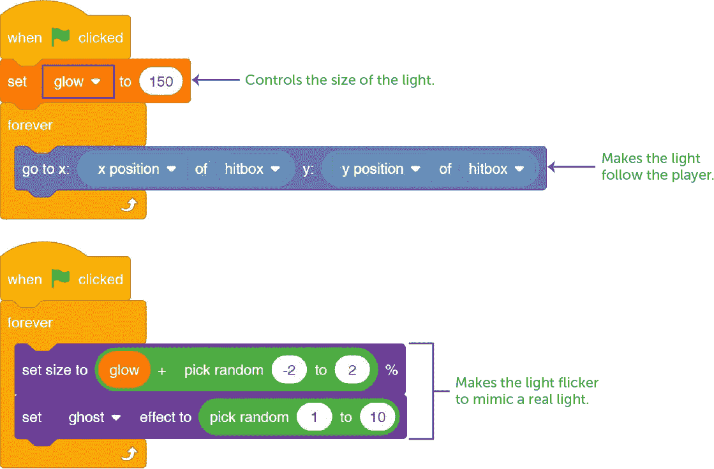

*手电筒代码*

#### 创建可收集物品

在第二章中，我们讨论了收集浆果如何鼓励玩家思考并注意虫子移动的方式。在这个游戏中，收集物品可以鼓励玩家探索并在游戏环境中发现新路径和秘密。

我们来创建一个可收集的电池精灵，玩家用它来增强他们的帽灯（这和现实中的手电筒工作方式不同，但我们可以假设就是这样！）。

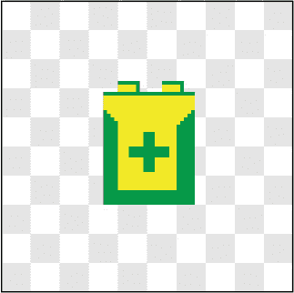

*创建电池精灵*

电池应该是可见的，即使它们不在玩家的光圈内，只要它们在同一个屏幕上。这样，玩家可以在屏幕上看到某个电池，并尝试找到方法到达那里。

完成的游戏将有七个电池，玩家可以收集它们。为了创建多个电池，我们将使用克隆，就像我们在第二章中创建多个浆果一样。

当游戏开始时，`battery`精灵会访问每个电池应该出现的位置，将其`location`变量设置为正确的屏幕，并克隆自己。在游戏开始时，电池会创建七个克隆，每个克隆都有不同的`x`和`y`位置以及屏幕编号。每个克隆使用`location`变量来跟踪它应该出现在的屏幕。

在完成克隆之后，原始的`battery`精灵将其自身的位置设为 0，这样它就不会出现在任何 16 个屏幕上。如果我们不这么做，即使玩家无法收集到它，父级`battery`也会出现在屏幕上。

为了确保电池只在玩家所在的屏幕上出现，我们使用全局`screen`变量来检查它是否与本地`location`变量匹配。如果匹配，那就是正确的屏幕，克隆就会出现！否则，它就会消失。

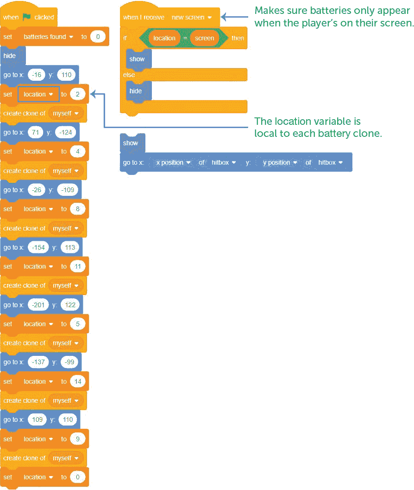

*电池代码*

如果玩家与电池发生接触，我们会将一个值加到全局的`batteries found`变量中，该变量在游戏开始时被设置为 0，并使手电筒的`glow`变量稍微增大。玩家收集的电池越多，他们能看到的范围就越大，从而帮助他们找到更多的电池！

### 你学到了什么

在这一章中，我们处理了许多复杂的概念。你学会了如何编写平台运动程序，并创建了一个可以走路、爬墙、跳跃和下落的角色。你还创建了一个手电筒，玩家可以用它在黑暗中看东西。通过使用快速屏幕移动，你还为角色创造了一个更大的世界来探索。

在下一章，我们将继续设计*Hatlight*，为它填充更多的秘密、挑战以及供玩家发现的更有趣的地方。我们还将创建并动画化一个玩家角色，替代那个碰撞盒。休息一下，吃个小吃，抚摸一下猫，准备好后在第四章见！
