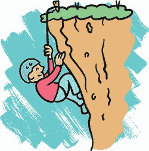

## 第五章：设计关卡

在本章中，我们将继续使用*Hatlight*游戏，讨论*关卡设计*，即游戏中不同区域的设计。你可以通过关卡设计讲述故事或让玩家知道什么是重要的。关卡设计帮助你发展这些想法，并将它们混合起来创造出意想不到的效果。此外，关卡设计还可以让玩家感到惊讶或让他们体验不同的情感：聪明、兴奋、害怕、沮丧或好奇。

作为一个关卡设计师，你需要同时考虑多个不同的概念：

**一个关卡是一系列的挑战或障碍：** 玩家如何从一个地方到达另一个地方？他们在解决这个问题的过程中能否了解游戏？

**一个关卡是一个虚拟空间：** 这个关卡让玩家感觉如何？如果这个关卡是一个真实的地方，它会显得开阔还是狭小？整洁还是凌乱？

**一个关卡是一个图像：** 玩家将每个关卡视为屏幕上的一幅图像。它看起来像什么？它是由尖锐的线条还是曲线组成的？你第一眼注意到关卡的哪个部分？

考虑这些元素可以帮助你通过关卡讲述引人入胜的故事。

### 一起来制作一些关卡吧！

如果你跳过了前面章节中的游戏编程部分，或者只是不想为此担忧，你可以在*[`tinyurl.com/hatlightempty/`](http://tinyurl.com/hatlightempty/)*找到一个带有平台引擎代码的游戏版本。

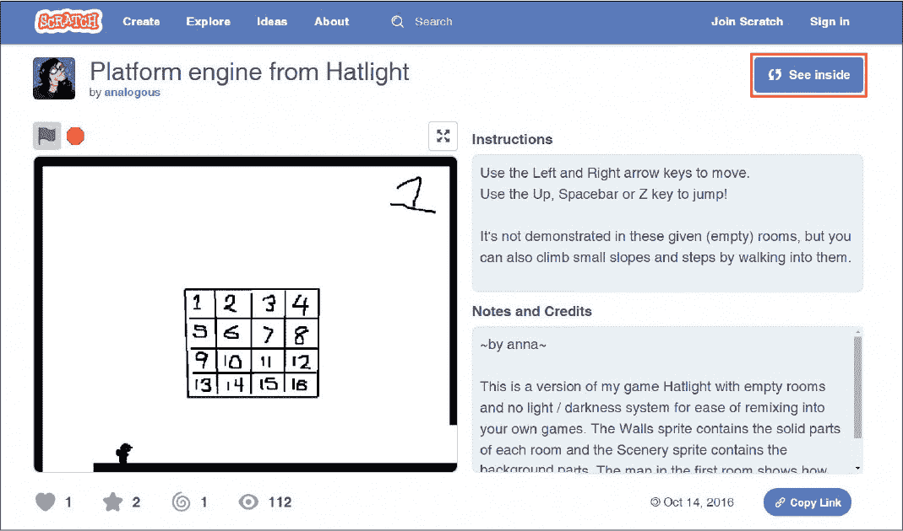

*项目页面*

只需点击**查看内部**，然后点击**文件 ▸ 保存到你的计算机**以保存代码的副本。

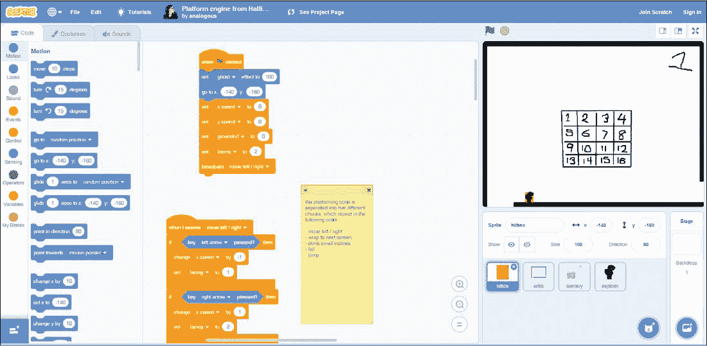

*平台引擎代码*

现在你已经准备好制作你自己的关卡了！

**注意：** 因为这个版本展示了平台引擎代码，所以它没有黑暗和手电筒功能。如果你需要这些功能，可以尝试调整完成后的*Hatlight*游戏。你可以在*[`nostarch.com/scratchgames/`](https://nostarch.com/scratchgames/)*下载！

#### 绘制关卡

你可以通过为`墙壁`精灵绘制服装来设计你的游戏关卡。每个服装应与网格中的一个房间相匹配，正如你在第三章中看到的那样。

| 1 | 2 | 3 | 4 |
| --- | --- | --- | --- |
| 5 | 6 | 7 | 8 |
| 9 | 10 | 11 | 12 |
| 13 | 14 | 15 | 16 |

如果你希望游戏中有光线和黑暗效果，可以创建一个第二个较亮的背景，当你在制作关卡时使用它。

#### 绘制一个洞穴

你可以使用多个绘图工具为你的平台制作不同类型的地形。例如，刷子工具最适合制作弯曲、颠簸和曲折的地面，就像你在洞穴中看到的那样。

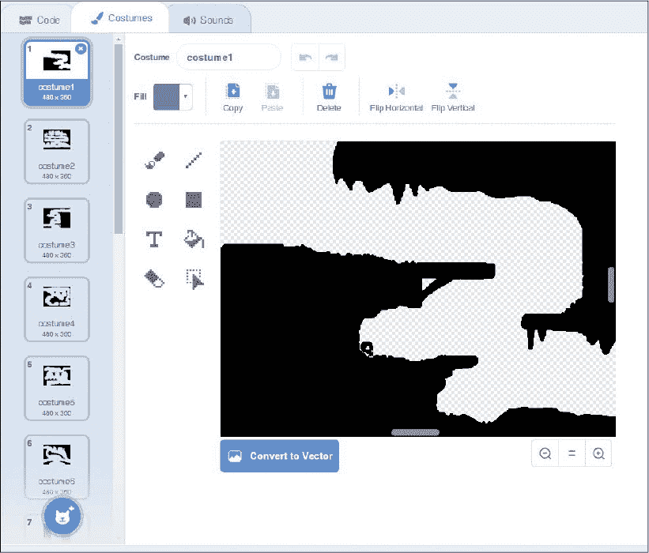

*绘制一个洞穴关卡*

不规则的地形看起来更加*自然*，就像现实世界中的山丘和地面一样。自然界中的事物很少是平坦或笔直的。要制作一个看起来真实的洞穴或山丘，试试使用画笔工具和鼠标绘制。 （设计师称之为*自由手绘*。）线条工具和矩形工具可以绘制直线，非常适合绘制看起来是人造的物体。

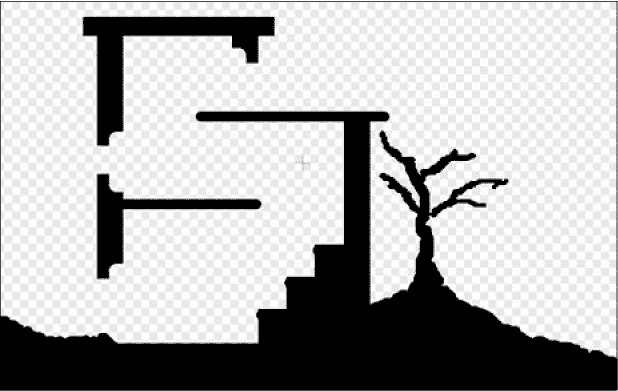

*绘制建筑物*

当我们建造房屋时，通常会建造直墙和平地。在像 *Hatlight* 这样的平面游戏中，如果玩家从一个崎岖的山区进入一个充满直线的地方，玩家会想：“我现在在建筑物里了。”

注意，在绘制直线时，你可以按住 Shift 键来确保它完全是直的。你还可以使用选择工具复制和粘贴屏幕上的部分内容，从而制作相同的部分。

#### 保存细节以备后用

在刚开始绘制关卡时，尽量保持简单。不要花太多时间让它们看起来好看：先把所有的平台放在你想要的位置。稍后你可以回来添加细节。

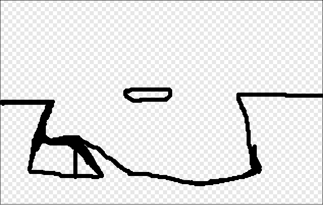

*粗略的初稿*

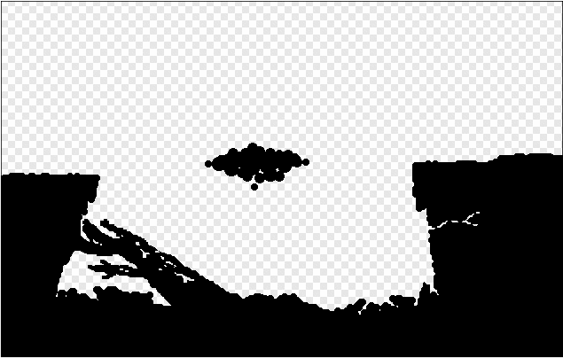

*加入细节后的最终草稿*

在绘制关卡时可以进行试玩。确认它们有效后，再回过头去让它们看起来更漂亮。

这里有一些为你的关卡增添细节的小技巧：

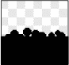

**调整笔刷大小以获得更精细的细节：** 使用更小的画笔给树木添加树枝。

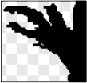

**使用鼠标绘制点：** 与其点击并拖动，不如尝试直接点击以放置一个单独的点。这些点可以是小石子或掉落的碎石。

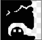

**使用橡皮擦工具绘制：** 使用橡皮擦绘制裂缝和洞口等细节。

现在你已经探索了为你的平台增添真实有趣细节的方法，让我们继续前进。

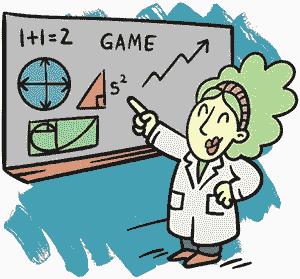

#### 需要记住的事项

请记住，游戏会将你在 `Walls` 精灵中绘制的所有内容视为实心物体。所以，如果不小心，你可能会创造出一些玩家本不应该站上的地方。

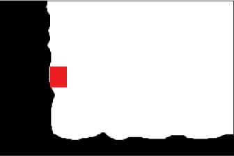

*玩家不应该站在这样的墙上！*

解决这个问题的一种方法是让墙壁向玩家方向倾斜。另一种方法是使用线条  或矩形  工具来确保墙壁是直的。尝试制作一面直墙，然后使用橡皮擦工具  添加一些小凹痕。

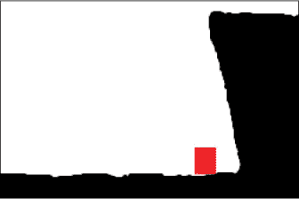

*倾斜的墙壁*

另外，要检查不平的地面和倾斜的表面，确保玩家能够走过它们！玩家应该能够攀爬高度为 3 像素的凸起或坡度，但如果凸起更高，玩家会卡住。

*卡住的玩家！*

确保屏幕之间的地面和平台对齐，否则玩家在从一个屏幕移动到另一个屏幕时，可能会悬浮在空中或卡在地面里。避免这种情况的最简单方法是使用选择工具 高亮显示一个屏幕的边缘，然后将其复制并粘贴到相邻屏幕，就像这样。

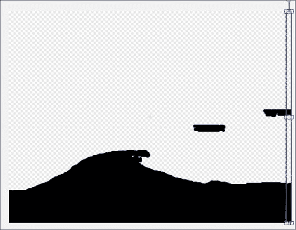

*复制并粘贴屏幕的一个边缘到下一个屏幕*

如前所述，任何你在`Walls`精灵服装中绘制的东西都会是实心的，即使你试图用白色覆盖它。你绘制的所有白色仍然会被视为实心地面。（但如果你想要实心的白色地面，这也没什么大不了的。）

要移除某个物品，你需要使用橡皮擦工具 。

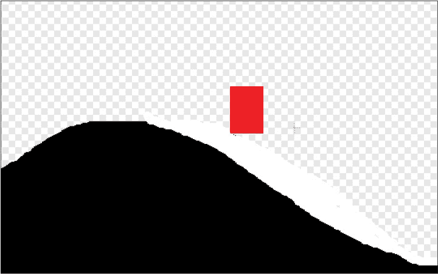

*玩家在实心的白色地面上*

Scratch 认为`Walls`精灵中的每一个小斑点都是一个实心物体。

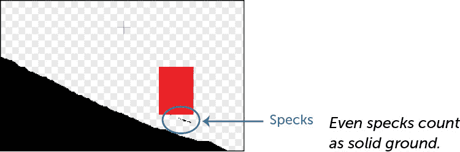

*即使是小斑点也算作实心地面。*

如果玩家卡在某个地方或似乎漂浮在空中，使用缩放工具 检查是否有擦除时留下的小斑点。

#### 添加背景景物

如果我们想在关卡中添加一些不实心的物体，比如背景中的一棵树或一只小狗，怎么办？没问题！

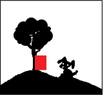

*背景景物*

让我们添加一个`Scenery`精灵来为背景添加细节。像`Walls`精灵一样，这个精灵也会为每个房间准备一个服装。但与`Walls`精灵不同的是，我们在`Scenery`服装中绘制的物品不会是实心的，而是处于背景中，这样玩家可以走在它们前面。

如果你已经从书籍网站上传了完整的游戏，你应该已经有了一个`Scenery`精灵。只需将背景物体绘制到与目标屏幕匹配的服装上即可。

**注意：** 服装上有数字，帮助你追踪不同屏幕。绘制自己的背景时，尽管擦除它们！

否则，你需要编写一个`Scenery`精灵，如下所示。

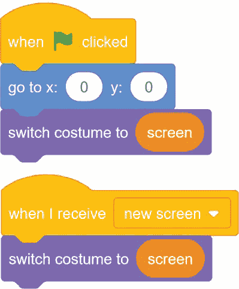

*景物代码*

类似于我们为玩家添加的`new screen`事件，每当屏幕变化时广播该事件，`new screen`消息会改变其服装以匹配我们所处的屏幕，在`Scenery`精灵接收到消息后。确保给`Scenery`精灵准备 16 个服装！

你希望`Scenery`精灵位于`Flashlight`精灵前面，这样手电筒的光线就不会把它遮住。你可以使用“前往最前层”和“向后移动 X 层”代码块在外观标签中调整精灵的深度。记住，你可以双击一个代码块，即使游戏没有运行时，它也会立即执行。当你双击`go backward –1 layers`块时，它会将精灵向前移动一层。

*向后移动 -1 层的代码块*

当你绘制背景景物时，确保`Walls`精灵的服装设置与`Scenery`精灵匹配。这样你就能确认你绘制的背景景物是否与墙壁和平台对齐。

### 教导玩家如何玩

因为*头灯*是一个探索游戏，所以玩家可以按自己喜欢的顺序选择游戏中的内容。但是在让玩家做出重大选择之前，我们需要确保他们理解基本的游戏规则。

我们将通过两个画面开始游戏，向玩家介绍他们需要知道的最重要的概念，比如如何移动、能跳多高，以及是否能够一次性看到整个关卡的全部内容。（提示：不，他们做不到。）

首先，我们希望玩家理解光与暗的作用。因此，游戏开始时，玩家位于洞外的白天，接着进入洞内，那里是黑暗的。

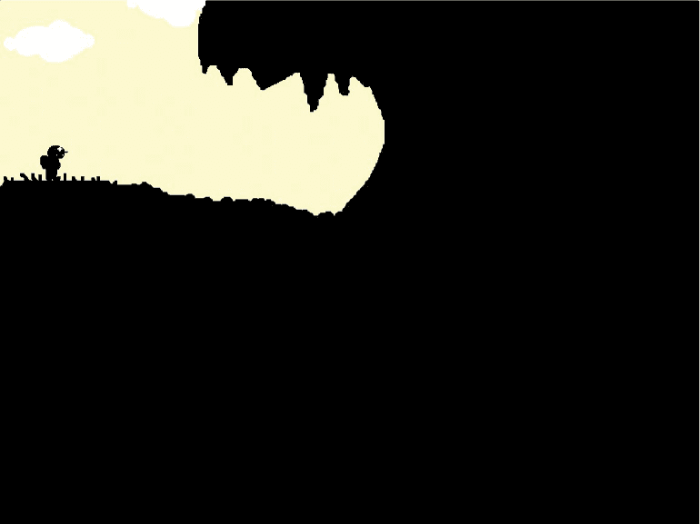

*画面 1：洞口*

我们使用`Scenery`精灵提供白天的光线。当玩家从光线中走入黑暗时，头灯就会出现。这种过渡确保玩家*注意到*头灯的亮起。

当玩家爬下屏幕进入洞穴时，一个吓人的骷髅出现在角落里。这只是我用来告诉玩家，他们可以利用自己的光线来发现新事物的方式！

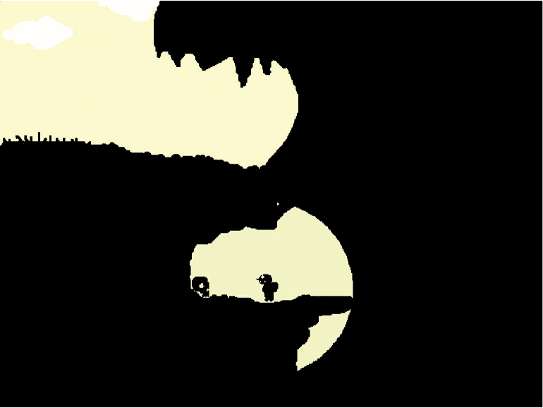

*画面 1：洞穴内部*

在第二个画面上，我们介绍下一个最重要的概念：玩家看到第一个电池，并明白它是一个可收集的物品。

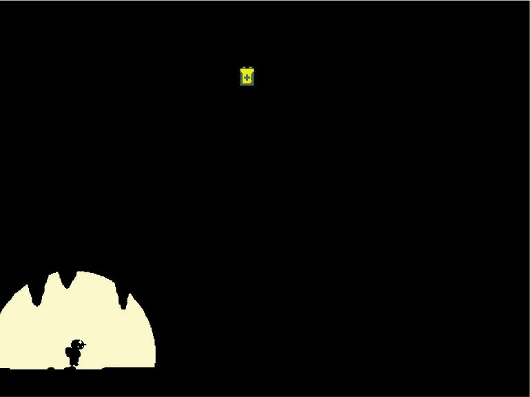

*画面 2：附近有一个电池*

玩家从画面底部进入，看到电池位于顶部。这就是为什么在黑暗中电池必须可见的重要原因。玩家能够看到电池所在的位置，但无法知道如何到达那里，除非他们探索周围的环境。电池给了他们一个探索的理由。

在第一个画面中，玩家了解到一些关于游戏的重要信息。玩家知道有电池可以寻找，并且了解电池的外观。电池始终可见，但有时很难够到。如果玩家此时试图触摸电池，他们会发现自己可以收集它们。（如果跳过这一步骤，稍后还有机会学习这一课。）

游戏中最简单的区域也能教会你很多关于游戏的信息。当你玩其他游戏时，留意游戏偷偷教给你的东西。

让我们来谈谈关卡设计是如何教导玩家游戏玩法的。

#### 显示玩家无法到达的物体

在画面 2 中，玩家看到一个电池，如果他们进行探索，最终会找到到达它的方法。这一切都发生在同一个画面上。但因为我们的游戏允许玩家在不同方向上从一个画面移动到另一个画面，我们可以为玩家创造更多的谜题，让他们在多个画面中进行探索。

在前两个屏幕后，玩家进入一个从地图顶部到底部的大矿井，连接了许多不同的区域。在矿井的中间，他们可能会发现这个电池。

它如此接近，却又如此遥远！前往它的路被坍塌挡住了。在这个屏幕上没有明显的办法到达它。要到达它，玩家需要从不同的方向接近。

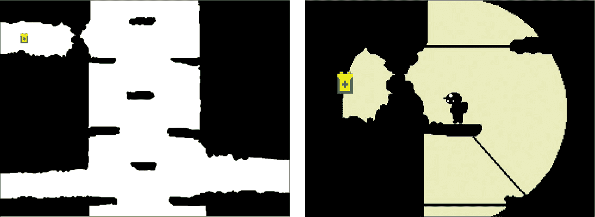

*坍塌挡住了通往电池的路。*

它们需要首先向上绕过另一个屏幕，然后掉进一个坑里。如果他们能降落在下面的窗台上，就可以到达电池。学习窗台的位置，当然，需要仔细的探索或偶然跌入坑中。

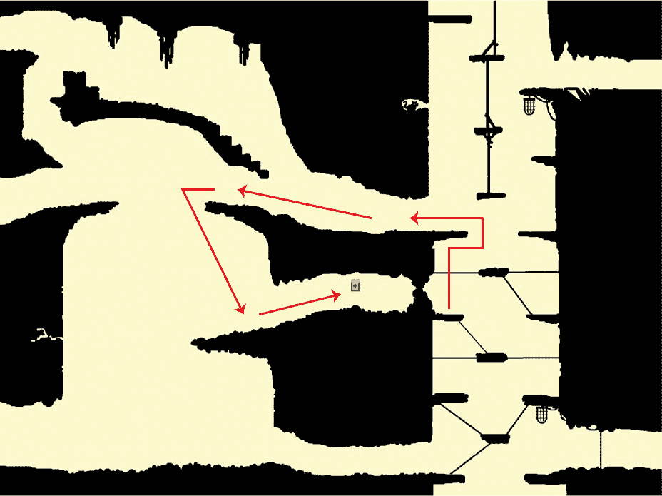

*到达电池需要找到绕过的方法。*

当你展示给玩家一些他们无法到达的东西时，你就是在给他们一个需要解决的问题。弄清楚如何到达这个电池让玩家思考不同屏幕之间的关系，迫使玩家探索并将这些信息组合起来解决问题。当他们最终收集到电池时，会有一种满足感：“我搞定了！*看这一招*，游戏。”

#### 创建有趣的地标

让你的关卡引人入胜，并帮助玩家记住物品的位置的一个好方法是创建独特的区域。例如，你可以将两个屏幕转变为一个酷炫的水晶区。

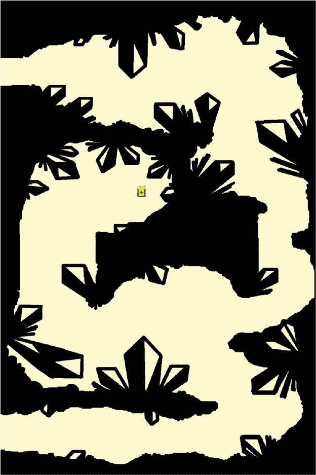

*水晶区*

在这里，我们使用直线和锐角来创建看起来和感觉上都与游戏的其他部分非常不同的屏幕。记住，关卡不仅仅是一个地方和一系列的挑战和难题，它还是一幅画。

这些屏幕看起来很酷，但它们也应该看起来像是相互联系的，这样可以在玩家的脑海中将它们联系起来。当玩家试图记住地图的样子时，记住由两个屏幕组成的一个大区域比记住一个小屏幕要容易。例如，找到一个邻里比找到一栋单独的房子要容易。

另外，注意到从中央矿井区通往水晶区的通道里有几个水晶，就像一个路标指引方向。“往水晶区走！”

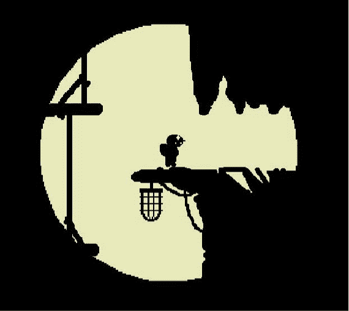

*水晶区的入口*

游戏中的一些其他独特区域是城堡区和大矿井区。矿井有时被称为“中心”区域。可以把它想象成自行车轮的中心，所有的辐条都连接到这里。如果玩家在洞穴中迷路了，他们最终会找到回到矿井的路。

### 创建动画

建造一个美丽的世界却让玩家看起来像一个奔跑、跳跃的红色方框，那将是浪费。让我们创建并动画化一个玩家角色。

**注意：** 如果你已经从书本网站上传了完整的游戏，你应该能看到一个动画玩家精灵。随意编辑、修改或重绘任何动画。

`Hitbox`精灵负责移动、跳跃和碰撞。所有的移动代码都在这个精灵里。在这一部分，我们将创建一个*第二个*精灵来处理所有动画，并将其附加到同一个`Hitbox`上。当我们让`Hitbox`不可见时，玩家应该只看到我们炫酷的动画。

创建一个新的精灵，命名为`Explorer`，它将作为动画精灵。它的服装将保存角色的动画，我们会编写代码告诉它何时显示每个动画。

#### 动画化玩家的动作

动画表现了角色的动作。在*Hatlight*中，玩家执行以下动作：

+   静止站立

+   行走

+   跳跃

+   下落

虽然静止站立实际上不是一种运动，我们也需要表现玩家在*不*移动时的状态。如果玩家在行走时和站立时看起来一样，你就无法区分这两者。所以我们希望它有自己的外观。

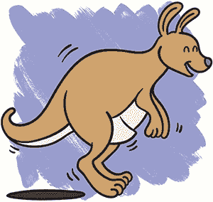

##### 静止站立

第一个服装是静止站立的姿势。它应该以`+`为中心，并且大小大致和`Hitbox`一样。一个好的做法是复制`Hitbox`服装并粘贴到这个服装中，作为绘制的参考。当你完成绘制后，可以删除原`Hitbox`服装中剩余的部分。

*站立服装*

我的角色面朝右方。现在，让我们把所有的服装都画成面朝右方。以后，我们可以使用**选择**工具将它们翻转，做出面朝左方的版本。

##### 行走

右键点击你的静止站立服装，选择**复制**。以你的站立姿势为起点，改变新的服装，使其看起来像角色正在迈步。

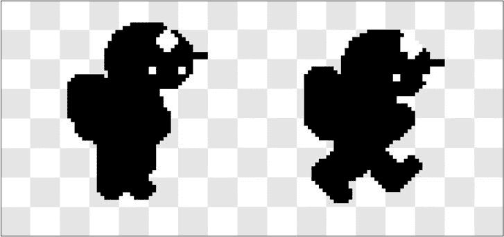

*行走动画*

这是最简单的行走动画。在一个帧中，角色的双腿是并拢的，而在下一个帧中，双腿是分开的。当我们在这两种服装之间交替时，它看起来就像角色在行走。现实生活中，行走要复杂得多，但对于我们的游戏来说，这样就足够了。

**注意：**试着找一个慢动作的行走视频看看！

当你仔细观察行走动画帧中的网格线时，你会发现右边的帧中的头部稍微低了一点。这增加了一点*上下晃动*，使行走的动作更加逼真。当玩家行走时，头部会随着行走的节奏上下晃动。

##### 跳跃

对于跳跃，从你的站立服装复制一份作为起点。

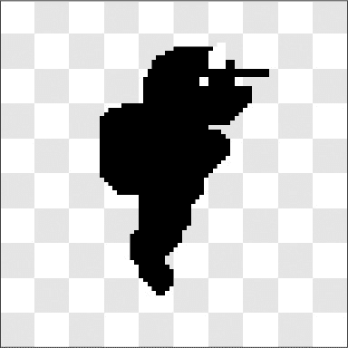

*跳跃服装*

跳跃应该表现向上的动作（也叫做*向上感*），因此在这里我们将头部抬得更高，让角色的眼睛朝上看。我们还会倾斜他们的脚，好像他们正在从地面上弹起，强调跳跃的垂直运动。

##### 下落

对于下落，我们把头部位置降低，并让头部低得更明显。

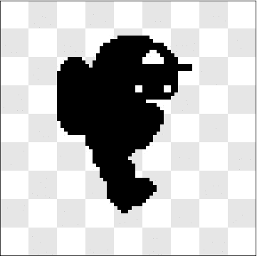

*下落服装*

当玩家到达跳跃的最高点时，我们将从跳跃服装切换到下落服装，因此下落姿势的所有元素应当传达下落的动作（也叫做*向下*）。腿和脚正在为着陆做准备。

#### 或者你也可以直接画一个“Blob”！

你的角色可以是任何你喜欢的样子。如果制作人形动画太复杂，试着制作其他东西。例如，“Blob”非常容易制作动画。

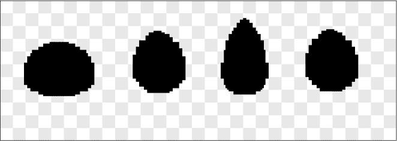

*Blob 动画*

画一个正常的“Blob”，然后再制作两个服装：一个更高更瘦的“Blob”和一个更矮更宽的“Blob”。如果你按照正常、高、正常、宽、正常、高的顺序交替切换，动画中的“Blob”就会在移动时看起来像是被挤压变形。你可以使用选择工具更方便地调整“Blob”的高度和宽度。

你甚至可以让你的角色看起来像一条蛇（蛇就像字母 S）或者一个奇怪的虫子。如果你让你的虫子在服装之间略微上下移动，它看起来就像是在地面上爬行。画任何你想画的东西吧！

#### 创建服装的镜像

到目前为止，你已经制作了许多右面朝向的动画。现在让我们将它们翻转过来，制作左面朝向的版本。这样，你的角色就可以朝着它行走或跳跃的方向面对。

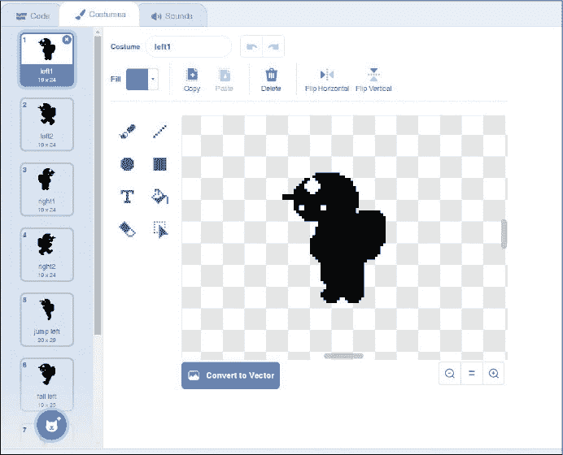

*使用选择工具进行镜像*

制作左面朝向的服装很简单。复制一个服装，然后使用**选择**工具在它周围画一个框。在绘图窗口的右上角，点击**水平翻转**按钮（在**垂直翻转**按钮旁边），翻转服装。然后确保它重新对准`+`。

为每个服装制作一个左面朝向和右面朝向的版本。

#### 编写动画代码

动画编码可能会让人有些胆怯，但其实非常简单。

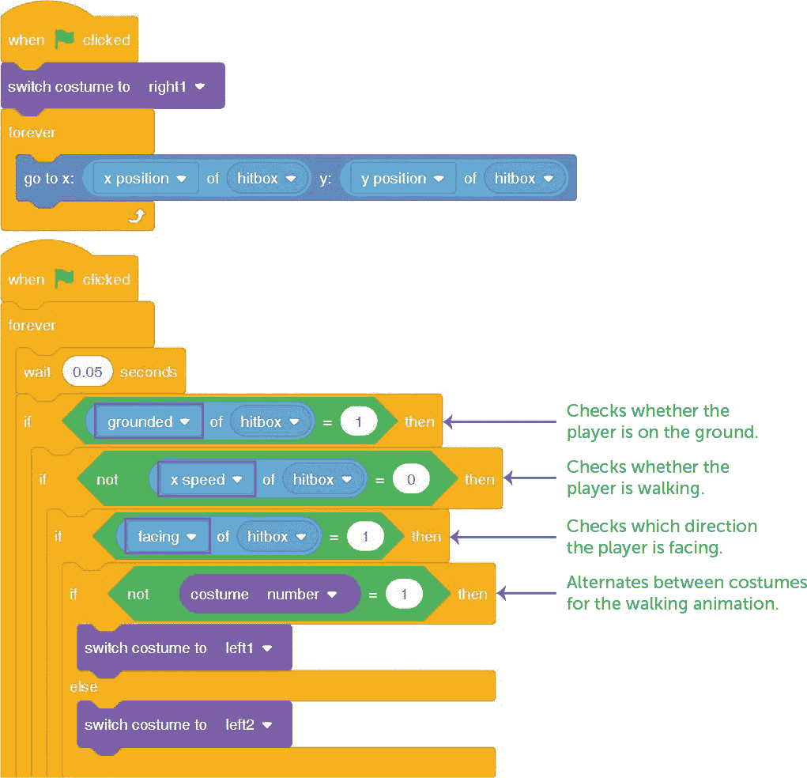

*动画代码*

第一段代码确保`Explorer`角色始终与`Hitbox`角色在同一位置。随着`Hitbox`在屏幕上移动，动画也会随之移动。第二段代码选择了合适的服装。

最后需要做的是确保`Hitbox`现在是不可见的，因为我们已经有了一个动画角色来显示。我们可以使用`ghost`效果来实现这一点。

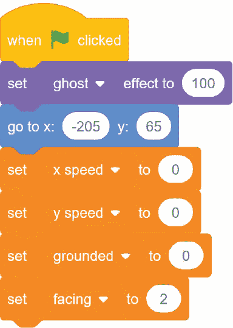

*将幽灵效果设置为 100*

这个代码块将`ghost`效果设置为`100`，意味着完全透明。

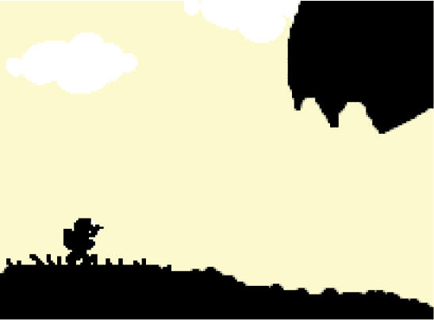

*现在玩家角色已经有动画了！*

现在你应该只看到角色，而不是处理所有数字的红色矩形。

### 附加挑战

以下是一些可以让你的游戏更加完整的额外细节：

**开头：** 当游戏开始时，玩家会看到游戏标题，直到角色出现之前。你能为你的游戏制作一个标题画面吗？你需要在标题画面结束之前隐藏所有游戏精灵。

**结尾：** 当玩家收集到所有电池时会发生什么？故事是如何结束的？为游戏创作一个结局。

**音效：** 你可能希望为一些重要的动作添加音效，例如跳跃或收集电池。你可以使用 Scratch 的内置音效库，或者自己制作音效。在下一章中，你将学到更多关于音效的知识！

### 你学到的知识

在这一章中，你了解了关卡设计以及你可以如何利用它。关卡设计关乎讲故事，而一个好的讲故事者会将每个关卡看作是一个挑战的集合、一个虚拟的地方，以及屏幕上的一幅画面。这一章你还学会了如何为你的角色制作动画，通过动作传达角色的重要信息，比如他们要去哪里，以及如何到达那里。

在第五章中，我们将讨论如何为你的游戏添加音效和音乐。这将会非常有趣！
