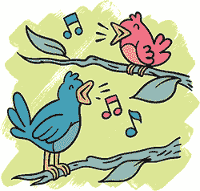

## 5

创建音效

声音和音乐本身就是古老而令人惊叹的艺术形式。我相信你一定有一首最喜欢的歌！人们制作音乐和噪音已经有几千年的历史了，在这一章中，你将学习如何在你的游戏中用音乐和声音做一些惊人的事情。那么，游戏是如何使用声音的呢？

**音效传递信息。** 玩家如何知道自己捡到了宝藏或被怪物咬了？在第二章的*Weird Bug Chowdown*游戏中，每当虫子碰到某物，不论好坏，游戏都会播放音效。音效让玩家知道发生了重要的事情。它还塑造了玩家对发生事件的感受。这就是为什么吃到浆果会发出响亮的“咀嚼”声，而触碰到坏浆果或粪便时则会发出“呕”的声音。

**音乐有助于设定氛围。** 想想你最喜欢的电影中的一个激动人心的场景。那时的音乐是什么样的？是快节奏和充满活力的吗？让你感到兴奋吗？那么悲伤场景中的音乐呢？是慢节奏和低沉的吗？音乐会影响我们对正在发生的事情的感受，游戏也是如此。你玩的许多游戏可能都有轻快、节奏感强的音乐，营造出一种俏皮的氛围。如果这些游戏中的音乐是沉重和悲伤的，你会对游戏中的事件产生不同的感受吗？

也许你会玩乐器，或者你完全不知道如何制作音乐。其实，制作游戏音频比你想象的要容易得多！

### 声音设计工具

在这一章中，你将学习一些不同的程序，使用它们制作音乐和声音。像我们在本书中使用的其他工具一样，你可以在网上免费下载这些程序。首先，你将使用一个叫做 Audacity 的程序来录制和编辑声音。其次，你将使用 sfxr 生成音效。第三，你将学习如何使用 Drum Circle 创作简短的音乐循环。

你可能不需要使用所有这些工具。最有可能的是，你会觉得其中一个工具最适合你的游戏。每个人都有自己的*实践*，或是制作东西的个人流程。没有所谓的正确流程。

### 使用 Audacity 录制和编辑声音

你已经具备了制作出色游戏音效的工具。我说的是你的声音以及你周围几乎所有的物品！在完成的*Hatlight*游戏中，我通过对着电脑麦克风说“哈！”来制作跳跃音效。你走动时地面发出的嘎吱声是我把一堆骰子摇到麦克风前录制的。

Scratch 在声音标签中有一个内置的麦克风按钮，可以让你录制自己的声音，但 Audacity 让你在录音时能做更多的事情。例如，你可以让声音渐入渐出，添加特效，甚至剪掉你不喜欢的部分。

当然，这些工具只有在你的电脑有麦克风时才有效。大多数笔记本电脑和平板电脑都配有内置麦克风。如果你的电脑没有麦克风，你可以去当地的电子商店买一个（便宜的也可以！），或者从第 137 页的“使用 sfxr 生成声音”开始，我们会使用其他不需要麦克风的工具。你可以在*[`sourceforge.net/projects/audacity/`](https://sourceforge.net/projects/audacity/)*上找到 Audacity。下载适合你电脑系统的版本，然后我们就可以开始了！

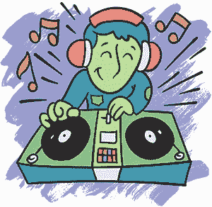

#### 录制致命的坠落声

打开 Audacity，你会看到这个界面。

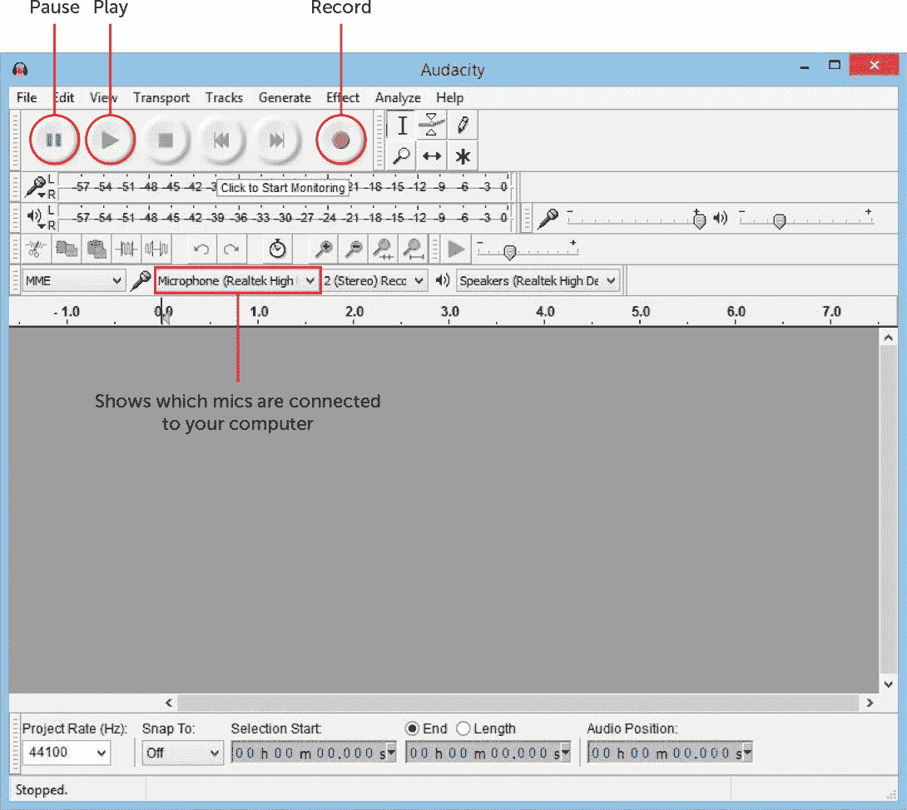

*Audacity 界面*

屏幕上有很多内容，但你不需要担心大部分。找到顶部工具栏下方的麦克风按钮。麦克风旁边的录音设备菜单列出了所有连接到你电脑的声音设备。如果你录音有问题，试着从这个列表中选择不同的设备。Audacity 可能没有使用正确的设备。

屏幕上最重要的按钮是顶部的大暂停、播放和录音按钮。让我们录制第一个声音吧！

想象一个关于洞穴探险者的游戏，像第四章中的那个。探险者正走在地下，穿过一座窄窄的石桥，桥下是一条地下河流。每走一步，她都会听到砾石破裂和移动的声音。她小心翼翼地走着。最后，她踩到了一块已经老化且脆弱的桥面，桥在她脚下断裂！她掉入了深渊，尖叫声渐渐消失：“AAAAAAAAAAaaaaaaaaaaa...” （别担心——河里满是地下枕头鱼，她会没事的！）

让我们试着重新创建那种喊叫的声音。点击**录音**按钮，对着麦克风大喊“AAAAAAAAAA”。尽量保持声音长一点，因为到达洞底的距离很远！不用担心声音会逐渐消失，我们会用特效来处理。录音完成后，点击**停止**按钮。你的屏幕应该会像这样。

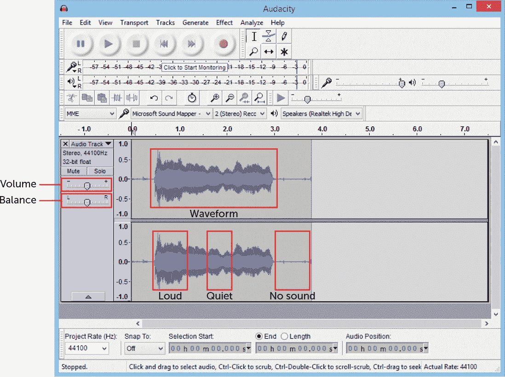

那个不规则的蓝色形状是你录音的波形。*波形*是声音的图像，最高的部分是最响亮的声音，较短的部分则是较安静的声音。你应该还能看到开始和结束时的两个平坦部分。这些是你开始发出声音前后的安静部分。

在我们修改波形之前，先看一下几个滑块（在上面的图片中圈出）。

上面的滑块从-到+，控制音量。如果你的声音太小或太大，可以通过移动这个滑块来调整。下面是一个从 L 到 R 的滑块，控制声音的*平衡*，即声音是从左声道（或耳机）还是右声道播放的。滑块默认处于中间位置，通常你会希望它保持在这个位置。

#### 声音选择

当你点击**播放**时，你将听到整个波形，包括开头和结尾的安静部分。根据你开始和停止录音的时间，这些安静部分可能很长，也可能很短。在将声音用于游戏之前，你应该去掉任何空白部分。毕竟，你希望游戏中的声音在探险者掉下桥的瞬间播放，而不是一秒钟的沉默后才响起。

我们可以通过选择波形的不同部分来编辑声音。当你把鼠标移动到波形上时，光标会变成“I”形。你可以点击并拖动来选择声音的不同部分。只选择带有“aaaaaaaa”声音的部分，不包括平坦（静音）部分。

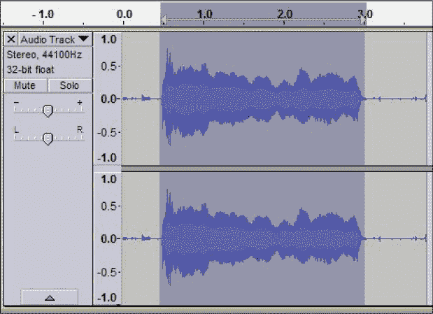

*选择你想要的声音部分*

尝试再次点击**播放**。你应该只听到“aaaaaaaa”部分。注意，当你将光标移到选择的两端时，它会变成手指形状。你可以点击选择的任何一端并拖动，改变选择的开始或结束位置。试着选择波形中的一部分，在中间某个位置。现在，当你点击**播放**时，只有选中的部分会播放。

我们做的任何编辑都会作用于我们选择的波形部分。所以，为了去除录音开始时的空白，我们首先需要选择它。调整选择的结尾，直到整个空白部分被选中，仅此而已。

**注意：** 如果你担心选择的位置是否正确，你可以随时使用放大镜图标来放大波形。

在窗口顶部，点击**编辑 ▸ 删除**。选中的声音部分应该消失。

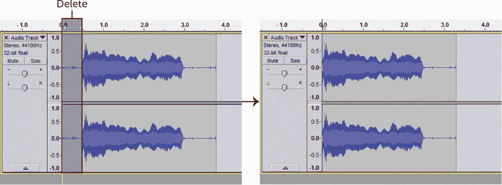

*删除你不需要的声音*

尝试选择并删除声音结尾处的平坦部分！麦克风前的噪声部分应该是剩下的唯一部分。现在，让我们使用选择来改变我们声音效果的*听感*。

#### 使用效果工具

我们希望我们的掉落声音既长又好听。你的声音有多长？可能还不够长！记住，从悬崖到洞底的距离非常远。幸运的是，有一种方法可以拉长声音，使其更长。

当你点击屏幕顶部的**效果**菜单时，你会看到一堆不同的选项。这里是一些最实用的总结：

**更改音高：** *音高*是指声音的高低。可以通过神话生物来理解音高。如果你降低音高，你会开始听起来像一个巨魔。如果你提高音高，你会开始听起来像一个仙女。

**更改速度：** 这个选项允许你改变声音的时长，这是让声音变长的一种方法。但当你更改*速度*时，你也会影响音高。如果你减慢声音，音高会变低。如果你加快声音，音高会升高。

**更改节奏：** *节奏*是音乐术语，指的是音乐的速度。更改节奏可以让你调整声音的长度，而*不*改变音调。

让我们使用更改节奏来延长我们的录音。点击**效果 ▸ 更改节奏**。

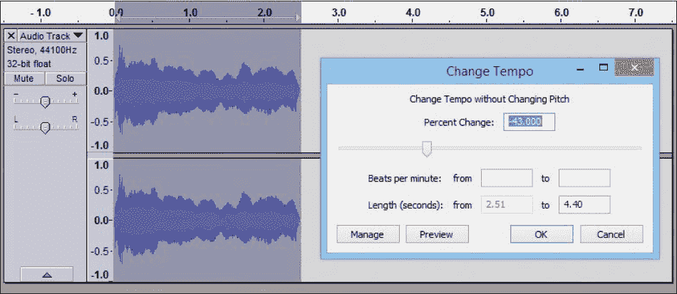

*节奏变化前*

*节奏变化后*

一个“更改节奏”窗口会弹出，里面有许多不同的选项，但它们都是做同一件事的不同方式。最简单的选项是滑动条。滑动条的正中心是当前音频的速度。将滑动条向右移动可以加快速度，将其向左移动可以减慢速度。你可以移动滑动条并点击**预览**，测试声音效果。

降低节奏并点击**确定**。你的波形应该会变长。现在，当你播放声音时，你的声音应该会显得稍微慢一些！

现在让我们在消失的过程中，让声音渐渐消失。使用光标选择声音的四分之三部分。我们希望开头的部分保持不变。

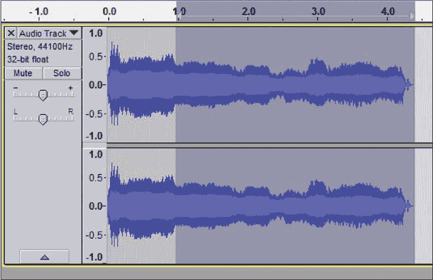

*让声音渐渐消失*

现在点击**效果 ▸ 渐弱**。

*后期渐弱*

你的波形已经改变了形状。它一开始很宽，然后逐渐变小，直到最后收缩成一个点。渐弱是一个非常实用的效果，它会根据你的选择区域的大小自动调整。当你对一个较长的选择区域进行渐弱时，声音会慢慢、逐渐消失。对于较短的选择区域，渐弱会更快。此外，还有一个渐强效果，做法相反，声音从静音开始，逐渐变得更大，直到达到正常音量。

播放你的新声音！记住，播放按钮只会播放你所选择的部分。要退出选择区域，请点击**倒带** (`|<<`) 按钮。

#### 导出声音

使用 Audacity 时，有一个重要的细节需要了解：*保存*并不意味着像其他程序那样保存。当你在 Audacity 中点击**文件 ▸ 保存项目**时，你会保存一个特定类型的文件，叫做*项目*文件。只有 Audacity 能打开项目文件。这对于处理复杂的声音很有用，比如使用多个音频通道时。但是，你不能将 Audacity 项目文件导入到你的 Scratch 游戏中。

相反，你需要将音频导出为 Scratch 可以使用的格式，方法是点击**文件 ▸ 导出音频**。

你也可以高亮显示波形的一部分，并点击**导出选定音频**，仅导出录音中的一部分。

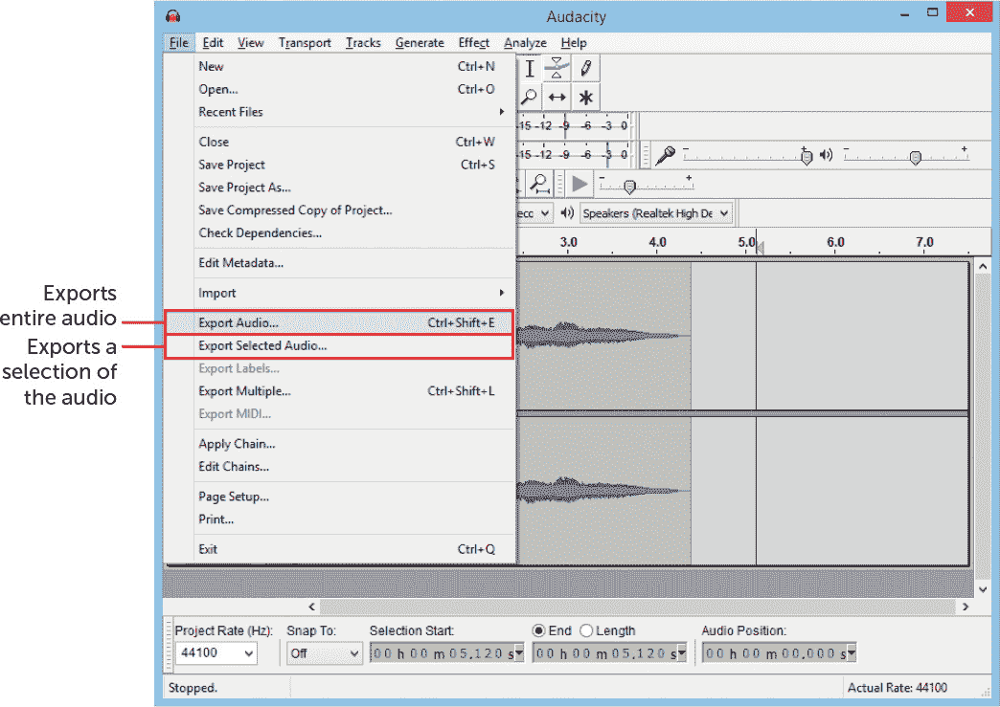

*导出音频*

Audacity 可以导出多种不同格式的音频文件。通常，你会选择使用*WAV*格式，这是大多数程序，包括 Scratch 所使用的声音格式。

当你导出音效时，应该会弹出一个“编辑元数据”窗口。如果你在做播客或你新 EP 中的某一曲目，可能需要填写元数据。但对于视频游戏音效，你不需要担心元数据。只需点击**确定**导出声音。

现在你可以将你的声音导入到 Scratch 游戏中。在“声音”标签页中，将鼠标悬停在“选择声音”图标上，直到菜单出现。点击**选择新声音**图标。

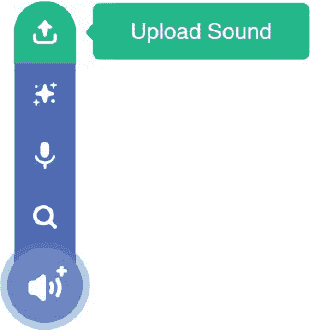

*导入我惊人的尖叫声*

#### 使用互联网的声音

你可以通过用嘴巴发出声音或在麦克风前敲击物体来制作许多不同的音效。但有时你需要一个非常特定的声音，比如鸟鸣声，而你用家里的东西无法做出。在这种情况下，你可以使用*[`freesound.org/`](https://freesound.org/)*上的声音。

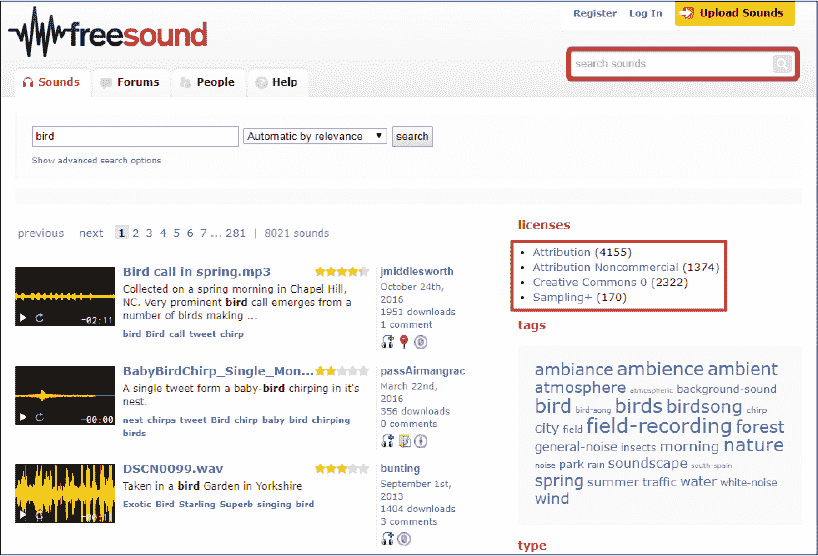

*[freesound.org](http://freesound.org)主页*

在 Freesound 网站上，你可以找到由不同人录制的许多独特声音。这些声音都是在创作共用许可证下发布的。只要你注明声音创作者的名字，你就可以免费使用它们。

**注意：** Creative Commons 有几种不同的许可证类型，Creative Commons 帮助页面解释了它们的区别。但页面上的大多数声音都是 Creative Commons – Attribution（署名）。

Scratch 为你游戏的每个页面提供了一个“备注与鸣谢”空间。那是一个向那些为你完成游戏做出贡献的人表示感谢的完美地方。只需输入类似“鸟鸣声由 ErgoBirdo 录制，出处：*[`freesound.org/`](https://freesound.org/)*”的内容。这叫做*署名*！

有些声音会列出几种不同的声音。例如，你可能只想使用一个鸟鸣声，来自 10 个选项中的一个。或者你可能希望声音变得更快或更慢，或者逐渐消失或渐强。这时，你可以使用 Audacity。你可以加载从 Freesound 下载的任何声音，编辑它，然后导出一个版本用于你的游戏。只要确保始终注明录制原始声音的人的名字！

### 使用 sfxr 生成声音

sfxr 工具能够快速生成简单的视频游戏音效。如果你玩过老式的“8 位”视频游戏，你应该知道 sfxr 音效的声音：“哔哔”和“嘟嘟”和“HHSSHHSSHSSs”。使用 sfxr 时，你不需要麦克风：只需点击按钮和滑动滑块。

由 Tomas Pettersson 创建，sfxr 可以在他的网站上找到，网址是*[`tinyurl.com/getsfxr/`](http://tinyurl.com/getsfxr/)*。sfxr 工具是为 Windows 计算机设计的，但如果你有 Mac，网站上的一个链接会指向 cfxr，这是该程序的 Mac 版本。

运行 sfxr，你会看到这个界面。

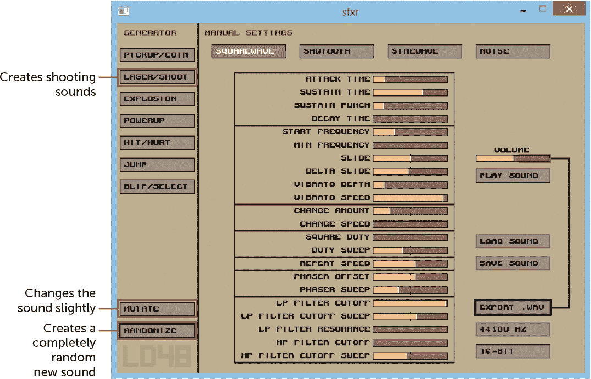

*sfxr 界面*

现在先不用担心滑块！我们先看按钮。左边有一堆生成器按钮，比如激光/射击、爆炸、能量提升等等。点击几次**激光/射击**按钮，sfxr 会为你生成不同的射击音效。

尝试调整生成器按钮，直到找到你喜欢的声音。点击**播放声音**按钮再听一次你的声音。然后尝试点击**突变**按钮（位于左下角）来改变声音。每次点击突变时，声音会稍微改变。注意当声音变化时滑块的变化。

sfxr 程序只会记住最后生成的声音。所以，如果你找到一个非常喜欢的声音，记得在制作新声音之前保存它！稍后我们会详细讨论如何保存和导出声音。

#### 波形

在 sfxr 窗口的顶部有四个按钮：方波、锯齿波、正弦波和噪音。此时其中一个按钮应该是高亮的。你可以使用这四种不同的波形来创建音效。尝试在按钮之间切换，并点击**播放声音**，听听每种波形的声音有什么不同。以下是每种波形的样子。

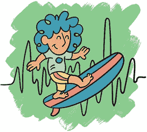

**方波**的名字来源于它放大后看起来的方形波形。方波声音清晰而沉重。你在 sfxr 中制作的大部分声音可能都会是方波。

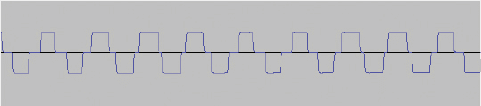

*方波*

**锯齿波**放大后看起来像是锯齿的尖端。这种波形的声音比方波更尖锐、粗糙，非常适合制作金属质感的音效。

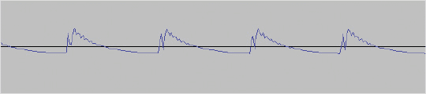

*锯齿波*

**正弦波**是一条平滑的上下曲线，听起来空灵且气泡感十足。当你需要制作冰雪星球上空间水晶弹跳的音效时，正弦波非常合适。

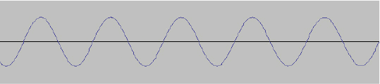

*正弦波*

**噪音**看起来像是你在笔记本上乱涂的线条。它到处都是，所以听起来很嘈杂，嗯，正是噪音。噪音非常适合爆炸声和海浪的声音。

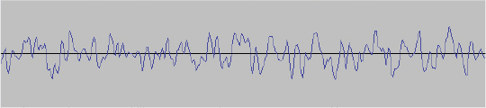

*噪音*

其他生成器按钮产生不同的波形。拾音器/硬币产生方波，而爆炸产生噪音。当你找到一个喜欢的声音时，试着听听它在每种波形下的效果。

#### 使用滑块改变声音

如果你希望声音更长或者*更奇怪*呢？通过调整 sfxr 的众多滑块，你可以对声音进行各种各样的修改。

了解每个滑块的作用最好的方法是生成一个声音，然后玩弄滑块，听听声音如何变化。以下是一些最有用的滑块。

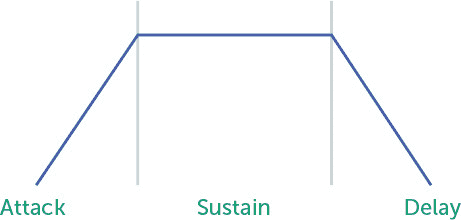

*使用滑块*

##### 攻击、持续、衰减

有时你可能希望你的声音有不同的时长或缓慢地淡出。攻击、持续和衰减工具会影响声音的时序。声音爱好者称之为声音的*包络*，因为这就是声音呈现的方式。以下是每个工具的效果：

**攻击时间**是你的声音渐入的时间。设置为低值可以让声音瞬间出现，设置为高值则会有一个长时间的渐变。

**持续时间**是声音的中段，指的是声音完全渐入后和开始渐出前的部分。当你只是想让声音持续时间更长时，可以给它设置更长的持续时间。

**衰减时间**是声音的消失时间。较长的衰减时间会让声音缓慢消失，较短的衰减时间则会迅速切断声音。

##### 滑动、颤音和变化

滑动、颤音和变化为你的声音增添了更多层次。如果你听不出变化，尝试延长声音的持续时间。以下是每个工具的效果：

**滑动**会让你的声音上下滑动，具体取决于它是否高于或低于中心。滑动增量滑块指定它是快速还是缓慢地上升或下降。

**颤音**为你的声音加入一种酷的振荡效果。它有点像抖动。颤音深度滑块指定颤音的抖动程度，而颤音速度则指定振荡的速度。在较低的速度下，你可以清晰听到它上下移动；在较高的速度下，振荡会融合在一起，产生更嘈杂的声音。

**改变**让你可以调整声音的中频高低。滑动可以让声音逐渐变化，而 Change 则会立即改变。你可以使用 Change 让你的声音听起来像是有多个音符。Change Amount 指定声音的高低：向右是高，向左是低。Change Speed 指定变化发生的时刻。更高的 Change Speed 几乎是立即变化，而较低的 Change Speed 则会在声音的后期发生变化。

#### 导出声音

和 Audacity 一样，*保存*一个声音和*导出*它在 sfxr 中是两个不同的过程。点击**保存声音**会生成一个仅能在 sfxr 中使用的文件。这个文件会记录所有滑块设置，因此如果你想稍后做修改，你必须保存你的声音。

点击**导出 .Wav**会生成一个*WAV*文件，绝大多数游戏制作工具（如 Scratch）都可以读取该文件。但 sfxr 不能读取*WAV*文件。所以，如果你没有在导出之前保存你的声音文件，并且之后想对声音做修改，那就*没办法了*。

显然，最佳实践是保存你的声音*并*导出一个*WAV*文件供你的游戏使用。这样，如果你决定让它更短、更长或更奇特，你可以在 sfxr 中重新加载声音文件。然后，你可以导出你新声音的*WAV*文件。

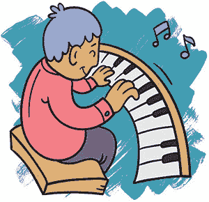

#### bfxr 工具

如果你已经习惯使用 sfxr，你可能想尝试更复杂的 bfxr。

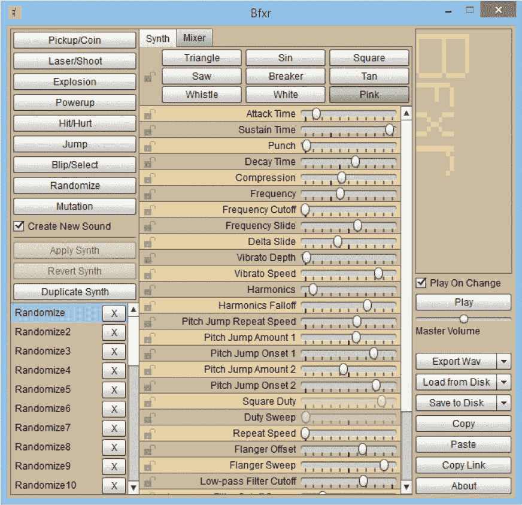

*bxfr 界面*

由 Stephen Lavelle 创建的 bfxr 是 sfxr 的某种继承版。它拥有更多的波形、更多的选项和更多的功能。bfxr 的一个有用功能是，它会跟踪你通过生成器和随机按钮创建的所有新声音。所以，如果你想回到之前生成的某个声音，你是可以做到的。除非 sfxr 提供的功能不足以满足你想要创建的声音，否则你可能不需要 bfxr 中的大多数新选项。你可以在 *[`www.bfxr.net/`](https://www.bfxr.net/)* 下载这个工具。

### 使用 Drumcircle 创建音乐循环

你听到的大多数音乐都有开始和结束，而你最喜欢的夏日旋律可能只有几分钟长。在游戏中，通常很难判断一首歌曲需要播放多久。每个玩家完成游戏的时间不同。有些玩家很快就能完成，而有些玩家会花很长时间进行探索。

这就是为什么大多数游戏音乐都是循环播放的原因。它没有结束。相反，它会回到起点并继续播放。这样，无论玩家玩游戏的时间有多长，歌曲都能适应。

我们将使用 Drumcircle 程序来制作短小的音乐循环。Drumcircle 是由 Andi McClure 创建的，使用起来简单且有趣。你可以在 *[`tinyurl.com/getdrumcircle/`](http://tinyurl.com/getdrumcircle/)* 下载它。

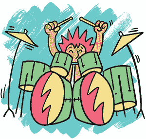

当你运行程序时，你会看到一个非常简单的菜单。点击**播放**按钮开始。你将看到一个像这样的界面。

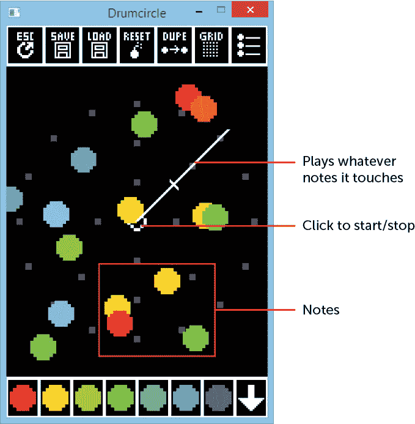

*Drumcircle*

你的屏幕可能和这里看到的样子不完全相同。当你启动 Drumcircle 时，它会从随机音符创建一个循环。Drumcircle 的工作方式类似于旧式的潜艇雷达屏幕。（也许你在电影里见过。）当雷达线（或者说雷达术语中的*扫描*）围绕圆圈移动时，它会播放它触及到的音符。通过在圆圈中放置音符，你可以决定哪些音符会被播放。

玩一玩这个程序，熟悉一下它！你可以拖动音符来移动它们，或者从底部拖动新的音符来添加它们。点击一个音符听听它的声音。当你点击右下角的箭头时，你可以浏览更多的音符、鼓声和效果。此外，你可以通过点击圆心来启动或停止扫描。

#### 制作鼓循环

好的，让我们制作一个简单的鼓循环。点击顶部的**重置**按钮来清除所有音符。你应该会看到一堆点。

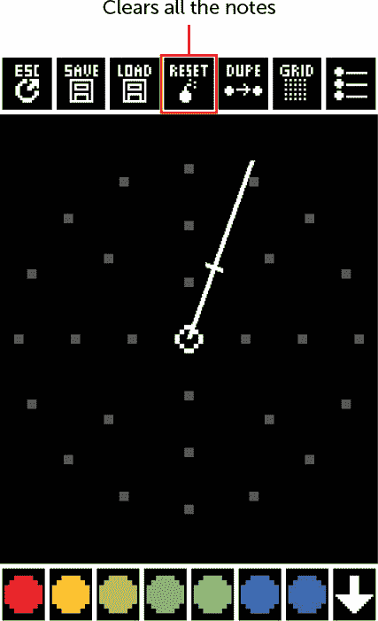

*一张白纸*

圆圈外面有 16 个点，这使得 Drumcircle 成为一个*16 步音序器*。音序器通过将音符按顺序排列来制作音乐，而 16 步指的是音序器使用的 16 个音符。电子音乐制作工具通常使用 16 步作为常见格式。

最大的圆圈内的第二个圆圈有 8 个位置（16 的二分之一），而最里面的圆圈有 4 个位置（16 的四分之一，也是 8 的二分之一）。这些内部位置是帮助我们制作循环的指南。如果我们在外圈播放一个音符 16 次，它会产生一个非常快速的节奏。如果我们在第二个圆圈中播放一个音符 8 次，它会更慢，播放频率是前者的一半。在最内圈播放一个音符 4 次则是最慢的。

#### 加入一些鼓声

让我们做一个简单的循环。我们从加入一些鼓声开始，以创造节奏。鼓声节奏通常是音乐作品的骨架，它为其他乐器提供了一个构建的框架。这个简单的鼓线将作为我们的框架。

当你点击屏幕底部的彩色圆圈时，它们的音调会从左到右逐渐升高。这些是音符，通常用字母 A 到 G 表示。我们稍后会回到这个话题。开始时，我们需要的是一条鼓线，所以点击箭头直到你看到鼓的图标。

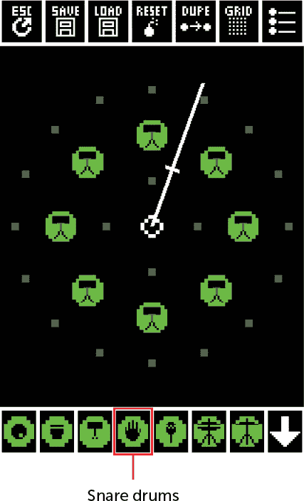

*创建鼓线*

试着点击一些鼓，听听它们的声音。有很多不同的鼓声，包括拍手声。对于我们的鼓线，我们将使用军鼓，它看起来像一个带腿的锤子，紧挨着拍手声的左边。因为我们想要一个既不太快也不太慢的节奏，所以让我们把军鼓添加到中间的圆圈，也就是有 8 个点的那个圆圈。将军鼓图标拖动到 8 个点中的每一个。

现在我们有了基本的节奏。*咚，咚，咚，咚，咚，咚，咚，咚*。它为我们提供了一个简单的节奏，可以在此基础上进行构建。但单独这个节奏还是挺无聊的。让我们加入一些摇摆感，让它更加欢快。我们不必在每个点上都添加声音。试着在我们已有的一个军鼓之前添加一个军鼓。

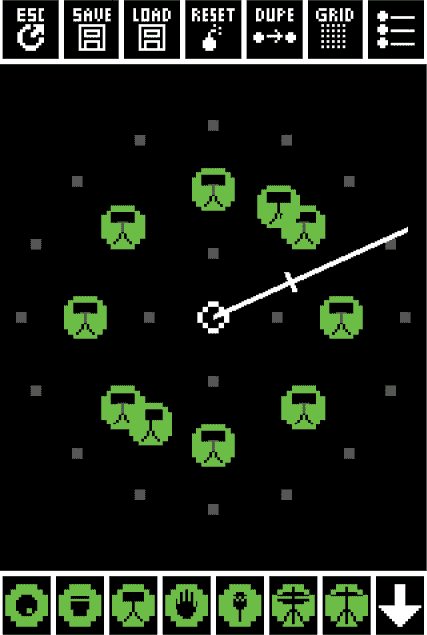

*加入更多军鼓*

这为作品增添了一些酷炫的节奏感。你可以看到图中，我将两个军鼓放在了圆圈的对侧。现在它们会在每个循环中出现两次，每 8 步（或每 4 拍鼓声）。*咚，咚，咚，呯-咚，咚，咚，咚，呯-咚*。这将我们的循环分为两部分，为添加更多声音提供了一个很好的起点。

#### 添加更多声音

我们的循环有两个部分，每个部分都有自己的*呯-咚*。现在我们可以开始将这两部分分开。让我们再加入一些声音。

你可以同时播放多个声音。我们仍然没有在外圈放任何东西。如果我们将两个音符相邻放在外圈，它们的播放速度将比内圈的鼓声更快。选择两种不同的声音，添加到循环中。在*呯-咚*之后是一个不错的地方。我们在这里使用拍手声和镲。

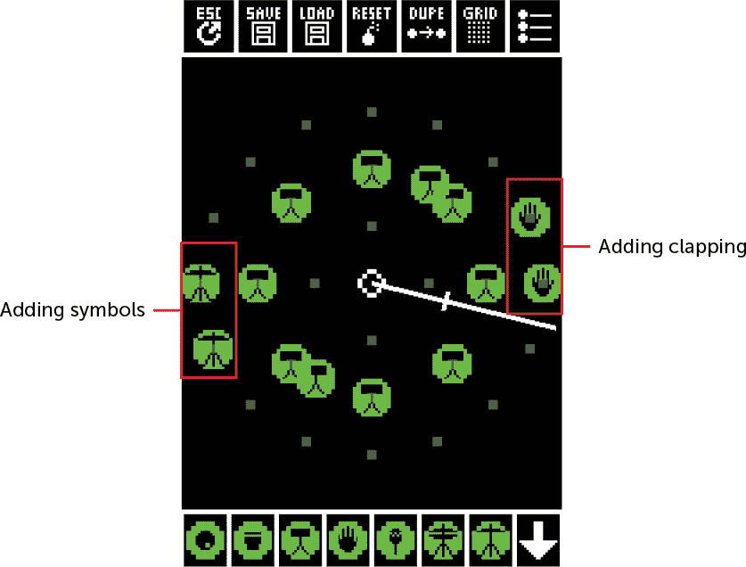

*加入更多声音*

这些有助于构建我们循环的打击感。*打击乐*指的是像鼓、镲、牛铃之类的乐器，或者是通过敲击它们来产生节奏的物品。现在让我们在它们的基础上再加入一些其他乐器。

点击箭头查看更多 Drumcircle 的音效库。你会找到钢琴音符（用代表不同音阶的彩虹色表示），吉他音符和其他音效。我的一些最爱包括垃圾桶声、电脑声和电吉他声。

每种乐器都有不同的特点。点击木吉他、摇滚吉他和电吉他（它们在彩虹圆圈之后的第五页，就是有狗的那一页），听听它们的声音。木吉他声音温暖且开放，摇滚吉他声音尖锐且快速，而电吉他（那个有小骷髅的）声音低沉而刺耳，几乎像狼的咆哮。

让我们为我们的循环添加一些更温暖的乐器。

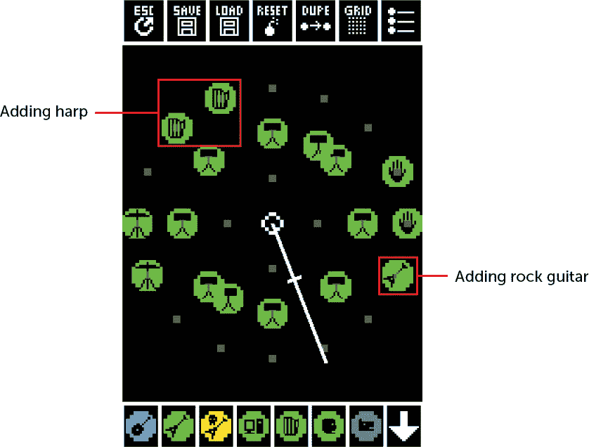

*加入竖琴和吉他*

在这里，我们加入了两个竖琴音效，接着是一个 *dah-dum* 的音效，然后是摇滚吉他声音，紧接着是拍手声。始终考虑你的声音如何与周围的其他声音相互关联。

#### 添加旋律

现在，让我们加入一个旋律！我们有三种不同的乐器，可以在多个音阶上演奏：空的彩虹圆圈声音清脆明亮，钢琴键盘声音温暖轻盈，吉他弹奏声音充满弹性和趣味。

我们将使用钢琴键，因为较低的键音温暖且余音绕梁。你可以听到声音慢慢消失，并且相互融合得很好。我们还将加入三个连续上升的音符，这在音乐中被称为 *进行*。

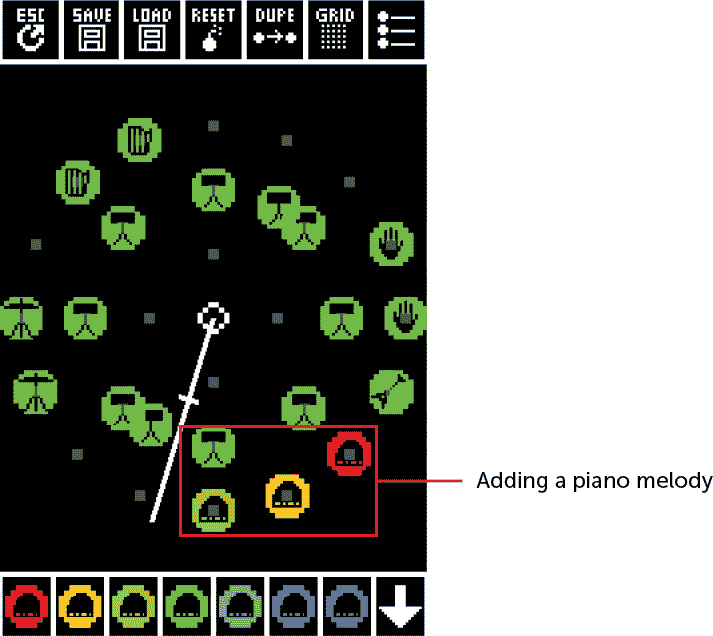

*添加旋律*

因为每个音符都比上一个高，所以听起来旋律在上升。如果你不确定该写什么样的旋律，进行总是一个不错的起点，因为它们通常听起来很好。但你也可以尝试用不同的顺序弹奏音符。你能做出一个听起来悲伤的循环吗？或者紧张的？或者滑稽的？

#### 保存与导出循环

点击窗口顶部的**保存**按钮，你会看到八个不同的槽位可以保存循环。像 Audacity 和 sfxr 一样，保存和导出是两个不同的过程。保存循环后，你可以稍后加载并继续编辑。导出 WAV 按钮也在保存菜单中。如前所述，导出 WAV 会创建一个可以在游戏中使用的文件。（文件名会是 *output1.wav* 或 *output2.wav*，以此类推。）导出 *WAV* 文件时，请记住，第一个音符总是位于顶部的位置（就像时钟上的 12 点）。

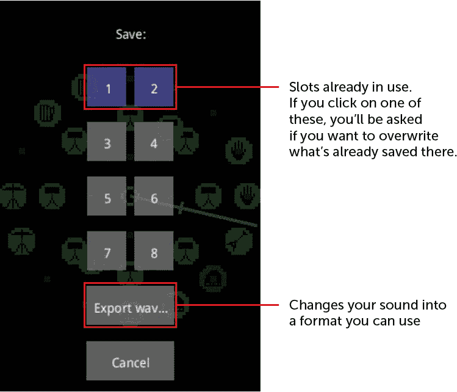

*保存你的鼓循环*

现在在 Audacity 中打开你循环的*WAV*文件。波形图看起来怎么样？（在点击播放前按住 SHIFT 键，让你的声音循环播放。）

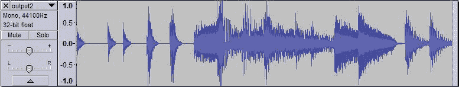

*你的鼓循环在波形图中的样子*

你可以通过将不同的 Drumcircle *WAV* 文件在 Audacity 中串联在一起来创建一首歌。

#### Bosca Ceoil

如果你真的喜欢并且觉得自己对音乐编排很有感觉，你可以尝试 Bosca Ceoil。Bosca Ceoil 这个名字来源于爱尔兰语，意为“音乐盒”，它是 Terry Cavanagh 创建的一个简单、免费的音乐制作工具。

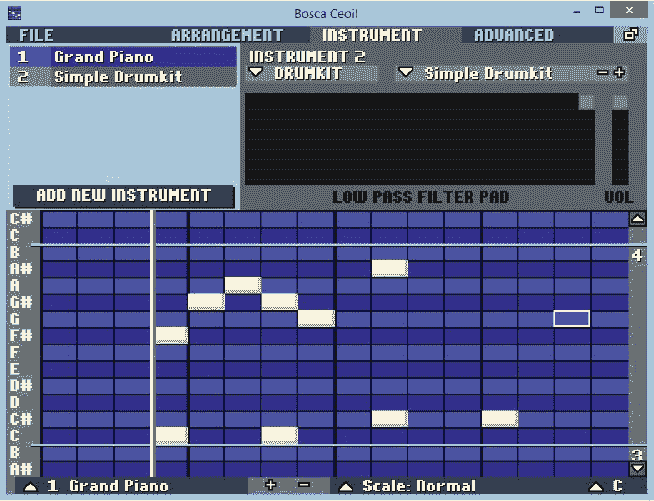

*Bosca Ceoil 界面*

Bosca Ceoil 比 Drumcircle 稍微复杂一些，但如果你真的想创作歌曲，它有更多的功能。你可以使用许多不同的乐器，还可以创建多个 16 步模式并将它们连接起来，制作更长的歌曲。Bosca Ceoil 有一个非常棒的内置教程，会教你基本的操作。你可以在*[`boscaceoil.net/`](https://boscaceoil.net/)*下载 Bosca Ceoil。

#### 为 Scratch 游戏添加音乐循环

在 Scratch 中，基本的音乐循环看起来是这样的。

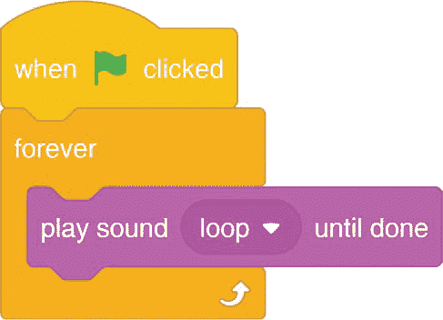

*在 Scratch 中编程音乐循环*

如果你在`forever`循环中使用一个普通的`play sound`积木，它将一直重复播放声音。就像那个错误的虫子叶片咀嚼声音一样，在没有等待整个声音播放完之前就开始循环，真是糟糕！

如果你不希望同一首歌在整个游戏过程中无休止地循环播放，可以使用`repeat until`循环。

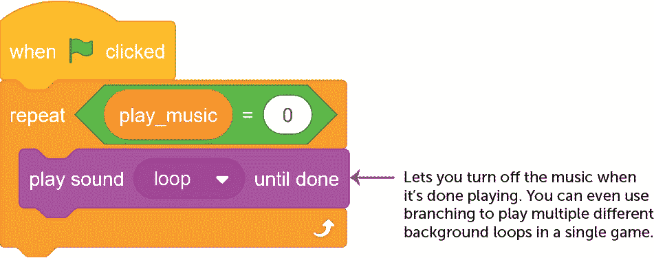

*歌曲结束后关闭音乐*

另外，Scratch 的声音库非常实用，它包含了大量的预制循环，你可以使用它们。快去查看“音乐循环”类别中的这些循环吧！

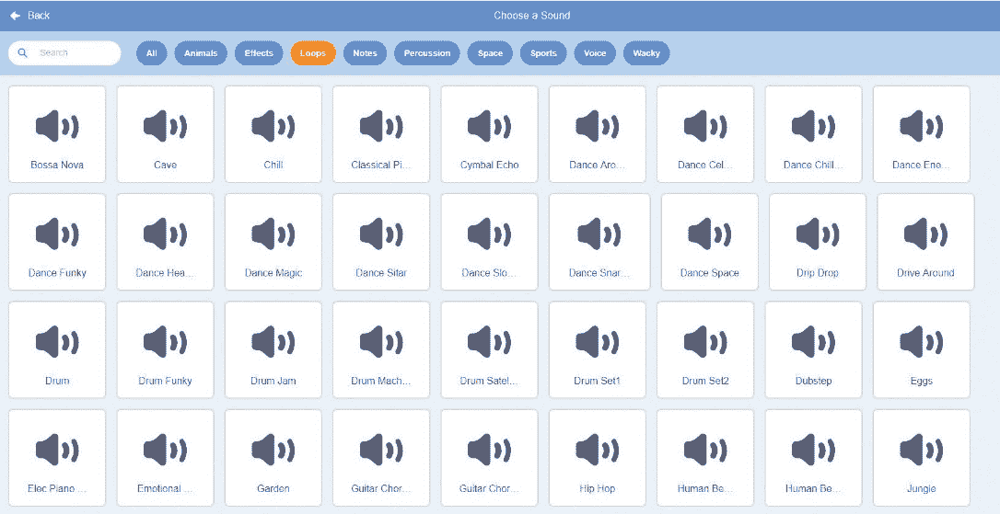

*Scratch 中的预制音乐循环*

**注意：** *Hatlight*的开始和结束部分使用的循环分别是“Dance Slow Mo”和“Dance Chill Out”。

请记住，你还可以直接在 Scratch 中编辑声音。虽然你无法像在 Audacity 中那样做出更多更复杂的更改，但你可以调整音量并使声音渐入或渐出。渐入和渐出的效果在 Scratch 和 Audacity 中是一样的。

### 额外挑战

如果你准备好接受一些挑战，以下部分提供了一些额外的创意供你尝试。

#### 使用口腔声音为游戏创作音乐

如果你进行一些实验，你可以制作出一系列不同的声音：哼声、放屁声、爆炸声、舌尖点击声，或者只是说一些胡乱编造的词语。回想一下，*Hatlight*中的跳跃音效是我对着麦克风说的“Hup！”声音。如果你有野心，可以尝试完全用口腔发出声音为你的游戏创作音乐。

#### 使用音乐来创造对比的情绪

*不和谐音*是一个词，用来描述当你看到的事物和听到的声音不一致时产生的不安感。当你在游戏中跑跳穿越一个明亮愉快的森林，而播放着邪恶、恐怖的音乐时，你会有什么感觉？当你的角色在游戏中移动缓慢且忧伤，而背景音乐是欢快的流行音乐时，你会有什么感觉？你能在游戏中创造出哪些奇怪的情感？

#### 创建一个程序化音乐游戏

访问 *[`freesound.org/`](https://freesound.org/)*，找到一段有人在乐器上弹奏多个音符的录音。使用 Audacity 剪辑出四个不同的音符。当玩家向上移动时播放其中一个音符，向右移动时播放另一个，向左移动时播放另一个，向下移动时播放最后一个。当玩家在你的游戏中移动时，他们将不自觉地创造出音乐！

你还能想到哪些方法，将声音和音乐运用到你的游戏中？

### 你所学到的

在这一章中，你学会了如何添加酷炫的音效，将信息传递给玩家，并为你的游戏设定合适的氛围。你使用 Audacity 录制并编辑了自己的音效，使用 sfxr 生成了声音，并使用 Drumcircle 创建了鼓循环。

在接下来的最后一章，我将分享一些建议，帮助你将本书中学到的内容运用到实际中，带来你的创意。
