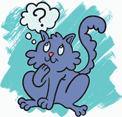

## 接下来该做什么

你已经到达了最后一章！成为一名游戏设计师的感觉如何？有点奇怪吗？别担心——那很正常。也许你会说：“我还不*觉得*自己是个游戏设计师，”但这本书听不见你说的话，它没有耳朵。

很容易觉得自己没有资格称自己为某个职业，因为标签很难界定。有些游戏设计师在大团队中工作，每个人都为完成的游戏贡献一小部分。另一些游戏设计师则坐在卧室里，用电脑制作有趣的东西。还有一些游戏设计师去公园和朋友们玩接球游戏，并想出不同的玩法，比如说：“如果我们必须把球从腿下投过去呢？”或者“如果我们不能用手碰球呢？”有很多种不同的方式可以成为游戏设计师。

### 提问

你可能还没有太多的游戏设计经验，但我给你透露一个关于游戏设计的酷事实：如果你做得对，它应该总是有点挑战性。即使是那些设计了多年的游戏设计师也常常会问：“如果每天只能移动一格呢？”“在抗议活动中可以玩什么样的游戏？”“为什么游戏不让你和怪物做朋友，而是要打败它们？”

游戏设计更多的是在于提问，而不是寻找答案。每个人，无论技能水平和经验如何，都可以提出问题。

在本章中，我提供了一系列挑战性练习，帮助你以全新的方式制作游戏。它们中的一些将帮助你推广你的游戏，并与他人合作。每个练习都是一个问题，希望能引导你提出自己的问题。

你不必做所有的练习，也不一定要按顺序进行。只做那些最能激发你灵感的练习。

### 记录你的游戏

你还需要录制一段游戏视频，这样你就可以展示游戏的声音和画面效果。

你可以使用* [`obsproject.com/`](https://obsproject.com/)* 上的 OBS（Open Broadcaster Software）Studio 来捕捉、编辑并上传你游戏的录制视频。这是一个免费的游戏视频直播软件，但你也可以用它来录制视频。然后，你可以把视频发布到 YouTube 或社交媒体上。OBS Studio 网站包含了如何开始使用的说明。

处理在线反馈

当你在网上发布内容时，可能会收到一些带有恶意和伤害性的评论和反馈。同时，你也希望能开放心态，接受那些能帮助你改进游戏和技能的反馈。知道什么是建设性的批评，什么只是纯粹的恶意，十分重要。

*建设性的反馈*来自于那些真正想帮助你改进的人。它可能是像这样的评论：“我真的很喜欢*这一部分*，但*那部分*对我来说不太行”或者“我在尝试做*这个*时发现了一个 bug。”你通常能识别出建设性反馈，因为它会提到你可以修复或改进的具体内容，给你一些具体的工作目标。

在网上活动可能让你想要培养一副厚脸皮，以保护自己免受有害言论的影响，但尽量保持开放的心态，接受那些真心想帮助你的人。同时，确保当你评论他人的作品时，你也要做到有帮助且积极。

### 在 [itch.io](http://itch.io) 上分享你的游戏

网站 *[`itch.io/`](https://itch.io/)* 汇集了数百款游戏。一些人使用 *[itch.io](http://itch.io)* 销售他们的游戏，而一些人则免费赠送他们的游戏。将你的游戏发布到 *[itch.io](http://itch.io)* 上意味着人们会更容易找到它。现在你已经知道如何制作游戏的 *gif* 文件或视频，你可以使用这些素材展示你的游戏样貌，让浏览 *[itch.io](http://itch.io)* 的人了解你的游戏。

在 *[itch.io](http://itch.io)* 上，玩家可以选择将你的游戏下载到他们的电脑上，或者直接在网站上玩。为了让玩家在 *[itch.io](http://itch.io)* 上玩你的游戏，你需要将它嵌入到 *[itch.io](http://itch.io)* 上。你可以在 Scratch 维基上的 *[`tinyurl.com/scratchio/`](http://tinyurl.com/scratchio/)* 找到如何嵌入 Scratch 游戏的解释。

在 *[itch.io](http://itch.io)* 上发布游戏使你成为一个更大社区的一部分，可以帮助你的游戏找到更多的观众。敢于将你的作品展示给更广阔的世界，是成为一名强大艺术家的重要一步。

### 与他人合作

尝试和朋友一起制作游戏。与别人交换想法并互相激发创意可能非常激动人心，你们每个人都在对方的想法基础上进行扩展。一些最有力量的创意就是这样诞生的，合作的能量可以带来很多乐趣。

你可以通过多种方式与他人合作。也许对方负责所有的图片设计，而你负责编程。或者，也许你们俩尽可能多地想出创意，并将它们全部包括进去。也许对方只是陪伴你一起工作，并尽量给你一些酷的点子。

与他人一起进行创意项目可能会很棘手，特别是当他们是朋友时。如果你们因为项目发生争执，可能会影响你们的友谊。当你们双方都拥有相同的能量和兴奋感时，合作会感觉非常棒，但当你们两个人的精力或可用时间不同，紧张气氛可能会产生。有时候，可能会感觉到其中一个人主导了整个项目并做出所有决策。

*合作* 就是关于沟通的！如果有人觉得自己在决策中没有足够参与，或者觉得他们花在项目上的时间比另一个人多而感到沮丧，那么就讨论一下吧！尽量不要防御。考虑建设性的批评：具体说明问题所在、它带给你的感受，以及怎样做能改善这种情况。

合作是件非常辛苦的事，但它会带来你自己无法完成的惊人成果。

### 为多人制作游戏

独自一人使用电脑玩游戏可能既惊讶又有趣，但和别人一起玩游戏可能会更有趣。当你和别人一起玩游戏时，你不仅仅是在按照游戏的规则玩。你还在试图预测、回应或理解另一个玩家的行为。试着为两个人（或更多！）制作一款游戏。

玩家可以通过多种方式互动。他们可以各自*竞争*，争取高分，抢先到达旗帜，或者把另一个玩家从巨大的棉花糖上撞下去。或者他们可以*合作*，试图完成相同的目标。也许他们需要合作来控制一台巨大的机器人（一个玩家控制机器人的腿，另一个玩家控制机器人的手臂）。或者你的游戏可能是竞争与合作的结合。

如何添加第二个玩家？到目前为止，我们一直让玩家使用箭头键来移动他们的角色。但 Scratch 让我们可以为任何键盘按键编写代码。你可以通过为第二个（或第三个或第四个）玩家分配其他键来让他们一起玩游戏！

传统上，游戏开发者使用 WASD 键。如果你把 W 视为上，A 视为左，S 视为下，D 视为右，那么它们与箭头键的排列方式是一样的。它们也位于键盘的另一侧，给两个玩家留出了一些空间。

如果你把两个玩家的按钮安排得非常靠近对方呢？这会如何改变玩家之间的互动方式？

### 制作一个奇怪的控制器

有很多我们已经见过无数次的想法，我们以至于把它们视为理所当然。在 Scratch 的键盘 **感应**块中，箭头键位于列表的最上面。但如果你有视频游戏主机，你会如何使用控制器来移动角色呢？很可能会有一个带箭头的十字键，或者一个可以指向不同方向的摇杆。

仅仅因为大家通常以某种方式做事，并不意味着那是唯一的方式（甚至是最好的方式！）。控制器可以有任何形式。如果你做了一个关于学习在一个奇怪的新机器人身体中行走的游戏，控制方式是熟悉的，合适吗？我们控制游戏的方式是游戏体验的一部分。试着想象一种与游戏体验相匹配的控制方式。

这里有几个重新构想游戏控制的想法：

**改造现有的控制器。** 你可以使用很多简单的物体来改变使用键盘或鼠标的体验。比如一个玩家被缩小了的游戏？移动的按键可以不在键盘的相邻位置，而是分散在很远的地方。你可以为键盘制作一个覆盖层，只留出那些按键的位置。

或者，试想一个游戏，玩家需要通过推开墙壁和天花板在零重力的空间站中移动？你可以把鼠标挂在纸盒的中央（线缆穿过顶部的孔悬挂下来），这样玩家就得在盒子的一侧或顶部找到地方推鼠标。这个游戏是关于一只老鼠的，使用鼠标来控制，你可以给电脑鼠标加上小耳朵，让它看起来像一只真正的老鼠。可能性仅受限于你的手工艺材料！

**把物体变成控制器。** 一项名为 Makey Makey 的发明可以让你通过触摸家中的物体来按键盘上的按键。你可以在* [`makeymakey.com/`](https://makeymakey.com/)* 查看并购买它。

Makey Makey Go 便宜且可以放进口袋。将它插入电脑，然后从它上面接一根线到任何*导电*的物体上，导电物体是指能够导电的东西。你家里大多数金属物品或含水物品（如水果、植物或食物）都能导电。

你可以将以下导电物体变成游戏控制器：

+   一根香蕉或其他水果

+   一片叶子或植物

+   铝箔

+   硬币、回形针或金属垫圈

+   一片面包

+   彩泥

当你触碰插入 Makey Makey 的物体时，它会在你的电脑上注册一个鼠标点击或空格键按下。那么，你会在一块面包或一团铝箔上玩什么样的游戏呢？

如果你想使用各种不同的物体来控制你的游戏，你可以选择购买 Makey Makey Classic。它价格稍贵，但附带足够的线缆，能连接六个不同的物体。试着为你最喜欢的游戏制作一个新的控制器吧。

### 继续探索与创造！

最重要的是探索并富有创造力。制作艺术——无论是游戏、漫画、杂志、音乐、写作，还是你窗台上的一个小花园——都能帮助你意识到自己的能力。这会让你对自己和周围的世界感到惊奇。

随着年龄的增长，你可以用于玩耍和创造没有赚钱价值的东西的时间越来越少。养成创造和动手做事的习惯，并在你变老时保持这个习惯！开始永远不晚。制作艺术将增加你对生活的享受。*真的*。

恭喜你完成了这本书！但这本书只是一个起点。现在你已经知道如何使用 Scratch 制作游戏，接下来就由你自己决定如何利用这些知识。跟随你的想法，不论它们看起来多么傻乎乎、怪异或不原创。继续探索。我迫不及待地想看到你会做出什么。
