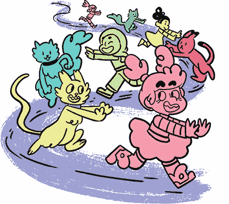
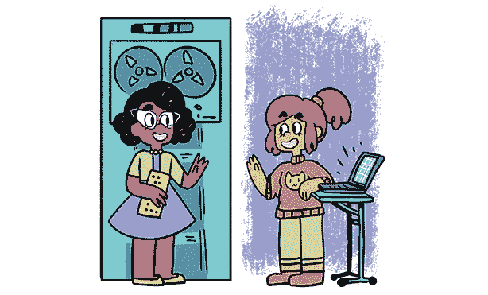

## 第一章：每个人都能做游戏

视频游戏可以是有趣的、奇怪的、令人兴奋的、好奇的、神奇的，甚至是非常可怕的。我们喜欢玩游戏，因为它们像是通向其他世界的窗户，这些世界随着我们与它们互动而移动和变化，规则也不同于我们自己的世界。（有时这些规则似乎比我们的更有意义。）游戏可以是我们短暂访问的地方，也可以是我们长时间迷失其中的地方。通过游戏，我们可以尝试不同的角色，探索不同的视角。

无论游戏对你意味着什么，你应该知道，你可以制作属于自己的游戏。而且这比你想象的要简单得多！*制作你自己的视频游戏*系列将展示如何利用一些工具，从零开始制作有趣的互动游戏。

### 所需工具

要制作这个系列中的游戏，你需要以下工具：

+   •访问计算机的权限

+   •一个互联网连接

就是这样！在本书中，我们将使用一个名为*Twine*的免费在线工具，它专为编写类似于*选择你自己的冒险*书籍的分支故事而设计。但你将学会让你的 Twine 游戏做一些*选择你自己的冒险*书籍根本做不到的事情！

在你学习如何下载 Twine 并开始制作你的游戏之前，首先让我们探索一下你今天喜欢的游戏背后的历史。

### 游戏的简史

游戏存在了*永恒*，至少从文明的开始就有了。事实上，我们最古老的祖先曾用羊骨（最早的骰子！）制作自己的游戏。他们使用种子和地面上的一些洞来制作现在我们称之为曼卡拉的游戏。井字游戏最早在 3000 多年前的埃及就有人玩过！

游戏早在写作、绘画和 3D 电影等活动出现之前就已经存在。看起来人类天生就是为了*玩*。每当一群人同意遵循某一套规则时，一款新游戏就诞生了。当这些游戏传递给新一代玩家时，新的群体会在其中加入自己独特的变化。例如，一个捉迷藏的玩家可能会想，“如果你能*拯救*被捉到的人，捉迷藏是不是会更刺激呢？”就这样，一条新规则诞生了：游戏像奇怪的植物一样，随着时间的推移不断生长和变化。

由一群人而非单个人设计的游戏叫做*民间游戏*。没有人发明捉迷藏。更可能的是，捉迷藏有上百万个不同的“作者”，每个人都在其中加入了自己的小变化。这就是为什么今天会有这么多不同版本的捉迷藏，如手电筒捉迷藏、冰冻捉迷藏和踢罐子等。只需要有人想出另一种更有趣的玩法，其他的就是历史了。

你手机上的移动游戏是*设计师游戏*，由一个人或一个团队制作。它们不是民间游戏，但它们仍然是人们通过玩游戏并尝试想出不同的方式来改善现有游戏或利用想象力创造新游戏的结果。

在玩游戏时，你是否曾想过：“如果这个游戏有了*这个*功能，那就太酷了”？如果是的话，你已经具备了成为一名优秀游戏设计师的潜力。

### 谁制作视频游戏？

在 1960 年代，计算机的体积和*整个房间*差不多：这些巨大的计算机被称为*主机*。由于计算机既昂贵又复杂，只有少数人能使用它们来制作视频游戏。

最早的电子游戏之一，*太空战争*，是通过在纸卡上打孔然后将卡片放入计算机中编写的。写出代码后，你还得弄清楚在卡片上打哪些孔才能让计算机读取并理解这些卡片。如果任何一个孔打错了，你就得从头开始，重新打所有的卡片！

正如你所想象的，那个时候的计算机使用起来非常复杂。它们不仅体积庞大，而且价格昂贵，只有学校才能负担得起。事实上，1960 年代和 1970 年代的大多数视频游戏都是由大学里的学生设计的，比如麻省理工学院（MIT）的学生。

但是，这些学生并没有接受游戏设计的教育。他们正在学习严肃的计算机编程。然而，在课余时间，他们偷偷溜到计算机实验室，弄清楚如何制作视频游戏，因为他们觉得游戏很酷。他们将游戏伪装成严肃的计算机程序，因为管理员会删除任何看起来像游戏的程序，称其为浪费空间。

今天，我们记得所有那些早期的游戏，但很少有人记得那些严肃的计算机程序。如果有人抱怨你花了太多时间做游戏，记得这个观点。人们可能会忘记那些严肃的程序，但他们通常会长时间玩一个有趣的游戏。

自 1960 年代以来，计算机发生了很大变化。现在你随身携带一台口袋大小的计算机——你的智能手机——它能够做的事情远远超过曾经的巨大主机计算机，而且速度更快。这些便携式计算机也更便宜，使用起来更简便。

在本书中，你将了解使用免费的简单工具（如 Twine）制作你自己的视频游戏有多么容易，这些工具已经被数百人使用过：这些人来自不同的种族和性别，年轻和年老，生病的人和健康的人，曾上过大学的人和没上过的人。喜欢猫的人，喜欢狗的人，还有两者都喜欢的人。各种各样的人。

所以，*谁制作视频游戏？*这个问题的答案是*每个人*！

### 为什么制作视频游戏？

人们制作视频游戏的原因有很多！例如，或许你曾尝试过画漫画，觉得很有趣。或许你曾写过故事，也觉得很有趣。也许你喜欢手工艺和音乐创作。如果你富有创意，制作游戏你也会觉得有趣。

制作游戏的另一个理由是你真的很喜欢它们，并且想要了解它们是如何运作的。制作自己的游戏是理解游戏设计师如何做出决策的最佳方式，尤其是当他们制作你最喜欢的游戏时。

如果你不太喜欢游戏，那也没关系！也许你可以创造一种前所未见的新型游戏——一种与当前现有游戏完全不同的游戏。玩家们需要挑战。

如果你知道自己想成为游戏开发者，你可以尝试制作那些孩子们会喜欢并且代代相传的游戏，从而激励*他们*也去制作游戏。

对我来说，制作游戏是令人兴奋的，而且即使我已经花了很多时间在上面，它依然是新的。每当我觉得自己完成了一个游戏时，新的创意总会冒出来。我无法停止思考它，直到它从我的脑海中消失，这意味着我必须把这个创意变成现实。当我创建一个新游戏时，我是在创造一个我可以与世界分享的东西。这感觉棒极了！

制作游戏有无数理由，而只要这些理由让你兴奋，那它们就都是很棒的理由。

### 我的游戏应该关于什么？

游戏可以是关于*任何*事情的。真的，没错。它们可以是关于大事、小事、重要事、傻事、人物和地点，你的妈妈或爸爸，兄弟或姐妹，或者你的猫或狗。

它们可以是关于你经历过的事情，或者是关于你*希望*自己经历的事情。你可以制作一个关于你奇怪梦境的游戏，关于你听到的一个有趣故事，或者关于机器人接管地球的游戏。

或许你的游戏可以讲述一条从地下室通向地球中心的秘密隧道网络（你知道那些隧道吧？）以及生活在其中的怪物。

你也可以尝试重新制作你已经玩过并喜欢的游戏。制作一个*属于你自己的*游戏，讲述那个穿着有趣吊带裤和留着胡子的男人（马里奥）的故事。例如，马里奥的休息日他会做什么？他会去野餐吗？你觉得他有猫吗？

尽管几乎所有的事物都有游戏了，但*总*有更多的创意空间。别让任何人告诉你别的！

### 关于 Twine

Twine 完全是关于讲故事的。事实上，写一个 Twine 游戏就像是在写一个故事，只不过这个故事会根据玩家做出的决定以不同的方式变化——或者说是*分支*。

#### Twine 是如何工作的

当你浏览一个网站时，你通常会看到一些不同颜色的带下划线的文本。点击这些文本时，整个新页面就会出现。那些高亮的词就是*超链接*。当你将一堆超链接组合在一起时，你就得到了*超文本*。*超*意味着你几乎可以瞬间到达一个新的页面，它可能距离你数百光年远。

正如你将看到的，Twine 就像是*选择你自己的冒险*书籍系列的数字版本：你点击的每一个超链接都是一个决定，它会把你带到故事中的不同路径。在第一章，你将学习如何使用超文本通过 Twine 制作游戏。

#### 我需要知道如何编程吗？

不，你不需要知道如何编程就能开始使用 Twine。只要你知道如何在电脑上输入文字，你就可以开始使用了！Twine 有一个叫做*hooks*的系统，允许你改变故事的外观，或者秘密地记录玩家的行为。但除非你想这样做，否则你不需要担心这些。

#### 如果我不喜欢写作怎么办？

你曾经写过故事吗？我是说，写给*你自己*的故事，而不是为了上课写的？当你在制作游戏时，你不需要担心别人怎么想。你是在为*你自己*制作游戏。这种制作自己想要的东西，摆脱他人评价的感觉，既能带来力量感，又能获得满足感。写作也是如此。如果你只为别人写过，试着为自己写一下，再决定你的想法。

#### 这需要多少钱？

Twine 是免费的！制作游戏、发布游戏以及将游戏放到网上供他人玩都不需要花钱！（当然，你家里需要有人支付互联网费用，或者你也可以尝试使用学校或图书馆的电脑。）

#### 替代工具

如果你不喜欢 Twine，可以看看这个系列中的另外两本书：《*用 Scratch 制作你自己的视频游戏*》和《*用 PuzzleScript 制作你自己的视频游戏*》。与 Twine 不同，Scratch 和 PuzzleScript 让你制作的是*图形*游戏，而不是文字游戏。

但你也应该尝试学习 Twine！你掌握的工具越多，作为创作者的能力就越多样。最好的艺术家能使用任何工具创作出符合自己愿景的作品。

让我们开始吧！
