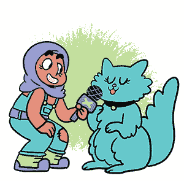

## 与猫的访谈：Twine 基础

在这一章，我们将探索我制作的一款 Twine 游戏《*与猫的访谈！*》。为了制作这款游戏，我向我的猫百科全书皱眉提了许多问题，然后把她的回答记录下来。她是一只非常健谈的小猫，话很多！

*与猫的访谈！* 是一款简单的游戏，你选择一个问题，百科全书皱眉回答，然后你选择另一个问题。你接下来问什么问题取决于百科全书皱眉对上一个问题的回答，就像在正常的对话中一样。例如，如果她提到她的妈妈——那就是我！——你可以问她关于她妈妈的问题。在这款游戏中，你还会看到我猫咪的照片。有时候当你问她某些问题时，她会做出有趣的表情。现在就去[**https://nostarch.com/twinegames/**](https://nostarch.com/twinegames/)玩游戏，玩完后再回来。

### Twine 入门

Twine 游戏由文字、超链接，有时还会包含图片组成。当然，它们并不全是关于猫的。并没有*官方*规则规定它们必须是。对于你的第一个游戏，最好从一个小创意开始。原因在于，大创意像是高耸的城堡一样成长：它们很美，但很少能完成。

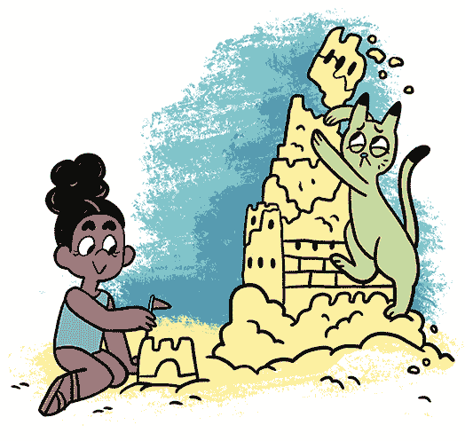

确定一个创意。这不必是最好的创意。你总是会有更多的想法，也可以随时制作更多的 Twine 游戏，所以不用担心游戏是否完美。当你有了创意的种子时，访问 Twine 的主页[*http://www.twinery.org/*](http://www.twinery.org/)。Twine 网页看起来像一个大公告板，上面贴满了小便签。

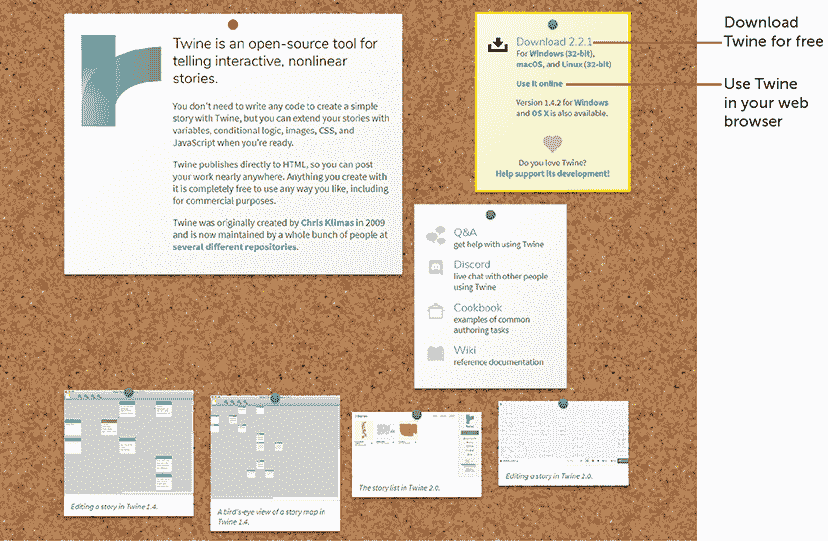

现在，我们将使用在线版 Twine，因此不需要任何设置，也无需安装任何东西：

1.  1 点击** 使用在线版 **。你可能会看到一些关于 Twine 的有用信息以及一些关于如何使用它的链接。当你读完这些信息后，你将进入个人 Twine 库，像下图所示。你应该会看到一张大而空白的白纸，因为你还没有写任何东西。很快，这张纸将会被你所有的故事填满！！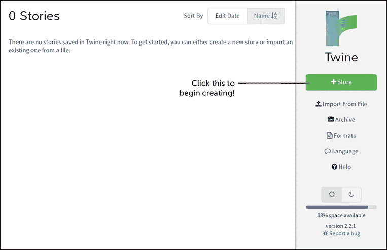

1.  2 点击**+故事**按钮。一个窗口会弹出，询问你为你的故事命名。例如，如果你正在写关于与你的猫 Marshmallow 的访谈，可以输入*Marshmallow 访谈*或*Marshmallow：访谈*之类的名字。如果你想写关于与鱼、狗、想象中的外星人或其他事物的访谈，写上这些！如果你暂时想不出任何创意，可以先复制我的游戏，之后随时可以更改。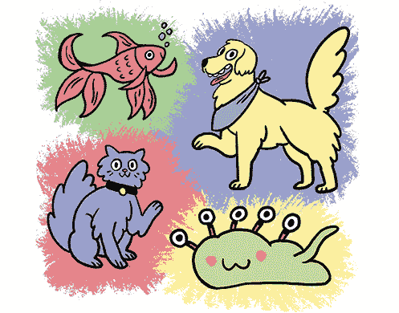

1.  3 输入名称后，点击**+添加**。你应该会看到像这样的蓝色屏幕。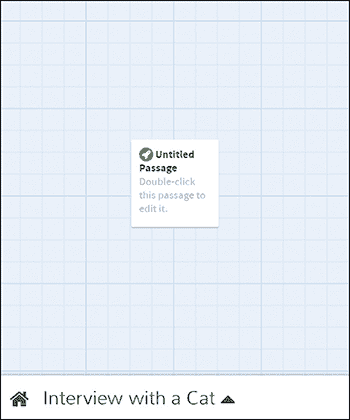

这里就是你的故事所在！现在，它只是一个等待你所有精彩创意的空白网格。

### 编辑章节

将大蓝网格看作是房子的蓝图（或者是城堡、海底实验室，甚至是巨大的机械恐龙——你想怎么形容都可以）。你将在这个网格上添加段落。一个*段落*是一段文本，你也可以把它当作是故事中的一页，或蓝图中的一个房间。

目前只有一个段落，叫做*Untitled Passage*，因为你还没有为它命名。双击显示*Double-click this passage to edit it*的地方。

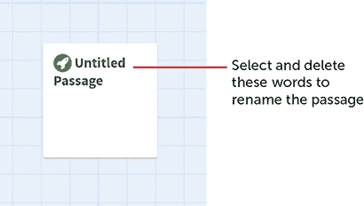

*你新的 Twine 故事中的第一个段落*

打开一个窗口，让你输入文本。通过高亮显示*Untitled Passage*并按 BACKSPACE 键删除它来更改段落的名称。

将这个第一个段落命名为**Start**，因为它是玩家开始的地方。

**注意**

最好为你的段落取一些有意义且容易记住的名字！

接下来，写下玩家将在游戏中看到的文本！高亮显示现有的*Double-click this passage to edit it.*消息并按 BACKSPACE 键删除它。然后，一大堆幽灵文本会出现在窗口中！

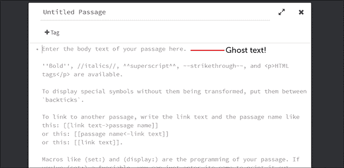

*幽灵提醒文本会提醒你写什么*


这些幽灵文本只是提醒你 Twine 的工作方式。一旦你开始输入文本，它们就会消失。输入我*与猫的采访！*游戏中的第一个词——`meh!`

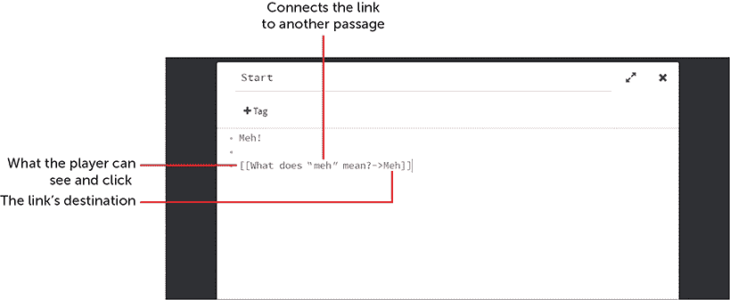

*创建链接*

在`Meh!`下的蓝色字词构成了一个*链接*，玩家点击后可以在段落间跳转。让我们来看看以下链接的各个部分：

[[What does "meh" mean?->Meh]]

使用两个括号`[[` `]]`将文本包围起来非常重要。这样 Twine 就知道括号内的文本是一个链接，而括号外的部分则不是。如果不小心，可能会将整个屏幕选作链接，而不仅仅是几个词。

箭头前的词语（`What does "meh" mean?`）是玩家唯一能看到的部分。请参考本章中的第一幅图，查看这个链接在完成的游戏中的样子。当玩家点击这些词语时，他们将进入一个新的地方！但哪里呢？

那是箭头（`->`）的工作。它由一个破折号（`-`）和一个大于号（`>`）组成。箭头将链接中的词语与链接的目标连接起来。

第三个项目是链接的目标。在这种情况下，`->Meh`表示链接指向一个名为*Meh*的段落，百科全书《皱眉》解释了“meh”是什么意思。

**注意**

从左到右，一个链接的格式如下：

[[text to display in link->link destination]]

你可以将链接设置为玩家可能向你的猫、狗或外星怪物提的第一个问题。输入玩家首先会看到的内容，一个箭头`->`，然后是要链接到的段落名称（玩家将前往的地方）。最后，用闭合的双括号将一切括起来。当你完成后，点击窗口右上角的 X 来关闭它。

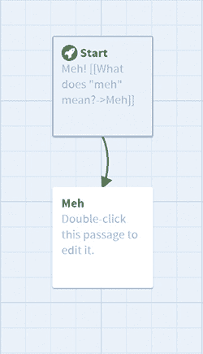

一个新的房间应该被添加到你的蓝图中，屏幕应该像右图所示。

每当你像刚才那样添加通道链接时，Twine 会自动为你创建这些新通道，并保存你的工作。

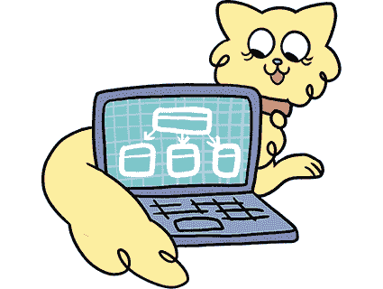

最好在开始填写新通道之前，先完成一个通道的编写。我们来给*开始*通道添加两个链接，像这样：

```
Meh!
[[Hello!->Hello]]
[[Merrow!->Cattalk]]
[[What does "meh" mean?->Meh]]
```

关闭窗口，哇！

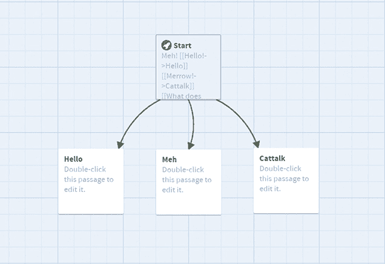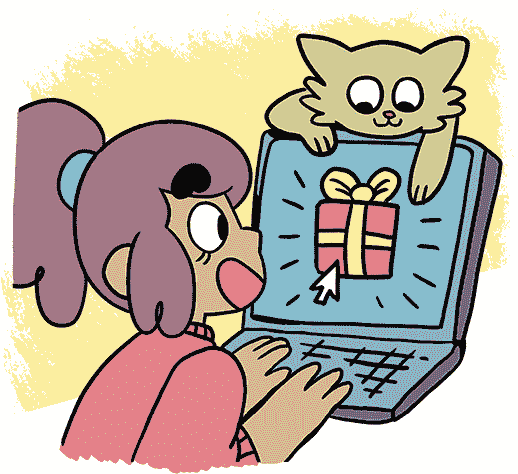

通过像这样添加不同通道的链接，你为玩家在游戏中提供了可以探索的新选择。

### 创建多个路径

《*采访猫咪！*》游戏的玩家可以通过多种方式到达相同的通道。例如，第一个通道有三个选择：*你好*、*一般*和*猫咪对话*。每个通道将玩家带到不同的通道。但最终这三者都会将玩家带到同一个地方：一个主要的*采访*通道，里面有许多不同的问题。这是故事的中心，类似于目录。像目录一样，它展示了故事的许多不同走向，你总是可以回到这里，再去其他地方。

在下图中，箭头从*开始*的通道指向许多其他通道，展示了玩家可以点击的不同链接。

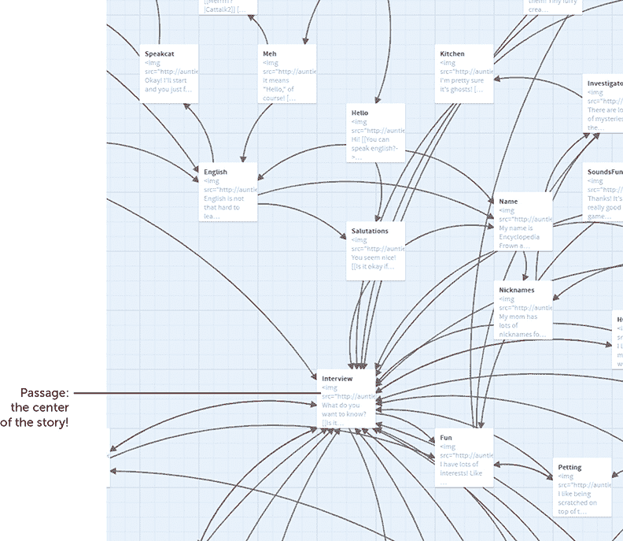

所有链接最终都会指向*采访*通道，其他部分的许多箭头也指向它！因此，玩家可以选择一个选项，而不用担心错过故事的其他部分。

秘密与奖励！

你可以使用小奖励来激励玩家充分探索你的故事。例如，在《*采访猫咪！*》游戏中，我使用了百科全书皱眉的特别图片作为奖励，供玩家发现某些通道。在游戏中有一张非常可爱的百科全书照片，表现得像这样：O_o。这张照片只出现在游戏中的一个通道里。你找到它了吗？要看到这张照片，你必须问百科全书“再问一个问题”，然后说一些不是问题的话！

编写互动故事的一个有趣之处在于，每个玩家通过游戏的路径都可能有所不同。试着为你的游戏添加许多有趣的秘密，供玩家发现并与彼此分享。

### 删除通道

当你将鼠标拖过任何通道时，你应该会看到一个包含四个图标的气泡，图标像是垃圾桶、铅笔、播放按钮和三个点。我们来看看这些图标分别做什么。

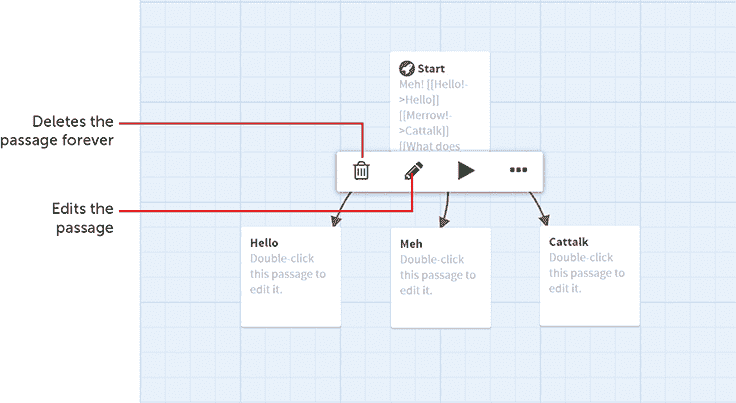

你可以使用*垃圾桶*删除通道，将其从你的故事中*永久*移除！（当你点击时，会出现一个警告信息，防止你意外删除文本。）*铅笔*让你可以编辑通道：你也可以通过双击通道来编辑它。

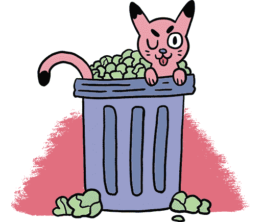

### 测试你的游戏

为了确保你的链接按预期工作，你可以进行测试。*播放按钮*让你从气泡指向的段落开始测试你的游戏。当你点击它时，你将进入**调试视图**。

人们将他们游戏中的问题称为*bug*。想象一下，一个讨厌的小虫子在你的计算机内部爬来爬去，按下所有错误的按钮，搞乱了一切。真恶心！一个 bug 可能是你把一个链接指向了错误的地方，或者做了其他错误。找到并消除游戏中的 bug 的唯一方法就是测试你的游戏。时不时地测试你的游戏是个好主意，确保一切正常运行。

将鼠标悬停在*开始*段落上并点击播放按钮。屏幕上会出现类似这样的界面。

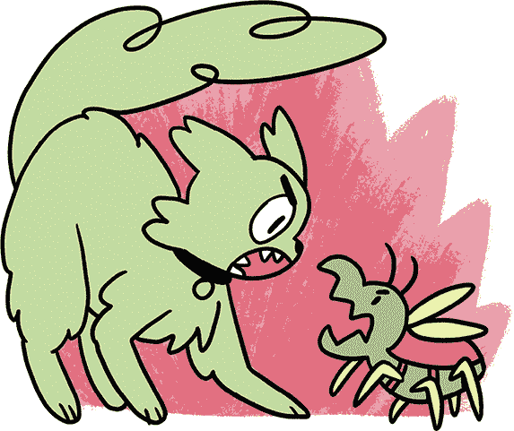

现在你可以进行游戏的测试运行。当你在调试模式下点击链接时，你会看到一个选项，点击*双击此段落进行编辑*来修复错误。你还应该能在左侧看到一个小的返回箭头。


*点击返回箭头返回到前一个段落并做出不同的选择。*

点击返回箭头返回并做出不同的选择，这样你就可以测试不同的路径。（角落里的**调试视图**按钮显示了玩家看不见的额外信息，比如每个链接指向的段落。）当你确认所有链接都能正常工作后，关闭浏览器标签页，返回 Twine。

### 设置起始段落

在*开始*段落中，你会看到一个小小的绿色火箭图标，表示这是第一页面。要从其他段落开始，点击顶部栏中的“更多段落选项”，然后在下拉菜单中点击“从这里开始故事”，将该段落设为起始段落。绿色火箭图标应出现在新的开始段落上。

点击 Twine 右下角的**播放**按钮。你的游戏应该从带有绿色火箭图标的段落开始。现在，你正在以玩家的视角来玩这个游戏。

### 分享你的 Twine 游戏

当你完成了 Twine 游戏的制作后，像游戏开发者一样与朋友分享并发布到网上。太棒了！

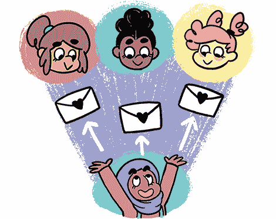

按照以下步骤分享你的游戏：

1.  1 点击 Twine 网格屏幕底部的游戏名称。会弹出一个选项菜单。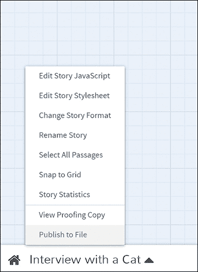

1.  2 点击**发布到文件**。如果浏览器询问，点击**保存文件**，将你的游戏保存为 HTML 文件，这实际上就是一个网页。你的游戏应该保存在你的计算机的*下载*文件夹中，或者是你从网页浏览器下载文件时保存的任何位置。它的文件名可能类似于*interview-with-a-cat.html*。

1.  3 要与别人分享你的游戏，只需通过电子邮件将 HTML 文件发送给他们。当他们收到文件时，他们需要在网页浏览器中打开它来玩游戏。

当你的游戏准备好上线时，你可以将它上传到互联网上，让任何人都可以玩。互联网上有一些网站允许你免费上传游戏。

### 上传你的游戏到线上

免费的 Twine 主机网站 [*http://philome.la*](http://philome.la) 是你游戏的一个选择。它非常易于使用，但你必须拥有一个 Twitter 账户才能上传你的 HTML 文件。

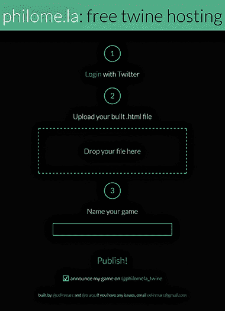

另一个选择是 [*http://textadventures.co.uk*](http://textadventures.co.uk)。你不需要 Twitter 账户，但你需要在该网站上注册一个账户。

还有另一个选择是 [*https://neocities.org*](https://neocities.org)。设置起来比其他网站稍微复杂一些，但你可以为你的游戏创建一个酷炫的网站，并且有一个易于记住的 URL。只需在该网站上注册一个网站，如 *my-cool-game.neocities.org*（或者任何可用的酷名字），然后上传你的 HTML 文件，步骤如下：

1.  1 在你的电脑上找到文件。它的名字应该像 <*Your-Game>.html*。将其重命名为 *index.html*。

1.  2 填写网站首页的信息，然后点击 **Register**。

1.  3 点击 **Edit Site**，这会带你到一个新页面。

1.  4 点击 **Upload**。会弹出一个窗口，帮助你选择要上传的文件。选择你的 *index.html* 文件，然后点击 **Open**。

现在你的游戏应该已经在互联网上了！访问你全新的网站，确保你的游戏能够正常运行。

### 你学到了什么

干得好！现在你已经掌握了使用 Twine 的基础知识。你可以编写段落并创建链接，给玩家提供选择。你知道如何测试你的游戏以确保它正常运行。你还知道如何导出游戏、与他人分享并将其上传到网上。

但是，Twine 还有更多的功能等着你去发掘！在接下来的章节中，你将学习一些有趣的小技巧，使你的 Twine 游戏更加富有表现力。你还将学习如何以不同的方式使用链接来塑造故事的氛围和流程。到时见！

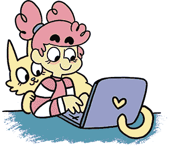
