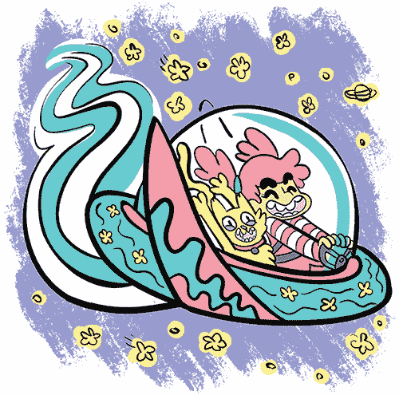

## **2

蜘蛛牛奶：用链接编织故事**

现在你已经了解了 Twine 的基本功能，我们来谈谈如何利用我们现有的工具来真正讲述有趣的故事！我们将探讨使用链接的不同方式，并思考如何塑造我们的故事。我们还将讨论如何通过图像和精美的格式化使我们的游戏看起来更具特色。然后，我们将发布我们的第一个游戏！

让我们从《蜘蛛牛奶》开始，这是一个关于访问你床下的怪物的短小游戏。可以在 [*https://nostarch.com/twinegames/*](https://nostarch.com/twinegames/) 一起玩。

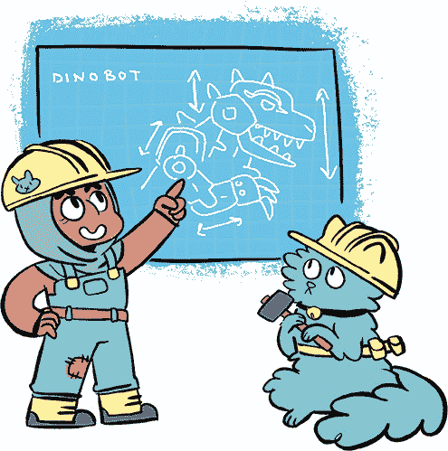

### 使用链接

在 Twine 游戏中，你可以使用链接来影响玩家如何看待并使用游戏中的元素。链接列表就像不同的选择，类似于餐厅菜单。你做出的每个决定都会影响玩家对游戏的理解，即使这只是简单地决定链接放在哪里以及它们说了什么。

你也可以使用链接以不同的方式塑造你的故事。尽管玩家无法像你一样看到游戏的完整蓝图，但玩家根据游戏的形状会以不同的方式体验你的故事。例如，一系列短小的段落，每个段落都有一两个链接，感觉节奏很快：*砰*，*砰*，*砰*！相比之下，一个充满大量不同链接的长段落会鼓励玩家停留，因为有太多细节需要他们去消化！

#### 做出选择

在许多 Twine 游戏中，人们将链接列在段落底部，就像我在《与猫的访谈！》中做的那样。这种方法在访谈类游戏中非常有效：我的猫说些什么，你选择一个问题，她回答，你再选一个问题。

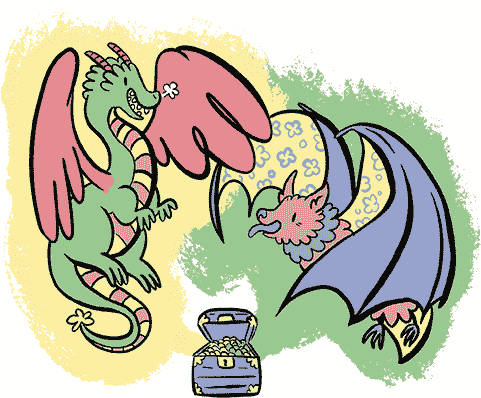

在需要让玩家选择某个选项时，使用链接列表是最好的选择。例如，玩家可能需要决定是骑乘一只魔法龙，还是骑乘一只魔法果蝠，但他们不能同时骑两者。通过将选项并排列出，你邀请玩家对比并做出决定。

作为另一个例子，假设你正在和床下的怪物一起喝茶，就像《蜘蛛牛奶》中的情节一样，怪物给你提供了一些蜘蛛牛奶。你可以通过将链接放在段落底部来强调这个选择，正如这里所示。

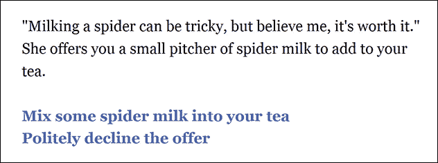

将链接放在段落底部会促使玩家做出选择。他们阅读完整个段落后，当他们到达段落底部的链接列表时，他们会做出行动的选择。

通过将所有选项集中在一个列表中，玩家可以更轻松地看到他们的选择会产生不同的后果。

#### 探索空间

你还可以在各个段落中使用链接来描述玩家的环境。例如，这是《蜘蛛牛奶》中的怪物家园的描述。

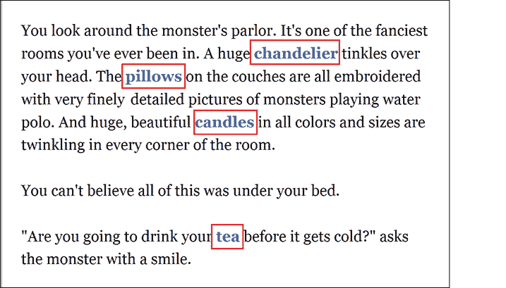

在这段文字中，链接是玩家在环顾房间时注意到的物体。当你将链接放在段落的中间时，你是在向玩家展示他们应该探索的内容，比如*吊灯*在*蜘蛛牛奶*中的位置。

例如，点击**吊灯**会展示一个吊灯，并且页面底部会有一个*返回*链接。*返回*链接会带领玩家回到之前的段落，让他们可以点击*枕头*或*蜡烛*，或者就完成他们的茶。这些额外的细节使你的游戏更加有趣和引人入胜。

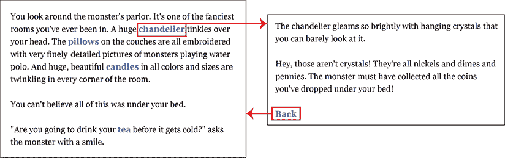

当玩家看完怪物的家后，他们需要决定点击哪个链接以推动故事的发展。

为了帮助玩家决定如何进入下一个段落，我们可以通过将*茶*链接与其他链接区分开来，暗示这是这一场景的结尾。相反，我们将*吊灯*、*枕头*和*蜡烛*链接放在同一段落中，以使它们看起来彼此相似。

*茶*链接是段落中唯一提到时间并带有紧迫感的句子：“你打算在茶冷了之前喝掉它吗？”其他链接只是一些物体，供玩家观看，所以*茶*链接鼓励玩家向前推进。

当你制作游戏时，考虑如何呈现你的游戏以影响玩家的体验。即使是链接出现在段落中的位置，也能影响玩家的决策。

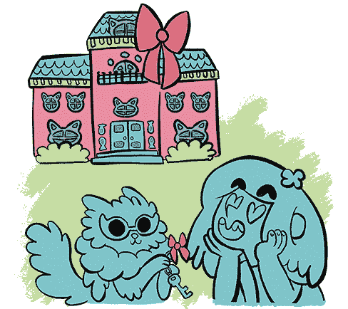

### 布局您的段落

在上一章中，我们将*与猫的采访！*游戏与房子的蓝图做了比较。房子有各种大小：有的房子只有几个房间，而有的则是豪华的大宅子，配有露台、阳台和秘密通道——就像你成为富有和著名的游戏设计师后会买的那种房子。

在制作 Twine 游戏时，你可以随时通过点击和拖动来移动段落。你如何安排段落可以改变故事的流程和你对故事的看法。例如，这里是*与猫的采访！*部分的蓝图。

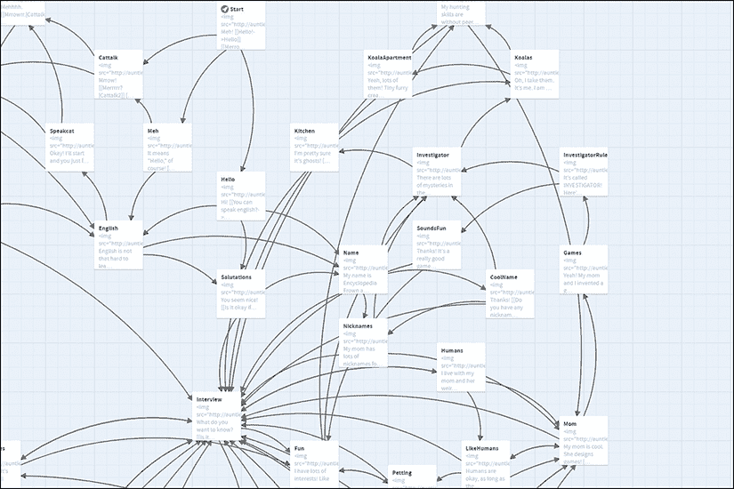

为了让《百科全书皱眉》中的采访显得更正式，我本可以将所有段落排列好。但是我没有这样做，因为这个采访更像是一次友好的对话。为了营造这种氛围，我让段落交叉并以不同的方式连接起来。

当你在为 Twine 游戏添加段落时，可以把你的故事想象成一座房子，把玩家想象成来访者。当玩家进入你的游戏时，他们应该去哪里？他们如何在游戏中移动？Twine 让你轻松地将你的故事视为一张地图。在考虑你的游戏布局时，充分利用这个功能。

#### Twine 游戏的示例布局

让我们来看看如何思考编写一个设定在大宅子派对上的游戏。也许大宅子的入口是一个宏伟的前厅：一个设计华丽的大房间，旨在给来访者留下深刻印象。但是，玩家在前厅里除了挂上外套外没有其他事情可做：这是一个过渡的地方。

大厅将玩家引向房子的中心。玩家走进主大厅，这是另一个大房间，里面充满了人。这里正在举行一个派对，很多人都在交谈、互相介绍。这里很吵闹也很拥挤，玩家在这里很难真正认识任何人，但这里有通向更小、更私密的侧房间的门。

在这些侧房间里，玩家可以停下来，细细观察其中的一些细节。

在这些房间里，玩家可以与他人进行有意义的对话。也许他们会在这些房间中发现秘密通道。也许有一扇秘密的门，能把他们从一间房间带到房子的另一边，或者通往一个他们无法通过其他方式进入的秘密地方。也许玩家能找到通往后院的小门，在那里他们可以暂时逃离派对，仰望星空。可能性是无穷无尽的！

当玩家最终找到回到主大厅的路时，也许许多客人已经移步到大厦的其他部分。现在他们应该对房子的布局有了更好的了解，可能会决定去看看另一翼的房间。

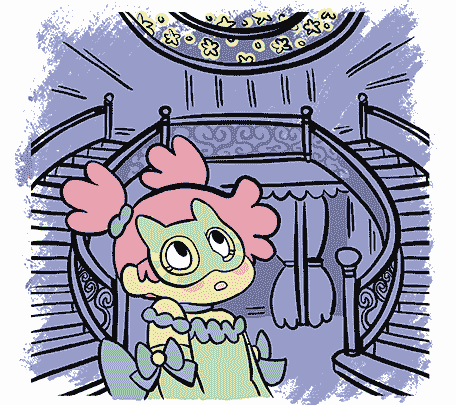

当玩家决定他们已经看够了，他们可能会回到大厅准备离开这座大厦。但由于他们已经看过大厦中的许多房间，他们可能会觉得大厅再也不像最初看到时那样宏伟和威严了。在离开时经过入口，玩家会回想起他们刚到时看到的样子，并能反思自己印象的变化。他们拿回外套，是时候回家了。

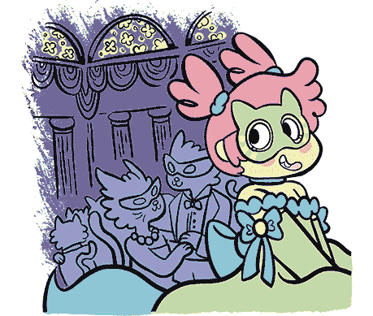

#### 确定你游戏的形状和大小

Twine 故事有各种形状和大小。并不是所有的 Twine 故事都像有很多房间可以探索的大厦。有些像瀑布，只有一条主路径，所有其他路径都从这条主路径上分支出来。有些像花园或洞穴。

当你设计你的 Twine 游戏的形状时，决定什么样的故事适合这种结构。比如一个机器人茶话会会是什么样子，或者在杂货店遇到怪物会发生什么，或者失踪的袜子到底去了哪里？

留意路径分岔和重新汇合的地方。例如，有些故事像树一样分叉，永远不会重新汇合，这意味着你的故事可能会有不同的结局。有些故事像链条：它们分开，再次汇合，然后再次分开，再次汇合，形成通往同一结局的不同路径。还有一些故事是直线型的，或者像蜿蜒的河流。尽量设计出形状有趣的故事，就像下图所示的那样。

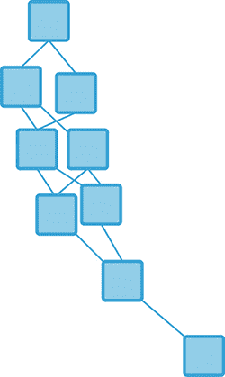

*引导玩家走向结局*

想象一下一个动作电影。英雄看到反派站在一座高楼的屋顶上，可能还像反派一样笑着。我们知道这场景最终会以英雄与反派对峙结束，但英雄是如何走到这一步的呢？

在我们的故事中，也许玩家选择了爬上火楼梯或乘坐直达电梯，但这两条路径都通向激动人心的对决。深思熟虑的故事结构让我们能够引导玩家走向我们认为最重要的场景，即便有多条路径可以到达。

一些 Twine 游戏就像玩家可以漫游的花园。

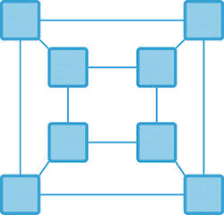

*一个更开放式的游戏*

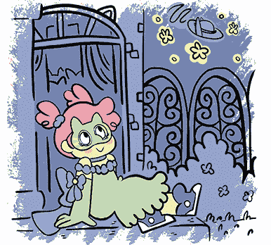

在这种游戏形态中，玩家可以在花园里漫游，欣赏美丽的花朵和树木，但大多数花园没有结局。玩家可以随时离开花园，一旦他们看够了，或许当他们走遍整个花园时，他们会觉得自己对种植这个花园的人有所了解。

一些 Twine 游戏就像深邃、蜿蜒的洞穴，有多条路径通向同一个地方。

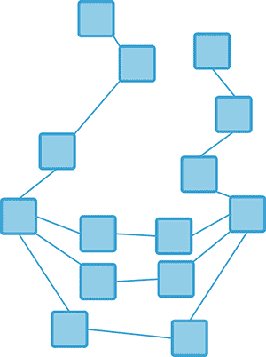

*多条路径通向同一个地方*

例如，洞穴中的路径可以蜿蜒曲折并环绕回到原处。玩家可以一路向深处走，直到光线耗尽。他们需要用手摸索着墙壁前行，不确定自己要去哪里。他们可以沿着不同的路径继续走，直到迷失方向。某个时刻，路径的分支可能会重新汇合，但玩家可能没有注意到，因为太黑暗了。玩家继续向前走，在他们最不期望的时候，再次看到光亮！

这些只是你可以在游戏中使用的不同结构的例子。

### 强调文本

你可以在故事中使用斜体、粗体或下划线来对某些内容进行强调，或者改变它们的外观和感觉。让我们看看如何做到这一点。

**注意**

若想了解更多关于如何在你的故事中标记文本的方式，请查看 Twine 中的帮助选项。

#### 斜体

斜体是强调句子中重要词语的简单方法。要*斜体*文本，可以在你想要斜体化的文本两侧加上星号（`*`）。例如，在 Twine 中输入以下内容：

```
"I don't know about *you* but *I* like a lot of pickles on my
sandwiches. A *lot* of pickles."
```

游戏中的文本将显示为这样。

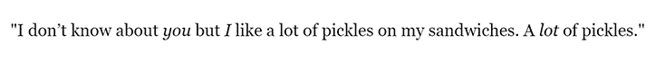

#### 粗体

粗体文本最适合用于标题或你不希望玩家错过的重要词汇，如密码或魔法咒语。使用两个星号（`**`）包围你想加粗的文本。例如，在 Twine 中输入以下内容：

```
**Ingredients in a Good Sandwich**
1\. Lots of pickles
2\. Pretty much anything else
3\. Bread
**NOTE: Make sure you don't forget the pickles!**
```

玩家应该在屏幕上看到这一点。

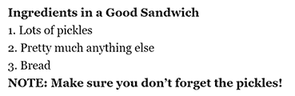

就像斜体一样，粗体是一种强调文本的方式。在这里，我们使用粗体让玩家知道哪些词语他们应该特别注意。

#### 下划线

你也可以使用下划线来强调文本。将词语放在 `<u>` 和 `</u>` 中间，就可以获得下划线文本。

`u` 表示开始下划线，`/u` 表示停止下划线。

### 添加图片

在*Spider Milk*的结尾，有一幅小小的茶杯画，作为游戏的一个可爱的结束。（我在我的笔记本上画的！）*与猫的访谈！*也有图片。你可能也想在你的游戏中使用它们。下面是如何添加它们。


首先，上传你想要使用的图片或图片到互联网上。一个很好的地方是[*https://postimage.org/*](https://postimage.org/)，它允许你免费将图片上传到网络。现在就试试吧！它的首页长这样。


要从你的电脑上传图片，点击**选择图片**并选择你电脑上的文件。如果你想的话，可以将图片调整为更小的尺寸（如果你不更改这个选项，它将按原始尺寸上传）。**缩略图**和**适用于网站和电子邮件**的尺寸通常最适合用于 Twine 游戏。

请记住，因为你正在将图片上传到公共网站，互联网上的任何人都可能看到它。虽然他们可能不会看，但他们*可能*会。所以不要上传任何你应该保密的内容，比如你的地址、电话号码，或者你那满是钻石的秘密保险库的密码。

当你点击**上传它！**时，你的图片应该会上传到互联网上，并且会显示以下界面。

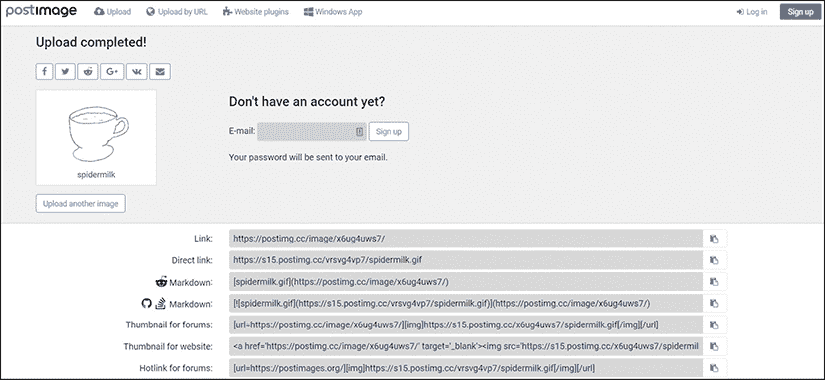

本页面的重要部分是你图片下方的**直接链接**选项。点击**复制到剪贴板**按钮以复制链接。你可以使用这个链接来指向你保存的图片，链接地址是[*https://postimage.org/*](https://postimage.org/)。

现在打开你游戏中的段落，进入你想让图片显示的地方，在段落的文本中输入以下内容：

```
`关闭链接行。你完成的链接应该像这样：

```

```

引号内的文本就是你上传的图片的链接。

接下来，通过点击 Twine 中的播放按钮图标，确保你的图片已经嵌入到你的段落中。如果你没有看到图片，检查一下你是否正确输入了链接。（你的游戏可能需要一些时间才能从互联网上加载图片。）

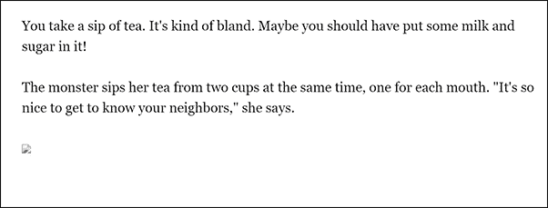

*如果你看到这个图标，请检查你粘贴的链接是否正确！*

Twine 的两个版本

Twine 有两个不同的版本！我们一直在使用 Twine 2，但你仍然可以在[*http://www.twinery.org/*](http://www.twinery.org/)找到 Twine 1。与 Twine 2 不同，Twine 1 允许你直接将图片嵌入到你的 Twine 游戏中，这样你就不需要把它们上传到互联网才能使用。如果你正在制作一款包含大量图片的游戏，Twine 1 可能比 Twine 2 更容易使用。但如果你只使用少量图片，继续使用 Twine 2 也没问题。

### 你学到了什么

在本章中，你为你的 Twine 技能库增加了一些新技巧。你探索了不同使用链接的方式，以创造不同的用户体验和不同的故事结构。你还学习了如何使用斜体、粗体和下划线文本，以及如何向你的游戏中添加图片。

在下一章中，你将学习脚本编写。脚本编写涉及写一些玩家看不见的秘密词汇，这些词汇可以帮助你追踪玩家的操作并相应地改变故事内容。你还将学到更多改变游戏外观的方式。敬请期待！

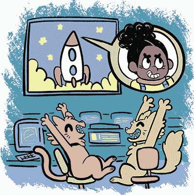
