## **3

*鬼魂汉堡：使用脚本添加特效*

在这一章中，你将学习更高级的 Twine 功能，成为一名 Twine 高手。你将学习*脚本编写*，它可以让你为故事的文本添加特效，并让游戏记住并响应玩家的选择。现在你可以跟踪玩家是去了某个房间，还是携带着手电筒或汉堡。你还将学习如何改变故事的背景色、字体颜色和字体样式。我们将使用一款名为*鬼魂汉堡*的 Twine 游戏作为起点。你可以在[*https://nostarch.com/twinegames*](https://nostarch.com/twinegames)玩它。

这是恐怖的*鬼魂汉堡*开始画面的样子。

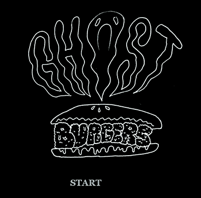

在*鬼魂汉堡*中，你将探索一座恐怖的老房子，寻找超自然现象的证据，这样你和你的朋友 Astrid 就能成为世界著名的鬼魂猎人。随着你探索这座房子，你将进行一些行动，比如翻动一个奇怪的开关，探索一个恐怖的阁楼，来推动故事进展并遇见一些鬼魂。

花几分钟玩一下*鬼魂汉堡*，然后我会教你如何制作它。

### 绘制空间布局

与*与猫的访谈！*（模拟对话）不同，*鬼魂汉堡*模拟的是一个地方：一座豪宅。玩家可以从豪宅的一个部分移动到另一个部分，甚至可以返回查看某个房间是否发生了变化。

但在建造一座豪宅之前，最好先进行规划。对于这款游戏，第一步是思考我想要哪些房间，它们的位置以及每个房间应该发生什么事件。例如，我决定起居室总是通向维护室或图书馆，餐厅总是通向厨房。这对于大多数玩家来说应该是直观的。接着，我画了一张类似这样的地图，以帮助我跟踪路径。

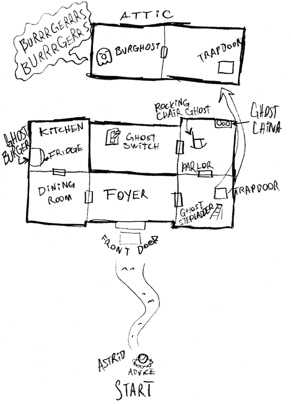

### 规划事件和控制游戏进程

拿着我的地图和对*鬼魂汉堡*豪宅的基本构想，我列出了我希望在游戏中发生的主要事件。这个列表大致是按照事件发生的顺序排列的：

+   •在门垫下找到一把钥匙，使用它进入豪宅

+   •发现通往阁楼的隐藏门

+   •打开鬼魂开关，让鬼魂出现

+   •使用鬼魂梯子到达阁楼的隐藏门

+   •在阁楼遇见汉堡鬼

+   •在冰箱里找到鬼魂汉堡

+   •为汉堡找一个鬼魂餐具盘

+   •把鬼魂汉堡喂给汉堡鬼

*鬼魂汉堡*对于这些事件发生的顺序并不是特别严格。例如，玩家可以在遇到汉堡鬼之前就找到汉堡，或者在找到放汉堡的盘子之前找到盘子。列出事件的目的是为了大致了解游戏的流程。

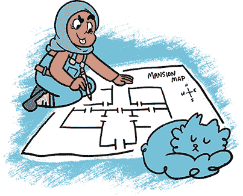

为了让你的游戏更具挑战性和趣味性，你可以要求玩家按照特定的顺序进行操作。例如，我可以确保玩家在幽灵梯子出现之前先看到通往阁楼的陷阱门。当玩家看到陷阱门却找不到上去的办法时，他们就必须继续探索，找出如何上去。之后，当他们翻开幽灵开关时，幽灵梯子会出现，告诉玩家如何进入游戏的另一个维度。

为了确保玩家在看到幽灵开关之前能够看到陷阱门，我让玩家无法绕过图书馆直接到达幽灵开关，因为陷阱门就在图书馆里。正如你在第 37 页的地图上看到的那样，玩家*必须*通过图书馆才能到达维修室并打开开关。这是双向的：当玩家翻开开关后，他们*必须*再次经过图书馆，届时他们将看到幽灵梯子。

翻开开关后，玩家还会发现许多新的物品可以探索。例如，玩家可以在翻开幽灵开关之前检查冰箱和餐具柜，但他们直到幽灵开关打开后才会看到汉堡和盘子。这种技巧增强了游戏体验，因为玩家必须四处查看，感知正在发生的变化，并预见游戏环境的变化。

我还决定让游戏中两个最重要的时刻——找到幽灵汉堡和找到放它的盘子——发生在庄园的两个对立位置。这样，玩家必须探索整个庄园才能完成游戏。

**注意**

不是所有的 Twine 游戏都像*幽灵汉堡*那样组织结构。有些 Twine 故事只是单向推进。但即便是在这些故事中，最好考虑玩家发现事物的顺序，他们学到了什么，什么时候学到，以及游戏中重要时刻彼此之间的位置，这样你可以合理分布游戏的各个部分。

### 使用钩子添加文本效果

*幽灵汉堡*中的房间会在每次访问时发生变化，但仅限于玩家翻开开关之后。玩家翻开幽灵开关后，幽灵（比如健谈的绅士幽灵阿奇博尔德·普兰西博尔德，或者幽灵梯子、幽灵汉堡）会出现在之前没有幽灵的地方！而且文本看起来也变得幽灵般飘渺！

如何创造诡异的幽灵文本效果？如何让故事中的某一段文字每次玩家返回时看起来都不一样？如何根据玩家已经做过的事情或看到的内容来改变段落？

所有这些问题的答案就是使用钩子。在本章中，我有时会将写钩子称作“脚本”或“代码”。这些只是给予计算机的指令的不同名称。

对于我们的第一个钩子，让我们为游戏添加*诡异的*文本效果吧！

#### 幽灵文本风格

在玩*Ghost Burgers*时，你有没有注意到那些鬼影物品的名称看起来像鬼影一样模糊，比如这里显示的模糊单词*stepladder*？

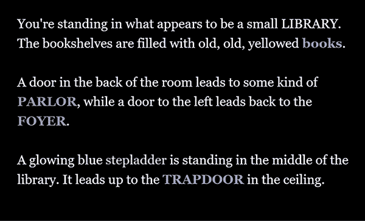

使单词模糊可以让文字更加突出，这有助于玩家注意到，在他们第一次穿越这个房间时，梯子并不在那里：他们本应记得那是一个模糊的梯子！模糊的文字标识了每个房间中发生的变化。

要创建这些效果，你可以使用 Twine 内建的 hooks。要查看它们如何工作，请在 Twine 中打开一个新章节，并在编辑器中输入以下内容：

```
A glowing blue (text-style: "blur")[stepladder] is standing
in the middle of the library.
```

测试播放这段文字，你应该会看到单词*stepladder*模糊不清。

在这个例子中，括号内的文本`(text-style: "blur")`是*hook*，它是一个标签，可以告诉 Twine 如何样式化章节。方括号`[stepladder]`中的文本是被标记的单词。这里，`text-style`标签将方括号中的文字样式从默认的样式更改为`"blur"`样式。你可以使用`text-style`标签应用多种样式：例如，你可以使用`(text-style: "upside-down")`创建倒置文本，或者使用`(text-style: "shadow")`为文字添加阴影。只要将文字括在方括号内，你可以对任意数量的文字应用样式更改。（完整的文本效果列表可以在 Twine 2 参考网站上找到：[*http://twine2.neocities.org/*](http://twine2.neocities.org/)）

#### 使用`either`显示随机文本

除了使用 hooks 应用不同的文本效果外，你还可以利用它们在玩家重新访问章节时显示不同的文本。例如，在*Ghost Burgers*中，如果玩家多次查看图书馆中的同一本书，他们每次看到的都会是不同的书。

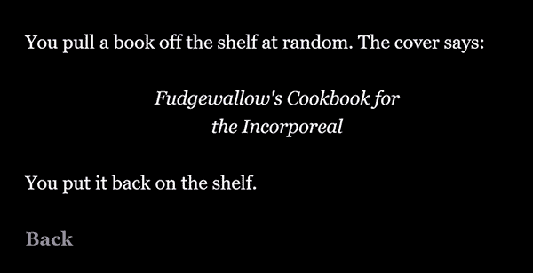

显示随机书籍会创造出图书馆中满是书籍的印象。几乎每次玩家从书架上拿下书本时，他们都会看到不同的书名。实际上，只有 10 个书名选项，但这已经足够让人觉得这个图书馆里有那么多书，玩家永远也看不完。

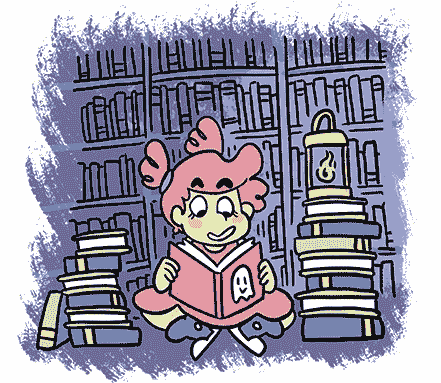

你可以使用 Twine 的`either`标签从选项列表中随机选择。例如，在 Twine 中打开一个章节，并输入以下内容：

```
(either: "red","blue","green")
```

现在再测试播放这段文字几次。每次播放时，这段文字应该会显示*red*、*blue*或*green*。

每个选项可以根据你的需要长短不一，但必须用引号括起来，并且选项之间用逗号分隔。

这是我们在*Library*章节中使用`either`的方式：

```
You pull a book off the shelf at random. The cover says:
=><=
*(either: "Rotwither's Potions for Beginners", "Dead but
Not Silent: Know Your Rights", "Beyond Lydia Deetz: Can the
Living and the Dead Coexist?", "1001 New Uses for Ectoplasm",
"No More White Sheets: Fashion for the Post-Living", "This
Really Old House: Secret Passages for Cheap", "A Specter
Haunting Europe: A Travel Guide for Spirits", "Nightfallow's
Abridged Magical Grimoire", "Haunted: Learning to Let Go of
Your Past", "On Poltergeisting", "Fudgewallow's Cookbook for
the Incorporeal")*
<==
You put it back on the shelf.
[[Back->Library]]
```

符号`=><=`将书名居中，而`<==`会将文字之后移回左边。要使用这些方向符号格式化文本，请将它们输入 Twine，然后在接下来的行中插入你想调整的文字。要将文字向右移，使用`==>`。

书名选项列表两端的星号(`*`)会将文本斜体化，正如你在第二章中学到的。当你测试运行这段文字时，你应该会看到类似的效果。

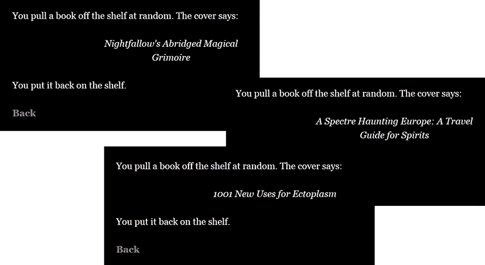

接下来，让我们探索如何在其他钩子内部放置钩子。

#### 嵌套钩子

你可以通过将一个钩子放入另一个钩子中来结合不同钩子的效果，这被称为*嵌套*。输入以下内容来查看嵌套是如何工作的：

```
(text-style: (either:"italic","shadow","blur","upside-down",
"rumble"))[What am I?]
```

在这里，"What am I?"这些词会随机出现，可能是斜体、带阴影、模糊、倒置或震动（上下摇晃）。每个钩子以显示其功能的文本开头（如`text-style`、`either`），后面跟着一个冒号，然后是“我怎么做”的部分。`text-style`标签的“我怎么做”部分就是`either`钩子。我们告诉 Twine 以斜体、带阴影、模糊、倒置或震动的风格打印这段文字。试试看！只要确保每个钩子都有自己的开括号和闭括号！

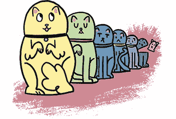

可以把嵌套钩子想象成套娃。打开“text-style”套娃，你会发现“either”套娃整齐地嵌套在里面。只要每个套娃都有一个顶部和底部——“我做什么”和“我怎么做”并使用正确的标点——你就可以根据需要将任意多个钩子嵌套在其他钩子里面。

这个嵌套标签会将玩家送到大厦的一个随机房间：

```
(display: (either:"Foyer","DiningRoom","Kitchen","Library",
"Parlor","Maintenance"))
```

`either`钩子中的每一项都是游戏中的一个段落名称。`either`钩子嵌套在`display`钩子中，这使你能够在一个段落中显示另一个段落的内容。（它比你想象的要有用！）

#### 使用`display`来避免重复输入文本

`display`钩子非常有用，因为它允许你在任何其他段落中显示任何段落。例如，假设你想在几个不同的地方显示相同的文本（比如描述一场美丽的日落）。玩家可以从房子里的任何一个房间看到日落：通过卧室的窗户或者从前门的窗户望出去。与其将日落的描述写两遍，不如写一次，将它保存为*Sunset*段落，然后使用`display`在多个房间中显示该段落。

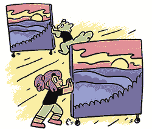

另一个例子是，当玩家在*Ghost Burgers*中与 Archibald 对话时，无论他们以何种顺序提问，都会看到相同的问题列表。在他们提问后，Archibald 会回答，然后玩家可以继续提问。我们在每次 Archibald 回答之后都会显示相同的问题列表，这样玩家可以选择下一个问题。

我们*可以*在每个段落中重新输入五个问题，但如果我们后来决定更改某个问题或添加一个新问题，我们就得五次都做同样的修改。为了避免这种情况，我们只需将问题放入它们自己的段落中，每当 Archibald 说完话时，使用`display`显示该段落，如下所示：

```
(display: "Archibald-Questions")
```

现在，显示的段落内容应该出现在你放置`display`钩子的地方。*阿奇博尔德-提问*段落的文本如下所示：

```
//You say://
[["What are you reading?"->Archibald-Reading]]
[["What's it like being dead?"->Archibald-Dead]]
[["How did you die?"->Archibald-How]]
[["Are there any other ghosts here?"->Archibald-Others]]
[["Goodbye for now."->Archibald-Bye]]
```

我们将这些问题写在了一个名为*阿奇博尔德-提问*的独立段落中。然后我们通过钩子将该段落的文本显示在另一个段落中。

以下是玩家询问阿奇博尔德他是怎么死的后，编辑器中段落的样子：

```
"I lost a staring contest against my rival," he says
seriously. "It was a very intense staring contest."
(display: "Archibald-Questions")
```

这就是玩家看到的内容。

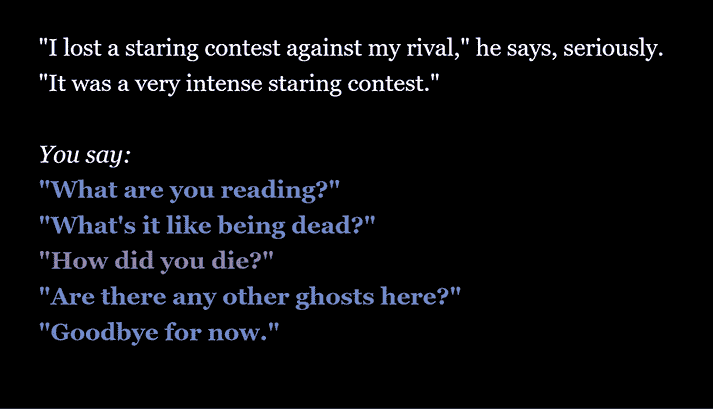

`display`钩子让你可以在多个地方重用段落，从而避免大量重复输入。

### 使用变量存储信息

在*鬼汉堡*中，玩家第二次访问某些房间时，这些房间的外观会有所不同。一个原因是我使用`display`来跳过玩家第二次访问某个房间时的一些信息。例如，玩家第一次爬上鬼梯时，他们会看到*爬梯子*段落以及一条关于梯子是如何变成鬼魂的奇怪信息。但下次他们使用梯子时，我只用`display`显示*阁楼*段落，这样玩家就能直接跳到阁楼。

玩家是否看到*爬梯子*段落取决于玩家是否已经爬上了梯子。要判断玩家是否已经使用了梯子，你可以使用一个*变量*来存储游戏进度信息。变量是*可变*的，这意味着它们存储的信息可以发生变化。

*鬼汉堡*使用了 12 个不同的变量。一个变量用于追踪大门是否锁着。其他变量追踪阿奇博尔德是否已经自我介绍给玩家，玩家是否携带鬼汉堡，玩家是否已经清理了阁楼上的蜘蛛网，手电筒是否开着，等等。

让我们来看一下手电筒变量。玩家第一次进入庄园时，他们会看到几句关于打开手电筒的说明。

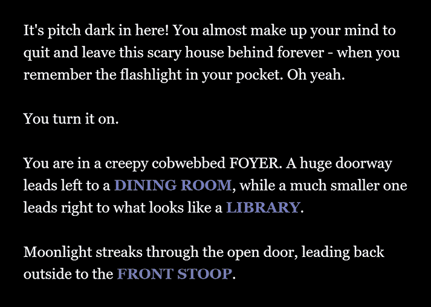

但显然他们不应该每次走过前厅时都看到这条信息，因为一旦玩家进入了庄园，我们可以假设他们的手电筒仍然是开着的。这就是为什么我使用变量`$flashlight_on`来帮助 Twine 记住玩家的手电筒是开着的。在 Twine 中，变量名总是以美元符号（`$`）开头，但你可以自由地添加任意多个变量。

#### 布尔变量

变量有几种不同的类型。例如，`$flashlight_on`是一个*布尔*类型的变量。（它以数学家乔治·布尔的名字命名。）布尔变量的值可以是`true`或`false`，就像手电筒开关的状态一样。如果`$flashlight_on`是`true`，则手电筒是开着的。如果`$flashlight_on`是`false`，则手电筒是关着的。

在你创建一个布尔变量后，你可以使用 Twine 钩子来检查变量并根据变量的值或条件显示不同的文本。例如，当玩家进入前厅并打开手电筒时，他们不应该再看到关于再次打开手电筒的消息。因此，我编写了一个钩子，根据手电筒的状态（是否打开）显示不同的消息。这就是所谓的*条件*语句，因为不同的条件决定了显示哪条消息。

条件语句使用两个主要钩子：`set`和`if`。你使用`set`来将变量设置为某个值。例如，要打开手电筒，你将`$flashlight_on`变量设置为`true`：

```
(set: $flashlight_on to true)
```

然后你可以使用`if`来检查变量的值。

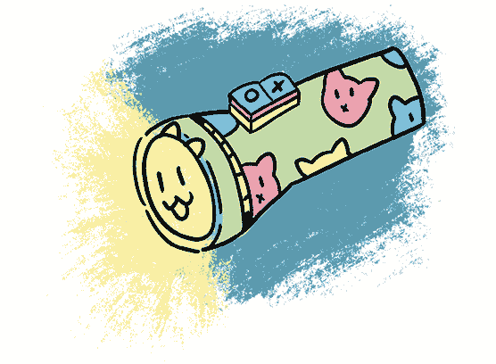

#### 使用 if 检查变量的值

在*幽灵汉堡*中，我们使用变量来跟踪大门是否锁上（`true`表示是，`false`表示否），玩家是否携带汉堡（`true`表示有汉堡，`false`表示没有汉堡），或者玩家是否打开了手电筒。

##### 检查手电筒是否打开

要检查手电筒是否打开，你可以使用`if`来检查`$flashlight_on`变量是否为`true`或`false`：

```
(if: $flashlight_on is true)
```

以下是*前厅*章节的完整代码。它使用`set`和`if`来跟踪手电筒是否打开。

```
(if: $flashlight_on is false)[It's pitch dark in here! You
almost make up your mind to quit and leave this scary house
behind forever - when you remember the flashlight in your
pocket. Oh yeah.
You turn it on. (set: $flashlight_on to true)
]You are in a creepy cobwebbed FOYER. A huge doorway leads
left to a [[DINING ROOM->Dining-Room]], while a much smaller
one leads right to what looks like a [[LIBRARY->Library]].
Moonlight streaks through the open door, leading back outside
to the [[FRONT STOOP->Doorstep]].
```

首先，我们使用布尔值来检查手电筒是否关闭，使用`(if: $flashlight_on is false)`。如果它是`false`，`if`标签会显示方括号内的内容——玩家打开手电筒的部分。

然后我们使用条件`set`将`$flashlight_on`变量从`false`改为`true`，使用`(set: $flashlight_on to true)`，这会跟踪是否显示了该消息。因此，下次玩家进入房间时，消息将不会再显示，因为`(if: $flashlight_on is false)`将不再为真。

##### 根据手电筒状态触发不同的消息

但是假设你想在手电筒打开时显示一条消息，而在关闭时显示另一条消息。为此，你可以使用`else`：

```
(if: $flashlight_on is true)Thank goodness your flashlight is
on![It's pitch dark! If only your flashlight was on!]
```

要使用`else`，只需在`if`语句的末尾添加`(else:)`和方括号内的文本。如果`if`语句不为`true`，则会显示`else`语句中的文本。

请注意，两个钩子位于同一行，因为 Twine 会检测*空白*——段落之间的空格。事实上，有时你可能会在钩子中间按下回车，意外地引入空白。为了避免无意中添加空白，一个解决方案是使用大括号`{}`来告诉 Twine 将大括号中的所有内容显示在一行上，例如：

```
{
(if: $flashlight_on is false)[It's pitch dark in here!]
(else:)[It would be pitch dark without your flashlight on!]
}
```

现在，所有在`{`和`}`之间的内容会像在一行中一样显示在你的故事里，尽管它可能跨越了好几行代码。这种语法在你编写大量钩子时特别有用，因为你可以使用空格来让钩子更容易阅读，而不会将空格显示给玩家。

##### 条件性地让幽灵出现

在*幽灵汉堡*中，我们使用`if`和`else`来决定幽灵是否应该出现，如下所示的图书馆代码：

```
You're standing in what appears to be a small LIBRARY.
The bookshelves are filled with old, old, yellowed
[[books->Read-Book]].
A door in the back of the room leads to some kind of
[[PARLOR->Parlor]], and a door to the left leads back to the
[[FOYER->Foyer]].
(if: $ghosts_visible is false)It seems like there's a
trapdoor in the ceiling, too! But it's way too high to
reach.[A glowing blue (text-style: "blur")[stepladder] 
is standing in the middle of the library. It leads up to the
[[TRAPDOOR->Climb-Ladder]] in the ceiling.]
```

如果幽灵不可见`(if: $ghosts_visible is false)`，玩家只会看到陷阱门。如果幽灵可见，我们使用`(else:)`来显示通向陷阱门的幽灵梯子，玩家可以爬上去。

**注意**

链接也可以是钩子的一部分。只要确保在链接的两边使用两个方括号，或者在钩子的两边使用一个方括号。

现在你知道如何根据特定条件显示项目了。

#### 整数变量

要跟踪两个以上的项目或事件，你可以使用整数变量。*整数*是一个不是分数的整数，如 1、10、33、5000 或 0。

例如，在*幽灵汉堡*中，如果玩家不知道接下来该做什么或无法解决某个问题，他们可以与朋友 Astrid 交谈，Astrid 会给他们一个提示。下图展示了一个示例。

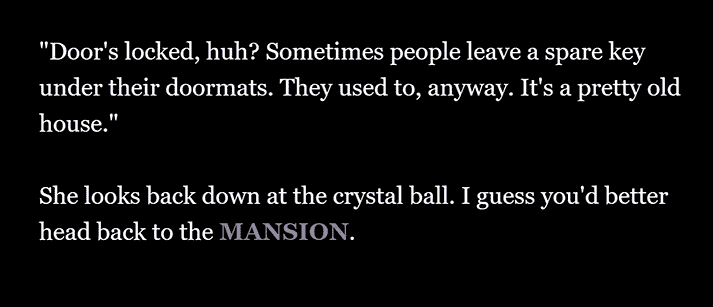

如果玩家在寻找汉堡时与 Astrid 交谈，她会给他们一个建议。如果玩家已经有了汉堡，但还没有喂给汉堡幽灵，她会给他们另一个建议。实际上，游戏中有八个不同的建议。Astrid 还有一些特殊的说法，当玩家第一次开启幽灵开关后与她交谈时，她会说这些话。

我们使用一个整数变量来跟踪 Astrid 应该给玩家什么建议。变量中的每个数字对应不同的建议。以下是这段代码的示例：

```
{
(if: $advice is 0)["Oh, go on, it's not *that* scary. Just
try the door."]
(if: $advice is 1)["Door's locked, huh? Sometimes people
leave a spare key under their doormats. They used to, anyway.
It's a pretty old house."]
(if: $advice is 2)["Try looking around the mansion! There's
*got* to be something ghostly in there!"]
(if: $advice is 3)["Wait, you found a cool glowing switch and
you *didn't try switching it on?* What's the worst that could
happen?"]
(if: $advice is 4)["Did you try looking around the attic?
Attics in creepy old houses are *always* haunted."]
}
```

整数变量`$advice`初始值为 0。当玩家发现门被锁住时，游戏将`$advice`设置为 1。当玩家解锁门时，游戏将`$advice`设置为 2。如果玩家找到幽灵开关但没有开启，`$advice`将设置为 3。当玩家翻转开关时，`$advice`将设置为 4。每当玩家与 Astrid 交谈时，游戏会检查`$advice`变量的所有可能值，并显示与当前`$advice`值匹配的消息。

你可以在游戏的第一个章节中设置变量的初始值；但要确保玩家无法返回这个章节，否则游戏会重置所有变量到初始位置！我通常会在游戏的开始章节中设置好所有变量。可以把它想象成电影中的片头画面：一旦玩家点击**开始**，他们就再也不会回到这个章节了。

```
(set: $advice to 0)
```

通过在我的起始段落中添加这一行代码，我确保玩家开始游戏时，`$advice` 变量被设置为 `0`。

*Ghost Burgers* 总共有 12 个变量。以下是*Ghost Burgers*中第一个段落的完整代码。我在所有变量周围加上了大括号，因为否则 Twine 会为每个变量打印一个完整的空行：

```
=><=

{

    (set: $advice to 0)

    (set: $door_locked to true)

    (set: $found_key to false)

    (set: $flashlight_on to false)

    (set: $ghosts_visible to false)

    (set: $climbed_ladder to false)

    (set: $ghost_lecture to false)

    (set: $archibald_intro to false)

    (set: $checked_fridge to false)

    (set: $got_china to false)

    (set: $got_burger to false)

    (set: $cleared_cobwebs to false)

}

[[START->Astrid-1]]
```

当玩家开始游戏时，门应该是锁着的，梯子应该是没有爬过的，神秘的汉堡也还没有被收集。由于玩家在游戏开始时什么也没做，大多数变量都默认为*false*。当玩家点击**START**时，所有变量都应该被重置，玩家应该能够开始新游戏！

### 编辑你故事的样式表

你故事外观的微小变化可能会对玩家在游戏中的感受产生巨大影响。*Ghost Burgers* 是否因为黑色背景（代表夜晚）而比*Interview with a Cat!* 更加神秘？故事中的模糊文字是否比周围的清晰文字更具鬼魅感？尝试改变你故事的外观，看看它的新风格是否改变了你的视角。你的故事可以有你想要的任何风格。

大多数网站使用*Cascading Style Sheets (CSS)*来确定网站的外观。Twine 也使用 CSS，并且可以很容易地通过 CSS 更改 Twine 的样式表。在 Twine 中，*样式表*描述了网页上元素的显示方式。Twine 自带了一个样式表，描述了 Twine 游戏的外观，但你可以修改它，让文字变成蓝色，背景变成粉色。

要找到你故事的样式表，请点击你故事的名称（在蓝色故事网格下方），然后点击**编辑故事样式表**，如下所示。

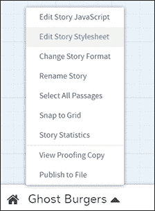

*Ghost Burgers* 的样式表是这样的。

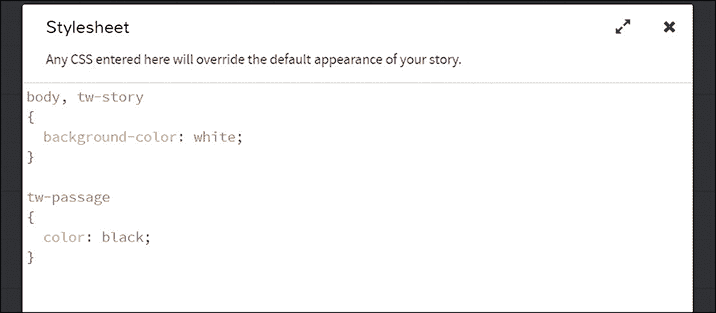

这里是你更改故事外观的地方。如果你不做任何更改，Twine 就会使用现有的样式表。让我们看看如何做一些更改。

#### 更改背景颜色

当你创建一个新的 Twine 游戏时，它的样式表是空白的。我喜欢的第一个更改是修改背景颜色。将以下代码添加到你 Twine 游戏的样式表中：

```
body, tw-story
{
  background-color: black;
}
```

这段代码将页面的背景颜色设置为黑色。`body`指的是网页本身，`tw-story`是“Twine 故事”的缩写，影响你的故事外观。大括号 `{ }` 之间的内容描述了你的 Twine 游戏的`body`。

当你将此代码复制到故事的样式表中时，请确保准确地输入所有内容。CSS 需要使用这种特定格式，否则无法正常工作。Twine 故事的默认背景是黑色，但你可以将其更改为任何你想要的颜色：`blue`、`green`、`purple`、`hotpink` 或 `indigo`。（你可以在[*http://html-color-names.com/color-chart.php/*](http://html-color-names.com/color-chart.php/)找到更详细的 HTML 颜色名称列表。）测试并播放你的故事，查看新的背景颜色。

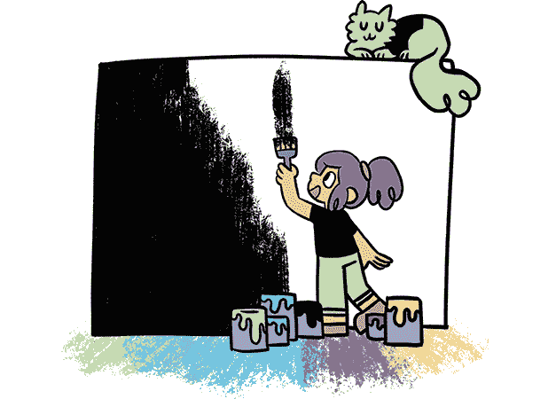

#### 美化你的文本

接下来，我使用以下代码将 *Ghost Burgers* 样式表中的段落颜色更改为白色：

```
tw-passage
{
      color: white;
}
```

代码`tw-passage`是“Twine 段落”的简写，包含有关你的故事段落外观的信息。

你不仅可以更改颜色。例如，你可以通过添加如下代码来更改字体家族和大小：

```
tw-passage
{
      font-family: Courier New;
      font-size: 40px;
      color: hotpink;
}
```

这段代码将字体更改为 Courier New，字体大小设为 40，并将所有段落中的文本颜色更改为热粉色，效果如下所示。

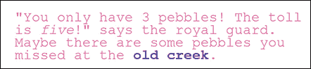

#### 添加华丽的修饰

你还可以更改文本显示区域的宽度，这就像是一个包含你故事文字的隐形框，并添加一个华丽的边框。尝试将以下内容添加到 `tw-passage`：

```
  width: 500px;
  border: dashed blue;
```

你的显示应显示一个宽度为 500 像素的虚线蓝色边框。

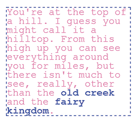

**注意**

*像素*是构成你计算机屏幕上图像的微小点。*pixel* 这个词来自于“图像元素”，缩写为 px（例如，500px 表示 500 像素）。

你也可以更改游戏中链接的颜色。例如，如果你想将链接颜色更改为深红色，你可以输入以下代码：

```
tw-link
{
    color: crimson;
}
```

要了解更多关于可以在样式表中更改的内容，请查看 Twine **帮助**页面。（点击 Twine 故事页面上的**帮助**，然后点击**更改字体、颜色或外观**。）

### 打开《Ghost Burgers》的源文件

如果你不确定我如何创建游戏中的某些功能，你可以查看游戏的*源代码*。为此，打开浏览器中的*Ghost Burgers*，访问 [*https://nostarch.com/twinegames/*](https://nostarch.com/twinegames/)，右击网页背景（如果使用 Mac，则按住 Control 键点击），然后点击**另存为**。确保右击的是实际页面，然后将其保存到你的计算机中。接着，在你的 Twine 故事页面 [*http://twinery.org/2/#!/stories/*](http://twinery.org/2/#!/stories/) 上点击**从文件导入**，以便在 Twine 中打开你保存的 *Ghost Burgers.html* 文件。

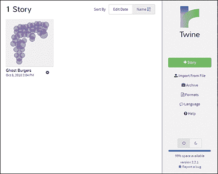

现在你可以查看*Ghost Burgers*的内部结构，如下所示。

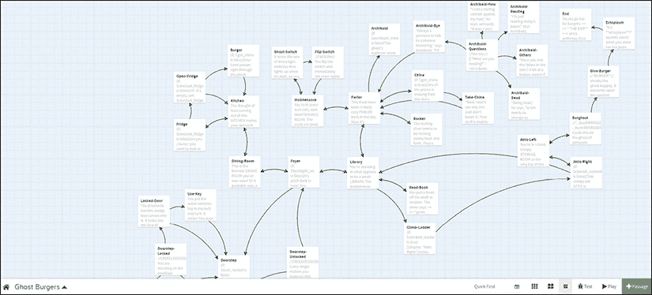

双击这些段落，看看我是如何使它们起作用的，以及我使用了哪些钩子。你可以对本书中的任何示例游戏进行同样的操作。事实上，你几乎可以对大多数 Twine 游戏这么做。只要记住，虽然查看别人 Twine 游戏的内部实现是完全可以的，但未经允许抄袭别人的作品可不行！在查看别人创作时，要保持尊重！

当你深入研究*Ghost Burgers*的代码时，你会发现一些我没有解释的技巧，比如我是如何制作阁楼里的蛛网的。我是通过`Click-replace`钩子和命名钩子制作的。*命名钩子*就是你给特定钩子指定的一个名称，以便*另一个*钩子能对其进行操作。例如，点击页面底部的链接可以改变页面顶部附近的某段文本。查看*阁楼*段落，看看你能不能弄明白它们是如何工作的。（你可以在* [`twine2.neocities.org/`](http://twine2.neocities.org/) *查找到关于命名钩子和所有其他 Twine 钩子的详细信息。）

不要害怕在自己的故事中尝试使用钩子！

### 你学到的内容

现在你知道如何制作更复杂的 Twine 游戏了。你可以跟踪玩家阅读过的内容，从而改变玩家看到的内容，你也知道如何改变故事的外观。你现在是程序员了——恭喜！从现在开始，你的 Twine 游戏可以简单也可以复杂，完全取决于你！

在第四章中，我们将学习更多高级技巧。如果你觉得信息有些复杂，超出了你能接受的范围，可以随时跳到第五章的游戏挑战部分！编程不是每个人的强项，这也没关系！
