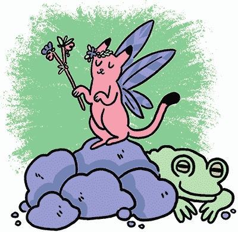
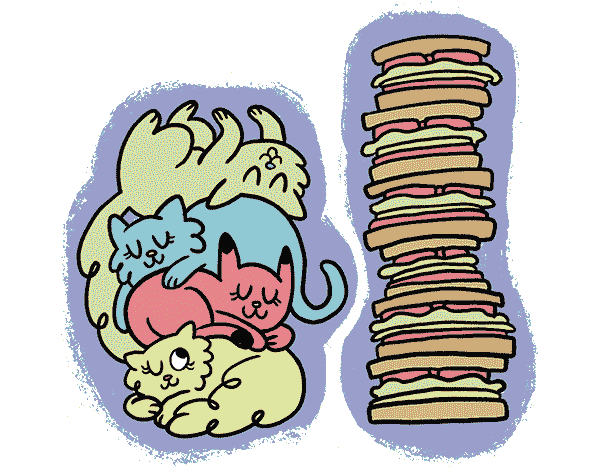
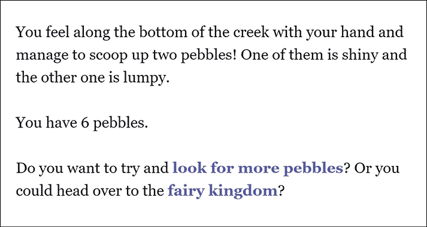
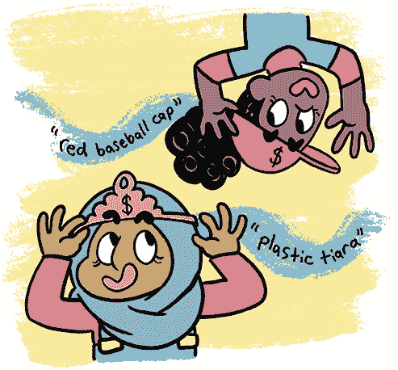
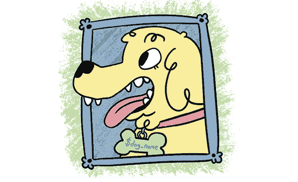
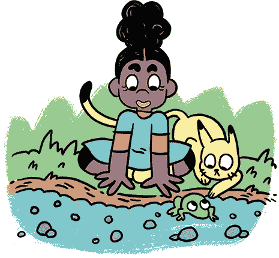

## **4

卵石经济学：使用变量来计数物品**

在上一章中，你使用了一些基本的 Twine 技巧来添加文本效果，从书名列表中随机选择一个并展示，以及链接到一个传送门菜单。你学习了布尔变量，它们有两种不同的值，并且你使用了条件语句在游戏中做决策。你还学习了如何使用整数变量将不同的事件分配给特定的条件。在这一章中，你将基于所学内容，创建更复杂的脚本，并发现变量真正的能力！

这一章内容比较简短。如果感觉有点难以理解，不要害怕跳过它。或许等你在 Twine 编程中积累更多经验后，再回来尝试一些更高级的内容！

### 计算仙女卵石

与普通数字类似，你可以使用*整数*变量来进行加法、减法，并检查它们的值是多高或多低。你也可以使用整数变量来计算玩家抚摸过的猫的数量，或者记住玩家为野餐制作了多少三明治。让我们来看看如何使用名为*《卵石经济学》*的游戏来追踪玩家携带的卵石数量。



*《卵石经济学》*包含了一个关于如何在 Twine 中使用整数变量的例子。在这个小游戏中，玩家需要找到足够的卵石来支付仙女的通行费：进入仙女王国需要五颗卵石。你可以在 *[`nostarch.com/twinegames/`](https://nostarch.com/twinegames/)* 上查看这个游戏。



我们将使用变量`$pebbles`来追踪玩家找到的卵石数量。

每次玩家在旧溪流处寻找卵石时，他们会找到一颗、两颗、三颗，或者零颗卵石（如果他们找到了一只奇怪的青蛙），这些卵石会被加入到他们的总数中。我们使用`display`和`either`来随机选择玩家看到的段落，从而决定他们找到多少颗卵石。正如你在第三章中学到的，你可以使用`either`来选择一个随机段落，使用`display`来显示该段落的内容。每个段落都会给玩家不同数量的卵石。

例如，我们可以使用以下代码，将玩家在某一段落中找到的两颗卵石添加到他们的卵石总数中：

```
(set: $pebbles to $pebbles + 2)
```

这行代码告诉 Twine 将`$pebbles`设置为当前的`$pebbles`值加 2。因此，如果`$pebbles`的值是 2，这行代码将把值增加到 4。

要显示变量的值，只需在句子中输入变量名，以向玩家展示他们有多少颗卵石：

```
You have $pebbles pebbles.
```

这行代码会显示出`$pebbles`变量中存储的总数。玩家应该看到“你有 4 颗卵石”，“你有 10 颗卵石”，或者“你有 500 颗卵石”，具体取决于玩家到那时为止找到的卵石数量。

#### 使用`elseif`来检查整数值

对于布尔值，使用`if`和`else`是有意义的，因为它们要么为真，要么为假，要么开启，要么关闭。如果它们不是一个值，那肯定是另一个值。但整数可以有多种可能性。例如，你可能有足够的卵石来支付过路费，或者根本没有卵石！也可能你有*一些*卵石，但不足够！这就需要检查三种不同的条件，所以单独使用`if`和`else`是不够的！

幸运的是，我们可以使用`elseif`来跟踪第三个值：

```
{
(if: $pebbles >= 5)[You have enough pebbles!]
(elseif: $pebbles is 0)[You don't have ANY pebbles!]
(else:)[You only have $pebbles pebbles!]
}
```

`elseif`语句像常规的`if`语句一样工作，只不过它增加了一个额外的条件！在这个例子中，Twine 首先使用钩子`(if: $pebbles >= 5)`检查`$pebbles`是否大于或等于 5。

如果`$pebbles`大于或等于 5，Twine 会显示“You have enough pebbles!”（你有足够的卵石！），然后结束。如果不是，Twine 会尝试`elseif`钩子`(elseif: $pebbles is 0)`，检查`$pebbles`是否等于 0。如果是，Twine 会显示“You don’t have ANY pebbles!”（你没有任何卵石！），告诉玩家他们需要更多卵石。

如果两个条件都不为真，那么 Twine 会继续执行`else`语句。`else`部分涵盖了除了`if`和`elseif`所涵盖的所有情况，这意味着玩家拥有 1、2、3 或 4 个卵石的情况。我们告诉 Twine 显示`[You only have $pebbles pebbles!]`，其中`$pebbles`表示玩家拥有的卵石数量。

#### 事情的顺序很重要！

记住，写代码的顺序非常重要。当 Twine 决定执行哪些代码，并按什么顺序执行时，它是从上到下读取的，就像你读书页一样。当你为游戏编写代码时，确保它按照最合适的顺序写，以便在 Twine 中最容易理解。例如，我们把`else`语句写在最后，因为我们希望 Twine 在检查前两个条件后才执行这部分代码。

那如果你想要一个额外的条件呢？如果玩家*非常*接近拥有足够的卵石支付过路费，或许你希望添加一个鼓励性的消息。我们可以通过添加另一个`elseif`语句来更新现有代码，如下所示：

```
{
(if: $pebbles >= 5)[You have enough pebbles!]
(elseif: $pebbles >= 3)[You have $pebbles pebbles! Almost
there!]
(elseif: $pebbles is 0)[You don't have ANY pebbles!]
(else:)[You only have $pebbles pebbles!]
}
```

现在，当玩家拥有 3 个或更多卵石时，会显示不同的消息。注意，我们把`elseif`语句放在第二个位置。这是因为如果我们把这个`elseif`语句放在`if`语句之前，那么即使玩家有 6 个卵石，他们也会看到“Almost there!”（快到了！）的消息，因为 6 也*大于或等于*3。但这样不合逻辑，因为玩家已经有足够的卵石支付过路费了！只有在玩家*没有*至少 5 个卵石时，我们才希望 Twine 检查他们是否有 3 个或更多卵石。

Twine 总是从检查`if`条件开始。然后，它会按从上到下的顺序检查每一个`elseif`语句。你可以写任意数量的`elseif`语句。只要 Twine 找到一个为真的条件，它就会停在那里并执行你在那个条件下指示的操作。如果没有任何`elseif`语句为真，*只有那时*它才会检查`else`。`else`语句是 Twine 的最后手段。

每当你写的代码没有按预期工作时，逐行阅读你的代码，检查条件是否按正确的顺序排列。也许 Twine 在检查你预期的条件之前就停止了，因为早前的某个条件也为真。有时，简单地调整 Twine 查找条件的顺序就能解决问题。

#### 字符串变量

*字符串*是一种包含文本的变量：一个词、短语或句子。你的 Twine 游戏大多是文字内容，但有时你需要跟踪一个*特定*的文本。例如，你可以使用字符串变量来记录玩家今天早上出门前是否戴上了“红色棒球帽”或“塑料王冠”。



要查看字符串变量的实际应用，请输入以下内容：

```
{
(set: $hat to "plastic baseball tiara")
The wind is so strong that your $hat is blown right off your
head!
}
```

尝试点击播放！Twine 应该会打印出“风太大，把你的塑料棒球王冠吹得从你头上飞了！”试着改变帽子的描述，游戏应该会根据你输入的内容进行变化！

重要的是要确保字符串两边有引号（`"`）。这就是 Twine 知道字符串开始和结束的方式。如果在引号内，那就是字符串；如果在引号外，那就是代码。

你能想到这个技巧在故事中如何派上用场吗？也许游戏从玩家的卧室开始，那里挂着几顶他们最喜欢的帽子。无论他们选择哪顶帽子，你都可以将$hat 设置为匹配所选帽子的描述。这样，当故事提到玩家的帽子时，就能提到他们具体选择的那顶！

你可以让他们挑选自己喜欢的颜色。你可以问他们是喜欢宠物猫还是宠物狗。有一段代码可以让玩家输入一些内容——你可以让他们给宠物起个名字，然后在故事中使用他们选择的名字来称呼宠物！阅读 Twine 的维基，看看你能否弄明白如何实现。

关于故事格式的说明

在本书中，我使用的是 Twine 2 的默认故事格式 Harlowe。Twine 2 还有两种其他的故事格式：Snowman 和 SugarCube。要更改游戏的故事格式，点击其名称，然后选择“更改故事格式”。但请记住，至今你学到的所有钩子都是特定于 Harlowe 的。其他故事格式也能做相同的事情，但你需要编写的代码会略有不同。

你可以在[*http://twine2.neocities.org*](http://twine2.neocities.org)/和 Twine 的帮助页面找到大量关于故事格式的信息。



### 你学到的内容

在这一较短的章节中，你了解了变量是如何工作的，以及如何更改它们所存储的内容。特别是，你了解了整数变量存储的是数字，而字符串变量存储的是单词或短语。

在接下来的最后一章，我将向你展示更多可以玩的 Twine 游戏（由其他人制作！），并为你提供一些挑战，供你在自己的游戏设计实践中尝试。


