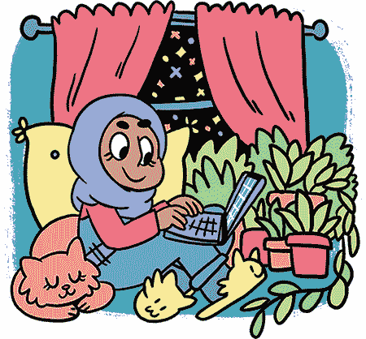
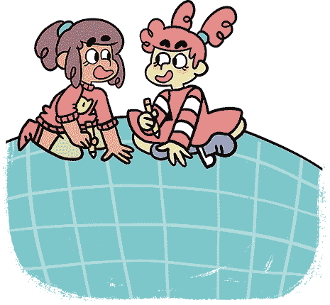
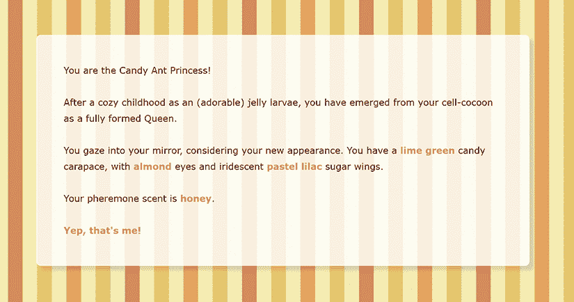
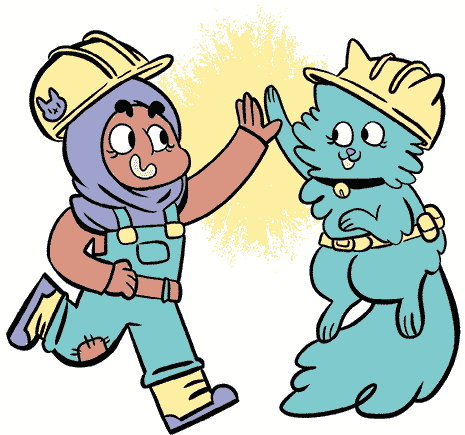
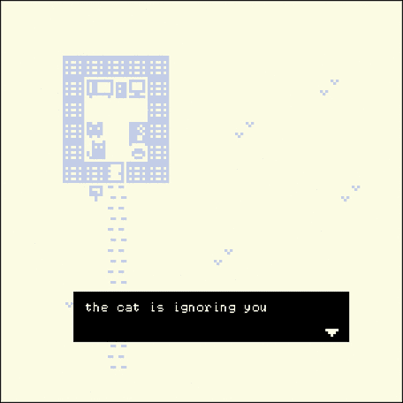

## 第六章：从这里开始**

你已经进入了最后一章！成为一名游戏设计师的感觉如何？有点奇怪？别担心——这很正常。也许你现在还不*觉得*自己是个游戏设计师。这也是正常的。

它很容易让你觉得自己不够资格称自己为某个身份。但成为游戏设计师的方式有很多种。例如，游戏设计师可以是那些在大公司工作的人，在那里每个人为一个产品做出小小的贡献。游戏设计师也可以是那些坐在卧室里，做自己觉得有趣的事情的人。

游戏设计师也是那些去公园和朋友玩接球的人，然后他们会想，“如果我们必须用腿下面传球会怎样？”或者“如果我们不能用手碰球呢？”成为一名游戏设计师有无数种方式。

### 提问

你可能还没有太多游戏设计经验，但我可以告诉你一个关于游戏设计的有趣事实：如果你做得对，它应该*永远*对你保持神秘。即便是那些已经设计了多年的游戏设计师，依然在不断问关于游戏可能是什么样的问题。“如果你每天只能移动一步会怎样？”“在抗议活动中你能玩什么样的游戏？”“为什么游戏不能让你和怪物成为朋友，而不是与它们战斗？”

游戏设计更多的是提出问题，而不是找到答案。每个人，不管技能水平和经验如何，都能提出问题。

在本章中，我将展示一些其他人制作的酷炫 Twine 游戏，并为你提供一些练习，帮助你在制作自己游戏时尝试。

### 更多 Twine 游戏推荐

你已经学会了如何从零开始制作一些 Twine 游戏并将其分享到网上。即使你觉得你的游戏不完美，你也应该为自己*做出了一些东西*而感到自豪。许多做游戏做得比你久的成年人，依然很难完成自己的游戏。

但这只是你第一次玩 Twine 游戏。你的下一款游戏会是什么样的呢？保持开放的心态，让新的想法进入。灵感可能会在你散步时、在床上盯着天花板时，甚至在你洗手间时找上你。永远不要急于否定一个白日梦，它可能是一个精彩游戏的种子！

在此期间，这里有一些你可以尝试的 Twine 游戏示例，看看 Twine 可以做到什么；或许你也会想做一款类似的 Twine 游戏。

#### 《糖果蚂蚁公主》 by Whisperbat

在*糖果蚂蚁公主*中，你将做出许多小决定，这些决定虽然不会改变游戏本身，但能让你感到你所玩的故事是属于你的。现在就去[*https://tinyurl.com/candyant*](https://tinyurl.com/candyant)试试吧。

你可以选择你的糖果蚂蚁公主的外貌，选择你的糖果宠物是什么，以及选择你的糖果蚂蚁巢穴在哪里。这些小细节帮助你决定糖果蚂蚁公主的个性，以及她如何看待自己在糖果蚂蚁社会中的位置。

#### 《消息》 作者：Jeremy Lonien 和 Dominik Johann

*《消息》* 是一款短小的游戏，在剧情发展之前成功地制造了很多悬念——嗯，我可不想剧透结局！这款游戏巧妙地利用了文本格式和图片来帮助塑造气氛。更聪明的是，它还提供了一个指向 YouTube 视频的链接，视频中是由 NASA 录制的太空声音，你可以在玩游戏时将它当作背景音乐。快去看看吧，链接在这里：[*http://ludonaut.de/the-message/*](http://ludonaut.de/the-message/)。

#### 《一个装满沙子的桶》 作者：A. C. Godliman

*《一个装满沙子的桶》* 是一款关于历史、命运和沙堡的游戏（[*http://tinyurl.com/bucketsand/*](http://tinyurl.com/bucketsand/)）。它使用大量图片展示你的沙子王国如何成长和变化。这是一个很好的例子，说明在游戏中你做出的每一个小选择，都可能将你带向不同的分支和路径。你可能需要给游戏一点时间来加载所有的图片。

有时，当你看到别人做的东西时，很容易感到泄气。你可能会对自己说：“唉，这比我做的任何东西都要好。”我知道，因为我常常也会这样想。

但是，也有另外一种方式来看待他人所做的酷炫作品。你可以说：“哇，我竟然不知道可以这样做！但现在我知道了！我下一个作品会因为这个而*更酷*！”

你越是探索他人的游戏，就越有可能想到一些以前从未想过的创意和设计，同时你也能学到更多关于如何制作游戏的知识。事实上，任何你学到的东西或体验的游戏，都能帮助你在创作自己游戏时激发新的灵感，特别是在规划阶段。

所以，不要让别人的艺术作品吓到你，让你觉得自己做不出同样酷的东西。给自己许可去学习他人的作品。你玩得越多 Twine 游戏，你就能获得更多的创意！我已经用 Twine 做游戏好多年了，仍然不断想出新点子。

### 游戏挑战

当你完成探索这些游戏后，下面是一些你可以尝试的练习。有些练习是挑战你以一种新的方式制作游戏，有些挑战你推广自己的游戏并与他人合作。每个挑战都会以一个问题开始。希望每个问题都能引导你提出更多自己的问题。

不要担心必须完成每一个挑战或按顺序完成它们。做那些最能激发你兴趣并引发你最有趣问题的挑战吧。

#### 写一个适合酷形状的故事

在之前的章节中，你学会了如何写一个 Twine 故事，并将不同的章节重新安排成一个酷炫的形状，比如闪电形状或螺旋形状。

对于这个挑战，尝试反向操作。例如，首先通过创建 passages 来构建你的 Twine 蓝图的大致形状，然后再回头填充 passages 来讲述故事。让故事的形状引导你的写作！如果 Twine 游戏的形状是心形会怎么样？或者是星形？这些 passages 会如何连接？

这种方法可能看起来有些违反直觉，但它会挑战你更有创意地写作。如果你陷入了创作的瓶颈，难以想出新点子，这样的挑战可能正是你需要的，能帮助你激发一些新的灵感。

#### 仅用图片讲述故事

对于这个挑战，如果你喜欢手绘，你需要一种方法将你的画作传到电脑上。或者，你可以直接在电脑上使用画图程序进行绘制。

现在，你能写一个完全由图片构成没有任何文字的 Twine 故事吗？（如果链接是文字，没关系。）如果你不确定从哪里开始，这里有个有趣的想法：将你已经用文字编写的游戏转换成图片。游戏设计过程有何不同或相似之处？例如，你如何通过图片为玩家提供不同的选择？

**提示**

与其逐个上传你的图片到[*https://postimage.org/*](https://postimage.org/)，这很繁琐，为什么不为你的游戏注册一个[*https://neocities.org/*](https://neocities.org/) 页面，一次性上传所有图片呢？

#### 将你的 Twine 故事做成一本小册子！

尝试制作一个纸质版本的 Twine 游戏，与你的朋友分享。例如，在游戏的实体版本中，你可能需要告诉读者翻到第 4 页或第 15 页，而不是使用链接。当有人拿着它而不是在电脑上玩时，故事会有什么不同？在纸上，你能做一些在电脑上难以做到的事情吗？

一个很酷的想法是讲一个谜语，并让读者把书翻过来才能读到答案。如果你画一本漫画书，并给每个面板编号，你可以告诉读者去某个特定的面板。你甚至可以留出空白让他们写下自己的结局！

#### 与朋友合作

尝试和朋友一起做一个游戏。与别人一起碰撞创意非常激动人心。你们可以在彼此的基础上构建想法。这样可以产生一些最强大的创意，而合作的能量也非常有趣。

有很多种方法可以在项目中进行合作。例如，你可以写游戏的前半部分，而你的朋友写后半部分。或者你写 passage 的描述，而你的搭档写链接。你可以写故事，其他人可以画插图。也许你可以让别人阅读你的故事并提供想法。

和其他人一起进行创意项目可能会很棘手，特别是当他们是你的朋友时。如果你们在项目上发生争执，这可能会影响你们的友谊。合作的感觉很棒，尤其是在你们双方都充满相同的能量和兴奋感时，但当你们的能量或时间安排不同，紧张情绪就可能会积累。有时候，你可能会看到一个人主导整个项目并做出所有决定。

*协作*就是沟通！如果有人觉得自己在决策中没有足够的参与感，或者因为觉得自己在项目上投入的时间比另一个人多而感到沮丧，那就应该进行一次沟通！提供建设性的批评而不是防御性回应：尽量具体地说明问题是什么，它让你有什么感受，什么样的变化会让情况变得更好。

协作虽然需要付出很多努力，但它能够带来一些你独自无法实现的惊人成果。

#### 制作一个日记游戏

你有没有写过日记？*写日记*就是把当天发生的事情、重要的事情、它给你带来的感受以及原因记录下来。你是否想过将你的日记做成一个游戏？例如，你会如何让发生在你身上的事情变得互动？

你可以把几乎任何事情做成日记游戏！搬到一个新城市。拥有一个妹妹。和一只猫交朋友。与众不同。赢得拼写比赛。输掉拼写比赛。摔断胳膊。或者只是看日落。游戏不一定总是关于蜘蛛奶和鬼汉堡。它们也可以是关于你的！

由于日记游戏可能非常私人化，考虑一下你愿意与他人分享什么，以及你希望保留给自己的是什么。你完全可以制作一个只为自己准备的游戏：那会是什么样子？如果你制作一个只与一个朋友分享的游戏呢？并非每个游戏都是为了每个人。

#### 用 Bitsy 制作游戏

Bitsy 是由 Adam Le Doux 制作的一个可爱小型游戏制作工具。像 Twine 一样，Bitsy 允许你写文字并将它们放入游戏中。它还允许你画出小人物、景物和动画，并用它们制作小世界。如果你想将 Twine 中做的东西加上更具*视觉效果*的维度，Bitsy 可能是一个有趣的下一步！

你可以在线找到 Bitsy 编辑器，网址是 [*http://tinyurl.com/bitsyeditor/*](http://tinyurl.com/bitsyeditor/)。如果你想看看使用 Bitsy 能做什么，可以尝试玩 KC 制作的游戏 *You Have to Go to Work*，地址是 [*http://tinyurl.com/bitsywork/*](http://tinyurl.com/bitsywork/)。

### 继续探索与创造！

我们生活的世界并不总是最美好的地方，很容易失去希望和快乐。制作艺术——无论是游戏、漫画、杂志、音乐、故事，还是窗台上的小花园——帮助我们记住我们能够创造美丽的东西。它提醒我们要为周围的环境和我们自己感到惊叹。

你年纪越大，就越没有时间玩耍和创造那些不赚钱的东西。养成创作和实践的习惯，并随着年龄增长保持住它！开始从未太迟。创作艺术会增加你对生活的享受。*真的*。

但这本书只是一个起点。现在你知道如何使用 Twine 制作游戏，就轮到你想出如何运用这些知识了。跟随你的想法，无论它们看起来多么愚蠢、奇怪或不创新，都要追随它们。继续探索。

我迫不及待想看看你会想出什么。
