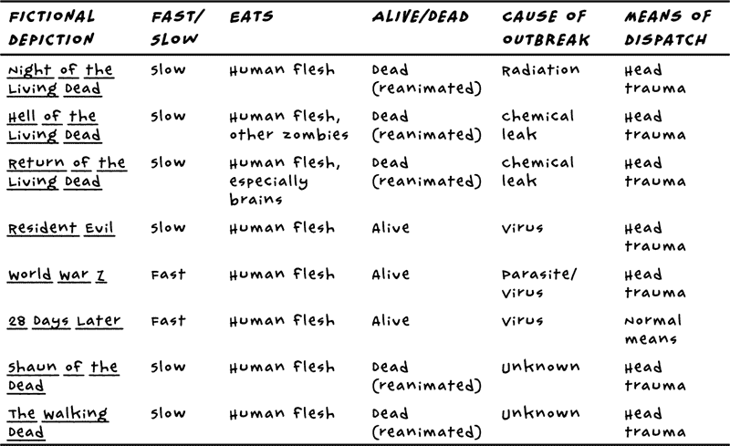
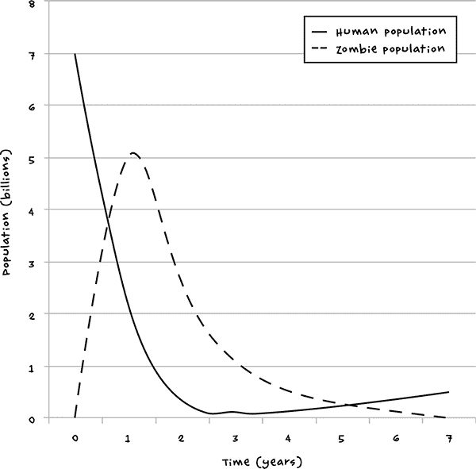
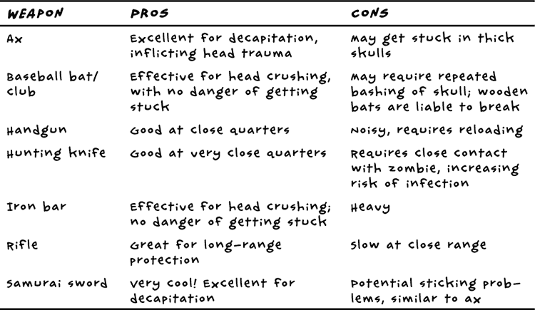
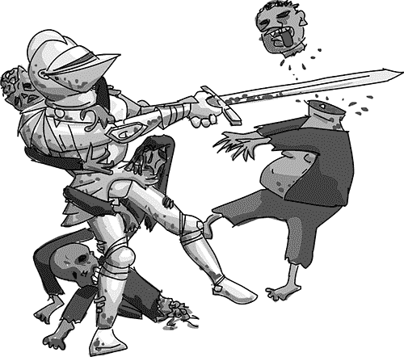
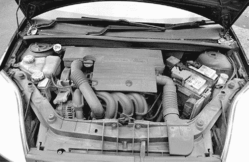
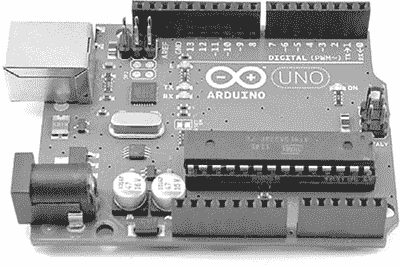
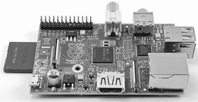

## **1**

**末日基础知识**

在你开始本书中的僵尸末日生存项目之前，我想向你展示你将要面对的究竟是哪种不死生物，并分享一些关于如何在僵尸横行的世界中生存的小贴士。

当然，你需要一些零件来制作你的项目。幸运的是，后末日世界的少数好处之一就是有大量废弃的材料可供捡拾！所以在本章中，我还包括了一份寻找你需要的零件的指南。

但首先，让我们看看僵尸的背景。

### **僵尸**

我发现人们往往会认为自己是僵尸爱好者或对僵尸漠不关心的人。既然你正在阅读本书，那很有可能你和我一样是个僵尸爱好者。

僵尸的吸引力既在于它们本身，也在于幸存者所面临的末日情境。你可能很容易击败一个单独的慢速僵尸：一根棒球棒打击其头部应该就能轻松解决。但当僵尸成群时，它们就成了一个严重的威胁。

如果你在维基百科上查找“僵尸”，你会找到两个条目：“僵尸（虚构）”以及令人担忧的“僵尸”条目。根据海地民间传说，非虚构的僵尸是通过魔法复生的尸体，被用来执行主人的命令。这些民间传说中的僵尸不可能大量出现，也无法引发流行文化中所描绘的那种末日景象。对于大多数人类已死亡或被*转化*为僵尸的情境，我们需要一些*虚构僵尸*。

#### **僵尸的类型**

虚构僵尸的根源可以追溯到 19 世纪的小说，例如玛丽·雪莱的*弗兰肯斯坦*，但它们在现代通过《活死人之夜》这类电影变得广为人知（图 1-1）。

图 1-1：来自《活死人之夜》的僵尸

在《活死人之夜》中描绘的僵尸是经典的*慢速僵尸*。慢速僵尸像是迷失了方向一样踉踉跄跄地走动，寻找人类肉体来食用。有趣的是，电影中的僵尸能够使用工具，用石头打破窗户，用沉重的棍子砸门。大多数僵尸在后来的电影和电视作品中失去了这种能力。慢速僵尸的描绘可能在热门电视剧《行尸走肉》中达到了文化的巅峰。

慢速僵尸是最常见的虚构僵尸，本书主要关注它们带来的威胁。然而，随着不同电影制作人试图在僵尸概念上加上自己的印记，其他许多类型的僵尸也应运而生。表 1-1 列出了现代僵尸描绘中的一些最重要的类型及其特点。

**表 1-1：** **虚构僵尸种类**

所有类型的僵尸都有一些共同特点，其中最重要的是对人类肉体的渴望。另一个几乎是普遍的事实是，杀死僵尸的唯一有效方法是严重的头部创伤。斩首是非常有效的。

#### **僵尸真的死了吗？**

一个重要的问题是，一个人是否必须死了才能成为僵尸。在一些电影中，比如《僵尸世界大战》，僵尸并不是死者，而是被病毒或其他寄生虫精神改变的活人。有些人会认为，这种生物严格来说根本不是僵尸。

僵尸的“死亡”术语也很复杂。如果一个僵尸已经死了，那怎么再把它杀死呢？虽然僵尸是已经死亡的人，但僵化过程是否真的让这个人复生了呢？在这种情况下，僵尸当然可以被杀死第二次。然而，我们通常将死亡定义为心脏停止跳动，而僵尸的循环系统显然不再起作用，正如它们除了头部之外对其他部位的射击有相对免疫力所示。

如果僵尸仍然是死的，那么说它们被*杀死*似乎不太对，但直到流行文化创造出一个新词汇之前，这个说法还是可以接受的。在这本书中，我将使用“*杀死僵尸*”这个词——虽然可能不完全准确，但它不含糊。

### **僵尸会存在多久？**

僵尸末日能持续多久，直到僵尸消失呢？这当然取决于新僵尸的产生速率和僵尸死亡的速率。人类和僵尸人口的曲线可以绘制在一个水平轴上，显示时间的流逝，垂直轴则显示人口数量（以十亿为单位）（图 1-2）。

图 1-2：人类/僵尸人口曲线随时间变化

随着疫情爆发，僵尸人口由于僵化作用迅速增加，而人类人口则会急剧下降。然而，由于许多人会被吃掉而不是变成僵尸，僵尸人口不会达到末日前的人类人口水平。它的上升程度将取决于被僵化与被吃掉的比例，以及僵尸和人类的死亡率。

在达到峰值后，僵尸人口将开始下降。这是因为随着人类人口的减少，幸存下来的人类将是那些最适应生存的个体。（也许他们读过这本书！）人类人口也会变得更加分散，使僵尸更难找到人类。最终，人类人口将在一个较低的水平上稳定下来。

另一方面，僵尸在长期内生存的可能性不大。从它们对人类肉体的饥饿来看，它们需要进食才能存活，尽管没有完全运作的消化系统这一点依然是个谜。无论如何，由于它们无法进行光合作用，它们的能量必须来自某个地方，而人类肉体是最可能的来源。但随着人类学会生存，僵尸群体将难以找到食物。而且，由于僵尸本质上是缓慢移动的腐烂肉体，它们是食腐动物中的外卖晚餐。如果我们将乌鸦、狐狸、野狗等动物的种群曲线也加入图表，我们可能会发现它们的种群在清理这些残局时会出现巨大的增长。因此，反击的幸存者和大量的自然捕食者将对僵尸群体产生下行压力。

看起来僵尸繁殖的可能性极低（这件事真的是不忍心多想）。因此，过一段时间后，所有的僵尸都会消失，而人类则会繁殖并开始重建文明。

所以，这是你的机会。拥有本书应该会显著提高你生存的机会，从而提高你繁衍后代的可能性！

### **末日生存 101**

除了僵尸威胁所带来的情绪紧张，许多僵尸电影中探讨的最有趣的一个主题是，人类幸存者在僵尸末日中将如何应对。

当僵尸末日来临时，你需要做好准备。本书将作为你的生存指南。

#### **首页**

你所生活的地方将决定你生存的机会。大多数郊区住宅无法承受一群决心扑食的僵尸攻击。如果你住在这样的地方，你应该尽早寻找一个新的基地。

确保你的新家容易防守。许多人认为船是最好的栖息地（僵尸真的不擅长游泳！），但如果你住在远离开阔水域的地方，这就不太实际。此外，住在船上也会带来自己的困难，包括暴风雨以及除非是风帆驱动，否则始终需要燃料。你还必须上岸补充物资，但无论你住在哪里，补给都是必需的。

船只有优势，因为它为你提供了寻找一个没有僵尸的岛屿的可能，在那里可以建立一个社区。这绝对是一个值得努力的选项。事实上，假设你能熬过最初的几天，朝海岸或大型湖泊的岸边移动，一路跳跃地前进可能是一个明智的策略。理论上，长途驾车可以将你从全国任何地方带到海岸，但很可能道路会因为人们拼命逃避传染而被废弃的汽车堵塞。所以，旅行可能会非常缓慢且危险，随时受到僵尸的威胁，甚至可能会有其他幸存者的威胁。

如果你住在冬天会很冷的地方，你可能想考虑找一个更温暖的地方。寒冷的天气意味着你需要消耗更多的热量，并找到一个不是很通风的有暖气的庇护所。唯一可能加热你住所的方式是通过燃烧木材，而这些木材你必须外出收集。另一方面，斧头是一个有效的武器，可以斩首僵尸。

如果你知道如何驾驶轻型飞机，那么这是避免僵尸和地面障碍物的一个好方法。你可能会发现目的地的跑道不清晰，许多田地会变成未经人类耕种的荒地，因此在你决定飞过不可回头的界限之前，最好先进行一些探索性飞行。

#### **水源**

生存专家 Cody Lundin 有一个叫做“三原则”的规则。可以这样概述：

• 没有空气，你可以生存 3 分钟。

• 没有庇护所，你可以生存 3 小时（在极端温度下）。

• 没有水，你可以生存 3 天。

• 没有食物，你可以生存 3 周。

空气应该不是问题，假设末日发生在一个温暖的天气时期，庇护所也不应该是问题。因此，除了避免被吃掉，你的主要优先事项应该是找到可饮用的水和其他饮料。如果供水系统的泵失去动力，公共水供应很可能会中断。因此，如果可能，找到一个有自己水井或其他淡水水源的地方。瓶装水和罐装饮料也应该很充足，因为不会有很多人将零钱投入自动售货机。

#### **食物与燃料**

农业可能需要多年才能发展到足够规模，能够养活一小群人，所以种植有机蔬菜是未来重建社会时的目标。然而，随着人们减少，仍然可以找到大量罐装食品——足够存活几乎无限的时间。从家庭和超市搜寻罐头食品和其他不易腐烂的食物。

本书的项目集中在电力上。不是任何电力，而是储存在电池中的电力。这对于照明、警报和通讯是足够的，但当涉及到取暖和烹饪时，如果没有一个强大的太阳能电池板阵列和一些重型设备，电力是不可行的。所以当你想吃热食时，燃气加热器和露营炉是更现实的选择。使用时一定要确保安全！

烧烤架是另一种烹饪食物的选择，可以愉快地燃烧木炭或木材。

#### **僵尸击杀**

处理僵尸时最好的策略是尽可能避免引起他们的注意。尽量保持安静，偷偷摸摸地探索新地方，并避免进入可能让你被困的地方，包括只有一扇门的建筑或房间，以及死胡同。

最终，你将不得不与一只僵尸战斗，所以确保你始终有武器在手。枪并不一定是最好的选择。它们会发出很大的噪音，而且需要重新装弹。此外，要用子弹击倒僵尸，你需要射击它的头部，而僵尸通常不会在你瞄准时站着不动。

一把斧头、棒球棒或剑可能更有效。在《*探索频道怪物实验室*》的“僵尸特辑”中就证明了这一点，该实验通过科学方法高度验证了你用斧头每分钟能杀死更多的僵尸，而不是用枪。各种武器的相对优劣列在表 1-2 中。

**表 1-2：** **武器优缺点**

事实上，不同的武器在不同的情况下会展现出不同的效果，最终你的僵尸杀手工具还是取决于个人选择。我偏爱常被忽视的铁棒作为我的武器选择。*半条命*的玩家一定会清楚这种武器的有效性。

无论你带了什么，打僵尸的风险都非常高。设置陷阱从远处杀死僵尸比近距离对抗它们要好得多。一个上面挂着诱饵的坑通常就足以让一个又一个僵尸掉进坑里。矿井最理想，因为任何你挖的坑都不太可能足够深，以至于僵尸爬不出来。

清理你所在区域的僵尸数量有助于减少僵尸以无法控制的数量发起攻击的可能性，而且对于可能在该区域的其他幸存者来说，这是负责任的行为。这就像是后末日世界中清理你狗的粪便一样。

当你的僵尸情况变得更加紧张时，备一些莫洛托夫鸡尾酒（自制燃烧瓶，通常用瓶子和汽油）来从安全的距离投掷给僵尸。其他投射物，如手雷，如果你能弄到手，也是有效的。

#### **穿着致命**

无论是与僵尸战斗还是试图逃离它们，穿着得体都非常重要。也就是说，避免长发或宽松的衣物。一旦僵尸抓住你，它会将你不可抗拒地拖向它的嘴巴，直到你进入咬合范围。换句话说，穿着就像在车间里靠近机器时一样：没有长发可以抓住，绝对不要戴领带。

盔甲可以即兴制作。像在前臂上绑上厚绳这样的简单方式就能防止被咬伤。但别忘了平衡机动性和保护性。中世纪的盔甲可能提供良好的防护，但它会大大降低你的速度（图 1-3）。当你无法逃脱时，很难进行有效的反击！

图 1-3：一套重型盔甲会降低你的机动性。

你还应该仔细考虑在杀死僵尸时可能被血液溅到的感染风险。尽量通过鼻子呼吸，或者甚至佩戴口罩。

#### **保持健康**

在后末日世界中，医疗保健几乎是完全自给自足的。你会很幸运如果你的小组里有医生，因为在初次爆发期间，医疗人员往往是在最危险的地方，因此很可能没能存活下来。

这意味着你需要保持健康。保持足够的锻炼不会是问题。只是活下来，在没有我们习以为常的现代便利设施的情况下，需要付出相当多的努力。然而，为了生存，你需要保持健康，这包括特别注意任何小伤口。所有的切口和开放性伤口必须立即用消毒药水处理，并用绷带或敷料包扎。你还应该储备抗生素。如果现在不能让医生开处方，那么一旦僵尸末日开始，抢劫医院或药房将是优先事项。

沸腾所有不是来自密封瓶的饮用水，并且不要食用可能引起食物中毒的东西。

如果你是近视，备用眼镜是必需的物品。视力不好在这个新世界中可能会致命。

### **做好准备**

男童军和女童军可能已经有专门的僵尸战斗徽章；如果没有的话，末日之后他们一定会有！无论如何，他们的座右铭非常好：*做好准备*。始终提前思考，采用宇航员心态，预见下一件可能会杀死你的事情，以及接下来可能发生的事情（如果时间允许的话）。在脑海中不断排演各种情景，以最大限度地减少当意外发生时灾难的可能性。

保持一个*应急背包*。这个小背包应该随时带在身边，这样你可以在一瞬间抓起它并逃跑。它应该只包含足够让你活几天的物品。背包可以让你的双手腾出来用于战斗。一个理想的背包物品清单可能是这样的：

• 瓶装水

• 高能量食物，如巧克力和饼干

• 多功能口袋刀

• 保暖毯

• 手电筒

• 备用武器

无论你身处何地，始终确保有不止一条逃生路线。你需要一个前门和一个后门。无论你认为你的基地多么坚固，总有可能出现最坏的情况，所以一定要有一条逃生通道。

### **其他幸存者**

与其他幸存者组队可能是种双刃剑。一方面，人数越多，所需的食物和水就越多。另一方面，如果你能跑得比团队中的其他人更快，那么你就能在僵尸吃掉他们的时候逃脱。

**生存小贴士**

以下是一些生存小贴士：

• 不要分开。团队应当待在一起。

• 不要犹豫，杀死正变成僵尸的人。

• 永远不要在向前看时走路，尤其是当斯卡托式弦乐正在播放时。

• 永远不要开始长时间的独白。

• 不要做那个显然会被吃掉的讨厌的人。

当然，组队也有其他优点。首先，和其他人在一起的舒适感。其次，你可以轮班守卫，如果你的团队有多样化的技能，你可以从其他人的专业知识中受益。对于年老体弱的人来说，除非他们能提供实用技能、智慧或领导力，否则除了成为僵尸的美食外，几乎没有什么优势。

也有可能其他人太过关心自己的生存，以至于会从你这里抢走他们渴望的东西。在最好的时光里也会发生抢夺和背叛，更不用说在僵尸末日了，所以要明智地选择朋友。只要待在一起能互相受益，团队就会团结起来。通常情况下，待得越久，团队的忠诚度会随着友谊的加深而增强。

### **项目所需零件**

这是一本项目书，因此你需要零件。幸运的是，许多有用的材料将散布在街道和道路上。

#### **汽车**

汽车电池特别有用。事实上，汽车充满了可以重新利用的有用物品（见图 1-4）。

• 可用作警报或吸引僵尸的喇叭（见第四章和第九章）

• 用于制作发电机的交流发电机（见第二章）

• 用于照明和作为指示灯的 12V 灯泡

• 各种开关

• 用于自动开关的继电器

• 成千上万米的铜线

图 1-4：汽车充满了有用的东西！

当然，把零件从露天的汽车上拆下来是有风险的。确保随身携带所有需要的工具，并迅速完成工作。如果你闯入一辆车，警报可能会响起。使用门已经打开的车要好得多。

取下汽车零件的另一种方法是直接访问汽车零件店或汽车修理厂。事实上，如果你是在末日之前尝试这些项目，去废品场或汽车修理店是最好的选择。

#### **实体零件商店**

你的家乡可能有 Fry’s 或其他商店，可以购买（或在末日后获取）电子组件。在英国，Maplin 填补了类似的市场空白。虽然你在本书中不会从零开始构建太多东西——而是会学会尽可能重新利用日常家居用品——但你可以在这些商店找到一些非常有用的物品：

• 对讲机

• 电池

• 太阳能电池板

• 工具

• 原型制作平台，如 Arduino 和树莓派控制器（请参见“电子模块”，第 17 页）

当然，在末日来临之前，你也可以直接在互联网上订购大多数材料。（那样，你甚至可以储备一批物资；想象一下物物交换的可能性！）查看附录 A，了解本书所需电子零件的详细清单以及购买地点。

### **项目构建**

本书中的项目大多与电子技术的应用有关。它们都一步步描述了操作过程，不需要任何电子学的专业知识。你会在每个项目中找到详细的材料清单，你只需要一些基本工具，包括焊接铁。

#### **焊接**

你使用焊接铁将焊锡融化，焊锡用来连接电线或将元件固定到电路板上。基本原理是将焊接铁的热端接触焊锡，记住不要烫伤自己。在末日时期，烧伤药物会很难获得，所以请小心操作。

当然，我们可能面临没有电力供应来驱动焊接铁的问题。幸运的是，市面上有多种无线焊接铁可供选择。有丁烷气体驱动的焊接铁，也有电池供电的焊接铁。你甚至可以将电热板或烤面包机改装用来焊接元件到电路板上。

在附录 B 中，你会找到一份初学者焊接指南。相信我：如果你会使用刀叉，你就能焊接。

#### **机械构建**

你会希望将本书中制作的设备放入箱子里或将它们固定在墙上，因此，准备好电钻以及螺丝、螺母、螺栓和金属支架会很有帮助。像锯子、锉刀和台钳等通用建筑工具在用废旧金属或木材制作支架和固定件时也非常实用。你能获取到的工具越多越好，它们总可以作为武器使用。

#### **电子模块**

在可能的情况下，本书中的项目使用现成的模块来简化构建过程。两种这样的模块是 Arduino（图 1-5）和树莓派（图 1-6）。你将在第五章中找到树莓派的指南，在附录 C 中找到 Arduino 入门。

图 1-5：一块 Arduino 微控制器板

图 1-6：一台树莓派单板计算机

Arduino 是一款广泛应用于创客和艺术家的微控制器板。它使用起来简单，可以编程读取传感器并控制输出。例如，在第二章中，你将使用它来制作一个电池监控器，而在第九章中，你将用它来控制一个 LED 手电筒，制作一个自动的摩尔斯电码信标。

树莓派是一款更为复杂的设备。它是一台低功耗计算机，运行着 Linux 操作系统。你可以连接键盘、鼠标和电视，将其转变为你基地的控制中心。由于低功耗，它比笔记本电脑更适合使用电池供电。

如果你是编程新手，不必担心：所有使用树莓派和 Arduino 的项目代码都可以从*[`nostarch.com/zombies/`](http://nostarch.com/zombies/)*下载。你现在可能想把代码下载到 U 盘，以防万一。

在下一章，我将从整理你在大多数项目中所需的电力基础开始。拥有电力供应也会在其他方面让生活更轻松，比如提供照明，所以让我们开始吧！
