## **发电**

在僵尸末日之后，国家电网可能最多只会工作一两天。发电和配电系统精细平衡且极其复杂，而管理这些系统的人很可能要么被僵尸吃掉，要么变成僵尸（图 2-1），因此你无法依赖他们。

不过，我们得面对现实：你不需要太多电力。不会有电视可看，也没有互联网。你只需要相当少量的电力，幸运的是，你可以自己发电，要么通过利用太阳能，要么通过将运动转化为电能。

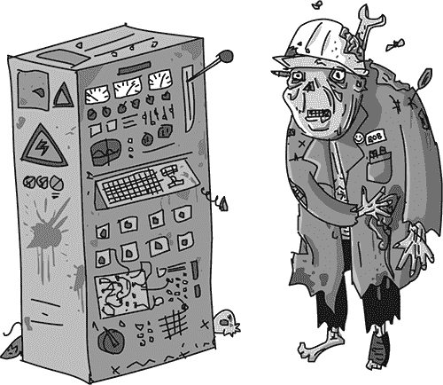

图 2-1：僵尸工人

### 功率与能量

“能量”和“功率”这两个词常常互换使用，但它们实际上是不同的。*功率*是单位时间内使用的*能量*，通常以秒为单位。能量的单位是焦耳（J），得名于英国科学家兼酿酒师詹姆斯·焦耳。你可以用焦耳每秒来表示功率，但功率更常见的单位是瓦特（W），得名于苏格兰发明家詹姆斯·瓦特。1 瓦特实际上等于 1 焦耳每秒。

想象电池储存了一定数量的焦耳（J）的能量。电池的耗尽速度取决于你从中提取的功率。如果你连接一个非常低功耗的设备，电池将需要很长时间才会耗尽，但如果连接一个高功耗的设备，电池很快就会用完。

表 2-1 列出了一些电器，并指明了它们的功率消耗。

**表 2-1：日常物品的功率消耗**

| **设备** | **功率（W）** | **将耗尽汽车电池的时间：** |
| --- | --- | --- |
| 便携式 FM 收音机 | 2 | 300 小时 |
| LED 灯泡 | 5 | 120 小时 |
| 焊接铁 | 30 | 20 小时 |
| 笔记本电脑 | 50 | 12 小时 |
| 显示器（27 英寸） | 80 | 7.5 小时 |
| 吹风机 | 1,500 | 24 分钟 |
| 电热器 | 3,000 | 12 分钟 |
| 电热水器（即同时进行水泵和加热的类型） | 10,000 | 3.6 分钟 |

烹饪和加热需要大量的电力。事实上，如果你想要热水或热食物，应该考虑燃烧燃料，而不是使用电力。

### 电力的种类

虽然表 2-1 列出了便携式收音机和电热水器，但这些设备需要不同类型的电力。幸运的是，这并不一定是个问题！在某些限制条件下，可以在这些类型之间转换。请注意，僵尸是无法完成这个任务的（图 2-2）。

使用电力的设备可以分为两类：需要高压交流电（AC）的设备和需要低压直流电（DC）的设备。直流电设备通常由电池供电。

图 2-2：电力的不同形式

#### 低压直流电

低压直流电比交流电更安全、更容易生成、使用和储存。*低压*通常指 12V（伏特）或更低。我发现，在尝试理解电流如何通过电线流动时，将其与水流通过管道的情况进行类比很有帮助。这个比喻特别有助于理解*电压*和*电流*之间的区别。

电压就像水管中的压力。高电压可以提供比低电压更多的功率，就像高压水管比低压水管能更快地将水注入容器一样。但是，仅仅将电压看作压力是不完整的；更准确的理解是将电压看作是高度差。

在原理图中（图 2-3），水流进入管道的位置高于水流离开管道的位置。入口距离出口越高，流速越快。这个流速就是电流，在电子学中，电流是每秒通过某一点的电荷量。电流的计量单位是安培，缩写为*A*。也常见到电流用*mA*（毫安）来表示。1 毫安是 1/1000 安培。

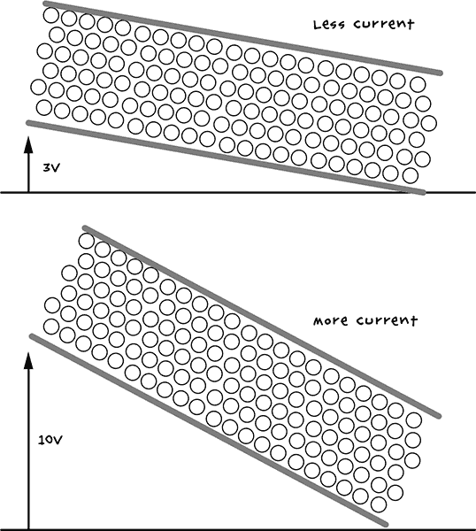

图 2-3：电压与电流

有趣的是，你可以通过将电压（V）与电流（A）相乘来计算设备使用的功率。

在为某些低电压设备（例如，FM 收音机接收器）供电时，确保电压正确非常重要。电压过高会导致电流过大流经收音机，可能会把它损坏。你最不想看到的就是一台“僵尸收音机”！类似地，如果电压过低，电流流动不足，设备无法正常工作。根据设备的不同，电压的可接受范围可能非常宽泛。例如，标明需要 6V 电压才能工作的收音机，在 4V 到 8V 之间的电压都可能正常工作。

**警告**

使用低压直流电设备时，确保电池正确安装。电池有正极和负极连接。如果连接方式错误，电流会反向流动穿过设备。如果设备没有内部保护机制（注意大多数设备都有），设备可能会失效。

#### 高压交流电

高电压被用于向人们的家庭分配电力，因为更高的电压使得电力传输更高效。高电压交流电与低电压直流电非常不同。例如，电压通常为 120V（美国）或 220V（世界大多数地方）。此外，交流电的电压是交替变化的：与电池（只有一个正极和一个负极）不同，交流电会在每秒 60 次（美国）或每秒 50 次（世界大多数地方）地切换正负极。频率是指电流每秒切换极性的次数，单位为赫兹（Hz）。

交流电源的电压随时间变化的情况可以绘制成图，如图 2-4 所示。请注意，电压不会突然改变方向，而是温和地摆动，先向一个方向，然后再向另一个方向，逐渐增加至超过 150V 的峰值，然后下降至低于–150V。显然，这一变化超过了零两侧的 120V。最大值和最小值被描述为 120V，因为这种交流电提供的功率与 120V 直流电的功率相当。这种测量交流电电压的方式被称为均方根（RMS）。有关此主题的更多信息，请查看*[`www.electronics-tutorials.ws/accircuits/rms-voltage.html`](http://www.electronics-tutorials.ws/accircuits/rms-voltage.html)*。

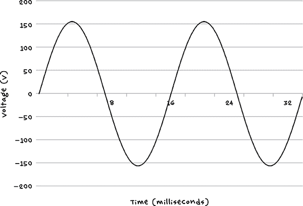

图 2-4：交流电（AC）

低电压直流电设备通常通过使用适配器来运行，例如笔记本电脑使用的适配器或你插入手机的“墙头电源”，它将交流电转换为直流电，并同时降低电压。在我们这个末日后的世界里，除非你拥有交流电发电机，否则你很可能既在制造又在直接使用低电压直流电。尽管你可以使用一种叫做逆变器的设备将直流电转换为交流电，但无论是正向转换还是反向转换都是低效的，浪费一些能量，最好避免。

如果你决定使用逆变器，记住即使你是从电池为其供电，它仍然会产生高电压，因此是危险的。因此，使用时应像插入交流电墙插一样保持常识。

### 电池

电池用于储存电能，种类繁多。有些电池小巧且为一次性使用，例如 AA 电池；另一些，例如锂电池和铅酸汽车电池，可以充电。请注意，电池只提供直流电（DC）。

在僵尸末日 apocalypse 中，一次性电池和可充电电池对你的生存至关重要，因此在寻找补给时尽量多捡一些。正如你将在本书的第九章、第十章和第十一章中看到的那样，你可以使用电池为分散僵尸注意力的设备和通信设备提供电力。当然，这两种电池各有其优点。现在让我们来探讨一下这些优点，以便你决定哪一种电池值得放入你的逃生包中。

#### 一次性电池

AA 电池的保质期较长，且许多小型电器的操作都需要这些电池，因此搜集大量这些电池是明智的选择。它们也会慢慢耗尽电力。例如，如果你的手电筒开始变暗，你仍然可以获得几分钟的宝贵光亮，直到电池完全耗尽。请注意，可充电的 AA 电池通常比一次性电池更快耗尽——并且没有那么多警告。

#### 可充电电池

锂聚合物（LiPo）电池已经彻底改变了移动设备，因为它们轻便且能存储大量电能。由于手机非常便于携带，你可能认为 LiPo 电池是任何便携式末日设备的良好充电选择。但请注意，它们有一些缺点：

• 如果过充、刺破或切割，它们容易起火。

• 它们需要特殊的充电电路。

• 它们在极端温度下效果不佳。

简而言之，存储你所产生的电能，使用汽车中的铅酸电池更为合适。首先，这些电池的供应应该非常充足。它们还有一个优点，就是能够在低温下工作，并且相比其他类型的可充电电池，它们在过充或电池用尽后继续放电方面更具宽容性。铅酸电池唯一的缺点就是非常重，因此当你需要捡拾汽车电池时，不要把背包装得太满。否则，你会很快发现自己负担过重，无法逃脱追赶的僵尸。

### 电池充电

在正常情况下，给电池充电的最简单方法是使用交流电（AC）电池充电器。由于你可能没有交流电源（除非你中了大奖，找到一个工作中的发电机），你需要考虑如何产生电力为电池充电。

在接下来的项目中，你将学习如何利用太阳能发电并为电池充电，这是解决末日后电力问题的最简单方法之一。接着你将学习如何改装固定式自行车和汽车交流发电机来为电池充电。你在这里学到的原理同样适用于使用水车和风力发电机。实际上，任何能够以合理速度和合理力量转动汽车发电机轴的设备都可以用来发电。传动带是连接任何转动装置和发电机的好方法，它能提供一些齿轮比，使发电机能够足够快地运转。

### 项目 1：太阳能充电

本项目将展示如何通过太阳能为 12V 汽车电池充电，构建一个简单的系统。

#### 太阳能电池板

光伏（PV）太阳能电池板是静音的，维护需求极少，它们会静静地在那里愉快地发电。当天空晴朗时，它们会产生更多的电力，但即使在阴天，它们也会产生可用的电量。显然，它们在夜晚是无用的，这也是为什么你需要用它们来给电池充电，而不是直接为设备供电。它们还需要放置在视野开阔的地方，并且需要避免被丧尸爬上去，因为任何遮挡太阳能电池板的亡灵生物都会大大降低其效率。

你可能会在房屋的屋顶上或者地面上的阵列中找到可以回收的太阳能电池板。你的电力需求可能相对较少，因此一到两个面板就足够了。毕竟，我们讨论的是生存问题；热水浴缸可以等一等。

正如你所预料的，太阳能电池板的发电能力是以瓦特（W）为单位来衡量的。但不要误解：一个标注为“100W”的太阳能电池板在赤道无云的正午时分可能会产生大约 100W 的电力，但大多数时候，它产生的电力要少得多。

太阳能电池板采用了不同类型的技术，其中最常见的类型是*单晶硅*和*多晶硅*。单晶电池板更高效，每平方英尺产生的电力更多，但多晶电池板仍然能够产生完全足够的电力。它们只是需要稍微大一些才能产生相同的电量。你选择什么类型并不重要；你真正需要关注的是瓦特数。如果你翻过太阳能电池板，应该能找到一个标签，上面会提供关于电池板的所有关键信息。

#### 充电控制器

国内的太阳能安装系统并不会给电池充电。相反，一台复杂的设备将太阳能电池板产生的低压直流电转化为高压交流电。转换后的电力首先用于满足房屋的交流电墙壁插座和照明的需求。剩余的电力会送入电力公司的交流电线路，电力公司会为多余的电力支付费用。如果你在末日前读到这篇文章，情况就是这样。否则，很可能电力公司的人都已经变成了僵尸，钱也变得毫无意义。

与其把多余的电力送给一个不关心也不会为此付费的电力公司，不如把它储存到电池里，留待以后使用。这个项目的工作原理就像你管理一个房车或船只的电力系统，当车辆不使用时，利用光伏电池板为电池充电。

与其建造一个电子电路来控制充电，不如使用现成的*充电控制器*，这样更简单、更可靠。如果你是在末日前购买，那么可以在 eBay、其他在线零售商或实体店（如 Fry’s）购买。如果你是在末日后购买，那么它们可以在实体店免费获得。

#### 你将需要的物品

要制作这个项目，你需要以下物品。

| **物品** | **备注** | **来源** |
| --- | --- | --- |
|  充电控制器 | 7A（或更大）12V | eBay, Fry’s (4980091), 废弃的房车和船只 |
|  光伏太阳能电池板 | 20W-100W | eBay、回收 |
|  汽车电池 | 12V | 汽车零配件商店、回收 |
|  2x 重型鳄鱼夹 | 7A 或更大 | 汽车零配件商店 |
|  电缆 | 7A | 回收 |
|  端子排 | 10A | 家得宝、Lowe’s、Menards |
|  万用表 | 简单万用表 | 汽车零配件商店、eBay、Fry’s |

太阳能电池板的规格已经相当标准化。寻找一个输出功率在 20W 到 100W 之间且标明为 12V 的太阳能电池板。这意味着该电池板适合为 12V 电池充电。名义上，12V 太阳能电池板实际上会产生超过 18V 的电压。

电力电缆需要足够长，以便将太阳能电池板与充电控制器连接起来。这根电缆可以是剪掉两端连接器的交流插座延长线。细的低电流电缆比高电流电缆对电流的阻力更大，容易浪费宝贵的电力。例如，一根 30 英尺（10 米）的 10A 交流插座延长线，在使用约 12W 电力的 20W 太阳能电池板充电时，会浪费大约 0.5W 的电力。因此，如果可以，使用粗一点的电缆并保持其长度尽量短。

由于你将把万用表作为项目的永久组成部分，并且还需要剪断测试线，我建议你使用尽可能便宜的万用表。你可能还会发现，拥有另一台万用表用于测试也会很有用。

除了上述列出的组件，你还需要以下常见的建筑工具：

• 电钻

• 螺丝（各种尺寸）

• 螺丝刀

在这一章中，你也将经常使用万用表。请查看“使用万用表”一节，了解更多关于如何使用这个有用的小工具的信息，参见第 237 页。

#### 建造

这个项目最困难的部分可能是在一个可靠的地方固定太阳能面板，确保它不会被僵尸或风吹走。屋顶可能是一个不错的选择，但最终还是取决于你在基地内找到最合适的安装位置。记住，你需要从太阳能面板拉一根电缆到你计划放置电池和充电控制器的区域。

图示展示了项目的接线方式（见图 2-5）。

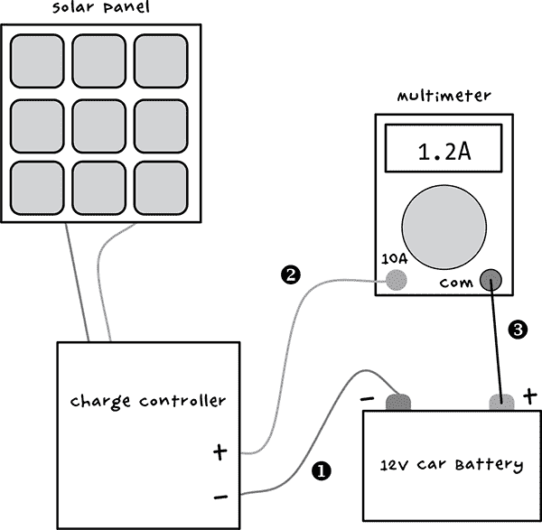

图 2-5: 太阳能面板接线图

充电控制器的型号各不相同，但大多数会有六个端子，每对端子分别为正负极。一对连接到太阳能面板，另一对连接到电池，第三对（在图 2-5 中未显示）连接到你希望用电池供电的设备。目前我们只关注如何为电池充电；稍后我会教你如何使用这些存储的能量。

充电控制器将监控电池电压和来自太阳能面板的电压，确保电池不会过度充电或放电过多，以至于无法继续接受充电。更先进的型号可能会有显示屏来显示相关信息，但我使用的是一个非常基础的型号，所以我还用了一个万用表来显示流入电池的电流。如果你的充电控制器已经能为你提供这些信息，那你大概就不需要万用表了。在这种情况下，充电控制器的正极连接直接连接到电池的正极，而不需要万用表作为中介。

##### 步骤 1：固定太阳能面板

不言而喻，太阳能面板应该安装在阳光充足且远离僵尸的地方，但如果只是在基地内靠近窗户的位置，那就不够理想了。理想情况下，面板应该安装在朝南的屋顶上。角度取决于你的纬度。为了获得最佳性能，你离赤道越远，面板的倾斜角度就应该越接近垂直。如果你的基地有斜屋顶，你大概可以直接将面板安装在屋顶的自然坡度上，因为距离赤道越远的屋顶通常会有更陡的角度，以便雪和雨水更容易流走。

你可能需要临时使用木条来固定太阳能板。照片中展示的是我将太阳能板安装在屋顶上的情况（见图 2-6）。

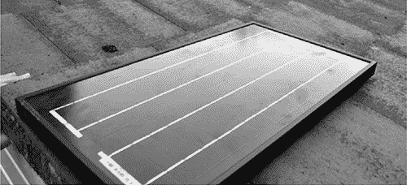

图 2-6：准备发电的太阳能板

##### 步骤 2：将导线连接到太阳能板

太阳能板可能有螺丝端子，或者像我的太阳能板一样，它可能会有一段短的导线焊接到端子上。连接到太阳能板的导线需要足够长，以便能伸入你的基座，确保它保持干燥。连接一根可以穿过墙壁或屋顶孔洞的导线，并连接到螺丝端子上。就像僵尸一样，水很可能通过任何缝隙渗透，所以在将电缆穿过后，要封住孔洞。硅胶密封剂对于这个问题非常有效。

一旦电缆进入内部，你可以使用接线端子将它延长到所需的长度，尽管一根没有接头的电缆通常会更可靠。接线端子可以用来将太阳能板的导线连接到一根更长的导线，后者将连接到充电控制器（见图 2-7）。

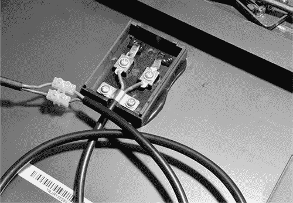

图 2-7：连接太阳能板

##### 步骤 3：连接电池和充电控制器

按照图 2-5 中所示，连接电池、万用表和充电控制器。万用表的红色探针导线可以插入充电控制器的螺丝端子中，但黑色探针需要以某种方式连接到电池。最好的方法是将黑色探针的一端连接到一只重型鳄鱼夹上。

这意味着我们需要制作三根导线，使用鳄鱼夹和探针导线。对于其中的第一根导线（在图 2-5 中标记为➊，在图 2-8 中显示），我只用了万用表的黑色导线的一半，切掉了探针。然而，你可以使用任何你喜欢的黑色电线。

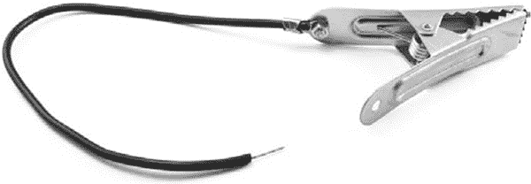

图 2-8：负电池导线

这根导线将把电池与充电控制器的负（–）端子连接起来。制作这根导线时，剥去电线两端约半英寸（10 毫米）的绝缘层。将其中一端通过顺时针缠绕在鳄鱼夹上的松动螺栓上，然后拧紧螺栓，使夹子紧握裸露的电线。

**注意**

电线应该顺时针绕在螺栓上，这样当你转动螺栓时，它会将电线一起拉绕过去，而不是将电线推开。这样连接会更加牢固。

使用一把钳子将夹子末端的支撑片缠绕在电线上。这些支撑片可以防止电线在意外拉扯时从夹子上脱落。

三根导线中的第二根（在图 2-5 中标记为➋，在图 2-9 中显示）将从多用电表的正高电流端子连接到充电控制器的电池正输出端。这根导线只是正极表笔导线，探头被切掉，最后半英寸（10 毫米）的绝缘层被剥去。

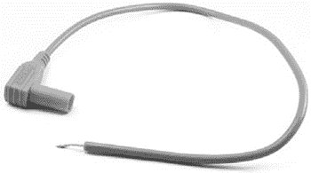

图 2-9：正极充电导线

将第三根导线（在图 2-5 中标记为➌，在图 2-10 中显示）从多用电表的负极（COM）连接端接到将连接到电池正极端子的鳄鱼夹。

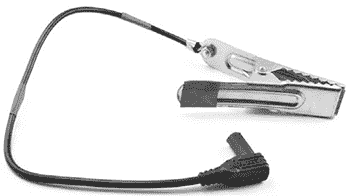

图 2-10：正极电池导线

将多用电表黑色探头的剩余部分剥去约半英寸（10 毫米）的绝缘层，并以与导线➋相同的方式将其连接到鳄鱼夹。这根新的导线将连接到电池的正极端子。

然而，这根导线是黑色的，由于黑色通常表示负极，这种颜色可能会造成混淆。为了让这根导线的用途更加直观，可以在其上缠上一些红色电工胶带，形成红色条纹，并在鳄鱼夹的“指端”处添加一些红色胶带。

现在，使用这三根导线将所有设备连接起来，准备使用（见图 2-11）。请注意，大多数多用电表都有一个专门用于高电流的正极插座，可能标有 10A 或 5A。将红色导线插入该插座。确保将电表调至正确的量程，即电表的最大直流电流读数。

##### 步骤 4：测试

要测试太阳能板，请使用多用电表的最高直流电流档位，监测从太阳能板通过充电控制器流入电池的电流。如果电池需要充电，充电控制器应该尽可能多地为电池充电直到充满，电表应该显示正值。当电池充满后，大多数充电控制器会切换到涓流充电模式，仅保持电池的充电状态。

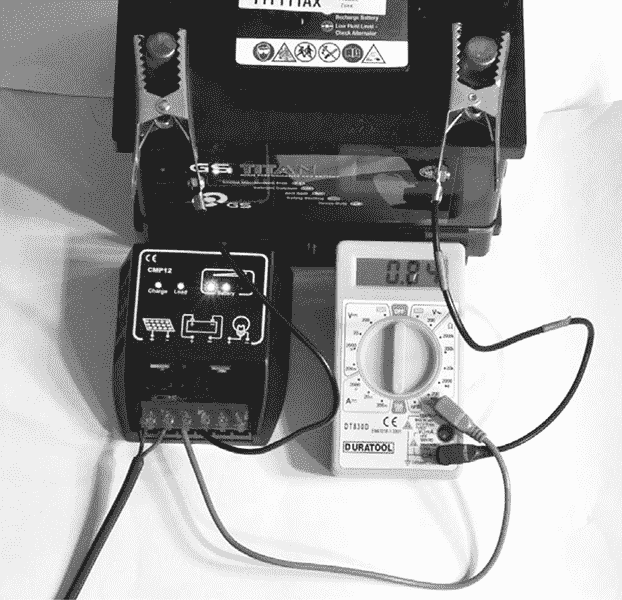

图 2-11：充电控制器、多用电表和电池已经连接。

在图 2-11 中，0.84A 的电流正在流入电池。如果你的电流读数是负值，那么电流正在流出电池。这意味着有问题，所以检查一下接线。你还应该注意到，如果遮挡了一部分太阳能板或太阳光消失，电流会显著下降。

如果电池不需要充电，则电表应该显示为零，这并不能给你提供太多信息。你需要等到第三章，当我们为电池连接一些灯光时，才能看到充电过程的实际情况。

#### 使用太阳能充电器

为了确保电力持续供应，最好复制整个设计，这样如果某个太阳能电池板或电线组出现故障，你还有备用。因为更换电池只需解开鳄鱼夹，所以你甚至可以保持电池轮换，并将几块充满电的电池留作紧急使用。为自己的基地储备电池，或者开创一个末日后的电池商店事业。钱或许没用了，但我敢肯定你可以通过电力换取食物、物资或帮助你下次的搜刮旅行。

在阳光明媚的日子里，如果太阳能电池板输出大量电流，你可能会发现鳄鱼夹变热。用胶带把它们包起来可以减少更换电池时烫到手指的机会。

### 项目 2：自行车发电机

在这个项目中，你将使用改装过的自行车来发电，这也是保持体型的好方法，以便你能跑得比僵尸快。设计使用了汽车发电机来给汽车电池充电。发电机就像在汽车中那样工作，只不过没有发动机。发电机包括了充电汽车电池所需的一切，因此在这个项目中，不需要你在太阳能项目中使用的充电控制器。

**注意**

你也可以将这个项目改造成使用其他旋转运动的形式。例如，你可以将它连接到风力涡轮机、水轮，或者在跑步机上跑的僵尸（图 2-12）。

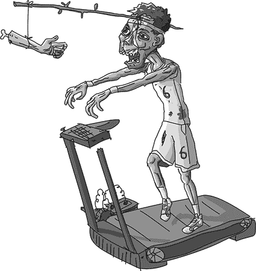

图 2-12：僵尸动力

#### 你将需要的材料

要制作这个项目，你需要以下物品。

| **物品** | **备注** | **来源** |
| --- | --- | --- |
|  自行车 | 大轮子 | 搜刮 |
|  汽车发电机 | 几乎任何都能使用 | eBay，搜刮 |
|  汽车电池 | 12V | 汽配店，搜刮 |
|  驱动带 | V 型带，A100 尺寸 | 汽配店，eBay，五金店，搜刮 |
|  2x 重型鳄鱼夹 | 7A 或更大 | 汽配店 |
|  发电机+和-的接头端子 | 适配你的发电机端子 | 汽配店 |
|  发电机 F 端子用的插片端子 | 适配你的发电机端子 | 汽配店 |
|  电缆 | 7A | 搜刮 |
|  万用表 | 简单万用表 | 汽配店，eBay，Fry’s |
|  灯及灯座 | 12V 5W 灯 | 汽配店 |
|  保险丝 | 10A 保险丝及座 | 汽配店 |
|  G 夹 |  | 五金店 |
|  2x 4 木料 | 5 英尺（1.5 米） | 五金店 |

这是另一个使用万用表作为固定装置的项目，我再次建议你使用最便宜的万用表。你可能还会发现，准备一个备用万用表用于测试会很有用。

#### 结构

建造这个项目的关键是保持自行车的后轮离开地面。有两种方法可以做到这一点。一种方法是制作（或回收）一个支架，使普通自行车可以作为健身车使用。这个支架需要足够坚固，能够支撑你坐在自行车上，因此维护支架可能不够强大。

另一种方法是将自行车倒过来。这样你可以用手或脚踩踏板，同时坐在靠近车把的位置。我采用了倒置自行车的方法。

**交流发电机**

如果你对电子学有一点了解，你可能知道大多数直流电机可以用来发电。在磁场中移动一根线圈（通常由普通磁铁提供）会在这根线圈中产生电流。

交流发电机，像所有发电机一样，遵循这一基本原理，但与普通磁铁不同，发电线圈转动的磁场是由电磁铁产生的。电磁铁由发电机本身提供电力，一旦发电机启动。为了启动，交流发电机必须连接到电池，否则就没有磁场来启动发电过程。这就像是“先有鸡还是先有蛋”的问题：发电机需要在发电的同时产生电流。

图 2-13 显示了简化版的汽车交流发电机电路图。

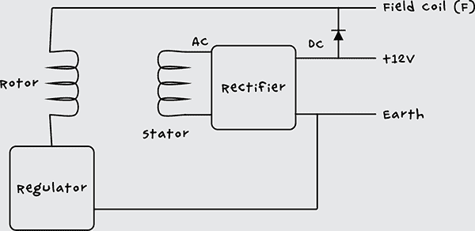

图 2-13：汽车交流发电机的电路图

实际上，交流发电机通常会有三个定子线圈，产生三相交流电，转化为直流电（与普通家庭的两相交流电不同）。如果你想深入了解交流发电机的原理，可以查看[`www.allaboutcircuits.com/vol_6/chpt_4/8.html`](http://www.allaboutcircuits.com/vol_6/chpt_4/8.html)中的描述。

##### 步骤 1：改装自行车

首先，拆下自行车上不需要的所有部件。你可以拆掉前轮、两个挡泥板和刹车系统。变速器可以保留。

移除后轮并拆下轮胎和内胎。然后将驱动带放到轮子上，并将轮子重新固定到自行车上。

##### 步骤 2：将交流发电机和自行车固定到 2×4 上

交流发电机没有标准的固定耳座位置，因此你可能需要在这里稍微 improvisate。交流发电机的驱动轮需要与自行车的车轮对齐，但对齐不必非常精确，尤其是如果你使用像我最终安排中那样的长皮带（图 2-14）。

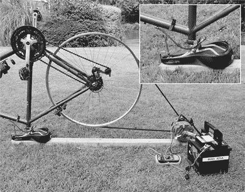

图 2-14：自行车和交流发电机的机械布局

使用 G 型夹将自行车固定在 2×4 上，利用鞍座进行调整。首先调整鞍座，使其保持平稳。或者，你也可以完全拆下鞍座，并在 2×4 上打一个与鞍座杆直径相同的孔。

你将发电机放置在 2×4 上的位置取决于发电机、摩托车和驱动皮带的几何形状，因此我不能给出准确的尺寸。将发电机固定好后，确保摩托车已经连接到 2×4 上，并且驱动皮带已经绕过自行车轮。我的发电机有一个方便的孔，可以将其固定在 2×4 的侧面（图 2-15）。驱动皮带不需要太大张力，但你可以用弹簧或弹性带制作一个简单的张力器；你甚至可以从废弃的自行车内胎上剪下弹性带。

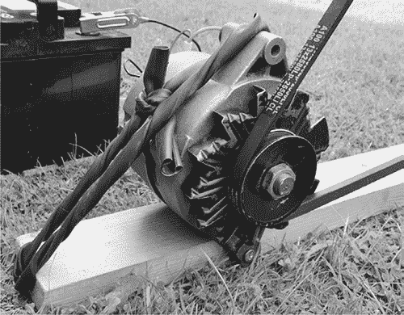

图 2-15：将发电机固定在 2×4 上

轻轻转动自行车，确保一切机械部分运转正常，然后进入下一步。

**警告**

不要试图在没有连接其他电路的情况下让发电机高速旋转，因为在没有负载的情况下在绕组中产生高电压可能会损坏发电机内置的电子设备。

##### 步骤 3：识别交流发电机端子

现在，发电机的机械部分已经完成，我们可以开始查看电气部分。首先识别交流发电机上的连接端子。尽管它们之间有些许差异，但汽车发电机通常标准化，尤其是老款汽车的发电机。而且，老式车辆的发电机通常也很容易拆卸。

我使用的是我在 eBay 上买的二手发电机，花了不到几美元（图 2-16）。不过，在末日之后，应该不会缺少被废弃的旧车。

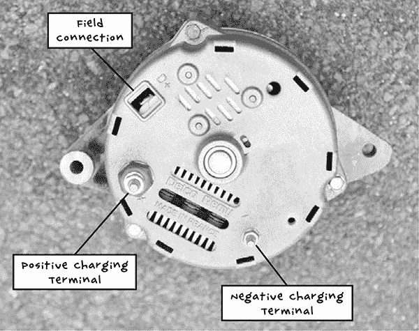

图 2-16：Delco LRA443 交流发电机（1980 年代）

你需要识别交流发电机的三个连接端子：

**负极充电端子 (–)** 这个端子通常会与发电机的金属外壳电气连接，但也应该有一个专门用于连接叉形端子的螺栓。它可能标有 –、GROUND 或 GND。

**正极充电端子 (+)** 虽然它看起来不像，但这个端子在电气上与发电机的金属外壳是隔离的。这个端子通常会标有 +，但也可能标有 BATT 或 BATT +。交流发电机有两个连接在一起的 + 端子是很常见的。如果是这种情况，你可以使用任意一个端子。

**场接 (D+)** 我的发电机上标记为 D+，尽管标记为 F 也很常见。

##### 步骤 4：接线

现在你已经知道了交流发电机各个端子的功能，接下来需要制作一些引线将它们连接起来。接线图显示了如何连接它们（图 2-17）。

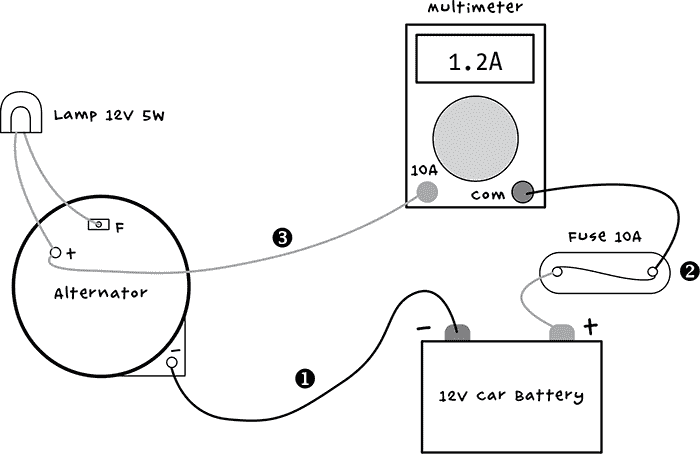

图 2-17：自行车充电器接线图

灯泡有两个用途。它限制了流向场线圈的电流，因此你不需要踩得太用力就能启动交流发电机进行发电。灯泡还充当了一个有用的指示器：当交流发电机开始发电时，灯泡会熄灭。

需要制作一些引线。让我们从交流发电机负极端子到电池负极端子的引线开始（➊见图 2-17）。这需要在电池端使用大号鳄鱼夹，在另一端使用插接端子，如图所示（图 2-18）。

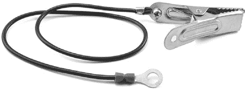

图 2-18：电池负极引线

你可以使用任何黑色电线作为这根引线，但我使用了黑色万用表引线的三分之二，从万用表的探头端开始，并剪掉探头本身。剥去电线两端大约半英寸（10 毫米）的绝缘层。将插接端子压接（用钳子压紧）到引线上。通过将剥去绝缘的引线顺时针绕在螺栓上，然后拧紧螺栓来连接鳄鱼夹引线。

这个充电电路没有包含充电控制器来保护电路，因此你需要一个保险丝。*保险丝*是设计为在电流过大时熔断并断开连接的短金属片。汽车电池可以储存大量能量——足以引发火灾——因此使用保险丝是很值得的。如果发生意外短路，保险丝会熔断，在造成过多损坏之前断开连接。

最方便的保险丝座类型是每端都有引线。你可以使用这些引线制作从电池正极端子到万用表的引线（➋见图 2-17）。将一根鳄鱼夹引线连接到一根保险丝线上，将剩下的黑色万用表引线的三分之一连接到另一根保险丝线上。用电工胶带包裹保险丝和万用表引线的连接部分，这样你就可以完成引线（图 2-19）。

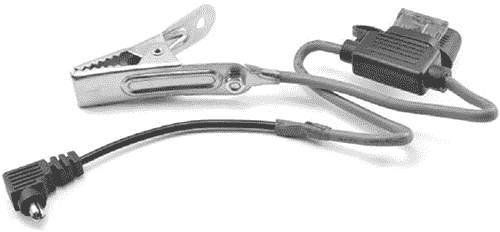

图 2-19：保险丝引线

三根引线中的最后一根（图 2-20 和 ➌ 见图 2-17）将灯泡和交流发电机正极充电连接器连接到万用表。

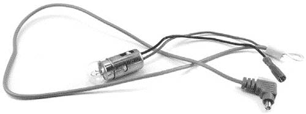

图 2-20：正极充电与灯泡引线

和保险丝座一样，我使用了带引线的灯泡座。将合适尺寸的环形端子压接到交流发电机的 F 连接端子上。最好使用绝缘的叉形端子，以减少短路的可能性。

从红色万用表引线剪下探头，剥去引线约半英寸（10 毫米）的绝缘层，将裸线与灯泡座的另一根引线缠绕在一起。将两根引线压接到交流发电机正极充电连接的端子上。

##### 步骤 5：最终组装

准备好所有导线后，按照图 2-17 中的示意图连接所有设备。

照片显示了发电机、电池和万用表的接线（图 2-21）。在连接电池和鳄鱼夹之前，确保万用表已设置为最大电流范围，并且使用了适当的插座来测量最大直流电流。

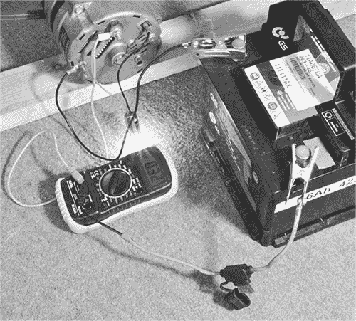

图 2-21：完成的接线

**发电机**

另一种更吵闹的发电方式是使用汽油发电机。这类发电机相对容易找到，能生成高压交流电，直接为普通交流电设备提供电力。发电机的问题是它们需要持续供应燃料，噪音很大，并且会产生必须排放到外面的废气。

它们也相当重，所以如果你决心把一个带回家，确保你的搜寻小队中有足够的人来搬运发电机，保持任何孤立的僵尸分心，并在不可避免地遇到一群僵尸时清理通道。

#### 使用脚踏发电机

在开始踩踏之前，灯泡应该亮着，万用表应该显示大约-0.3A 的电流。这个值是负数，因为电流正在被灯泡使用。

快速蹬动脚踏板，你应该会看到灯泡开始变暗，然后熄灭。此时，你可能会感到脚踏板的阻力增大。这是好消息：你在发电！电流现在应该显示出正值。通过猛烈地蹬踏，电流可能会上升到 2A 或 3A。

如果电池已充满电，那么灯泡应该熄灭，而电流保持在零。这是因为发电机包括一个电压调节电路，当电池达到最大电压时，它会停止充电。如果你需要稍微放电以测试是否充电，那么你可能需要继续进行下一个项目——我们开始使用储存在电池中的一些能量——并稍后再回来测试这个项目。

只有在准备好使用时才连接充电电路，因为灯泡最终会完全耗尽电池电量。

一旦你成功制造了一个脚踏发电机，你可以重复这些步骤，为你基地中的每个人建立一个充电站。通过团队发电，你将储备大量电池，每个人都能为小组的生存贡献力量！

我们已经彻底探讨了几种发电方式，特别是如何给汽车电池充电。在下一章，你将学习如何开始使用这些电力并监控电池状态，以免突然陷入黑暗。
