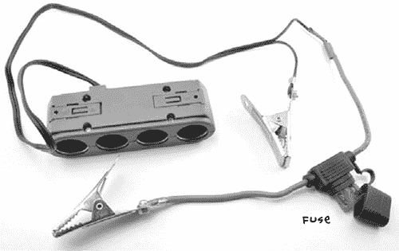
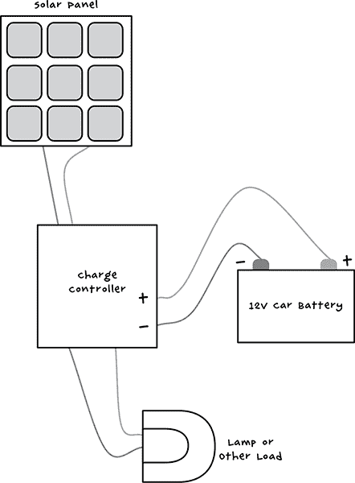
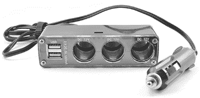
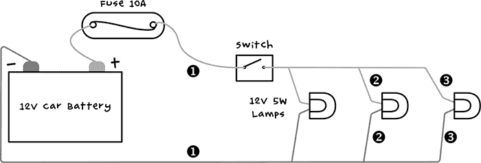
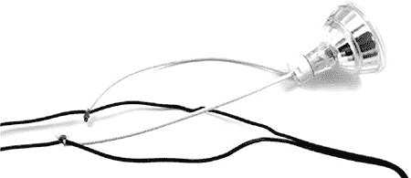
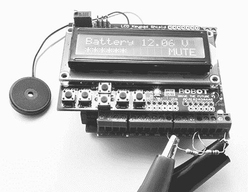
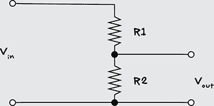
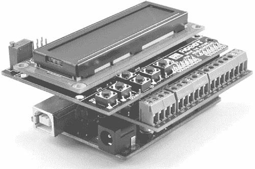
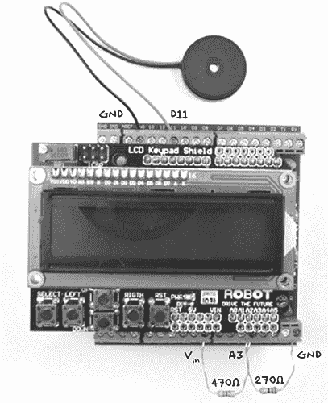

## 3

**使用电力**


现在你已经准备好一排整齐的汽车电池，并且它们都已经充满电，可以开始使用它们来提高你的生活水平（请参见图 3-1）。首先，你将学习如何将这些电池连接到有用的设备上，然后在本章的第一个项目中，你将搭建一个简单的照明电路。

本章的第二个项目将展示如何使用 Arduino 微控制器板和一些额外的组件制作一个简单的电池监控器。你可不想因为防御系统的电池耗尽而丧失大脑！


图 3-1：汽车电池在后末日世界中有多种用途。

### 从汽车电池为设备供电

让我们看看如何利用这些能量让你的生活更加舒适，同时击退那些恼人的僵尸。当然，你首先需要将电力从电池传输到设备。你将需要准备两种常见的连接器。

#### 点烟器插座

在直流电压中，12V 是相当有用的。这是汽车点烟器插座中的电压，而有许多 12V 电器可以直接连接到电池上。这些电器包括各种类型的照明设备、电风扇、饮料加热器、空气压缩机、DVD 播放器、小冰箱等。

实际上，有很多 12V 电器配有点烟器插头，因此制作一个适配器线，允许你直接插入这些电器，而不需要修改它们，是很值得的。

你可以在当地的汽车零件商店购买点烟器插座适配器，就像图 3-2 左边的那款。购买后，你可以剥去电线并连接鳄鱼夹，这样你就可以将适配器连接到电池上。有关如何连接电线/安装鳄鱼夹的信息，请参见项目 1，“步骤 3：连接电池和充电控制器”第 30 页。



图 3-2：制作点烟器插座适配器

**警告**

切勿以为汽车电池只有 12V 就对它毫无危险！虽然 12V 电压不会让你触电，但它绝对可以引起严重的烧伤。如果扳手或螺丝刀不小心短接了汽车电池的端子，数百安培的电流将通过它流动，导致工具变成飞溅的熔化金属，这些金属可以轻易地烧伤你，甚至致盲。记住：汽车电池储存了大量能量，若发生这样的事故，能量会很容易被释放出来。

现在你开始将设备连接到电池时，需要确保电池免受意外损坏。一些适配器可能已经内置了保险丝，但如果你的适配器没有保险丝，你应该在电路中加入一个保险丝座。一个 10A 的保险丝，就像在 “项目 2：自行车发电机” 中使用的那样，在第 34 页就能正常工作。永远记得备用保险丝。毕竟，如果附近被僵尸占领，你可不容易出去买保险丝。我在图 3-2 中的设计中包含了一个保险丝；如果发生意外短路，保险丝将防止任何火灾问题。

另一种（或补充）保护电池的方法是将 “项目 1：太阳能充电” 中的太阳能充电控制器放置在电池和*负载*之间，或者任何你希望从电池供电的设备之间（图 3-3）。

当以这种方式设置时，充电控制器会监控电池电压，并在电池电压低于某个特定阈值时自动断开负载。这是有利的，因为如果电池在这个点之后继续过度放电，它可能会被损坏到无法再接受充电的程度，这时再想重新充电就非常困难了。



图 3-3：使用充电控制器保护你的电池。太阳能板是可选的。

在 “项目 4：电池监视器” 中的第 53 页，你将学习如何构建一个电池监视器，当电池电量低时，它会提醒你。

#### USB 电源

由于 USB 充电线的影响，5V 已成为小型直流设备中最常见的工作电压。从 12V 到 5V 的转换比从 120V 交流电到 5V 直流电的转换要容易得多。在汽车配件商店，你会找到 12V 点烟器到 5V USB 电源适配器。

图 3-4 中的适配器有一个优点，它结合了 12V 插座和 5V USB 插座。另一种适配器仅有一个 12V 点烟器形状的插头，并在插头末端内置一个或两个 USB 插座。你可以将图 3-4 中显示的适配器插入图 3-2 中的适配器。或者，你也可以剪掉图 3-4 适配器的插头，并为其添加鳄鱼夹，就像你对图 3-2 中的适配器所做的那样。



图 3-4：12V 到 USB 适配器

当然，你可以使用这个适配器为你的手机充电。但在僵尸 apocalypse 中，蜂窝网络可能是首先崩溃的服务之一，首先会因接入的用户数量过多而超载，大家都在试图联系亲人，接着由于电力中断和缺乏维护，系统会发生故障。

#### 交流逆变器

使用*逆变器*，你可以将电池的 12V 直流电转换为 120V（或 220V）交流电。这个设备有端子可以连接 12V 电池和交流电插座，你可以把普通的交流电设备插入其中。

然而，你不能插入功率非常高的交流电设备。逆变器上印刷的功率额定值会指定它可以承载的最大功率负荷。用于给笔记本电脑供电的小型逆变器可能只有 50W，但 200W 或 400W 的逆变器既不难找，也不特别昂贵。

如果可能，使用直流设备要比使用逆变器更好，因为逆变器效率较低。它们生成高压交流电，并且会浪费大量的能量转化为热量；只需看看大多数逆变器侧面的大型散热器即可。即便没有设备连接，它们通常仍会消耗相当大的电流，因此你必须记得在不使用时关闭它们。

在接下来的章节中，你将学习如何制作一个低电压照明系统，使用 12V 直流灯泡直接由汽车电池供电，提供与交流电照明相似的光照强度。

### 项目 3：LED 照明

LED 提供的每瓦光照强度是所有照明类型中最强的，是末日后照明的自然选择。这个项目使用了三只 12V 的 MR16 LED 灯泡。这些灯泡的功率从 2W 到 10W 或更高不等，任何这些功率都适合本项目。

如果你愿意，可以将超过三个这样的灯泡串联起来。只需使用更长的电缆和更多的灯泡。例如，你可能有一条很长的走廊需要照明，而良好的照明对有效的僵尸战斗至关重要。

事实上，几乎任何 12V 的光源都可以使用，包括功率为 50W 或更高的高功率卤素灯泡。不过，功率越大，电池消耗的速度就越快。

#### 你将需要的物品

为了制作这个项目，你需要以下物品。

| **物品** | **备注** | **来源** |
| --- | --- | --- |
|  汽车电池 | 12V | 汽车零件店，回收 |
|  2x 重型鳄鱼夹 | 7A 或更高 | 汽车零件店 |
|  LED 灯泡 MR16 | 12V 2W-10W | 五金店 |
|  MR16 灯座 | 带导线的灯座 | 五金店 |
|  开关 | 内联开关（5A） | 五金店 |
|  电缆 | 7A | 回收 |
|  熔断器 | 10A 熔断器和座 | 汽车零件店 |

#### 构建

本项目的 LED 灯是并联接线的（图 3-5）。在这种布置中，每盏灯都能从电池获得完整的 12V 电压，如果其中一盏灯因任何原因失败，其他灯仍将继续工作。



图 3-5：12V 照明系统

##### 步骤 1：准备电缆

如果你使用的是数量较少的低功率 LED 灯泡（最多五个，每个不超过 5W），那么双核钟铃线就足够了。专为音响设计的电缆也是一个不错的选择。在我的设计中（图 3-5），我使用了三个灯泡，因此我切了三段电缆，剥去每端半英寸（15 毫米）的绝缘层。

这些引线中的第一根（在图 3-5 中标为 ➊）将从电池的正极连接到开关，再连接到第一个灯泡。第二根电线将继续连接到第二个灯泡（➋），最后一根引线（➌）将连接到最后一个灯泡。

在电线连接处，每根电缆需要与下一段电缆以及灯座进行三重扭接连接（图 3-6）。



图 3-6：连接灯座

对于更永久的连接，焊接扭接的连接。如果你是否焊接它们并不重要，但无论如何，都应该用电工胶带包裹连接点。关于如何制作这种扭接线连接的指南，请参阅 “通过扭线连接电缆” 在 第 229 页。

##### 步骤 2：接线保险丝和开关

通过将保险丝和鳄鱼夹连接到电线的起始端来完成接线。请注意，这些 MR16 灯泡包含一个电路，可以自动切换 LED 的极性。这意味着你可以随意连接它们。如果你使用的是其他类型的 12V LED 灯泡，检查它们是否有单独的正负连接端。如果有，确保将正极连接到开关引线，负极连接到你将连接到电池负极端子的引线。

鳄鱼夹连接到保险丝引线，后者连接到开关（图 3-7）。这些引线同样可以扭接在一起，为了更可靠，可以焊接这个扭接的接头。串联开关使用螺丝端子连接电线。一侧是简单的金属连接器，电流通过，而另一侧有弹簧触点，在开关处于开启位置时，这些触点会相互接触。


图 3-7：为照明系统连接保险丝和鳄鱼夹

##### 步骤 3：安装灯具

现在所有的电路都接好了，将鳄鱼夹夹到电池上，确保开关一拨，灯泡就会亮。确认灯亮了之后，只需将它们固定在天花板、墙壁或者任何你想放置的地方。

#### 使用照明设备

墨菲定律规定，电池会在僵尸攻击时耗尽电量，导致灯光熄灭。为了预防并避免这种情况，了解你的电池大概能提供多少小时的灯光非常重要，以便你知道何时需要再次踩踏或为电池充电。

小时数取决于你电池的大小和质量。回顾一下表 2-1 中第 21 页的数据，你可以看到一个 5W 的 LED 灯预计能持续工作 120 小时。因此，一串六个 5W 的 LED 灯大约能使用 20 小时。如果你全力以赴，使用三盏 60W 的 12V 卤素灯，你大约只能获得 4 小时的照明，之后需要重新充电。

无论你的照明系统如何，能提前知道电池电量低是很有帮助的——这正是下一个项目的目标。

### 项目 4: 电池监控器

我建议随时保持充足的汽车电池库存，并确保电池随时待命。这样，如果僵尸损坏了你的太阳能电池板，或者你生病无法蹬动发电机，你就不会陷入黑暗中，无法行动（在字面和比喻上）。因此，拥有一个监控电池、在电池电量开始下降时提醒你的预警系统是至关重要的。

这个项目使用的是 Arduino，它是一块非常实用的小板，适用于需要一些逻辑的电子项目。在这个案例中，逻辑仅仅是测量电池电压、显示电压，并在电压低于某个临界值时触发蜂鸣器。

Arduino 将由它正在监控的同一辆车电池供电。Arduino 的功耗低于 1W，因此可以将板子持续连接到电池上。

在电池监控器设置中（图 3-8），鳄鱼夹将电池监控器连接到电池。如果电池上已经附有大型鳄鱼夹，那么这些小夹子可以连接到大夹子的手柄上。



图 3-8: 电池监控器

左侧电阻的左引脚（图 3-8）连接到电池的正极，右侧电阻的右引脚连接到电池的负极。

#### 你需要的东西

要制作这个项目，你需要以下物品。

| **物品** | **备注** | **来源** |
| --- | --- | --- |
|  Arduino | Arduino Uno R3 | Adafruit, Fry’s (7224833), Sparkfun |
|  Arduino 螺丝盾 | 螺丝盾 | Adafruit (196) |
|  LCD 盾 | LCD 16x2 显示屏盾 | eBay, Sparkfun (DEV-11851) |
|  蜂鸣器 | 小型压电蜂鸣器 | Adafruit (1740), eBay |
|  270Ω 电阻 |  | Mouser (293-270-RC) |
|  470Ω 电阻 |  | Mouser (293-470-RC) |
|  小型鳄鱼夹引线 |  | 汽车配件商店 |

使用 Arduino 的一个好处是，有许多不同的现成模块，称为*扩展板*，它们可以安装在 Arduino 上，并为其增加额外功能，而无需复杂的电子构建。这个项目使用了两个这样的扩展板，它们堆叠在一起。

安装在 Arduino 顶部的第一个扩展板是*螺丝扩展板*，有时也叫*翼型扩展板*。这个扩展板允许你通过螺丝端子和螺丝刀将电线连接到 Arduino 上。你将安装的第二个也是最上面的扩展板是 LCD 显示屏扩展板。这个扩展板会显示电池电压，并通过条形图展示电池的充电状态（SOC）。如果你怀疑附近有僵尸徘徊，这个项目还有一个静音蜂鸣器的选项，以避免吸引它们的注意。

这个项目中唯一的其他电子元件是一对电阻和一个蜂鸣器。需要这些电阻是因为虽然 Arduino 有输入端口来测量电压，但它只能测量最高 5V 的电压。超过这个电压会损坏 Arduino。你将使用这对电阻组成一个叫做*电压分压器*的电路。我选择的电阻将电压降低了 2.74 倍，这样我们可能在电池上找到的 12V 或 13V 就会被降低到 4.7V 或更低。

**电压分压器**

使用两个电阻作为电压分压器（图 3-9）是将你想测量的电压降低到一个可以直接由 Arduino 测量的水平的好方法。



图 3-9：电压分压器

如果你知道 V[in]、R1 和 R2，计算 V[out]的公式是


例如，如果 R1 是 470Ω，R2 是 270Ω，V[in]的最大电压为 13V，那么


换句话说，即使你的电池已充满电并且能够提供 13V，最多只有 4.74V（低于关键的 5V 电压）会到达 Arduino。如果输入电压低于这个值，V[out]将按比例缩放。例如，如果电池电压为 6.5V（顺便说一下，这通常意味着出现了一些问题），则 V[out]为 2.37V。

#### 构建

值得注意的是，这个项目完全不需要焊接。你只需要一个螺丝刀。

##### 第一步：编程 Arduino

Arduino 程序，称为 *sketches*，可以改变 Arduino 上某个连接或 *引脚* 是输入还是输出。Arduino 会记住每个引脚是设置为输入还是输出，即使你将其从电路中断开。因此，如果你上次使用某个 Arduino 引脚时将其设置为输出，将 Arduino 连接到期望该引脚为输入的新硬件时，可能会损坏 Arduino 或你连接的电路。在做任何其他操作之前将程序上传到 Arduino，可以确保每个引脚按照你的电路预期的方式工作。

你可以在附录 B 中找到关于如何开始使用 Arduino、将其连接到计算机以及向其上传程序的详细说明。在这种情况下，程序名为*Project_04_Battery_monitor*，并且可以在本书中使用的所有其他程序文件中找到，网址为 *[`nostarch.com/zombies/`](http://nostarch.com/zombies/)*。

##### 步骤 2：搭建 Arduino 三明治

当与两个扩展板一起使用时，Arduino Uno 位于底部，螺丝盾连接到其上，最后 LCD 显示屏扩展板位于螺丝盾的顶部（见图 3-10）。LCD 扩展板必须放在堆叠的最上面，否则你将无法看到它显示的内容！



图 3-10：Arduino “三明治”

在将扩展板的引脚插入 Arduino 或螺丝盾时，请小心检查所有引脚是否正确对接孔，以免损坏它们。在推引脚时，很容易有一个引脚会弯曲出去。

##### 步骤 3：连接电阻器和蜂鸣器

你将把电阻器和蜂鸣器连接到螺丝盾的螺丝端子上（见图 3-11）。



图 3-11：将组件连接到螺丝盾

这两只电阻器可以通过使用万用表测量其电阻来识别（请参见第 237 页的《使用万用表》），或者通过读取电阻体上的彩条来识别。470 Ω 电阻器的彩条是黄色、紫色和棕色；270 Ω 电阻器的彩条是红色、紫色和棕色。在第 225 页的《电阻颜色代码》部分，你将找到电阻颜色代码表以及如何通过彩条识别电阻的说明。

一些蜂鸣器会有红色的正极导线和黑色的负极导线。如果是这种情况，连接黑色导线到 GND（地），红色导线到 Arduino 的 D11 引脚。其他蜂鸣器可能会有相同的导线；如果是这种情况，连接方式无关紧要。

#### 软件

这个程序的主要任务是确保 LCD 在正确的时间显示正确的文本。我将带你一步步走过它，尽管你不必理解或遵循这段程序的运作方式就能完成项目。你只需按照“安装 Antizombie Sketches”中解释的步骤，将其准确地上传到 Arduino 板上即可，详见第 248 页。

如果你想深入了解 Arduino 编程，请参见附录 C 或阅读我的书《*编程 Arduino：开始使用 Sketches*》（McGraw-Hill，2012 年）。

这段程序首先导入了*LiquidCrystal*库，它负责控制 LCD 显示屏。由于这个库是 Arduino 软件的标准部分，所以无需下载和安装此库。

```
#include <LiquidCrystal.h>
```

在库命令之后，定义了三个常量，用于表示关键电池电压。

```
const float maxV = 12.6;
const float minV = 11.7;
const float warnV = 11.7;
```

这些电压分别是：完全充电的电池电压、你希望电池放电的最低电压，以及蜂鸣器应响起的电压。这最后两个值都设置为 11.7V。对于铅酸车载电池来说，这些值相当标准，但如果你使用不同类型的电池，可以进行调整。由于这些值包含小数，变量的类型是*float*。你可以在附录 C 中了解更多关于 Arduino 数据类型的信息。

接下来的几行定义了用于 Arduino 的引脚常量。

```
const int buzzerPin = 11;
const int voltagePin = A3;
const int backlightPin = 10;
const int switchPin = A0;
```

Arduino 的各种引脚通常仅通过一个数字来标识，因此这些常量赋予了它们有意义的名称。除非你决定以不同的方式连接电池监视器，否则无需更改这些引脚的名称。

最后的部分定义了用于电压分压器中电阻器值的常量。

```
const float R1 = 470.0;
const float R2 = 270.0;
const float k = (R1 + R2) / R2;
```

常量`k`是输入电压需要减少的因子，以便适应 Arduino 的 5V 测量范围。下一行代码初始化 LCD 显示屏，并指定使用的引脚。

```
//                RS,E,D4,D5,D6,D7
LiquidCrystal lcd(8, 9, 4, 5, 6, 7);
boolean mute = false;
```

以`//`开头的注释行仅仅是标明了下面这行代码中哪些 Arduino 引脚号对应 LCD 模块上的哪些引脚。接下来的一行定义了一个*布尔*变量`mute`，用于将蜂鸣器静音。

接下来的`setup`函数只会在 Arduino 启动时运行一次。在这种情况下，它通过将背光引脚（D10）设置为输入来开始。

```
void setup()
{
  // Because of a defect in common cheap LCD displays,
  // backlight controlled by transistor D10 high can
  // burn out Arduino pin
  pinMode(backlightPin, INPUT);
  lcd.begin(16, 2);
  lcd.setCursor(0, 0);
  lcd.print("Battery ");
}
```

背光引脚仅在某些 LCD 显示屏上使用，但许多 LCD 显示屏存在设计缺陷，如果将此引脚设置为输出并设置为高电平，可能会损坏与之连接的 Arduino。为了安全起见，将 D10 设置为输入。函数的其余部分初始化 LCD 显示器，并写出单词`Battery`，它将成为显示消息的永久部分。

跟在设置函数后的循环函数会反复执行。也就是说，一旦函数中的所有命令执行完毕，它将从头开始重新执行。

```
void loop()
{
  displayVoltage();
  displayBar();
  if (readVoltage() < warnV && ! mute)
  {
     tone(buzzerPin, 1000);
  }

  if (analogRead(switchPin) < 1000) // any key pressed
  {
    mute = ! mute;
    if (mute) noTone(buzzerPin);
    delay(300);
  }
  delay(100);
}
```

显示器的更新在循环函数内进行。在这里，您还将检查电池电压是否低于警告电压，并检查按键是否被按下以切换电池监视器的静音模式。

这个循环函数使用了文件中其他位置的多个函数。第一个函数是`displayVoltage`。

```
   void displayVoltage()
   {
     lcd.setCursor(8, 0); 
➊    lcd.print(" ");
     lcd.setCursor(8, 0); 
➋    lcd.print(readVoltage());
     lcd.setCursor(14, 0);
     lcd.print("V");
   }
```

这个功能从第 8 列开始，通过打印八个空格➊覆盖顶部行的八个字符位置。然后，光标会返回到第 8 列，在那个空白处写入电池电压➋，最后在行尾写上字符*V*。

`displayVoltage`函数利用`readVoltage`函数将 Arduino 模拟输入的原始读数转换为电压值。

```
float readVoltage()
{
  int raw = analogRead(voltagePin);
  float vout = (float(raw) / 1023.0) * 5.0;
  float vin = (vout * k);
  return vin;
}
```

从 Arduino 模拟引脚读取的数值范围在 0 到 1,023 之间，0 表示 0V，1,023 表示 5V。因此，`readVoltage`中的`vout`值是电压分压器的输出电压——也就是降低后的电压。您需要逆向计算原始电池电压`vin`，然后返回这个值以供显示。

程序中的最后一个函数显示了条形图，显示电池剩余电量，并且如果电池监视器处于静音模式，则会显示`MUTE`通知。

```
void displayBar()
{
  float v = readVoltage();
  float range = maxV - minV;
  float fullness = (v - minV) / range;

  int numBars = fullness * 16;
  lcd.setCursor(0, 1);
  for (int i = 0; i < 16; i++)
  {
    if (numBars > i)
    {
      lcd.print("*");
    }
    else
    {
      lcd.print(" ");
    }
  }
  if (mute)
  {
   lcd.setCursor(12, 1);
   lcd.print("MUTE");
  }
}
```

`displayBar`函数逐一检查显示器第二行的 16 个字符位置，然后根据电池的`充满程度`显示`*`或空格字符。

#### 使用电池监视器

一旦您将电池监视器连接到电池，LCD 屏幕应该会亮起，并在显示器的顶部行显示电池电压读数。显示器的第二行将显示若干个`*`字符，以指示电池剩余的电量。另外，如果您按下显示器下方的任意按钮开关以禁用蜂鸣器，消息`MUTE`应该会切换显示。

如果显示器出现空白或难以阅读，您可能需要调整对比度。只需使用一个小的平头螺丝刀旋转 LCD 屏蔽板右上角的小可调电阻器(图 3-11)即可。

现在，您已经掌握了基本的电力生成和照明功能，接下来可以关注如何检测僵尸。您将在第四章中了解如何判断它们的到来。
