## 4

**僵尸报警器**


电影告诉我们，僵尸无法移动而不发出呻吟声。它们也笨拙，容易撞到东西。然而，它们依然有可能让你措手不及。毕竟，你总得休息一会儿。所以，你新产生的电力的最初用途之一应该是制作一些僵尸报警器（见图 4-1）。

本章包含两个僵尸探测器项目：一个是非常低技术的拉线报警器，另一个是更为复杂的被动红外（PIR）接近报警器。


图 4-1：僵尸探测

### 项目 5：拉线报警器

僵尸会不断找到进入你防线的方法，无论是因为它们被气味和噪音吸引，还是仅仅因为漫无目的地游荡。你需要一种方法来探测它们，这样你就可以拿起棒球棍或斧头，准备前往防线缺口与它们作战。

或者，你也可以决定建立一个“杀戮区”，让毫无防备的僵尸（难道还有别的类型吗？）闯入，在那里你可以迅速消灭它们。无论哪种方式，你都需要被提醒它们的存在，而拉线报警器就是确保这一点的好方法。

僵尸以拖拖拉拉著名。它们经常不看自己走的路，因为它们大多是根据人肉的气味来引导自己的。因此，即使是一个连最笨拙、最短视的人类也会轻易识破的拉线，对于僵尸来说也完全有效（见图 4-2）。这个报警器使用的部件可以轻松收集，用于在拉线被触发时响起汽车喇叭。

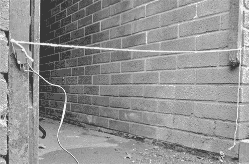

图 4-2：拉线报警器

### 所需物品

制作这个项目，你需要以下物品。（微动开关也可以从微波炉的门安全联锁中获得。）

| **项目** | **备注** | **来源** |
| --- | --- | --- |
|  绳子 | 足够长，可以横跨你希望探测僵尸的区域 | 五金店 |
|  钉子或螺丝 | 用于固定拉线和微动开关 | 五金店，收集 |
|  微动开关 |  | Fry’s (2314449)，微波炉 |
|  双股铃线或扬声器电缆 | 用于将微动开关连接到电池和汽车喇叭 | 五金店，收集 |
|  汽车喇叭 | 越响越好。即便是僵尸，在几英尺外听到汽车喇叭的声音也会感到惊讶，几乎没有什么比惊讶的僵尸更有趣的了。 | 汽车配件店，收集 |
|  12V 电池 | 可以使用车用电池，但较小的电池也可以。 | 汽车配件店，收集 |

你可以很容易地从废品中收集到大部分这些部件，而且你可能没有足够的电力来运行微波炉，所以不如直接把它拆解来获取微动开关。当然，如果在僵尸还没完全占领之前进行练习，单单为了一个 2 美元的开关而摧毁一个微波炉显然是很浪费的；在这种情况下，只能使用已经报废的微波炉。反正将一台僵尸微波炉留在身边是很危险的。

我使用的 12V 电池是一种小型密封铅酸电池，实际上就是迷你型的汽车电池。但如果你已经按照第二章准备好了汽车电池，你可能只想使用那个电池。

**警告**

以下程序描述了如何拆卸微波炉。拆卸时，必须确保微波炉已拔掉交流电源插头。此过程将使微波炉最好处于不可用状态，最坏的情况是非常危险，因此拆卸后微波炉必须报废。不要尝试将损坏的微波炉当作辐射武器对抗僵尸（不过作为钝器使用是可以的）。

#### 构建

在后启示录的世界里，低技术的陷阱，比如这个，将通常是最可靠的。构建中最难的部分可能就是从微波炉中提取微动开关，这也是我将要开始的地方。当然，如果你提前计划好，你也可以直接购买一个开关；如果你已经准备好了开关，可以跳到“步骤 2：识别微动开关端子”（第 68 页）。

和本书中大多数项目一样，最好先在工作台上安全地测试它们，确保它们可以正常工作，再在僵尸活动区域使用。在腐烂的肉堆逼近你时，集中精力进行焊接是非常困难的。

##### 步骤 1：获取微动开关

所有微波炉略有不同，因此你需要根据自己微波炉的具体情况调整这些操作步骤。基本原则是不断拆卸螺丝和移除微波炉的部件，直到你能接触到门开关。大多数微波炉都有一个 U 形的外壳，拆掉后你可以清楚地看到微波炉的内部结构（图 4-3）。门锁旁边的微动开关就能轻松接触到。

在图 4-3 中，微波炉的门在右侧，所有控制按钮和旋钮的区域背面位于右上方，门锁的内部接近圈出的区域。

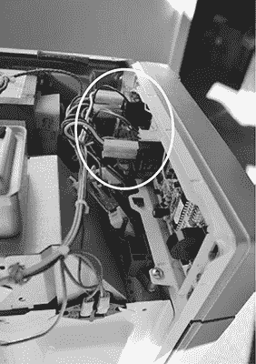

图 4-3：微波炉内部

你要找到的微动开关将会有夹子固定在其端子上（图 4-4）。你可以将这些夹子取下，或者你也可以简单地将电线剪到夹子的地方，这样微动开关就更容易拆除。

**注意**

如果你一开始看不见微动开关，可以将烤箱拆卸得更多一些，直到其位置变得明显为止。有些烤箱有多个微动开关。

移除微动开关后，如果附带的电线足够长，你可以直接将它们保留在原位并剪断。否则，焊接掉旧电线并连接正确长度的新电线。微波炉中还有很多其他有用长度的电线，特别是那些带有叉形接头的电线。

不幸的是，微波炉的其他部分在这个项目中用处不大，尽管微波炉的剩余部分如果从高处掉下来，能成为一个极为有效的僵尸头部压碎器。只要先把绳子系在上面，就能将它拉回并多次使用。既然是末日世界，循环利用显得更为重要。

##### 步骤 2：识别微动开关端子

微动开关将有三个连接端子（图 4-4）。仔细看，你会看到它们分别标有 COM（公共端）、NC（常闭端）和 NO（常开端）。当推向左侧时，长杠杆会按下开关侧面的按钮。

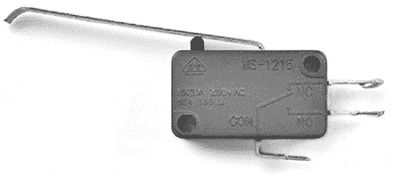

图 4-4：微动开关

当你将这些开关之一添加到电路中时，你总是会使用公共连接。你连接到的另一个端子将取决于你希望开关在被激活时还是释放时引起某个动作。开关的常开端子在未激活时保持开放，这意味着它与公共端子没有连接，直到按钮被按下。常闭端子的工作原理则相反。你希望当僵尸撞到触发线时警报响起，从而激活开关，所以这个项目使用了常开（NO）连接。

##### 步骤 3：预览电子电路

现在，让我们来看看这个小开关如何成为你先进僵尸警报系统的关键部分。

触发线警报的原理图（图 4-5）展示了一个几乎可以称得上是极其简单的电子电路。如果汽车喇叭的一个端子明确标有正极，你将其连接到电池的正极；否则，喇叭的任何一侧连接都无所谓。电池的负极连接到微动开关的 COM 端子，微动开关的 NO 连接完成了与汽车喇叭的电路。

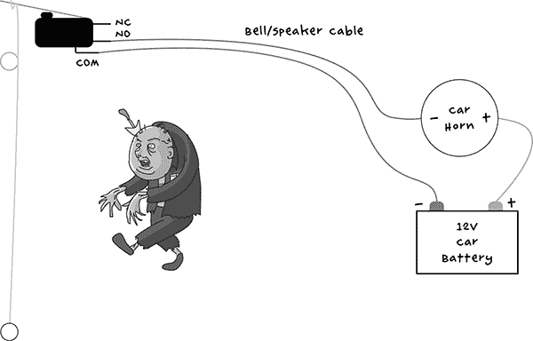

图 4-5：触发线警报的原理图

**注意**

汽车喇叭通常需要满电的 12V 才能发出较大的声音。显然，汽车电池非常适合这个项目。更多有关使用电池的信息，请参见第二章。

这个警报的一个大优点是，在警报被触发之前，它不会从电池中消耗任何电流。这意味着你的电池能为你提供长时间有效的僵尸防护。

##### 步骤 4：准备电线

你需要两段电缆：一段较长的双芯电缆连接到开关，另一段较短的单芯电线（大约 6 英寸或 15 厘米）用于连接电池和喇叭的正极端子。

剥去并修整所有电线的末端。如果你需要帮助，可以参考“剥线”部分，见第 227 页。

##### 步骤 5：连接电池和喇叭

如果你使用的是带焊接端子的 12V 小电池，将短的单芯电线焊接在电池的正极端子和喇叭的正极端子之间（见图 4-6）。另一方面，如果你使用的是汽车电池，那么不要直接焊接到端子上。相反，使用鳄鱼夹，像在第二章中许多导线上那样操作（例如，见图 2-10 在第 32 页）。

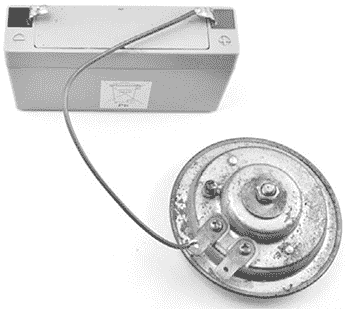

图 4-6：连接喇叭和电池

如果喇叭上没有标有 + 的端子，那么你将电池连接到喇叭的哪个端子都无关紧要。

##### 步骤 6：连接开关

将一端较长的双芯电缆的两根电线焊接到开关的 COM 和 NO 端子上（见图 4-7）。电线连接到哪个开关端子并不重要，只要使用 COM 和 NO 端子即可。事实上，有时候微动开关根本没有 NC 端子。

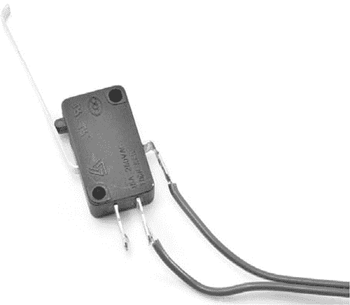

图 4-7：将电线焊接到开关上

现在，将双芯电缆的另一端连接到喇叭的空闲端子和电池的负极端子（见图 4-8）。

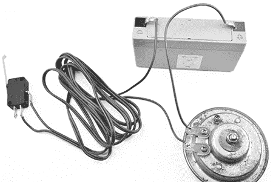

图 4-8：完成的接线

当所有接线完成后，你会发现当你通过移动杠杆来激活开关时，喇叭会响起来。汽车喇叭非常响，所以最好不要在封闭空间中测试——并且在尝试之前提醒你的其他幸存者！

#### 使用触发线警报

很显然，你需要选择一个合适的时机来部署这个项目，以免在完成设置之前自己变成僵尸。当你确定好要保护的开口后，固定一个螺丝或钉子（或者找其他方式固定绳子的一端）在离地面大约 6 英寸（15 厘米）的高度。这样，开关就能被拖行的僵尸或更灵活的僵尸触发，他们可能仅仅是踩到绳子。

将微动开关固定在保护通道的对面，并与绳子的锚点保持相同的高度。大多数微动开关有孔，可以用小螺丝固定。如果没有孔，你可以使用环氧树脂胶或热熔胶枪将开关粘在原位。

将开关放置在与被保护区域相对的另一侧，使得杠杆在保护区域的另一侧。将绳子绑在杠杆的顶部端（见图 4-9）。

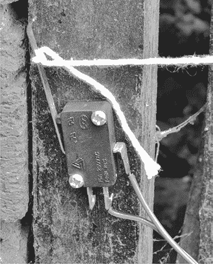

图 4-9：开关固定在位置

不要把绳子拉得太紧。毕竟，你希望它在僵尸穿过时能够脱落，而不是把微动开关从墙上拉下来。最好在一端或另一端打个蝴蝶结。

虽然我使用了汽车喇叭，你也可以使用任何能发出声音并且支持 12V 的设备。或者，如果你更喜欢无声报警，可以用 12V 汽车灯泡代替汽车喇叭。

然而，这两种方法都不算很先进，所以在下一个项目中，你将用一些更高科技的东西来提升你的僵尸报警器。

### 项目 6：PIR 僵尸探测器

本书中的第二个僵尸探测器项目使用了 *被动红外（PIR）探测器*。这些探测器与入侵报警器中使用的探测器相同——它们感应热量的移动——我猜没有什么比一群意图吃掉你的僵尸更具侵略性了。

当然，你可以直接购买（或回收）一个使用 PIR 传感器的入侵报警器，而不是从头开始制作这个项目，但我觉得用 Arduino 制作会更有趣。实际上，如果你只需要为 PIR 报警器增加额外的组件，就可以在 “项目 4：电池监控器”（在第 53 页）中使用相同的 Arduino 来同时监控电池并警告你僵尸袭击，使用相同的蜂鸣器和显示屏。

当僵尸触发 PIR 传感器时，LCD 显示屏将显示消息 *ZOMBIES!!* （图 4-10）。因为在抵御僵尸的同时，你最不想做的就是吸引更多的僵尸，所以这个项目还允许你通过按下 LCD 屏蔽板上的任意按钮来关闭报警器。

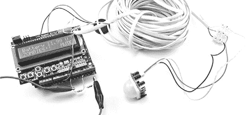

图 4-10：PIR 僵尸探测器

### 你将需要的物品

要制作这个 PIR 报警器，你需要以下部件。如果你已经制作了 “项目 4：电池监控器”（在第 53 页），你已经拥有了 Arduino、螺丝屏蔽板和鳄鱼夹。

| **项目** | **备注** | **来源** |
| --- | --- | --- |
|  Arduino | Arduino Uno R3 | Adafruit, Fry’s (7224833), Sparkfun |
|  Arduino 螺丝屏蔽板 | 螺丝屏蔽板 | Adafruit (196) |
|  PIR 模块 |  | Adafruit (189), Fry’s (6726705), 安防商店 |
|  小型鳄鱼夹导线 |  | 汽车配件店 |
|  3 核电缆 | 长度足够达到 PIR 传感器 | 回收 |
|  端子块 | 3 路，2A 端子条 | 汽车配件店，电器店 |

**僵尸与 PIR 探测器**

我们还没有讨论的一个重要问题是，僵尸是否能触发 PIR 探测器，而 PIR 探测器依赖于检测热量。

虽然僵尸通常被认为是死的，暗示它们是寒冷的，但实际上肌肉无法运动而不产生少量的热量。而且，如果寒冷的僵尸在热源与 PIR 传感器之间移动，传感器将会感应到这种运动。因此，虽然僵尸通常比人类冷，但你可以预期攻击性的僵尸会被 PIR 传感器探测到。

#### 构建

这是另一个可以组装的项目，无需焊接，我的说明假设你是在第四个项目的基础上进行搭建。如果你还没有完成第四个项目，那么你需要先搭建一个稍微修改过的版本，因为 PIR 僵尸探测器的硬件与之大致相同。

##### 步骤 1：搭建螺丝盾

翻到第四个项目，"Construction"在第 55 页，并按照步骤 1 到步骤 3 进行。在步骤 1 中，从*Project_06_PIR_Alarm*中下载程序（Arduino 对程序的称呼），该程序可从* [`www.nostarch.com/zombies/`](http://www.nostarch.com/zombies/)*下载，并将其替换为第四个项目中的程序。同时，在步骤 3 中，除非你还想监控电池电压，否则不需要包括两个电阻。

##### 步骤 2：制作 PIR 传感器的导线

制作一个只在僵尸已经进入与你同一个房间后才能探测到它们的僵尸探测器并没有太大意义。如果它们能走到这一步，可能你早就彻底探测到了它们。因此，你需要将一根长线连接到 PIR 探测器，这样它就能监控走廊、门廊或你生活空间外的其他区域。

PIR 探测器有三根导线：两根供电线和一根输出线，用于指示是否探测到运动。这意味着你需要一根三线导线。你可以找一根入侵报警系统的导线，或者使用电话延长线中的三根线。几乎任何带有三根或更多导线的线都可以使用。

你可以选择将这根导线的两端焊接到 PIR 传感器自带的导线上，或者使用接线端子，如我所做的那样（图 4-11）。

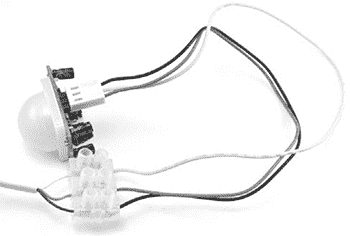

图 4-11：PIR 导线和接线端子

我从一根电话延长线中拆下了三根导线。电缆中有四根实心绝缘线，这些线有颜色编码，所以我用蓝色表示 GND（地线）、橙色表示 5V，条纹白色表示输出线；最后一根线没有使用。这根线大约有 30 英尺（9 米）长，对于传感器来说已经足够了。你也可以使用更长的导线，但在铺设所有电缆之前最好先试一下。

##### 步骤 3：将 PIR 连接到螺丝盾

现在你已经将传感器线延长到合适的长度，将这些线连接到 Arduino 螺丝盾上（图 4-12；注意图中左下角显示的是第四个项目中的两个电阻）。

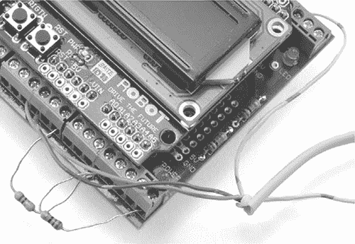

图 4-12：将 PIR 导线连接到 Arduino 螺丝盾

如果你查看 PIR 传感器的背面，你会看到三个引脚分别标记为 GND、OUT 和+5V。将 PIR 传感器的 GND 连接到螺丝盾上的一个 GND 连接，不必在意选择哪个。然后，将 PIR 传感器的+5V 连接到螺丝盾上的 5V 连接。最后，将 PIR 传感器的 OUT 连接到螺丝盾上的 D2。

#### 软件

如果你只想做这个项目，而不依赖任何早期基于 Arduino 的项目，那么使用*Project_06_PIR_Alarm*草图。另一方面，如果你已经做过一个或多个其他 Arduino 项目，并希望将它们包括在内，那么使用*All_Sensors*草图，并在顶部更改常量，选择你已做的项目。

*All_Sensors*草图的前几行如下所示：

```
/*
Any projects that you want to exclude from this program should have a
value of "false". That way, you will not get any false alarms because
of missing hardware.
*/
const boolean project4 = true; // Battery Monitor
const boolean project6 = true; // PIR Alarm
const boolean project10 = false; // Door Monitor
const boolean project11 = false; // Fire Alarm
const boolean project12 = false; // Temperature Monitor
```

在这种情况下，只有电池监控器（项目 4）和 PIR 报警（项目 6）被启用。如果你做了更多的项目，那么将这些项目旁边的值从`false`更改为`true`。如果你是按顺序进行本书的学习，那么程序应该看起来如图所示。

本书的所有源代码都可以从*[`www.nostarch.com/zombies/`](http://www.nostarch.com/zombies/)*获取。有关安装程序的说明，请参见附录 C。

PIR 传感器代码遵循与项目 4 相同的模式，因此有关程序整体工作原理的更多信息，请参考“软件”在第 57 页的内容。这里，我只会描述与本项目相关的代码。

对早期代码的第一个更改是为 PIR 的 OUT 引脚添加了一个新常量。我在`switchPin`常量之后的行中添加了`pirPIN`常量。

```
const int pirPin = 2;
```

我将`pirPin`设置为`2`，因为 PIR 传感器的输出将连接到 Arduino 的 2 号引脚。草图中的下一个添加是在设置函数中，将同一个 2 号引脚设置为输入。

```
pinMode(pirPin, INPUT);
```

尽管 Arduino 的引脚默认作为输入，除非指定为输出，但声明引脚为输入可以使代码更容易理解。

循环函数现在需要检查传感器，所以我添加了对`checkPIR`函数的调用。

```
checkPIR();
```

这个新函数`checkPIR`，顾名思义，将检查 PIR 传感器，并在传感器被触发时采取适当的措施。该函数定义在草图的最后部分。

```
void checkPIR()
{
  if (digitalRead(pirPin))
  {
    alarm("ZOMBIES!!");
  }
}
```

`checkPIR`函数对`pirPin`进行`digitalRead`，以判断 PIR 传感器的输出是`HIGH`还是`LOW`。如果检测到运动，则使用`alarm`函数显示相应的消息。有关使用 Arduino 的输入和输出的更多信息，请参阅附录 C。

#### 使用 PIR 僵尸探测器

该项目与电池监视器配合使用效果良好，因为你可以直接用同一块电池供电。不过，无论你是否将这两个项目结合使用，在将 PIR 探测器部署到操作基地时，请注意电缆线。如果你使用的是含有实心核心线的电缆，那么请在电缆长度的定期间隔处将电缆固定在墙上。实心核心线不适合反复弯曲。

#### 回收的 PIR 传感器

本项目中使用的 Adafruit PIR 模块设计为与像 Arduino 这样的微控制器模块一起使用。但在末日之后，你可能会发现获得那种用于安全系统的常规 PIR 传感器更为容易，比如从 eBay 上购买的无品牌单元，价格仅几美元，已在图 4-13 中打开展示。

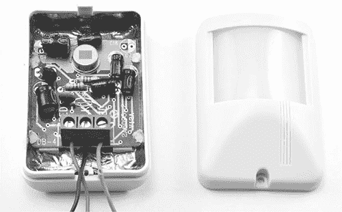

图 4-13：用于入侵报警的 PIR 模块

这个传感器不能在 5V 下工作，而是需要 12V 电源。传感器具有逻辑电平输出，输出电压会升高到 3.6V，足以被识别为 `HIGH`，就像 Adafruit 模块一样。唯一不同的是，这个传感器的红线需要连接到 Arduino 的 V[in] 引脚，而不是 5V。

请注意，其他传感器可能外观相似，但输出电压不同。一些传感器（带开集电极输出）需要在输出端与 Arduino 的 5V 之间连接一个上拉电阻（比如 1 kΩ）。如果当你在传感器前挥动手时，传感器的输出没有产生有效电压，那么它几乎可以确定需要一个上拉电阻。

其他类型的 PIR 传感器，尤其是那些用于控制照明的传感器，通常具有继电器输出。该输出像开关一样工作，当检测到运动时会闭合。电路图展示了如何将三种不同类型的 PIR 模块连接到 Arduino（见图 4-14）。

尽可能选择有文档支持的设备，这样你就不必猜测它的输出工作原理以及如何接线。

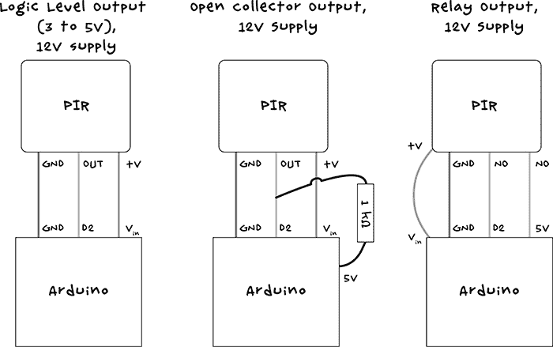

图 4-14：将不同类型的 PIR 模块连接到 Arduino

下一章将从自动僵尸检测进入，介绍多个监控项目，让你在僵尸闯入你家门前就能看到他们的动向。你将能够使用网络摄像头远程监视僵尸。
