## **监控与树莓派**


现在你已经能检测到僵尸了，监控它们的动作也是个好主意。不过不要冒险跟着它们走，否则你可能会加入“亡者行列”！从基地内安全地观察它们，你的大脑才能保持完整。本章将教你如何使用 USB 和无线网络摄像头，通过树莓派单板计算机搭建监控摄像头系统，以最大限度地减少能源使用（见图 5-1）。

本章中的两个项目都需要你下载软件，因此最好提前思考并在灾难来临之前设置好系统。


图 5-1：僵尸对着摄像头微笑并挥手

### 树莓派

你可以用普通的笔记本电脑或台式机来运行这些项目，但这些设备的功耗相当大。笔记本通常消耗 20W 到 60W 的功率，而台式机的功耗更高。而且，你还需要一个交流电逆变器。笔记本的电源提供的是低压直流电，但通常电压仍高于 12V，所以无法直接从 12V 电池供电。

此外，如果因为僵尸密度太高而不得不搬迁基地，你真的想冒着被沉重的桌面塔机拖累的风险吗？

树莓派是一个微型 Linux 计算机，尺寸大约与信用卡相当，功耗低于 3W。本项目中使用的是树莓派 B+型号，并且本书中的所有内容都基于这一型号（见图 5-2）。如果你恰好拥有较旧的树莓派 B 型号或更新的树莓派 2 型号，它们也应该能够正常工作。实际上，树莓派 2 的额外性能应该使得网络摄像头的浏览页面显得更快。A 和 A+型号不太适合，因为它们的性能较差，内存也比其他型号少。

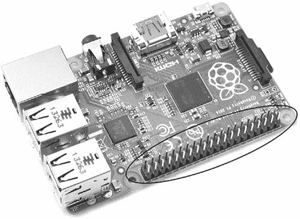

图 5-2：树莓派 B+型号

树莓派可以运行简单的 Python 脚本，并且可以与外部硬件连接。例如，在“项目 7：使用 USB 摄像头监控僵尸”一节中，若网络摄像头检测到运动，LED 灯会通过树莓派的 GPIO（通用输入输出）接口从绿色变为红色。GPIO 接口就是板子一侧的双排引脚（见图 5-2）。

#### 树莓派系统

完整的树莓派系统包括一个 USB 键盘、一个鼠标和一个小型 HDMI（高清多媒体接口）显示器（见图 5-3）。

键盘和鼠标是标准物品，你可以在任何地方购买。为了能够持续查看你的僵尸敌人，你需要一个显示视频的设备，你可以将普通的电视或显示器连接到树莓派。然而，为了节省更多的电力，本项目使用了一个带 7 英寸（180 毫米）显示屏的 12V DC 显示器。最糟糕的情况下，这可能会将功耗翻倍，达到最高 6W。

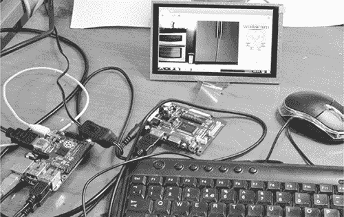

图 5-3：一个树莓派系统

#### 你将需要的物品

如本书所述，要使用 12V 电池运行树莓派系统，你需要以下物品。

| **项目** | **说明** | **来源** |
| --- | --- | --- |
|  树莓派 | Model B+ 或 Pi 2 配备 NOOBS 微型 SD 卡 | Adafruit (2358)，Fry’s (8258726) |
|  小型 HDMI 显示器 | 12V HDMI 显示器。建议设备具有 800×480 像素分辨率。 | Adafruit (1934)，eBay |
|  键盘和鼠标 | 标准 USB 键盘和鼠标 | 电脑商店，在线 |
|  HDMI 电缆 | 尽可能短 | 电脑商店，在线 |
|  12V 到 USB 适配器 | 最小电流为 1A | 汽车零件店，电脑商店 |
|  车辆到 2.1 毫米插口适配器 |  | 汽车零件店 |
|  有源 USB 集线器 | 仅在你使用树莓派 Model B 时需要 | 电脑商店，在线 |

如果你使用的是仅有两个 USB 插口的树莓派 Model B，那么你需要一个有源 USB 集线器，或者一个无线键盘和鼠标组合，这种组合使用一个 USB 适配器。否则，键盘和鼠标将占用 Model B 的两个 USB 端口，你将无法插入下一个项目所需的摄像头。

#### 系统供电

树莓派通过微型 USB 插口供电，因此当你从 12V 电池为其供电时，可以使用 12V 到 USB 的电源适配器。我建议的显示器有一个独立的驱动板，用于为显示器供电并将其连接到树莓派；这就是图 5-3 中间的印刷电路板（PCB）。这个驱动板有一个 2.1 毫米的 DC 电源插口。

一个结合了点烟器插口和 USB 插座的适配器（如图 5-4 所示）是通过电池为整个系统供电的好方法。如果你还没有这样做，你需要将点烟器插头替换为一对鳄鱼夹，以便将适配器连接到电池上。有关如何将 12V 电池连接到低电压设备的说明，请参见第三章。

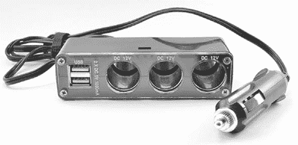

图 5-4：结合 USB 和 12V DC 电源适配器

使用 图 5-4 中的电源适配器设置，您可以通过普通的 micro USB 线为树莓派供电，并且在 “项目 8：无线丧尸监控系统” 中，使用 DC 插孔转点烟器适配器为 Wi-Fi 网络摄像头和路由器供电。请检查路由器和 Wi-Fi 网络摄像头所用的电压，它们很可能是 12V DC，这对于您已经为末日存储汽车电池的人来说，非常实用。

**警告**

在处理显示器时要小心，特别是如果显示器背面是金属的。驱动板的裸露底面很容易与金属短路，可能会损坏板子。

要将驱动板连接到您库存中的汽车电池，只需做一个一端带有 2.1 mm 插头、另一端带有鳄鱼夹的连接线。然而，如果您的电池已经被鳄鱼夹过载，您可能希望改用多功能点烟器插座适配器。这样，您可以将各种设备插入适配器的点烟器插口，具体描述见 “点烟器插座” 和 第 46 页。

#### 安装 RASPBIAN

树莓派计算机没有硬盘。相反，树莓派 2 和 Model B+ 将其操作系统、程序和数据存储在 micro SD 卡中。较旧的树莓派型号则使用常规的 SD 卡存储这些信息。丧尸 apocalypse 之后将没有互联网，所以请获取一张预装操作系统（OS）的 micro SD 卡——您将无法再下载它。事实上，一张预装了操作系统的 SD 卡，通常价格不会比单独购买树莓派更贵，因此我建议直接购买带预装卡的树莓派。如果您确实想要将操作系统添加到空白的 SD 卡中，请访问 *[`www.raspberrypi.org/help/noobs-setup/`](http://www.raspberrypi.org/help/noobs-setup/)* 并按照页面上的说明进行操作，赶在互联网消失之前完成。

无论您是购买预装的 micro SD 卡，还是自己添加软件，本书假设您使用的是带有树莓派基金会 NOOBS（开箱即用软件）安装程序的 micro SD 卡。拥有该卡后，将其插入树莓派；连接键盘、鼠标和显示器；然后打开电源。

**注意**

我建议用于本项目的显示器应该通过 HDMI 电缆检测到树莓派，树莓派应自动检测屏幕分辨率。如果树莓派未能自动检测分辨率，请访问树莓派的文档页面 ([`www.raspberrypi.org/documentation/`](http://www.raspberrypi.org/documentation/))，进入配置部分，阅读 config.txt 以了解如何配置您的树莓派。请打印这些说明并与本书一起保存，以便在互联网消失后可以随时参考。

当你通过 NOOBS 启动树莓派时，会提供操作系统选择界面。本书使用的是 Raspbian，所以选择 Raspbian 旁边的复选框，然后点击**安装**。安装过程会花一些时间，所以在等待时可以查看你的 PIR 僵尸探测器或检查一下你的电池存货。安装完成后，你就可以继续操作了。

Raspbian 发行版自带了一个相当全面的软件包集，但在写本书时，唯一缺少的是一个能与网络摄像头兼容的好浏览器。我个人偏爱 Chromium，它是 Google Chrome 的衍生版，运行良好且不会占用树莓派过多资源，从而避免让树莓派变得“僵尸化”。像大多数免费软件一样，你需要从互联网上下载 Chromium。

如果现在还不晚，那就将树莓派连接到你的末日前家用调制解调器或路由器，并用以太网线连接。接下来，为了安装 Chromium，点击树莓派桌面上的**LX Terminal**图标。终端窗口应该会打开，最初你只会看到一个闪烁的光标和像这样的命令提示符：

$

每当你需要输入本书中项目的命令时，我会在左边显示一个美元符号命令提示符，你不需要输入它。现在，输入以下命令：

$ sudo apt-get update

$ sudo apt-get install chromium

`sudo`（代表*substitute user do*）命令允许你执行管理员命令。对于需要管理员权限的命令（比如安装新软件的命令），需要将其添加到命令前面，就像我们现在要做的那样。

`apt-get`是基于 Debian 的 Linux 发行版（如 Raspbian）上的软件包管理工具，用于管理和安装软件。与`apt-get`一起使用的`update`命令会让系统更新其缓存的可用软件列表，来自互联网的软件库。`apt-get install`命令会告诉`apt-get`搜索并安装指定软件包的最新版本，在此案例中是 Chromium。

在安装了 Chromium 之后，你已经准备好构建你的监控系统了。现在，让我们来监控一些僵尸吧！

### 项目 7：用 USB 网络摄像头监控僵尸

本项目使用的是一个低成本的 USB 网络摄像头，它通过长线连接到树莓派。USB 2.0 线缆的最大使用长度为 96 英尺（30 米），所以你的摄像头与树莓派之间的最大距离就是这个。

你可以在图 5-5 中看到大部分的设置，尽管网络摄像头位于左侧，超出了视野；我已经在插图中展示了它。自己构建监控系统而不是直接使用现成的闭路电视（CCTV）系统的一个好处是，因为软件完全由你控制，你可以根据自己的需求进行定制。

摄像头由一个简短的 Python 程序控制，该程序监视捕捉到的图像是否有变化。当屏幕上检测到运动时，程序使用树莓派的 GPIO 引脚将 RGB（红绿蓝）LED 从绿色变为红色。你可以通过按下键盘上的空格键取消警报，这将使 LED 重新变为绿色。

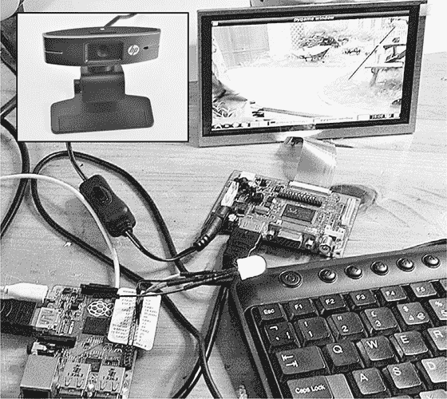

图 5-5：僵尸摄像头和运动警报

这个项目相对于 “项目 6：PIR 僵尸探测器” 在 第 72 页 的优势在于，当警报被触发时，你可以仔细查看即将攻击你的僵尸。

#### 你需要的设备

要设置这个 USB 摄像头，你需要按照 “树莓派” 中在 第 82 页 描述的树莓派设置以及此处描述的其他设备。

| **项目** | **说明** | **来源** |
| --- | --- | --- |
|  USB 摄像头 | 查看 [`elinux.org/RPi_USB_Webcams/`](http://elinux.org/RPi_USB_Webcams/) 获取兼容的摄像头。 | 电脑商店 |
|  USB 延长线 | 长度适合你的场所（少于 100 英尺 [30 米]） | 电脑商店 |
|  树莓派鱿鱼 | 包含 RGB LED | 亚马逊，[`www.monkmakes.com/`](http://www.monkmakes.com/) |

不是所有 USB 摄像头都与树莓派兼容，因此请查看 *[`elinux.org/RPi_USB_Webcams`](http://elinux.org/RPi_USB_Webcams)* 获取兼容的摄像头列表。我使用的是 HP 2300 摄像头。

**注意**

树莓派相机模块是一款高分辨率相机，直接插入树莓派上的专用接口。如果你在制作树莓派相机，这个模块非常适合，但在这种情况下，它并不太有用，因为你希望相机距离树莓派有一定距离。

树莓派鱿鱼是一个专为树莓派设计的小配件。它有一个带内置限流电阻的 RGB LED，可以直接连接到树莓派的 GPIO 引脚。它的设计是开源的，你可以在这里找到如何制作自己的详细信息：*[`github.com/simonmonk/squid/`](https://github.com/simonmonk/squid/)*。你也可以购买现成的鱿鱼；详情请见 *[`www.monkmakes.com/`](http://www.monkmakes.com/)*。

#### 构建过程

在完成 “树莓派系统” 中的设置后，第 83 页，要搭建这个项目，你只需将树莓派鱿鱼连接到树莓派的 GPIO 接口，插入 USB 摄像头，为显示器提供 12V 电源，并为树莓派提供 5V 电源（见 图 5-6）。

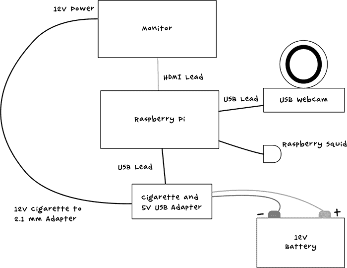

图 5-6：监控系统的原理图

##### 步骤 1：连接树莓派鱿鱼

通过控制树莓派章鱼的三个输出，你可以使 LED 显示任何颜色。然而，由于该监控系统仅需显示红色和绿色，因此这个项目不会充分利用配件的全部潜力。

为了帮助识别 GPIO 引脚，你可以使用 GPIO 引脚识别模板。很多供应商，比如 Adafruit，都提供这种模板，其中包括购买现成的树莓派章鱼时附带的 Raspberry Leaf。将这个模板放置在 GPIO 接口上，帮助你识别每个引脚的功能。然后将树莓派章鱼连接到 GPIO 接口（图 5-7）。

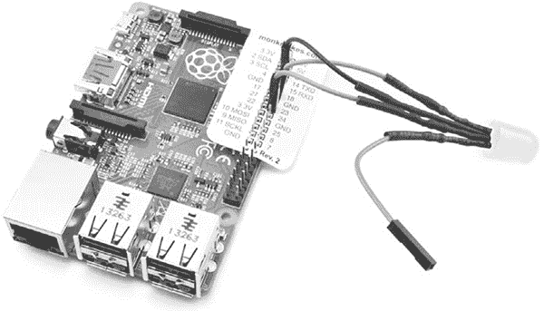

图 5-7：将树莓派章鱼连接到 GPIO 接口

树莓派章鱼的黑色引线连接到树莓派上的一个 GND 引脚。在所示方向下（图 5-7），这是右侧的第三个引脚。树莓派章鱼的红色引线连接到树莓派的 18 号引脚，绿色引线连接到树莓派的 23 号引脚。由于你不需要蓝色引线，可以将其悬空，但如果你希望保持线缆整齐，只需将蓝色引线连接到 GPIO 接口的其他 GND 引脚即可。

##### 步骤 2：安装 USB 摄像头

如果你已经有一个 USB 摄像头，首先检查它是否可以与树莓派兼容，避免再购买新的。首先，通过在 LXTerminal 中运行命令 `lsusb`，查看树莓派是否可以将摄像头识别为 USB 设备，记得在插入摄像头前后都执行一次，而不要使用 USB 延长线。

$ lsusb

总线 001 设备 002：ID 0424:9514 Standard Microsystems Corp.

总线 001 设备 001：ID 1d6b:0002 Linux Foundation 2.0 根集线器

总线 001 设备 003：ID 0424:ec00 Standard Microsystems Corp.

总线 001 设备 004：ID 03f0:e207 惠普

总线 001 设备 006：ID 04d9:1603 Holtek Semiconductor, Inc. 键盘

总线 001 设备 005：ID 1c4f:0034 SiGma Micro

如果在你运行命令并插入摄像头后出现额外的条目，那么该条目应该是你的摄像头。在我展示的列表中，我的惠普摄像头是从上往下数的第四个条目。

如果你的摄像头没有出现在列表中，尝试拔掉摄像头，重新插入并再次运行 `lsusb` 命令。如果这样仍然不起作用，尝试重启树莓派。

不幸的是，仅被识别为 USB 设备并不能保证网络摄像头能够在树莓派上正常工作。你可以在运行程序时确定这一点。你可能还会发现，只有将摄像头插入带电的集线器，摄像头才会正常工作。如果你使用的是较旧版本的树莓派，你可能会发现，当你将摄像头插入 USB 端口时，整个主板会重启。如果是这种情况，建议在树莓派关闭电源时插入摄像头。

##### 步骤 3：安装软件

使用以太网线将 Raspberry Pi 连接到网络，确保互联网连接正常，然后下载本书中项目所需的 Raspberry Pi 程序。在 Pi 上的浏览器中，你可以访问 *[`www.nostarch.com/zombies/`](http://www.nostarch.com/zombies/)*，点击链接进入 GitHub，下载 *Raspberry Pi* 目录。对于这个项目，你将使用 *usb_webcam* 目录中的代码。但将软件直接克隆到 Raspberry Pi 上是最简单的方法，正如我在 “从 GitHub 获取源代码” 中所描述的那样。

Python 程序 *monitor.py* 相对简短，考虑到它的功能，接下来我会带你了解它。虽然我不会讲解 Python 本身，但会讲解与本书中项目相关的部分。如果你是 Python 新手，可能需要参考我另一本书，*《编程 Raspberry Pi：Python 入门》*（McGraw-Hill，2013）。

**从 GitHub 获取源代码**

你可以通过直接克隆本书的 GitHub 仓库，将本书中使用的所有 Raspberry Pi 程序一次性下载到 Raspberry Pi 上。只需在 Raspberry Pi 的终端窗口中输入以下命令。

$ cd /home/pi

$ git clone https://github.com/simonmonk/zombies.git

这些命令将获取本书中的所有代码，包括其他项目中使用的 Arduino 代码（你可以在本章中忽略它）。即使你不使用浏览器，你仍然需要一个互联网连接才能使这些命令生效，所以在末日到来之前一定要获取这些代码。

程序首先导入它所需的各种 Python 模块。这些现有代码的库都包含在 Raspbian 发行版中，因此你不需要单独安装它们。

```
import sys
import time
import pygame
import pygame.camera
import RPi.GPIO as GPIO
```

`sys` 和 `time` 模块提供了一些通用工具，用于访问操作系统并能够让程序进入休眠状态，以延迟它的活动一段时间。`pygame` 模块包含 Pygame 图形游戏库，其中包括摄像头接口。为了控制 LED，程序需要访问 GPIO 系统，这通过 `RPi.GPIO` 库来提供。

接下来，程序定义了一些常量，供它使用。如果你想使用不同分辨率的摄像头或将默认窗口大小设置得更大，你可以修改这些常量。

```
camera_res = (320, 240)
window_size = (640, 480)
red_pin = 18
green_pin = 23
```

在 `camera_res` 和 `window_res` 常量后面的括号内的参数分别是宽度和高度（以像素为单位）。在定义这些常量后，Pygame 系统（用于显示摄像头图像）和摄像头本身将被初始化，同时还会初始化你将用来控制 Raspberry Squid 的 GPIO 端口：

```
➊ pygame.init()
  pygame.camera.init()

  # initialize GPIO
➋ GPIO.setmode(GPIO.BCM)
  GPIO.setup(red_pin, GPIO.OUT)
  GPIO.setup(green_pin, GPIO.OUT)

➌ screen = pygame.display.set_mode(window_size, 0)

  #Find, open, and start the low-res camera.
➍ cam_list = pygame.camera.list_cameras()
  webcam = pygame.camera.Camera(cam_list[0], camera_res)
  webcam.start()
➎ old_image = False
```

初始化代码的前两行➊处理 Pygame 和摄像头，接下来的三行➋初始化那些 GPIO 端口。然后屏幕被初始化➌为`window_size`指定的窗口大小。最后一组代码➍首先查找连接到树莓派的所有摄像头，然后创建一个链接到第一个摄像头（`webcam`）。接着它开始运行摄像头。最后一行➎定义了一个名为`old_image`的变量，用来通过检测连续帧之间的变化来判断是否有运动。

初始化后，这个程序定义的第一个函数是`check_for_movement`。

```
def check_for_movement(old_image, new_image):
    global c
    diff_image = pygame.PixelArray(new_image)
      .compare(pygame.PixelArray(old_image), distance=0.5, 
      weights=(0.299, 0.587, 0.114))

    ys = range(0, camera_res[1] / 20)
    for x in range(0, camera_res[0] / 20):
        for y in ys:
            if diff_image[x*20, y*20] > 0:
                return True
    return False
```

正如名称所示，`check_for_movement`函数接受两张图像，前一帧（`old_image`）和最新一帧（`new_image`），并对比它们。传递给`compare`的`distance`参数是两张图像中相同像素的颜色之间的“距离”。`weights`参数在`pygame`文档中没有解释，这里使用的值是基于`pygame`文档中的一个`PixelArray`示例(*[`www.pygame.org/docs/ref/pixelarray.html`](http://www.pygame.org/docs/ref/pixelarray.html)*).

比较结果生成一张新的图像，名为`diff_image`，它只有在两张图像的像素之间发现差异时，才会显示白色像素。

为了判断是否发生了运动，程序应该遍历`diff_image`中的每个像素。但是任何较大的运动都会导致大量像素发生变化，而僵尸体积较大，因此代码通过仅采样每 20 个像素中的一个来加速处理。

接下来的两个函数将树莓派的 LED 设置为红色或绿色。

```
def led_red():
    GPIO.output(red_pin, True) 
    GPIO.output(green_pin, False) 

def led_green():
    GPIO.output(red_pin, False) 
    GPIO.output(green_pin, True) 
```

树莓派小鱿鱼只是一个 RGB LED，就像大多数 RGB LED 一样，你可以通过在 LED 连接的 GPIO 引脚上输出特定的高（`True`）和低（`False`）组合来选择它发光的颜色。在这个项目中，你只需要选择红色和绿色，因此代码只需将适当的引脚设置为`True`，另一个设置为`False`。蓝色在这个项目中不参与，所以你不需要在代码中处理它。

最后，我们进入程序的主循环，在这里获取并缩放新图像，使其准备好显示在窗口中。

```
count = 0
led_green()
while True:
    count = count + 1
    new_image = webcam.get_image()
    # Set old_image the first time around the loop.
    if not old_image:
        old_image = new_image
    scaled_image = pygame.transform.scale(new_image, window_size)
    # Only check one frame in 10.
    if count == 10 :
        if check_for_movement(old_image, new_image):
            led_red()
        count = 0

    old_image = new_image
    screen.blit(scaled_image, (0, 0))
    pygame.display.update()
```

`count`变量跟踪循环运行的次数。当`count`达到 10 时，最后两张图像会被比较。只采样十分之一的时间也加速了程序，否则程序会变得太慢。如果有运动，意味着`check_for_movement`返回`True`，LED 会变成红色。

主循环的最后部分检查关闭窗口事件（停止程序）。

```
# Check for events.
for event in pygame.event.get():
    if event.type == pygame.QUIT:
        webcam.stop()
        pygame.quit()
        sys.exit()
    if event.type == pygame.KEYDOWN:
        print(event.key)
        if event.key == 32: # Space
            led_green()
```

事件检查还会捕捉到任何按键事件（`KEYDOWN`），如果按下空格键，程序将把 LED 重新设置为绿色。

#### 使用摄像头

要启动摄像头，运行 *monitor.py*，通过在树莓派的终端窗口输入以下命令。一个窗口应该会打开，显示摄像头的视图（图 5-8）。

$ cd "/home/pi/zombies/Raspberry Pi/usb_webcam"

$ sudo python monitor.py

到此为止，树莓鱿鱼的 LED 灯应该是绿色的。要测试运动检测功能，可以在摄像头前挥动手。LED 灯应该会变成红色，并保持红色，直到你按下树莓派键盘上的空格键。

当摄像头与树莓派直接连接并且一切正常时，你可以使用 USB 延长线将摄像头放得更远。将摄像头放在一个俯瞰基地入口的位置，这样你就可以知道什么时候外面安全可以出去。

摄像头的移动距离会有限制，超出范围信号会衰减并开始出现错误，所以尽量将电缆长度保持在 30 米以内。

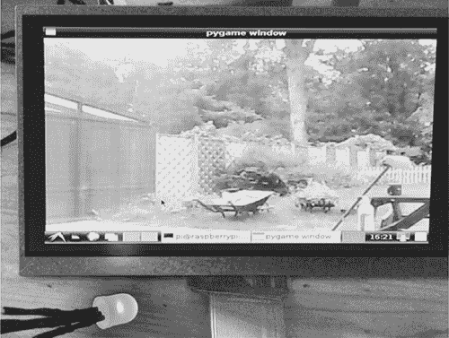

图 5-8：USB 网络摄像头的使用

### 项目 8：无线僵尸监控系统

灾后可能没有互联网，但这并不意味着你不能自己搭建一个无线网络并连接一个 Wi-Fi 网络摄像头。你可以使用一款低成本的摄像头来进行这个项目（图 5-9）。使用无线摄像头，你可以将自己与监控中的僵尸之间保持更远的距离，这让你比以往更加安全。

一旦设置好摄像头和本地网络，你就可以通过树莓派的浏览器（图 5-10）或甚至是 Wi-Fi 配备的平板电脑或智能手机来查看摄像头视频。而且，如果你购买合适的摄像头，你将能够使用软件改变摄像头的方向。

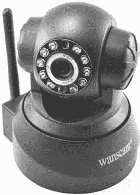

图 5-9：一款低成本的 Wi-Fi 网络摄像头


图 5-10：将 Wi-Fi 网络摄像头与树莓派一起使用

当然，这一切是有代价的：Wi-Fi 消耗了相当多的电力。无线路由器和 Wi-Fi 网络摄像头每个可能都会消耗 5W 到 10W 的电力。你需要仅在需要时才打开它们。

请注意，图 5-8 中的树莓派仍然连接着树莓鱿鱼（Raspberry Squid），即使这个项目并不使用鱿鱼。保持项目 7 的硬件连接，你就可以从两台摄像头监控僵尸！

#### 你将需要的设备

要设置这个 Wi-Fi 网络摄像头，你需要在 第 83 页中描述的 “树莓派系统” 配置，以及以下附加设备。

| **物品** | **备注** | **来源** |
| --- | --- | --- |
|  Wi-Fi 网络摄像头 | 最好是可以旋转的设备（$50） | 电脑商店，eBay |
|  无线路由器 | 低端设备（$20），需要 12V DC 电源 | 电脑商店，eBay |
|  2x 以太网电缆 | 长度不限。 |  |
|  2x 12V 适配器线 | 2.1 毫米插头转点烟器适配器 | 汽配店 |

Wi-Fi 网络摄像头的价格差异很大。我选择的这款属于低价位，虽然图像质量不是特别好，但足够用来识别僵尸。

Wi-Fi 路由器就是一个普通的家用路由器；大多数有互联网接入的家庭可能都有好几个，我敢打赌你家也有一个备用的。这些设备有两个用途：首先，将你的设备连接到互联网（但在僵尸遍地的情况下这是不可能的），其次，建立一个局域网（LAN），你可以连接有线和无线设备。我们将在这里使用 Wi-Fi 路由器的第二个功能。

#### 构建

这个项目使用的是现成的组件，因此你不需要进行电子电路的构建。你只需要连接这些组件（图 5-11）。

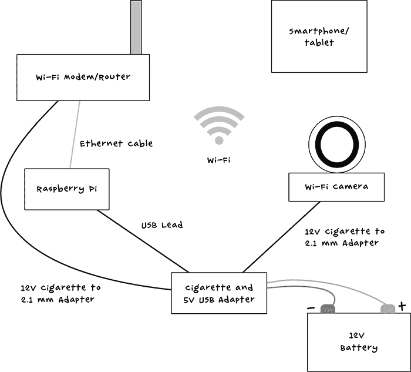

图 5-11：Wi-Fi 摄像头系统的示意图

将平板电脑或智能手机连接到 Wi-Fi 网络（图 5-11）并非必需，但它可以让你通过移动设备和树莓派屏幕同时监控摄像头。

##### 步骤 1：设置局域网（LAN）

由于该网络不会连接到互联网，因此只需要一个路由器。这意味着即使你有一个调制解调器路由器组合，也无需将其连接到电话线或有线连接。

路由器允许设备通过两种方式连接：使用以太网电缆或使用 Wi-Fi。我们将通过以太网电缆连接树莓派，因为有线连接比 Wi-Fi 更可靠，且能耗更低。

一旦你将树莓派连接到路由器，Pi 应该会自动使用 DHCP（动态主机配置协议）加入网络，所以你不需要进行设置。不过，在这个时候，你可能需要设置路由器的 Wi-Fi 细节。这将涉及连接到路由器的配置页面。这个页面的 IP 地址通常是 192.168.1.1，但在我的情况下，它是 192.168.1.254。换句话说，检查你的路由器文档。当你知道路由器管理页面的地址时，打开 Chromium 浏览器并在地址栏中输入该 URL。

路由器的管理页面应该有一个无线、WLAN 或 Wi-Fi 设置页面。找到此页面并设置无线网络名称（也叫 ESSID）和密码（图 5-12）。

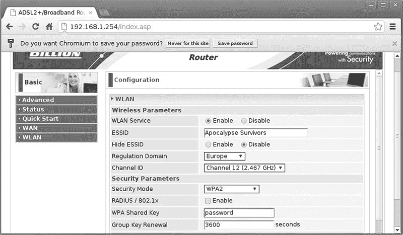

图 5-12：设置无线网络

将网络名称设置为类似*末日幸存者*的名字，这样技术高手幸存者就能轻松找到你。你的幸存者小组永远需要更多的极客，尤其是如果你看起来能比他们跑得更快的话。

##### 步骤 2：设置 Wi-Fi 摄像头

Wi-Fi 摄像头无法在不知道你的密码和网络名称的情况下连接到无线网络。为了提供这些信息，你需要通过浏览器连接到它，但首先它必须连接到网络。这是一个小问题。幸运的是，这是一个可以通过使用以太网电缆将 Wi-Fi 摄像头连接到路由器来解决的问题。使用有线连接不需要密码，摄像头应该像树莓派一样使用 DHCP 连接到网络。设置完成后，你可以断开以太网电缆，Wi-Fi 摄像头将自由使用无线网络！

将 Wi-Fi 摄像头连接到路由器，然后回到你之前用来设置无线网络的路由器管理页面。你可以再次使用它来查找摄像头的 IP 地址，以便进行配置。这次，你需要查找名为 DHCP 表格或 ARP（地址解析协议）表格的页面。图 5-13 展示了我的路由器的 ARP 表。

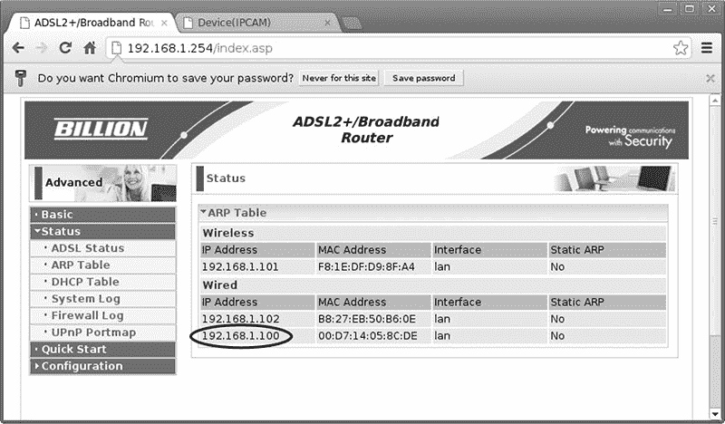

图 5-13：查找摄像头的 IP 地址

连接到摄像头的是有线连接，因此摄像头的 IP 地址是 192.168.1.102 或 192.168.1.100。你可以通过在 LXTerminal 中输入 ifconfig 命令来找出这两个 IP 地址中的哪一个是树莓派的地址。你应该能在命令的响应中看到其中一个地址，那就是树莓派的地址。

我的树莓派的 IP 地址是 192.168.1.102，因此通过排除法，我的摄像头的 IP 地址是 192.168.1.100。打开浏览器的新标签页并连接到该 IP 地址，在地址的最后加上：99（我将浏览器指向 192.168.1.100:99）。这个额外的数字指定了用于网络摄像头的端口。在大多数情况下，这个端口是 99，但如果你使用的是其他摄像头，检查你的文档，因为它的端口可能不同。

**注意**

任何 IP 地址后都可以跟一个端口号。例如，大多数 Web 流量使用端口 80，这是默认端口。网络摄像头恰好使用端口 99，所以必须在 URL 中指定这个端口。

浏览器应立即开始显示来自摄像头的视频以及用于平移和倾斜摄像头的控制按钮。页面的某个地方，应该能看到一个设置链接。点击此链接并查找无线局域网设置。点击**无线局域网设置**，你应该会看到一个扫描无线网络的选项（图 5-14）。

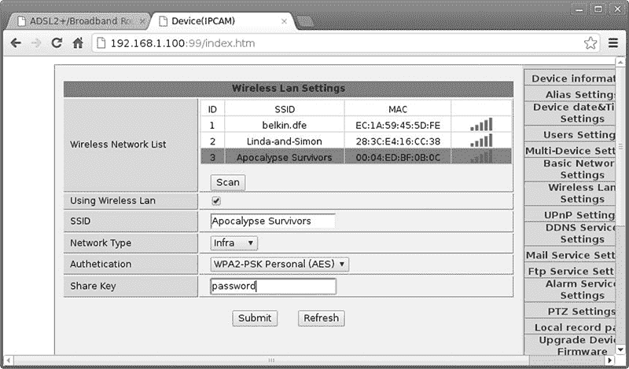

图 5-14：将摄像头连接到无线网络

选择*末日幸存者*网络，输入密码（也称为*共享密钥*），然后点击**提交**。摄像头应该会重启，接着你可以拔掉以太网线，因为从现在开始，摄像头将使用 Wi-Fi 连接。

一旦摄像头切换到使用 Wi-Fi，它将拥有一个不同的 IP 地址，因此请返回路由器的管理页面（图 5-13）。这时，列表的无线部分应该会有一项代表摄像头的条目。尝试使用该 IP 地址并在末尾加上:99 来访问摄像头。视频应该会出现在浏览器窗口中，并显示摄像头控制界面（图 5-15）。

使用 DHCP 为摄像头分配地址时的一个问题是，如果路由器重启，可能会分配一个不同的 IP 地址。为避免此问题，请在路由器的 DHCP 设置中查找设置租期的选项，并将其设置为最大值。这样，一旦 IP 地址分配完成，它就不会改变，直到文明重建后的一段时间。

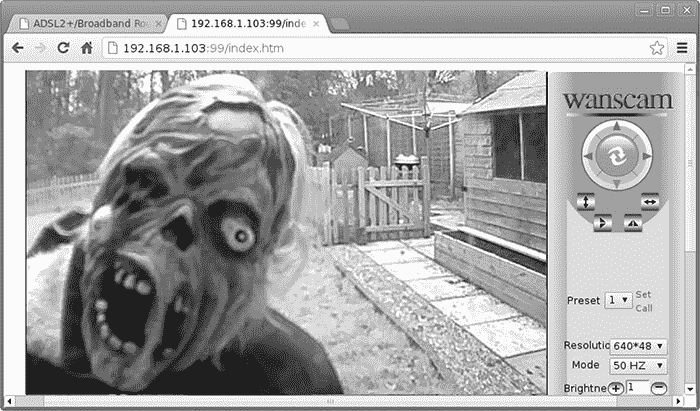

图 5-15：Wi-Fi 摄像头视图

#### 使用 Wi-Fi 网络摄像头

一旦一切设置完成，你可以通过在浏览器中输入摄像头的 URL 来查看来自摄像头的图像。大多数摄像头的软件还允许你设置多个摄像头，并将屏幕分成两部分或四部分，这样你就可以同时监控所有图像。然后，你可以同时监视入口、物资储藏、你建造的僵尸陷阱和街对面的幸存者！

你还可以通过智能手机或平板电脑上的移动浏览器访问摄像头。摄像头可能还会有一个应用程序，比浏览器更好用。这样，你就可以在复合区的一个区域工作，同时通过移动设备监控另一个区域。我使用的摄像头附带的应用程序包括一个功能，可以在检测到运动时发送警报。

在下一章中，你将学习如何控制电动门闩。完成该项目后，你将能够远程解锁门并更快地进入。你还将能够检测到门是否打开，以防万一不死生物开始攻占你的基地。
