## 第六章：**增加远程访问并检测开门**


在末日后的世界中，控制进入基地的权限至关重要。假设你正被一群嗜脑的僵尸追赶。你终于到达了基地，只需进去就能再活一天。不要在摸索钥匙时被吃掉，赶紧解锁进入！为了帮助你，本章包括一些可以在不接触门的情况下解锁（或锁上）门的项目。只要记住，在按下任何门控按钮之前，一定要先检查监控系统；不管有人怎么礼貌地敲门（见图 6-1），你永远不知道他们是活人还是死者。

本章的第一个项目将允许你只需按下按钮，甚至通过无线扩展遥控开门。另一个项目使用簧片开关来检测门是否被打开，并通过同样的 Arduino 系统提醒你，正如你在“项目 4：电池监控”（第 53 页）和“项目 6：PIR 僵尸探测器”（第 72 页）中使用的那样，前者用于监测电池电压，后者则通过 PIR 传感器检测僵尸。


图 6-1：末日后访问控制

### 项目 9：远程门锁

首先，让我们让你进入基地的安全区域变得更容易一些。通过使用电磁门闩，你可以按下按钮打开门，避免发出吸引附近僵尸的钥匙碰撞声。这个项目使用的是 12V 门闩。这个门闩将与现有的门锁一起使用，你可以通过更换锁通常与之接合的插座来将其安装到现有的门上，如图 6-2 所示。请注意中间部分的门闩，由电磁铁释放。

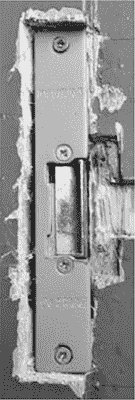

图 6-2：电磁门闩

本项目的第一部分构建了一个简单的电控锁。按下按钮解锁门（见图 6-3），只要你按住按钮，门就会保持解锁状态。如果你和其他幸存者一起生活，这个按钮可能安装在基地内部，随时可以让其他人进入。然而，如果你是独自一人，可能希望将按钮安装在基地外部，门旁边，但要安装得高一点，以免被僵尸不小心触发。

这个项目的可选第二部分让你使用射频（RF）遥控模块来解锁门（见图 6-4）。遥控门可能会救你一命，让你可以冲向锁住的门，在快到达时解锁，并将门砰地关在追赶你的僵尸面前。

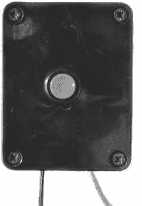

图 6-3：门控按钮

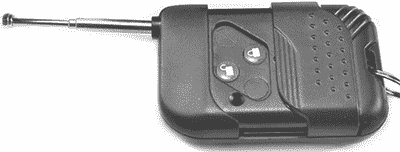

图 6-4：无线遥控器

#### 你需要的材料

要制作这个项目，你需要以下零件和工具：

| **项目** | **备注** | **来源** |
| --- | --- | --- |
|  电钻和木工钻头 | 你需要更大的钻头，可能需要半英寸大小，具体取决于门闩的宽度。 | 五金店 |
|  锤子 | 同时也能作为一件实用武器 | 五金店 |
|  凿子 |  | 五金店 |
|  电动门闩 | 12V DC | Farnell, Fry’s, 安全商店 |
|  熔断器 | 10A 熔断器和熔断器座 | 汽车配件店 |
|  按钮 |  | Adafruit (1439) |
|  按钮盒 |  | 壁橱，Fry’s，车库 |
|  接线端子 | 一个三路端子和一个二路端子，均为 2A | Home Depot, Lowe’s, Menards |
|  双核电线 | 门铃线或扬声器线 | 五金店，废品回收 |
|  RF 遥控开关（可选） | 单通道 RF 控制的 12V 继电器和遥控器 | eBay |

这是一个需要一些木工工具的项目。你将使用电钻和木钻套件、锤子和凿子来制作一个凹槽，以便安装新的门闩，而这个门闩通常比普通门闩要大。

在末日后要找到门闩，你需要找到一个专业的安防商店进行搜寻。也许纸质版的黄页仍然有用！找到离你最近的安防零售商，小心地前往，找到门闩后再返回基地。毕竟，如果你在回家前变成了僵尸，你就不记得该如何使用门闩了。

几乎任何双核电线都能正常工作，因此门铃线或扬声器线是理想选择。

#### 构建

图 6-5 显示了该项目的原理图。此项目使用的门闩在未通电时保持锁定，只有给端子加电后，电磁铁（电动磁铁）才会释放门闩，从而使门能够打开。

这个系统非常适合防止僵尸入侵，但如果发生火灾或电路损坏，后果可能非常严重：你的门将被永久锁住！

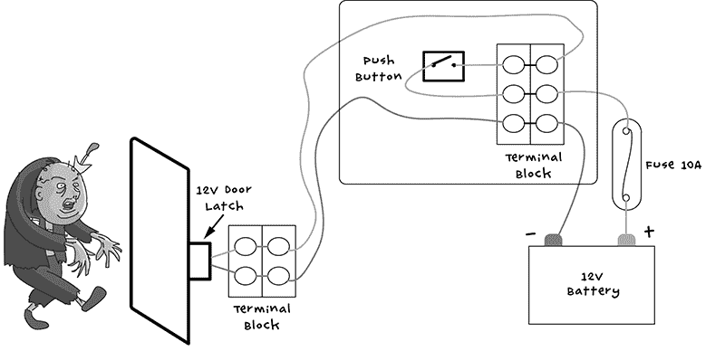

图 6-5：电动门闩的原理图

因此，任何安装这种门闩的门都应该保留其原始的门闩；这样你可以通过旋转门闩从内部打开它。虽然在末日世界里不会有人来强制执行消防法规，但确保你能轻松逃脱并不是坏事。毕竟，无论你拼凑的末日取暖和烹饪设备是否符合标准，都可能导致意外火灾的发生。

##### 步骤 1：制作开关盒

无论按钮是安装在基座的内部还是外部，你可能需要在紧急情况下迅速按下门锁解锁按钮，而将按钮随意挂在一堆杂乱的电线中是不可行的。你需要它易于使用，因此只需将它安装在墙上的盒子里即可。

**注意**

如果你打算为门锁添加无线控制，那么请选择一个足够大的盒子来容纳遥控继电器接收器；可以先将所有硬件放入盒子里测试一下其大小。

除非你很幸运，能找到一个已经封装在盒子里的开关，否则你还需要将按钮安装到盒子里。确保盒盖上有一个足够大的孔以便安装开关，同时也需要有孔让锁扣和电池引线进出盒子。你可以找到一个有足够大孔的盒子，或者自己钻孔。在钻孔的同时，可以在盒子的底部再钻几个孔，方便用螺丝将其固定到墙上。图 6-6 展示了开关在盒子里的样子。

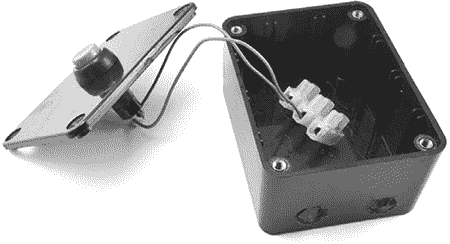

图 6-6：制作开关盒。注意小侧面朝向相机的一侧有两个孔，分别用于电池和锁扣引线。

将开关引线穿过盒盖上的孔，并将开关的两个端子接到接线端子上，这将使整个系统的接线更为简便。开关的两根引线应连接到接线端子的中间和顶部位置，以匹配图 6-5 的电路图。

##### 步骤 2：制作电池引线

为了给项目提供电源，你需要一个引线将其连接到你的汽车电池。图中显示的引线和保险丝与在第 3 个项目：LED 照明中的第 49 页所使用的完全相同，因此如果你需要更多关于如何制作的详细信息，可以查看该项目。

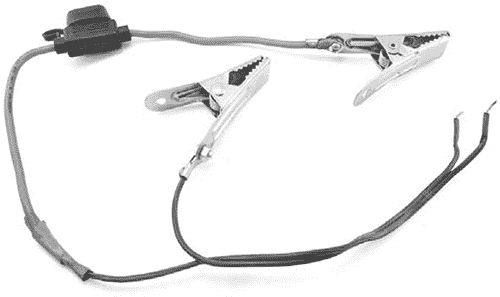

图 6-7：制作电池引线

##### 步骤 3：安装门锁扣

本项目中使用的电动门锁设计用于适配木门框。如果你使用的是不同类型的门，可以寻找其他 12V 的门锁机构。只需记住：依靠电磁铁来固定金属板的 12V 门锁无法确保你的基座安全。这种锁需要持续供电才能保持锁住状态，也就是说如果电池电量耗尽，门就会解锁，让所有僵尸进入。

要安装电动门锁，需要将旧的门锁板替换为电动锁板。电动版本需要在门框上开一个更大的孔来容纳锁体，所以需要钻孔并凿出这个孔；图 6-8 展示了一个可能的结果。

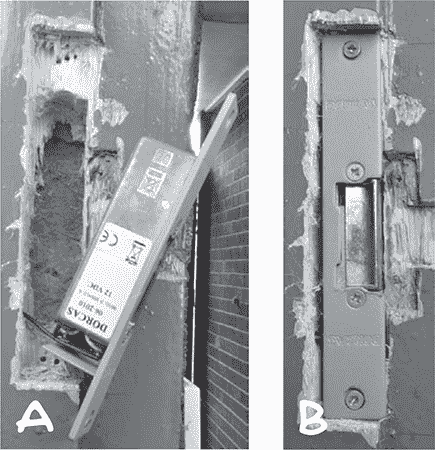

图 6-8：锁扣孔（A）和安装好的门锁扣（B）

图 6-8a 显示了门锁孔，并在侧面钻了一个孔，以便将锁的两根线引导到门内。图 6-8b 显示了门锁重新安装到位。门锁的右边缘在施加电源时会释放。

##### 步骤 4：接线

将你在步骤 2 中制作的电池线的一端穿过步骤 1 中添加到外壳侧面的孔。接下来，将电池的正极连接到三路端子块的中间位置，并将负极连接到底部位置。

除非你将按钮直接安装在门旁，否则需要通过将门锁的短线与更长的线连接，使用一个双向端子块，将两根线延长到合理的长度。然后，将门锁的长线穿过开关盒后面的孔，并连接到螺丝端子的上下位置，如图 6-5 所示。当盒子内的布线完成时，应该类似于图 6-9。

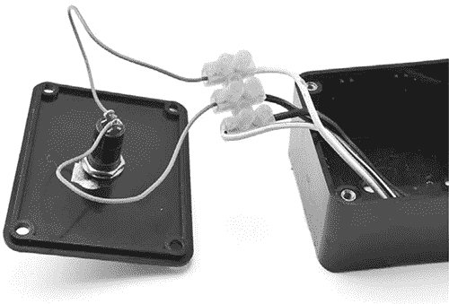

图 6-9：开关盒接线

右侧的浅色电线是门锁的接线，而深色电线是电池线。在关闭之前，只需检查按下按钮是否能释放锁，并整理好盒子内的布线。最后，将门锁的导线固定在墙上，避免成为绊倒的危险，完成！

当然，如果你能远程解锁门，你的避难所将更加方便，因此让我们添加一个遥控器。

#### 无线控制提前打开门

安装按钮后你可以停止，但有一天，那个按钮可能就不够快了。当你刚从一次搜刮旅行中归来，满载珍贵物资、拼命奔跑，因为一群僵尸决定跟着你回家时，你会希望在到达门前就能把门打开。提前计划，制作一个遥控门。

要使门锁控制无线化，你可以使用一个射频遥控继电器。该继电器与按钮并联接线，因此无论是按下按钮还是激活遥控器，门都会解锁。

图 6-10 显示了该项目的接线图，这次包括了无线遥控。

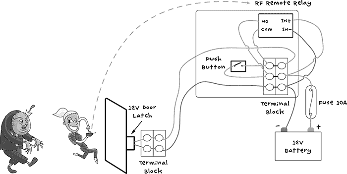

图 6-10：无线遥控电动门锁电路原理图

按钮连接到与继电器上的 NO（常开）和 COM（公共）连接的相同螺丝端子。射频继电器模块需要 12V 电源，该电源通过端子块连接到电池负极和保险丝。图 6-11 显示了继电器如何安装到与项目第一部分相同的盒子中。

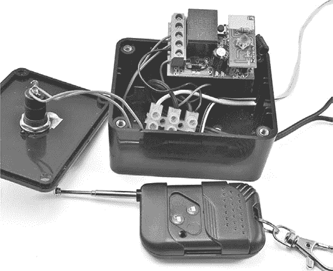

图 6-11：将无线继电器接入电动门锁电路

按照图 6-10 中的图示连接继电器线，然后你只需记得当你外出觅食或清理僵尸时，带上无线遥控器。而且一定要带一个备用遥控器，或者至少是备用电池！作为最后的保障，你还应该随身携带真正的钥匙。

### 项目 10：门传感器

本章的第一个项目帮助你和你的亲人安全撤离，而第二个项目则提醒你有不速之客。无论是流浪僵尸还是其他幸存者，成功打开你防线的大门，有了这个门传感器，你将及时得知周界被突破，从而有足够时间藏匿。

这个项目使用了一个簧片开关（如果你从未使用过，可以查看第 113 页上的“簧片开关”部分，获取详细描述），用来检测门是否被打开，从而触发你 Arduino 上的消息。这个项目使用的是与监测电池并通过 PIR 探测器观察僵尸的 Arduino 相同的板子。

**簧片开关**

本项目使用的传感器叫做簧片开关。这个开关由一对薄钢触点组成，封装在一个密封的玻璃壳内。这个玻璃壳通常还会被一个带螺丝孔的塑料盒进一步保护，方便将其固定在门或窗框上。

如图 6-12 所示，在没有磁铁的情况下，触点稍微分开，但是当磁铁靠近时，两个触点会被吸引到一起，形成电连接。

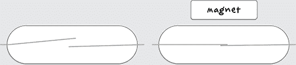

图 6-12：簧片开关

由于簧片开关是密封的，它们非常可靠。因此，它们通常用于安防应用中，其中磁铁通常安装在门上，而簧片开关则安装在门框上。当门被打开时，磁铁会超出簧片开关的有效范围，电路断开。

#### 你需要的材料

要做这个项目，你需要使用在“项目 4：电池监控器”中使用过的 Arduino 和螺丝保护板，第 53 页中还有详细介绍，以及一些其他零件。

| **物品** | **备注** | **来源** |
| --- | --- | --- |
|  簧片开关和磁铁配对 | 在末日之后，你可以从任何装有入侵警报的房子里回收这些。 | Adafruit (375)，Fry’s (1908354)，安防商店 |
|  双核线 | 音响线非常合适。 | 五金店，回收 |
|  端子排 | 2 路 2A 端子排 | 家得宝，Lowe's，Menards |
|  Arduino | Arduino Uno R3 | Adafruit，Fry’s (7224833)，SparkFun |
|  Arduino 螺丝保护板 | 螺丝保护板 | Adafruit (196) |

由于簧片开关将比其附带的短引线远离 Arduino，因此你需要延长这些引线。使用双芯电缆，可以通过焊接将电线连接在一起（参见“用焊接连接电线”在第 231 页），或者将其连接到一个双路端子排。

#### 构建

图 6-13 显示了将簧片开关连接到螺丝盾的接线图。你将需要项目 4：电池监控中的蜂鸣器，见第 53 页，但电阻仅在你还想监控电池电压时才需要。

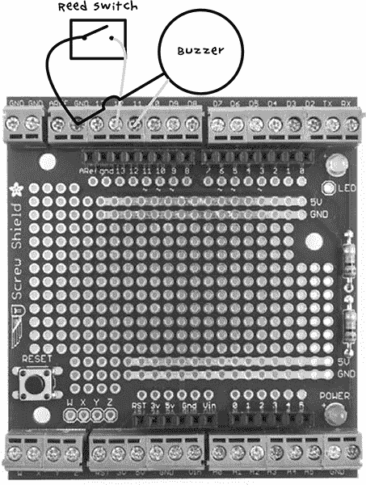

图 6-13：门传感器接线图

将簧片开关连接到螺丝盾的 D12 和 GND 端子（哪个端子连接哪个并不重要），将蜂鸣器的正极引线连接到 D11，将蜂鸣器的负极引线连接到 GND。注意，蜂鸣器的负极连接和簧片开关的一个连接端都接到同一个 GND 螺丝端子。图 6-14 展示了与项目 4 中使用的电阻一起完成的项目。


图 6-14：完成的门传感器

图 6-14 底部的鳄鱼夹连接到电池，正如项目 4 中所描述的那样。将簧片开关连接好后，我们继续介绍草图。

#### 软件

本书的所有源代码都可以在* [`www.nostarch.com/zombies/`](http://www.nostarch.com/zombies/)* 在线获得。（参见 “安装反僵尸程序”在第 248 页的安装说明。）如果你只是想做这个项目，而不涉及任何早期基于 Arduino 的项目，那么使用草图*Project_10_Door_Sensor*。另一方面，如果你做过一个或多个早期的 Arduino 项目，那么使用草图*All_Sensors*并更改顶部的常量，以选择你已经做过的项目。请参阅*All_Sensors*草图中的注释部分，了解需要做出的更改。

这段代码遵循与项目 4 相同的模式，因此有关程序整体如何工作的更多信息，请参见 “软件”在第 57 页。这里，我只会描述与本项目相关的代码。

首先，定义一个新的常量，表示将作为簧片开关输入的 Arduino 引脚。

```
const int doorPin = 12;
```

在设置函数中添加了一行新代码，以初始化新定义的`doorPin`（Arduino 上的引脚 12）为输入。

```
pinMode(doorPin, INPUT_PULLUP);
```

输入类型被指定为`INPUT_PULLUP`，这样输入引脚默认会是`HIGH`，只有在簧片开关靠近磁铁闭合时才会变为`LOW`。现在，循环函数还调用了一个名为`checkDoor`的函数，包含检查门是否被打开的其余代码。

```
void checkDoor()
{
  if (digitalRead(doorPin))
  {
    warn("DOOR");
  }
}
```

`checkDoor` 函数首先读取门的引脚。如果读取的结果是 `HIGH`，则表示磁铁离簧片开关太远，无法将开关保持在关闭状态，输入处于默认的 `HIGH` 状态。由于磁铁不靠近簧片开关，门一定是打开的。

如果你只需要知道门是否打开，不需要持续的警报，因此 `checkDoor` 调用 `warn` 函数（传递 `"DOOR"`），而不是用于电池监控的 `alert`。

```
   void warn(char message[])
   {
     lcd.setCursor(0, 1);
     lcd.print(message);
     delay(100);
     lcd.setCursor(0, 1);
     lcd.print("           ");
     if (!mute)
     {
       tone(buzzerPin, 1000);
➊      delay(100);
       noTone(buzzerPin);
     }
     delay(100);
   }
```

`warn` 函数类似于 `alert`：`warn` 接受一个消息作为参数，将该消息打印到 LCD 屏幕，并发出声音。不同之处在于，蜂鸣器的声音会在仅仅一秒十分之一的延迟后通过 `noTone` 被取消 ➊，从而在门打开时只发出短暂的蜂鸣声。

#### 使用门传感器

在实际安装之前，始终值得先在工作台上测试一下项目，特别是当你的生命依赖于设备正常工作的情况下。如果这个门传感器失败了，你可能会在睡梦中被丧尸化！所以首先，将你的草图加载到 Arduino 上，并将簧片开关和磁铁放得很近。然后，当你将它们分开时，蜂鸣器应该会响起。

一旦你确认一切正常工作，将簧片开关固定到门框上，将磁铁固定到门上。磁铁和簧片开关应该相对但不接触。最好将磁铁安装在门上，而不是门框上，因为门框不会移动，不会弯曲电线，这样可以延长电线的使用寿命。图 6-15 展示了簧片开关和磁铁安装在门上的样子。

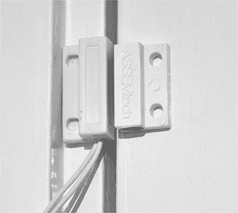

图 6-15：安装在门上的簧片开关和磁铁

请注意，簧片开关和磁铁通常会在背面附有粘性垫片，以便将它们粘贴到门上，并且有安装孔，可以像我一样将它们非永久性地固定到墙上。然而，如果你在丧尸末日后仍然担心家居装饰，请注意，取下簧片开关和磁铁时，粘性垫片可能会损坏油漆。

安装完新的显示器后，你已经准备好采取下一步措施来保护你的基地安全。在第七章中，你将把烟雾和温度报警器连接到你的 Arduino 上，以防止更多自然灾害的发生——就像丧尸还不够一样！
