## 7

**环境监控**


僵尸确实很可怕，但它们并不是末日世界中唯一的威胁。像火灾这样的日常风险，尤其在你无法安全离开住所时，显得尤为严重（见图 7-1）。在这一章中，我将展示如何制作一个火警和温度警报器，帮助你警告环境危险——而且不会引来僵尸的注意。


图 7-1：禁止吸烟！

### 项目 11：安静的火警报警器

通常，你希望火警器离你尽可能近，而且声音尽可能大。但大声警报有一个问题：僵尸能听见。你在逃离着火的建筑时，最不希望的就是引来路过的僵尸的注意！

这个项目修改了一个普通的电池驱动烟雾探测器，使它能在 Arduino 显示屏上触发警报，并发出更为轻微的蜂鸣声，使用的基本设置来自“项目 4：电池监控器”中的内容（见第 53 页）。图 7-2 展示了烟雾探测器直接连接到螺丝板的样子。

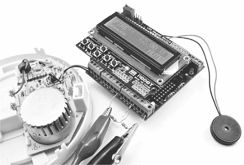

图 7-2：测试完成的火警报警器。在你的基地中，探测器将通过一根长电缆连接到 Arduino。

#### 你将需要的材料

要制作这个项目，你需要使用你在“项目 4：电池监控器”中使用的 Arduino 和螺丝板，并准备以下零件：

| **项目名称** | **备注** | **来源** |
| --- | --- | --- |
|  烟雾探测器 | 电池驱动 | 五金店，超市 |
|  电缆 | 双股电缆，长度足够从烟雾探测器到 Arduino | 可回收的扬声器或铃声电缆都可以使用。 |
|  D1 | 1N4001 二极管 | Adafruit（755） |
|  R1 | 1kΩ电阻 | Mouser（293-1k-RC） |
|  LED1 | 蓝色或白色 LED | Adafruit（301） |
|  C1 | 100 µF 电容器 | Adafruit（753） |
|  实心铜芯线 | 2 英寸（5 厘米）长 | 废弃电子产品，Adafruit（1311） |

一定要使用我推荐的 LED 颜色，因为我并不是因为它们看起来酷才推荐蓝色或白色 LED。为了让这个项目的电路正常工作，LED 的正向电压需要大于 2V。红色和绿色 LED 的正向电压通常约为 1.7V，而蓝色和白色 LED 的正向电压则较高，大约为 3V，这是非常合适的。

#### 构建

为了让烟雾探测器能静默地与 Arduino 通信，你需要将探测器的蜂鸣器从电路板上断开，然后将原本发送到蜂鸣器的信号改成 Arduino 可以使用的信号。你将通过电路（图 7-3）来调节蜂鸣器信号。

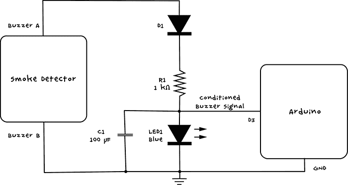

图 7-3：火灾警报电路原理图

一般的烟雾报警器非常响，因为它的蜂鸣器是由电路能从一块小小的 9V 电池中榨取的最高电压驱动的。这意味着对于大多数报警器来说，蜂鸣器上的信号大致类似于图 7-4 左侧的图表。

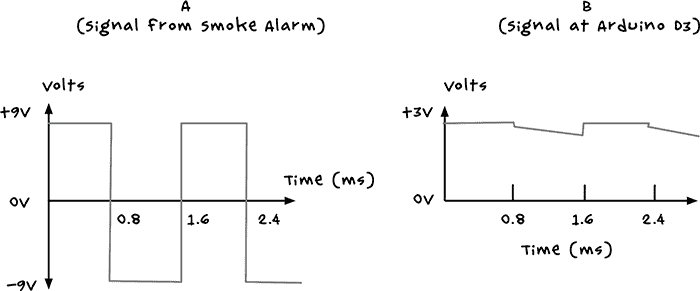

图 7-4：驯服 Arduino 上的蜂鸣器信号要比驯服僵尸简单得多！

蜂鸣器是由交流（AC）方波驱动的，电压大约每秒钟变化 600 次，电压从 +9V 到 -9V 来回摆动。这使得压电元件交替膨胀和收缩，产生蜂鸣声。但是这种电压摆动对于 Arduino 来说太剧烈，Arduino 会因输入电压超过 5V 或低于 0V 而受到损坏。

用于转换蜂鸣器信号的电路以二极管 D1 开始，二极管完全防止负电压到达电路的其余部分（二极管只允许电流单方向流动）。电阻限制了流向 LED 的电流，从而将 LED 上的电压限制在大约 3V。电容器去除任何电压尖峰，并将信号平滑成类似于图 7-4 右侧的图表。

##### 步骤 1：断开蜂鸣器

首先，拆解烟雾探测器。当你拆下盖子时，你应该能看到一个 PCB 和一些电线（图 7-5）。

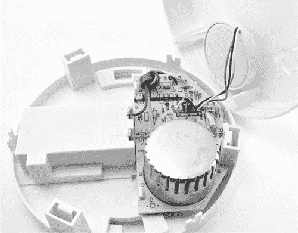

图 7-5：烟雾探测器内部

在这个烟雾探测器中，从电路板到盖子有三条导线是连接蜂鸣器的导线。现在剪掉蜂鸣器的导线，但不要剪得离蜂鸣器太近。末日来临时资源紧张，你可能想以后再利用这个蜂鸣器。

**危险：辐射！**

在开始这个项目时，请牢记两个警告。首先，如果你在僵尸爆发前拆解了烟雾探测器，不要再将其用作烟雾探测器。烟雾探测器每年拯救成千上万的生命，所以不要依赖你已经拆解过的那个；直接买个新的。

其次，虽然拆下烟雾探测器的塑料外壳是安全的，但如果你的烟雾探测器内部有一个圆形金属盒（见图 7-5），不要打开那个盒子，因为它包含一个辐射源，能够在一个小的腔体内电离空气。烟雾颗粒会吸收这些离子，导致电离空气中的电流减少，从而触发警报。这种类型的烟雾探测器正在逐渐被光学烟雾探测设计所取代，因此希望你的烟雾探测器里不会有那个盒子。

**注意**

你可以使用烟雾探测器中的蜂鸣器来构建 “项目 16：Arduino 移动和声音干扰器”（见 第 169 页）。如果你曾经靠近过这种烟雾报警器，当它响起时，你就知道它有多么令人分心！

您的蜂鸣器可能有两个引脚或三个引脚。如果有三个引脚，请按照步骤 2 确定每个引脚的作用。如果只有两个引脚，这些就是您将要连接的引脚，您可以跳过步骤 2。

##### 步骤 2：识别引脚

如果您的蜂鸣器有三个连接，那您的烟雾报警器使用的是一种叫做*自驱动压电蜂鸣器*的蜂鸣器。第三个连接被称为*反馈*连接，用于让压电蜂鸣器发出最响的声音。

对于这个项目，您只需要烟雾探测器上的两个驱动连接。有时电线会有颜色编码；如果是这样，驱动连接通常是红色和黑色的，反馈连接可能是白色（见图 7-6）或其他颜色。但是，如果您有万用表，您可以直接检查哪些电线是驱动电线，从而避免猜测。图 7-6 展示了这一过程的实际操作。

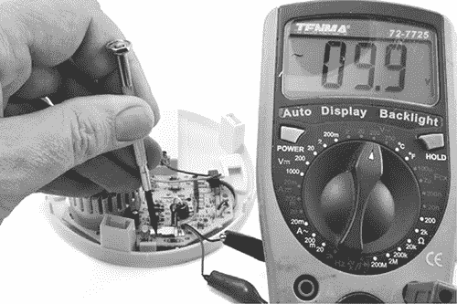

图 7-6：识别烟雾报警器蜂鸣器电线

剥去三根电线的末端，并将万用表设置为 200V 交流电范围（如果您的万用表支持），或者至少是 10V 交流电范围。（是的，我指的是交流电，而不是通常的直流电。）将万用表的探头连接到三根电线中的任意两根，并在按下烟雾报警器“测试”开关的接触点时测量电压。如果万用表显示大约 9V，或者 4V 或 5V 以上的电压，那么这就是您要找的电线；如果没有，请尝试不同的电线对，直到找到正确的电线。请注意，该项目依赖于烟雾报警器中的电池或电池组仍然存在。

##### 步骤 3：将组件焊接到螺丝护板上

由于该电路包含的组件太多，无法将它们全部连接到螺丝端子，因此请使用螺丝护板上的原型区域将组件焊接到位。图 7-7 展示了螺丝护板的接线图；标记的字母将在后面用来描述如何将其焊接在一起。

**注意**

为了清晰起见，图 7-7 没有包括来自早期基于 Arduino 的项目的组件，这些组件可能会挂在螺丝护板上。

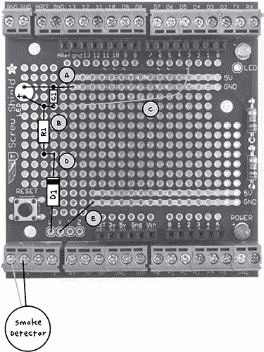

图 7-7：螺丝护板的接线图

持着螺丝护板，使其看起来像图 7-7 所示，从电路板顶部将组件引脚插入。请注意，二极管（标记为 D1）和 LED 是*极性*元件，意味着它们只有在特定方向上才会工作。将二极管的条纹朝向电路板顶部。然后将 LED 的较长引脚（正极引脚）朝向电路板底部（图 7-7）。

当你将所有组件引脚穿过孔后，翻转电路板并在引脚从孔中露出的位置焊接引脚。（如果你是焊接新手，建议查看附录 B，尤其是“焊接 PCB”在第 234 页的内容。）适当弯曲引脚，以防在电路板倒置时组件掉出。当所有组件焊接完毕后，电路板的底面应如图 7-8 所示。

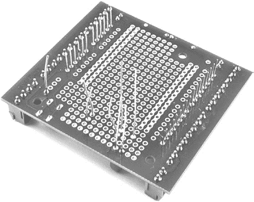

图 7-8：固定组件的位置

现在组件已固定好，弯曲引脚并排列它们以完成连接，参考图 7-9 和以下步骤作为指导。（下面描述的连接在图 7-7、7-9 和 7-10 中有字母标注。）

1\. 将 LED 的顶部（负极）引脚弯曲，使其与 C1 的顶部引脚以及螺丝罩上的 GND 电源线（A）相邻。将 LED 引脚焊接到 C1 交点处，然后焊接到 GND 线处。剪掉多余的 LED 引脚和 C2 顶部引脚的剩余部分。

2\. 将另一个 LED 引脚弯曲，使其与 R1 的顶部引脚和 C1 的底部引脚并排（B）。将 LED 底部引脚焊接在交叉处，即 R1 和 C1 的交点处，然后剪掉 C1 和 R1 引脚的剩余部分。如果在连接 R1 和 C1 后还有剩余的 LED 引脚，也请剪掉。

3\. 切一段足够长的固芯线，从你在步骤 2 中焊接的 LED 正极端延伸到顶部 Arduino 连接器的 D3 引脚（C）。剥去线端（参见“剥线”在第 227 页的内容）。翻到电路板的另一面，将剥去的一端插入靠近 LED 正极引脚连接 C1 的孔中，并将线焊接到该连接点。将线的另一端焊接到靠近 Arduino 3 号引脚的焊盘。将剥去的线端从顶部穿过孔，并在板的底面焊接。

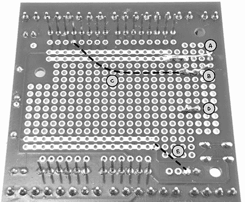

图 7-9：焊接完成后的螺丝罩底面。虚线表示位于罩顶的线路。

4\. 将 R1 的底部引脚弯曲，使其与 D1 的顶部引脚交叉（D）。将这两根引脚焊接在一起，并剪掉多余的线。

5\. 使用另一段固芯线（或者如果它们足够长，可以使用你从 R1 上修剪下来的引脚）将标记为 X 的焊盘连接到底部的 GND 电源线（E）。

完成后，电路板的底面应如图 7-9 所示。虚线表示板另一面的线路。

接下来，翻转电路板并添加一根导线，将 Arduino 的 D3 引脚（在螺丝盾上标记为 3）连接到电容器、二极管和电阻的交点。将该导线焊接到位。完成后，螺丝盾的顶部应该像图 7-10 一样。

现在电路板已经完成，重新组装电子元件，将显示屏护盾放回螺丝盾上，并将螺丝盾安装到 Arduino 上。

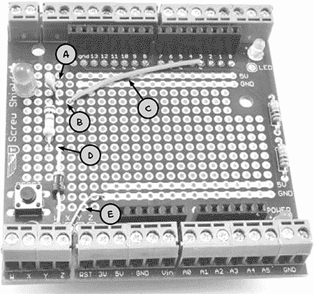

图 7-10：完成的螺丝盾

##### 步骤 4：将烟雾探测器连接到 Arduino

最后，如果你还没有剥开蜂鸣器的导线，请先剥开它们，并将较长的导线焊接到上面。为了让焊接连接更加牢固，你可以使用在“使用热缩管”中描述的热缩管，如第 235 页所示。将烟雾探测器连接到螺丝盾上的 W 和 X 引脚。连接烟雾探测器与 Arduino 的导线可以使用任何双线电缆，如电话线，但如果你打算在基地中使用此报警器，请使用足够长的导线，以便到达安装位置。我发现使用 30 英尺（10 米）的电话扩展线，项目运行得非常顺利。

#### 软件

如果你想在没有本书中其他任何 Arduino 项目的情况下制作这个项目，可以从本书的源文件中加载草图*Project_11_Smoke_Alarm*到 Arduino 上。如果你已经制作了本书中一个或多个早期的 Arduino 项目，则可以使用草图*All_Sensors*并更改顶部的常量，以选择你所制作的项目。有关正确更改的说明，请查看该草图中的注释部分。

**注意**

你可以在[`nostarch.com/zombies/`](http://nostarch.com/zombies/)找到本书源代码的链接。有关加载程序的说明，请参见本书的附录 C。

该代码基于项目 4 的代码，因此有关程序如何整体工作的更多信息，请参考“软件”中的第 57 页。在这里，我将仅描述与火灾报警器相关的代码。

首先，我们为 Arduino 上的 D3 引脚定义一个新的常量：

```
const int smokePin = 3;
```

这个引脚将作为来自烟雾探测器的信号输入。在添加`smokePin`常量后，我们在`setup`函数中添加一行新代码，将此引脚初始化为输入：

```
pinMode(smokePin, INPUT);
```

接下来，我们在`loop`函数中添加对一个名为`checkSmoke`的新函数的调用。`checkSmoke`函数定义如下：

```
void checkSmoke()
{
  if (digitalRead(smokePin))
  {
    alarm("FIRE!!");
  }
}
```

`checkSmoke`函数包含了检查烟雾探测器信号并显示信息和/或开启蜂鸣器的其余代码。要更改显示并控制蜂鸣器，请调用`alarm`函数，你第一次在“项目 6：PIR 僵尸探测器”中见到该函数，见第 72 页：

```
void alarm(char message[])
{
  lcd.setCursor(0, 1);
  lcd.print("           ");
  delay(100);
  lcd.setCursor(0, 1);
  lcd.print(message);
  if (!mute)
  {
    tone(buzzerPin, 1000);
  }
  delay(100);
}
```

除非你按下按钮将其静音（这是项目 4 的遗留功能），否则此功能将把你的信息（`"FIRE!!"`）打印到 LCD 上，代替那种吵闹、吸引僵尸的蜂鸣器。

#### 使用火灾报警器

测试烟雾探测器很简单：只需用螺丝刀按住测试按钮的触点（见 图 7-6）。这将导致蜂鸣器发出声音，并在 LCD 屏幕上显示消息。

当你知道报警器工作正常时，将传感器放置在一个靠近潜在火源的地方，以便在火灾发生时能提前获得足够的警告，以扑灭火焰，或至少有序地逃离。如果你在噪音中恐慌逃跑，吸引了街区上的所有僵尸，制造一个安静的烟雾报警器就毫无意义了！

### 项目 12：温度报警器

由于你的住所以防僵尸，因此你（希望）不会经常更换住所，随着时间的推移，你肯定会获得一些有价值的气候敏感物品。根据你所储备的物品，你可能想确保发电机不会过热，或者你的酒窖不会过冷。为了保护这些确保你生存的资产，并且能够与其他幸存者交换，你需要一个温度报警器，它可以通知你过热或过冷的极端情况。

这是最终的项目，使用了现在负载很重的 Arduino，图 7-11 显示了 LCD 屏幕报告摄氏高温。

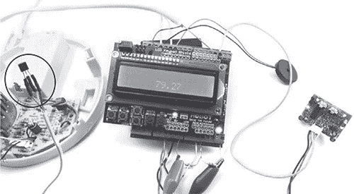

图 7-11：一个完全负载的 Arduino，配有温度传感器（已圈出）、运动检测器、烟雾报警器和电池监视器

一个三针温度传感器位于 图 7-11 的左侧，覆盖在项目 11 的烟雾报警器的残骸上。该传感器会将温度数据发送给 Arduino，然后 Arduino 会将其显示为人类可读的文本。

#### 所需物品

为了制作这个项目，你需要在 “项目 4：电池监视器” 第 53 页上使用的 Arduino 和螺旋护罩，以及以下零件：

| **物品** | **备注** | **来源** |
| --- | --- | --- |
|  TMP36 | 温度传感器 | Adafruit（165） |
|  三芯电缆 | 用于将传感器芯片连接到 Arduino 螺旋护罩 | 回收的电话线或其他三芯电缆。 |
|  热缩管 | 三段大约一英寸（25 毫米）长 | 汽车零件商店 |

你可以使用电工胶带代替热缩管，但我推荐使用热缩管，因为它更坚固，不容易散开。

#### 构建过程

图 7-12 显示了该项目的接线图。LCD 屏幕应来自早期项目，因此你要添加的唯一新零件是 TMP36 温度传感器。

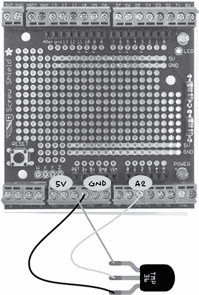

图 7-12：温度报警器的接线图

**TMP36 温度传感器**

TMP36 是一款非常实用的小型温度传感器芯片。它有三个引脚，在本项目中，这些引脚分别连接到 Arduino 的 5V、GND 和 A2 引脚。图 7-13 显示了该芯片的引脚排列。该芯片的精度大约为 2 摄氏度。如果你需要更高的精度，可以考虑修改本项目的设计和软件，使用像 DS18B20 这样的数字温度传感器。

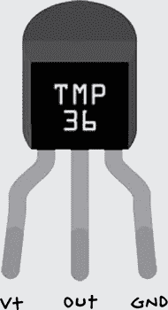

图 7-13：TMP36 引脚排列

TMP36 的 V+ 引脚的正电源电压可以在 2.7V 到 5.5V 之间。其中间引脚会生成一个与温度成比例的模拟输出电压。可以通过以下公式，从 Out 引脚的电压计算出芯片的温度（单位：摄氏度）：

温度 = 100 × 电压 - 50

所以，如果电压为 0.6V，温度将是 100 × 0.6 - 50 = 10 摄氏度。如果你希望温度以华氏度表示，只需进行一个额外的计算：

^°F = ^°C × 9/5 + 32

TMP36 可以测量从 -40 到 +125 摄氏度范围的温度，但测量的温度仅能准确到实际温度的 2 摄氏度之内。

##### 步骤 1：为 TMP36 制作更长的引线

要延长 TMP36 的引脚，你可以直接将三芯电线焊接到其上。然而，为了提高耐用性，你可以在焊接连接处使用热缩管。图 7-14 展示了这个过程。

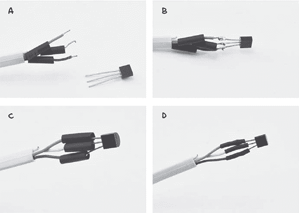

图 7-14：在 TMP36 引脚上使用热缩管

首先，剥去每根引线的外皮，并将切好的热缩管滑到每根电线的单独部分上（图 7-14a）。接下来将电线焊接到 TMP36 的引脚上（图 7-14b）。将热缩管滑到焊接点上（图 7-14c），然后用吹风机或热风枪对热缩管加热，直到它收缩（图 7-14d）。如果你有直径较大的热缩管，可以将它包裹在整个传感器和各个引脚周围，以增加该结构的耐用性。

**注意**

有关使用热缩管的更多信息，请参见 “使用热缩管” 第 235 页（page 235）。

##### 步骤 2：将温度传感器引脚连接到螺丝屏蔽

将温度传感器的电线连接到螺丝屏蔽上（图 7-11）。你不必使用所示的 GND 连接；螺丝屏蔽上的任何 GND 端子都可以。

#### 软件

如果你想单独制作这个项目，而不使用之前的任何 Arduino 项目，可以现在从本书的源文件中打开*Project_12_Temperature*草图并加载到你的 Arduino 中。如果你已经做了一个或多个之前的 Arduino 项目，那么可以使用*All_Sensors*草图，并更改顶部的常量，选择你已完成的项目。有关此操作的说明，请参阅该草图中的注释部分。

**注意**

本书的所有源代码可以从[`www.nostarch.com/zombies/`](http://www.nostarch.com/zombies/)下载。有关安装程序的说明，请参见第 248 页中的“安装 Antizombie 草图”。

这段代码遵循与项目 4 相同的模式，因此有关程序整体工作原理的更多信息，请参阅第 57 页中的“软件”。在这里，我只会描述与此项目相关的代码。

首先，为将作为 TMP36 模拟输入的 Arduino 引脚定义一个新的常量：

```
const int tempPin = A2;
```

定义了两个常量来设置在触发警报之前允许的最大和最小温度。这些常量是`floats`而不是`ints`，因为它们表示的是小数而非整数。

```
// Project 12 constants
// these can be in C or F
const float maxTemp = 45.0;
const float minTemp = -10.0;
```

正如常量上方的注释所述，这些温度值可以是摄氏度或华氏度。温度的单位由你将定义的一个新函数决定。

现在，主`loop`函数也包括对`checkTemp`的调用。这个函数的定义如下：

```
void checkTemp()
{
  float t = readTemp();
  if (t > maxTemp)
  {
    alarm("HOT", t);
  }
  else if (t < minTemp)
  {
    alarm("COLD", t);

  }
}
```

`checkTemp`函数首先调用`readTemp`来测量温度，然后将其与最大和最小温度进行比较。如果温度过高或过低，则会调用`alarm`函数。请注意，这个版本的`alarm`函数有一个额外的参数，用于在 LCD 屏幕上显示温度。

`readTemp`函数是将 TMP36 的原始模拟输入读取值转换为温度的地方。

```
float readTemp()
{
  int raw = analogRead(tempPin);
  float volts = raw / 205.0;
  float tempC = 100.0 * volts - 50;
  float tempF = tempC * 9.0 / 5.0 + 32.0;
  // One of the following two lines must be uncommented
  // Either return the temperature in C or F
  return tempC;
  // return tempF;
}
```

`analogRead`返回的原始值是一个介于 0 到 1023 之间的数字，其中 0 表示模拟输入引脚的电压为 0V，1023 表示电压为 5V。通过将原始值除以 205 来计算该电压（205 大约等于 1023/5）。

摄氏温度是通过使用在第 133 页的“TMP36 温度传感器”中描述的公式计算的，该公式为电压乘以 100 后再减去 50。华氏温度也可以通过类似的方法计算。

最后，必须返回这两个值中的一个。在这个版本的`readTemp`中，返回`tempF`的那一行被注释掉了，所以将返回摄氏度温度。如果你想切换返回华氏度，则可以注释掉`return tempC`这一行，并取消注释`return tempF`，使得函数的最后三行如下所示：

```
  // return tempC;
  return tempF;
}
```

要测试传感器，可以尝试将 `maxTemp` 常量的值设置为略高于房间温度，将更新后的草图加载到 Arduino 中，然后用手指捏住温度传感器使其升温。观察 LCD 屏幕，读数应该会发生变化。

#### 使用温度警报

你可以将温度传感器与 Arduino 之间的距离拉得多远，但这有一定的限制。你可以将连接到 TMP36 的引线做得长达 20 英尺（7 米），但是随着引线长度的增加，传感器的准确度会逐渐下降，原因是线路上的电噪声和电线的电阻。

将传感器放置在你希望保持某个温度的物品附近，并观察 LCD 屏幕。如果酒窖温度始终无法保持足够低，试着将传感器放在基地的不同房间，直到找到一个合适的环境。如果没有合适的房间存放酒，只需把传感器放回发电机旁，邀请你周围的其他幸存者来喝一杯，并举行一个抗僵尸策略会议。

现在你已经有了一堆传感器来提醒你基地中的危险，在下一章中，你将把 Arduino 项目与树莓派结合，制作一个控制中心。
