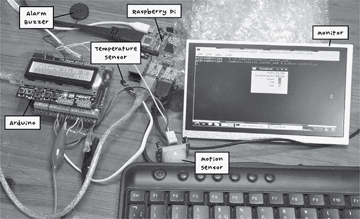
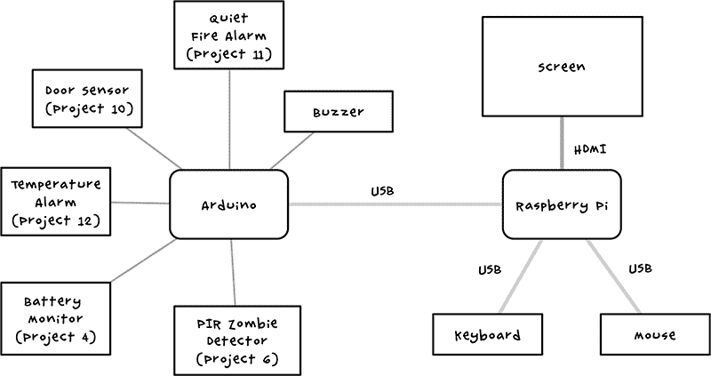
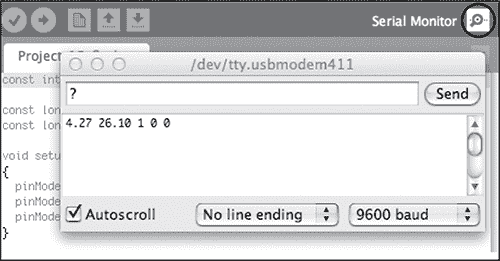
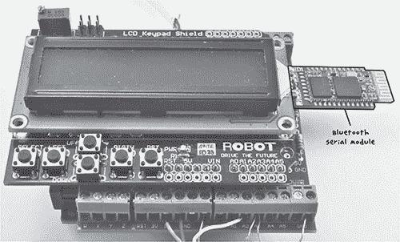
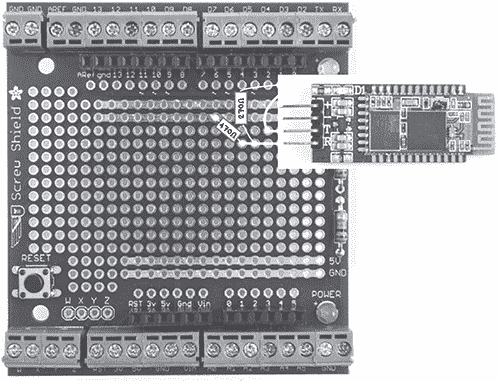
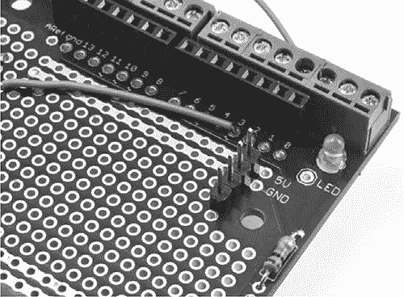
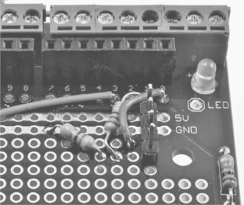
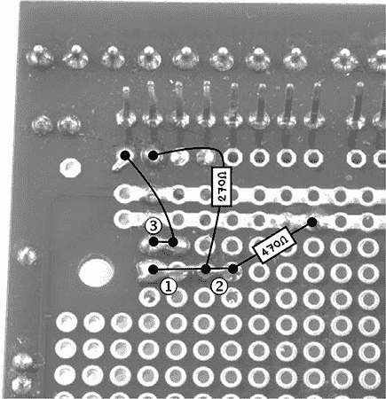
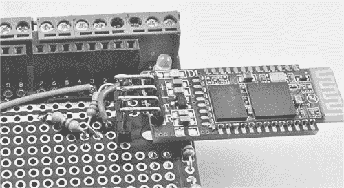

## 第八章：**为你的基地构建一个控制中心**


在本章中，你将学习如何使用树莓派计算机与本书中早期的项目连接，制作一个集成控制中心。该控制中心将允许你在一个屏幕上监控所有警报和监控设备，这样你就能立即知道僵尸是否突破了你的防线（图 8-1）。作为额外功能，你将学习如何为控制中心添加无线连接功能。


图 8-1：安全桌旁的宁静夜晚

### 项目 13：树莓派控制中心

在这个项目中，你将把 第五章的树莓派系统与本书前面开发的以下 Arduino 监控设备连接：

• “项目 4：电池监控器” 在 第 53 页

• “项目 6：PIR 僵尸探测器” 在 第 72 页

• “项目 10：门传感器” 在 第 112 页

• “项目 11：静音火灾报警器” 在 第 120 页

• “项目 12：温度警报器” 在 第 131 页

我们将使用 USB 电缆连接这两个板，之后在第 14 项目中用无线蓝牙连接替代。无线改造后，Arduino 仍然可以在没有树莓派的情况下工作，但将其与树莓派连接可以让你在树莓派上显示传感器和警报的状态。 图 8-2 展示了这个设置，你可以看到屏幕中央的传感器状态窗口。



图 8-2：树莓派与 Arduino 协同工作

#### 你将需要的材料

本项目将第五章的树莓派系统与本书至今为止描述的大多数 Arduino 项目结合起来。因此，你将需要以下材料：

 一个或多个之前的 Arduino 项目

 来自 第五章的树莓派系统

 一个 USB 电缆（与用于编程 Arduino 项目的电缆相同类型）

#### 构建

假设你已经逐步为你的 Arduino 添加了项目，那么它现在连接了五个项目。如果你真的做好了准备，你可能早就把这些项目搭建好了，并将它们存放在你的求生包里，准备迎接末日。不管怎样，你至少应该有你感兴趣的传感器。

如果你的 Arduino 项目和树莓派已经设置好，那么连接它们时不需要做太多构建。你只需将 USB 线的一端插入树莓派，另一端插入 Arduino，即可将 Arduino 项目连接到树莓派。如果你的树莓派没有空闲的 USB 端口，则需要添加一个 USB 集线器以提供更多端口。

既然你已经将 Arduino 和树莓派连接起来，你需要编程它们。最好先在你的常规计算机上编程 Arduino，然后再将 USB 线换到树莓派上，因为从树莓派的小屏幕上编程 Arduino 可能会令人沮丧。

图 8-3 展示了各个系统组件的布置。



图 8-3：控制中心的原理图

这种安排发挥了 Arduino 和树莓派各自的优势。树莓派无法直接使用许多连接到 Arduino 的传感器，而 Arduino 可以。同时，Arduino 没有显示屏，而树莓派有。

#### 软件

该项目的软件分为两部分：修改过的*All_Sensors* Arduino 草图和在树莓派上运行的 Python 程序，用于使其能够与 Arduino 通信。

在末日来临之前，确保你已经下载了本书的源代码；前往*[`www.nostarch.com/zombies/`](http://www.nostarch.com/zombies/)*开始下载。

##### ARDUINO 软件

你将用于此项目的 Arduino 草图*Project_13_Control_Center_USB*是基于*All_Sensors*草图的，该草图运行本书中的所有其他 Arduino 项目。*Project_13_Control_Center_USB*只是添加了代码，使你的 Arduino 能够通过串行连接（在这种情况下是 USB）与其他设备通信。

**注意**

有关将草图加载到 Arduino 的说明，请参见附录 C。

最好在将系统连接到树莓派之前，先在你的常规台式机或笔记本电脑上单独测试该系统的每个部分。你可以通过 USB 连接为 Arduino 供电进行测试，这样就不需要在末日之前使用你的车载电池进行测试。

要开始测试，将*Project_13_Control_Center_USB*草图加载到 Arduino 中，然后点击 Arduino IDE 中的放大镜图标打开串行监视器（图 8-4）。



图 8-4：串行监视器

确保在串行监视器右下角的下拉菜单中选择了“9600 波特率”。这是波特率，即数据传输的速度（以每秒比特为单位），它必须与草图中设置的速度匹配。

在串口监视器顶部的文本输入区域，输入 `?` 命令并点击 **发送**。Arduino 应该会显示一行数字，如 图 8-4 中所示的 `4.27 26.10 1 0 0`（你的数字不会完全相同）。这些数字分别表示电池电压、温度、门状态、PIR 状态和烟雾报警状态。对于这三个状态值，`0` 表示一切正常，`1` 表示报警。这些值将稍后在控制中心显示。通过模拟树莓派获取这些值的方式，你正在测试 Arduino 部分的功能是否正常。

如果你目前正在研究某些被捕获的僵尸，试着将温度传感器贴近僵尸的皮肤，再次输入 `?` 命令。如果你没有足够的测试对象（或者不太想冒险），只需将传感器夹在手指之间。不管怎样，你应该能看到消息中的温度部分发生变化。

如果串口监视器中的响应表明控制中心的 Arduino 部分正常工作，你可以将 Arduino 从常规计算机中拔出，并将其连接到树莓派的 USB 端口。

如果数字没有显示出来，请检查草图是否已经正确上传到 Arduino。如果报告的数字与你预期的某个项目不一致，请检查该项目的接线。

查看 *Project_13_Control_Center_USB* 中的 Arduino 代码，你会发现与 *All_Sensors* 不同，setup 函数的末尾包括了以下这行代码：

```
Serial.begin(9600);
```

这行代码告诉 Arduino 通过其 USB-串口接口以 9600 波特率打开串口连接。传递给 `begin` 的值必须与串口监视器的波特率下拉列表中设置的值匹配。

这个草图在循环函数的顶部也做了一个改动：

```
if (Serial.available() && Serial.read() == '?')
{
  reportStatus();
}
```

这些行代码检查是否有待处理的 USB 串口通信。如果有，当你发送 `?` 消息时，将调用 `reportStatus` 函数：

```
void reportStatus()
{
  Serial.print(readVoltage());
  Serial.print(" "); 
  Serial.print(readTemp());
  Serial.print(" "); 
  Serial.print(digitalRead(doorPin));
  Serial.print(" "); 
  Serial.print(digitalRead(pirPin)); 
  Serial.print(" "); 
  Serial.println(digitalRead(smokePin));
}
```

`reportStatus` 函数格式化之前的响应，通过空格字符将消息的各个部分分隔开。最后的 `println` 命令在响应的末尾添加了换行符。

##### 树莓派软件

这个项目的程序可以在 *Raspberry Pi/control_center_usb* 文件夹中找到。要一次性下载本书中使用的所有树莓派程序，你还可以使用以下命令从树莓派的终端窗口中下载：

$ cd /home/pi

$ git clone https://github.com/simonmonk/zombies.git

这些命令应该会获取本书中的所有代码，包括其他项目中使用的 Arduino 代码。

**注意**

为了使这些命令正常工作，你需要将树莓派通过以太网电缆连接到你的网络，并确保互联网连接正常。因此，这是在你感到末日临近时需要做的事情。不要等到之后才做！

要启动控制中心，你需要运行 Python 程序*control.py*。在你的 Raspberry Pi 终端窗口中输入以下命令：

$ cd "zombies/Raspberry Pi/control_center_usb"

$ python control.py

当程序启动时，应该会出现图 8-5 中的窗口。

程序以人类可读的方式显示来自 Arduino 的读数，任何需要你立即关注的读数都会以红色高亮显示。当没有警报时，读数将显示为绿色。在这个例子中，我的门是开着的，这意味着僵尸可能正在闯入我的基地！在我去检查的同时，你可以在文本编辑器中打开*control_center_usb.py*文件并查看。


图 8-5：控制中心

**注意**

这是我们自第五章以来第一次查看 Python 代码，因此在大量 Arduino 代码之后，语法可能显得不熟悉。如果你对哪些是 Python 代码、哪些是 Arduino 代码感到困惑，只需记住主要的区别：在 Python 代码中，行末没有分号，且使用缩进来将代码分组为块，而不是像 Arduino 代码那样使用大括号。

我没有在这里列出完整的控制中心代码，因为它几乎有 100 行，但在接下来的段落中，我会重点介绍一些关键特性。了解代码如何工作很有用，以防你决定修改它。例如，你可能希望改进显示窗口，增加一列显示测量使用的单位。你甚至可以让它显示关于火灾、检测到的僵尸等更明确的警告，以告诉你何时需要迅速离开你的基地。访问*[`effbot.org/tkinterbook/tkinter-index.htm`](http://effbot.org/tkinterbook/tkinter-index.htm)*了解更多关于在 Tkinter 中制作花哨用户界面的信息。

##### 阈值

文件顶部有三个常量，可能需要修改：

```
MIN_VOLTS = 11.0
TEMP_MIN = -10.0
TEMP_MAX = 45.0
```

这些常量指定了决定控制窗口中结果何时变红的值限制。在本例中，如果电压低于 11V，该行将从绿色变为红色。如果温度低于-10 度或高于 45 度摄氏度，同样会发生这种情况。`TEMP_MAX`和`TEMP_MIN`中使用的温度单位来自你在 Arduino 草图中使用的单位。关于如何在摄氏度和华氏度之间切换的详细信息，请参见“第 12 项目：温度报警”在第 131 页。

根据你的基站设置适当的阈值，考虑当电池电量低或温度升高时，你希望获得多少提前警告。

##### 状态标签

以下代码展示了如何在用户界面中编码标签和结果，以电池电压为例。代码包含在一个名为`App`的类中，用户界面在该`App`类的`__init__`初始化方法中定义。

```
Label(self.frame, text='Volts').grid(row=0, column=0, sticky=E)
self.volts_var = StringVar()
self.volts_label = Label(self.frame, textvariable=self.volts_var)
self.volts_label.grid(row=0, column=1)
```

第一行创建了标签`Volts`并使用网格布局将其放置在第 0 行、第 0 列。`sticky`属性表示该字段应该“粘附”在布局单元格的“东”墙上——换句话说，就是右对齐。

第二行定义了 Tk 图形库使用的特殊类型变量（`StringVar`），该库为程序提供用户界面。这个变量被分配给一个名为`volts_var`的成员变量，当定义电压值的标签时，第三行会引用它。当`volts_var`变量的值发生变化时，标签字段会自动显示`volts_var`的新值。

网格布局将窗口分成类似表格单元格的区域，并允许你在不提供精确坐标的情况下指定用户界面项的位置。网格按从上到下的行编号，最上面的行为 0；按从左到右的列编号，最左边的列为 0。电压显示的最后一行代码将标签放置在网格布局的第 0 行、第 1 列，以便将其与`Volts`标签并排显示。

窗口中显示的其他字段的代码也以相同的方式定义。

当然，你可能希望使用更具描述性的标签，或者更简洁的标签，所以可以根据需要修改它们。有关使用 Tk 图形库格式化的更多信息，请参阅 *[`tkinter.unpythonic.net/wiki/`](http://tkinter.unpythonic.net/wiki/)*。

##### 与 Arduino 通信

在`__init__`方法的末尾，你会看到这两行：

```
self.ser = serial.Serial(PORT, BAUD, timeout=1)
time.sleep(2)
```

这些行中的第一行开启了与 Arduino 的串行通信。第二行暂停了两秒钟，以便 Arduino 有时间启动，然后才会向其发送任何消息。

##### 保持你的控制中心更新

如果显示的值没有自动更新，那么你的控制中心基本上是无用的。更新是通过`read_arduino`方法完成的。

这是第一部分：

```
def read_arduino(self):
    self.ser.write('?')
    volts, temp, door, pir, fire = self.ser.readline().split()
    self.volts_var.set(volts)
    self.temp_var.set(temp)
    self.door_var.set(door)
    self.pir_var.set(pir)
    self.fire_var.set(fire)
```

`read_arduino`方法首先向 Arduino 发送`?`命令，Arduino 会返回一行由空格分隔的值，就像你在串行监视器中尝试 Arduino 代码时看到的那样。返回的值字符串随后会被拆分，空格作为分隔符（这是`.split()`函数的默认分隔符）。与窗口中每个字段关联的`StringVar`将随后在显示中更新。

值更新后，`read_arduino`方法的其余部分会根据需要将字段的颜色设置为红色或绿色。

为确保`read_arduino`方法按定期间隔调用，需要从 Tk 用户界面对象安排一次调用：

```
def update():
    app.read_arduino()
    root.after(500, update) 

root.after(100, update)
```

这段代码确保在 100 毫秒（1/10 秒）后调用 update 函数。该函数首先调用`read_arduino`，然后计划在 500 毫秒（半秒）后再次执行，这意味着我们的控制中心每半秒检查一次所有传感器。如果你处于危险之中，无论是僵尸攻击还是环境危害，你都会迅速得知！

你可以同时运行这个程序和“项目 7：使用 USB 摄像头监控僵尸”中的 USB 摄像头，在第 87 页打开两个 LXTerminal 窗口，并在每个窗口中运行一个程序。这样，你可以立即看到是什么触发了你的警报。

#### 使用控制中心

现在，你有一个屏幕，可以不断更新你防御堡垒的所有安全状态。将控制中心放置在一个你能轻松看到的地方，如果你已经包括了图 8-3 中的所有组件，你将能立即知道你的物资是否处于危险之中，电力供应是否紧张，以及僵尸是否突破了你的防线。

如果你发现用户界面的数值没有更新，可以返回到“Arduino 软件”在第 143 页，并通过串口监视器再次测试 Arduino，发送`?`命令以查看串口监视器中是否有状态响应。

### 项目 14：使用蓝牙无线连接

项目 13 中的控制中心现在被电线缠绕，你必须将 Arduino 和 Raspberry Pi 放在一起。这也意味着你可能只会在火焰已经蔓延到你身边时才知道，比如说，你的基地着火了——那时就已经太晚了。通过蓝牙无线连接 Raspberry Pi 和 Arduino，你可以使控制中心更加高效，正如我们在这个项目中所做的那样，这样你的传感器可以在危险到达你和监视器之前就发现它。

Raspberry Pi 本身没有内置蓝牙，但它支持多种蓝牙 USB 适配器。我们将使用蓝牙串口模块为 Arduino 添加蓝牙，模块在图 8-6 的右侧突出显示。



图 8-6：为 Arduino 添加蓝牙

要制作这个项目，首先完成“项目 13：Raspberry Pi 控制中心”在第 140 页的内容，并确保其他一切正常。然后，你就准备好添加无线链接了。

#### 你需要的材料

为了制作这个项目，你需要所有来自项目 13 的组件，再加上以下部件：

| **物品** | **备注** | **来源** |
| --- | --- | --- |
|  USB 蓝牙适配器 | 与 Raspberry Pi 兼容 | 计算机商店，eBay |
|  蓝牙模块 | HC-06 蓝牙串口模块 | eBay |
|  270 Ω电阻 |  | Mouser (293-270-RC) |
|  470 Ω 电阻 |  | Mouser (293-470-RC) |
|  连接线 |  |  |
|  引脚 | 4-pin | Adafruit (392), eBay |
|  螺钉保护板 |  | Adafruit (196) |
|  多股或实心核心连接线 | 用于在螺钉保护板的原型区域进行连接 | Adafruit (1311), 可回收 |
|  母对母跳线（×4） | （可选）替代引脚 | Adafruit (266) |

这个项目的硬件可以构建在你在构建其他使用螺钉保护板的传感器项目（4、6、10、11 和 12）时使用的螺钉保护板上。我使用的蓝牙模块是剑桥硅无线电（CSR）设备。有关与 Raspberry Pi 兼容的蓝牙适配器的列表，请访问 *[`elinux.org/RPi_USB_Bluetooth_adapters/`](http://elinux.org/RPi_USB_Bluetooth_adapters/)*。如果你担心将蓝牙模块直接焊接到引脚上，你也可以使用四根母对母跳线将引脚与蓝牙模块连接。

**注意**

通过寻找一个已经将模块焊接到位的模块和适配器配对，你可以省去一些复杂的焊接工作。

许多蓝牙 HC-06 模块有六个引脚，而不是四个。你需要使用的引脚是 +5V、GND、TXD 和 RXD，因此可以忽略其他两个引脚。这些通常是外部引脚，但请检查引脚图，因为有时一些设计会交换引脚位置。

#### 构建

为了使你的 Raspberry Pi 能够支持蓝牙连接，你只需要将一个 USB 蓝牙适配器连接到系统中。

Arduino 需要上述的蓝牙模块和一对电阻器，用于将 Arduino 的 5V 信号电平降到蓝牙模块所需的 3V 电平。将模块和电阻器安装到螺钉保护板的原型区域，避免与项目 11 的火灾警报接口区域重叠。

图 8-7 显示了该项目的布线布局。为了避免混淆，图 8-7 展示了蓝牙模块连接到一个螺钉保护板上，且没有其他项目在其上构建。



图 8-7：为 Arduino 添加蓝牙的布线布局

蓝牙模块需要平放，以避免与 LCD 保护板发生冲突。为此，你需要焊接一排四个 0.1 英寸的引脚，并将蓝牙模块垂直焊接在引脚上，平放在螺钉保护板上。如果你愿意，也可以使用母对母跳线将蓝牙模块连接到引脚。

##### 步骤 1：焊接引脚

将引脚条焊接到位。你可以在图 8-8 中看到，+5V 和 GND 引脚的连接整齐地与螺钉保护板顶部的两个电源排对齐。



图 8-8：焊接到位的引脚排

请注意，图中连接到 Arduino 引脚 3 的电线属于第 11 项项目中的火灾报警器，而非本项目。

##### 步骤 2：焊接电阻和连接线

按照图 8-9 所示的位置，将电阻和连接线焊接到螺钉保护板上：470 Ω 电阻从 Arduino 的 GND 引脚（第 7 列）连接到底部引脚排（第 4 列）；270 Ω 电阻从引脚排底部的第 3 行引脚连接到 Arduino 的第 1 引脚。连接线则从 Arduino 引脚 0 连接到第 3 个引脚排引脚。



图 8-9：焊接电阻和连接线

当你将电阻和连接线焊接到位后，翻转螺钉保护板，焊接板的底面。

图 8-10 显示了螺钉保护板底面的特写。为了便于识别连接情况，电阻和连接线显示为仿佛通过电路板可见。



图 8-10：连接螺钉保护板底面

首先，将 270 Ω 电阻的底部引脚弯向底部引脚排 ➊。将其焊接到底部引脚排的焊盘上，然后剪去剩余的引脚。将 470 Ω 电阻底部的剩余引脚弯曲，连接到其左边一个位置的焊盘 ➋。将引脚焊接到该焊盘上，然后剪去多余的引脚。现在，你已从引脚排的底部连接到底部的 270 Ω 电阻和 470 Ω 电阻之间，形成了连续的连接。

底面的最后一个连接 ➌ 使用焊接引脚排左侧相邻引脚的跳线引脚剩余部分。

##### 步骤 3：焊接蓝牙模块

最后一步是将蓝牙模块焊接到引脚排上。将模块的一个焊盘焊接到引脚排上的一个引脚，同时保持焊料融化状态，将蓝牙模块定位，使其与螺钉保护板上附带的 1 kΩ 电阻接触。然后，将模块的第一个引脚固定在第一个引脚上。你可以在图 8-9 的右下角看到这个电阻。焊接好第一个引脚后，其他引脚应该能够对准并轻松焊接。如果你愿意，你也可以使用母对母跳线将螺钉保护板与蓝牙模块连接。图 8-11 显示了蓝牙模块就位的样子。



图 8-11：蓝牙模块焊接到位

#### 软件

由于传感器没有变化，你将使用与“Arduino 软件”相同的 Arduino 软件，具体内容见 第 143 页。蓝牙模块替代了 USB 接口。

请注意，这个硬件通过串口与蓝牙模块进行通信，在 Arduino Uno 上，串口与 USB 接口共享。这意味着在你编程 Arduino 之前，你需要拔掉扩展板（或者如果你使用了跳线，只需拔掉蓝牙模块）。

然而，树莓派的软件确实需要进行一些小的修改，而且要让树莓派使用蓝牙，你需要安装一堆软件。记住：你需要在网络断开之前安装这些软件！

将蓝牙 USB 适配器插入树莓派的一个空闲 USB 端口，然后在 LXTerminal 窗口中运行以下命令：

$ sudo apt-get update

$ sudo apt-get install bluetooth

$ sudo apt-get install bluez-utils

$ sudo apt-get install blueman

安装软件将花费相当长的时间，所以你可能想要在任何愿意的或不愿意的僵尸上练习你的武术技能。

软件安装完成并且你已经流了一些汗水后，使用以下命令重启树莓派：

$ sudo reboot

一旦树莓派重新启动，打开终端并运行以下命令以确定 BT 接口的 ID：

$ hciconfig

➊ hci0：类型：BR/EDR 总线：USB

BD 地址：00:15:83:0C:BF:EB ACL MTU：339:8 SCO MTU：128:2

UP RUNNING PSCAN

RX 字节：419213 acl：19939 sco：0 事件：7407 错误：0

TX 字节：95875 acl：7321 sco：0 命令：57 错误：0

我们需要的信息是接口的名称，在本例中为`hci0`，位于➊处。当你运行此命令时，如果`hci`后面的数字不是`0`，请记下该数字；稍后会用到它。

每个蓝牙设备都有一个唯一的 ID，称为*MAC 地址*。我们需要找到新 Arduino 蓝牙模块的 MAC 地址，以便将其与树莓派配对。当你为 Arduino 供电时，你应该看到蓝牙模块上的 LED 灯在闪烁。LED 灯闪烁是因为它还没有与树莓派配对；一旦配对成功，LED 灯会亮起并保持亮着。运行以下命令来查找蓝牙模块的 ID：

$ hcitool scan

`hcitool`命令的输出应该如下所示：

```
Scanning ...
      00:11:04:08:04:76   linvor
```

ID 是六部分的数字。将其复制到剪贴板（复制和粘贴可以通过右键菜单进行）。然后输入以下命令将树莓派与蓝牙模块连接（记得更改蓝牙 ID 以匹配你自己的蓝牙模块 ID）：

$ sudo hcitool cc 00:11:04:08:04:76

如果你还没有这样做，请按照“树莓派软件”中的说明，在第 145 页下载树莓派软件。你会在文件夹*Raspberry Pi/control_center_bt*中找到蓝牙版本的*control.py*。

当你安装好程序后，运行以下`sudo`命令，再次用你自己的蓝牙 ID 替换：

$ sudo rfcomm connect 0 00:11:04:08:04:76 1 &

[1] 2625

$ 已连接 /dev/rfcomm0 到 00:11:04:08:04:76，频道 1

按 CTRL-C 退出

$

每次树莓派重启后，你需要在运行程序之前运行这个命令。命令末尾的`&`会将命令放到后台运行，这样你就可以在终端窗口中运行程序本身。按 ENTER 键返回`$`命令提示符。

如果你在之前运行`hciconfig`命令时，蓝牙接口名称后面没有`0`，请将`connect`命令中的第一个`0`更改为与`hci`后面的数字相匹配。还记得我让你记录这个数字吗？

最后，进入项目目录并运行程序：

$ cd ~/zombies/control_center_bt/

$ python control.py

如果你查看这个项目和第 13 号项目中的*control.py*文件，你会发现唯一的区别是端口。在这个版本的*control.py*中，我们将端口设置为*/dev/rfcomm0*，而不是*/dev/ttyACM0*，以便它使用蓝牙连接而不是 USB 连接。

#### 使用蓝牙支持的指挥中心

这个项目的工作方式与第 13 号项目中的 USB 版本完全相同，窗口显示相同的信息，只不过现在它稍微更便携，只要你的摄像头是无线的。如果僵尸闯入了你的基地，只需拿起树莓派、显示器和电源，躲进衣柜里，直到它们失去兴趣。

在下一章中，我们将研究如何在紧急情况下分散僵尸的注意力，因为亡灵通常比起真正杀死它们，更容易被逃跑。
