## **9**

**僵尸干扰器**


欺骗僵尸并不需要太多技巧，这样你就能快速逃脱（见图 9-1）。毕竟，它们的大脑相当缺乏。章节中的项目旨在利用闪光、响亮的声音和诱饵动作来吸引僵尸的注意力。想象一下，你身边一群僵尸围绕着车库门晃动，而你需要取回最后一块电池。这些干扰器能帮助你把僵尸引开，甚至可能将它们引入一个致命的僵尸陷阱，可能包括火焰和一个大洞。

第一个项目使用一次性相机的闪光灯，产生令人迷惑的闪光系列，迷惑僵尸。第二个项目则使用声音和运动来吸引僵尸的注意力。完成这些项目，并将它们固定在基地的关键位置，这样你就可以引导僵尸远离你。


图 9-1：请笑一下！

### **项目 15：Arduino 闪光干扰器**

这个闪光干扰器将 Arduino 与旧的一次性相机结合，产生定时闪光系列，干扰你的脑袋渴望食物的敌人。老式照片冲印店的老板们通常乐于让你带走成堆的二手一次性相机。如果老板们是活死人，那就更是如此了。他们可能会对你发出一些咕哝声，但我向你保证，任何他们发出的呻吟声纯粹是巧合。

图 9-2 展示了完成的僵尸闪光干扰器，包含三个回收的单次使用闪光相机，这些相机被修改为通过 Arduino 触发闪光。这三个相机被用胶带绑成一个块，所有闪光灯都指向外侧。

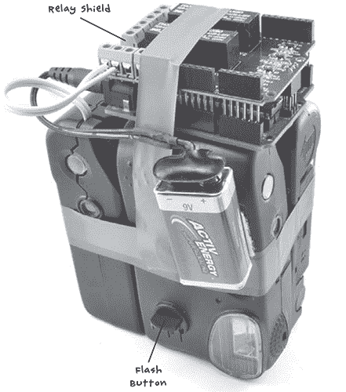

图 9-2：完成的僵尸闪光干扰器

三个闪光模块被安排成每个都与其他模块呈直角，以实现 270 度的覆盖范围。你将需要一个独立的 Arduino，因为你不希望将它放在控制中心旁边。

**警告**

如果你有心脏起搏器或心脏问题，或者如果闪光灯会引发你癫痫发作，请勿制作此项目。

**警告：高电压和强烈闪光**

一次性相机中的闪光灯工作电压高达 400V 直流电。如果你想避免不愉快的电击，在拆解相机和处理闪光模块时必须格外小心。模块的许多部件会保持高电压，并且可能持续数小时甚至几天。在使用这些模块之前，请确保按照“第 3 步：确保相机安全”中的说明，在第 163 页安全放电电容器。

#### **所需物品**

为了制作这个项目，你将需要以下部件：

| **物品** | **备注** | **来源** |
| --- | --- | --- |
|  Arduino Uno | Arduino Uno R3 | Adafruit，Fry’s（7224833），Sparkfun |
|  继电器扩展板 | 4 通道继电器扩展板 | eBay，[`www.sainsmart.com/`](http://www.sainsmart.com/) |
|  一次性相机 | 3 台用过的一次性闪光相机 | 照片商店 |
|  9V 电池 | PP3 类型 9V 电池，或更大容量的 9V 或 12V 电池包 | 五金店 |
|  9V Arduino 电池线 | DC 电源插座到 9V 电池夹适配器 | Adafruit（80），eBay |
|  双核电线 | 三段 6 英寸（15 厘米）长的电话线或其他双核电线 | 五金店，捡拾 |
|  加热带或电工胶带 |  | 汽车配件店 |
|  100 Ω 电阻 | 用于放电相机闪光电容 | Mouser（293-100-RC） |

一次性相机用处不多，商店唯一的选择是付钱让人把它们带走，所以如果你礼貌地问商店老板，他们可能会免费给你一堆相机。

每台相机通常都会配备一块几乎未使用的 AA 或 AAA 电池，连同一个完全正常的闪光模块。尽量获取一组类似的相机，最好是同一品牌的相机。（在我拿到的相机袋子里，最常见的品牌是富士，所以我基于这个设计进行项目。不过，说明书应该足够通用，适用于任何一次性相机。）此外，找一些有开关可以保持闪光灯开着拍多张照片的相机，而不是那种每拍一张就需要按一次闪光按钮的类型。例如，看看 图 9-2 前面的相机。它有一个杠杆，可以让闪光灯保持开启（图中底部中央）。

继电器扩展板是在 eBay 上购买的，当你将它连接到 Arduino 时，它将继电器连接到 Arduino 的 4、5、6 和 7 引脚。如果你得到的继电器扩展板稍有不同，只需检查它使用的数字 Arduino 引脚，并在 Arduino 草图中做相应的更改（参见 “软件” 页 166）。

100 Ω 电阻用于放电闪光模块中使用的大型高压电容，以避免电击的风险。它在构建中没有其他作用。

#### **构建**

图 9-3 显示了这个项目中的布线。

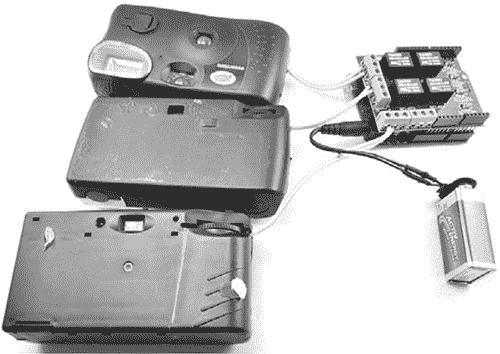

图 9-3：闪光灯干扰器，展开图

每个一次性相机都有一段双核电线从相机外壳的一侧伸出。这些电线连接到相机内部的开关触点，用于触发闪光灯。我将在步骤 2 到 5 中描述如何为一台相机创建此设置，你需要为所有三台相机重复这些步骤。

每对引线连接到屏蔽上的一对继电器接触点，以便 Arduino 能够独立触发每个闪光灯。

每个相机还配有自己的 AA 或 AAA 电池，为闪光灯供电，而 Arduino 和继电器屏蔽则由连接到 Arduino 直流插孔的 9V 电池供电。这使得项目完全便携，因此你可以将其放置在需要的地方，制造干扰来帮助你逃脱。

##### **步骤 1：整理相机**

首先，将你的相机包按类型整理。为了使这个项目更容易构建，尽量挑选出三台相同的相机。我使用的模块都是富士胶片的，尽管纸板封面上的品牌不同。

**警告**

在此阶段不要尝试相机的闪光灯！它会给相机的电容器充电，当你用手指把相机机身拆开时，会被电击到。真的，这真的很疼！

##### **步骤 2：拆卸相机顶部外壳**

使用过的相机可能已经在照片处理器拆除 35mm 胶卷盒时被部分拆解。处理器通常快速而不是整齐地拆卸，所以可能会有纸板和塑料片挂在上面。图 9-4 展示了拆解相机外壳的步骤。

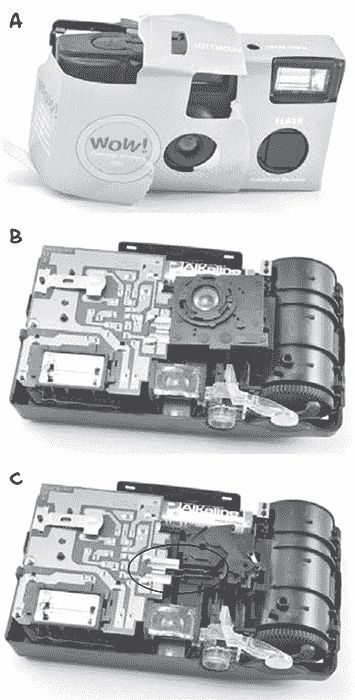

图 9-4：拆解相机

在这个步骤中，你有触电的风险，所以小心不要接触电路板或相机内部的任何接触点或电线。

首先，从相机机身上取下纸板（图 9-4a）。接下来，使用一个带塑料手柄的平头螺丝刀（以提供绝缘，防止触电）撬开固定相机机身两半的塑料卡扣。移除相机外壳的前半部分，暴露出 PCB 和镜头（图 9-4b）。现在移除镜头组件。如果必须，可以把它弄断；它不再需要了。这将暴露出图 9-4c 中圈出的两个接触点，触碰在一起时会触发闪光灯。

##### **步骤 3：确保相机安全！**

在确保相机模块安全之前，请像对待一只小而凶猛的老鼠一样对待它。不要直接接触它。如果需要移动或翻转它，使用类似塑料笔的物品戳它。否则，你可能会伤到自己，而你需要保持最佳状态才能在僵尸面前占据先机。

确定闪光模块的电容器。电容器是一个大金属圆柱体，两个引线将它与 PCB 连接。电容器储存所有快速放电到闪光灯中的能量，以触发闪光。图 9-5 中，整个闪光模块已从相机机身中移除，方便查看电容器，但如果可能的话，在不移除整个 PCB 的情况下，仍应遵循电容器放电的步骤。

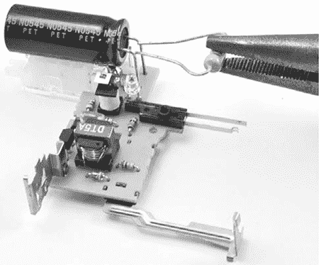

图 9-5：放电电容器

为了放电闪光模块的电容器，将 100Ω电阻器的引脚弯曲，使其大致与电容器的引脚间隔一样。用钳子（带绝缘手柄）轻轻夹住电阻器的本体，并将电阻器引脚接触到电容器的引脚上。如果电容器已经充电，可能会看到非常微小的火花。保持电阻器不动约一秒钟，确保电容器真正放电。

现在，通过将万用表设置为最大直流电压范围，检查电容器是否放电。（电压范围需要为 500V 或更高。）即使电容器中剩余一些电压也没关系，但如果电压超过 10V，则需要用电阻器放电更长时间。一旦电压降至 10V 以下，就可以安全处理 PCB，避免电击。

##### **第 4 步：连接触发接点的引线**

按照图 9-6 所示，将约 6 英寸（15 厘米）双芯电线焊接到闪光触点上。在我使用的相机中，有一个方便的塑料钉子可以使两个触点保持足够的间距。如果你的相机没有这个设计，可能需要用电气绝缘胶带包裹焊接触点，或者用热缩管将触点包住以保持间距。

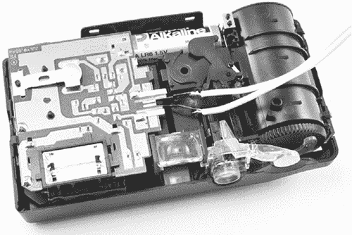

图 9-6：引线焊接到触发接点

##### **第 5 步：重新组装并测试修改后的闪光模块**

将相机的前盖重新安装好，让双芯电线从相机的一侧穿出。如果你需要更多空间来引出电线，可以使用一把斜口钳在塑料盖上切个洞。

在对其他两台相机重复此过程之前，先测试一下这个闪光灯。这些相机的触发接点有时会达到 400V，因此为了安全起见，使用带有绝缘手柄的螺丝刀。

打开相机的闪光开关。你应该能看到充电指示灯或 LED 亮起。相机在充电时可能会发出嗡嗡声。这声音是由于电容器正在充电。当你认为充电完成时（或者大约 10 秒后），用螺丝刀连接两个触发引线，如图 9-7 所示。

当你用螺丝刀连接引脚时，相机应该会闪烁。太好了！这台相机准备好使用了。在进行第 6 步之前，请对另外两台相机重复第 2 至第 5 步。

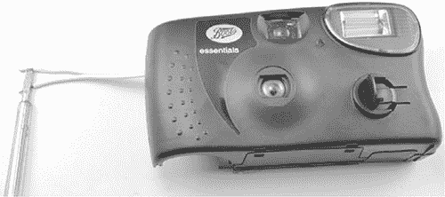

图 9-7：测试修改后的相机

##### **第 6 步：将相机连接到继电器屏蔽板**

将继电器屏蔽板安装到你的 Arduino 上，确保屏蔽板的所有引脚都与 Arduino 上的插座正确接触。

图 9-8 显示了相机如何与继电器屏蔽板连接。

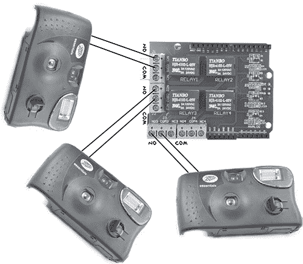

图 9-8：将相机的引线连接到继电器屏蔽板的触发接点

继电器扩展板上的每个继电器都有三个螺丝端子：NO、COM 和 NC。当继电器未激活时，NC 和 COM 端子是连接的，但当继电器被激活时，COM 与 NO 连接。这意味着每台相机的引线需要连接到每个继电器的 COM 和 NO 端子上。引线的连接方向无关紧要。

当你的相机连接到继电器时，将电池夹–圆形插孔适配器连接到 Arduino，如图 9-9 所示。

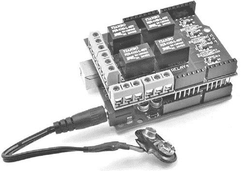

图 9-9：将电池引线连接到 Arduino

然而，在连接电池之前，你需要先上传项目的软件，所以在编程时可以通过 USB 电缆为 Arduino 供电。

#### **软件**

本书的所有源代码都可以在* [`www.nostarch.com/zombies/`](http://www.nostarch.com/zombies/)* 下载。如果你还没有下载，赶紧访问提供的链接并下载代码。有关如何安装 Arduino 草图的说明，请参见附录 C。

这个项目的 Arduino 草图名为*Project_15_Flasher*，并且位于同名的源文件目录中。我将引导你完成这个草图。

首先，我们定义一个常量整数数组`flashPins`：

```
const int flashPins[] = {7, 6, 5};
```

`flashPins`数组定义了用于触发每个闪光模块的 Arduino 引脚。如果你的继电器扩展板使用不同的引脚来控制继电器，可以更改这些引脚号。

接下来，我们定义另外两个常量，你可以调整它们以修改僵尸干扰器：

```
const long overallDelay = 20; // seconds
const long delayBetweenFlashes = 1; // seconds 
```

`overallDelay`常量决定了每个闪光周期之间的时间间隔，默认设置为 20 秒。请注意，这个延迟需要足够长，以便相机内部的电容器重新充电。

`delayBetweenFlashes`值设置了每个闪光触发之间的间隔。默认设置为 1 秒。请注意，这两个常量是`long`类型，而不是`int`类型。这是因为`int`常量的最大值是+/-32,767，这样最大延迟为 32.767 秒；可能不足以让你在逃跑时让僵尸保持分心。幸运的是，`long`数据类型的最大值超过+/-2,000,000。你可以在 2,000 秒内跑得很远！

现在我们添加一个`setup`函数：

```
void setup()
{
  pinMode(flashPins[0], OUTPUT);
  pinMode(flashPins[1], OUTPUT);
  pinMode(flashPins[2], OUTPUT);
}
```

`setup`函数将所有继电器引脚设置为数字输出。

在`pinMode`函数就位后，我们添加一个简短的`loop`函数：

```
void loop()
{
  flashCircle();
  delay(overallDelay * 1000);
}
```

这个`loop`函数调用`flashCircle`函数，并在每次开始整个过程之前，等待`overallDelay`*秒*。

现在我们来看一下`flashCircle`函数的定义：

```
void flashCircle()
{
  for (int i = 0; i < 3; i++)
  {
    digitalWrite(flashPins[i], HIGH);
    delay(200);
    digitalWrite(flashPins[i], LOW);
    delay(delayBetweenFlashes * 1000);
  }
```

这个函数遍历闪光引脚，并为每个引脚提供一个`HIGH`脉冲，持续 200 毫秒，触发闪光。然后会有一个暂停，直到下一个闪光，由`delayBetweenFlashes`来设置。由于在 Arduino 中，`delay`函数的参数是毫秒，所以`delayBetweenFlashes`的值乘以 1,000。

#### **使用闪光干扰器**

在将干扰器的所有部件粘合在一起之前，按照图 9-3](ch09.html#ch09fig3)所示，将部件铺开进行测试。打开每个相机的闪光开关，并将 9V 电池连接到电池夹上。闪光单元应该依次闪烁，然后暂停 20 秒，再重复这个周期。

当你确定 Arduino 能够启动闪光时，将所有部件粘合在一起，或者如果你更喜欢的话，也可以用热熔胶枪将相机粘在一起。确保你能够方便地更换相机的电池。

为 Arduino 供电的小型 9V 电池大约能持续四到五小时。如果你需要让干扰器工作更长时间，图 9-10](ch09.html#ch09fig10)展示了一些其他选择。

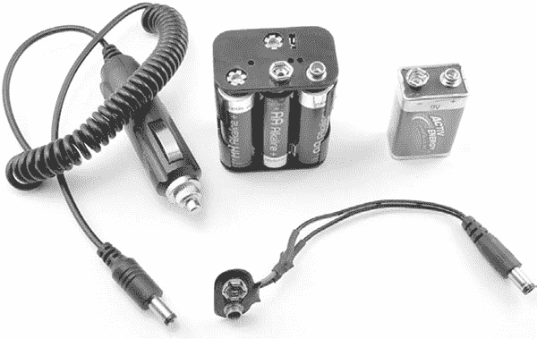

图 9-10：为 Arduino 供电的选项

一个 6 × AA 电池座的使用寿命大约是 PP3 9V 电池的 10 倍，但为了获得最长的电池使用时间，你可以使用车载电池并配合图 9-10](ch09.html#ch09fig10)左侧展示的打火机–到–桶形插座适配器。然而，相机中的 AA 电池在闪光几百次后就需要更换，所以如果你计划重新使用你的干扰器——如果你正处于僵尸遍布的街区——记得随身携带额外的电池。

我建议你储备一些闪光干扰器，并始终在外出采购或侦察时随身携带一整套设备。如果有一群僵尸挡住了你去杂货店的路，那么只需设置好干扰器，躲在视线之外，让它吸引僵尸，等情况清晰时，再悄悄冲向门口。

你可能希望将闪光干扰器与下一个项目结合使用，以最大限度地发挥干扰僵尸的能力。

**注意**

这个项目没有开关，因此当你不使用时，请拔掉 9V 电池并关闭相机上的闪光灯开关。你也可以使用像这样的直通电源开关：[`www.adafruit.com/products/1125/`](https://www.adafruit.com/products/1125/)。

### **项目 16：Arduino 运动与声音干扰器**

记得我们用来制作“项目 11：安静的火灾警报器”的烟雾警报器吗？它位于第 120 页。在这个项目中，我们将使用从该烟雾警报器中取出的压电蜂鸣器，并配合由伺服电机驱动的挥舞旗帜，制造大量干扰性噪音和运动。

图 9-11 展示了该项目的实际应用。在项目旁边，我展示了一个卷曲的打火机适配器，如果你希望从车载电池为系统提供电力以供长期使用，可以使用它替代 AA 电池组。

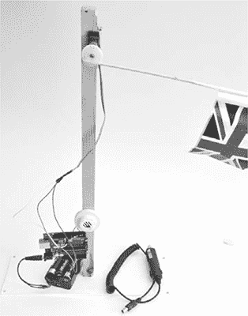

图 9-11：声音与运动的不和谐

#### **所需材料**

为了制作这个项目，你需要以下部件：

| **项目** | **备注** | **来源** |
| --- | --- | --- |
|  Arduino Uno | Arduino Uno R3 | Adafruit, Fry’s (7224833), Sparkfun |
|  6 × AA 电池座 | 9V 电池组 | Adafruit (248) |
|  9V Arduino 电池线 | 直流电源插座到 9V 电池夹适配器 | Adafruit (80), eBay |
|  跳线 | 3 根长的公对公跳线 | Adafruit (760) |
|  100 Ω 电阻 | 2W 或 1/4W | Mouser (594-5083NW100R0J 或 293-100-RC) |
|  排针 | 2 针排针 | Adafruit (392), eBay |
|  伺服电机 | 小型或标准 | Adafruit (155 或 196), eBay, 爱好商店 |
|  蜂鸣器 | 从项目 11 的烟雾探测器中丢弃或其他高音量蜂鸣器 | 安全商店，烟雾报警器 |
|  木制立柱（支柱或杆） |  | 五金店 |
|  底座 | 木材或塑料，用于固定立柱 | 五金店 |
|  木制食品串和纸 | 用于制作旗帜 | 家庭用品 |

本项目的电源通过 Arduino 圆筒插孔供电。与 “项目 15：Arduino 闪光干扰器” 第 158 页中使用的电源选项相同，也适用于本项目。

如果你只想挥舞一个像 图 9-11 中显示的小型轻量旗帜，那么小型伺服电机就能很好地工作；但对于更大的旗帜，使用标准伺服电机。只需注意，如果使用较大的伺服电机，可能会因为较大电机的负载导致电压下降，从而使 Arduino 重启。在这种情况下，你可以按照 *[`communityofrobots.com/tutorial/kawal/how-connect-servo-arduino/`](http://communityofrobots.com/tutorial/kawal/how-connect-servo-arduino/)* 上的说明，使用单独的 6V 电池组为伺服电机供电。

还需注意，尽管本项目计划使用从 “项目 11：安静的火灾报警器” 第 120 页中的烟雾探测器中取出的蜂鸣器，但你也可以使用一个新的蜂鸣器。

#### **构建**

图 9-12 展示了该项目的接线图。

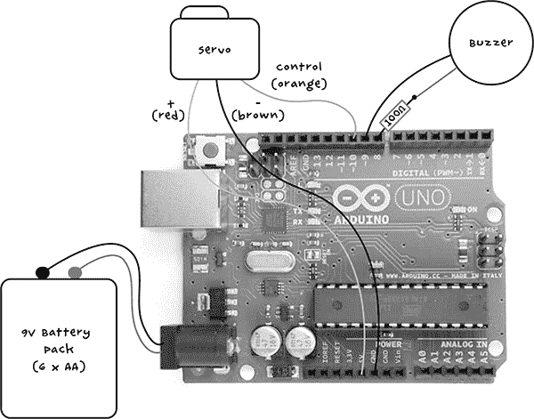

图 9-12：干扰器的接线图

供电清单中的公对公跳线将把伺服电机连接到 Arduino，伺服电机末端是一个三孔插座。你还将把电阻器和一个蜂鸣器引线连接到一对排针，以便将蜂鸣器也插入到 Arduino。

##### **步骤 1：从烟雾报警器外壳中取出压电蜂鸣器**

烟雾报警器的蜂鸣器可能集成在烟雾报警器的外壳中。如果是这种情况，别试图取下蜂鸣器；您可以在蜂鸣器仍然连接到外壳时使用它，或者直接换用一个不同的蜂鸣器。如果蜂鸣器看起来会脱落，那就像图 9-13 中所示的那样将其拆下，以使项目更加紧凑。

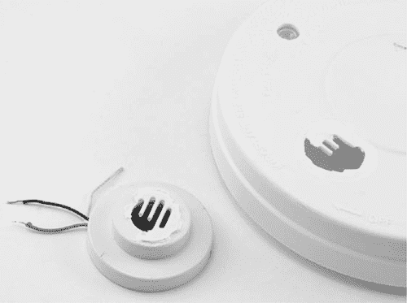

图 9-13：从烟雾报警器外壳中取下蜂鸣器

##### **步骤 2：焊接插针、蜂鸣器和电阻**

检查您的蜂鸣器：您只需要两个蜂鸣器引脚，如果它有三个，请参见“项目 11：安静的火灾报警器”在第 120 页以确定您需要的三个引脚中的两个。

一旦解决了这个问题，将 100 Ω电阻焊接到蜂鸣器的一个引脚上——不管焊接的是哪一端。将电阻的另一端焊接到一个插针上，并将另一个蜂鸣器引脚焊接到另一个插针上。您可以使用热缩管（参见“使用热缩管”在第 235 页）或电工胶带来加固这些焊接连接。这些连接如图 9-14 所示。

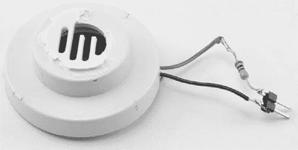

图 9-14：焊接蜂鸣器、电阻和插针

##### **步骤 3：测试压电蜂鸣器**

在继续之前，我们将使用 USB 连接为 Arduino 供电，测试蜂鸣器。此步骤将帮助我们找到蜂鸣器的最佳频率，使其声音尽可能响亮。

将插针插入 Arduino 的 8 和 9 引脚。插针的插入顺序无关紧要（见图 9-15）。

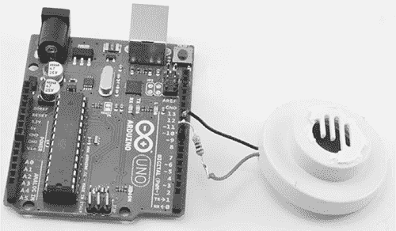

图 9-15：将蜂鸣器连接到 Arduino

如果您还没有下载本书的所有程序，请访问 *[`www.nostarch.com/zombies/`](https://www.nostarch.com/zombies/)* 并下载 *Project_16_Sounder_Test* Arduino 程序。将此程序加载到您的 Arduino 上，然后打开串行监视器（见图 9-16）。这不是项目的最终程序；它只是一个测试程序，帮助我们找到主程序中要使用的最佳频率值。

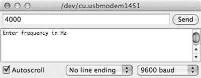

图 9-16：使用串行监视器设置频率

在输入框中输入 4000 并点击**发送**——这个数字是蜂鸣器发出的声音频率。您应该能在该频率下听到非常响亮的声音持续一秒钟。尝试输入不同的频率值，找到发出最大音量的频率；它可能在`4000`左右。

为了减少耳朵的压力，您可以将蜂鸣器翻转过来，或者覆盖声音出来的孔来降低音量。当您找到最佳频率时，记下该值。

**注意**

这个操作最好在没有僵尸的情况下进行。

**压电蜂鸣器**

压电蜂鸣器（也叫做声响器）内含有晶体，当电流通过时，晶体会改变形状。电流每秒变化数百次，晶体形状的变化会产生声波。虽然你可以通过将一根引线连接到 GND，另一根引线提供信号来驱动压电蜂鸣器，但使用两个 Arduino 输出完全反转蜂鸣器的极性，从而在每个周期中获得更大的音量。图 9-17 展示了这一过程的工作原理。

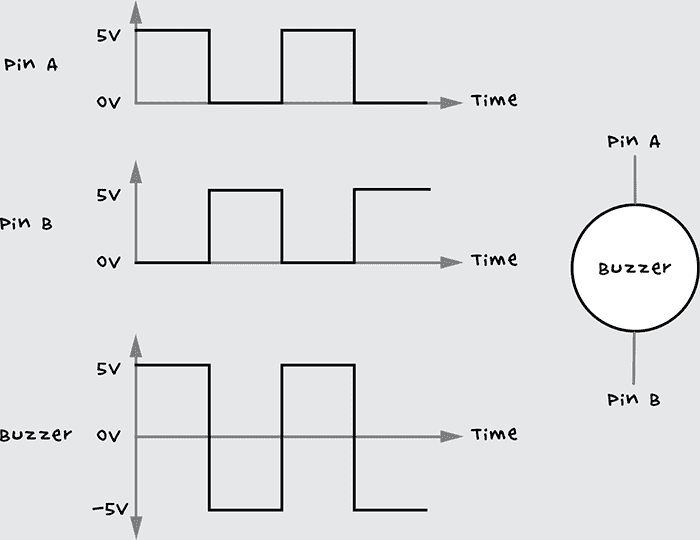

图 9-17：使用 Arduino 生成压电蜂鸣器上的交流电压。A 和 B 引脚是 Arduino 的输出端口。

当一个 Arduino 输出为高电平时，另一个为低电平，反之亦然。通过这种完全反转的极性，压电蜂鸣器可以实现 10V 的电压峰值变化，而不仅仅是通过切换一个引脚获得的 5V 电压。

你的诱饵的声音不会像原始烟雾探测器那么大，后者通常使用相同的原理，但电压是 9V 而不是 5V。不过，它应该还是相当响亮的。

##### **步骤 4：制作旗帜**

我的诱饵挥动一面旗帜，但你的不一定要这样。一旦伺服电机开始移动，你可以固定任何能够吸引僵尸注意的物体。可以尝试使用一块腐烂的肉来散发吸引僵尸的气味，或者如果伺服电机足够强大，你甚至可以拿到一只被切断的手，用来制造更逼真的人类干扰。

假设你只想挥动一面旗帜，图 9-11 中的简单布置使用了一张纸，将其折叠并粘贴到木制串签上。

##### **步骤 5：将旗帜固定到伺服电机上**

伺服电机通常配有不同的臂和一个固定螺丝，用来将臂固定在电机上。在这个项目中，我选择了车轮装置，并用强力环氧树脂胶将串签固定在上面（见图 9-18）。

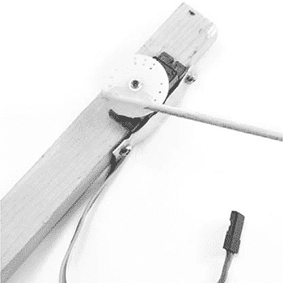

图 9-18：将旗帜附加到伺服电机上

目前还不要固定伺服电机的固定螺丝，因为一旦整个项目启动，你需要调整伺服臂的位置，以适应运动范围（大约 160 度）。

##### **步骤 6：将伺服电机固定到基座上**

为了将立柱固定到伺服电机上，我使用了一段木材。为了固定伺服电机，用木锯或小型电动爱好切割器在木材上切出一个小凹槽，使其能够适配伺服电机。然后利用伺服电机的安装孔和一些小螺丝将其固定。

作为一个巧思的练习，我将留给你找到最适合的方式将伺服电机固定到立柱上。在这里，我用了一小块废铝片将伺服电机固定在凹槽中。环氧树脂胶也可以使用。

现在，将立柱固定到底座上。我在一块平坦的有机玻璃底面钻了一个孔，并用螺丝将木制立柱固定上去。你可能更喜欢将立柱直接固定到现有的结构上，而不是使用独立支架。（同样，我将细节留给你自行决定。）

我还使用了 Arduino 的安装孔和另外两个螺丝将 Arduino 固定到立柱上，但这完全是可选的。同样，我将蜂鸣器用胶水粘在了立柱上（图 9-19）。

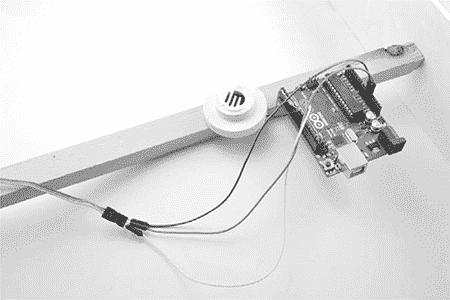

图 9-19：将 Arduino 和蜂鸣器固定到立柱上

##### **步骤 7：连接伺服电机**

伺服电机的连接线有三个端口，连接到一个三孔插座：黑色或棕色线是接地线，红色线是正电源线，第三根橙色或黄色线是控制信号线。

开始接线时，将三根公对公插头插入伺服电机的三孔插座。将伺服电机的橙色（或黄色）控制线连接到 Arduino 的第 10 号引脚。将黑色（或棕色）接地线连接到 Arduino 的任意一个 GND 端子。最后，将伺服电机的红色正电源线连接到 Arduino 的 5V 引脚。记住：如果你使用的是大功率伺服电机，你可能需要外接一个 6V 电池组，正如在“所需材料”中（第 170 页）所讨论的那样。

#### **软件**

本书的所有源代码可以从*[`www.nostarch.com/zombies/`](http://www.nostarch.com/zombies/)*下载，项目的 Arduino 草图叫做*Project_16_sound_ movement*。现在就下载它，并加载到你的 Arduino 上。如果你需要关于如何操作的复习，请参照附录 C 中的说明。

伺服电机通常与 Arduino 一起使用，因此有一个内置库可以方便地将它们一起使用。我们在草图的顶部导入这个库。

```
#include <Servo.h> 
```

三个常量定义了伺服电机的行为，调整这些常量的数值会改变伺服电机的动作：

```
const int minServoAngle = 10;
const int maxServoAngle = 170;
const int stepPause = 5;
```

伺服电机的运动范围为 180 度。常量`minServoAngle`和`maxServoAngle`将此范围限制在 10 到 170 度之间，而不是完整的 0 到 180 度，因为大多数伺服电机无法覆盖完整的 180 度。

常量`stepPause`设置了每次伺服电机运动之间的延迟时间（以毫秒为单位）。如果你真的想吸引僵尸的注意力，可以减少这个数值，让伺服电机更快移动。

在接下来的代码部分，我们为每个使用的 Arduino 引脚定义常量。

```
const int sounderPinA = 8;
const int sounderPinB = 9;
const int servoPin = 10;
```

一个名为`f`的常量指定了蜂鸣器的频率：

```
const long f = 3800; // Find f using Project_16_sounder_test
```

将`f`设置为蜂鸣器的最大频率，你应该在“步骤 3：测试压电发声器”中（第 173 页）记录了这个频率。

接下来，为了使用伺服库，我们定义一个名为`arm`的`Servo`对象：

```
Servo arm;
```

定义了所有常量和全局变量后，我们添加了一个`setup`函数来初始化伺服电机，并定义了用于蜂鸣器的两个引脚：

```
void setup()
{
  arm.attach(servoPin);
  pinMode(sounderPinA, OUTPUT);
  pinMode(sounderPinB, OUTPUT);
}
```

紧接着的`loop`函数调用了两个函数，一个用来挥动旗帜，另一个用来发出蜂鸣器声音：

```
void loop()
{
  wave();
  wave();
  makeNoise();
}
```

`wave`函数被调用两次来来回摇动旗帜。如果稍微的动作不足以引起僵尸的注意，还会调用`makeNoise`来发出蜂鸣器的声音。希望僵尸会把这些声音和动作误认为是某个有脑袋的东西，然后直奔这个诱饵而去！

在草图的结尾，定义了造成分散注意力的功能：

```
void wave()
{
  // Wave vigorously from left to right
  for (int angle = minServoAngle; angle < maxServoAngle; angle++)
  {
    arm.write(angle);
    delay(stepPause);
  }
  for (int angle = maxServoAngle; angle > minServoAngle; angle--)
  {
    arm.write(angle);
    delay(stepPause);
  }
}
```

`wave`函数包含两个循环：一个循环以预定的速度将伺服电机从最小角度移动到最大角度，第二个循环则将其反向移动。

现在，让我们来看一下`makeNoise`：

```
void makeNoise()
{
  for (int i = 0; i < 5; i++)
  {
    beep(500);
    delay(1000);
  }
}
```

这个函数包含一个循环，它调用`beep`函数五次，发出五次蜂鸣器的声音。`beep`的参数是声音持续时间，单位是毫秒（此处为 500）。每次蜂鸣之间会有一秒钟（1000 毫秒）的延迟。

**注意**

如果一直使用相同的数值，导致本地僵尸对你诱饵的效果产生免疫，可以尝试调整传递给`beep`和`delay`的数值。你甚至可以随机化这些数值，使用 Arduino 的 random()函数。

`beep`函数本身在两个蜂鸣器引脚上生成交流信号：

```
   void beep(long duration)
   {
➊   long sounderPeriodMicros = 500000l / f;
➋   long cycles = (duration * 1000) / sounderPeriodMicros / 2;
     for (int i = 0; i < cycles; i++)
     {
       digitalWrite(sounderPinA, HIGH);
       digitalWrite(sounderPinB, LOW);
       delayMicroseconds(sounderPeriodMicros);
       digitalWrite(sounderPinA, LOW);
       digitalWrite(sounderPinB, HIGH);
       delayMicroseconds(sounderPeriodMicros); 
     }
   }
```

首先，我们使用频率`f`计算每次振荡的周期 ➊。得到的值必须再除以 2 ➋，因为我们真正需要的是在交换引脚极性时的延迟时间，而且每次振荡需要两次这样的延迟。

使用那个分割的周期，`beep`函数计算出发出正确时长的蜂鸣所需的总周期数。接下来的`for`循环使用这些信息生成所需的脉冲。

#### **使用声音和动作干扰器**

本章中的两个项目都需要保持干燥。为了防水声音和动作干扰器，你可以制作某种外壳或保护性屋顶。如果你的装置是独立式的，一个带盖的大塑料垃圾桶就能派上用场。我相信你能从最近的废弃折扣零售店找一个来。

只需将垃圾桶的一边切掉，这样僵尸就能看到并听到诱饵的声音，将项目本身固定到盖子上，再把垃圾桶倒扣在上面。将这个盒子连接到杠杆和滑轮系统，你甚至可以从安全的基地将其降到地面，创造一种新的运动：僵尸钓鱼。谁说末日 Apocalypse 中不能玩得开心呢？

当然，声音和动作的干扰装置也有很多实际的末日后使用场景：

• 将其放置在你的据点最脆弱的地方，吸引攻击的僵尸群体，为你提供时间强化掩体。

• 将它放置在僵尸陷阱旁边，引诱僵尸进入陷阱。

• 偷偷溜进你邻居的院子，减少竞争对幸存者资源的争夺。

如果你想找到其他幸存者（无论是联合还是避开他们），在下一章中，我们将探讨如何使用无线技术进行通信。
