## **10**

**与其他幸存者沟通**


在第一章中，我们讨论了在僵尸横行的世界中与其他人合作的利弊。与其他人合作无疑是值得的：你们可以互相保护，分享知识，集中资源，等等。当然，他们也可能拿走你的东西，把你推到他们和即将来临的僵尸之间。如果你决定冒险与其他生命形式接触，那么就按照本章中的项目进行构建。

首先，我们将构建一个信标，广播一个可以在 FM 收音机上听到的语音信号，任何扫描空中波段的幸存者都能听到你的信息，无论是“走开！”还是“救命，我被困在商场的屋顶！”之后，你还将构建一个摩尔斯电码闪光器，闪烁出你愿意翻译成点和划的任何信息。

当然，如果你想扫描频率带，本章也解释了如何破解一个收音机接收器来搜索信号。然后，你可以悄悄地潜伏，决定外面是否值得广播（见图 10-1）。


图 10-1：僵尸也喜欢收音机。

### **项目 17：树莓派收音机发射器信标**

树莓派是一种多功能设备，如果有合适的软件，它可以作为 FM 收音机发射器。你唯一需要的额外硬件是一段电线，作为天线使用。

#### **你需要的材料**

这是另一个树莓派项目，因此你需要一个正常工作的树莓派系统，配有键盘、鼠标和屏幕，如第五章所述。一旦广播信号的程序运行起来，你可以选择关闭屏幕以节省电力。

**收音机发射器的合法性**

如果你是在僵尸末日后阅读本书，那么建造发射器不会遇到任何法律问题，因为那时没有政府来执行这些法规。然而，如果你是在为末日做准备，那么本项目中的发射器的合法性与为车载音响连接 MP3 播放器设计的 FM 发射器受到同样的法律监管。

如果有效范围为 200 英尺（60 米）或更短，这些发射器在美国是合法的。如果你使用全长天线，这个发射器的范围会比那个更远，因此为了遵守法律，使用约 3 或 4 英寸（7 到 10 厘米）的短天线。

对无线电频率的监管是必要的，以确保紧急服务使用的频率不受干扰，但这个发射器只使用公共广播的 FM 波段。最糟糕的情况是，邻居会接收到你的广播，而不是他们最喜欢的电台。

要构建这个收音机发射器，你需要以下部件：

| **物品** | **备注** | **来源** |
| --- | --- | --- |
|  树莓派 | 树莓派 2 型号 B 或 B+ | Adafruit (2358), Fry’s (8258726) |
|  跳线电缆 | 母对母跳线电缆 | Adafruit (826) |
|  天线电线 | 大约 3 英尺（1 米）的电线 |  |

任意电线都适用于发射器；只需检查你的接线材料箱，找一根能插入母对母跳线的一端的电线。

你可以将无线电发射器添加到现有的树莓派设置中。不过，为了获得最大传输范围，你需要将发射器放置在一个较高的位置，因此我建议你购买第二块树莓派。

跳线电缆的长度不重要；它只是允许树莓派 GPIO 引脚与天线电线之间轻松连接。用于其他部分天线的电线应具有适当的尺寸，以便插入母对母跳线的一端并保持固定。你可能需要在天线电线的一端打个弯，以使其保持在原位。

#### **构建**

要构建发射器，你只需将跳线电缆的一端插入树莓派的 GPIO 引脚 4（见图 10-2），然后将天线电线插入跳线电缆的另一端，并将天线的另一端固定在一个高处，以便天线垂直拉起。

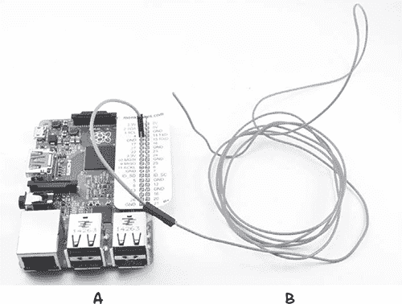

图 10-2：连接天线

如果你将整个树莓派放在高处，你将获得最长的传输范围。如果你有一个瞭望塔，这将是理想的选择。

如果天线电线不够直也没关系。你可能会发现，将一些电工胶带缠绕在天线电线与跳线的连接处，可以防止天线脱落。一旦加固了天线，你就完成了你的无线电发射器信标！

#### **软件**

我希望能为你在这个项目中使用的精彩软件称功，但由于它是由帝国理工大学机器人协会的那些聪明人开发的，所以我不能。你可以在 *[`www.icrobotics.co.uk/wiki/index.php/Turning_the_Raspberry_Pi_Into_an_FM_Transmitter`](http://www.icrobotics.co.uk/wiki/index.php/Turning_the_Raspberry_Pi_Into_an_FM_Transmitter)* 上了解他们的项目。

该软件使用一个声音文件以正确的方式使 GPIO 引脚 4 振荡，从而生成 FM 载波波形和信号（见频率调制框）。

要安装软件，请在树莓派上启动 LXTerminal 会话，并输入以下命令：

$ mkdir pifm

$ cd pifm

$ wget http://www.icrobotics.co.uk/wiki/images/c/c3/Pifm.tar.gz

$ tar -xzf Pifm.tar.gz

这些命令创建一个目录，准备安装软件，使用 `wget` 工具下载软件，然后将下载的文件解压到新创建的目录中。

#### **使用 FM 发射器**

要测试 FM 发射器，你需要一个 FM 接收器（请参见 “项目 18：Arduino FM 无线电频率跳跃器” 以及 第 188 页）。你还需要找到一个未被使用的频率，或者至少是一个信号很微弱的频率。当然，末日后这不会成为问题，但在末日前的拥挤电波中，这可就成了一个挑战。使用你的 FM 接收器找到一个信号空闲的频段，并记下这个频率。

你安装的软件包括一个 *星际大战* 主题的声音样本，用于在录制你自己的、更合适的消息之前测试发射器——尽管这段音乐完全不失为一个伴随人类拯救自己的伟大斗争的背景音乐。

在 LXTerminal 中，输入以下命令，将音乐通过发射器播放：

$ sudo ./pifm sound.wav 103.0

将 *103.0* 替换为你的收音机接收到的频率。

##### **录制消息**

要录制一条消息，你需要一台笔记本电脑和一些声音录制或编辑软件。我推荐 Audacity，它可以在 Windows、OS X 和 Linux 上免费下载，访问链接：[`audacityteam.org/`](http://audacityteam.org/)

小说和历史都告诉我们，当法律和秩序瓦解时，坏行为往往随之而来。所以，在你准备发送消息时，务必要认真思考你想说的话。谁知道会有多少带枪、偷取物资的恶棍潜伏在角落里？你可能希望先将新来的人引导到一个你可以观察的地方，在降低防备之前，记得这一点，特别是在录制广播时。

pifm 软件要求你将消息录制为采样率为 16 位 44.1kHz 的音频文件，然后将其导出为 WAV 文件。在软件中，将 `sound.wav` 更改为你新音频文件的名称，比如 *my*_*message.wav*。

**调频**

调频，或简称 FM，是一种将信号（在这种情况下是低频声音信号）编码到一个远高于载波频率的载波上。声音信号根据消息信号波形的强度，推动载波频率向上或向下偏移。

图 10-3 显示了消息信号（实线）的两个周期，它们叠加在远高于频率的载波上，形成广播信号（虚线）。广播信号的频率会随消息信号的变化而变化。


图 10-3：调频

当信号达到最大时，虚线广播信号的波峰距离最接近。这意味着频率高于平均值。在波形的底部，当信号达到最低值时，广播信号的波峰最远离（频率低于平均值）。

通过这种方式，低频声音波被编码到高频载波上。当这个信号传送到 FM 收音机接收器时，接收器中的电路会从载波信号中提取出原始的低频音频。

##### **自动运行发射器**

为了最大化其他幸存者发现你的消息的机会，全天候重复此广播。你可以配置树莓派自动为你完成这项任务，使用一个名为`crontab`的 Linux 工具。`crontab`工具允许你安排程序在一天中的特定时间运行。

在 LXTerminal 中输入以下命令：

$ sudo crontab -e

这将打开一个配置文件，使用 nano 编辑器进行编辑，如图 10-4 所示。

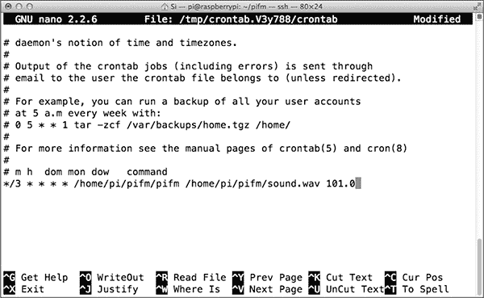

图 10-4：安排你的广播时间

向文件末尾滚动并添加以下行：

*/3 * * * * /home/pi/pifm/pifm /home/pi/pifm/sound.wav 101.0

这行代码的第一部分（`*/3`）安排了每 3 分钟运行一次广播，每天 24 小时，7 天一周。如果你使用不同的音频文件或频率，你需要将`sound.wav`替换为你的文件名，并输入你选择的频率。如果你的消息超过了 3 分钟，改变`*/3`为你需要的分钟数。

你只需要进行一次此配置；即使 Pi 重启，设置也会保持。

### **项目 18：ARDUINO FM RADIO FREQUENCY HOPPER**

在丧尸末日发生后，群体生活将提高你的生存几率——前提是没有被咬的人进入并变成丧尸。在允许他人进入之前，一定要确保每个人都接受检查，确保没有丧尸感染的伤口！

你不可避免地需要睡觉或者外出寻找补给，而如果没有人帮助你看守背后，你就会变得脆弱。（更不用说你会因为缺乏人类接触而逐渐陷入疯狂——你以为丧尸已经够疯狂了。）因此，你很可能会从有几个同伴的陪伴中受益。其他幸存者小组可能已经通过广播他们自己的无线电信息试图与你们取得联系，就像我们现在正在做的那样。事实上，另一组人可能已经购买或回收了这本书，并制作了第 17 项目的 FM 发射器。为了找到他们，你只需要能够接收到他们的广播信号。

这个项目（图 10-5）利用一个便宜的 FM 接收器，并进行黑客修改，使其能够自动扫描 FM 频段寻找下一个电台。如果有人开始在 FM 频段进行广播，创建了一个电台而不是空旷的噼啪声，你就能听到他们的广播。一个 Arduino 模拟按下收音机接收器上的调频按钮。


图 10-5：FM 收音机频率跳跃器

#### **你需要的材料**

为了制作这个项目，你将需要以下部件：

| **物品** | **备注** | **来源** |
| --- | --- | --- |
|  Arduino | Arduino Uno R3 | Adafruit, Fry’s (7224833), Sparkfun |
|  FM 收音机 | 简单的低成本 FM 耳机收音机 | Dollar Store（或您所在国家货币名称等效的商店） |
|  带电扬声器 |  | 电子商店 |
|  音频线（辅助线） | 用于将收音机连接到带电扬声器 |  |
|  红色 LED | 2 个红色 LED | Adafruit (297) |
|  圆形插座插头 | 带飞线的 DC 电源插座、12V 汽车点烟器适配器或 5V USB 适配器和线 | Adafruit (80), eBay |
|  直角排针 | 12 脚直角排针 | eBay |

我们使用的是直角引脚而非直插式引脚，因为直角引脚能使得焊接电线和元件引脚变得稍微容易一些。

寻找一款具有调谐按钮的 FM 收音机，调谐按钮可以将频率从一个电台切换到下一个，而重置按钮则可以从 FM 波段的起点开始播放。我使用的这款收音机不到 2 美元，包含了入耳式耳机。

Arduino 和扬声器都需要电源。虽然我建议使用圆形插座，但你也可以同样使用 USB 端口为 Arduino 供电。到现在为止，你应该已经习惯于从 12V 电池为低电压设备提供电源的最便捷方式了。

#### **构建**

本项目假设收音机使用的是 SC1088 集成电路。这个极为低成本的芯片被广泛应用于大多数廉价收音机，似乎都使用数据手册中指定的参考设计。（只需在线搜索“SC1088 datasheet”，应该能在前几条搜索结果中找到 PDF 文件。）接线图如图 10-6 所示，显示了通过 DC 插座为 Arduino 供电，但也可以通过 USB 端口为其供电。

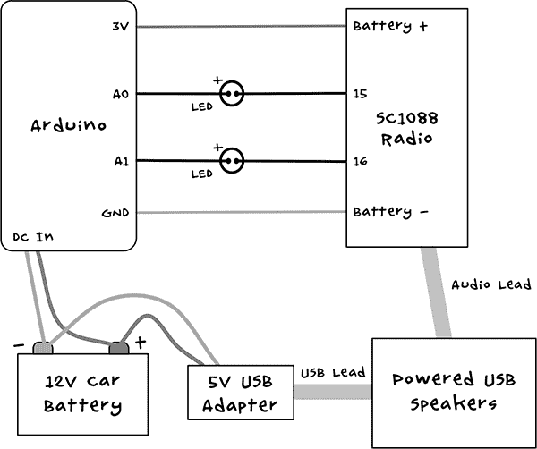

图 10-6：收音机扫描器接线图。SC1088 收音机上的数字 15 和 16 表示芯片的引脚编号。

SC1088 集成电路的“调谐”和“重置”引脚设计为连接到短接这两个引脚至芯片 3V 电源轨的瞬时按键。你可以在数据手册的参考原理图中看到这种配置。当按键不短接输入引脚与电源轨时，它们通过芯片内部设置的可变电阻拉至地。我们可以通过在需要模拟按钮按下时，将这些引脚连接到大约 3V 来模拟按键功能；而在我们需要模拟按钮等待按下时，则让引脚保持*浮空*状态（不被驱动为高或低电平）。为了让引脚浮空，我们可以将驱动该引脚的 Arduino 引脚设置为输入。当作为输入时，I/O 引脚被称为*高阻抗*状态，意味着该引脚对附着在其上的任何东西来说，就像是一个开路。

为了将 Arduino 输出针脚的 5V 转换为 3V，我们将红色 LED 放在 Arduino 针脚和 SC1088 之间。这些 LED 将 5V 降到大约 3.3V，与提供给芯片的电压相同。当激活时，LED 会非常微弱地发光，告诉你项目正在运行。

##### **步骤 1：拆解收音机**

首先，把收音机拆开。具体怎么拆取决于你的收音机的组装方式。对于我的收音机，我只需要松开两个螺丝，整个收音机就拆开了。图 10-7a 显示了收音机的原始状态，10-7b 显示了拆下外壳后的状态。

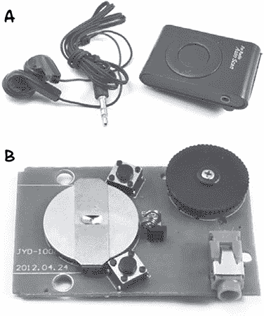

图 10-7：拆解收音机

取出钮扣电池，因为我们将使用 Arduino 为收音机提供电源。

##### **步骤 2：识别连接点**

现在我们需要识别需要连接电线和 LED 引线的点。图 10-8 显示了收音机电路板的底面。

首先识别扫描和复位开关的位置。它们的引脚会形成一个矩形。这些引脚是成对连接的，因此标记为*A*的焊接点实际上是连接的，标记为*B*的焊接点也是如此。

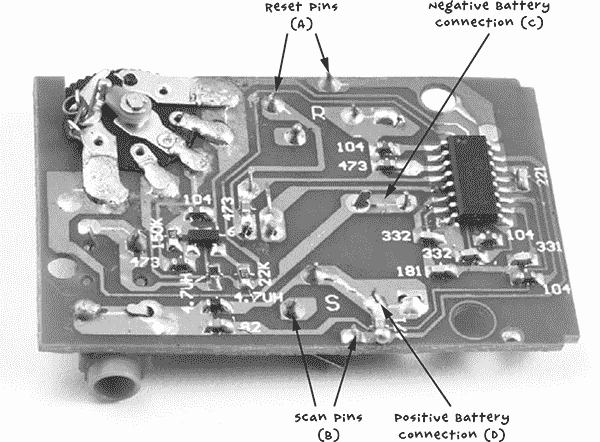

图 10-8：收音机 PCB

A 连接用于复位按钮。如果你沿着 PCB 上的轨迹追踪，你会看到 A 针脚其中一个连接到 SC1088 的第 16 脚（IC 针脚编号从 1 到 16，按逆时针方向排列，IC 封装旁边的一个小点表示第 1 脚）。

沿着 B 点的轨迹，你可以看到其中一个针脚连接到 SC1088 的第 15 脚。这就是我们用来扫描下一个电台的连接。

如果你很难看清楚轨迹的走向，可以使用万用表的通断模式来识别针脚。将一只探针放到你想找连接的 IC 针脚（15 或 16），然后用另一只探针试探开关上的不同可能连接点，直到万用表的蜂鸣器响起。

接下来，找到需要将收音机从 Arduino 供电的两个连接点，它们对应于 PCB 上的电池座连接点。收音机使用的 3V 电池有一个负极连接（C）和一个连接到电池座外框的正极连接（D）。

##### **步骤 3：连接排针**

我在这里建议使用一个直角排针，因为它更容易焊接电线，但常规的排针也几乎同样有效。将 12 针长的排针断开并将其连接到 Arduino 的 3.3V 到 A5 针脚上（图 10-9）。其中一个针脚会位于两个排针插座之间，未连接任何东西。

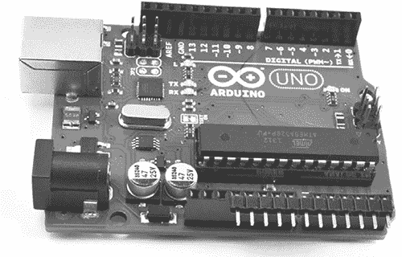

图 10-9：Arduino 排针

##### **步骤 4：将收音机连接到 Arduino**

图 10-10 展示了收音机连接到 Arduino。使用短线将 3.3V 的 Arduino 引脚连接到你之前标记的正极电池连接点 D。将一个 Arduino GND 连接（哪个都可以）连接到点 C，负极电池连接。将一个 LED 的正极（较长的引脚）连接到 Arduino 的 A0 引脚，负极连接到点 B。另一个 LED 同样连接到 Arduino 的 A1 引脚和收音机 PCB 上的 A 点。


图 10-10：Arduino 与收音机连接

##### **步骤 5：将所有组件连接在一起**

最后，将供电的扬声器插入收音机的音频插孔。你可以先使用耳机进行测试。收音机使用耳机或音频线作为天线，所以使用几英尺长的音频线可能会比使用非常短的音频线得到更好的效果。

#### **软件**

本书的所有源代码可从*[`www.nostarch.com/zombies/`](http://www.nostarch.com/zombies/)*获得。请参阅附录 C 了解有关安装 Arduino 草图的说明。

本项目的 Arduino 草图名为*Project_18_Scanner*，我将带你逐步了解它。

草图开始时定义了几个常量：

```
const int scanPin = A0;
const int resetPin = A1;const int pulseLength = 1000;
const int period = 5000;
const int numStations = 5;
```

`scanPin`和`resetPin`常量定义了我们将使用的两个 Arduino 引脚，`pulseLength`定义了模拟按钮按下的时间长度。扫描按钮需要按下完整的 1,000 毫秒（1 秒），收音机才会扫描下一个电台，而不是仅仅将频率上移一步，尽管这可能会根据你的收音机有所不同。

常量`period`告诉 Arduino 一个时间段，单位是毫秒，用来暂停，以便你有时间判断是否听到了传输信号，还是只是白噪声。

接下来，我们定义一个全局变量：

```
int count = 0;
```

这个变量，名为`count`，用于记录扫描次数，在重新开始扫描 FM 频段之前。

`setup`函数将两个引脚初始化为输入（尽管正如我们将看到的，这个草图很特别，在第一次初始化引脚后会更改引脚模式）。

```
void setup()
{
  pinMode(scanPin, INPUT);
  pinMode(resetPin, INPUT);
}
```

`loop`函数是我们实际扫描频率的地方：

```
void loop()
{
  delay(period);
  pinMode(scanPin, OUTPUT);
  digitalWrite(scanPin, HIGH);
  delay(pulseLength);
  pinMode(scanPin, INPUT);
  count ++;
  if (count == numStations)
  {
    count = 0;
    pinMode(resetPin, OUTPUT);
    digitalWrite(resetPin, HIGH);
    delay(pulseLength);
    pinMode(resetPin, INPUT);
  }
}
```

首先，循环会按照`period`中指定的时间进行延迟。然后，函数向扫描引脚发送一个脉冲以开始扫描。当脉冲完成后，引脚会被重新设置为输入。

然后，`count` 变量递增，当它达到 `numStations` 中指定的最大值时，会向重置引脚发送一个脉冲，从 FM 波段的起始点重新开始扫描。在测试期间，将 `numStations` 设置为 5 可以检查项目是否正常工作并找到不同的电台。然而，在僵尸末日之后，无线电波应该会变得相当空旷，因此你可能想将此数字减少到 1，因为你偶然遇到的任何信号必定是由幸存者（或许是聪明的僵尸）传送的。如果你发现任何你想忽略的自动化传输，例如你前老板发来的求救信号，或者僵尸们莫名其妙地学会了人类语言的低语声，可以将 `numStations` 设置为比你想忽略的电台数量多一个的值。

#### **使用无线电扫描仪**

当你第一次开启所有设备时，应该会听到杂音。大约五秒后，扫描 LED 会发出微弱的光，接着无线电会扫描第一个电台。再过五秒，它会继续扫描下一个电台，依此类推，直到你识别到一个人类朋友。记住：人多力量大——但不是人群。

### **项目 19：ARDUINO 莫尔斯电码信标**

莫尔斯电码是 19 世纪的发明，它允许你通过一系列长短不一的光或声音脉冲发送信息。字母表中的每个字母由点和横线组成，其中点是短脉冲，横线是长脉冲（比点长三倍）。例如，字母 *z* 的表示方式是：

z

--..

词语 *zombie* 的莫尔斯电码表示是：

僵尸

--.. --- -- -...   .. .

莫尔斯电码使用较短的短横线和点的组合来表示常用字母，因此，作为英语中最常用的字母，*e* 只由一个点表示。如果你有兴趣，可以在线搜索完整的莫尔斯电码，虽然本项目中的软件会自动将你的信息转换为莫尔斯电码。查看代码中莫尔斯电码表。

这个基于 Arduino 的项目使用了 12V LED 灯泡，就像你在 “项目 3：LED 照明” 中使用的那样，用来向任何可视范围内的其他幸存者闪烁消息。特别是在夜间效果显著。图 10-11 显示了完成的项目。

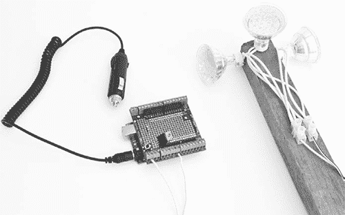

图 10-11：莫尔斯电码信标

#### **你将需要的材料**

要制作这个项目，你需要以下零件：

| **物品** | **备注** | **来源** |
| --- | --- | --- |
|  Arduino | Arduino Uno R3 | Adafruit, Fry’s (7224833), Sparkfun |
|  Screwshield |  | Adafruit (196) |
|  1 kΩ 电阻 |  | Mouser (293-1k-RC) |
|  MOSFET | FQP33N10 MOSFET | Adafruit (355) |
|  MR16 LED 灯泡 | 12V 3W | 五金商店 |
|  MR16 灯座 | 带导线的插座 | 五金店 |
|  接线端子 | 2 路接线端子 | 家得宝、Lowe's、Menards |
|  9V Arduino 电池连接线 | 带飞线的直流电源插座或 12V 汽车点烟器适配器 | 直流电源 |
|  电线 | 门铃电缆（或其他电缆） |  |

最好使用一个全新的 Arduino 和螺丝屏来完成这个项目，既因为它将远离你的主设备，也因为你之前的螺丝屏可能已经用得差不多了。这个项目将由独立的太阳能电源和电池供电（请参见“项目 1：太阳能充电”（Project 1: Solar Recharging），见第 26 页）。

我使用了三个 LED 灯，但如果你想要更多的灯具，只需并联更多的灯。用于开关灯具的晶体管能承载最高 20W 的照明功率，但必须加装散热器，因此你的总功率应保持在 10W 以下。如果你完成了“项目 3：LED 照明”（Project 3: LED Lighting），见第 49 页，我建议直接使用相同的 LED 灯。

#### **构建**

螺丝屏和接线图示见图 10-12。

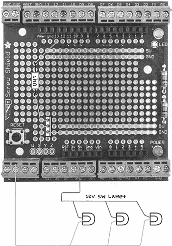

图 10-12：摩尔斯电码信标的螺丝屏布局和接线图

##### **步骤 1：组装螺丝屏**

按照“组装螺丝屏”（Assembling a Screwshield）中提供的说明，组装螺丝屏，见第 259 页。

##### **步骤 2：将元件焊接到螺丝屏上**

本项目只需焊接两个元件：一个电阻和金属氧化物半导体场效应晶体管（MOSFET）。MOSFET 非常适合快速开关较大功率负载。

根据电路图焊接电阻和晶体管。在焊接晶体管时，确保其金属标签朝右（见图 10-12）。当所有元件焊接到位时，组装件应如下图所示图 10-13。

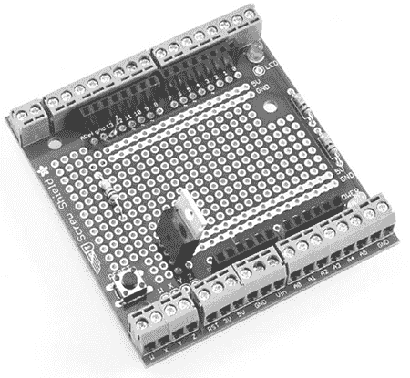

图 10-13：螺丝屏的顶部

##### **步骤 3：接线螺丝屏的底部**

一旦元件固定好后，使用它们的多余导线在底部进行连接（见图 10-14）。在焊接连接到 Arduino 第 13 号引脚的电阻导线之前，添加一些绝缘层，以防与 5V 和 GND 轨道发生短路。

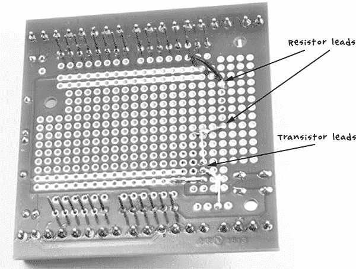

图 10-14：螺丝屏的底部

##### **步骤 4：连接灯具**

如果你想简化，可以只使用一个 LED 灯。但如果你需要更广的视距，可以连接几个 LED 灯并将它们指向不同的方向（见图 10-15）。

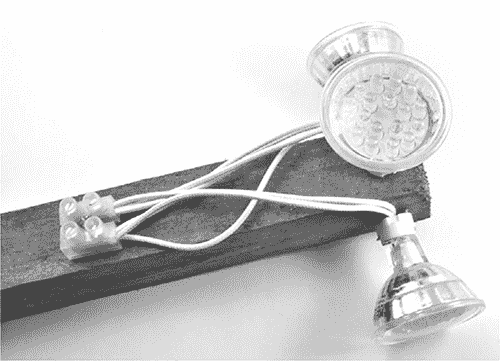

图 10-15：灯具组件

在图 10-15 中，我将三个灯座固定在一块木板上，并将三盏 12V LED 灯连接到接线端子块。此类灯通常包括一个电路，允许电线以任意方式连接，但如果你的模块上标有极性符号（+ 和 –），你需要确保所有的 + 连接都连接到接线端子块的一个端子，– 连接连接到另一个端子。灯座上会有孔，可以用螺丝将它们固定在木板上。

##### **步骤 5：最终接线**

使用一些铃线或其他电缆将灯具组件连接到螺丝盾上的 *X* 和 *V[in]* 端子。最好使用多股电线，因为它不容易断裂。将这根电线做得足够长（但超过 50 英尺或 15 米时，亮度可能会有所降低）：你可能希望将灯具组件安装在较高的地方，这样人们可以更容易地看到你的信息，而将 Arduino 保持在安全的地方。记得将灯具组件防水——将其密封在透明塑料袋中即可。

要为 Arduino 供电，可以使用香烟点烟器适配器或通过鳄鱼夹和带飞线的桶形插头自定义导线，将 Arduino 连接到 12V 太阳能电源或电池。请注意，这个项目需要 12V 为灯泡供电，因此无法使用 5V USB 导线为 Arduino 提供电力。

#### **软件**

本书的所有源代码都可以通过 *[`www.nostarch.com/zombies/`](http://www.nostarch.com/zombies/)* 获取。请参见附录 C，了解安装 Arduino 草图的说明。这个项目的 Arduino 草图名为 *Project_19_Morse_Beacon*。

该草图使用了 Arduino 内建的 *EEPROM* 库。每次更改时，摩尔斯代码消息都会存储在 EEPROM 内存中，这意味着即使 Arduino 的电源中断，信标仍然能够记住消息。该草图还使用了 Arduino 社区提供的一个库 *EEPROMAnything*，它简化了对 EEPROM 的存取操作。EEPROMAnything 的代码已包含在本项目的下载包中，因此无需单独下载。

首先，我们加载官方的 Arduino EEPROM 库和 EEPROMAnything 库：

```
#include <EEPROM.h>
#include "EEPROMAnything.h"
```

使用了多个常量来控制项目：

```
const int ledPin = 13;
const int dotDelay = 100; // milliseconds
const int gapBetweenRepeats = 10; // seconds
const int maxMessageLen = 255;
```

控制 LED 的引脚在 `ledPin` 中指定。常量 `dotDelay` 以毫秒为单位定义了点闪烁的持续时间。破折号的持续时间总是点的三倍。

常量 `gapBetweenRepeats` 以秒为单位指定每次重复消息之间的时间间隔，`maxMessageLen` 指定消息的最大长度（按字母计，而不是点和破折号）。设置最大大小是因为在 Arduino 代码中，你必须声明数组的大小。

使用了两个全局变量：

```
char message[maxMessageLen];
long lastFlashTime = 0;
```

`message`变量将包含要闪烁的消息文本，而`lastFlashTime`则记录上次闪烁消息的时间，以便在重复之间有时间间隔。

使用两个全局`char`数组来存储摩尔斯电码的点和划线序列。程序只会闪烁它知道如何发送的字符，即字母、数字或空格字符。消息中的所有其他字符都会被忽略。

```
char* letters[] = {
  ".-", "-...", "-.-.", "-..", ".", "..-.", "--.", "....", "..",   // A-I
  ".---", "-.-", ".-..", "--", "-.", "---", ".--.", "--.-", ".-.", // J-R
  "...", "-", "..-", "...-", ".--", "-..-", "-.--", "--.."         // S-Z
};

char* numbers[] = {"-----", ".----", "..---", "...--", "....-", ".....",
"-....", "--...", "---..", "----."};
```

`setup`函数将`ledPin`设置为输出，然后在`Serial.begin`中启动串行通信：

```
void setup()
{
  pinMode(ledPin, OUTPUT);
  Serial.begin(9600);
  Serial.println("Ready");
  EEPROM_readAnything(0, message);

  if (! isalnum(message[0]))
  {
    strcpy(message, "SOS");
  }
  flashMessage();
}
```

使用串行通信来设置新消息，可以通过 Arduino IDE 的串行监视器，或者如你在“使用摩尔斯信标”中看到的那样，在第 205 页上，通过在树莓派上运行的终端程序进行设置。

每次消息更改时，都会将其保存在 EEPROM 中，因此在设置过程中，草图会从 EEPROM 中读取任何存储的消息。如果没有设置消息，`setup`中的`if`语句会将默认消息设置为“SOS”。最后，在`flashmessage`中，设置函数会首次闪烁该消息。

`loop`函数首先检查是否有新消息通过串行连接发送过来：

```
void loop()
{
  if (Serial.available())      // Is there anything to be read from USB?
  {
    int n = Serial.readBytesUntil('\n', message, maxMessageLen-1);
    message[n] = '\0';
    EEPROM_writeAnything(0, message);
    Serial.println(message);
    flashMessage();
  }
  if (millis() > lastFlashTime + gapBetweenRepeats * 1000L)
  {
    flashMessage();
  }
}
```

任何新消息都会读取到`message`字符数组中，直到读取到换行符（`\n`）。然后在消息末尾添加空字符`’\0’`，这是 Arduino 指示字符字符串结束的方式。一旦整个消息读取完毕，它将被保存到 EEPROM 中（`EEPROM_writeAnything`），然后新消息立即开始闪烁。

`loop`函数的其余部分检查是否已经过了足够的时间，允许重复发送消息。虽然可以通过`delay`更简单地实现，但如果在`delay`期间有新消息到达，我们将无法中断循环。

`flashMessage`函数是草图中最复杂的函数。

```
void flashMessage()
{
  Serial.print("Sending: ");
  Serial.println(message);
  int i = 0;
  while (message[i] != '\0' && i < maxMessageLen)
  {
    if (Serial.available()) return; // new message 
    char ch = message[i];
    i++;
    if (ch >= 'a' && ch <= 'z')
    {
      flashSequence(letters[ch - 'a']);
    }
    else if (ch >= 'A' && ch <= 'Z')
    {
      flashSequence(letters[ch - 'A']);
    }
    else if (ch >= '0' && ch <= '9')
    {
      flashSequence(numbers[ch - '0']);
    }
    else if (ch == ' ')
    {
     delay(dotDelay * 4);      // gap between words 
    }
  }
  lastFlashTime = millis();
}
```

`flashMessage`函数首先回显它将要发送的消息，以确保它发送的是你希望发送的内容。然后，它循环遍历消息中的每个字符。在每个字符之前，它使用`Serial.available`检查是否有新消息。如果有新消息到达，函数会停止发送当前消息，并开始接收来自计算机或树莓派的新消息；然后它将开始发送新消息。

`flashMessage`函数确定字符是大写字母、小写字母、数字还是空格字符，然后采取相应的行动。

如果字符是小写字母，则将字母数组中点和划线序列的索引位置作为参数传递给`flashSequence`函数，后者会闪烁这些点和划线。其他选项以相同的方式处理。

最后，当整个消息发送完毕后，`lastFlashTime`变量将设置为当前时间，以便循环函数可以计算出何时开始重新闪烁消息。

闪烁特定字符的点和划的工作由`flashSequence`函数处理：

```
void flashSequence(char* sequence)
{
   int i = 0;
   while (sequence[i] != NULL)
   {
       flashDotOrDash(sequence[i]);
       i++;
   }
   delay(dotDelay * 3);    // gap between letters
}
```

这个过程会循环遍历每个点或划，调用`flashDotOrDash`：

```
void flashDotOrDash(char dotOrDash)
{
  digitalWrite(ledPin, HIGH);
  if (dotOrDash == '.')
  {
    delay(dotDelay); 
  }
  else // must be a -
  {
    delay(dotDelay * 3); 
  }
  digitalWrite(ledPin, LOW); 
  delay(dotDelay); // gap between flashes
}
```

`flashDotOrDash`函数使用适当的延迟时间来闪烁一个点或一个划。

#### **使用摩尔斯信标**

上传草图到 Arduino 并启动项目。默认消息应该开始闪烁。如果没有，检查所有接线。要更改消息，请将 Arduino 连接到你的计算机，打开 Arduino IDE 的串口监视器，并输入新消息（图 10-16）。

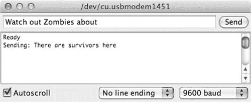

图 10-16：使用串口监视器更改消息

在这里，当按下发送按钮时，当前的消息“这里有幸存者”应该改为“当心僵尸在附近”。

如果你更喜欢使用树莓派来更改消息，安装终端程序`screen`（你的树莓派需要连接互联网）：

$ sudo apt-get install screen

一旦`screen`安装完成，连接树莓派和 Arduino 之间的 USB 线，然后在树莓派上输入以下命令：

$ screen /dev/ttyACM0 9600

此时，你输入的任何内容都应该发送到 Arduino，来自 Arduino 的任何消息也应显示出来。图 10-17 展示了使用`screen`更改消息。注意，消息不会在你输入时立即显示，而是在你按下`ENTER`后显示。

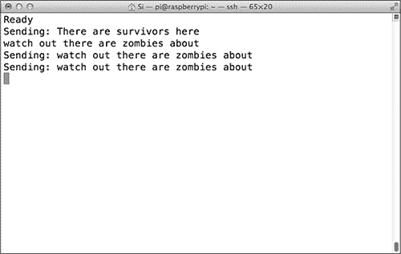

图 10-17：使用 screen 命令更改消息

一旦消息被更改，Arduino 会记住它，因此你可以拔掉 Arduino，为安装做准备。拔掉 Arduino 会通过关闭与树莓派的串口连接来退出`screen`命令。

现在只需将项目固定在你希望的位置，最好是一个可以看到 360 度视野的地方，然后开始闪烁你的消息。图 10-18 显示了我将项目固定在抗僵尸小屋上的样子。

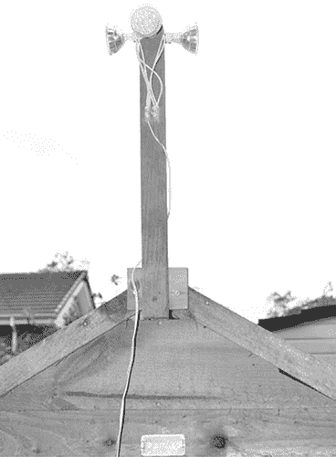

图 10-18：安装摩尔斯信标

如果你想节省电力，只在晚上使用信标，因为那时最可能被发现。但要小心：流行文化给我们关于僵尸是否会被闪烁的光吸引的信息不一。在发送消息之前，你可能想要加固你的据点，以防万一。

在第十一章中，我们将继续探讨通信的主题。作为本书的最终项目，我们将构建一对触觉通信设备，允许你和另一位幸存者在不引起僵尸注意的情况下进行静默交流。
