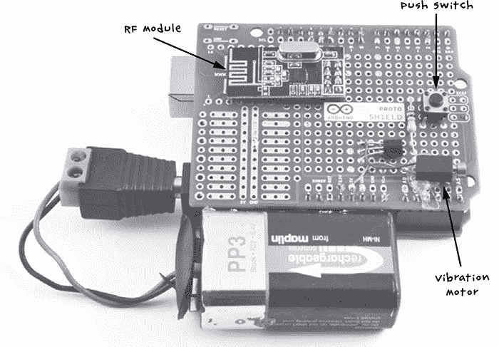
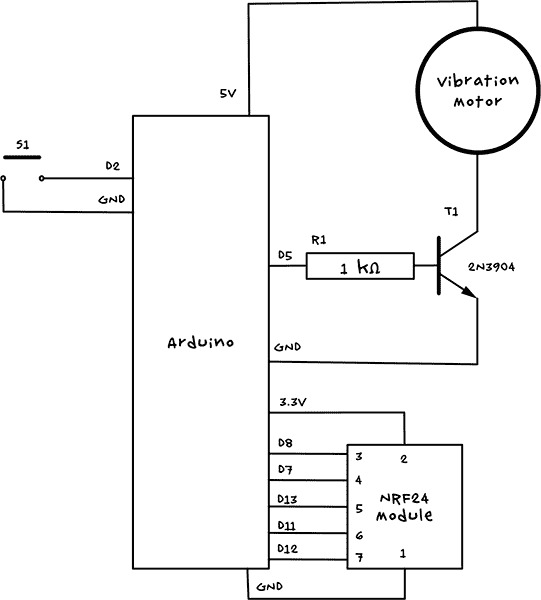
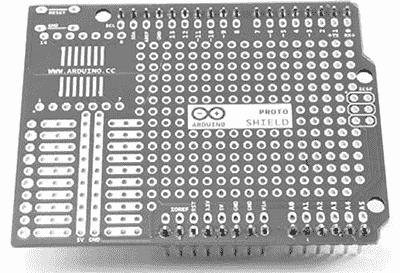
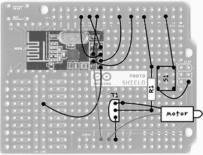
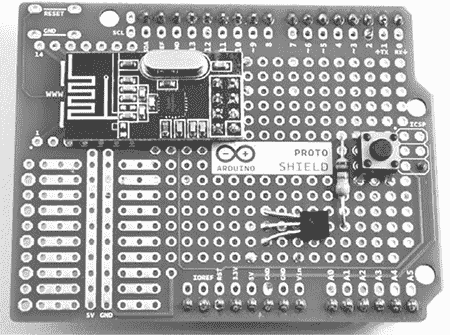
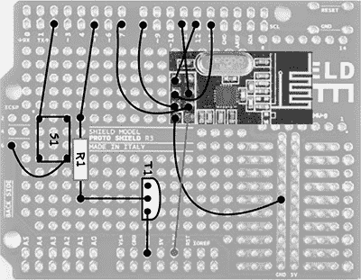
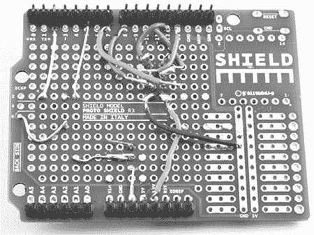
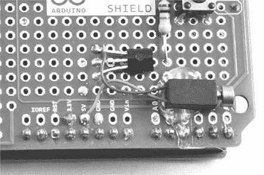

## **11**

**触觉通信**


如果你正在外出采购，那么你肯定需要这种静音通信设备，它利用颤动蜂鸣器电机和无线电模块发送双向信息。通过这个最终项目，你可以在不引起不必要注意的情况下进行通信。

### **项目 20：使用 Arduino 进行静音触觉通信**

对讲机的问题在于，正如其名称所示，它们需要说话。僵尸对人类的语言非常敏感，任何你对着对讲机尖叫求援的声音都会很容易被它们察觉。此时，静音的双向触觉通信设备便发挥了它的作用（见图 11-1）。


图 11-1：“当标志上写着‘按下以引起注意’时，这不是我认为的意思！”

*触觉* 只是一个复杂的说法，意思是“与触摸相关”，而不是发出噪音，你在这个项目中制作的设备将像手机一样震动。你将制作一对这些触觉设备，其中一个如图 11-2 所示。

每个设备都有一个按键开关和一个小型蜂鸣器电机，类似于你在手机中看到的那种。当你按下一个手持设备上的按钮时，它会使另一个手持设备上的蜂鸣器震动，反之亦然。整个装置由一个 9V 电池供电。

然后，当你外出时，可以使用一套预先安排好的信号与伙伴联系：一个短暂的嗡嗡声表示“我没事”；一个长时间的嗡嗡声表示“快来，我快被吃掉了！”在你的空闲时间（可能由于你之前的学校或办公室现在满是僵尸，你的空闲时间增加了），你甚至可以背诵你在“项目 19：Arduino 摩尔斯电码信标”中使用的摩尔斯电码，并发送更详细的信息，那个项目在第 196 页。



图 11-2：一对触觉通信器

#### **你将需要的材料**

要制作这对触觉通信器，你需要以下零件：

| **物品** | **备注** | **来源** |
| --- | --- | --- |
|  Arduino | 2 x Arduino Uno R3 | Adafruit, Fry’s (7224833), SparkFun |
|  Protoshields | 2 x Arduino Protoshield PCB | eBay (Arduino code: A000077) |
|  排针 | 64 针排针（用于 2 个手持设备） | Adafruit (392), eBay |
|  9V 电池引线 | 2 x Arduino 9V 电池引线 | Adafruit (80), eBay |
|  9V 电池 | 2 x PP3 电池 | 五金店 |
|  R1 | 2 x 1 kΩ 电阻 | Mouser (293-1k-RC) |
|  晶体管 | 2 x 2N3904 NPN 双极晶体管 | Adafruit (756) |
|  振动电机 | 2 x 5V 或 3V 振动电机 | eBay |
|  触觉开关 | 2 x 触觉按键开关 | Adafruit (504) |
|  RF 模块 | 2 x NRF24 RF 模块 | eBay |
|  各种连接线 | 绞线 |  |
|  电线 | 用于制作 PCB 连接的绝缘实心线 |  |

你也许还想将你的通信器放入塑料盒中，以保护它们免受外界环境的影响。如果你决定这么做，你需要找到一个足够大的盒子来容纳 Arduino、Protoshield 和电池。它还需要一个孔，以便你可以按下按钮并添加开关。

从电子学角度来看，这是迄今为止最复杂的项目。你可能很难在僵尸末日后找到所有的零件，因为一些部件，如振动马达和 RF 模块，最好从 eBay 或 Amazon 上购买。所以现在就做这个项目吧，趁邮递服务还没有停运。振动马达也可以从手机中拆解得到。

#### **构建**

本教程将告诉你如何制作一个触觉模块，图 11-3 显示了一个通信器的电路图。当然，如果你想与别人通信，你需要制作两个设备。



图 11-3：一个触觉通信器的电路图

Arduino 的 2 引脚将设置为数字输入，并启用内部上拉电阻，连接到按键 S1。当按下按钮时，Arduino 将控制 NRF24 无线电模块向另一个手持设备发送消息，激活其振动马达。

该振动马达由 Arduino 的 D5 引脚控制。我们使用一个晶体管（T1），因为该马达消耗的电流超过 Arduino 输出能够承受的范围，并且使用 5V 电源是因为 3V 电源无法提供足够的电流。D5 引脚被设置为模拟输出，以便通过软件调节振动的强度，尽可能保持设备安静；这还可以防止马达烧坏，因为大多数振动马达是 3V 的，而 Arduino 通常使用的是 5V。

请注意，严格来说，马达应当配有二极管，以保护 Arduino 免受来自马达的电流冲击，但通过对这些小型马达进行简单测试，发现对 Arduino 电源轨的干扰非常微小。因此，为了简化操作，通常的二极管被省略了。

本项目使用 Protoshield，而不是本书中大多数项目使用的螺丝板。Protoshield 类似于螺丝板，但没有螺丝端子，因此更加便宜和小巧。

##### **步骤 1：组装 Protoshield**

Protoshield 有时会附带一整套额外的组件，如复位开关和排针，但在这个项目中，你不希望有会吸引不必要注意的发光电源 LED。因此，最好（也更便宜）购买裸露的 Protoshield PCB 和一些排针。

将排针焊接到 PCB 两侧最外侧的孔上。保持排针笔直的一个好方法是将它们插入 Arduino 中，然后将 Protoshield PCB 放在排针上。所有引脚都连接好后，Protoshield 应该类似于图 11-4 的样子。



图 11-4：附有排针的 Protoshield

##### **步骤 2：固定组件位置**

参考图 11-5 来定位组件的位置。所有与 NRF24 模块的连接都位于模块 PCB 右侧的 2×4 排针上。暂时不要焊接振动电机；首先需要将其粘贴到位，因为引脚比较脆弱。



图 11-5：Protoshield 布局，R1 是电阻，S1 是开关，T1 是晶体管，左上角的黑色矩形是 NRF24

除了来自电动机的两根线外，图 11-5 中指向不同焊盘的黑色线路表示你将在电路板底部进行的连接。NRF24 模块的引脚穿过原型板的孔，因此现在可以将其放置好并焊接到下方的焊盘上。不要剪掉多余的引脚长度，而是焊接后轻轻将其展开；这将有助于稍后连接它们。请注意，NRF24 模块上有一个引脚未使用。

晶体管的一侧是弯曲的。确保晶体管按正确的方向放置在 Protoshield 上，弯曲的一侧朝左指向 NRF24（参考图 11-4）。在螺丝盾的顶部留大约 1/3 英寸（约 7.5 毫米）晶体管引脚，然后将其弯曲下去（参见图 11-5）进行焊接。

开关有一个矩形的接触网格，长的方向是四个孔，短的方向是三个孔。确保开关正确放置（参见图 11-4），使其在竖直方向上较长。

目前不要剪掉任何线，因为这些线可以用于连接电路板底部的各个组件。当所有组件都固定好后，电路板应类似于图 11-6 的样子。



图 11-6：附加到 Protoshield 的组件

##### **步骤 3：连接电路板的底部**

这一步是最繁琐的，所以要小心操作。所有组件需要连接到电路板底部（图 11-5）。当然，当电路板翻转过来时，一切都会反转。在图 11-7 中，我将图 11-5 进行了转置，展示了电路板底部的布局，供你参考。



图 11-7：从 Protoshield 底部的接线图

图 11-7 标出了组件的位置，帮助你定位，但请记住这是板子的底面，组件实际上位于原型板的另一侧。

许多连接线交叉在一起，因此请使用绝缘的实心电线。所有连接完成后，板子的底部应如图 11-8 所示。



图 11-8：原型板的底面

仔细检查所有连接，确保没有意外的焊接接点，并确保每条电线连接正确。

##### **步骤 4：连接振动马达**

将马达粘贴到原型板的*顶部*，小心不要把胶水弄到马达前端的旋转部分。引线非常细，因此最好将它们焊接到板子顶部，而不是穿过孔。 图 11-9 显示了已粘贴到位的马达，以及焊接到原型板上的引线。



图 11-9：连接振动马达

##### **步骤 5：为另一个手持设备重复操作**

构建好一个手持设备后，再为它的伙伴做一次相同的操作。

##### **步骤 6：将其放入外壳中**

你可能想要寻找一些小塑料盒来容纳手持设备。或者，你也可以选择后末日风格，直接将电池用胶带固定在 Arduino 和原型板上，让电池夹可作为一个简易的开关使用。

#### **软件**

本书的所有源代码可以从*[`www.nostarch.com/zombies/`](http://www.nostarch.com/zombies/)*下载。有关如何安装此项目的 Arduino 草图的说明，请参阅附录 C，该草图名为*Project_20_Haptic_Communicator*。

本项目使用一个社区维护的 Arduino 库，名为*Mirf*。该库为 NRF24 无线电模块提供了一个易于使用的包装，封装了串行外设接口（SPI）接口，使 Arduino 能够与该模块进行通信。Mirf 库必须从互联网下载，这也是在疫情蔓延之前进行此项目的另一个好理由。从*[`playground.arduino.cc/InterfacingWithHardware/Nrf24L01`](http://playground.arduino.cc/InterfacingWithHardware/Nrf24L01)*下载该库的 ZIP 文件。

解压 ZIP 文件，并将整个*Mirf*文件夹复制到*My Documents\Arduino\Libraries*目录（如果你使用的是 Windows）或*Documents/Arduino/libraries*目录（如果你使用的是 Mac 或 Linux）。请注意，如果 Arduino 目录中没有*libraries*文件夹，你需要先创建它再进行复制。

Arduino IDE 在重启之前不会识别新的库，因此，在复制*library*文件夹后，保存当前工作，退出 IDE 并重启。然后，打开此项目的草图文件，并依次上传到两个 Arduino。该草图开始时会导入三个库：

```
#include <SPI.h>
#include <Mirf.h>
#include <MirfHardwareSpiDriver.h>
```

SPI 库是 Arduino IDE 的一部分，用于简化与使用 SPI 的设备的通信。MirfHardwareSpiDriver 库也在该草图中使用。

接下来，定义了三个常量：

```
const int numberOfSends = 3;
const int buzzerPin = 5;
const int switchPin = 2;
```

无线通信的范围可以通过多次发送“按钮按下”消息来扩展，这样在信号范围的边缘，只有一条消息需要传递成功。常量`numberOfSends`定义了每条消息应发送的次数。接下来是蜂鸣器和开关引脚的定义。

下一个常量（`buzzerVolume`）指定了振动电动机的`analogWrite`值：

```
const int buzzerVolume = 100; // Keep less than 153 for 3V!
const int buzzMinDuration = 20;
```

如果你使用的是 3V 电动机，重要的是`analogWrite`的值不要超过 153；值为 153 时，会给电动机提供相当于 3V 电源的电力，超过这个值会使电动机过载。减少该值将使蜂鸣器声音变得更轻。常量`buzzMinDuration`指定蜂鸣器的最短持续时间（毫秒）。这是很重要的，因为持续时间过短可能导致蜂鸣声无法被察觉。

全局`byte data`数组包含一个 4 字节的消息，每当按钮被按下时都会发送：

```
byte data[] = {0x54, 0x12, 0x01, 0x00};
```

数组中的前三个值被选择为该对触觉通信设备的唯一标识。当收到消息时，会检查这些值是否匹配。这确保了通信设备接收到的是有效消息，而不是噪声。它还意味着你可以设置一对不同值的设备，新的设备对不会干扰这对设备。根据你在幸存者小队中的分工，你可能在某些情况下希望与某人沟通（“快来救我！”），而在另一些情况下与另一个人沟通（“如果你现在出现，我敢打赌僵尸会吃掉你的脑子，而不是我的”）。

第四个字节在本项目中未使用，但它存在，以防你希望按钮按下消息发送一个参数。例如，你可以为紧急情况向通信设备添加第二个按钮，该按钮发送一个不同的值，该值可以在接收端读取。

接下来是`setup`函数：

```
void setup()
{
  analogWrite(buzzerPin, 0);
  pinMode(switchPin, INPUT_PULLUP);
  Mirf.spi = &MirfHardwareSpi;
  Mirf.init();

  listenMode();
  Mirf.payload = 4;
  Mirf.config();
}
```

该函数首先通过`analogWrite`确保蜂鸣器关闭。然后将`switchPin`的模式设置为输入，并启用内部上拉电阻（有关上拉电阻的更多信息，请参见《使用上拉电阻稳定数字输入》，该内容位于第 252 页）。接着初始化无线电模块并将其置于监听模式，等待接收消息。

接下来是`loop`函数：

```
void loop()
{ 
  if (!Mirf.isSending() && Mirf.dataReady())
  {
    Mirf.getData(data);
    checkForBuzz();
  }
  if (digitalRead(switchPin) == LOW)
  {
          sendBuzz(); 
  }
}
```

该函数首先通过`if`语句检查模块本身是否正在发送消息。然后检查是否有数据准备好被读取，并通过无线电读取消息。一旦消息被读取，调用`checkForBuzz`函数来检查消息是否合法，确保蜂鸣器正确响起。

`loop`函数最终会检查这端是否有按钮按下，并通过调用`sendBuzz`函数来响应按钮按下。

现在，让我们来看一下这个草图中定义的其他功能，从`listenMode`和`sendMode`开始：

```
void listenMode()
{
  Mirf.setRADDR((byte *)"serv1");
}
void sendMode()
{
  Mirf.setRADDR((byte *)"clie1");
}
```

`listenMode`功能通过将接收地址设置为`"serv1"`，将无线电模块置于监听模式。`sendMode`功能通过将接收地址设置为`"clie1"`，将无线电模块置于发送模式。我们在`sendBuzz`中调用了`listenMode`功能和`sendMode`功能，而`sendBuzz`会在`loop`函数的最后一个`if`语句中被调用。

最后，我们有`checkForBuzz`函数：

```
void checkForBuzz()
{
  if (data[0]==0x54 && data[1]==0x12 && data[2]==0x01)
  {
    analogWrite(buzzerPin, buzzerVolume);
    delay(buzzMinDuration);
    analogWrite(buzzerPin, 0);
  }
}
```

这个功能检查从另一个模块发送过来的消息的前三个字节，如果匹配，它会根据`buzzMinDuration`指定的毫秒数打开震动马达。

#### **使用触觉通讯器**

这个项目非常有趣。虽然我确信赌场已经察觉到这种装置，但为了避免麻烦，不要用它在赌桌上作弊。无论如何，末日后金钱几乎没什么用处。

如果你准备学习莫尔斯电码，话筒可以与莫尔斯电码一起使用，尽管它们有点慢。或者，你可以制定一个简化的词汇表，像下面这样：

• **一次短鸣**：一切正常

• **一次长鸣**：发现僵尸

• **三次长鸣**：僵尸靠近

• **三次短鸣**：快跑！！

这是书中的最终项目，我希望在为末日做准备的过程中你感到愉快。不论你是为了迎接即将到来的僵尸潮而构建这些项目，还是已经藏身其中，我也希望这些项目能帮助你生存下去！
