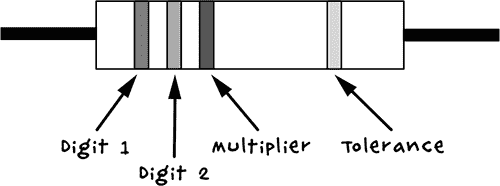

## **A**

**零件**

在本附录中，你将找到更多关于本书项目中所使用的零件信息。与单个项目的供应清单不同，本附录中的表格列出了两种来源：末日前和末日后。如果你打算在死者复生之前购买零件并将其储存在你秘密的地下掩体中，应该参考末日前这一列的供应商。现在就在线批量购买材料，你甚至可以多买一些，以便准备好替换损坏的部件。

如果你是在僵尸已经占领你所在社区之后阅读本指南，那么你需要参考末日后这一列。在没有互联网的情况下，你的选择将会非常有限，但如果你幸运的话，你可能会找到一些零星的实体爱好商店可以抢购，还应该能找到大量的汽车、微波炉等电子产品，你可以从中提取组件。祝你好运！

### **关于实体供应商的说明**

说到电子元件的实体店，自从 Radio Shack 关闭以来，你在美国的选择几乎只剩下加利福尼亚州和德克萨斯州的 Fry’s 电子商店，以及一些其他州的零星商店 (*[`www.frys.com/`](http://www.frys.com/)*) 和一些独立商店。如果你住在英国，Maplin 电子商店 (*[`www.maplin.co.uk/`](http://www.maplin.co.uk/)*) 是最好的选择。Fry’s 和 Maplin 都提供在线订购服务。

### **电子模块**

本节描述的项目可以宽泛地称为模块或预组装的部件，而不是基本的电子元件。

| **项目** | **末日前来源** | **末日后来源** |
| --- | --- | --- |
| 7A（或更多）12V 充电控制器 | eBay, Fry’s (4980091) | 被废弃的房车和船只 |
| Arduino Uno R3 | Adafruit, Fry’s (7224833), SparkFun | Fry’s |
| 螺丝屏蔽板 | Adafruit (196) |  |
| LCD 屏蔽板 | eBay, SparkFun (DEV-11851) |  |
| PIR 模块 | Adafruit (189), Fry’s (6726705) | Fry’s, 安防商店 |
| 门锁 | Farnell | Fry’s, 安防商店 |
| RF 遥控单通道继电器，12V | eBay |  |
| 节流开关和磁铁配对 | Adafruit (375), Fry’s (1908354) | Fry’s, 安防商店 |
| 4 通道继电器屏蔽板 | eBay, [`www.sainsmart.com/`](http://www.sainsmart.com/) |  |
| USB 蓝牙适配器 | eBay | 电脑商店 |
| HC-06 蓝牙串口模块 | eBay |  |
| 小型伺服电机（9 克） | Adafruit (196), eBay | 爱好者商店 |
| 标准伺服电机 | Adafruit (155), eBay | 爱好者商店 |
| NRF24 无线模块 | eBay |  |
| Protoshield | eBay (Arduino 代码: A000077) |  |

### **树莓派及相关零件**

这份清单包括你需要的所有树莓派特定零件，包括树莓派本身。

| **项目** | **末日前来源** | **末日后来源** |
| --- | --- | --- |
| 树莓派 | Adafruit (2358), Fry’s (8258726) |  |
| 小型 HDMI 显示器 | Adafruit (1934), eBay |  |
| 树莓鱿鱼 | 亚马逊, [`www.monkmakes.com/`](http://www.monkmakes.com/) |  |

### **导线和连接器**

在这份清单中，你将找到所有需要连接电路的电线、导线、插座和其他小配件。

| **物品** | **末日前来源** | **末日后来源** |
| --- | --- | --- |
| 重型鳄鱼夹导线 (7A 或以上) | 汽车零件商店 | 汽车零件商店 |
| 端子排 (10A) | 家得宝、Lowe’s、Menards | 家得宝、Lowe’s、Menards |
| 小型鳄鱼夹导线 | 汽车零件商店 |  |
| 端子排 (2A) | 家得宝, Lowe’s, Menards | 家得宝, Lowe’s, Menards |
| 母对母跳线 | Adafruit (266) |  |
| 0.1 英寸插针 | Adafruit (392), eBay |  |
| 母对公跳线 | Adafruit (826) |  |
| 2.1 毫米插孔转汽车点烟器适配器 | 汽车零件商店 | 汽车零件商店 |
| 2.1 毫米圆形插孔与飞线 | 损坏的直流电源 | 直流电源 |
| 长母对母跳线 (20 cm) | Adafruit (760) |  |
| 0.1 英寸直角插针 | eBay |  |
| 9V Arduino 电池导线 | Adafruit (80), eBay |  |
| 用于原型螺丝盾 PCB 连接的固芯电线 | Adafruit (1311) | 废弃电子产品 |

### **工具**

没有任何一个自尊的丧尸末日幸存者会缺少以下这些常用家用工具：

• 电钻

• 螺丝刀

• 钳子

• 小剪刀

• 锯木机

• 剪刀

你应该能在任何五金店找到这些工具。为了完成本书中的项目，你还需要一些电子制作工具，下面列出了这些工具。

| **物品** | **末日前来源** | **末日后来源** |
| --- | --- | --- |
| 万用表 | 汽车零件商店, eBay, Fry’s | 汽车零件商店, Fry’s |
| 焊接铁 | 汽车零件商店, Fry’s | 汽车零件商店, Fry’s |

### **电子元件**

许多这里列出的组件可以在电子爱好者的入门套件中找到。像 Adafruit 的 ARDX 实验套件（Arduino 产品 ID 170）或 SparkFun 初学者零件套件（KIT-10003）会为你提供基本的电阻器、二极管和晶体管，是一个很好的入门选择。

| **物品** | **末日前来源** | **末日后来源** |
| --- | --- | --- |
| 声表 buzzer | Adafruit (1740), eBay |  |
| 270 Ω 电阻 | Mouser (293-270-RC) |  |
| 470 Ω 电阻 | Mouser (293-470-RC) |  |
| 按钮开关 | Adafruit (1439) |  |
| 1 kΩ 电阻 | Mouser (293-1k-RC) |  |
| 1N4001 二极管 | Adafruit (755) |  |
| 蓝色或白色 LED | Adafruit (301) |  |
| 100 µF 陶瓷电容 | Adafruit (753) |  |
| TMP36 | Adafruit (165) |  |
| 微型开关 | Fry’s (2314449) | 微波炉 |
| 小型密封铅酸电池 | Fry’s (6607854), 安全商店 |  |
| FQP33N10 或 FQP30N06 MOSFET | Adafruit (355) |  |
| 电阻器 (100 Ω 2W) | Mouser (594-5083NW100R0J) |  |
| 电阻器 (100 Ω 1/4W) | Mouser (293-100-RC) |  |
| 高音量蜂鸣器 | 安全商店 | 安全商店, 烟雾报警器 |
| 2N3904 NPN 双极晶体管 | Adafruit (756) |  |
| 5V 或 3V 振动马达 | eBay |  |
| 触觉按键开关 | Adafruit (504) |  |
| 红色 LED | Adafruit (297) |  |

### **其他硬件**

最后，你还需要一些其他零散的配件，才能为你的项目提供电源并构建机械部分，如下所示。

| **项目** | **末日前来源** | **末日后来源** |
| --- | --- | --- |
| A100 V 传动带 | 汽车零件店，eBay | 汽车零件店，五金店，回收 |
| 项目盒 | Fry’s | 储物间，车库 |
| 4 × AA 电池盒 | Adafruit (830) |  |
| 6 × AA 电池盒 | Adafruit (248) |  |

### **电阻颜色代码**

电阻上有条纹，可以告诉你它的值，作为一个极客，了解电阻颜色代码是必不可少的。

| **颜色** | **值** |
| --- | --- |
| 黑色 | 0 |
| 棕色 | 1 |
| 红色 | 2 |
| 橙色 | 3 |
| 黄色 | 4 |
| 绿色 | 5 |
| 蓝色 | 6 |
| 紫色 | 7 |
| 灰色 | 8 |
| 白色 | 9 |
| 金色 | 1/10 |
| 银色 | 1/100 |

通常，这些带状标记将一起出现在电阻的一端，接着是一个间隙，然后在电阻的另一端有一个单独的带状标记。这个单独的带状标记表示电阻值的精度。金色和银色分别表示 1/10 和 1/100，它们也用于表示电阻的精度；金色表示±5%，银色表示±10%。

图 A-1 显示了彩色带状标记的排列方式。电阻值仅使用这三条带状标记。第一条带是第一位数字，第二条带是第二位数字，第三条“倍数”带表示在前两位数字后面加多少个零。

图 A-1：电阻颜色代码

假设第一位数字带是红色，第二位数字带是紫色，倍数带是棕色。那么这是一个 270Ω的电阻，或者是 27×10¹。同样，一个 10 kΩ的电阻将有棕色、黑色、橙色三条带（1, 0, 1,000）。
