## 第十三章：B

**基础技能**

如果你打算成为一名末日后创客，在丧尸横行的世界中生存，那么你需要掌握一些关键的电子技能。本附录是一个快速的基础指南，涵盖了连接电线、焊接以及使用万用表等内容。需要时随时翻阅它，或许能救你一命！

### 剥线

对于末日幸存者来说，剥电线绝缘层是一个几乎排在第一位的技能。本书中的设备将帮助你生存，为了制造这些设备，你通常需要将绝缘电线连接在一起或将它们接入螺丝端子。这个过程的第一步就是露出裸线。

要剥电线，使用一对钝口钳夹住电线，并用一对锋利的线剪（也叫做剪刀）将绝缘层拉开。图 B-1 展示了这个过程。

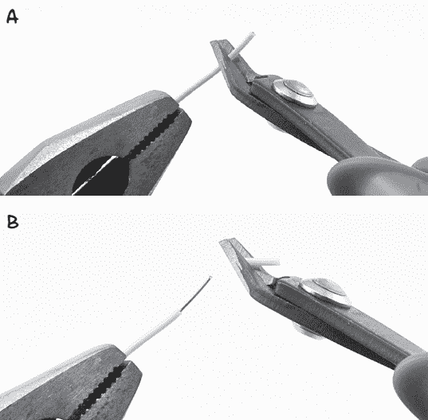

图 B-1：剥电线

用钳子夹住电线（见图 B-1a）。如果电线比较长，你可以绕在手指上。无论哪种方式，目的是固定电线不让它移动。接下来，轻轻用切线钳夹住电线在你想要剥离绝缘层的位置。施加足够的压力，使绝缘层几乎被剪断，但不要切到里面的电线，然后拉开绝缘层（见图 B-1b）。如果剪线钳开始滑动，只需稍微加大握力。

掌握这项技能可能需要一些时间，因此在尝试重要的项目之前，先在一些旧电线上练习。如果你把存货中最后一根好电线剪得太短，你可能会发现自己无法完成最新的反僵尸发明，直到下一次物资补给——那时可能已经太晚了。

### 通过扭绕连接电线

学会如何将电线扭在一起也是一个有用的技能，特别是如果你在搜寻过程中没有找到焊锡的话。如果操作得当（如图 B-2 所示），单纯将电线扭在一起也能建立相当不错的电气连接。

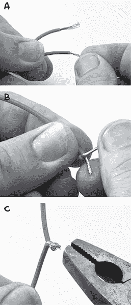

图 B-2：通过扭绕连接电线

首先，剥去每根电线约半英寸（15 毫米）的绝缘层（见“剥线”在 227 页）。然后，如果你的电线是绞合线而不是实心线，用拇指和食指分别扭动每根电线，使所有股线保持在一起（见图 B-2a）。接下来，将两根电线并排放置，使绝缘层的末端对齐，然后将电线相互扭绕（见图 B-2b）。尽量确保电线确实是相互缠绕，而不是让一根电线保持直线，另一根绕着它缠绕。如果电线的粗细不同，这可能会很困难。

最后，将交织在一起的电线捻成一个紧密的球形（图 B-2c），并用电工胶带或热缩管将其包裹起来（参见“使用热缩管”在第 235 页）。你还可以使用钳子将连接点紧固得更紧。

如果你有焊接设备，那么你可以通过加热小结点并将焊锡填充进去，使连接在机械上更强、更可靠电气性能，正如我在下一节所描述的那样。

如果你想知道 NASA 是怎么做的，可以查看这个链接：*[`makezine.com/2012/02/28/how-to-splice-wire-to-nasa-standards/`](http://makezine.com/2012/02/28/how-to-splice-wire-to-nasa-standards/)*。

### 焊接基础

焊接比看起来要简单得多，你不需要花很多钱购买复杂的焊接站。在末日来临时，你的选择会受到限制，但基本的入门工具包（参见图 B-3）完全可以应付。

你可以在汽车零部件商店甚至一些五金店找到基本的焊接工具包。如果你是在末日来临之前购买，Adafruit 出售的一个很好的入门工具包（产品 136）也包括万用表、连接线以及各种其他有用的零件。

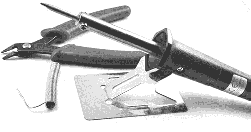

图 B-3：基本的焊接工具包

有很多配件和工具可以加速焊接过程，但这些并非必需。以下是你真正需要的所有工具：

**一把烙铁** 选择功率为 30W 或以上、铁尖较细（比如 1/25 英寸或 1 毫米）的烙铁。在僵尸末日之前，购买一款交流电供电的烙铁即可。为了准备，你还可以购买一款 12V 直流电供电的烙铁，并将其与紧急物资一起存放；这样你就能使用车载电池为烙铁供电。这些用于修理汽车电气组件的烙铁非常常见。

**焊锡** 如果你购买了焊接工具包，它可能会附带一卷焊锡。焊锡有两种类型：含铅和无铅。含铅焊锡的熔点较低，通常比无铅焊锡更容易使用。但请不要食用，无论你的食物情况多么紧急。

**剪线钳** 你需要一把好的电线剪刀，用来将电线剪得紧贴 PCB 表面，并用于剥去电线绝缘层。

**一块湿海绵或布** 任何旧海绵都可以。你将用它擦拭烙铁的铁尖，以去除多余的焊锡。

**警告**

烙铁会变得很热。事实上，它们比你厨房烤箱的最高温度要热得多。所以不用说，如果你触碰到烙铁的热端，你会被严重烫伤。这不是适合无人看管儿童的活动。同样，铅是一种有毒元素，对你毫无益处，因此即使铅-free 焊锡略微难用，你可能还是会选择使用无铅焊锡。

#### 用焊锡连接电线

要将两根电线通过焊接连接起来，首先按照《通过扭曲连接电线》中的说明操作，详见第 229 页。然后，你可以进行焊接。焊接的诀窍是始终让焊锡流入你要焊接的物体中；图 B-4 展示了焊锡如何从图 B-2c 流入电线球状物中。

许多初学者犯的错误是将一团焊锡堆积在电烙铁的铁尖上，然后将其滴到电线上。这通常会导致质量不佳的*干焊点*，看起来还不错，但很快就会失效，在分开之前，可能无法与电线良好接触。因此，在将焊锡接触到电线之前，最好先加热你要焊接的电线。

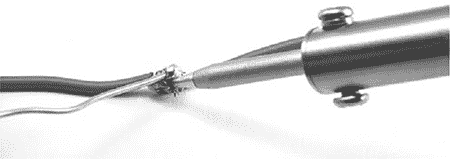

图 B-4：将焊锡引入接合的电线中

牢记这一点，你可以按照以下方式连接你的扭曲电线：

1\. 打开电烙铁并让它加热。如果你的工具包中没有电烙铁支架，确保将其放置在一个安全的位置，避免热端接触任何物体。

2\. 将焊锡的末端触碰到电烙铁的铁尖上，看看它是否变热。如果焊锡立即融化并流过铁尖，那么电烙铁就准备好了。

3\. 如果电烙铁的铁尖在此之后仍然不光亮，擦拭它在湿海绵上。这个过程会发出很大的滋滋声！重复前一步骤，用焊锡*镀锡*电烙铁的铁尖。*镀锡*就是通过加热将焊锡涂在电线或电烙铁的铁尖上。

4\. 将电烙铁的铁尖按在电线的小结点上，保持三到四秒钟。然后，在电烙铁仍然按着结点的同时，将焊锡的末端推向结点。焊锡应该会流入结点。如果焊锡没有流动良好，通常可以向接头添加一些焊锡，因为焊锡中含有*松香助焊剂*，它有助于焊锡的液化。

5\. 继续加焊锡，直到整个电线结点都被焊锡覆盖。

6\. 将焊锡线的末端从接头上移开，并将电烙铁放回其支架上。确保电线不要移动，给它们 10 到 20 秒的时间冷却。

你也可以用电工胶带或热缩管来对焊接点进行绝缘处理，具体操作可参考《使用热缩管》，详见第 235 页。如果你打算这么做，最好通过将电线并排焊接，而不是将它们扭在一起，这样可以得到更整齐的接头（图 B-5a–e）。

在剥去电线两端的绝缘层后（图 B-5a），用焊锡将其镀锡（图 B-5b）。如果电线是多股线，焊锡应该会流入组成电线的各根股线之间。

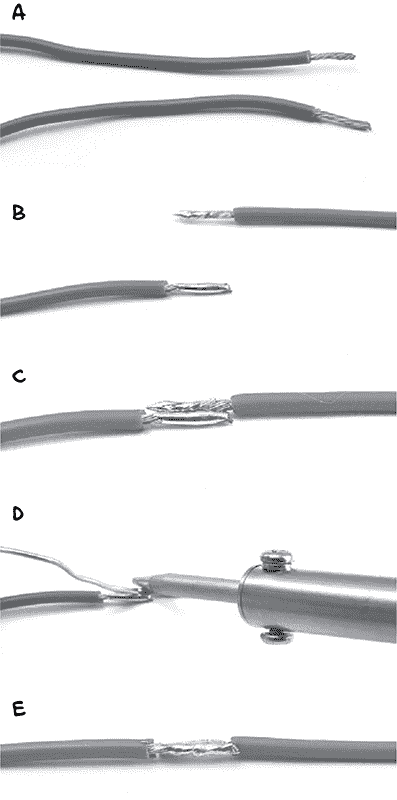

图 B-5：不先扭曲电线就将其焊接在一起

现在，将电线放在一起（图 B-5c），加热电线，并将焊锡流入它们之间形成的凹槽（图 B-5d）。最终的结果应该是两根电线顺畅连接在一起（图 B-5e）。

#### 焊接 PCB

电线比完整电路更容易回收，但能够焊接到印刷电路板（PCB）上无疑会在末日中为你提供极大的帮助。例如，本书中的许多项目都使用了一个螺丝防护罩，需要进行一些焊接工作来完成。幸运的是，螺丝防护罩是一个 PCB，拥有许多专门用于焊接的金属焊盘。如果你成功地按照“用焊锡连接电线”在 231 页上的步骤进行操作，那么焊接 PCB 应该不会有什么问题。

在将元件焊接到 PCB 时，基本思路是将元件的引脚从顶部穿过，翻转 PCB，将引脚焊接到焊盘上，然后剪去多余的电线。图 B-6 展示了一个元件引脚被焊接到螺丝防护罩上的过程。

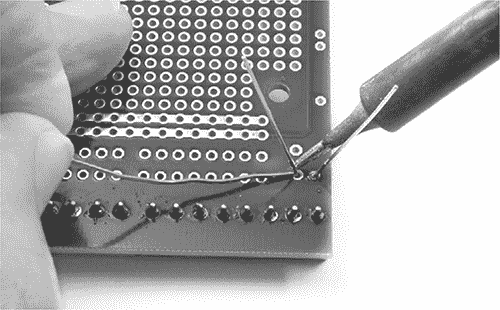

图 B-6：焊接元件引脚到 PCB 上

和所有焊接一样，诀窍是将焊锡涂抹到加热的元件腿上，而不是焊接铁上，因此加热元件的引脚，然后将焊锡接触到它。通常，通过让焊接铁加热元件引脚和焊盘一两秒钟再涂抹焊锡到焊接铁和元件引脚的连接处，你会得到最好的效果。图 B-7 展示了两个焊点的例子，一个是坏的，一个是好的。

左侧的焊点最好的描述是“球状的”，这是因为让一团焊锡在焊接铁尖端形成，然后将其“滴”到 PCB 上。右侧的焊点接近完美。可以看到整个焊盘都覆盖着焊锡，焊锡沿着元件引脚均匀地流动，形成了一个非常轻微的小山丘形状。

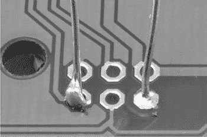

图 B-7：坏的（左）和好的（右）焊点

### 使用热缩管

当你对自己的接线技巧有信心时，尝试使用热缩管来绝缘电线。热缩管是完成通过扭曲或焊接连接的电线的一个很好的方法，而且比电工胶带更耐用。一开始用电工胶带包裹电线是可以的，但最终胶带会失去粘性并开始松开。热缩管使用起来也更加有趣，当僵尸是唯一敲你门的人时，你会发现需要尽可能多的乐趣。

热缩管是以管状形式提供的，你可以根据需要剪裁长度。用吹风机、热风枪，甚至打火机加热时，它会像魔法一样收缩到原来直径的一半。如果你的热缩管开始时与导线非常贴合，那么加热后它会紧紧包裹住导线。

以下是如何做出良好的连接并用热缩管加固它：

1\. 选择一个略大于你想要覆盖的接头的热缩管。剪一段足够长的热缩管，覆盖裸露的导线，并稍微延伸到导线的绝缘层上。

2\. 如果你要连接的两根导线另一端已经有部件，先把热缩管套到一根导线上，再进行焊接，确保将热缩管尽可能远离焊接点。我已经记不清有多少次焊接完后才想起来热缩管没能提前套上。每次发生这种情况，我都得重新焊接。

3\. 使用在“用焊接连接导线”中描述的端对端连接方法连接导线，结果应该类似于图 B-8a。

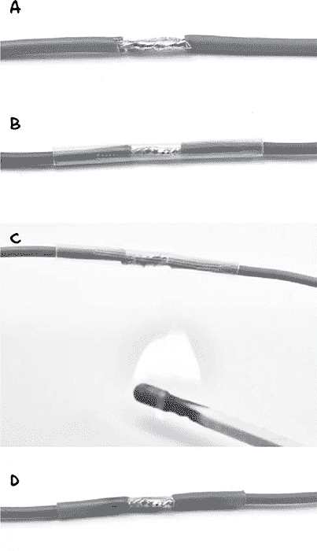

图 B-8：将透明热缩管套在连接的导线上

4\. 如果你还没有做，先把热缩管滑到连接处（图 B-8b）。我展示的热缩管是透明的，这样你可以看到焊接点的质量。热缩管也常见有黑色和其他颜色的。

5\. 用吹风机或甚至火柴加热热缩管，或者在热缩管下方点燃火柴（图 B-8c）。不需要让它过热。只需加热，直到它紧密贴合，如图 B-8d 所示。但尽量不要烧焦它！

热缩管有各种直径。如果你打算使用它，建议购买一个包含多种直径短段热缩管的选择盒。你可以在汽车零配件商店找到这些，因为热缩管常用于汽车电线的改装或维修。

### 使用万用表

电流是电子的流动。但电子非常小，实际上它们非常微小。所以，在电气工作中，我们需要一些工具来测量这些讨厌的电子的活动。

就像医生用听诊器检查你身体各个脉搏点一样，电子爱好者会使用万用表（图 B-9）检查电路上的特定点。

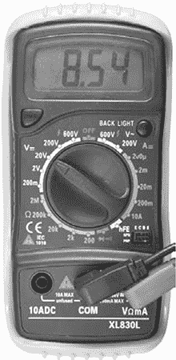

图 B-9：一台万用表

如图 B-9 所示的万用表价格大约为 $5，但它仍比 20 年前昂贵的万用表更准确，并且具有更广泛的功能。像这样的万用表完全足够应对你为末日生存准备时需要测量的任何电流、电压或电阻。

万用表由顶部的显示屏、中间的大旋转开关（用于选择不同的测量范围）和底部的一些插孔（用于连接测试引线）组成。购买万用表时应包括测试引线。这些通常是图 B-10a 所示的类型，但如果能再买一些带鳄鱼夹的测试引线（图 B-10b），会非常有用。

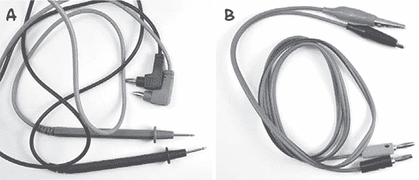

图 B-10：测试引线

大多数汽车配件商店都会有万用表，许多工具商店也可能有一两只万用表。如果你想为末日预备包准备几只，亚马逊和 eBay 上也有大量低成本的万用表供你选择。

#### 测量直流电压

万用表最常用于测量直流电压。例如，我们可以用它来检查电池的电压（图 B-11）。

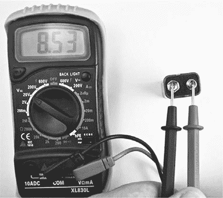

图 B-11：使用万用表测量直流电压

如果电池外壳上标明它是 9V 电池，但你测量其端子间的电压时，显示的是 4V，那么电池可能出了问题。图 B-11 中的 9V 电池电压为 8.53V，这是完全正常的。如果电压低于 8V，最好把它丢掉。

要测量电池的电压，请按照以下步骤操作：

1\. 将万用表的范围旋钮设置为直流电压，并选择一个高于你预期的最高电压的范围。例如，对于 9V 电池，20V 范围是一个不错的选择。（万用表还有交流电压范围。交流电压范围旁边有一个波浪线，直流电压范围上方有一条水平线。）

2\. 确保测试引线插在用于电压测量的插孔中，而**不是**电流测量的插孔中。黑色引线应插入 COM 插孔，红色引线应插入标有 V 的插孔。这一点很重要，因为在测量电流时，万用表的引线几乎是短路的，使用配置为电流测量的仪表来测量电压会导致电池短路，这很可能会烧毁万用表的保险丝。

3\. 将黑色 COM 引线连接到电池的负极，将红色正极引线连接到电池的正极端子。万用表的显示屏将显示电压。

除了测量电池的电压来判断其是否良好外，你可能还想测量一个元件的电压，比如 LED 或电阻。在这种情况下，只需将探针引线接触到元件的两端。

#### 测量直流电流

当你需要最大化电池的使用寿命时，这在末日来临时尤为重要，了解设备的电流使用情况通常很有帮助。例如，我们可以测试 Arduino 所消耗的电流。

图 B-12 显示了一个万用表，用于测试由 9V PP3 电池供电的 Arduino 的电流消耗。通过圆形插头连接 9V 电池。万用表位于电路中，测量通过它的电流（此时为 32.6 mA）。电池的正极连接到万用表的正极引线，电路的其余部分（在此为 Arduino）通过万用表的负极引线获取电源。

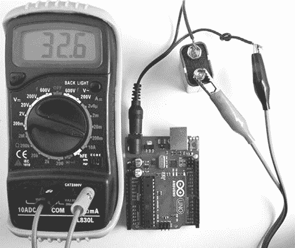

图 B-12：使用万用表测量直流电流

按照以下步骤测量电流：

1. 将万用表的档位旋钮设置为直流电流档位。单独的 Arduino 大约使用 30mA 的电流，因此选择 200mA 档位。如果不确定，先选择最大档位（通常是 10A），如果需要更高精度，再逐步调低档位。

2. 确保万用表的正极测试引线连接到正确的电流测量插孔。对于低电流（大约 200mA 或更低），通常使用与测量电压相同的插孔。此万用表有一个单独的插孔，用于测量最高 10A 的电流，但由于我们不应看到超过 30mA 的电流，因此使用的是电压插孔。

3. 将万用表的正极测试引线连接到电池的正极，将负极测试引线连接到引导到 Arduino 的正电压连接上。

如图所示，万用表有效地截取了通过测试引线的电流，以测量电流。

#### 测量电阻

“电阻色码”在第 225 页提供了根据电阻器色条识别电阻值的指南。另一种找出电阻值的方法是使用万用表进行测量。只需将万用表设置到某个电阻档位，然后将两个测试引线连接到电阻器的两端（见图 B-13）。

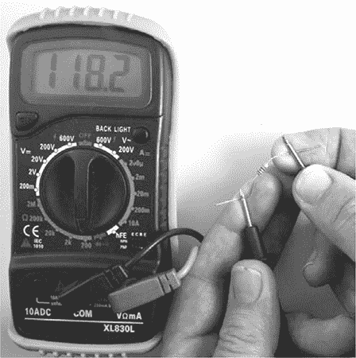

图 B-13：使用万用表测量电阻

在这种情况下，电阻器的测量值为 118.2 Ω。根据电阻器上的条纹，其标称值为 120 Ω。这种轻微的偏差是完全正常的。无论是万用表还是电阻器本身，都不可能完全准确。

**注意事项**

一些万用表还具有一个或多个电容档位，可以用来以相同方式测量电容器的值。

#### 连通性测试

大多数万用表具有连通性或蜂鸣器模式，可以通过档位旋钮选择。当万用表设置为连通性模式时，如果两个测试引线接触在一起，万用表上的蜂鸣器会发出声音。当引线通过低电阻物体（如电线、PCB 路径或可疑的焊点）连接时，蜂鸣器也应该发出声音。

这个功能听起来可能不太有用，但实际上非常宝贵。它可以用来测试保险丝以及那些看起来完好的电线，可能存在绝缘层下断裂的情况。它也非常适合测试开关。只需触碰开关接触点的引线，如果在切换开关时万用表发出蜂鸣声，那么说明一切正常。同样，测试保险丝时，先把测试引线接触在一起听到蜂鸣声，确保万用表正常工作，然后将引线接触到保险丝的两端。如果万用表没有反应，那么保险丝已经烧断。

#### 附加功能

我已经描述的万用表功能几乎涵盖了你在本书中可能需要对电路进行的任何测试。然而，即使是像这里展示的便宜万用表，也有一些其他有用的设置：

**交流电压和电流** 交流电需要一个单独的量程，因为它的电压和电流都会正负交替，平均值为零，因此如果选择了这些量程，万用表会在内部将交流电转换为直流电后再显示读数。

**HFE** 这个量程将测量插入专用晶体管插座的晶体管的增益（电流放大系数）。这也是快速检查晶体管是否损坏的方法。

如果你购买一款更贵的万用表，你会发现它有更多的附加功能：

**频率测量** 测量信号的频率。例如，你可以使用此功能来查找在《项目 11：安静的火灾警报》中烟雾报警器蜂鸣器的频率，该内容出现在第 120 页。

**温度** 此功能需要一个特殊的热电偶探头。它作为一般的温度计非常有用，尤其在检查元件是否过热时，它尤其宝贵。

**电容** 这个设置对于将电容器旁边标明的电容值与实际电容进行比较非常有用。电解电容器随着时间的推移会变得不可靠，它们经常退化到类似僵尸的状态，导致许多电子设备出现问题。

**背光** 点亮万用表屏幕，如果你正在使用万用表查找为什么基地的灯光熄灭，这个功能尤其有用！

**自动关机** 如果你像我一样容易忘记关掉设备，这个功能非常实用。毕竟你永远不知道什么时候能找到更多的电池。

你的万用表将是你最有用的工具之一，所以要熟悉它。这样，当你在僵尸靠近时必须在压力下使用它时，你就不必浪费宝贵的时间去查阅手册了。
