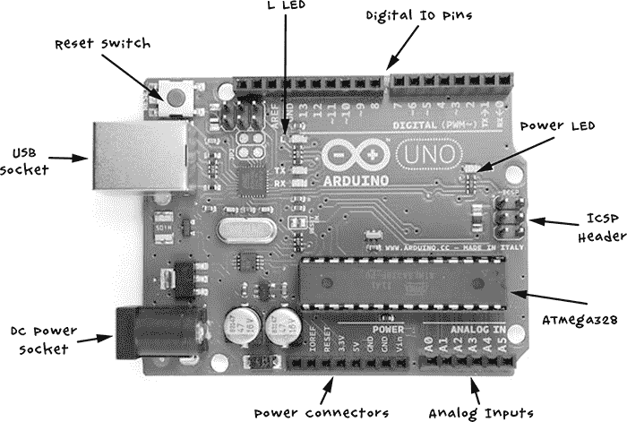
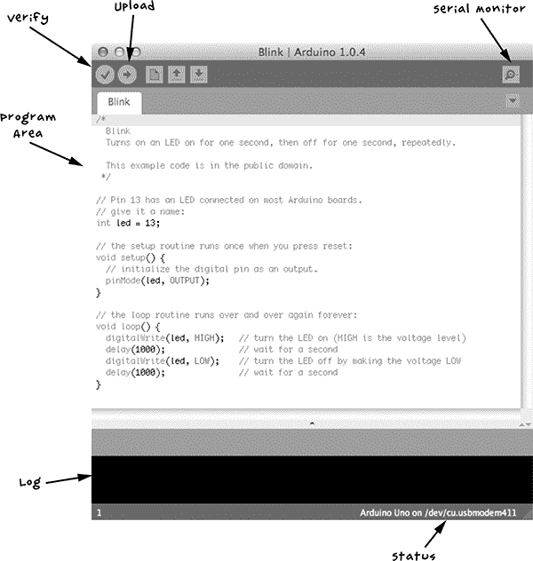
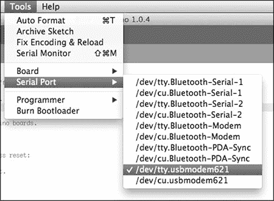
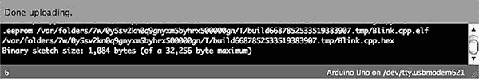
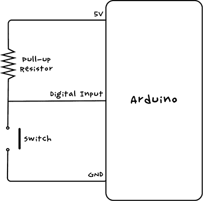
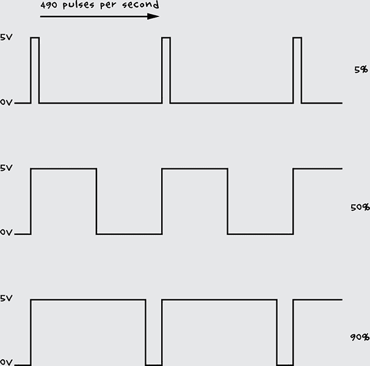
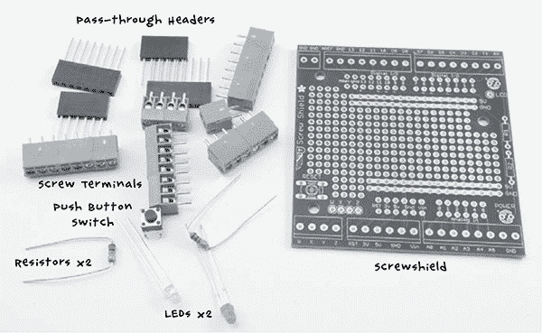
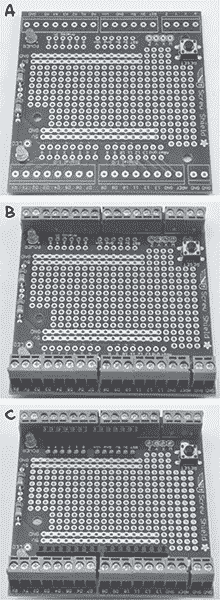

## 第十四章：C

**ARDUINO 入门**


Arduino 微控制器板非常适合末日后的世界。它们坚固耐用、可靠，且功耗极低。如果你是 Arduino 的新手，本附录将帮助你入门这块出色的小板，让你可以开始为末日做准备，并大大提高生存机会。

### 什么是 Arduino？

Arduino 有多种类型的开发板，但最常见的是 Arduino Uno，它也是本书中所有项目所使用的板（见图 C-1）。



图 C-1：一块 Arduino Uno R3

如图 C-1 所示，Arduino Uno 是版本 3（R3）板，这是写作时的最新版本。我们将逐一查看每个组件及其用途。

让我们从 USB 插口开始。它有几个用途：可以用来为 Arduino 提供电源，或者将 Arduino 连接到计算机进行编程。它还可以作为与其他计算机的通信链接，如在第 13 项目：树莓派控制中心中，见第 140 页，它将数据从 Arduino 发送到树莓派。Arduino 上的小红色按钮是复位按钮。按下它将使 Arduino 上安装的程序重新启动。

Arduino 的顶部和底部边缘的连接插槽是连接电子元件的地方。在图 C-1 的顶部，数字输入和输出引脚编号为 0 到 13，可以配置为输入或输出。输入读取进入的信号；例如，如果你将一个开关连接到数字输入，输入会检测开关是否被按下。输出发送信息或电源；如果你将 LED 连接到数字输出，你可以通过将输出从*低*切换到*高*来打开它。实际上，一个名为*L*的 LED 已内置在板上，并连接到数字引脚 13。

在右侧，电源 LED 指示板是否通电。ICSP（In-Circuit Serial Programming）接口仅用于 Arduino 的高级编程，大多数 Arduino 的普通用户不会使用它。

ATMega328 是一个微控制器集成电路（IC），也是 Arduino 的大脑。该芯片包含 32KB 的闪存，你可以将你希望 Arduino 运行的程序存储在其中。

在图 C-1 的右下角，有一排标记为 A0 到 A5 的模拟输入引脚。数字输入只能检测某物是开还是关，但模拟输入实际上可以测量引脚上的电压，只要电压在 0V 到 5V 之间。例如，模拟输入引脚可以用来测量温度传感器的电压，比如在第 12 项目：温度报警中使用的传感器，该项目见第 131 页。

最后一排插座提供了各种电源连接。在第 4 项目：电池监视器中，位于第 53 页，我们使用*V[in]*（电压输入）为 Arduino 提供电源；5V 和 GND（或地线，即 0V）也是在连接外部电子设备时需要的电源连接。

在左下角，我们有一个直流电源插孔，这是另一个电源连接。它可以接受 7V 到 12V 的直流电源。Arduino 会自动接受来自 USB 插口的电源以及来自直流连接器或*V[in]*插口的电源。

### Arduino 软件

Arduino 可能不像你想象的那样是计算机。它没有操作系统，也没有键盘、显示器或鼠标。当然，这对于需要轻装上阵的幸存者来说是个好消息。虽然你可以多次重新编程 Arduino，但它一次只能运行一个程序（称为*草图*）。要编程 Arduino，您必须在您的普通计算机上安装 Arduino IDE 软件，因此我们将首先介绍安装过程，然后再讨论编写程序。

#### 安装 Arduino IDE

Arduino IDE 易于使用，这是 Arduino 大受欢迎的一个重要原因。它适用于 Windows、Mac 和 Linux 计算机，并且可以通过 USB 连接编程 Arduino，无需任何特殊的编程硬件。

**注意**

您需要一个互联网连接来下载 Arduino IDE，因此在开始听到新闻中的僵尸消息之前，请先完成下载！

要在您的平台上安装 Arduino IDE，请从 Arduino 网站下载软件，网址是*[`www.arduino.cc/`](http://www.arduino.cc/)*（点击**下载**按钮并安装适合您系统的版本）。然后按照“入门指南”中的说明进行操作。Windows 和 Mac 用户需要安装 USB 驱动程序，以便 Arduino IDE 能够与 Arduino 通信。

一旦所有内容安装完毕，运行 Arduino IDE。图 C-2 显示了带有一些代码的 Arduino IDE 窗口。



图 C-2：Arduino IDE 窗口

如其名称所示，上传按钮将当前的草图上传到 Arduino 板。然而，在上传之前，它会将文本编程代码转换为可执行代码，并在日志区域显示任何错误。验证按钮在不上传程序到板上的情况下检查代码是否有错误。

串口监视器按钮打开串口监视器窗口，用于 Arduino 和另一台电脑之间的双向通信，如第 13 个项目：树莓派控制中心中所示，见第 140 页。你可以输入文本消息发送给 Arduino，任何回应也会显示在同一窗口中。屏幕底部的状态区域提供你所使用的 Arduino 类型以及按下上传按钮时会编程的串口信息。图 C-2 中的状态区域还显示了你在使用 Mac 或 Linux 电脑时应该看到的端口类型（类似于`/dev/cu.usbmodem411`）。如果你使用的是 Windows 电脑，这里会显示以`COM`开头，后跟一个数字。

IDE 的大白色区域是程序区域，你可以在这里输入要上传到 Arduino 的程序代码。

**文件**菜单允许你像在文字处理器中一样打开和保存草图，并且有一个示例子菜单，你可以从中加载示例草图。

### 上传草图

为了测试你的 Arduino 板并确保 Arduino IDE 已正确安装，点击**文件** ▸ **示例** ▸ **01. 基础**打开名为*Blink*的示例草图（如图 C-2 所示）。

使用 USB 电缆将 Arduino 连接到电脑。连接后，Arduino 的电源 LED 应亮起，其他一些 LED 灯也应闪烁。

现在 Arduino 已连接，你需要告诉 IDE 正在编程的板类型以及它所连接的串口。通过菜单**工具** ▸ **板子**设置板类型，然后从板子列表中选择 Arduino Uno。

通过菜单**工具** ▸ **端口**设置串口。如果你使用的是 Windows 电脑，可能没有太多选项；你可能只会看到 COM4\选项。在 Mac 或 Linux 电脑上，通常会列出更多的串口连接，其中很多是内部设备，可能很难确定哪个是你的 Arduino 板。

通常，正确的端口是以`dev/ttyusbmodemNNNN`开头，其中 NNNN 是一个数字。在图 C-3 中，连接到我的 Mac 的 Arduino 已被选中。



图 C-3：选择 Arduino 串口

如果你的 Arduino 没有出现在列表中，通常意味着你遇到了 USB 驱动问题，试着重新安装驱动程序。如果你是 Windows 用户，尝试重启电脑。

现在你应该准备好将程序上传到 Arduino，因此按下**上传**按钮。日志区域应显示消息，然后 Arduino 上的 TX 和 RX LED 灯应闪烁，表明程序正在上传到板子上。

上传完成后，你应该看到类似图 C-4 所示的消息。



图 C-4：成功上传

`Done uploading` 消息告诉你草图已经上传，控制台中的最后一行告诉你，你已经使用了 1,084 字节的 32,256 字节可用空间。

一旦草图上传完成，Arduino 上内置的 *L* LED 应该会慢慢闪烁，这正是 *Blink* 程序的预期行为。

#### 安装抗僵尸草图

所有书中的草图都可以通过书的官网获取 (*[`www.nostarch.com/zombies/`](http://www.nostarch.com/zombies/)*)。点击下载代码链接，下载名为 *zombies-master.zip* 的 ZIP 文件。确保在 *末日* 开始之前完成此操作，因为一旦感染开始蔓延，你的宽带可能会变得优先级低。该文件夹将包含书中所有与 Arduino 和 Raspberry Pi 项目相关的程序。

安装 Arduino 草图，以便你可以直接通过 Arduino IDE 使用它们。对于 Mac 和 Linux 用户，将 *Arduino* 文件夹中的子文件夹复制到 *Documents/Arduino* 文件夹，Windows 用户则复制到 *My Documents\Arduino* 文件夹。退出并重新打开 Arduino IDE。现在，当你查看 **文件** ▸ **草图集** 时，你应该能看到所有书中的草图列表。

### Arduino 编程基础

本节包含了 Arduino 编程命令的概述，帮助你理解用于与僵尸互动的草图。如果你有兴趣学习 Arduino C 编程语言，考虑购买我的书 *编程 Arduino：草图入门*（Tab Books, 2012）。你现在正在阅读的这本书的技术审阅者（Jeremy Blum）也写了一本很好的 Arduino 书籍，并制作了一系列精彩的视频教程。你可以通过他的网站 (*[`www.jeremyblum.com/`](http://www.jeremyblum.com/)* ) 找到所有相关链接。

#### Arduino 草图的结构

所有 Arduino 草图必须包含两个基本的 *函数*（执行任务的程序代码单元）：`setup` 和 `loop`。为了理解它们的工作原理，让我们来分析之前提到的 *Blink* 示例。

```
int led = 13;

// the setup routine runs once when you press reset
void setup() { 

  // initialize the digital pin as an output
  pinMode(led, OUTPUT);
}

// the loop routine runs over and over again forever
void loop() {
  digitalWrite(led, HIGH); // turn the LED on (HIGH is the voltage level)
  delay(1000);             // wait for a second
  digitalWrite(led, LOW);  // turn the LED off by making the voltage LOW
  delay(1000);             // wait for a second
}
```

如果你使用的是较新的 Arduino IDE 版本，你的 *Blink* 草图可能会有所不同，因此在此讨论中，请参考这里打印的草图，而不是在你的 IDE 中加载的草图。

以双斜杠 (`//`) 开头的文本叫做 *注释*。它不是可执行的程序代码，而是对草图中某个部分发生的事情的描述。

紧跟在 `setup()` 和 `loop()` 这两个词后面，我们会看到一个 `{` 符号。（有时它和前面的词在同一行，有时在下一行。它的位置完全是个人偏好问题，对代码的运行没有影响。）`{` 符号标志着代码块的开始，代码块以相应的 `}` 符号结束。你将使用大括号将属于特定函数或其他控制结构的所有代码行分组在一起。

`setup` 函数中的代码只会运行一次，当 Arduino 上电或按下重置按钮时执行。你可以在 `setup` 函数中执行所有程序启动时只需要执行一次的任务。在 *Blink* 程序中，`setup` 函数中的代码仅将 LED 引脚设置为输出。

`loop` 函数中的命令会一遍又一遍地运行；换句话说，当 `loop` 内的最后一行执行完后，第一行会重新开始。

现在，让我们从第一行开始解析这个程序。

#### 创建变量和常量

*变量* 是为值命名的一种方式；例如，*Blink* 的第一行将 13 号引脚命名为 `led`：

```
int led = 13;
```

这定义了一个名为 `led` 的 `int` 变量，并赋予它初始值 13，因为 13 是连接 *L* LED 的 Arduino 引脚编号。`int` 是整数（integer）的缩写，表示这个变量返回一个没有小数的整数。

在书中的其他程序中，像这样定义特定引脚的变量，通常会在前面加上 `const` 关键字：

```
const int led = 13;
```

`const` 关键字告诉 Arduino IDE `led` 的值永远不会从 13 改变，使其成为一个 *常量*。以这种方式赋值会生成稍微更小且更快速的代码，一般认为这是一个好习惯。

#### 配置数字输出

`Blink` 程序也很好地展示了如何将引脚设置为 *数字输出*。通过这行代码，在 `setup` 函数中将已经定义为 `led` 的引脚 13 配置为输出：

```
 pinMode(led, OUTPUT); 
```

由于这只需要执行一次，因此将其放在 `setup` 函数中。一旦引脚被设置为输出，它将一直是输出状态，直到我们告诉它变为其他类型。

为了让 LED 闪烁，它需要反复开关，所以这部分代码放在 `loop` 函数中：

```
digitalWrite(led, HIGH); // turn the LED on (HIGH is the voltage level)
delay(1000);             // wait for a second
digitalWrite(led, LOW);  // turn the LED off by making the voltage LOW
delay(1000);             // wait for a second
```

命令 `digitalWrite` 需要两个 *参数*（即函数运行所需的数据），这些参数被传递给函数，并用逗号分隔。第一个参数定义了要写入的 Arduino 引脚（在这个例子中是 13 号引脚，由 `led` 指定），第二个参数则给出要写入引脚的值。`HIGH` 的值将输出设置为 5V，点亮 LED，而 `LOW` 的值将引脚设置为 0V，熄灭 LED。

`delay` 函数包含一个参数，用于定义 Arduino 在当前功能执行多长时间。在这个例子中，`1000` 的值会让程序延迟一秒，然后才会改变 LED 的状态。

#### 配置数字输入

数字引脚也可以通过 `pinMode` 命令设置为输入引脚。*Blink* 程序没有这样做，以下是一个示例：

```
pinMode(7, INPUT)
```

这个 `pinMode` 函数将 7 号引脚设置为输入。就像设置输出一样，你很少需要改变引脚的模式，所以应该在 `setup` 函数中定义输入引脚。

将引脚设置为输入后，你可以使用 `read` 函数读取该引脚的电压，如以下 `loop` 函数所示：

```
loop()
{
  if (digitalRead(7) == HIGH)
  {
    digitalWrite(led, LOW)
  }
}
```

在这里，如果在测试时引脚 7 的输入被读取为`HIGH`，LED 将被关闭。Arduino 决定是否打开 LED，通过一个*if 语句*来实现，这个语句以`if`命令开始。紧接着`if`后面的是一个*条件*。在这种情况下，条件是`(digitalRead(7) == HIGH)`。双等号（`==`）告诉计算机比较两边的两个值。在这种情况下，如果引脚 7 是`HIGH`，那么`if`后面的`{`和`}`之间的代码块将会执行；否则它不会执行。如果条件为真，我们已经看过要执行的代码，就是`digitalWrite`命令来打开 LED。

**注意**

对齐`{`和`}`可以更容易地看出哪个`}`属于哪个`{`。

#### 使用上拉电阻稳定数字输入

前面的示例代码假设数字输入一定是高电平或低电平。连接到数字输入的开关只能关闭连接。通常你会以这样一种方式连接开关：当开关翻转时，数字输入连接到 GND（0V）。当开关的连接处于打开状态时，数字输入被称为*浮空*。这意味着输入没有与任何电路连接，但浮空输入仍然能从周围电路中拾取电噪声，导致引脚上的电压在高低之间震荡。

这种行为是不希望的，因为代码可能会意外激活。为了防止输入引脚浮空，只需添加一个上拉电阻（图 C-5）。在 “项目 6：PIR 僵尸探测器” 中的第 72 页我们就使用了这样一个电阻。

当开关打开时（如图 C-5 所示），电阻将输入引脚连接到电压源，将输入引脚的电压拉高至 5V 并保持在那里。按下按钮关闭开关时，会覆盖输入的弱上拉作用，而将数字输入连接到 GND。



图 C-5：使用上拉电阻与数字输入连接的原理图

Arduino 输入有内置的约 40 kΩ的上拉电阻，可以通过如下方式启用：

```
pinMode(switchPin, INPUT_PULLUP);
```

这个示例展示了如何设置数字输入引脚的模式，使其与开关一起使用，并启用 Arduino 的上拉电阻：只需将引脚模式设置为`INPUT_PULLUP`，而不是`INPUT`。

#### 读取模拟输入

模拟输入允许你在 Arduino 的 A0 到 A5 模拟输入引脚之间测量 0V 到 5V 之间的电压。与数字输入和输出不同，在使用模拟输入时，你不需要在`setup`中包含`pinMode`命令。

使用`analogRead`来读取模拟输入的值，并提供你要读取的引脚名称作为参数。与`digitalRead`不同，`analogRead`返回一个数字，而不仅仅是`true`或`false`。返回的数字将介于 0（0V）和 1,023（5V）之间。要将数字转换为实际电压，请将值乘以 5，然后除以 1,023，相当于除以 204.6。

以下是如何在 Arduino 代码中读取模拟值并进行转换：

```
int raw = analogRead(A0);
float volts = raw / 204.6;
```

变量`raw`是`int`（整数类型），因为模拟输入的读取值始终是整数。为了将原始读取值转化为小数类型，变量需要是`float`（浮点型）类型。

#### 写入模拟输出

数字输出仅允许你开关一个组件（如 LED），但模拟输出可以逐步控制供给组件的功率大小。这种控制方式可以用来控制例如 LED 的亮度或电机的速度。在第 20 个项目：使用 Arduino 进行静音触觉通信中，利用此功能通过减少电机的功率，避免因噪音过大而引来僵尸。

只有 D3、D5、D6、D9、D10 或 D11 引脚可以用作模拟输出。这些引脚旁边会标有一个小的波浪符号（~），表示它们支持模拟输出。

要控制模拟输出，使用命令`analogWrite`，并将 0 到 255 之间的数字作为参数，如下所示：

```
analogWrite(3, 127);
```

值为 0 时是 0V，完全关闭；值为 255 时是 5V，完全开启。在这个例子中，我们将 D3 引脚的输出设置为 127，这相当于半功率。

#### 在控制循环中重复代码

控制循环（与`loop`函数不同）允许你重复执行某个动作指定次数，或者直到某个条件发生变化。有两条命令可以用来创建循环：`for`和`while`。你可以使用`for`命令来重复执行某个操作固定次数，而`while`命令则用于在某个条件发生变化之前重复执行某个操作。

以下代码使 LED 闪烁 10 次，然后停止：

```
void setup() {
  pinMode(led, OUTPUT);
  for (int i = 0; i < 10; i++)
  {
    digitalWrite(led, HIGH);
    delay(1000);
    digitalWrite(led, LOW);
    delay(1000);
  }
void loop() {
}
```

**模拟输出如何生成电压**

很容易认为模拟输出的电压范围是 0V 到 5V，如果你在模拟输出引脚和地之间连接一个电压表，你确实会看到电压在调整`analogWrite`参数时在 0V 和 5V 之间变化。实际上，情况比这复杂一些。这种输出使用的是脉宽调制（PWM）。图 C-6 展示了实际情况。



图 C-6：模拟输出的脉宽调制

一个模拟输出引脚每秒生成 490 个脉冲，且脉冲宽度各不相同。脉冲保持高电平的时间比例越大，输出的功率越大，因此 LED 越亮，电机转速越快。

一台电压表会将这个变化报告为电压变化，因为电压表响应速度不够快，因此做了某种类型的平均（积分）。

在这个例子中，我们将闪烁代码放在 `setup` 中，而不是放在 `loop` 中，因为 `loop` 会立即重复闪烁循环，所以 LED 在 10 次之后不会停止。

如果你想让 LED 持续闪烁，直到连接到数字输入的按钮被按下，你可以使用 `while` 命令：

```
➊ while (digitalRead(9) == LOW)
   {
      digitalWrite(led, HIGH);
      delay(1000);
      digitalWrite(led, LOW);
      delay(1000);
   }
```

这段代码表示，当引脚 9 检测到按钮被按下 ➊ 时，LED 应该点亮。

#### 设置两个条件的 IF/ELSE

在 “配置数字输出” 这部分内容的 第 251 页 中，我们使用了一个 `if` 命令来告诉 Arduino IDE 在某个条件满足时执行某个操作。你还可以将 `if` 与 `else` 命令结合使用，指示 IDE 在条件为真时执行一组代码，在条件为假时执行另一组代码。以下是一个例子：

```
if (analogRead(A0) > 500)
{
  digitalWrite(led, HIGH);
}
else
{
 digitalWrite(led, LOW);
}
```

这个 `if` 语句会在模拟读数大于 500 时打开 `led` 引脚，或者在读数小于或等于 500 时关闭它。

#### 进行逻辑比较

到目前为止，我们使用了两种比较类型：`==`（等于）和 `>`（大于）。下面是一些其他的比较方式：

<=  小于或等于

>=  大于或等于

!=  不等于

你还可以使用 *逻辑运算符* 进行更复杂的比较，例如 `&&`（与）和 `||`（或）。例如，为了在读数在 300 到 400 之间时打开 LED，你可以写如下代码：

```
int reading = analogRead(A0);
if ((reading >= 300) && (reading <= 400))
{
  digitalWrite(led, HIGH);
}
{
 digitalWrite(led, LOW);
}
```

在英文中，这段代码可能会写成：“如果读数大于或等于 300 *并且* 读数小于或等于 400，则打开 LED。”由于我们使用了 `&&` 操作符来指定两个条件必须同时为真，如果其中任何一个条件不满足，LED 就会保持关闭。

#### 将代码分组为函数

如果你是编程新手，函数可能会让人困惑。函数最好理解为将一组代码行组合在一起并给它们一个名字，这样这块代码就可以轻松地反复使用。

内置函数如 `digitalWrite` 比它们最初看起来的要复杂。以下是 `digitalWrite` 函数的代码：

```
void digitalWrite(uint8_t pin, uint8_t val)
{
    uint8_t timer = digitalPinToTimer(pin);
    uint8_t bit = digitalPinToBitMask(pin);
    uint8_t port = digitalPinToPort(pin);
    volatile uint8_t *out;

    if (port == NOT_A_PIN) return;

    // If the pin that support PWM output, we need to turn it off
    // before doing a digital write.
    if (timer != NOT_ON_TIMER) turnOffPWM(timer);

    out = portOutputRegister(port);

    uint8_t oldSREG = SREG;
    cli();

    if (val == LOW) {
        *out &= ~bit;
    } else {
        *out |= bit;
    }
    SREG = oldSREG;
}
```

既然已经有人写好了 `digitalWrite` 函数，我们就不需要担心这些代码到底做了什么；我们只需要高兴的是，每次我们想把 `pin` 从 `high` 改为 `low` 时，不用每次都输入这些代码。通过给这块代码起个名字，我们只需要调用这个名字来使用这段代码。

你可以创建自己的函数，作为更复杂代码块的快捷方式。例如，要创建一个函数，使 LED 根据你指定的参数闪烁指定次数，并且 LED 引脚也作为参数指定，你可以使用下面的代码。这函数名为 `blink`，你可以在启动时调用它，这样 Arduino *L* LED 在重置后会闪烁五次。

```
➊ const int ledPin = 13;

➋ void setup()
   {
     pinMode(ledPin, OUTPUT);
➌   blink(ledPin, 5);
   }

   void loop() {}

➍ void blink(int pin, int n)
   {
➎   for (int i = 0; i < n; i++)
     {
       digitalWrite(ledPin, HIGH);
       delay(500);
       digitalWrite(ledPin, LOW);
       delay(500);
     }
   }
```

在 ➊ 处，我们定义了正在使用的引脚。 ➋ 处的 `setup` 函数将 `ledPin` 设置为输出，然后调用 `blink` 函数 ➌，传入相关引脚和闪烁次数（`5`）。`loop` 函数为空，什么也不做，但 Arduino IDE 要求我们即使它没有任何作用也要包括这个函数。如果不包括它，安装程序时会报错。

`blink` 函数本身从 ➍ 开始，关键字为 `void`。`void` 表示该函数没有返回值，因此不能像进行某些计算的函数那样将调用结果赋给变量。接下来是函数的名称（`blink`）和函数接收的参数，这些参数放在括号内，并用逗号分隔。当你定义一个函数时，必须指定每个参数的类型（例如，是否是 `int` 或 `float`）。在这个例子中，`pin`（引脚）和闪烁次数 (`n`) 都是 `int` 类型的值。最后，在 ➎ 处，我们有一个 `for` 循环，循环执行 `digitalWrite` 和 `delay` 命令 `n` 次。

这就是软件速成课程的内容。如果你想学习更多关于 Arduino 编程的知识，*请访问[`www.arduino.cc/`](http://www.arduino.cc/)*，在你所在的互联网服务提供商的员工变成僵尸之前。

### 组装螺丝盾板

本书中的许多项目使用了螺丝盾板，这种盾板可以安装到 Arduino 插槽上，并通过螺丝端子将电线连接到 Arduino 引脚。并非所有电线都能适配普通的 Arduino 插槽，但几乎任何粗细的电线都能牢固地连接到螺丝端子上，并且不会松动。市面上有多种螺丝盾板，它们的布局略有不同。在本书中，我使用的是 Adafruit 公司流行的型号（原型螺丝盾板，零件号 196），它以套件形式提供，需自行焊接组装。尽管连接的部件很多，但没有任何一个是困难的。原型螺丝盾板的组件部分如图 C-7 所示。



图 C-7：Adafruit 原型螺丝盾板的零件

螺丝端子排布在电路板的边缘和 Arduino 的通过插头处。螺丝盾板的通过插头插入到盾板中，再通过 PCB 插入。你可以像在 Arduino Uno 中一样将电线插入这些插头，并且它们的顶部也有插槽，你可以在其上再安装一个盾板。

两个 LED 灯中，一个是电源 LED，用来指示电路板是否已通电，另一个则是供你在构建过程中使用的 LED。如果你不需要这两个 LED，可以不将它们焊接到电路板上。按钮是一个复位开关，这个开关很有用，因为当螺丝盾板安装时，很难接触到 Arduino 的复位按钮。同样，这个开关并非必须。

图 C-8 展示了电路板的组装过程。



图 C-8：组装螺丝盾板

组装螺丝护罩时，按照以下步骤操作：

1\. 焊接 LED、 电阻和开关（如果你需要的话）（图 C-8a）。

2\. 将所有螺丝端子放置在螺丝护罩的最外缘（图 C-8b），然后翻转电路板，在 PCB 的背面焊接它们。确保它们的方向正确，使得电线进入的开口朝外，远离电路板。

3\. 将穿透式插头从电路板的顶部插入（图 C-8c），并进行焊接。请注意，在电路板的每一侧都有两排孔，可以插入这些插头；将它们放在外侧的孔位中。内侧的孔位用于将电线连接到电路板中央原型区域的引脚。

如果你需要复习如何焊接到 PCB 上，请查看 “焊接基础”（第 230 页）。将元件放置好后，确保你的焊接点牢固（也可以在 “焊接基础” 中找到相关描述）。你应该已经准备好将这个便捷的护罩用于所有的反僵尸基地防御任务，并节省宝贵的焊锡用于那些你打算让它们长期使用的设备。

### 进一步资源

有许多很棒的在线资源和书籍可以帮助你了解如何在项目中使用 Arduino。以下是一些开始的链接：

• 我写了许多关于 Arduino 的书籍，包括 *《编程 Arduino：Sketches 入门》*（Tab Books，2012）和各种 Arduino 项目书籍。你可以在 *[`www.simonmonk.org/`](http://www.simonmonk.org/)* 找到我所有书籍的完整列表。

• 本书的技术编辑 Jeremy Blum 制作了一系列关于 Arduino 的入门视频，你可以在这里找到它们： *[`www.youtube.com/playlist?list=PLA567CE235D39FA84`](https://www.youtube.com/playlist?list=PLA567CE235D39FA84)*。

• Jeremy 还写了一本关于 Arduino 的优秀书籍，名为 *《探索 Arduino》*（Wiley，2013）。

• 我写了一系列在线 Arduino 课程，即 Adafruit “Learn Arduino” 系列，你可以在这里找到它们： *[`learn.adafruit.com/series/learn-arduino/`](https://learn.adafruit.com/series/learn-arduino/)*。
