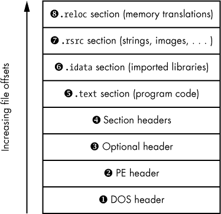

## **基础静态恶意软件分析**


本章我们将探讨静态恶意软件分析的基础。静态分析通过分析程序文件的反汇编代码、图像、可打印字符串和其他磁盘上的资源来进行。它指的是在不实际运行程序的情况下进行逆向工程。虽然静态分析技术有其局限性，但它能帮助我们理解各种恶意软件。通过细致的逆向工程，你将能够更好地理解恶意软件二进制文件在攻击者控制目标后所带来的好处，以及攻击者如何隐藏和持续攻击已感染的机器。正如你所看到的，本章结合了描述和示例。每一节都介绍一种静态分析技术，并通过实际分析中的应用来进行说明。

我将本章的开始部分用来描述大多数 Windows 程序使用的可移植执行文件（PE）格式，然后介绍如何使用流行的 Python 库 `pefile` 来解析一个真实的恶意软件二进制文件。接着我将描述如导入分析、图像分析和字符串分析等技术。在所有案例中，我都会展示如何使用开源工具将分析技术应用于实际的恶意软件。最后，在本章结束时，我会介绍恶意软件如何让恶意软件分析师感到困扰，并讨论一些缓解这些问题的方法。

你将在本章示例中使用的恶意软件样本，存储在本书数据目录下的 */ch1* 文件夹中。为了演示本章讨论的技术，我们使用 *ircbot.exe*，这是一个用于实验目的的互联网中继聊天（IRC）机器人，作为常见恶意软件的示例。该程序的设计目的是在目标计算机上保持常驻，并与 IRC 服务器连接。*ircbot.exe* 控制了目标后，攻击者可以通过 IRC 控制目标计算机，执行诸如开启摄像头捕获并偷偷提取目标物理位置的视频流、截取桌面截图、从目标计算机中提取文件等操作。在本章中，我将展示如何通过静态分析技术揭示这些恶意软件的功能。

### 微软 Windows 可移植执行文件格式

要进行静态恶意软件分析，你需要了解 Windows PE 格式，该格式描述了现代 Windows 程序文件（如 *.exe*、*.dll* 和 *.sys* 文件）的结构，并定义了它们存储数据的方式。PE 文件包含 x86 指令、如图像和文本等数据，以及程序运行所需的元数据。

PE 格式最初是为了完成以下目的而设计的：

**告诉 Windows 如何将程序加载到内存中** PE 格式描述了文件的哪些部分应该加载到内存中，以及它们的加载位置。它还告诉你 Windows 应该从程序代码的哪个位置开始执行程序，以及哪些动态链接代码库应该加载到内存中。

**提供运行程序在执行过程中可能使用的媒体（或资源）** 这些资源可以包括字符字符串，如图形用户界面对话框或控制台输出中的字符，也可以是图像或视频。

**提供安全数据，如数字代码签名** Windows 使用这些安全数据来确保代码来自受信任的来源。

PE 格式通过利用图 1-1 中显示的一系列结构来实现这一切。



*图 1-1：PE 文件格式*

如图所示，PE 格式包括一系列头部，告诉操作系统如何将程序加载到内存中。它还包括一系列包含实际程序数据的节区。Windows 将这些节区加载到内存中，使得它们的内存偏移量对应于它们在磁盘上出现的位置。让我们更详细地探索这一文件结构，从 PE 头部开始。我们将跳过对 DOS 头部的讨论，因为它是 1980 年代微软 DOS 操作系统的遗物，仅仅为了兼容性而存在。

#### *PE 头部*

如图 1-1 所示，在 DOS 头部 ➊ 之上，是 PE 头部 ➋，它定义了程序的一般属性，如二进制代码、图像、压缩数据和其他程序属性。它还告诉我们程序是为 32 位还是 64 位系统设计的。PE 头部为恶意软件分析师提供了基本但有用的上下文信息。例如，头部包含一个时间戳字段，可以揭示恶意软件作者编译文件的时间。当恶意软件作者忘记将此字段替换为虚假值时，就会出现这种情况，而他们经常这样做。

#### *可选头部*

可选头部 ➌ 实际上在今天的 PE 可执行程序中无处不在，尽管它的名字可能给人带来误解。它定义了程序在 PE 文件中的*入口点*的位置，指的是程序加载后首次运行的指令。它还定义了 Windows 加载 PE 文件时将加载到内存中的数据大小、Windows 子系统、程序目标（如 Windows GUI 或 Windows 命令行）以及程序的其他高级细节。此头部中的信息对逆向工程师来说至关重要，因为程序的入口点告诉他们从哪里开始逆向工程。

#### *节区头部*

节头 ➍ 描述了 PE 文件中包含的数据节。PE 文件中的*节*是一个数据块，它要么在操作系统加载程序时被映射到内存中，要么包含有关如何将程序加载到内存中的指令。换句话说，节是磁盘上的字节序列，这些字节序列要么会变成内存中的连续字节串，要么会向操作系统报告加载过程中的某些方面。

节头还告诉 Windows 应该授予各个节哪些权限，例如它们是否在程序执行时应当是可读、可写或可执行的。例如，包含 x86 代码的`.text`节通常会被标记为可读和可执行，但不可写，以防程序代码在执行过程中意外修改自身。

一些节，如 `.text` 和 `.rsrc`，如图 1-1 所示。这些节在执行 PE 文件时会被映射到内存中。其他特殊节，如 `.reloc` 节，则不会被映射到内存中。我们也会讨论这些节。让我们一起回顾一下图 1-1 中显示的各个节。

##### .text 节

每个 PE 程序至少包含一个标记为可执行的 x86 代码节，这些节几乎总是命名为 `.text` ➎。我们将在第二章进行程序反汇编和逆向工程时，反汇编 `.text` 节中的数据。

##### .idata 节

`.idata`节 ➏，也叫*导入节*，包含*导入地址表（IAT）*，该表列出了动态链接的库及其函数。IAT 是在初次分析 PE 二进制文件时最重要的结构之一，因为它揭示了程序所调用的库函数，这反过来可能揭示恶意软件的高级功能。

##### 数据节

PE 文件中的数据节可以包括 `.rsrc`、`.data` 和 `.rdata` 等节，它们存储程序使用的项目，如鼠标光标图像、按钮皮肤、音频和其他媒体。例如，图 1-1 中的 `.rsrc` 节 ➐ 包含程序用来渲染文本字符串的可打印字符字符串。

`.rsrc`（资源）节中的信息对恶意软件分析师来说至关重要，因为通过检查 PE 文件中的可打印字符字符串、图像和其他资源，他们可以获得有关文件功能的重要线索。在第 7 页的《检查恶意软件图像》中，您将学习如何使用 `icoutils` 工具包（包括 `icotool` 和 `wrestool`）从恶意软件二进制文件的资源节中提取图像。然后，在第 8 页的《检查恶意软件字符串》中，您将学习如何从恶意软件的资源节中提取可打印字符串。

##### .reloc 节

一个 PE 二进制文件的代码不是 *位置无关的*，这意味着如果它从预定的内存位置移动到新的内存位置，它将无法正确执行。`.reloc` 节通过允许代码移动而不破坏其功能来解决这个问题。它告诉 Windows 操作系统，在 PE 文件的代码被移动后，翻译内存地址，以确保代码仍能正确运行。这些翻译通常涉及对内存地址添加或减去偏移量。

尽管 PE 文件的 `.reloc` 节可能包含你在恶意软件分析中需要使用的信息，但本书不会进一步讨论它，因为我们的重点是将机器学习和数据分析应用于恶意软件，而不是进行涉及查看重定位的硬核逆向工程。

### 使用 pefile 剖析 PE 格式

由 Ero Carerra 编写和维护的 `pefile` Python 模块，已成为业界标准的恶意软件分析库，用于剖析 PE 文件。在本节中，我将向你展示如何使用 `pefile` 来剖析 *ircbot.exe*。*ircbot.exe* 文件可以在本书随附的虚拟机中找到，路径为 *~/malware_data_science/ch1/data*。列表 1-1 假设 *ircbot.exe* 位于你当前的工作目录中。

输入以下命令来安装 `pefile` 库，以便我们可以在 Python 中导入它：

```
$ pip install pefile
```

现在，使用 列表 1-1 中的命令启动 Python，导入 `pefile` 模块，并使用 `pefile` 打开并解析 PE 文件 *ircbot.exe*。

```
$ python
>>> import pefile
>>> pe = pefile.PE("ircbot.exe")
```

*列表 1-1：加载* pefile *模块并解析 PE 文件*（ircbot.exe）

我们实例化了 `pefile.PE`，这是 PE 模块实现的核心类。它解析 PE 文件，以便我们检查其属性。通过调用 PE 构造函数，我们加载并解析指定的 PE 文件，本示例中是 *ircbot.exe*。现在我们已经加载并解析了文件，运行 列表 1-2 中的代码，提取 *ircbot.exe* 的 PE 字段信息。

```
# based on Ero Carrera's example code (pefile library author)
for section in pe.sections:
  print (section.Name, hex(section.VirtualAddress),
    hex(section.Misc_VirtualSize), section.SizeOfRawData )
```

*列表 1-2：遍历 PE 文件的各个节并打印相关信息*

列表 1-3 显示了输出结果。

```
('.text\x00\x00\x00', ➊'0x1000', ➋'0x32830', ➌207360)
('.rdata\x00\x00', '0x34000', '0x427a', 17408)
('.data\x00\x00\x00', '0x39000', '0x5cff8', 10752)
('.idata\x00\x00', '0x96000', '0xbb0', 3072)
('.reloc\x00\x00', '0x97000', '0x211d', 8704)
```

*列表 1-3：使用 Python 的* pefile *模块提取 ircbot.exe 的节数据*

如 列表 1-3 中所示，我们从 PE 文件的五个不同节中提取了数据：`.text`、`.rdata`、`.data`、`.idata` 和 `.reloc`。输出结果显示为五个元组，每个元组对应一个提取的 PE 节。每行的第一个条目标识了 PE 节（你可以忽略 `\x00` 一系列的空字节，它们只是 C 风格的空字符串终结符）。剩余的字段告诉我们每个节加载到内存后将占用的内存量以及加载后在内存中的位置。

例如，`0x1000` ➊ 是这些部分将被加载的*基础虚拟内存地址*。可以将其视为该部分的基础内存地址。`0x32830` ➋ 在*虚拟大小*字段中指定了该部分加载后所需的内存量。`207360` ➌ 在第三个字段中表示该部分将在该内存块中占用的数据量。

除了使用`pefile`解析程序的各个部分外，我们还可以使用它列出二进制文件将加载的 DLL，以及它将在这些 DLL 中请求的函数调用。我们可以通过转储 PE 文件的 IAT 来实现这一点。列表 1-4 展示了如何使用`pefile`转储*ircbot.exe*的 IAT。

```
$ python
pe = pefile.PE("ircbot.exe")
for entry in pe.DIRECTORY_ENTRY_IMPORT:
    print entry.dll
    for function in entry.imports:
        print '\t',function.name
```

*列表 1-4：提取 ircbot.exe 中的导入*

列表 1-4 应生成列表 1-5 所示的输出（为简洁起见已被截断）。

```
KERNEL32.DLL
      GetLocalTime
      ExitThread
      CloseHandle
    ➊ WriteFile
    ➋ CreateFileA
      ExitProcess
    ➌ CreateProcessA
      GetTickCount
      GetModuleFileNameA
--snip--
```

*列表 1-5：ircbot.exe 的 IAT 内容，显示了此恶意软件使用的库函数*

正如列表 1-5 所示，这些输出对于恶意软件分析非常有价值，因为它列出了恶意软件声明并将引用的丰富函数。例如，输出的前几行告诉我们，恶意软件将使用`WriteFile` ➊ 写入文件，使用`CreateFileA` 调用 ➋ 打开文件，并使用`CreateProcessA` ➌ 创建新进程。虽然这只是关于恶意软件的一些基本信息，但它为我们更详细地了解恶意软件的行为提供了一个起点。

### 检查恶意软件图像

为了理解恶意软件如何被设计来攻击目标，我们来看一下它在 `.rsrc` 部分中包含的图标。例如，恶意软件二进制文件常常伪装成 Word 文档、游戏安装程序、PDF 文件等，以欺骗用户点击它们。你还会在恶意软件中发现一些图像，表明这些程序可能是攻击者感兴趣的工具，如网络攻击工具和用于远程控制被攻击机器的程序。我甚至见过一些二进制文件包含圣战分子的桌面图标、看起来邪恶的赛博朋克卡通角色图像和卡拉什尼科夫步枪的图像。为了进行样本图像分析，我们可以考虑一个由安全公司 Mandiant 识别的恶意软件样本，它被认为是由一个中国国家支持的黑客组织制作的。你可以在本章的数据目录中找到这个恶意软件样本，文件名为*fakepdfmalware.exe*。这个样本使用 Adobe Acrobat 图标来欺骗用户，使其误以为这是一个 Adobe Acrobat 文档，而实际上它是一个恶意的 PE 可执行文件。

在使用 Linux 命令行工具`wrestool`从*fakepdfmalware.exe*二进制文件中提取图像之前，我们首先需要创建一个目录来存放我们提取的图像。列表 1-6 展示了如何完成这一操作。

```
$ mkdir images
$ wrestool –x fakepdfmalware.exe –output=images
$ icotool –x –o images images/*.ico
```

*列表 1-6：从恶意软件样本中提取图像的 shell 命令*

我们首先使用`mkdir images`命令创建一个目录，用来存放提取出的图像。接下来，我们使用`wrestool`从*fakepdfmalware.exe*中提取图像资源（`-x`），保存到*/images*目录中，然后使用`icotool`提取（`-x`）并转换（`-o`）任何 Adobe *.ico*图标格式的资源为*.png*图像，这样我们就可以使用标准的图像查看工具查看它们。如果你的系统中没有安装`wrestool`，你可以在*[`www.nongnu.org/icoutils/`](http://www.nongnu.org/icoutils/)*下载它。

一旦你使用`wrestool`将目标可执行文件中的图像转换为 PNG 格式，你应该能够在你喜欢的图像查看器中打开它们，并查看不同分辨率下的 Adobe Acrobat 图标。正如我这里的示例所演示的那样，从 PE 文件中提取图像和图标相对简单，可以迅速揭示有关恶意软件二进制文件的有趣和有用的信息。同样，我们也可以轻松地从恶意软件中提取可打印字符串以获取更多信息，接下来我们就会这样做。

### 检查恶意软件字符串

*字符串*是程序二进制文件中可打印字符的序列。恶意软件分析师通常依赖恶意样本中的字符串来快速了解其中可能发生的事情。这些字符串通常包含 HTTP 和 FTP 命令，用于下载网页和文件，IP 地址和主机名，指示恶意软件连接的地址等等。有时，甚至用于编写字符串的语言也能提示恶意二进制文件的来源国，尽管这可以被伪造。你甚至可能会在某些字符串中找到用“黑话”解释恶意二进制文件目的的文本。

字符串还可以揭示关于二进制文件的更多技术信息。例如，你可能会找到关于用来创建该文件的编译器的信息，二进制文件使用的编程语言，嵌入的脚本或 HTML 等。尽管恶意软件作者可以对这些痕迹进行混淆、加密或压缩，但即使是高级恶意软件作者通常也会留下至少一些暴露的痕迹，这使得在分析恶意软件时检查`strings`转储尤为重要。

#### *使用 strings 程序*

查看文件中所有字符串的标准方法是使用命令行工具`strings`，其语法如下：

```
$ strings filepath | less
```

该命令将文件中的所有字符串逐行打印到终端。添加`| less`到命令末尾可以防止字符串直接在终端中滚动显示。默认情况下，`strings`命令会查找所有长度最短为 4 字节的可打印字符串，但你可以设置不同的最小长度并更改其他参数，具体内容可以参考命令手册页。我建议直接使用默认的最小字符串长度 4，但你也可以使用`–n`选项来更改最小字符串长度。例如，`strings –n 10` filepath 将只提取长度最短为 10 字节的字符串。

#### *分析你的字符串转储*

现在我们已经提取了恶意软件程序的可打印字符串，挑战是理解这些字符串的含义。例如，假设我们将*ircbot.exe*的字符串转储到*ircbotstring.txt*文件中，正如我们在本章前面使用`pefile`库探索*ircbot.exe*时所做的那样，操作如下：

```
$ strings ircbot.exe > ircbotstring.txt
```

*ircbotstring.txt*的内容包含数千行文本，但其中一些行应该特别引人注意。例如，列表 1-7 显示了一堆从字符串转储中提取出来的行，这些行以`DOWNLOAD`这个词开头。

```
[DOWNLOAD]: Bad URL, or DNS Error: %s.
[DOWNLOAD]: Update failed: Error executing file: %s.
[DOWNLOAD]: Downloaded %.1fKB to %s @ %.1fKB/sec. Updating.
[DOWNLOAD]: Opened: %s.
--snip--
[DOWNLOAD]: Downloaded %.1f KB to %s @ %.1f KB/sec.
[DOWNLOAD]: CRC Failed (%d != %d).
[DOWNLOAD]: Filesize is incorrect: (%d != %d).
[DOWNLOAD]: Update: %s (%dKB transferred).
[DOWNLOAD]: File download: %s (%dKB transferred).
[DOWNLOAD]: Couldn't open file: %s.
```

*列表 1-7：* strings *输出，显示证据表明恶意软件可以将攻击者指定的文件下载到目标机器上*

这些行表示*ircbot.exe*将尝试将攻击者指定的文件下载到目标机器上。

让我们尝试分析另一个例子。列表 1-8 中的字符串转储显示*ircbot.exe*可以充当一个 Web 服务器，在目标机器上监听来自攻击者的连接。

```
➊ GET
➋ HTTP/1.0 200 OK
   Server: myBot
   Cache-Control: no-cache,no-store,max-age=0
   pragma: no-cache
   Content-Type: %s
   Content-Length: %i
   Accept-Ranges: bytes
   Date: %s %s GMT
   Last-Modified: %s %s GMT
   Expires: %s %s GMT
   Connection: close
   HTTP/1.0 200 OK
➌ Server: myBot
   Cache-Control: no-cache,no-store,max-age=0
   pragma: no-cache
   Content-Type: %s
   Accept-Ranges: bytes
   Date: %s %s GMT
   Last-Modified: %s %s GMT
   Expires: %s %s GMT
   Connection: close
   HH:mm:ss
   ddd, dd MMM yyyy
   application/octet-stream
   text/html
```

*列表 1-8：* strings *输出，显示恶意软件有一个 HTTP 服务器，攻击者可以连接到该服务器*

列表 1-8 展示了多种由*ircbot.exe*用来实现 HTTP 服务器的 HTTP 样板代码。很可能，这个 HTTP 服务器允许攻击者通过 HTTP 连接到目标机器，以发出命令，例如截取受害者桌面截图并将其发送回攻击者。我们可以在整个列表中看到 HTTP 功能的证据。例如，`GET`方法 ➊ 请求从网络资源获取数据。`HTTP/1.0 200 OK` ➋ 是一个 HTTP 字符串，返回状态码`200`，表示 HTTP 网络交易正常完成，而`Server: myBot` ➌ 表明 HTTP 服务器的名称是*myBot*，这表明*ircbot.exe*内置了一个 HTTP 服务器。

所有这些信息对于理解和阻止特定恶意软件样本或恶意活动都非常有用。例如，知道某个恶意软件样本拥有一个 HTTP 服务器，当你连接到它时，它会输出某些字符串，这使你能够扫描网络并识别受感染的主机。

### 总结

本章中，你对静态恶意软件分析有了一个高层次的概述，这种方法涉及在不实际运行恶意软件的情况下对其进行检查。你了解了定义 Windows *.exe*和*.dll*文件的 PE 文件格式，并且学习了如何使用 Python 库`pefile`来剖析真实世界的恶意软件*ircbot.exe*二进制文件。你还使用了静态分析技术，如图像分析和字符串分析，从恶意软件样本中提取更多信息。第二章继续讨论静态恶意软件分析，重点分析可以从恶意软件中恢复的汇编代码。
