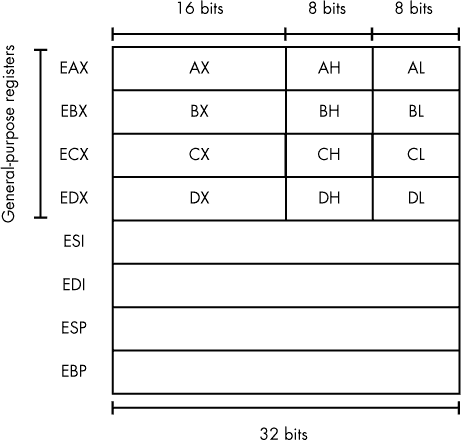
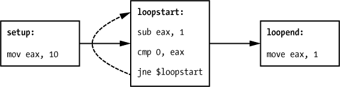

## 第二章：**超越基础静态分析：X86 反汇编**


为了彻底理解一个恶意程序，我们常常需要超越对其各个部分、字符串、导入项和图像的基础静态分析。这涉及到对程序汇编代码的逆向工程。事实上，反汇编和逆向工程是深入静态分析恶意软件样本的核心所在。

由于逆向工程既是一种艺术，也是一项技术工艺和科学，彻底的探索超出了本章的范围。我的目标是向你介绍逆向工程，以便你可以将其应用于恶意软件数据科学。理解这一方法论对于成功将机器学习和数据分析应用于恶意软件至关重要。

在本章中，我将从你需要理解 x86 反汇编的概念开始。接下来，我会展示恶意软件作者如何尝试绕过反汇编，并讨论如何减轻这些反分析和反检测手段的影响。但首先，让我们回顾一些常见的反汇编方法以及 x86 汇编语言的基础知识。

### 反汇编方法

*反汇编*是将恶意软件的二进制代码转换为有效的 x86 汇编语言的过程。恶意软件作者通常使用像 C 或 C++ 这样的高级语言编写恶意程序，然后使用编译器将源代码编译成 x86 二进制代码。汇编语言是这种二进制代码的人类可读表示。因此，将恶意程序反汇编成汇编语言是理解其核心行为的必要步骤。

不幸的是，反汇编并不是一件简单的事，因为恶意软件作者经常使用各种技巧来阻挠逆向工程师。事实上，在故意混淆的情况下，完美的反汇编仍然是计算机科学中的一个未解之谜。目前，针对这类程序的反汇编方法仅限于近似的、易出错的手段。

例如，考虑*自我修改代码*的情况，即在执行过程中修改自身的二进制代码。正确地反汇编这种代码的唯一方法是理解代码修改自身的程序逻辑，但这可能会异常复杂。

由于完美的反汇编目前无法实现，我们必须使用不完美的方法来完成这项任务。我们将使用的方法是 *线性反汇编*，它涉及识别可移植执行文件（PE 文件）中与其 x86 程序代码对应的连续字节序列，然后对这些字节进行解码。这种方法的关键局限性在于，它忽视了在程序执行过程中 CPU 如何解码指令的细微差别。此外，它也没有考虑恶意软件作者有时使用的各种混淆技术，这些技术使得程序更难以分析。

其他逆向工程方法（我们在这里不讨论）是工业级反汇编器（如 IDA Pro）使用的更复杂的反汇编方法。这些更先进的方法实际上模拟或推理程序执行，以发现程序可能由于一系列条件分支而达到的汇编指令。

尽管这种反汇编方法比线性反汇编方法更准确，但它比线性反汇编方法更加占用 CPU 资源，因此在数据科学应用中不太适用，因为数据科学的重点是反汇编成千上万甚至百万个程序。

然而，在开始使用线性反汇编进行分析之前，您需要先回顾汇编语言的基本组成部分。

### x86 汇编语言基础

汇编语言是针对特定架构的最低级别人类可读编程语言，它与特定 CPU 架构的二进制指令格式紧密对应。每一行汇编语言几乎总是等同于一条 CPU 指令。由于汇编语言的低级性质，通常可以通过使用正确的工具轻松从恶意软件的二进制文件中提取出它。

获得基本的反汇编恶意软件 x86 代码阅读能力比你想象的要容易。这是因为大多数恶意软件汇编代码大多数时间通过 Windows 操作系统的*动态链接库（DLLs）*调用操作系统，而 DLL 会在运行时加载到程序内存中。恶意软件程序使用 DLL 完成大部分实际工作，例如修改系统注册表、移动和复制文件、建立网络连接以及通过网络协议进行通信等。因此，跟踪恶意软件汇编代码通常需要理解从汇编语言中如何进行函数调用，并理解各种 DLL 调用的作用。当然，事情可能变得更加复杂，但知道这些基本情况可以揭示恶意软件的很多信息。

在接下来的章节中，我将介绍一些重要的汇编语言概念。我还将解释一些抽象的概念，如控制流和控制流图。最后，我们将反汇编*ircbot.exe*程序，并探索其汇编和控制流如何为我们提供关于其目的的洞察。

x86 汇编语言有两种主要的方言：Intel 和 AT&T。在本书中，我使用的是 Intel 语法，它可以从所有主要的反汇编器中获得，并且是 x86 CPU 官方文档中使用的语法。

让我们从查看 CPU 寄存器开始。

#### *CPU 寄存器*

*寄存器*是 x86 CPU 上执行计算的小型数据存储单元。由于寄存器位于 CPU 内部，因此寄存器访问比内存访问快得多。这也是为什么核心计算操作，如算术运算和条件测试指令，都针对寄存器的原因。寄存器也是 CPU 用来存储关于正在运行的程序状态的信息的地方。尽管许多寄存器对有经验的 x86 汇编程序员来说是可用的，但我们这里只关注其中几个重要的寄存器。

##### 通用寄存器

通用寄存器对于汇编程序员来说就像是临时存储空间。在 32 位系统上，每个寄存器都包含 32 位、16 位或 8 位的空间，我们可以在其上执行算术运算、按位运算、字节顺序交换等操作。

在常见的计算工作流程中，程序将数据从内存或外部硬件设备加载到寄存器中，对这些数据进行某些操作，然后将数据返回内存进行存储。例如，排序一个长列表时，程序通常会从内存中的数组中提取列表项，在寄存器中进行比较，然后将比较结果写回内存。

要理解 Intel 32 位架构中通用寄存器模型的一些细节，看看图 2-1。



*图 2-1：x86 架构中的寄存器*

垂直轴显示了通用寄存器的布局，水平轴显示了 EAX、EBX、ECX 和 EDX 的细分情况。EAX、EBX、ECX 和 EDX 是 32 位寄存器，它们内部包含更小的 16 位寄存器：AX、BX、CX 和 DX。正如图中所示，这些 16 位寄存器可以进一步细分为上下 8 位寄存器：AH、AL、BH、BL、CH、CL、DH 和 DL。尽管有时在 EAX、EBX、ECX 和 EDX 中的细分非常有用，但你通常会看到直接引用 EAX、EBX、ECX 和 EDX。

##### 栈和控制流寄存器

栈管理寄存器存储着关于*程序栈*的关键信息，程序栈负责存储函数的局部变量、传递给函数的参数以及与程序控制流相关的控制信息。我们来逐一了解一些这些寄存器。

简单来说，ESP 寄存器指向当前执行函数的栈顶，而 EBP 寄存器指向当前执行函数的栈底。这对于现代程序至关重要，因为这意味着通过引用相对于栈的数据，而不是使用它的绝对地址，过程式和面向对象代码可以更优雅、高效地访问局部变量。

尽管在 x86 汇编代码中你不会看到对 EIP 寄存器的直接引用，但它在安全分析中非常重要，尤其是在漏洞研究和缓冲区溢出利用开发的上下文中。这是因为 EIP 包含当前执行指令的内存地址。攻击者可以利用缓冲区溢出漏洞间接破坏 EIP 寄存器的值，并控制程序的执行。

除了在利用中的作用外，EIP 在恶意代码分析中也非常重要。使用调试器，我们可以在任何时候检查 EIP 的值，这帮助我们理解恶意软件在特定时间执行的代码。

EFLAGS 是一个状态寄存器，包含 CPU *标志*，这些标志是存储当前执行程序状态信息的位。EFLAGS 寄存器在执行 x86 程序中的 *条件跳转* 中起着至关重要的作用，条件跳转是根据 if/then 风格的程序逻辑的结果改变执行流的过程。具体来说，每当 x86 汇编程序检查某个值是否大于或小于零，然后根据此测试的结果跳转到一个函数时，EFLAGS 寄存器就发挥了作用，详细描述见 “基本块与控制流图” 第 19 页。

#### *算术指令*

*指令* 作用于通用寄存器。你可以通过算术指令对通用寄存器进行简单计算。例如，`add`、`sub`、`inc`、`dec` 和 `mul` 都是你在恶意软件逆向工程中常见的算术指令。 表 2-1 列出了基本指令及其语法的一些示例。

**表 2-1：** 算术指令

| **指令** | **描述** |
| --- | --- |
| `add ebx, 100` | 将 100 加到 EBX 中的值，并将结果存储回 EBX |
| `sub ebx, 100` | 从 EBX 中的值减去 100，并将结果存储回 EBX |
| `inc ah` | 将 AH 中的值加 1 |
| `dec al` | 将 AL 中的值减 1 |

`add` 指令将两个整数相加，并将结果存储在第一个操作数指定的位置，无论该位置是内存位置还是寄存器，具体语法如下。请记住，只有一个参数可以是内存位置。`sub` 指令与 `add` 类似，只是它进行整数的减法运算。`inc` 指令将寄存器或内存位置的整数值递增，而 `dec` 指令则递减寄存器或内存位置的整数值。

#### *数据移动指令*

x86 处理器提供了一组强大的指令，用于在寄存器和内存之间移动数据。这些指令提供了允许我们操作数据的基础机制。基础的内存移动指令是 `mov` 指令。表 2-2 展示了如何使用 `mov` 指令来移动数据。

**表 2-2：** 数据移动指令

| **指令** | **描述** |
| --- | --- |
| `mov ebx,eax` | 将 EAX 寄存器中的值移动到 EBX 寄存器 |
| `mov eax, [0x12345678]` | 将内存地址 0x12345678 处的数据移动到 EAX 寄存器 |
| `mov edx, 1` | 将值 1 移动到 EDX 寄存器 |
| `mov [0x12345678], eax` | 将 EAX 中的值移动到内存位置 0x12345678 |

与 `mov` 指令相关，`lea` 指令将指定的绝对内存地址加载到用于获取指针的寄存器中。例如，`lea edx, [esp-4]` 从 ESP 中的值减去 4，并将结果值加载到 EDX 中。

##### 堆栈指令

在 x86 汇编中，*堆栈* 是一种数据结构，允许你将值推入堆栈或从堆栈中弹出。这类似于你如何在一堆盘子上添加或移除盘子。

由于在 x86 汇编中，控制流通常通过 C 风格的函数调用来表示，而且这些函数调用使用堆栈来传递参数、分配局部变量并记住函数执行完毕后返回程序的哪一部分，因此堆栈和控制流需要一起理解。

`push` 指令在程序员希望将寄存器值保存到堆栈时，将值推入程序堆栈，而 `pop` 指令则从堆栈中删除值并将其放入指定的寄存器。

`push` 指令使用以下语法执行操作：

```
push 1
```

在这个例子中，程序将堆栈指针（寄存器 ESP）指向一个新的内存地址，从而为值（1）腾出空间，当前该值被存储在堆栈顶部的位置。然后，它将参数中的值复制到 CPU 刚刚为堆栈顶部位置腾出的内存位置。

让我们与 `pop` 做对比：

```
pop eax
```

程序使用 `pop` 从堆栈中弹出顶部值，并将其移动到指定的寄存器。在这个例子中，`pop eax` 将堆栈顶部的值弹出，并将其移动到 `eax` 中。

关于 x86 程序堆栈，一个不直观但很重要的细节是，它在内存中向下增长，因此堆栈中的最高值实际上存储在堆栈内存中的最低地址。当你分析引用堆栈中存储数据的汇编代码时，这一点非常重要，因为如果不了解堆栈的内存布局，可能会很容易产生混淆。

由于 x86 栈在内存中是向下生长的，当 `push` 指令为新值在程序栈上分配空间时，它会减少 ESP 的值，使其指向内存中较低的位置，然后将目标寄存器中的值复制到该内存位置，从栈顶地址开始向上增长。相反，`pop` 指令实际上会将栈顶的值弹出，然后增加 ESP 的值，使其指向较高的内存位置。

##### 控制流指令

一个 x86 程序的 *控制流* 定义了程序可能执行的指令序列网络，取决于程序可能接收到的数据、设备交互以及其他输入。控制流指令定义了程序的控制流。它们比栈指令复杂，但仍然非常直观。因为控制流通常通过 C 风格的函数调用在 x86 汇编中表达，栈和控制流是紧密相关的。它们也有关联，因为这些函数调用使用栈来传递参数、分配局部变量，并记住函数执行完毕后程序应返回到哪个部分。

`call` 和 `ret` 控制流指令是 x86 汇编中调用函数和返回函数后最重要的指令。

`call` 指令用于调用函数。可以将其理解为在 C 语言等高级语言中编写的一个函数，目的是让程序在 `call` 指令被调用且函数执行完毕后返回到 `call` 指令之后的指令。你可以使用以下语法来调用 `call` 指令，其中地址表示函数代码开始的内存位置：

```
call address
```

`call` 指令完成了两件事情。首先，它将函数调用返回后将要执行的指令地址压入栈顶，这样程序就知道在被调用函数执行完毕后应该返回到哪个地址。其次，`call` 用地址操作数指定的值替换当前的 EIP 值。然后，CPU 开始在 EIP 指向的新内存位置执行指令。

就像 `call` 发起一个函数调用一样，`ret` 指令完成它。你可以单独使用 `ret` 指令，而不需要任何参数，如下所示：

```
ret
```

当被调用时，`ret` 指令从栈顶弹出一个值，我们预计这个值是 `call` 指令在调用时压入栈中的程序计数器值（EIP）。然后，它将弹出的程序计数器值放回 EIP 中，并恢复执行。

`jmp`指令是另一种重要的控制流结构，其操作比`call`指令简单。`jmp`并不需要关心保存 EIP，简单地告诉 CPU 跳转到指定的内存地址并从那里开始执行。例如，`jmp 0x12345678`告诉 CPU 在下一条指令时，从内存地址 0x12345678 开始执行程序代码。

你可能会想知道如何使`jmp`和`call`指令以条件方式执行，例如“如果程序收到了网络数据包，则执行以下函数。”答案是，x86 汇编语言没有像 if、then、else、else if 这样的高级构造。相反，程序跳转到某个地址通常需要两条指令：一条`cmp`指令，用于检查某个寄存器中的值与测试值的关系，并将测试结果存储在 EFLAGS 寄存器中；另一条是条件分支指令。

大多数条件分支指令以*j*开头，允许程序跳转到某个内存地址，且后面附加了表示测试条件的字母。例如，`jge`表示如果大于或等于时跳转。这意味着，测试的寄存器中的值必须大于或等于测试值。

`cmp`指令使用以下语法：

```
cmp register, memory location, or literal, register, memory location, or
literal
```

如前所述，`cmp`将指定通用寄存器中的值与目标值进行比较，然后将比较结果存储在 EFLAGS 寄存器中。

各种条件`jmp`指令的调用方式如下：

```
j* address
```

如你所见，我们可以在任何条件测试指令前加上* j*。例如，要在测试值大于或等于寄存器中的值时跳转，可以使用以下指令：

```
jge address
```

注意，与`call`和`ret`指令不同，`jmp`指令系列永远不会涉及程序栈。事实上，在`jmp`系列指令的情况下，x86 程序负责跟踪自己的执行流，并可能保存或删除关于它已访问过哪些地址的信息，以及在执行完某些指令序列后应该返回到哪里。

##### 基本块与控制流图

尽管当我们在文本编辑器中滚动查看 x86 程序时，它们看起来是顺序执行的，但实际上它们包含循环、条件分支和无条件分支（控制流）。所有这些使得每个 x86 程序都有一个*网络*结构。让我们用示例 2-1 中的简单汇编程序来看看这如何工作。

```
   setup: # symbol standing in for address of instruction on the next line
➊ mov eax, 10
   loopstart: # symbol standing in for address of the instruction on the next
   line
➋ sub eax, 1
➌ cmp 0, eax
   jne $loopstart
   loopend: # symbol standing in for address of the instruction on the next
   line
   mov eax, 1
   # more code would go here
```

*示例 2-1：用于理解控制流图的汇编程序*

如你所见，程序首先将计数器初始化为值 10，存储在寄存器 EAX 中➊。接下来，它执行一个循环，在每次迭代时将 EAX 中的值递减 1➋。最后，当 EAX 的值降到 0➌时，程序跳出循环。

在控制流图分析的语言中，我们可以认为这些指令由三个基本块组成。一个 *基本块* 是一个指令序列，我们知道它们总是会连续执行。换句话说，基本块总是以分支指令或作为分支目标的指令结束，并且总是以程序的第一个指令（称为程序的 *入口点*）或分支目标开始。

在列表 2-1 中，你可以看到我们简单程序的基本块的开始和结束。第一个基本块由 `setup:` 下的指令 `mov eax, 10` 组成。第二个基本块由 `loopstart:` 下从 `sub eax, 1` 到 `jne $loopstart` 的行组成，第三个基本块从 `loopend:` 下的 `mov eax, 1` 开始。我们可以通过图 2-2 中的图形来可视化基本块之间的关系。（我们使用术语 *图* 和 *网络* 同义，在计算机科学中这两个术语可以互换使用。）



*图 2-2：我们简单汇编程序的控制流图的可视化*

如果一个基本块可以流向另一个基本块，我们就将它们连接起来，如图 2-2 所示。图中显示，`setup` 基本块通向 `loopstart` 基本块，后者会重复 10 次，然后过渡到 `loopend` 基本块。现实世界中的程序有这样的控制流图，但它们要复杂得多，包含成千上万个基本块和成千上万个连接。

### 使用 pefile 和 capstone 反汇编 ircbot.exe

现在你已经对汇编语言的基础有了很好的理解，让我们使用线性反汇编法来反汇编 *ircbot.exe* 的前 100 字节汇编代码。为此，我们将使用开源 Python 库 `pefile`（在第一章中介绍）和 `capstone`，这是一个开源反汇编库，能够反汇编 32 位 x86 二进制代码。你可以使用以下命令通过 `pip` 安装这两个库：

```
pip install pefile
pip install capstone
```

一旦安装了这两个库，我们就可以利用它们使用列表 2-2 中的代码来反汇编 *ircbot.exe*。

```
#!/usr/bin/python
import pefile
from capstone import *

# load the target PE file
pe = pefile.PE("ircbot.exe")

# get the address of the program entry point from the program header
entrypoint = pe.OPTIONAL_HEADER.AddressOfEntryPoint

# compute memory address where the entry code will be loaded into memory
entrypoint_address = entrypoint+pe.OPTIONAL_HEADER.ImageBase

# get the binary code from the PE file object
binary_code = pe.get_memory_mapped_image()[entrypoint:entrypoint+100]

# initialize disassembler to disassemble 32 bit x86 binary code
disassembler = Cs(CS_ARCH_X86, CS_MODE_32)

# disassemble the code
for instruction in disassembler.disasm(binary_code, entrypoint_address):
    print "%s\t%s" %(instruction.mnemonic, instruction.op_str)
```

*列表 2-2：反汇编* ircbot.exe

这将产生以下输出：

```
➊ push    ebp
   mov     ebp, esp
   push    -1
   push    0x437588
   push    0x41982c
➋ mov     eax, dword ptr fs:[0]
   push    eax
   mov     dword ptr fs:[0], esp
➌ add     esp, -0x5c
   push    ebx
   push    esi
   push    edi
   mov     dword ptr [ebp - 0x18], esp
➍ call    dword ptr [0x496308]
   --snip--
```

不必担心理解反汇编输出中的所有指令：这需要对汇编语言有更深入的理解，超出了本书的范围。然而，你应该对输出中的许多指令感到熟悉，并对它们的作用有一些基本的了解。例如，恶意软件将寄存器 EBP 中的值压入栈中 ➊，保存其值。接着，它将 ESP 中的值移动到 EBP 并将一些数值压入栈中。程序将内存中的一些数据移动到 EAX 寄存器中 ➋，并将值-0x5c 加到 ESP 寄存器中的值上 ➌。最后，程序使用`call`指令调用存储在内存地址 0x496308 的函数 ➍。

因为这不是一本关于逆向工程的书，所以我不会在这里深入讲解代码的含义。我展示的内容是理解汇编语言运作的起点。如果你想了解更多关于汇编语言的信息，我推荐查看英特尔的程序员手册，链接为 *[`www.intel.com/content/www/us/en/processors/architectures-software-developer-manuals.html`](http://www.intel.com/content/www/us/en/processors/architectures-software-developer-manuals.html)*。

### 限制静态分析的因素

在本章以及第一章中，你学习了多种静态分析技术，可以用来阐明新发现的恶意二进制文件的目的和方法。不幸的是，静态分析存在一些局限性，使得在某些情况下其效果不佳。例如，恶意软件作者可以采用某些攻击策略，这些策略比防御它们要容易得多。让我们来看看这些攻击策略，并看看如何防御它们。

#### *打包*

恶意软件的*打包*是恶意软件作者通过压缩、加密或其他方式对其恶意程序的主要部分进行处理，使其看起来对恶意软件分析师难以理解。当恶意软件运行时，它会自解包并开始执行。绕过恶意软件打包的显而易见方法是将恶意软件实际运行在一个安全环境中，这是我将在第三章中介绍的动态分析技术。

**注意**

*软件打包也被无害的软件安装程序用于合法的目的。无害软件作者使用打包技术来交付他们的代码，因为这可以压缩程序资源，从而减少软件安装程序的下载大小。它还帮助他们抵御竞争对手的逆向工程尝试，并提供了一种方便的方式将多个程序资源打包成一个安装文件。*

#### *资源混淆*

恶意软件作者使用的另一种反检测、反分析技术是*资源混淆*。他们通过混淆程序资源（如字符串和图像）在磁盘上的存储方式，然后在运行时解混淆，使恶意程序能够使用这些资源。例如，一种简单的混淆方法是将存储在 PE 资源部分中的所有图像和字符串字节值加 1，然后在运行时从这些数据中减去 1。当然，这里可以使用任何数量的混淆方法，所有这些都会使恶意软件分析师在进行静态分析时难以理解恶意软件的二进制文件。

和打包一样，绕过资源混淆的一种方法是将恶意软件在安全环境中运行。如果这不是一个可行的选项，那么唯一的缓解方法就是实际找出恶意软件混淆资源的方式，并手动解混淆，这正是专业恶意软件分析师经常做的事。

#### *反反汇编技术*

恶意软件作者使用的第三类反检测、反分析技术是*反反汇编*技术。这些技术旨在利用最先进的反汇编技术的固有局限性，隐藏恶意软件代码或让恶意软件分析师误认为磁盘上存储的代码块包含与实际不同的指令。

一种反反汇编技术的示例是跳转到一个内存位置，恶意软件作者的反汇编工具会将其解释为不同的指令，从而本质上隐藏了恶意软件的真实指令，避免了逆向工程师的分析。反反汇编技术具有巨大的潜力，目前还没有完美的防御方法。在实际操作中，对抗这些技术的两种主要防御手段是将恶意软件样本在动态环境中运行，以及手动找出恶意软件样本中反反汇编策略的表现形式，并绕过它们。

#### *动态下载的数据*

恶意软件作者使用的最后一类反分析技术涉及外部获取数据和代码。例如，恶意软件样本可能会在启动时从外部服务器动态加载代码。如果是这种情况，静态分析将对这些代码毫无作用。类似地，恶意软件可能会在启动时从外部服务器获取解密密钥，然后使用这些密钥解密将在恶意软件执行过程中使用的数据或代码。

显然，如果恶意软件使用了工业级加密算法，静态分析将无法恢复加密的数据和代码。此类反分析和反检测技术非常强大，唯一的应对方法是通过某种手段获取外部服务器上的代码、数据或私钥，然后在分析恶意软件时使用它们。

### 总结

本章介绍了 x86 汇编代码分析，并演示了如何使用开源 Python 工具对*ircbot.exe*进行基于反汇编的静态分析。虽然这不是一本完整的 x86 汇编入门书，但你应该已经足够熟悉，能够找到开始理解给定恶意软件汇编转储的方法。最后，你学习了恶意软件作者如何防御反汇编和其他静态分析技术，以及如何应对这些反分析和反检测策略。在第三章中，你将学习如何进行动态恶意软件分析，以弥补静态恶意软件分析的诸多不足。
