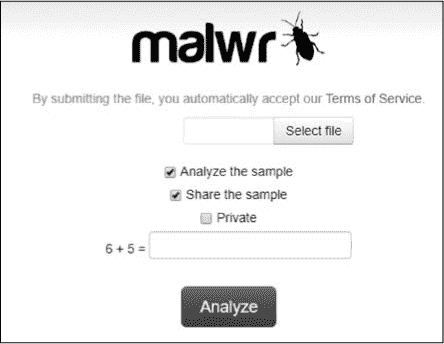
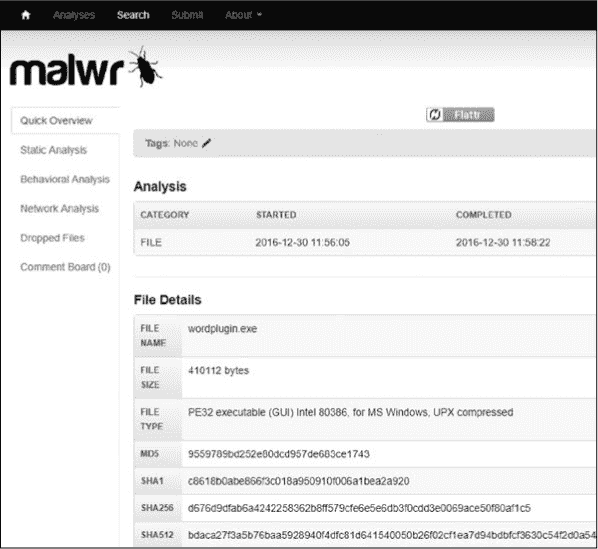
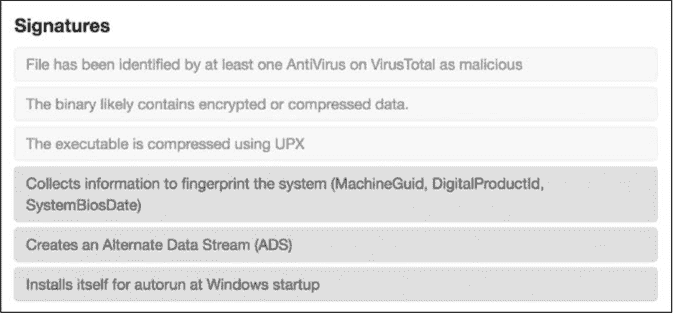
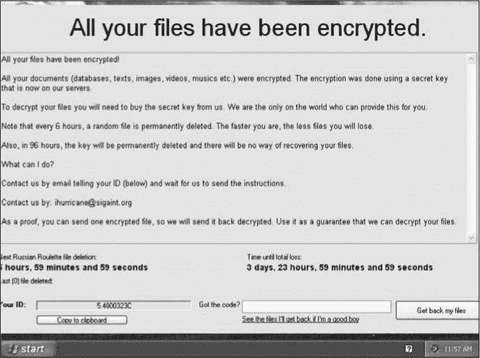
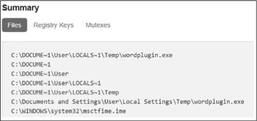
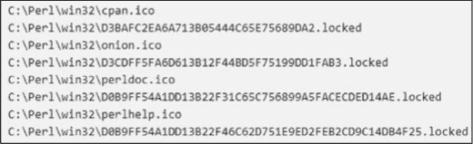
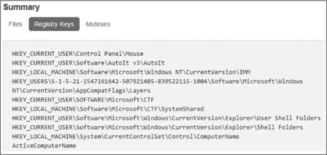
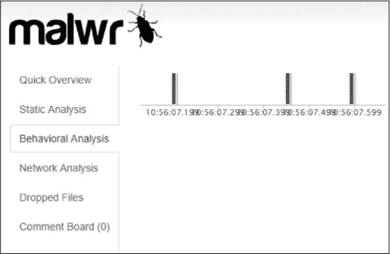

## 3

**动态分析简要介绍**

在第二章中，您学习了高级静态分析技术来反汇编从恶意软件中恢复的汇编代码。虽然静态分析可以通过研究恶意软件在磁盘上的不同组件，作为一种高效的方法获取有用的信息，但它无法让我们观察到恶意软件的行为。

在本章中，您将学习动态恶意软件分析的基本知识。与静态分析不同，静态分析侧重于恶意软件在文件形式下的表现，动态分析则包括在一个安全、受限的环境中运行恶意软件，以观察它的行为。这就像是将一种危险的细菌菌株引入一个封闭的环境，以观察它对其他细胞的影响。

通过动态分析，我们可以绕过常见的静态分析障碍，如打包和混淆，并获得更直接的关于某个恶意软件样本目的的洞察。我们从探索基本的动态分析技术、它们与恶意软件数据科学的关联以及它们的应用开始。我们使用开源工具，如*[malwr.com](http://malwr.com)*，来研究动态分析的实际应用示例。请注意，这只是对该主题的简要概述，并不打算全面涵盖。要了解更完整的介绍，请参考《实践恶意软件分析》（No Starch Press，2012）。

### 为什么使用动态分析？

为了理解动态分析为何重要，让我们考虑打包恶意软件的问题。回想一下，打包恶意软件是指压缩或混淆恶意软件的 x86 汇编代码，以隐藏程序的恶意性质。打包的恶意软件样本在感染目标机器时会自行解包，以便代码得以执行。

我们可以尝试使用第二章中讨论的静态分析工具来反汇编一个打包或混淆的恶意软件样本，但这是一个繁琐的过程。例如，在静态分析中，我们首先需要找到恶意软件文件中混淆代码的位置。然后，我们还需要找到解混淆子程序的位置，这些子程序能够解开这些混淆的代码，以便它可以运行。找到子程序后，我们还需要弄清楚这个解混淆过程是如何工作的，从而能在代码上执行它。只有这样，我们才能开始实际的恶意代码逆向工程过程。

这个过程的一个简单而巧妙的替代方法是将恶意软件执行在一个安全、受限的环境中，称为*沙箱*。在沙箱中运行恶意软件可以让它像感染真实目标一样自行解包。通过简单地运行恶意软件，我们可以了解特定恶意软件二进制文件连接到哪些服务器，改变了哪些系统配置参数，以及它尝试执行哪些设备 I/O（输入/输出）操作。

### 恶意软件数据科学中的动态分析

动态分析不仅对恶意软件逆向工程有用，还对恶意软件数据科学有帮助。因为动态分析揭示了恶意软件样本的*行为*，我们可以将它的操作与其他恶意软件样本的操作进行比较。例如，动态分析显示了恶意软件样本写入磁盘的文件，我们可以利用这些数据，将写入相似文件名的恶意软件样本连接起来。这些线索帮助我们根据共同特征对恶意软件样本进行分类，甚至帮助我们识别出同一组或属于同一活动的恶意软件样本。

最重要的是，动态分析对于构建基于机器学习的恶意软件检测器非常有用。我们可以通过观察恶意软件和良性文件在动态分析中的行为来训练检测器，区分恶意和良性二进制文件。例如，在观察了成千上万的动态分析日志后，机器学习系统可以学习到，当*msword.exe*启动一个名为*powershell.exe*的进程时，这个操作是恶意的，而当*msword.exe*启动 Internet Explorer 时，这通常是无害的。第八章将更详细地讨论如何使用基于静态和动态分析的数据来构建恶意软件检测器。在创建复杂的恶意软件检测器之前，我们先来看看一些用于动态分析的基本工具。

### 动态分析的基本工具

你可以在线找到一些免费的开源动态分析工具。本节重点介绍* [malwr.com](http://malwr.com) * 和 CuckooBox。* [malwr.com](http://malwr.com) * 网站提供一个网络界面，可以免费提交二进制文件进行动态分析。CuckooBox 是一个软件平台，允许你设置自己的动态分析环境，从而在本地分析二进制文件。CuckooBox 平台的创建者也运营着* [malwr.com](http://malwr.com) *，而且* [malwr.com](http://malwr.com) * 在后台运行 CuckooBox。因此，学习如何分析* [malwr.com](http://malwr.com) * 的结果将帮助你理解 CuckooBox 的结果。

**注意**

*在印刷时，* [malwr.com](http://malwr.com)’*的 CuckooBox 界面正在进行维护。希望等你阅读本节时，网站会恢复。如果没有，章中提供的信息可以应用于你自己 CuckooBox 实例的输出，按照* [`cuckoosandbox.org/`](https://cuckoosandbox.org/) 上的说明设置即可。*

#### *典型的恶意软件行为*

以下是恶意软件样本执行时可能采取的主要操作类别：

**修改文件系统** 例如，写入设备驱动程序到磁盘，修改系统配置文件，向文件系统添加新程序，以及修改注册表键值以确保程序自动启动

**修改 Windows 注册表以更改系统配置** 例如，修改防火墙设置

**加载设备驱动程序** 例如，加载一个记录用户按键的设备驱动程序

**网络操作** 例如，解析域名和发起 HTTP 请求

我们将通过一个恶意软件样本并分析其在* [malwr.com](http://malwr.com) *上的报告，进一步详细检查这些行为。

#### *在[malwr.com](http://malwr.com)上加载文件*

要在* [malwr.com](http://malwr.com) *上运行一个恶意软件样本，首先访问* [`malwr.com/`](https://malwr.com/) *，然后点击**提交**按钮上传并提交二进制文件进行分析。我们将使用一个 SHA256 哈希以*d676d95*开头的二进制文件，你可以在本章附带的数据目录中找到。我鼓励你将这个二进制文件提交到* [malwr.com](http://malwr.com) *并在我们继续时自己查看结果。提交页面如图 3-1 所示。

*图 3-1：恶意软件样本提交页面*

提交样本后，网站应该提示你等待分析完成，这通常需要大约五分钟。当结果加载完成后，你可以查看它们，了解可执行文件在动态分析环境中运行时所做的操作。

#### *在[malwr.com](http://malwr.com)上分析结果*

我们的样本的结果页面应该类似于图 3-2。

*图 3-2：恶意软件样本结果页面顶部* [malwr.com](http://malwr.com)

这个文件的结果展示了动态分析的一些关键方面，我们接下来将深入探讨。

##### 签名面板

你将在结果页面上看到的前两个面板是分析和文件详情。这些面板包含文件运行的时间和文件的其他静态信息。我将在这里关注的是签名面板，如图 3-3 所示。这个面板包含了从文件本身以及它在动态分析环境中运行时的行为中提取的高级信息。接下来让我们讨论这些签名的含义。

*图 3-3：* [malwr.com](http://malwr.com) *与我们的恶意软件样本行为匹配的签名*

图中显示的前三个签名来自静态分析（即这些结果来自恶意软件文件本身的属性，而不是其行为）。第一条签名告诉我们，流行的病毒扫描引擎聚合器*[VirusTotal.com](http://VirusTotal.com)*上有多个杀毒引擎将此文件标记为恶意软件。第二条表明该二进制文件包含压缩或加密的数据，这是混淆的一种常见迹象。第三条告诉我们，该二进制文件是使用流行的 UPX 压缩工具打包的。尽管这些静态指示符本身并未告诉我们文件的具体行为，但它们确实告诉我们该文件可能是恶意的。（请注意，颜色并不代表静态与动态类别的对应关系；相反，它代表了每条规则的严重性，红色——这里较深的灰色——比黄色更可疑。）

接下来的三条签名是通过动态分析文件得到的。第一条签名表明该程序尝试识别系统的硬件和操作系统。第二条表明该程序利用了 Windows 的一个恶意特性——*备用数据流（ADS）*，它允许恶意软件在磁盘上隐藏数据，从而在使用标准文件系统浏览工具时不可见。第三条签名表明该文件修改了 Windows 注册表，使得系统重启时，会自动执行它指定的程序。这会在用户每次重启系统时重启恶意软件。

如你所见，即使在这些自动触发的签名层级上，动态分析也大大增加了我们对文件预期行为的了解。

##### 截图面板

在签名面板下方是截图面板。该面板显示了恶意软件运行时动态分析环境桌面的截图。图 3-4 展示了这个界面的一个示例。

*图 3-4：我们恶意软件样本的动态行为屏幕截图*

你可以看到，我们正在处理的恶意软件是*勒索软件*，它是一种加密目标文件并强迫受害者支付赎金才能恢复数据的恶意软件。通过简单地运行我们的恶意软件，我们就能揭示其目的，而无需进行逆向工程。

##### 修改后的系统对象面板

截图下方有一排标题，展示了恶意软件样本的网络活动。我们的二进制文件没有进行任何网络通信，但如果它进行了通信，我们会在这里看到它联系的主机。图 3-5 展示了摘要面板。

*图 3-5：摘要面板的文件选项卡，展示了我们的恶意软件样本修改了哪些文件*

这显示了恶意软件修改了哪些系统对象，如文件、注册表项和互斥体。

查看图 3-6 中的文件选项卡，可以清楚地看到该勒索软件恶意软件确实加密了磁盘上的用户文件。

*图 3-6：总结面板中的文件路径选项卡，提示我们的样本是勒索软件*

每个文件路径后面跟着一个扩展名为*.locked*的文件，我们可以推测这是替换掉的文件的加密版本。

接下来，我们将查看图 3-7 所示的注册表键选项卡。

*图 3-7：总结面板中的注册表键选项卡，展示了我们的恶意软件样本修改了哪些注册表键*

注册表是 Windows 用于存储配置信息的数据库。配置参数以注册表键的形式存储，这些键有相关的值。类似于 Windows 文件系统中的文件路径，注册表键由反斜杠分隔。*[Malwr.com](http://Malwr.com)*展示了我们的恶意软件修改了哪些注册表键。虽然图 3-7 中未显示这一点，但如果你查看* [malwr.com](http://malwr.com) *上的完整报告，你应该会看到我们的恶意软件修改的一个显著注册表键是`HKEY_LOCAL_MACHINE\SOFTWARE\Microsoft\Windows\CurrentVersion\Run`，这是一个告诉 Windows 在每次用户登录时运行程序的注册表键。很可能我们的恶意软件修改了这个注册表键，指示 Windows 每次系统启动时都重启恶意软件，从而确保恶意软件感染在每次重启后持续存在。

*[malwr.com](http://malwr.com)*报告中的互斥体选项卡包含恶意软件创建的互斥体的名称，如图 3-8 所示。

*图 3-8：总结面板中的互斥体选项卡，展示了我们的恶意软件样本创建了哪些互斥体*

互斥体是锁文件，表示程序已占用某些资源。恶意软件通常使用互斥体来防止自己在系统中重复感染。事实证明，至少有一个互斥体（*CTF.TimListCache.FMPDefaultS-1-5-21-1547161642-507921405-839522115-1004MUTEX.DefaultS-1-5-21-1547161642-507921405-839522115-1004 ShimCacheMutex*）被安全社区认为与恶意软件相关，可能在此处执行该功能。

##### API 调用分析

点击* [malwr.com](http://malwr.com) *UI 左侧面板中的行为分析选项卡，如图 3-9 所示，应会显示有关我们的恶意软件二进制文件行为的详细信息。

这展示了每个由恶意软件启动的进程所做的 API 调用，以及它们的参数和返回值。浏览这些信息非常耗时，并且需要对 Windows API 有专业知识。虽然详细讨论恶意软件 API 调用分析超出了本书的范围，但如果你有兴趣了解更多，可以查找各个 API 调用，了解它们的影响。

*图 3-9：我们恶意软件样本的*[malwr.com](http://malwr.com)*报告中的行为分析窗格，显示了动态执行过程中何时进行 API 调用*

尽管 *[malwr.com](http://malwr.com)* 是一个出色的资源，可以用于动态分析单个恶意软件样本，但它并不适合对大量样本进行动态分析。在动态环境中执行大量样本对机器学习和数据分析至关重要，因为它能够识别恶意软件样本动态执行模式之间的关系。创建能够基于恶意软件动态执行模式检测恶意软件实例的机器学习系统需要运行数千个恶意软件样本。

除了这一局限性，*[malwr.com](http://malwr.com)* 还不提供像 XML 或 JSON 这样的机器可解析格式的恶意软件分析结果。为了解决这些问题，你必须设置并运行自己的 CuckooBox。幸运的是，CuckooBox 是免费的开源软件，并且提供了逐步的设置指南，可以帮助你搭建属于自己的动态分析环境。我鼓励你通过访问 *[`cuckoosandbox.org/`](http://cuckoosandbox.org/)* 来进行设置。现在，既然你了解了如何解读来自 *[malwr.com](http://malwr.com)* 的动态恶意软件结果（该网站在后台使用 CuckooBox），你也将知道如何分析 CuckooBox 的结果，一旦你成功搭建并运行了 CuckooBox。

### 基础动态分析的局限性

动态分析是一个强大的工具，但它并不是恶意软件分析的万能药。事实上，它有着严重的局限性。一个局限性是恶意软件作者知道 CuckooBox 和其他动态分析框架，并试图通过让恶意软件在检测到运行在 CuckooBox 中时无法执行来规避它们。CuckooBox 的维护者知道恶意软件作者会尝试这样做，所以他们会尽力应对恶意软件绕过 CuckooBox 的尝试。这种猫鼠游戏持续进行，以至于某些恶意软件样本不可避免地会检测到它们正在动态分析环境中运行，并在我们尝试运行它们时无法执行。

另一个局限性是，即使没有任何规避尝试，动态分析也可能无法揭示重要的恶意软件行为。考虑一个恶意软件二进制文件的情况，该文件在执行时会连接到远程服务器，并等待命令发布。这些命令可能会告诉恶意软件样本在受害主机上查找某些类型的文件、记录按键或打开摄像头。在这种情况下，如果远程服务器没有发送任何命令，或者已经无法连接，则这些恶意行为将不会被揭示。由于这些局限性，动态分析并不是解决所有问题的万能方法。事实上，专业的恶意软件分析师结合动态和静态分析，以获得最佳的分析结果。

### 总结

在本章中，你通过*【malwr.com】(http://malwr.com)* 对勒索软件恶意样本进行了动态分析以分析结果。你还了解了动态分析的优缺点。现在，你已经掌握了基本的动态分析方法，准备深入学习恶意软件数据科学了。

本书的其余部分将专注于对基于静态分析的恶意软件数据进行恶意软件数据科学分析。我将重点介绍静态分析，因为它相较于动态分析更简单，并且更容易获得好的结果，这使得它成为开始进行恶意软件数据科学的良好起点。然而，在每一章中，我也会解释如何将数据科学方法应用于基于动态分析的数据。
