## **使用恶意软件网络识别攻击活动**


*恶意软件网络分析*可以将恶意软件数据集转化为有价值的威胁情报，揭示对抗性攻击活动、常见的恶意软件战术以及恶意软件样本的来源。此方法包括分析一组恶意软件样本如何通过其共享属性相互连接，无论这些属性是嵌入的 IP 地址、主机名、可打印字符字符串、图像还是类似的内容。

例如，图 4-1 展示了恶意软件网络分析的威力，这是通过本章将要介绍的技术在几秒钟内生成的图表示例。

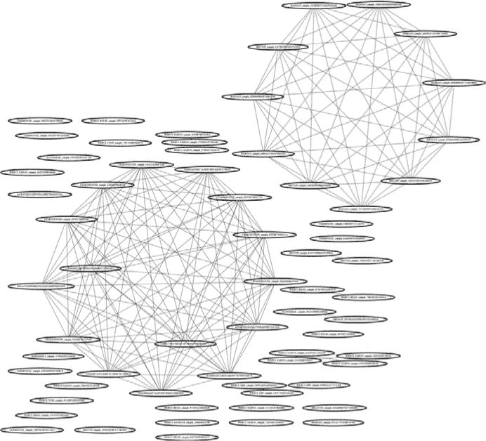

*图 4-1：通过共享属性分析揭示的国家级恶意软件的社交网络连接*

图中展示了一组国家级恶意软件样本（以椭圆形节点表示）及其“社交”关联（连接节点的线）。这些连接基于恶意软件样本“回连”到相同的主机名和 IP 地址，表明它们是由同一攻击者部署的。正如本章将要介绍的，你可以利用这些连接来帮助区分是针对你组织的协调攻击，还是来自多个犯罪动机攻击者的分散攻击。

到本章结束时，你将学到：

+   网络分析理论的基础，及其在从恶意软件中提取威胁情报方面的应用

+   如何利用可视化技术识别恶意软件样本之间的关系

+   如何使用 Python 和各种开源数据分析与可视化工具包来创建、可视化和提取恶意软件网络中的情报

+   如何将所有这些知识结合起来，以揭示和分析现实世界恶意软件数据集中的攻击活动

### 节点和边

在对恶意软件进行共享属性分析之前，你需要理解一些关于网络的基础知识。*网络*是由相互连接的对象（称为*节点*）组成的集合。这些节点之间的连接被称为*边*。作为抽象的数学对象，网络中的节点可以代表几乎任何东西，它们的边也是如此。对于我们的目的来说，我们关心的是这些节点和边之间连接的结构，因为这可以揭示关于恶意软件的重要细节。

在使用网络分析恶意软件时，我们可以将每个独立的恶意软件文件视为一个节点的定义，将感兴趣的关系（例如共享代码或网络行为）视为边的定义。类似的恶意软件文件共享边，因此当我们应用力导向网络时，它们会聚集在一起（你将很快看到这一点是如何运作的）。或者，我们可以将恶意软件样本和属性都视为独立的节点。例如，回调 IP 地址也有节点，恶意软件样本同样有节点。每当恶意软件样本回调到某个特定的 IP 地址时，它们就会与该 IP 地址节点连接。

恶意软件的网络可能比仅仅是节点和边的集合更复杂。具体来说，它们可以在节点或边上附加*属性*，例如两个连接样本共享的代码百分比。一个常见的边属性是*权重*，较大的权重表示样本之间的连接更强。节点可能有自己的属性，比如它们代表的恶意软件样本的文件大小，但这些通常仅被称为属性。

### 二分网络

*二分网络*是指其节点可以分为两个分区（组），且两个分区内没有内部连接的网络。这种类型的网络可用于显示恶意软件样本之间共享的属性。

图 4-2 展示了一个二分网络的示例，其中恶意软件样本节点位于底部分区，样本“回调”的域名（用于与攻击者通信）位于另一个分区。请注意，回调节点从不直接连接到其他回调节点，恶意软件样本也从不直接连接到其他恶意软件样本，这是二分网络的特征。

如你所见，即使是如此简单的可视化也揭示了一个重要的信息：基于恶意软件样本共享的回调服务器，我们可以猜测*sample_014*可能是与*sample_37D*由同一攻击者部署的。我们还可以猜测*sample_37D*和*sample_F7F*可能是由同一攻击者部署的，*sample_014*和*sample_F7F*也可能是由同一攻击者部署的，因为它们通过*sample_37D*连接（事实上，图 4-2 中的所有样本都来自同一个“APT1”中国攻击者组）。

**注意**

*我们要感谢 Mandiant 和 Mila Parkour 整理了 APT1 样本，并将其提供给研究社区。*

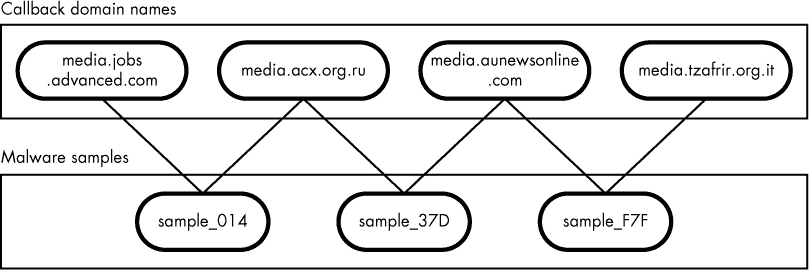

*图 4-2：一个二分网络。顶部的节点（属性分区）是回调域名。底部的节点（恶意软件分区）是恶意软件样本。*

随着网络中节点和连接的数量急剧增大，我们可能希望查看恶意软件样本之间的关系，而不必仔细检查所有属性连接。我们可以通过创建一个二分网络*投影*来检查恶意软件样本的相似性，这是一种简化版本的二分网络，其中如果网络一方的节点与另一方（*属性*）有共同的节点，它们就会相互连接。例如，在图 4-1 所示的恶意软件样本中，我们将创建一个网络，其中恶意软件样本如果共享回调域名就会被连接。

图 4-3 展示了先前提到的整个中国 APT1 数据集的共享回调服务器投影网络。

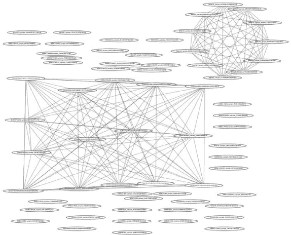

*图 4-3：APT1 数据集的恶意软件样本投影，仅在恶意软件样本共享至少一个服务器时显示它们之间的连接。两个大群集用于两次不同的攻击活动。*

这里的节点是恶意软件样本，它们之间存在链接，如果它们共享至少一个回调服务器。通过仅在恶意软件样本共享回调服务器时显示它们之间的连接，我们可以开始看到这些恶意软件样本的整体“社交网络”。正如在图 4-3 中所看到的，存在两个大的群体（位于左中心区域的大方形群集和位于右上角的圆形群集），进一步检查后发现，它们分别对应 APT1 小组 10 年历史中的两个不同攻击活动。

### 恶意软件网络的可视化

在使用网络进行恶意软件共享属性分析时，你会发现你很大程度上依赖于网络可视化软件来创建像目前所展示的这些网络。本节介绍了如何从算法的角度创建这些网络可视化。

关键是，进行网络可视化时的主要挑战是*网络布局*，即决定在二维或三维坐标空间中渲染每个节点的位置，具体取决于你希望你的可视化是二维的还是三维的。当你在网络中放置节点时，理想的方式是将它们放置在坐标空间中，使得它们之间的视觉距离与它们在网络中之间的最短路径距离成比例。换句话说，相隔两跳的节点可能相隔约两英寸，而相隔三跳的节点可能相隔约三英寸。这样做使得我们能够准确地根据节点的实际关系来可视化相似节点的群集。然而，正如你将在下一节中看到的那样，这往往是很难实现的，特别是当你处理的节点超过三个时。

#### *扭曲问题*

事实证明，通常不可能完美解决这个网络布局问题。图 4-4 说明了这一困难。

如你所见，在这些简单的网络中，所有节点都通过相等权重为 1 的边连接到其他所有节点。对于这些连接，理想的布局是将所有节点均匀分布在页面上。但是，正如你所看到的，当我们创建四个或五个节点的网络时，如图 (c) 和 (d) 所示，由于边缘长度不等，我们开始引入更多的失真。不幸的是，我们只能最小化，而不能消除这种失真，而这种最小化成为网络可视化算法的主要目标之一。

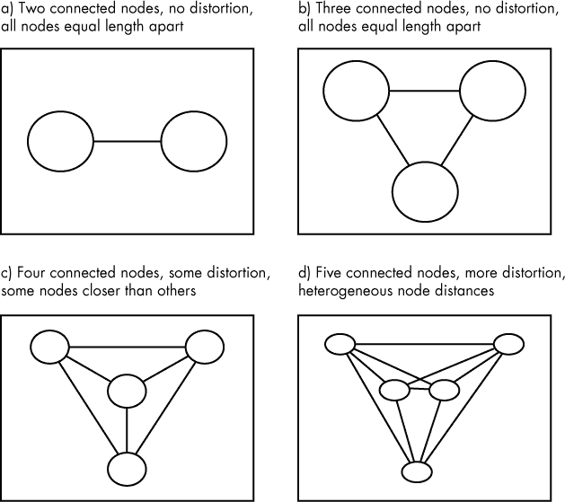

*图 4-4：在现实世界的恶意软件网络中，完美的网络布局通常是不可行的。像 (a) 和 (b) 这样的简单情况允许我们将所有节点均匀分布。然而，(c) 引入了失真（边缘不再是等长的），而 (d) 则显示了更多的失真。*

#### *力导向算法*

为了尽量减少布局失真，计算机科学家通常使用 *力导向* 布局算法。力导向算法基于物理模拟的弹簧力和磁力。将网络的边缘模拟为物理弹簧，通常能得到较好的节点位置，因为模拟的弹簧通过推拉作用，试图使节点和边缘之间的长度均匀。为了更好地理解这一概念，考虑弹簧的工作原理：当你压缩或拉伸弹簧时，它会“试图”恢复到其平衡长度。这些特性与我们希望网络中所有边缘长度相等的目标非常吻合。力导向算法是我们在本章重点讨论的内容。

### 使用 NetworkX 构建网络

现在你已经对恶意软件网络有了基本了解，准备好学习如何使用开源的 NetworkX Python 网络分析库和 GraphViz 开源网络可视化工具包来创建恶意软件关系网络。我将向你展示如何通过编程提取与恶意软件相关的数据，然后使用这些数据构建、可视化并分析网络，以表示恶意软件数据集。

让我们从 NetworkX 开始，它是一个开源项目，由位于洛斯阿拉莫斯国家实验室的团队维护，并且是 Python 的事实上的网络处理库（回想一下，你可以通过进入本章的代码和数据目录并运行 `pip install -r requirements.txt` 来安装本章中的库依赖项，包括 NetworkX）。如果你了解 Python，应该会觉得 NetworkX 出奇的容易。使用 清单 4-1 中的代码来导入 NetworkX 并实例化一个网络。

```
#!/usr/bin/python
import networkx

# instantiate a network with no nodes and no edges.
network = networkx.Graph()
```

*清单 4-1：实例化网络*

这段代码只需要调用一次 NetworkX 中的 `Graph` 构造函数，就能在 NetworkX 中创建一个网络。

**注意**

*NetworkX 库有时使用* graph *这个术语来代替* network *，因为这两个术语在计算机科学中是同义的——它们都表示一组通过边连接的节点。*

### 添加节点和边

现在我们已经实例化了一个网络，接下来让我们添加一些节点。NetworkX 中的节点可以是任何 Python 对象。在这里，我展示了如何向我们的网络添加不同类型的节点：

```
nodes = ["hello","world",1,2,3]
for node in nodes:
    network.add_node(node)
```

如图所示，我们已经向网络中添加了五个节点：`"hello"`、`"world"`、`1`、`2`和`3`。

然后，要添加边，我们调用`add_edge()`，如下所示：

```
➊ network.add_edge("hello","world")
   network.add_edge(1,2)
   network.add_edge(1,3)
```

在这里，我们通过边连接了这五个节点中的一些。例如，第一行代码➊通过在它们之间创建一条边，将`"hello"`节点和`"world"`节点连接在一起。

#### *添加属性*

NetworkX 允许我们轻松地为节点和边附加属性。要将属性附加到节点（并在以后访问该属性），你可以在将节点添加到网络时，通过关键字参数添加属性，如下所示：

```
network.add_node(1,myattribute="foo")
```

要稍后添加属性，可以使用以下语法访问网络的`node`字典：

```
network.node[1]["myattribute"] = "foo"
```

然后，要访问节点，可以访问`node`字典：

```
print network.node[1]["myattribute"] # prints "foo"
```

与节点一样，你可以在初始添加边时，通过关键字参数向边添加属性，如下所示：

```
network.add_edge("node1","node2",myattribute="attribute of an edge")
```

类似地，你可以通过使用`edge`字典，向已添加到网络中的边添加属性，如下所示：

```
network.edge["node1"]["node2"]["myattribute"] = "attribute of an edge"
```

`edge`字典非常神奇，它允许你反向访问节点属性，无需担心首先引用哪个节点，如在列表 4-2 中所示。

```
➊ network.edge["node1"]["node2"]["myattribute"] = 321
➋ print network.edge["node2"]["node1"]["myattribute"]  # prints 321
```

*列表 4-2：使用* edge *字典反向访问节点属性，不管顺序如何*

如你所见，第一行在连接`node1`和`node2`的边上设置了`myattribute`➊，第二行则访问了`myattribute`，尽管`node1`和`node2`的引用顺序被调换了➋。

#### *将网络保存到磁盘*

为了可视化我们的网络，我们需要将它们以.*dot*格式从 NetworkX 保存到磁盘——这是网络分析领域常用的一种格式，可以导入到许多网络可视化工具包中。要将网络保存为.*dot*格式，只需调用 NetworkX 的`write_dot()`函数，如在列表 4-3 中所示。

```
#!/usr/bin/python
import networkx
from networkx.drawing.nx_agraph import write_dot

# instantiate a network, add some nodes, and connect them
nodes = ["hello","world",1,2,3]
network = networkx.Graph()
for node in nodes:
    network.add_node(node)
network.add_edge("hello","world")
write_dot(➊network,➋"network.dot")
```

*列表 4-3：使用* write_dot() *将网络保存到磁盘*

如你所见，在代码的最后，我们使用`write_dot()`函数指定了我们要保存的网络➊，以及我们希望保存的路径或文件名➋。

### 网络可视化与 GraphViz

一旦我们使用 `write_dot()` NetworkX 函数将网络写入磁盘，我们就可以使用 GraphViz 可视化生成的文件。GraphViz 是目前可用的最佳命令行网络可视化工具。它由 AT&T 的研究人员支持，并且已经成为数据分析师网络分析工具箱中的标准部分。它包含一组命令行网络布局工具，既可以用于布局，也可以用于渲染网络。GraphViz 已预装在本书提供的虚拟机中，也可以在 *[`graphviz.gitlab.io/download/`](https://graphviz.gitlab.io/download/)* 上下载。每个 GraphViz 命令行工具都以 *.dot* 格式读取网络，并可以使用以下语法调用来将网络渲染为 *.png* 文件：

```
$ <toolname> <dotfile> -T png –o <outputfile.png>
```

`fdp` 是一个 GraphViz 网络可视化工具，采用与其他所有 GraphViz 工具相同的基本命令行界面，如下所示：

```
$ fdp apt1callback.dot –T png –o apt1callback.png
```

在这里，我们指定要使用 `fdp` 工具，并命名我们想要布局的网络 *.dot* 文件，该文件是 *apt1callback.dot*，位于本书附带数据的 *~/ch3/* 目录中。我们指定 `–T png` 来表示我们希望使用的格式（PNG）。最后，我们通过 `-o` `apt1callback.png` 指定输出文件的保存位置。

#### *使用参数调整网络绘制*

GraphViz 工具包括许多参数，可以用来调整网络绘制的方式。许多这些参数是通过 `–G` 命令行标志设置的，格式如下：

```
G<parametername>=<parametervalue>
```

有两个特别有用的参数是 `overlap` 和 `splines`。将 `overlap` 设置为 `false`，告诉 GraphViz 不允许任何节点相互重叠。使用 `splines` 参数告诉 GraphViz 绘制曲线而非直线，以便更容易地跟踪网络上的边。以下是一些设置 `overlap` 和 `splines` 参数的 GraphViz 示例。

使用以下命令来防止节点重叠：

```
$ <toolname> <dotfile> -Goverlap=false -T png -o <outputfile.png>
```

将边绘制为曲线（样条线），以提高网络的可读性：

```
$ <toolname> <dotfile> -Gsplines=true -T png -o <outputfile.png>
```

将边绘制为曲线（样条线），以提高网络的可读性，并且不允许节点在视觉上重叠：

```
$ <toolname> <dotfile> -Gsplines=true –Goverlap=false -T png -o <outputfile.png>
```

注意，我们只是将一个参数接一个参数列出： -Gsplines=true –Goverlap=false（参数顺序无关），然后是 -T png -o <outputfile.png>。

在下一部分，我将介绍一些最有用的 GraphViz 工具（除了 `fdp` 之外）。

#### *GraphViz 命令行工具*

这是我发现最有用的 GraphViz 工具的一些介绍，以及在何时使用每个工具的一些建议。

##### fdp

在之前的例子中，我们使用了`fdp`布局工具，它帮助我们创建了力导向布局，正如在第 40 页的“力导向算法”中所描述的。当你创建节点少于 500 个的恶意软件网络时，`fdp`能够在合理的时间内很好地揭示网络结构。但当节点数量超过 500 个，尤其是节点间的连接复杂时，你会发现`fdp`的速度会迅速变慢。

要在图 4-3 中显示的 APT1 共享回调服务器网络上尝试`fdp`，请在本书随附数据的*ch4*目录中输入以下命令（你必须安装 GraphViz）：

```
$ fdp callback_servers_malware_projection.dot -T png -o fdp_servers.png –Goverlap=false
```

此命令将创建一个*.png*文件（fdp_servers.png），显示类似于图 4-5 中的网络。

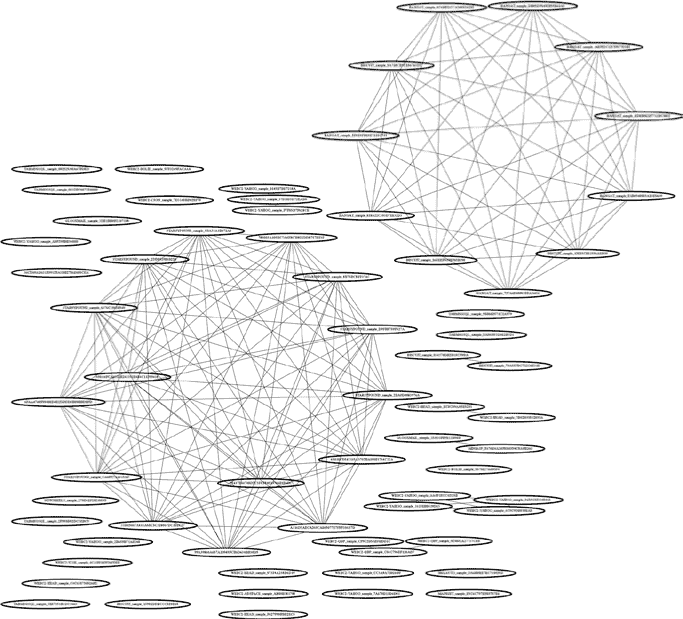

*图 4-5：使用* fdp *工具绘制的 APT1 样本布局*

`fdp`布局使得图中显现出许多主题。首先，两个大样本集群之间高度关联，这在图的右上角和左下角清晰可见。其次，一些样本对是相关的，这可以在右下角看到。最后，许多样本之间没有明显的关系，也没有与其他节点连接。需要记住的是，这一可视化是基于节点之间共享回调服务器的关系。未连接的样本可能通过其他类型的关系（如共享代码关系）与图中的其他样本相关联——这种关系我们将在第五章中探讨。

##### sfdp

`sfdp`工具使用与`fdp`类似的布局方法，但它具有更好的扩展性，因为它创建了一个简化层次结构，称为*粗化*，其中节点根据其邻近度合并成*超级节点*。在完成粗化后，`sfdp`工具会对合并后的图形进行布局，这些图形包含的节点和边要少得多，这大大加速了布局过程。通过这种方式，`sfdp`能够进行更少的计算来找到网络中的最佳位置。因此，`sfdp`能够在典型的笔记本电脑上布局成千上万个节点，成为布置非常大规模恶意软件网络的最佳算法。

然而，这种可扩展性是有代价的：`sfdp`生成的布局有时不如在`fdp`中相同大小网络的布局清晰。例如，比较我使用`sfdp`创建的图 4-6 与使用`fdp`创建的网络，后者显示在图 4-5 中。

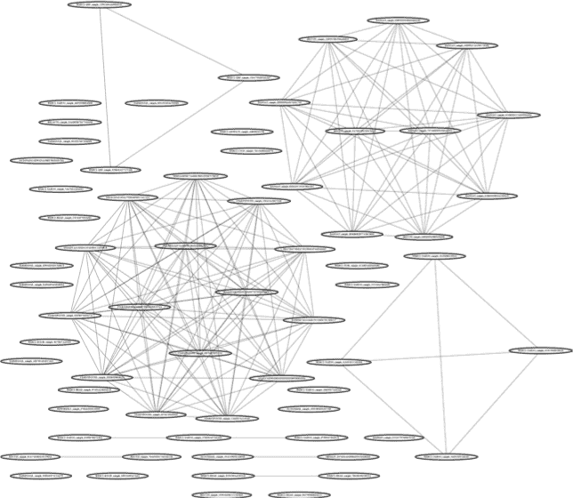

*图 4-6：使用* sfdp *命令绘制的 APT1 样本共享回调服务器网络布局*

如你所见，图 4-6 中每个集群上方略微有更多噪声，这使得观察网络情况变得稍微困难。

为了创建这个网络，进入本书附带数据的*ch4*目录，然后输入以下代码生成图 4-6 所示的*sfdp_servers.png*图像文件：

```
$ sfdp callback_servers_malware_projection.dot -T png -o sfdp_servers.png –Goverlap=false
```

注意，代码中的第一个项指定了我们使用的是工具`sfdp`，而不是之前的`fdp`。其他部分相同，唯一不同的是输出文件名。

##### neato

`neato`工具是 GraphViz 实现的另一种基于力导向网络布局算法，它在所有节点（包括未连接的节点）之间创建模拟弹簧，帮助将各个元素推到理想的位置，但代价是增加了计算量。很难知道`neato`何时能为给定的网络生成最佳布局：我的建议是，你可以尝试它，并与`fdp`一起使用，看看哪个布局你更喜欢。图 4-7 展示了`neato`布局在 APT1 共享回调服务器网络中的效果。

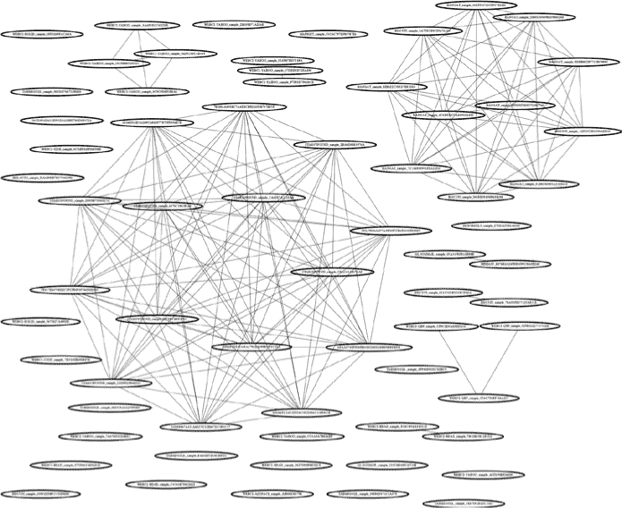

*图 4-7：使用 neato 布局的 APT1 共享回调服务器网络布局*

如你所见，在这种情况下，`neato`生成的网络布局与`fdp`和`sfdp`生成的类似。然而，对于某些数据集，你会发现`neato`生成的布局可能更好或更差——你只需要在你的数据集上尝试一下，看看效果如何。要尝试`neato`，请从本书附带数据的*ch4*目录中输入以下内容；这将生成图 4-7 所示的*neato_servers.png*网络图像文件：

```
$ neato callback_servers_malware_projection.dot -T png -o neato_servers.png –Goverlap=false
```

为了创建这个网络，我们只需要修改之前用来创建图 4-6 的代码，指定我们要使用工具`neato`，然后将输出保存为*.png*格式的*neato_servers.png*。现在你已经知道如何创建这些网络可视化，接下来我们来看一下如何改进它们。

#### *为节点和边添加视觉属性*

除了决定整体网络布局外，能够指定如何渲染各个节点和边也非常有用。例如，你可能希望根据两个节点之间连接的强度来设置边的粗细，或者根据每个恶意软件样本节点关联的妥协设置节点的颜色，这样可以更好地可视化恶意软件的聚类。NetworkX 和 GraphViz 使得这一切变得简单，只需为节点和边分配属性值即可。我在接下来的章节中仅讨论一些这样的属性，但这个话题足够深奥，可以写成一本完整的书。

##### 边宽

若要设置 GraphViz 绘制的节点边框宽度，或绘制边时的线条宽度，可以将节点和边的`penwidth`属性设置为你选择的数字，如清单 4-4 所示。

```
   #!/usr/bin/python
   import networkx
   from networkx.drawing.nx_agraph import writedot

➊ g = networkx.Graph()
   g.add_node(1)
   g.add_node(2)
   g.add_edge(1,2,➋penwidth=10) # make the edge extra wide
   write_dot(g,'network.dot')
```

*清单 4-4：设置 penwidth 属性*

在这里，我创建了一个简单的网络 ➊，其中两个节点通过一条边连接，并将边的`penwidth`属性设置为 10 ➋（默认值为 1）。

运行此代码后，你应该看到一个与图 4-8 相似的图像。

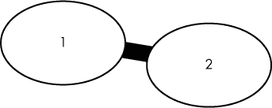

*图 4-8：一个简单的网络，边的* penwidth *为 10*

正如你在图 4-8 中看到的，`penwidth` 为 10 会导致边变得非常粗。边的宽度（或者如果你设置了节点的`penwidth`，则是节点边框的厚度）与`penwidth`属性的值成比例，因此需要根据情况进行选择。例如，如果你的边强度值从 1 到 1000 不等，但你希望能够看到所有的边，可以考虑基于边强度值的对数缩放来为每条边分配`penwidth`属性。

##### 节点与边的颜色

要设置节点边框或边的颜色，使用`color`属性。清单 4-5 展示了如何操作。

```
#!/usr/bin/python

import networkx
from networkx.drawing.nx_agraph import write_dot

g = networkx.Graph()
g.add_node(1,➊color="blue") # make the node outline blue
g.add_node(2,➋color="pink") # make the node outline pink
g.add_edge(1,2,➌color="red") # make the edge red
write_dot(g,'network.dot')
```

*清单 4-5：设置节点和边的颜色*

在这里，我创建了与清单 4-4 中相同的简单网络，其中包含两个节点和一个连接它们的边。对于每个创建的节点，我都设置了其`color`值（➊ 和 ➋）。在创建边时，我还设置了边的`color`值 ➌。

图 4-9 展示了清单 4-5 的结果。如预期所示，你应该看到第一个节点（边）和第二个节点各自具有唯一的颜色。有关你可以使用的颜色的完整列表，请参见*[`www.graphviz.org/doc/info/colors.html`](http://www.graphviz.org/doc/info/colors.html)*。

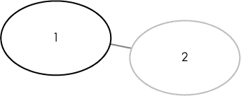

*图 4-9：一个简单的网络，演示了如何设置节点和边的颜色*

颜色可以用来表示不同类别的节点和边。

##### 节点形状

要设置节点的形状，使用`shape`属性并指定一个形状字符串，如在*[`www.GraphViz.org/doc/info/shapes.html`](http://www.GraphViz.org/doc/info/shapes.html)*中定义的那样。常用的值包括`box`、`ellipse`、`circle`、`egg`、`diamond`、`triangle`、`pentagon` 和 `hexagon`。清单 4-6 展示了如何设置节点的`shape`属性。

```
#!/usr/bin/python

import networkx
from networkx.drawing.nx_agraph import write_dot

g = networkx.Graph()
g.add_node(1,➊shape='diamond')
g.add_node(2,➋shape='egg')
g.add_edge(1,2)

write_dot(g,'network.dot')
```

*清单 4-6：设置节点形状*

类似于设置节点颜色的方式，我们仅需在`add_node()`函数中使用`shape`关键字参数来指定我们希望每个节点采用的形状。在这里，我们将第一个节点设置为菱形 ➊，第二个节点设置为蛋形 ➋。此代码的结果如图 4-10 所示。

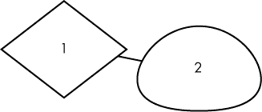

*图 4-10：一个简单的网络，展示了如何设置节点形状*

结果显示了一个菱形节点和一个蛋形节点，反映了我们在清单 4-6 中指定的形状。

##### 文本标签

最后，GraphViz 还允许你使用 `label` 属性为节点和边添加标签。虽然节点会根据其分配的 ID 自动生成标签（例如，作为*123*添加的节点标签为 `123`），你也可以通过 `label=<`my label attribute`>` 来指定标签。与节点不同，边默认不会有标签，但你可以使用 `label` 属性为其指定标签。清单 4-7 显示了如何创建我们现在熟悉的两个节点网络，并为两个节点和连接边都附加了 `label` 属性。

```
#!/usr/bin/python

import networkx
from networkx.drawing.nx_agraph import write_dot

g = networkx.Graph()
g.add_node(1,➊label="first node")
g.add_node(2,➋label="second node")
g.add_edge(1,2,➌label="link between first and second node")

write_dot(g,'network.dot')
```

*清单 4-7：为节点和边添加标签*

我们分别将节点标记为 `first node` ➊ 和 `second node` ➋。我们还将连接它们的边标记为 `link between first and second node` ➌。图 4-11 显示了我们期望的图形输出。

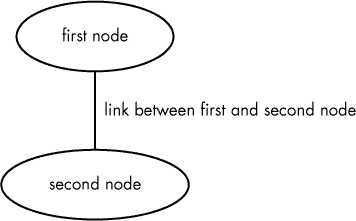

*图 4-11：一个简单的网络，展示了我们如何为节点和边添加标签*

现在你已经知道如何操作节点和边的基本属性，接下来你可以开始从零构建网络了。

### 构建恶意软件网络

我们将通过重现并扩展 图 4-1 中展示的共享回调服务器示例，开始讨论构建恶意软件网络，然后研究共享的恶意软件图像分析。

以下程序从恶意软件文件中提取回调域名，然后构建恶意软件样本的二分网络。接下来，它对网络进行一次投影，显示哪些恶意软件样本共享相同的回调服务器，然后再进行一次投影，显示哪些回调服务器被共同的恶意软件样本调用。最后，程序将三个网络—原始的二分网络、恶意软件样本投影和回调服务器投影—保存为文件，以便用 GraphViz 进行可视化。

我将逐步带你走过这个程序。完整的代码可以在本书附带的文件中找到，路径为 *ch4/callback_server_network.py*。

清单 4-8 显示了如何通过导入所需模块开始。

```
#!/usr/bin/python

import pefile➊
import sys
import argparse
import os
import pprint
import networkx➋
import re
from networkx.drawing.nx_agraph import write_dot
import collections
from networkx.algorithms import bipartite
```

*清单 4-8：导入模块*

我们导入的必需模块中，最引人注目的是 `pefile` PE 解析模块 ➊，我们用它来解析目标 PE 二进制文件，以及 `networkx` 库 ➋，我们用它来创建恶意软件属性网络。

接下来，我们通过添加 清单 4-9 中的代码来解析命令行参数。

```
args = argparse.ArgumentParser("Visualize shared DLL import relationships
between a directory of malware samples")
args.add_argument(➊"target_path",help="directory with malware samples")
args.add_argument(➋"output_file",help="file to write DOT file to")
args.add_argument(➌"malware_projection",help="file to write DOT file to")
args.add_argument(➍"resource_projection",help="file to write DOT file to")
args = args.parse_args()
```

*清单 4-9：解析命令行参数*

这些参数包括 `target_path` ➊（我们正在分析的恶意软件所在目录的路径）、`output_file` ➋（我们写入完整网络的路径）、`malware_projection` ➌（我们写入简化版本图形的路径，并显示哪些恶意软件样本共享属性），以及 `resource_projection` ➍（我们写入简化版本图形的路径，并显示在恶意软件样本中哪些属性是一起出现的）。

现在我们准备进入程序的核心部分。清单 4-10 展示了用于创建程序网络的代码。

```
   #!/usr/bin/python

   import pefile
➊ import sys
   import argparse
   import os
   import pprint
   import networkx
   import re
   from networkx.drawing.nx_agraph import write_dot
   import collections
   from networkx.algorithms import bipartite

   args = argparse.ArgumentParser(
   "Visualize shared hostnames between a directory of malware samples"
   )
   args.add_argument("target_path",help="directory with malware samples")
   args.add_argument("output_file",help="file to write DOT file to")
   args.add_argument("malware_projection",help="file to write DOT file to")
   args.add_argument("hostname_projection",help="file to write DOT file to")
   args = args.parse_args()
   network = networkx.Graph()

   valid_hostname_suffixes = map(
   lambda string: string.strip(), open("domain_suffixes.txt")
   )
   valid_hostname_suffixes = set(valid_hostname_suffixes)
➋ def find_hostnames(string):
      possible_hostnames = re.findall(
      r'(?:a-zA-Z0-9?\.)+[a-zA-Z]{2,6}',
      string)
      valid_hostnames = filter(
              lambda hostname: hostname.split(".")[-1].lower() \
              in valid_hostname_suffixes,
              possible_hostnames
      )
      return valid_hostnames

  # search the target directory for valid Windows PE executable files
  for root,dirs,files in os.walk(args.target_path):
      for path in files:
          # try opening the file with pefile to see if it's really a PE file
          try:
              pe = pefile.PE(os.path.join(root,path))
          except pefile.PEFormatError:
              continue
          fullpath = os.path.join(root,path)
          # extract printable strings from the target sample
        ➌ strings = os.popen("strings '{0}'".format(fullpath)).read()

          # use the search_doc function in the included reg module 
          # to find hostnames
        ➍ hostnames = find_hostnames(strings)
          if len(hostnames):
              # add the nodes and edges for the bipartite network
              network.add_node(path,label=path[:32],color='black',penwidth=5,
              bipartite=0)
          for hostname in hostnames:
            ➎ network.add_node(hostname,label=hostname,color='blue',
                 penwidth=10,bipartite=1)
              network.add_edge(hostname,path,penwidth=2)
          if hostnames:
              print "Extracted hostnames from:",path
              pprint.pprint(hostnames)
```

*清单 4-10：创建网络*

我们首先通过调用`networkx.Graph()`构造函数 ➊ 创建一个新的网络。然后我们定义函数`find_hostnames()`，该函数从字符串中提取主机名 ➋。不要太担心这个函数的细节：它本质上是一个正则表达式和一些字符串过滤代码，尽力识别域名。

接下来，我们遍历目标目录中的所有文件，检查它们是否为 PE 文件，方法是查看`pefile.PE`类是否能加载它们（如果不能，我们就不分析这些文件）。最后，我们通过首先从文件中提取所有可打印的字符串 ➌，然后在这些字符串中搜索嵌入的主机名资源 ➍，来提取当前文件中的主机名属性。如果找到了任何主机名，我们将它们作为节点添加到网络中，然后从当前恶意软件样本的节点添加边到主机名资源节点 ➎。

现在我们准备结束程序，正如清单 4-11 所示。

```
  # write the dot file to disk
➊ write_dot(network, args.output_file)
➋ malware = set(n for n,d in network.nodes(data=True) if d['bipartite']==0)
➌ hostname = set(network)-malware

  # use NetworkX's bipartite network projection function to produce the malware
  # and hostname projections
➍ malware_network = bipartite.projected_graph(network, malware)
  hostname_network = bipartite.projected_graph(network, hostname)

  # write the projected networks to disk as specified by the user
➎ write_dot(malware_network,args.malware_projection)
  write_dot(hostname_network,args.hostname_projection)
```

*清单 4-11：将网络写入文件*

我们从将网络写入磁盘开始，写入的位置由命令行参数指定 ➊。接着，我们创建两个简化的网络（即本章前面提到的“投影”），分别展示恶意软件关系和主机名资源关系。首先，我们创建一个 Python 集合来包含恶意软件节点的 ID ➋，然后创建另一个 Python 集合来包含资源节点的 ID ➌。接下来，我们使用 NetworkX 特定的`projected_graph()`函数 ➍，获取恶意软件和资源集合的投影，并将这些网络写入指定的位置 ➎。

就这样！你可以在本书中的任何恶意软件数据集上运行此程序，查看嵌入文件中的共享主机名资源之间的恶意软件关系。你甚至可以在自己的数据集上使用它，看看通过这种分析方式能够获得哪些威胁情报。

### 构建共享图像关系网络

除了根据共享回调服务器分析恶意软件，我们还可以根据它们使用共享图标和其他图形资产进行分析。例如，图 4-12 展示了*ch4/data/Trojans*中发现的特洛伊木马的共享图像分析结果的一部分。

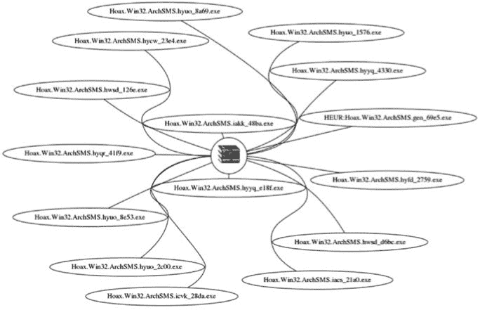

*图 4-12：多个特洛伊木马共享图像资产网络的可视化*

你可以看到，这些木马程序伪装成归档文件，并使用相同的归档文件图标（如图中间所示），尽管它们实际上是可执行文件。它们使用完全相同的图像作为欺骗用户的手段，这表明它们可能来自同一个攻击者。我通过将这些恶意软件样本传递给卡巴斯基杀毒引擎来确认这一点，结果它们都被分配了相同的家族名称（ArchSMS）。

接下来，我将向你展示如何生成图 4-12 中显示的那种可视化图，以便查看恶意软件样本之间共享图像的关系。为了从恶意软件中提取图像，我们使用辅助库`images`，它依赖于`wrestool`（在第一章中讨论）来创建*image_network.py*程序。请记住，`wrestool`从 Windows 可执行文件中提取图像。

让我们一步步地走过创建共享图像网络的过程，从列表 4-12 中显示的代码的第一部分开始。

```
   #!/usr/bin/python

   import pefile
   import sys
   import argparse
   import os
   import pprint
   import logging
   import networkx
   import collections
   import tempfile
   from networkx.drawing.nx_agraph import write_dot
   from networkx.algorithms import bipartite

   # Use argparse to parse any command line arguments

   args = argparse.ArgumentParser(
   "Visualize shared image relationships between a directory of malware samples"
   )
   args.add_argument("target_path",help="directory with malware samples")
   args.add_argument("output_file",help="file to write DOT file to")
   args.add_argument("malware_projection",help="file to write DOT file to")
   args.add_argument("resource_projection",help="file to write DOT file to")
   args = args.parse_args()
   network = networkx.Graph()

➊ class ExtractImages():
      def __init__(self,target_binary):
          self.target_binary = target_binary
          self.image_basedir = None
          self.images = []

      def work(self):
          self.image_basedir = tempfile.mkdtemp()
          icondir = os.path.join(self.image_basedir,"icons")
          bitmapdir = os.path.join(self.image_basedir,"bitmaps")
          raw_resources = os.path.join(self.image_basedir,"raw")
          for directory in [icondir,bitmapdir,raw_resources]:
              os.mkdir(directory)
          rawcmd = "wrestool -x {0} -o {1} 2> \
                   /dev/null".format(
                   self.target_binary,raw_resources
                   )
          bmpcmd = "mv {0}/*.bmp {1} 2> /dev/null".format(
          raw_resources,bitmapdir
          )
          icocmd = "icotool -x {0}/*.ico -o {1} \
                    2> /dev/null".format(
                    raw_resources,icondir
                    )
          for cmd in [rawcmd,bmpcmd,icocmd]:
              try:
                  os.system(cmd)
              except Exception,msg:
                  pass
          for dirname in [icondir,bitmapdir]:
              for path in os.listdir(dirname):
                  logging.info(path)
                  path = os.path.join(dirname,path)
                  imagehash = hash(open(path).read())
                  if path.endswith(".png"):
                      self.images.append((path,imagehash))
                  if path.endswith(".bmp"):
                      self.images.append((path,imagehash))
      def cleanup(self):
          os.system("rm -rf {0}".format(self.image_basedir))

   # search the target directory for PE files to extract images from
   image_objects = []
   for root,dirs,files in os.walk(args.target_path):➋
      for path in files:
          # try to parse the path to see if it's a valid PE file
          try:
              pe = pefile.PE(os.path.join(root,path))
          except pefile.PEFormatError:
              continue
```

*列表 4-12：解析初始参数和文件加载代码，在我们的共享图像网络程序中*

程序的开始与我们刚才讨论的主机名图形程序（从列表 4-8 开始）非常相似。它首先导入多个模块，包括`pefile`和`networkx`。然而，在这里我们还定义了`ExtractImages`辅助类 ➊，我们用它来提取目标恶意软件样本中的图形资产。然后，程序进入一个循环，在该循环中我们迭代所有目标恶意软件二进制文件 ➋。

现在我们进入了循环，接下来是从目标恶意软件二进制文件中提取图形资产，使用的是`ExtractImages`类（该类本质上是对第一章中讨论的`icoutils`程序的封装）。列表 4-13 展示了执行这一操作的代码部分。

```
           fullpath = os.path.join(root,path)
        ➊ images = ExtractImages(fullpath)
        ➋ images.work()
           image_objects.append(images)

           # create the network by linking malware samples to their images
        ➌ for path, image_hash in images.images:
               # set the image attribute on the image nodes to tell GraphViz to
               # render images within these nodes
               if not image_hash in network:
                ➍ network.add_node(image_hash,image=path,label='',type='image')
               node_name = path.split("/")[-1]
               network.add_node(node_name,type="malware")
            ➎ network.add_edge(node_name,image_hash)
```

*列表 4-13：从目标恶意软件中提取图形资产*

首先，我们将目标恶意软件二进制文件的路径传递给`ExtractImages`类 ➊，然后调用生成实例的`work()`方法 ➋。这会导致`ExtractImages`类创建一个临时目录，用于存储恶意软件图像，然后将包含每个图像数据的字典存储在`images`类属性中。

现在我们已经从`ExtractImages`中提取了图像列表，我们开始迭代它 ➌，如果我们之前没有见过该图像的哈希值，就为该图像创建一个新的网络节点 ➍，并将当前处理的恶意软件样本链接到该图像的网络中 ➎。

现在我们已经创建了一个将恶意软件样本与其包含的图像关联的网络，接下来我们准备将图形写入磁盘，如列表 4-14 所示。

```
   # write the bipartite network, then do the two projections and write them
➊ write_dot(network, args.output_file)
   malware = set(n for n,d in network.nodes(data=True) if d['type']=='malware')
   resource = set(network) - malware
   malware_network = bipartite.projected_graph(network, malware)
   resource_network = bipartite.projected_graph(network, resource)

➋ write_dot(malware_network,args.malware_projection)
   write_dot(resource_network,args.resource_projection)
```

*列表 4-14：将图形写入磁盘*

我们以与清单 4-11 中完全相同的方式进行操作。首先，我们将完整的网络写入磁盘 ➊，然后将两个投影（恶意软件投影和图像投影，这里我们称之为*资源*）写入磁盘 ➋。

你可以使用*image_network.py*分析本书中任何恶意软件数据集中的图形资产，或者从你选择的恶意软件数据集中提取情报。

### 总结

在本章中，你了解了执行共享属性分析所需的工具和方法，适用于你自己的恶意软件数据集。具体来说，你了解了网络、二分网络和二分网络投影如何帮助识别恶意软件样本之间的社交连接，为什么网络布局在网络可视化中至关重要，以及如何实现基于力导向的网络。你还学会了如何使用 Python 和开源工具（如 NetworkX）创建和可视化恶意软件网络。在第五章中，你将学习如何根据样本之间的共享代码关系构建恶意软件网络。
