## **5**

**共享代码分析**


假设你在网络上发现了一个新的恶意软件样本。你会如何开始分析它？你可以将它提交给一个多引擎的病毒扫描器，如 VirusTotal，来了解它属于哪个恶意软件家族。然而，这样的结果往往不清晰且含糊，因为引擎通常使用“代理”等通用术语来标记恶意软件，而这些术语没有实际意义。你也可以通过 CuckooBox 或其他恶意软件沙箱运行该样本，以获得该恶意软件样本回调服务器和行为的有限报告。

当这些方法没有提供足够的信息时，你可能需要对样本进行逆向工程。在这个阶段，共享代码分析可以显著改善你的工作流程。通过揭示新恶意软件样本与哪些之前分析过的样本相似，从而揭示它们共享的代码，共享代码分析使你能够在新恶意软件上重用以前的分析结果，避免从头开始。了解这些之前见过的恶意软件来自哪里，也有助于你弄清楚是谁可能部署了这些恶意软件。

*共享代码分析*，也叫*相似性分析*，是通过估算两个恶意软件样本共享的预编译源代码的百分比来比较它们的过程。它不同于共享属性分析，后者是根据恶意软件样本的外部属性（例如，它们使用的桌面图标或它们调用的服务器）进行比较的。

在逆向工程中，共享代码分析有助于识别可以一起分析的样本（因为它们是由相同的恶意软件工具包生成的，或是同一恶意软件家族的不同版本），这可以判断是否是同一开发者可能负责了一组恶意软件样本。

考虑清单 5-1 中的输出，这来自于你将在本章稍后构建的一个程序，用于说明恶意软件共享代码分析的价值。它显示了与新样本可能共享代码的以前见过的样本，以及对那些旧样本所做的评论。

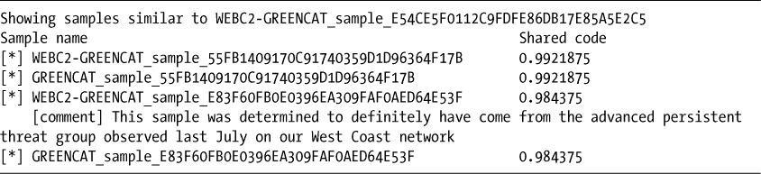

*清单 5-1：基本共享代码分析的结果*

给定一个新样本，共享代码估算可以让我们在几秒钟内看到该样本可能与哪些样本共享代码，并且了解我们已知的这些样本的信息。在这个例子中，它揭示了一个非常相似的样本来自一个已知的 APT（*高级持续性威胁*），从而为这个新恶意软件提供了即时的背景信息。

我们还可以使用网络可视化来展示样本共享代码关系，这在第四章中你已学到。例如，图 5-1 展示了一个先进持续威胁数据集中的样本共享代码关系网络。

如你所见，从可视化中可以看出，自动化共享代码分析技术可以快速揭示恶意软件家族的存在，而这些家族通过手动分析可能需要几天或几周才能发现。在本章中，你将学习使用这些技术来完成以下任务：

+   识别来自相同恶意软件工具包或由相同攻击者编写的新恶意软件家族。

+   确定一个新样本与之前见过的样本之间的代码相似性。

+   可视化恶意软件关系，更好地理解恶意软件样本之间的代码共享模式，并将你的结果传达给他人。

+   使用我为本书开发的两个概念验证工具，这些工具实现了这些想法，允许你查看恶意软件共享的代码关系。

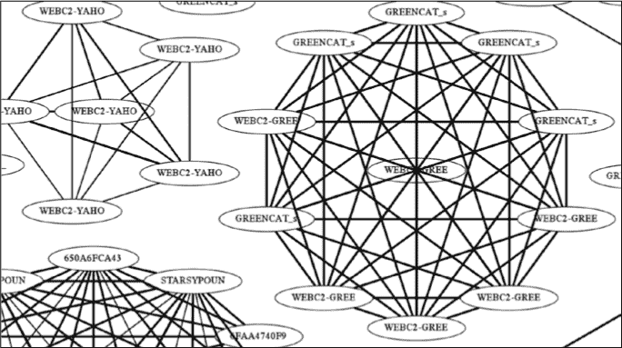

*图 5-1：本章中你将学习创建的一种可视化示例，展示了一些 APT1 样本之间共享的代码关系*

首先，我介绍一下你将在本章中使用的测试恶意软件样本，它们是来自第四章的 PLA APT1 样本以及一组犯罪软件样本。然后，你将了解数学相似性比较和*Jaccard 指数*的概念，这是一种基于集合论的方法，用于根据共享特征比较恶意软件样本。接下来，我介绍特征的概念，展示如何将它们与 Jaccard 指数结合使用，以近似两个恶意软件样本之间共享的代码量。你还将学习如何根据它们的有用性来评估恶意软件特征。最后，我们通过利用你在第四章中学习的网络可视化知识，创建多个尺度上的恶意软件代码共享可视化，如图 5-1 所示。

**本章使用的恶意软件样本**

在本章中，我们使用了现实世界中的恶意软件家族，这些家族之间有大量共享的代码，来进行实验。这些数据集得益于 Mandiant 和 Mila Parkour，他们策划了这些样本并将其提供给研究社区。然而，实际上，你可能不知道一个恶意软件样本属于哪个家族，或者你的新恶意软件样本与之前见过的样本的相似性有多大。但通过使用我们*已经知道*的示例进行练习会是一个很好的方法，因为这样可以验证我们自动化的样本相似性推断是否与我们关于哪些样本实际上属于同一组的知识一致。

第一个样本来自我们在第四章中使用的 APT1 数据集，展示了共享资源分析。其他样本则由成千上万的犯罪软件样本组成，这些样本由犯罪分子开发，用于窃取人们的信用卡，将他们的计算机转变为僵尸主机并加入到僵尸网络中，等等。这些是来自商业恶意软件数据源的现实世界样本，这些服务是付费提供给威胁情报研究人员的。

为了确定它们的家族名称，我将每个样本输入到卡巴斯基的杀毒引擎中。卡巴斯基成功地将这些样本中的 30,104 个样本进行了稳健的层次分类（例如，*trojan.win32.jorik.skor.akr*，表示*jorik.skor*家族），将 41,830 个样本归类为“未知”，并将剩余的 28,481 个样本分配了通用标签（例如，通用的“win32 Trojan”）。

由于卡巴斯基标签的不一致性（某些卡巴斯基标签分组，如 jorik 家族，代表着范围非常广泛的恶意软件，而其他标签，如 webprefix，则代表特定的一组变种），以及卡巴斯基经常漏掉或误标恶意软件，我选择了卡巴斯基能够高置信度检测到的七个恶意软件类别。具体来说，这些类别包括 dapato、pasta、skor、vbna、webprefix、xtoober 和 zango 家族。

### **通过提取特征为比较做准备**

我们如何开始思考估算两个恶意二进制文件在被攻击者编译之前可能共享的代码量呢？有许多方法可以考虑解决这个问题，但在成百上千篇已发布的计算机科学研究论文中，出现了一个共同的主题：为了估算二进制文件之间共享的代码量，我们先将恶意软件样本分组为“特征袋”，然后进行比较。

*特征*是指我们在估算样本之间代码相似性时，可能考虑的任何恶意软件属性。例如，我们使用的特征可以是从二进制文件中提取的可打印字符串。与其将样本视为一个相互关联的功能系统、动态库导入等，我们更倾向于从数学便利的角度将恶意软件看作一个由独立特征组成的集合（例如，从恶意软件中提取的一组字符串）。

#### ***特征袋模型如何工作***

为了理解特征袋如何工作，考虑一下两个恶意软件样本之间的维恩图，如图 5-2 所示。

这里，样本 A 和样本 B 被显示为特征集合（特征在维恩图中用椭圆表示）。我们可以通过检查两个样本之间共享的特征来进行比较。计算两个特征集合之间的重叠非常快速，可以用于根据我们定义的任意特征比较恶意软件样本的相似性。

例如，在处理打包的恶意软件时，我们可能希望使用基于恶意软件动态运行日志的特征，因为将恶意软件运行在沙箱中是一种让恶意软件自解包的方法。在其他情况下，我们可能会使用从静态恶意软件二进制文件中提取的字符串来执行比较。

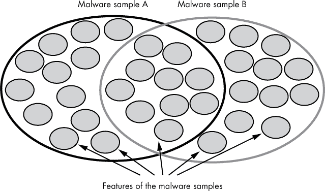

*图 5-2：用于恶意软件代码共享分析的“特征袋”模型示意图*

在动态恶意软件分析中，我们可能不仅希望基于它们共享的*行为*来比较样本，还希望根据它们表达行为的顺序来比较，或者我们所称之为它们的*行为序列*。将序列信息纳入恶意软件样本比较的一种常见方法是扩展特征集模型，以适应使用 N-grams 的顺序数据。

#### ***什么是 N-Grams?***

*N-gram*是指具有某个特定长度*N*的事件子序列，它是从一个更大的事件序列中提取出来的。我们通过在顺序数据上滑动窗口来提取这个子序列。换句话说，我们通过迭代序列，在每一步记录从事件索引*i*到事件索引*i* + *N* - 1 的子序列，如图 5-3 所示。

在图 5-3 中，整数序列（1,2,3,4,5,6,7）被转换为五个不同的长度为 3 的子序列：（1,2,3），（2,3,4），（3,4,5），（4,5,6），（5,6,7）。

当然，我们可以对任何顺序数据执行此操作。例如，使用 N-gram 的词长为 2，句子“how now brown cow”会生成以下子序列：“how now”，“now brown”和“brown cow”。在恶意软件分析中，我们会提取恶意软件样本所做的 API 调用的 N-grams。然后，我们将恶意软件表示为一组特征，并使用 N-gram 特征将恶意软件样本与其他恶意软件样本的 N-grams 进行比较，从而将序列信息纳入特征集比较模型中。

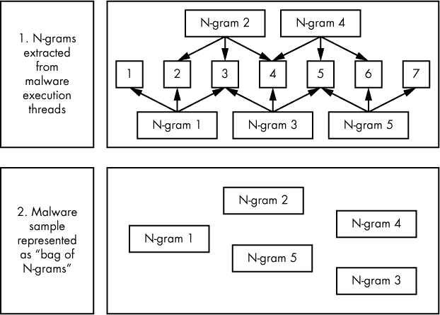

*图 5-3：一个可视化的解释，展示我们如何从恶意软件的汇编指令和动态 API 调用序列中提取 N-grams，其中*N*= 3*

在我们比较恶意软件样本时，包含序列信息有其优缺点。优点是当顺序在比较中很重要时（例如，当我们关心 API 调用 A 发生在 API 调用 B 之前，而 B 又发生在 API 调用 C 之前时），它允许我们捕捉到顺序，但当顺序是多余的（例如，恶意软件在每次运行时随机化 API 调用 A、B 和 C 的顺序时），它实际上可能使我们对共享代码的估计变得更差。是否在恶意软件共享代码估计中包含顺序信息，取决于我们处理的是哪种恶意软件，并且需要进行实验。

### **使用 Jaccard 指数量化相似度**

一旦你将恶意软件样本表示为一组特征，你就需要衡量该样本的特征集与其他样本特征集之间的相似度。为了估计两个恶意软件样本之间的代码共享程度，我们使用一个*相似度函数*，该函数应具有以下属性：

+   它产生一个归一化值，使得所有恶意软件样本之间的相似度比较可以置于一个共同的尺度上。按照惯例，该函数的结果应在 0（没有代码共享）到 1（样本共享 100%的代码）之间。

+   该函数应帮助我们准确估计两个样本之间的代码共享情况（我们可以通过实验经验性地确定这一点）。

+   我们应该能够轻松理解为什么该函数能够很好地建模代码相似性（它不应是一个复杂的数学黑箱，需要大量精力才能理解或解释）。

*Jaccard 指数*是一个简单的函数，具有这些特性。事实上，尽管在安全研究领域曾尝试过其他数学方法来估计代码相似性（例如余弦距离、L1 距离、欧几里得[L2]距离等），但 Jaccard 指数已成为最广泛采用的——并且有充分的理由。它简单直观地表达了两组恶意软件特征之间的重叠程度，给出了两组中共同的独特特征的百分比，经过归一化后，再与任何一组中存在的独特特征的百分比相比较。

图 5-4 展示了 Jaccard 指数值的示例。

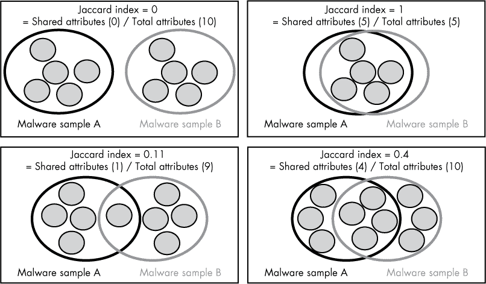

*图 5-4：Jaccard 指数背后的概念的视觉示意图*

该图展示了从四对恶意软件样本中提取的四组恶意软件特征。每张图展示了两组之间共享的特征、未共享的特征以及给定恶意软件样本对和相关特征的 Jaccard 指数。你可以看到，样本之间的 Jaccard 指数就是共享特征的数量除以 Venn 图中绘制的特征总数。

### **使用相似度矩阵评估恶意软件共享代码估计方法**

让我们讨论四种确定两个恶意软件样本是否来自同一家族的方法：基于指令序列的相似性、基于字符串的相似性、基于导入地址表的相似性和基于动态 API 调用的相似性。为了比较这四种方法，我们将使用*相似度矩阵*可视化技术。我们的目标是比较每种方法在揭示样本之间共享代码关系方面的相对优缺点。

首先，让我们了解一下相似度矩阵的概念。图 5-5 使用相似度矩阵对四个虚拟恶意软件样本进行了比较。

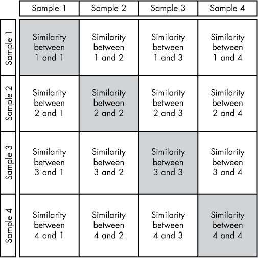

*图 5-5：一个假设的相似度矩阵示意图*

这个矩阵允许你看到所有样本之间的相似性关系。你可以看到这个矩阵中有一些空间被浪费了。例如，我们不关心阴影框中表示的相似性，因为这些条目只是比较了一个样本与其自身的相似性。你还可以看到阴影框两侧的信息是重复的，因此你只需要查看其中一个即可。

图 5-6 展示了一个真实世界的恶意软件相似度矩阵示例。请注意，由于图中展示了大量恶意软件样本，每个相似度值是通过阴影像素表示的。我们没有渲染每个样本的名称，而是沿着横轴和纵轴渲染了每个样本所属的家族名称。一个完美的相似度矩阵应该像从左上角到右下角的一串白色方块，因为每个家族的行和列会被分组在一起，我们期望同一家族的所有成员彼此相似，但不同家族的样本之间不会有相似性。

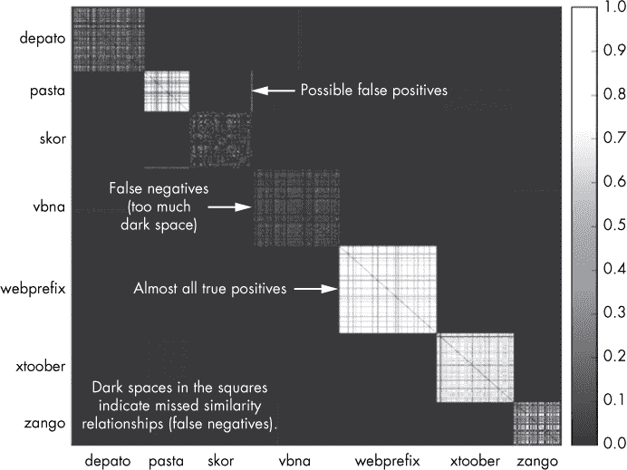

*图 5-6：计算七个恶意软件家族的真实世界恶意软件相似度矩阵*

在图 5-6 给出的结果中，你可以看到一些家族区域完全是白色的——这些是好结果，因为家族区域内的白色像素表示推测的同一家族样本之间的相似性关系。有些区域则要暗得多，这意味着我们没有检测到强的相似性关系。最后，有时会出现家族区域外的像素线条，这些要么是相关恶意软件家族的证据，要么是误报，意味着尽管这些家族本质上是不同的，我们仍然检测到了它们之间的代码共享。

接下来，我们将使用相似度矩阵可视化，如图 5-6，来比较四种不同代码共享估算方法的结果，首先从基于指令序列的相似性分析描述开始。

#### ***基于指令序列的 xSimilarity***

比较两个恶意软件二进制文件共享代码量的最直观方式是通过比较它们的 x86 汇编指令序列，因为共享指令序列的样本很可能在编译前共享了实际的源代码。这需要通过例如在第二章中介绍的*线性反汇编*技术对恶意软件样本进行反汇编。然后，我们可以使用我之前讨论过的 N-gram 提取方法，按照它们在恶意软件文件的 `.text` 部分出现的顺序提取指令序列。最后，我们可以使用指令 N-gram 计算样本之间的 Jaccard 相似度指数，来估计它们共享的代码量。

在 N-gram 提取中，我们使用的 N 值取决于我们的分析目标。N 值越大，提取的指令子序列就越长，因此恶意软件样本的序列匹配就越困难。将 N 设置为较大数值有助于仅识别出那些高度可能共享代码的样本。另一方面，你也可以将 N 设置得较小，以便寻找样本之间的细微相似性，或者如果你怀疑样本使用了指令重排序来掩盖相似性分析。

在图 5-7 中，N 值设置为 5，这是一个激进的设置，使得样本之间的匹配更加困难。

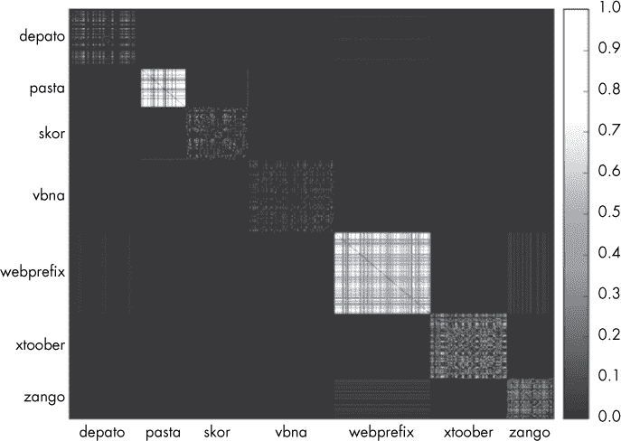

*图 5-7：使用指令 N-gram 特征生成的相似性矩阵。使用* N *= 5，我们完全错过了许多家族之间的相似关系，但在 webprefix 和 pasta 上表现得很好。*

图 5-7 中的结果并不十分有说服力。虽然基于指令的相似性分析正确地识别出一些家族之间的相似性，但它在其他家族中无法识别（例如，它在 dapato、skor 和 vbna 中几乎没有检测到相似关系）。然而，需要注意的是，这种分析中的假阳性很少（即错误地推断出来自不同家族样本之间的相似性，而不是正确地推断出同一家族样本之间的相似性）。

如你所见，指令子序列共享代码分析的局限性在于，它可能会错过样本之间许多共享代码的关系。这是因为恶意软件样本可能被打包，以至于它们的大部分指令只有在我们执行恶意软件样本并让其解包后才会变得可见。如果不解包恶意软件样本，指令序列共享代码估计方法可能无法很好地工作。

即使我们解包恶意软件样本，这种方法也可能存在问题，因为源代码编译过程会引入噪声。事实上，编译器可以将相同的源代码编译成完全不同的汇编指令序列。例如，以下是用 C 语言编写的一个简单函数：

```
int f(void) {
    int a = 1;
    int b = 2;
  ➊ return (a*b)+3;
}
```

你可能会认为，无论使用什么编译器，函数都会被编译成相同的汇编指令序列。但实际上，编译过程不仅高度依赖于所使用的编译器，还依赖于编译器的设置。例如，使用 clang 编译器并按照其默认设置编译此函数时，源代码中➊行对应的汇编指令如下：

```
movl    $1, -4(%rbp)
movl    $2, -8(%rbp)
movl    -4(%rbp), %eax
imull   -8(%rbp), %eax
addl    $3, %eax
```

相比之下，使用`–O3`标志编译相同的函数，告诉编译器优化代码以提高速度，编译出的汇编指令如下所示：

```
movl    $5, %eax
```

这种差异的原因在于，在第二个例子中，编译器预先计算了函数的结果，而不是像第一个编译例子那样显式地计算它。这意味着，如果我们根据指令序列比较这些函数，它们看起来根本不相似，尽管实际上它们是从完全相同的源代码编译而来的。

除了当我们查看汇编指令时，相同的 C 和 C++代码看起来非常不同的问题外，当我们根据汇编代码比较二进制文件时，还会出现一个额外的问题：许多恶意软件二进制文件现在是用像 C#这样的高级语言编写的。这些二进制文件包含标准的样板汇编代码，它只是解释这些高级语言的字节码。因此，尽管用相同高级语言编写的二进制文件可能共享非常相似的 x86 指令，但它们的实际字节码可能反映了它们来自完全不同源代码的事实。

#### ***基于字符串的相似性***

我们可以通过提取样本中的所有连续可打印字符序列，然后根据它们共享的字符串关系，计算恶意软件样本之间的 Jaccard 指数，从而计算基于字符串的恶意软件相似度。

这种方法绕过了编译器的问题，因为从二进制文件中提取的字符串通常是由程序员定义的*格式字符串*，编译器通常不会对其进行转换，无论恶意软件作者使用的是哪种编译器，或者他们给编译器设置了什么参数。例如，从恶意软件二进制文件中提取的典型字符串可能是：“在%s 上启动键盘记录器，时间为%s。”不管编译器设置如何，这个字符串在多个二进制文件中往往看起来是相同的，它与是否基于相同的源代码库有关。

图 5-8 展示了基于字符串的代码共享度量如何在犯罪软件数据集中识别正确的代码共享关系。

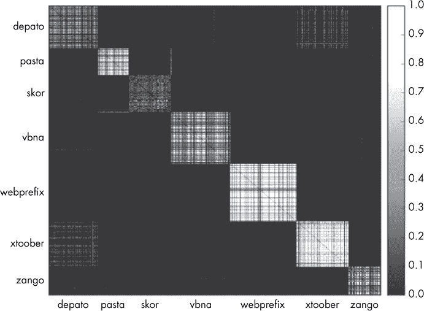

*图 5-8：使用字符串特征生成的相似度矩阵*

初看之下，这种方法在识别恶意软件家族方面比基于指令的方法表现得更好，准确地恢复了所有七个家族的大部分相似性关系。然而，与基于指令的相似性方法不同，仍然有一些误报，因为它错误地预测了 xtoober 和 dapato 共享某些代码。此外，值得注意的是，这种方法未能检测到某些家族样本之间的相似性，在 zango、skor 和 dapato 家族上表现特别差。

#### ***基于导入地址表的相似性***

我们可以通过比较恶意软件二进制文件的 DLL 导入来计算我所称的 “导入地址表–基础相似性”。这种方法背后的思想是，即使恶意软件作者已经重新排序了指令、混淆了恶意软件二进制文件的初始化数据段，并实施了反调试和反虚拟机反分析技术，他们可能仍然保留了相同的导入声明。导入地址表方法的结果如 图 5-9 所示。

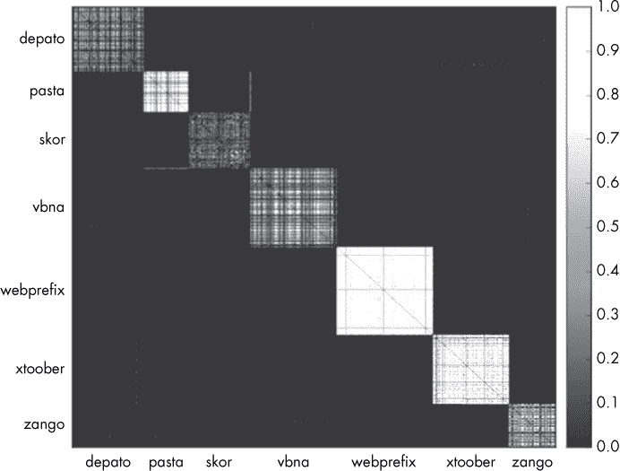

*图 5-9：使用导入地址表特征生成的相似性矩阵*

该图显示，导入地址表方法在估计 webprefix 和 xtoober 样本之间的相似性关系方面优于任何前述方法，并且总体表现非常好，尽管它错过了许多 skor、dapato 和 vbna 关系。值得注意的是，这种方法在我们的实验数据集中给出的假阳性较少。

#### ***基于动态 API 调用的相似性***

本章我介绍的最后一种比较方法是动态恶意软件相似性。比较动态序列的优势在于，即使恶意软件样本经过了极度混淆或打包，只要它们源自相同的代码或相互借用代码，它们在沙箱虚拟机中执行的动作序列通常会非常相似。为了实现这种方法，你需要在沙箱中运行恶意软件样本，记录它们所做的 API 调用，从动态日志中提取 API 调用的 N-gram，并最终通过计算它们的 N-gram 包之间的 Jaccard 指数来比较样本。

图 5-10 显示了动态 N-gram 相似性方法在大多数情况下与导入方法和字符串方法的表现相当。

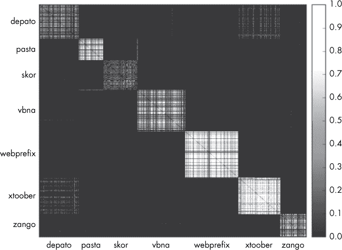

*图 5-10：使用动态 API 调用 N-gram 特征生成的相似性矩阵*

这里的不完美结果表明，这种方法并不是万能的。仅仅在沙箱中运行恶意软件并不足以触发它的许多行为。例如，一种命令行恶意软件工具的不同变种可能启用或不启用一个重要的代码模块，因此会执行不同的行为序列，尽管它们可能共享大部分代码。

另一个问题是，一些样本能够检测到它们正在沙箱中运行，然后迅速退出执行，导致我们几乎无法获得任何信息来进行比较。总之，像我所概述的其他相似性方法一样，动态 API 调用序列相似性并不完美，但它能为样本之间的相似性提供令人印象深刻的洞察。

### **构建相似性图**

现在你已经理解了识别恶意软件代码共享方法背后的概念，让我们构建一个简单的系统，针对恶意软件数据集进行此分析。

首先，我们需要通过提取我们想要使用的特征来估算样本共享的代码量。这些特征可以是之前描述的任何特征，例如基于导入地址表的函数、字符串、指令的 N-gram 或动态行为的 N-gram。在这里，我们将使用可打印字符串特征，因为它们表现良好，并且易于提取和理解。

一旦我们提取了字符串特征，我们需要遍历每一对恶意软件样本，使用 Jaccard 指数比较它们的特征。然后，我们需要构建一个代码共享图。为此，我们首先需要决定一个阈值，定义两个样本共享多少代码——我在研究中使用的标准值是 0.8。如果给定的恶意软件样本对的 Jaccard 指数高于该值，我们就会为它们创建一个可视化链接。最后一步是研究该图，看看哪些样本通过共享的代码关系连接在一起。

列表 5-2 到 5-6 包含我们的示例程序。由于列表较长，我将其拆分为几部分，并在每一部分讲解。列表 5-2 导入了我们将使用的库，并声明了 `jaccard()` 函数，该函数计算两个样本特征集之间的 Jaccard 指数。

```
#!/usr/bin/python

import argparse
import os
import networkx
from networkx.drawing.nx_pydot import write_dot
import itertools

def jaccard(set1, set2):
    """
    Compute the Jaccard distance between two sets by taking
    their intersection, union and then dividing the number
    of elements in the intersection by the number of elements
    in their union.
    """
    intersection = set1.intersection(set2)
    intersection_length = float(len(intersection))
    union = set1.union(set2)
    union_length = float(len(union))
    return intersection_length / union_length
```

*列表 5-2：导入和一个帮助函数，用于计算两个样本之间的 Jaccard 指数*

接下来，在 列表 5-3 中，我们声明了两个附加的实用函数：`getstrings()`，该函数查找我们将要分析的恶意软件文件中的可打印字符串序列集合；以及 `pecheck()`，该函数确保目标文件确实是 Windows PE 文件。我们将在后续进行目标恶意软件二进制文件的特征提取时使用这些函数。

```
def getstrings(fullpath):
    """
    Extract strings from the binary indicated by the 'fullpath'
    parameter, and then return the set of unique strings in
    the binary.
    """
    strings = os.popen("strings '{0}'".format(fullpath)).read()
    strings = set(strings.split("\n"))
    return strings

def pecheck(fullpath):
    """
    Do a cursory sanity check to make sure 'fullpath' is
    a Windows PE executable (PE executables start with the
    two bytes 'MZ')
    """
    return open(fullpath).read(2) == "MZ"
```

*列表 5-3：声明我们将在特征提取中使用的函数*

接下来，在 列表 5-4 中，我们解析用户的命令行参数。这些参数包括存放我们将要分析的恶意软件的目标目录、我们将写入共享代码网络的输出 *.dot* 文件，以及 Jaccard 指数阈值，该阈值决定了两个样本之间的 Jaccard 指数需要达到多少，程序才会判断它们共享相同的代码基础。

```
If __name__ == "__main__":
    parser = argparse.ArgumentParser(
        description="Identify similarities between malware samples and build similarity graph"
    )

    parser.add_argument(
        "target_directory",
        help="Directory containing malware"
    )

    parser.add_argument(
        "output_dot_file",
        help="Where to save the output graph DOT file"
    )

    parser.add_argument(
        "--jaccard_index_threshold", "-j", dest="threshold", type=float,
        default=0.8, help="Threshold above which to create an 'edge' between samples"
    )

    args = parser.parse_args()
```

*列表 5-4：解析用户的命令行参数*

接下来，在 列表 5-5 中，我们使用之前声明的帮助函数来执行程序的主要工作：在目标目录中找到 PE 二进制文件、从中提取特征，并初始化一个网络，用来表示二进制文件之间的相似性关系。

```
malware_paths = []  # where we'll store the malware file paths
malware_features = dict()  # where we'll store the malware strings
graph = networkx.Graph()  # the similarity graph

for root, dirs, paths in os.walk(args.target_directory):
    # walk the target directory tree and store all of the file paths
    for path in paths:
        full_path = os.path.join(root, path)
        malware_paths.append(full_path)

# filter out any paths that aren't PE files
malware_paths = filter(pecheck, malware_paths)

# get and store the strings for all of the malware PE files
for path in malware_paths:
    features = getstrings(path)
    print "Extracted {0} features from {1} ...".format(len(features), path)
    malware_features[path] = features

    # add each malware file to the graph
    graph.add_node(path, label=os.path.split(path)[-1][:10])
```

*列表 5-5：从目标目录中的 PE 文件提取特征并初始化共享代码网络*

在从目标样本中提取特征之后，我们需要遍历每一对恶意软件样本，使用 Jaccard 指数比较它们的特征。我们在清单 5-6 中执行了这个操作。我们还构建了一个代码共享图，当样本的 Jaccard 指数高于某个用户定义的阈值时，它们会被连接在一起。我在我的研究中发现，0.8 是效果最好的阈值。

```
# iterate through all pairs of malware
for malware1, malware2 in itertools.combinations(malware_paths, 2):

    # compute the jaccard distance for the current pair
    jaccard_index = jaccard(malware_features[malware1], malware_features[malware2])

    # if the jaccard distance is above the threshold, add an edge
    if jaccard_index > args.threshold:
        print malware1, malware2, jaccard_index
        graph.add_edge(malware1, malware2, penwidth=1+(jaccard_index-args.threshold)*10)

# write the graph to disk so we can visualize it
write_dot(graph, args.output_dot_file)
```

*清单 5-6：在 Python 中创建代码共享图*

清单 5-2 到 5-6 中的代码，在应用于 APT1 恶意软件样本时，生成的图表如图 5-11 所示。要查看图表，你需要使用`fdp` Graphviz 工具（在第四章中讨论过）输入命令`fdp -Tpng network.dot -o network.png`。

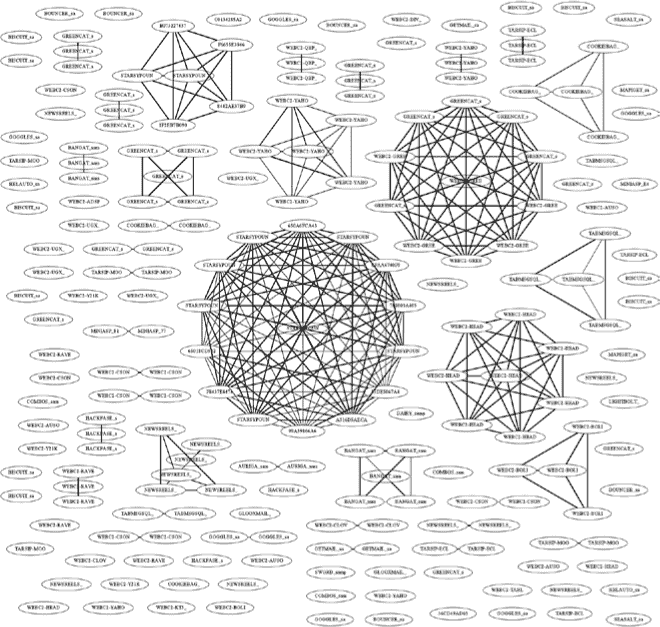

*图 5-11：APT1 样本的完整基于字符串的相似度图*

这个输出的惊人之处在于，几分钟之内，我们就重新生成了 APT1 原始分析师在其报告中所做的许多手动、艰苦的工作，识别出了这些国家级攻击者使用的许多恶意软件家族。

我们知道我们的方法与这些分析师执行的手动逆向工程工作相比是准确的，因为节点上的名称是 Mandiant 分析师赋予它们的名称。你可以从图 5-11 中的网络可视化中看到，具有相似名称的样本会聚集在一起，例如位于中央圆圈中的“STARSYPOUN”样本。因为我们的网络可视化中的恶意软件自动以与这些家族名称一致的方式分组，我们的方法似乎与 Mandiant 的恶意软件分析师“达成一致”。你可以扩展清单 5-2 到 5-6 中的代码，并将其应用于你自己的恶意软件，以获得类似的情报。

### **扩展相似度比较**

尽管清单 5-2 到 5-6 中的代码对于小型恶意软件数据集效果良好，但对于大量恶意软件样本则效果不佳。这是因为在数据集中比较所有恶意软件样本的每一对时，计算量随着样本数量的增加而呈二次增长。具体来说，下面的方程给出了计算 Jaccard 指数所需的计算次数，以计算一个大小为*n*的数据集的相似度矩阵：

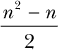

例如，让我们回到图 5-5 中的相似性矩阵，看看我们需要计算多少个 Jaccard 指数来比较四个样本。乍一看，你可能会说是 16（4²），因为这就是矩阵中单元格的数量。然而，由于矩阵的下三角包含矩阵上三角的重复项，我们不需要重复计算这些内容。这意味着我们可以从总计算次数中减去 6 次。此外，我们不需要将恶意软件样本与自身进行比较，因此我们可以消除矩阵中的对角线，从而再减去 4 次计算。

所需的计算次数如下：

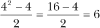

这似乎是可以管理的，直到我们的数据集增长到例如 10,000 个恶意软件样本，这将需要 49,995,000 次计算。一个有 50,000 个样本的数据集将需要 1,249,975,000 次 Jaccard 指数计算！

为了扩展恶意软件相似性比较，我们需要使用随机化的比较近似算法。基本思想是允许我们在计算比较时出现一些误差，从而减少计算时间。对于我们的目的，称为*minhash*的近似比较方法非常合适。Minhash 方法允许我们使用近似计算 Jaccard 指数，以避免在低于某个预定义相似性阈值的情况下计算不相似的恶意软件样本之间的相似性，这样我们就可以分析数百万样本之间的共享代码关系。

在你阅读关于 minhash 为何有效之前，请注意这是一个复杂的算法，可能需要一些时间才能理解。如果你决定跳过“Minhash 深入分析”部分，只需阅读“Minhash 概述”部分并使用提供的代码，你应该可以顺利扩展代码共享分析。

#### ***Minhash 概述***

Minhash 通过*k*个哈希函数对恶意软件样本的特征进行哈希处理。对于每个哈希函数，我们只保留计算出的所有特征的哈希值中的最小值，这样恶意软件特征集就会减少到一个固定大小的*k*个整数的数组，我们称之为 minhash。为了基于这些 minhash 数组计算两个样本之间的近似 Jaccard 指数，你现在只需要检查有多少个*k*个 minhash 值是匹配的，然后将其除以*k*。

奇妙的是，这些计算出来的数字接近任何两个样本之间的真实 Jaccard 指数。使用 minhash 而不是直接计算 Jaccard 指数的好处是，它计算速度要快得多。

实际上，我们甚至可以利用 minhash 巧妙地在数据库中对恶意软件进行索引，这样我们只需要计算那些哈希值至少有一个匹配的恶意软件样本之间的比较，从而显著加速恶意软件数据集内相似性计算的速度。

#### ***Minhash 深入分析***

现在让我们深入讨论 minhash 背后的数学原理。图 5-12 展示了两个恶意软件样本的特征集合（由阴影圆圈表示），它们是如何哈希化并根据哈希值排序的，以及它们是如何基于每个列表的第一个元素的值进行最终比较的。

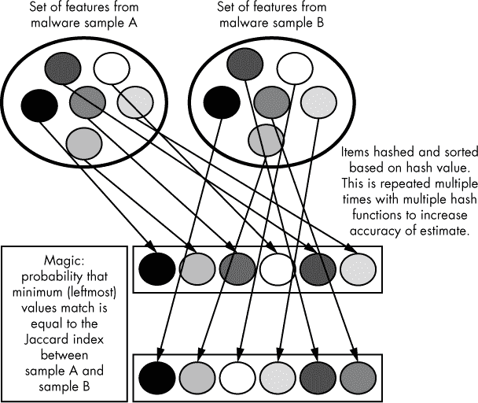

*图 5-12：minhash 背后思想的插图*

第一个元素匹配的概率等于样本之间的 Jaccard 指数。这一原理超出了本书的讨论范围，但正是这个偶然的事实使得我们可以通过哈希来近似估算 Jaccard 指数。

当然，仅仅执行这个哈希、排序和检查第一个元素的操作，如果我们只做一次，是无法给我们提供太多信息的——哈希值要么匹配，要么不匹配，我们也无法根据这一次的匹配准确地推测底层的 Jaccard 指数。为了更好地估算这个底层值，我们必须使用 *k* 个哈希函数，并且重复执行这个操作 *k* 次，然后通过将这些第一个元素匹配的次数除以 *k* 来估算 Jaccard 指数。我们估算 Jaccard 指数时的预期 *误差* 定义如下：

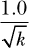

所以，我们执行这个过程的次数越多，我们就越能够确定（我通常将 *k* 设置为 256，这样估算值平均偏差为 6%）。

假设我们为一个包含一百万个样本的恶意软件数据集中的每个恶意软件样本计算一个 minhash 数组。那我们如何使用这些 minhash 来加速在数据集中搜索恶意软件家族呢？我们可以遍历数据集中每对恶意软件样本，并比较它们的 minhash 数组，这样就会进行 499,999,500,000 次比较。尽管比较 minhash 数组比计算 Jaccard 指数要快，但这仍然是现代硬件上需要进行的比较次数，太多了。我们需要某种方式利用 minhash 来进一步优化比较过程。

解决这个问题的标准方法是结合草图和数据库索引的方法，创建一个只比较我们已经知道高度相似的样本的系统。我们通过将多个 minhash 哈希值一起进行哈希，来生成一个草图。

当我们得到一个新样本时，我们会检查数据库中是否包含任何与新样本的草图匹配的样本。如果有，那么就用它们的 minhash 数组将新样本与匹配的样本进行比较，从而近似估算新样本与旧样本之间的 Jaccard 指数。这避免了将新样本与数据库中的所有样本进行比较，而是只与那些与新样本的 Jaccard 指数很可能较高的样本进行比较。

### **构建一个持久化的恶意软件相似性搜索系统**

现在你已经了解了使用各种恶意软件特征类型来估计恶意软件样本之间共享代码关系的优缺点。你还了解了 Jaccard 指数、相似性矩阵，以及 minhash 如何使得在非常大的数据集中计算恶意软件样本之间的相似性变得可行。掌握了这些知识后，你理解了构建一个可扩展的恶意软件共享代码搜索系统所需的所有基本概念。

列表 5-7 到 5-12 展示了一个简单系统的示例，在该系统中，我根据恶意软件样本的字符串特征对其进行索引。在你的工作中，你应该有信心修改此系统，使用其他恶意软件特征，或扩展它以支持更多的可视化功能。由于列表很长，我将其分成了几个部分，我们将逐一讨论每个小节。

首先，列表 5-7 导入了我们程序所需的 Python 包。

```
#!/usr/bin/python

import argparse
import os
import murmur
import shelve
import numpy as np
from listings_5_2_to_5_6 import *

NUM_MINHASHES = 256
SKETCH_RATIO = 8
```

*列表 5-7：导入 Python 模块并声明与 minhash 相关的常量*

在这里，我导入了像 `murmur`、`shelve` 和 `sim_graph` 这样的包。例如，`murmur` 是一个哈希库，我们用它来计算我刚才讨论的 minhash 算法。我们使用 `shelve`，这是一个包含在 Python 标准库中的简单数据库模块，用来存储有关样本及其 minhash 的信息，这些信息用于计算相似性。我们使用 `listings_5_2_to_5_6.py` 来获取计算样本相似性的函数。

我们还在列表 5-7 中声明了两个常量：`NUM_MINHASHES` 和 `SKETCH_RATIO`。这两个常量分别对应我们为每个样本计算的 minhash 数量和 minhash 与草图的比率。请记住，使用的 minhash 和草图越多，我们的相似性计算越准确。例如，256 个 minhash 和 8:1 的比率（32 个草图）就足以在低计算成本下提供足够的准确性。

列表 5-8 实现了我们用来初始化、访问和删除用于存储恶意软件样本信息的`shelve`数据库的数据库功能。

```
➊ def wipe_database():
       """
       This problem uses the python standard library 'shelve' database to persist
       information, storing the database in the file 'samples.db' in the same
       directory as the actual Python script. 'wipe_database' deletes this file
       effectively reseting the system.
       """
       dbpath = "/".join(__file__.split('/')[:-1] + ['samples.db'])
       os.system("rm -f {0}".format(dbpath))

➋ def get_database():
       """
       Helper function to retrieve the 'shelve' database, which is a simple
       key value store.
       """
       dbpath = "/".join(__file__.split('/')[:-1] + ['samples.db'])
       return shelve.open(dbpath,protocol=2,writeback=True)
```

*列表 5-8：数据库辅助函数*

我们定义了 `wipe_database()` ➊ 来删除程序的数据库，以便在我们想要清除存储的样本信息并重新开始时使用。然后，我们定义了 `get_database()` ➋ 来打开数据库，如果数据库尚不存在，则创建它，并返回一个数据库对象，允许我们存储和检索有关恶意软件样本的数据。

列表 5-9 实现了共享代码分析的核心部分：minhash。

```
def minhash(features):
    """
    This is where the minhash magic happens, computing both the minhashes of
    a sample's features and the sketches of those minhashes. The number of
    minhashes and sketches computed is controlled by the NUM_MINHASHES and
    NUM_SKETCHES global variables declared at the top of the script.
    """
    minhashes = []
    sketches = []
  ➊ for i in range(NUM_MINHASHES):
        minhashes.append(
          ➋ min([murmur.string_hash(`feature`,i) for feature in features])
        )
  ➌ for i in xrange(0,NUM_MINHASHES,SKETCH_RATIO):
      ➍ sketch = murmur.string_hash(`minhashes[i:i+SKETCH_RATIO]`)
        sketches.append(sketch)
    return np.array(minhashes),sketches
```

*列表 5-9：获取样本的 minhash 和草图*

我们循环 `NUM_MINHASHES` 次 ➊，并附加一个最小哈希值。每个最小哈希值通过哈希所有特征并取最小哈希值来计算。为了执行这个计算，我们使用 `murmur` 包的 `string_hash()` 函数对特征进行哈希，然后通过调用 Python 的 `min()` 函数 ➋ 获取哈希值列表中的最小值。

`string_hash` 的第二个参数是一个种子值，这会导致哈希函数根据种子值映射到不同的哈希值。因为每个最小哈希值需要一个唯一的哈希函数，以确保我们所有的 256 个最小哈希值不相同，所以在每次迭代时，我们使用计数器值 `i` 对 `string_hash` 函数进行初始化，这样每次迭代时，特征就会映射到不同的哈希值。

然后，我们遍历计算出的最小哈希值，并利用这些最小哈希值来计算草图 ➌。回想一下，草图是多个最小哈希值的哈希值，我们使用这些草图对恶意软件样本进行数据库索引，以便通过查询数据库快速检索可能相似的样本。在接下来的代码中，我们以步长 `SKETCH_RATIO` 遍历所有样本的最小哈希值，在此过程中对每个哈希块进行哈希以获取我们的草图。最后，我们使用 `murmur` 包的 `string_hash` 函数将最小哈希值一起哈希 ➍。

列表 5-10 使用了 列表 5-8 中的 `get_database()`、我们导入的 `sim_graph` 模块中的 `getstrings()` 函数，以及 列表 5-9 中的 `minhash()` 函数，创建了一个将样本索引到我们系统数据库中的函数。

```
def store_sample(path):
    """
    Function that stores a sample and its minhashes and sketches in the
    'shelve' database
    """
  ➊ db = get_database()
  ➋ features = getstrings(path)
  ➌ minhashes,sketches = minhash(features)
  ➍ for sketch in sketches:
        sketch = str(sketch)
      ➎ if not sketch in db:
            db[sketch] = set([path])
        else:
            obj = db[sketch]
          ➏ obj.add(path)
            db[sketch] = obj
        db[path] = {'minhashes':minhashes,'comments':[]}
        db.sync()

    print "Extracted {0} features from {1} ...".format(len(features),path)
```

*列表 5-10：通过使用草图作为键将样本的最小哈希值存储到 shelve 数据库中*

我们调用 `get_database()` ➊、`getstrings()` ➋ 和 `minhash()` ➌，然后从 ➍ 开始遍历样本的草图。接下来，为了将样本索引到数据库中，我们使用一种叫做 *倒排索引* 的技术，这使我们可以根据样本的 *草图值* 而非 ID 存储样本。更具体地说，对于每个样本的 32 个草图值，我们在数据库中查找该草图的记录，并将样本的 ID 附加到与该草图关联的样本列表中。这里，我们使用样本的文件系统路径作为其 ID。

你可以看到这是如何在代码中实现的：我们遍历为样本➍计算出的草图，如果草图尚未存在，则为其创建记录（同时将我们的样本与草图关联起来）➎，最后，如果草图的记录已经存在，我们将样本路径添加到草图的关联样本路径集合中 ➏。

列表 5-11 展示了两个重要函数的声明：`comment_sample()` 和 `search_sample()`。

```
➊ def comment_sample(path):
      """
      Function that allows a user to comment on a sample.  The comment the
      user provides shows up whenever this sample is seen in a list of similar
      samples to some new samples, allowing the user to reuse their
      knowledge about their malware database.
      """
      db = get_database()
      comment = raw_input("Enter your comment:")
      if not path in db:
          store_sample(path)
      comments = db[path]['comments']
      comments.append(comment)
      db[path]['comments'] = comments
      db.sync()
      print "Stored comment:", comment

➋ def search_sample(path):
      """
      Function searches for samples similar to the sample provided by the
      'path' argument, listing their comments, filenames, and similarity values
      """
      db = get_database()
      features = getstrings(path)
      minhashes, sketches = minhash(features)
      neighbors = []

    ➌ for sketch in sketches:
          sketch = str(sketch)

          if not sketch in db:
              continue

        ➍ for neighbor_path in db[sketch]:
              neighbor_minhashes = db[neighbor_path]['minhashes']
              similarity = (neighbor_minhashes == minhashes).sum() 
              / float(NUM_MINHASHES)
              neighbors.append((neighbor_path, similarity))

      neighbors = list(set(neighbors))
    ➎ neighbors.sort(key=lambda entry:entry[1], reverse=True)
      print ""
      print "Sample name".ljust(64), "Shared code estimate"
      for neighbor, similarity in neighbors:
          short_neighbor = neighbor.split("/")[-1]
          comments = db[neighbor]['comments']
          print str("[*] "+short_neighbor).ljust(64), similarity
          for comment in comments:
              print "\t[comment]",comment
```

*列表 5-11：声明允许用户评论样本并搜索与查询样本相似样本的函数*

如预期的那样，`comment_sample()` ➊ 会将用户定义的评论记录添加到样本的数据库记录中。这项功能非常有用，因为它允许程序的用户将反向工程过程中获得的见解存储到数据库中，以便当他们看到与他们有评论的样本相似的新样本时，他们可以利用这些评论更快速地了解新样本的来源和目的。

接下来，`search_sample()` ➋ 利用 minhash 查找与查询样本相似的样本。为此，我们首先从查询样本中提取字符串特征、minhash 和草图。然后，我们遍历样本的草图，查找数据库中也具有该草图的样本 ➌。对于每个与查询样本共享草图的样本，我们使用其 minhash 计算其近似的 Jaccard 指数 ➍。最后，我们向用户报告与查询样本最相似的样本，并附带与这些样本相关的评论（如果有的话） ➎。

Listing 5-12 通过实现程序的参数解析部分，完成了我们的程序代码。

```
if __name__ == '__main__':
    parser = argparse.ArgumentParser(
        description="""
Simple code-sharing search system which allows you to build up 
a database of malware samples (indexed by file paths) and
then search for similar samples given some new sample
"""
    )

    parser.add_argument(
        "-l", "--load", dest="load", default=None,
        help="Path to malware directory or file to store in database"
    )

    parser.add_argument(
        "-s", "--search", dest="search", default=None,
        help="Individual malware file to perform similarity search on"
    )

    parser.add_argument(
        "-c", "--comment", dest="comment", default=None,
        help="Comment on a malware sample path"
    )

    parser.add_argument(
        "-w", "--wipe", action="store_true", default=False,
        help="Wipe sample database"
    )

    args = parser.parse_args()
  ➊ if args.load:
        malware_paths = []  # where we'll store the malware file paths
        malware_features = dict()  # where we'll store the malware strings
        for root, dirs, paths in os.walk(args.load):
            # walk the target directory tree and store all of the file paths
            for path in paths:
                full_path = os.path.join(root,path)
                malware_paths.append(full_path)

        # filter out any paths that aren't PE files
        malware_paths = filter(pecheck, malware_paths)

        # get and store the strings for all of the malware PE files
        for path in malware_paths:
            store_sample(path)

  ➋ if args.search:
        search_sample(args.search)

  ➌ if args.comment:
        comment_sample(args.comment)
  ➍ if args.wipe:
        wipe_database()
```

*Listing 5-12: 基于用户命令行参数执行相似度数据库更新和查询*

在这里，我们允许用户将恶意软件样本加载到数据库中，这样当用户搜索相似样本时，这些样本将与新恶意软件样本进行比较 ➊。接下来，我们允许用户搜索与用户提供的样本相似的样本 ➋，并将结果打印到终端。我们还允许用户对数据库中已有的样本进行评论 ➌。最后，我们允许用户清除现有数据库 ➍。

### **运行相似度搜索系统**

一旦实现了这段代码，您就可以运行相似度搜索系统，该系统由四个简单的操作组成：

**加载** 将样本加载到系统中，会将它们存储在系统数据库中，以便以后进行代码共享搜索。您可以单独加载样本，或指定一个目录，系统会递归地搜索该目录下的 PE 文件并将其加载到数据库中。您可以在本章的代码目录中运行以下命令来将样本加载到数据库中：

```
python listings_5_7_to_5_12.py –l <path to directory or individual malware
sample>
```

**评论** 对样本进行评论非常有用，因为它允许您将有关该样本的知识存储起来。此外，当您看到新的与该样本相似的样本时，对这些样本进行相似度搜索时，会显示您在旧样本上的评论，从而加速您的工作流程。您可以使用以下命令对恶意软件样本进行评论：

```
python listings_5_7_to_5_12.py –c <path to malware sample>
```

**搜索** 给定一个恶意软件样本，搜索功能会识别数据库中所有相似的样本，并按相似度降序排列。同时，您可能对这些样本所做的任何评论也会被显示。您可以使用以下命令搜索与给定样本相似的恶意软件样本：

```
python listings_5_7_to_5_12.py –s <path to malware sample>
```

**清除** 清除数据库只是简单地清除系统数据库中的所有记录，您可以使用以下命令进行操作：

```
python listings_5_7_to_5_12.py –w
```

列表 5-13 展示了我们将 APT1 样本加载到系统中的结果。

```
mds@mds:~/malware_data_science/ch5/code$ python listings_5_7_to_5_12.py -l ../
data
Extracted 240 attributes from ../data/APT1_MALWARE_FAMILIES/WEBC2-YAHOO/WEBC2-
YAHOO_sample/WEBC2-YAHOO_sample_A8F259BB36E00D124963CFA9B86F502E ...
Extracted 272 attributes from ../data/APT1_MALWARE_FAMILIES/WEBC2-YAHOO/WEBC2-
YAHOO_sample/WEBC2-YAHOO_sample_0149B7BD7218AAB4E257D28469FDDB0D ...
Extracted 236 attributes from ../data/APT1_MALWARE_FAMILIES/WEBC2-YAHOO/WEBC2-
YAHOO_sample/WEBC2-YAHOO_sample_CC3A9A7B026BFE0E55FF219FD6AA7D94 ...
Extracted 272 attributes from ../data/APT1_MALWARE_FAMILIES/WEBC2-YAHOO/WEBC2-
YAHOO_sample/WEBC2-YAHOO_sample_1415EB8519D13328091CC5C76A624E3D ...
Extracted 236 attributes from ../data/APT1_MALWARE_FAMILIES/WEBC2-YAHOO/WEBC2-
YAHOO_sample/WEBC2-YAHOO_sample_7A670D13D4D014169C4080328B8FEB86 ...
Extracted 243 attributes from ../data/APT1_MALWARE_FAMILIES/WEBC2-YAHOO/WEBC2-
YAHOO_sample/WEBC2-YAHOO_sample_37DDD3D72EAD03C7518F5D47650C8572 ...
--snip--
```

*列表 5-13：将数据加载到本章实现的相似性搜索系统中的示例输出*

而列表 5-14 展示了我们执行相似性搜索时的结果。

```
mds@mds:~/malware_data_science/ch5/code$ python listings_5_7_to_5_12.py –s \ 
../data/APT1_MALWARE_FAMILIES/GREENCAT/GREENCAT_sample/GREENCAT_sample_AB20\
8F0B517BA9850F1551C9555B5313
Sample name                                                      Shared code estimate
[*] GREENCAT_sample_5AEAA53340A281074FCB539967438E3F             1.0
[*] GREENCAT_sample_1F92FF8711716CA795FBD81C477E45F5             1.0
[*] GREENCAT_sample_3E69945E5865CCC861F69B24BC1166B6             1.0
[*] GREENCAT_sample_AB208F0B517BA9850F1551C9555B5313             1.0
[*] GREENCAT_sample_3E6ED3EE47BCE9946E2541332CB34C69             0.99609375
[*] GREENCAT_sample_C044715C2626AB515F6C85A21C47C7DD             0.6796875
[*] GREENCAT_sample_871CC547FEB9DBEC0285321068E392B8             0.62109375
[*] GREENCAT_sample_57E79F7DF13C0CB01910D0C688FCD296             0.62109375
```

*列表 5-14：本章实现的相似性搜索系统的示例输出*

请注意，我们的系统正确地判断出查询样本（一个“greencat”样本）与其他 greencat 样本共享代码。如果我们没有事先知道这些样本属于 greencat 家族，我们的系统将为我们节省大量的逆向工程工作。

这个相似性搜索系统只是一个小示例，展示了生产环境中的相似性搜索系统会如何实现。但你应该不会有任何问题，能够使用到目前为止学到的知识，为系统添加可视化功能，并扩展它以支持多种相似性搜索方法。

### **总结**

在本章中，你学会了如何识别恶意软件样本之间的共享代码关系，计算成千上万的恶意软件样本之间的代码共享相似性，从而识别新的恶意软件家族，确定新的恶意软件样本与成千上万的先前样本之间的代码相似性，并可视化恶意软件之间的关系，以了解代码共享的模式。

现在，你应该能够自如地将共享代码分析添加到你的恶意软件分析工具箱中，这将使你能够快速获取大量恶意软件的情报，并加速你的恶意软件分析工作流程。

在第六章、第七章和第八章中，你将学习如何构建用于检测恶意软件的机器学习系统。将这些检测技术与您已经学到的知识结合起来，将帮助您发现其他工具无法捕捉的高级恶意软件，并分析它与其他已知恶意软件的关系，从而获得关于谁部署了恶意软件以及他们的目标是什么的线索。
