## 第六章：**理解基于机器学习的恶意软件检测器**


借助现今开源的机器学习工具，你可以构建自定义的基于机器学习的恶意软件检测工具，无论是作为主要检测工具，还是作为补充商业解决方案的工具，而且所需的工作量相对较少。

但是，为什么要构建自己的机器学习工具，而市面上已有商业杀毒解决方案呢？当你能够获得特定威胁的样本时，比如某个攻击团伙针对你网络使用的恶意软件，构建自己的基于机器学习的检测技术可以帮助你捕捉到这些威胁的新样本。

相比之下，商业杀毒引擎可能无法识别这些威胁，除非它们已经包含相关的签名。商业工具也是“黑箱”——也就是说，我们不一定知道它们是如何工作的，并且我们调节它们的能力有限。当我们构建自己的检测方法时，我们知道它们的工作原理，并且可以根据需要进行调整，以减少误报或漏报。这很有帮助，因为在某些应用中，你可能愿意接受更多的误报，以换取更少的漏报（例如，当你在网络中查找可疑文件，以便人工检查它们是否恶意时），而在其他应用中，你可能愿意接受更多的漏报，以换取更少的误报（例如，如果你的应用在判断程序恶意时阻止其执行，那么误报会对用户造成干扰）。

在本章中，你将学习如何从高层次开发自己的检测工具。我首先会解释机器学习背后的大致思想，包括特征空间、决策边界、训练数据、欠拟合和过拟合。然后，我会重点讲解四种基础方法——逻辑回归、k-最近邻、决策树和随机森林——以及如何应用这些方法进行检测。

然后，你将使用本章学到的知识，学习如何在第七章中评估机器学习系统的准确性，并在第八章中用 Python 实现机器学习系统。让我们开始吧。

### 构建基于机器学习的检测器步骤

机器学习与其他类型的计算机算法有一个根本性的区别。传统算法告诉计算机该做什么，而机器学习系统通过示例学习如何解决问题。例如，机器学习安全检测系统不是简单地从一组预配置的规则中提取，而是通过学习良好和恶意文件的示例来判断一个文件是好是坏。

机器学习系统在计算机安全中的承诺是自动化创建签名的工作，并且它们有潜力在恶意软件检测上比基于签名的方法更准确，特别是对于新的、之前未见过的恶意软件。

本质上，我们构建任何基于机器学习的检测器（包括决策树）的工作流程都可以归结为以下步骤：

1.  **收集**恶意软件和良性软件的示例。我们将使用这些示例（称为*训练示例*）来训练机器学习系统以识别恶意软件。

1.  **提取**每个训练示例的特征，将示例表示为一个数字数组。这一步还包括研究设计好的特征，帮助你的机器学习系统做出准确的推断。

1.  **训练**机器学习系统以识别恶意软件，使用我们提取的特征。

1.  **测试**该方法在一些未包含在我们训练示例中的数据上，以查看我们的检测系统效果如何。

让我们在接下来的章节中详细讨论这些步骤。

#### *收集训练示例*

机器学习检测器的生死取决于提供给它们的训练数据。你的恶意软件检测器识别可疑二进制文件的能力在很大程度上依赖于你提供的训练示例的数量和质量。构建基于机器学习的检测器时，准备好花费大量时间收集训练示例，因为你给系统提供的示例越多，它的准确性就越高。

训练示例的质量也非常重要。你收集的恶意软件和良性软件应当能反映你期望检测器在判断新文件是否为恶意或良性时可能会遇到的恶意软件和良性软件。

例如，如果你想检测来自特定威胁演员组的恶意软件，你必须收集尽可能多的该组恶意软件用于训练你的系统。如果你的目标是检测广泛类别的恶意软件（如勒索软件），那么收集尽可能多的此类别的代表性样本至关重要。

同理，你为系统提供的良性训练示例应当与部署后让检测器分析的良性文件类型相吻合。例如，如果你正在进行大学网络中的恶意软件检测，你应该用学生和大学员工使用的各种良性软件进行训练，以避免假阳性。这些良性示例包括计算机游戏、文档编辑器、大学 IT 部门编写的自定义软件以及其他类型的非恶意程序。

举个现实生活中的例子，在我目前的工作中，我们建立了一个检测恶意 Office 文档的检测器。我们在这个项目上花了大约一半的时间收集训练数据，包括收集了超过一千名公司员工生成的良性文档。通过使用这些例子来训练我们的系统，显著减少了我们的误报率。

#### *提取特征*

为了将文件分类为好文件或坏文件，我们通过展示软件二进制文件的特征来训练机器学习系统；这些文件属性将帮助系统区分好文件和坏文件。例如，以下是我们可能用来判断文件好坏的特征：

+   是否经过数字签名

+   格式错误的头部的存在

+   是否包含加密数据

+   是否已在超过 100 台网络工作站上出现

为了获得这些特征，我们需要从文件中提取它们。例如，我们可能编写代码来判断一个文件是否经过数字签名、是否有格式错误的头部、是否包含加密数据等等。在安全数据科学中，我们经常在机器学习检测器中使用大量特征。例如，我们可能会为每个 Win32 API 的库调用创建一个特征，若二进制文件调用了对应的 API，那么它就会拥有该特征。在第八章中，我们将重新讨论特征提取，在那里我们会讲解更高级的特征提取概念，并介绍如何使用它们在 Python 中实现机器学习系统。

#### *设计良好的特征*

我们的目标应当是选择能够产生最准确结果的特征。本节提供了一些应遵循的通用规则。

首先，在选择特征时，选择那些代表你最好的猜测，认为它们可能帮助机器学习系统区分坏文件和好文件的特征。例如，“包含加密数据”这一特征可能是恶意软件的一个良好标记，因为我们知道恶意软件通常包含加密数据，而我们猜测良性软件更少包含加密数据。机器学习的美妙之处在于，如果这个假设是错误的，即良性软件和恶意软件一样频繁地包含加密数据，系统将或多或少忽略这个特征。如果我们的假设是对的，系统将学习利用“包含加密数据”这一特征来检测恶意软件。

其次，不要使用过多的特征，以至于你的特征集相对于训练样本的数量过大。这就是机器学习专家所说的“维度诅咒”。例如，如果你有一千个特征，而只有一千个训练样本，那么很可能你没有足够的训练样本来教会你的机器学习系统每个特征到底能告诉你关于某个二进制文件的信息。统计学告诉我们，相对于你拥有的训练样本数量，给系统提供少量特征会更好，这样系统可以形成关于哪些特征真正能指示恶意软件的有根据的判断。

最后，确保你的特征能够代表关于什么构成恶意软件或良性软件的一系列假设。例如，你可能选择构建与加密相关的特征，如文件是否使用了加密相关的 API 调用或公钥基础设施（PKI），但也要确保使用与加密无关的特征，以降低风险。这样，如果你的系统基于某种特征未能检测到恶意软件，它仍然可以通过其他特征来检测。

#### *训练机器学习系统*

在你从训练二进制文件中提取特征后，接下来就是训练你的机器学习系统了。算法上具体的训练过程完全取决于你使用的机器学习方法。例如，训练决策树方法（我们稍后会讨论）涉及的学习算法与训练逻辑回归方法（我们也会讨论）是不同的。

幸运的是，所有机器学习检测器都提供相同的基本接口。你需要为它们提供包含样本二进制文件特征的训练数据，以及相应的标签，告诉算法哪些二进制文件是恶意的，哪些是良性软件。然后，算法会学习判断新的、以前未见过的二进制文件是恶意的还是良性的。我们将在本章后面更详细地介绍训练过程。

**注意**

*在本书中，我们专注于一类被称为*监督机器学习算法*的机器学习算法。要使用这些算法训练模型，我们会告诉它们哪些示例是恶意的，哪些是良性的。另一类机器学习算法，*无监督算法*，则不需要我们知道训练集中哪些示例是恶意的，哪些是良性的。这些算法在检测恶意软件和恶意行为方面的效果要差得多，我们在本书中不会涵盖这些算法。*

#### *测试机器学习系统*

一旦你训练好你的机器学习系统，你需要检查它的准确性。你可以通过在系统没有接受过训练的数据上运行该系统，并观察它判断二进制文件是恶意还是良性的效果来做到这一点。在安全领域，我们通常会使用我们收集到的一些二进制文件来训练系统，然后测试系统在*此后*看到的二进制文件，以衡量我们的系统检测新恶意软件的效果，并衡量系统在处理新良性文件时避免产生误报的能力。大多数机器学习研究涉及数千次的迭代，过程大致如下：我们创建一个机器学习系统，测试它，然后调整它，重新训练，再次测试，直到我们对结果满意为止。我将在第八章中详细介绍机器学习系统的测试。

现在让我们讨论各种机器学习算法是如何工作的。这是本章的难点，但如果你花时间去理解它，它也是最有收获的部分。在这个讨论中，我将讲述这些算法背后的统一思想，然后详细介绍每种算法。

### 理解特征空间和决策边界

两个简单的几何概念可以帮助你理解所有基于机器学习的检测算法：几何特征空间的概念和决策边界的概念。*特征空间*是由你选择的特征定义的几何空间，*决策边界*是在该空间中划定的几何结构，使得在该边界一侧的二进制文件被定义为恶意软件，而在边界另一侧的二进制文件被定义为良性文件。当我们使用机器学习算法将文件分类为恶意或良性时，我们提取特征以便将样本放入特征空间中，然后检查样本处于决策边界的哪一侧，以确定这些文件是恶意软件还是良性文件。

这种几何方式理解特征空间和决策边界对于在一维、二维或三维（特征）的特征空间中操作的系统是准确的，但它同样适用于具有数百万维的特征空间，尽管我们无法想象或可视化百万维空间。在本章中，我们将使用二维的示例以便于可视化，但请记住，现实世界中的安全机器学习系统几乎总是使用数百、数千甚至数百万维的特征空间，而我们在二维背景下讨论的基本概念同样适用于拥有超过二维的实际系统。

让我们创建一个玩具恶意软件检测问题，以便澄清特征空间中决策边界的概念。假设我们有一个训练数据集，其中包含恶意软件和良性软件样本。现在假设我们从每个二进制文件中提取以下两个特征：文件中看似被压缩的部分的百分比，以及每个二进制文件导入的可疑函数的数量。我们可以如图 6-1 所示可视化我们的训练数据集（请注意，我在图中人工创建了数据，供示例使用）。

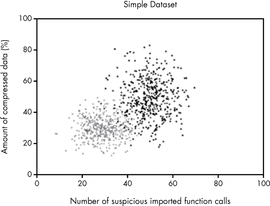

*图 6-1：我们将在本章中使用的样本数据集的图示，其中灰色点为良性软件，黑色点为恶意软件*

图 6-1 中显示的二维空间是由我们的两个特征定义的，它是我们样本数据集的特征空间。你可以看到一个明显的模式，黑色的点（恶意软件）通常位于空间的右上部分。一般来说，这些点的导入函数调用比良性软件更多，压缩数据也更多，而良性软件主要分布在图表的左下部分。假设在查看完这个图表后，你被要求仅根据我们在这里使用的两个特征来创建一个恶意软件检测系统。基于数据，似乎很明显，你可以制定如下规则：如果一个二进制文件同时具有大量压缩数据和大量可疑导入函数调用，它是恶意软件；如果既没有大量可疑导入调用，也没有太多压缩数据，它就是良性软件。

从几何学角度来看，我们可以将这个规则可视化为一条对角线，将恶意软件样本与良性软件样本在特征空间中分开，使得具有足够压缩数据和导入函数调用的二进制文件（定义为恶意软件）位于线的上方，而其余的二进制文件（定义为良性软件）位于线的下方。图 6-2 展示了这样一条线，我们称之为决策边界。

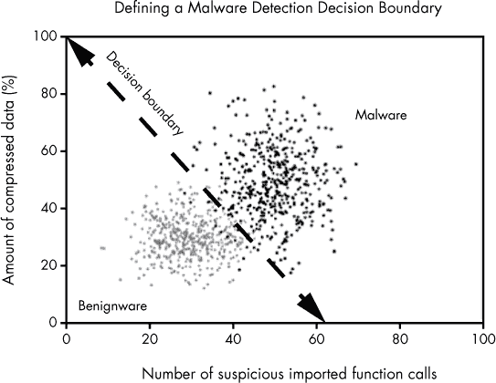

*图 6-2：通过我们样本数据集绘制的决策边界，用于定义恶意软件检测规则*

从这条线可以看出，*大多数*黑色（恶意软件）点位于边界的一侧，*大多数*灰色（良性软件）样本位于决策边界的另一侧。请注意，无法绘制一条将*所有*样本完全分开的线，因为这个数据集中的黑色和灰色云团是重叠的。但是通过查看这个例子，我们可以看出我们绘制的这条线在大多数情况下会正确分类新的恶意软件样本和良性软件样本，前提是它们遵循图中数据所显示的模式。

在图 6-2 中，我们手动绘制了一个决策边界。那么如果我们想要一个更精确的决策边界，并希望以自动化的方式进行处理呢？这正是机器学习所做的事情。换句话说，所有的机器学习检测算法都会查看数据，并使用自动化过程来确定理想的决策边界，以便最大限度地提高正确检测新数据、之前未见数据的机会。

让我们来看一下一个常见的机器学习算法如何识别在图 6-3 中显示的样本数据中的决策边界。这个示例使用了一种名为逻辑回归的算法。

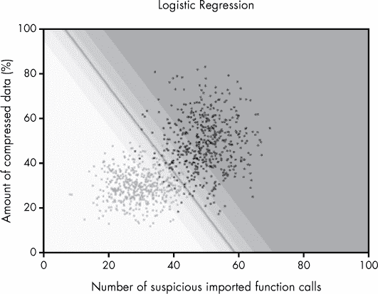

*图 6-3：通过训练逻辑回归模型自动创建的决策边界*

请注意，我们使用的是之前图表中相同的样本数据，其中灰点表示良性软件，黑点表示恶意软件。图中通过中心的线是逻辑回归算法通过观察数据*学习*到的决策边界。在线的右侧，逻辑回归算法将二进制文件是恶意软件的概率评估为大于 50%，而在线的左侧，则将二进制文件是恶意软件的概率评估为小于 50%。

现在请注意图表中的阴影区域。深灰色阴影区域是逻辑回归模型对文件是恶意软件非常有信心的区域。任何逻辑回归模型看到的新文件，只要其特征落在该区域内，应该具有较高的恶意软件概率。随着我们越来越接近决策边界，模型对文件是否是恶意软件或良性软件的信心越来越低。逻辑回归允许我们根据想要多积极地检测恶意软件，轻松地将决策边界向深色区域移动或向浅色区域移动。例如，如果我们将它向下移动，我们会捕捉到更多的恶意软件，但会增加误报。如果我们将它向上移动，我们会捕捉到更少的恶意软件，但会减少误报。

我想强调的是，逻辑回归和所有其他机器学习算法都可以在任意高维的特征空间中运行。图 6-4 展示了逻辑回归在稍高维度的特征空间中的工作原理。

在这个高维空间中，决策边界不再是直线，而是一个*平面*，它将三维空间中的点分开。如果我们转到四维或更多维度，逻辑回归将创建一个*超平面*，它是一个*n*维的平面状结构，将高维空间中的恶意软件点和良性软件点分开。

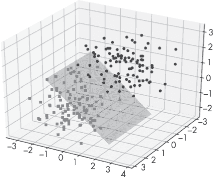

*图 6-4：逻辑回归创建的通过假设的三维特征空间的平面决策边界*

由于逻辑回归是一个相对简单的机器学习算法，它只能创建简单的几何决策边界，如直线、平面和更高维度的平面。其他机器学习算法可以创建更复杂的决策边界。举个例子，考虑图 6-5 所示的决策边界，它是由 k 最近邻算法（我稍后会详细讨论）给出的。

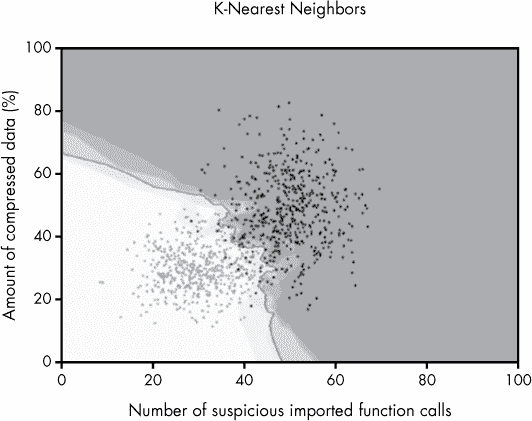

*图 6-5：由 k 最近邻算法创建的决策边界*

如你所见，这个决策边界不是平面，而是一个高度不规则的结构。同时需要注意的是，一些机器学习算法可以生成不相交的决策边界，这些边界将特征空间中的某些区域定义为恶意区，而某些区域定义为良性区，即使这些区域不是连续的。图 6-6 展示了一个具有这种不规则结构的决策边界，使用了一个具有更复杂恶意软件和良性软件模式的不同样本数据集。

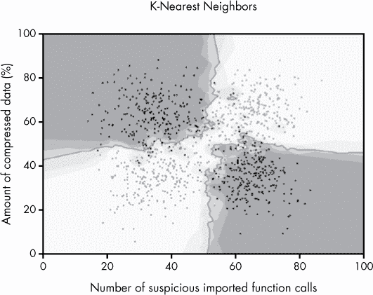

*图 6-6：由 k 最近邻算法创建的不相交决策边界*

尽管决策边界是不连续的，但在机器学习术语中，通常仍将这些不相交的决策边界称为“决策边界”。你可以使用不同的机器学习算法来表达不同类型的决策边界，这种表达能力的差异也是我们在某些项目中选择一种机器学习算法而非另一种的原因。

现在我们已经探讨了核心的机器学习概念，如特征空间和决策边界，接下来让我们讨论机器学习从业者所称的过拟合与欠拟合。

### 模型好坏的决定因素：过拟合与欠拟合

我不能过于强调过拟合与欠拟合在机器学习中的重要性。避免这两种情况是定义一个好的机器学习算法的标准。优秀、准确的检测模型能够捕捉到训练数据中关于区分恶意软件与良性软件的总体趋势，而不会被异常值或那些证明规则的例外所干扰。

欠拟合的模型忽略了异常值，但未能捕捉到总体趋势，导致在新数据和以前未见过的二进制文件上准确性较差。过拟合的模型被异常值干扰，方式与总体趋势无关，因此在以前未见过的二进制文件上也会产生较差的准确性。构建机器学习恶意软件检测模型的核心在于捕捉区分恶意与良性的软件的总体趋势。

我们通过图 6-7、6-8 和 6-9 中的欠拟合、拟合良好和过拟合模型的例子来说明这些术语。图 6-7 展示了一个欠拟合的模型。

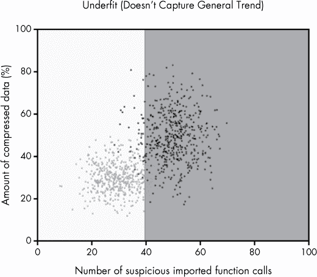

*图 6-7：欠拟合的机器学习模型*

在这里，你可以看到黑色的点（恶意软件）聚集在图的右上方区域，而灰色的点（良性软件）聚集在左下方。然而，我们的机器学习模型仅仅将这些点从中间划分，粗略地分隔数据，而没有捕捉到斜向的趋势。由于模型没有捕捉到整体趋势，我们称之为欠拟合。

还需要注意的是，模型在图的所有区域中仅给出两种确定性：要么阴影是深灰色，要么是白色。换句话说，模型要么完全确定特征空间中的点是恶意的，要么完全确定它们是良性的。无法正确表达确定性也是该模型欠拟合的一个原因。

让我们对比图 6-7 中的欠拟合模型与图 6-8 中的良拟合模型。

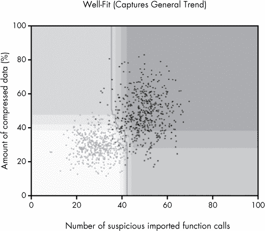

*图 6-8：良拟合的机器学习模型*

在这种情况下，模型不仅捕捉到了数据的整体趋势，还根据其对特征空间中哪些区域是明确恶意、明确良性或处于灰色区域的估计，创建了一个合理的确定性模型。

请注意，从图的顶部到底部的决策线。模型有一个简单的理论来区分恶意软件和良性软件：在图的中间有一条垂直线和一个对角切口。同时请注意图中的阴影区域，它告诉我们模型仅确定图右上方的区域是恶意软件，并且仅确定图左下角的二进制文件是良性软件。

最后，让我们对比下图中的过拟合模型图 6-9 与图 6-7 中看到的欠拟合模型，以及图 6-8 中的良拟合模型。

图 6-9 中的过拟合模型未能捕捉到数据的整体趋势。相反，它过度关注数据中的例外情况，包括发生在灰色点（良性训练样本）聚集中的少量黑点（恶意软件训练样本），并围绕它们画出决策边界。同样，它也关注在恶意软件聚集中的少数良性软件样本，并围绕它们画出边界。

这意味着当我们看到新的、以前未见过的二进制文件，并且它们恰好具有将它们置于这些异常值附近的特征时，机器学习模型会认为它们是恶意软件，而它们几乎肯定是良性软件，反之亦然。实际上，这意味着该模型的准确性不会达到它应有的水平。

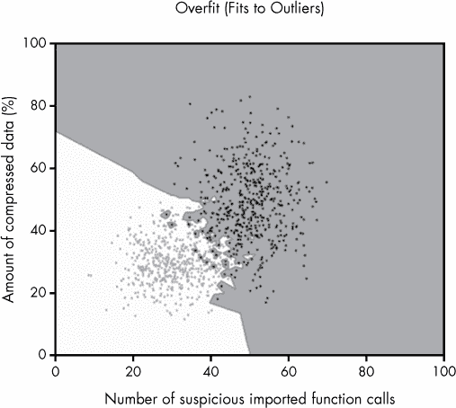

*图 6-9：过拟合的机器学习模型*

### 主要类型的机器学习算法

到目前为止，我已经用非常概括的方式讨论了机器学习，涉及了两种机器学习方法：逻辑回归和 k 近邻。在本章的剩余部分，我们将更深入地探讨逻辑回归、k 近邻、决策树和随机森林算法。我们在安全数据科学社区中经常使用这些算法。这些算法比较复杂，但它们背后的理念是直观且简单的。

首先，我们来看一下我们用来探索每种算法优缺点的样本数据集，见图 6-10。

我创建了这些数据集作为示例。在左侧，我们有我们的简单数据集，我已经在图 6-7、6-8 和 6-9 中使用过。在这种情况下，我们可以用简单的几何结构（如一条线）将黑色训练示例（恶意软件）与灰色训练示例（良性软件）分开。

右侧的数据集，我在图 6-6 中已经展示过，它之所以复杂，是因为我们无法仅用一条简单的线将恶意软件与良性软件区分开。但数据中仍然存在明显的模式：我们只需要使用更复杂的方法来创建决策边界。让我们看看不同算法在这两个样本数据集上的表现如何。

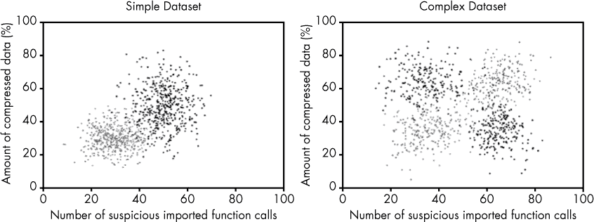

*图 6-10：我们在本章中使用的两个样本数据集，黑点表示恶意软件，灰点表示良性软件*

#### *逻辑回归*

如你之前所学，逻辑回归是一种机器学习算法，它创建一条线、一个平面或一个超平面（取决于你提供的特征数量），在几何上将训练数据中的恶意软件与良性软件分开。当你使用训练好的模型来检测新的恶意软件时，逻辑回归会检查一个先前未见过的二进制文件是否位于恶意软件的一侧还是良性软件的一侧，从而判断它是恶意的还是良性的。

逻辑回归的一个局限性是，如果你的数据无法通过简单的一条线或超平面分开，那么逻辑回归就不是正确的解决方案。你是否可以使用逻辑回归来解决你的问题，取决于你的数据和特征。例如，如果你的问题有许多单独的特征，而这些特征本身就是恶意性（或“良性”）的强指示器，那么逻辑回归可能是一个有效的方法。如果你的数据需要使用特征之间的复杂关系来判断文件是否是恶意软件，那么其他方法，比如 k 近邻、决策树或随机森林，可能会更合适。

为了说明逻辑回归的优缺点，我们来看看逻辑回归在我们的两个示例数据集上的表现，如图 6-11 所示。我们看到，逻辑回归在我们的简单数据集（左侧）上能有效地区分恶意软件和良性软件。相比之下，逻辑回归在我们复杂数据集（右侧）上的表现则不够理想。在这种情况下，逻辑回归算法变得困惑，因为它只能表示线性决策边界。你可以看到，线上两侧都有这两种二元类型，而阴影部分的灰色置信带与数据相比并没有多大意义。对于这个更复杂的数据集，我们需要使用一种能够表达更多几何结构的算法。

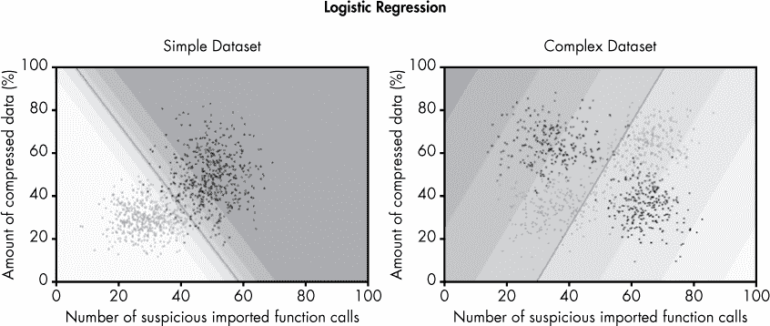

*图 6-11：使用逻辑回归绘制的决策边界，基于我们的示例数据集*

##### 逻辑回归背后的数学原理

现在让我们看看逻辑回归如何检测恶意软件样本背后的数学原理。清单 6-1 展示了用于计算一个二进制文件是否是恶意软件的逻辑回归的 Python 伪代码。

```
def logistic_regression(compressed_data, suspicious_calls, learned_parameters): ➊
compressed_data = compressed_data * learned_parameters["compressed_data_weight"] ➋
    suspicious_calls = suspicious_calls * learned_parameters["suspicious_calls_weight"]
score = compressed_data + suspicious_calls + bias ➌
    return logistic_function(score)

def logistic_function(score): ➍
    return 1/(1.0+math.e**(-score))
```

*清单 6-1：使用逻辑回归计算概率的伪代码*

让我们逐步分析代码，理解这意味着什么。我们首先定义`logistic_regression`函数➊及其参数。其参数是代表二进制特征（`compressed_data`和`suspicious_calls`）的特征，分别表示压缩数据的量和它所发出的可疑调用次数，`learned_parameters`参数表示通过在训练数据上训练逻辑回归模型所学到的逻辑回归函数元素。我将在本章稍后讨论这些参数是如何被学习的；现在，先接受它们是从训练数据中得出的。

然后，我们取`compressed_data`特征➋并将其乘以`compressed_data_weight`参数。这个权重根据逻辑回归函数判断该特征对恶意软件的指示性来调整特征的大小。请注意，权重也可以是负数，这表示逻辑回归模型认为该特征是文件为良性指示的标志。

在下方的那一行，我们对`suspicious_calls`参数执行相同的步骤。然后，我们将这两个加权特征相加 ➌，再加上一个称为`bias`的参数（也是从训练数据中学习到的）。总的来说，我们取`compressed_data`特征，按其与恶意性的相关性进行缩放，添加`suspicious_calls`特征，也按其与恶意性的相关性进行缩放，再加上`bias`参数，后者表示逻辑回归模型认为我们应该对文件的可疑性有多大的警觉性。通过这些加法和乘法操作，我们得到一个`score`，它表示一个给定文件是恶意的可能性。

最后，我们使用`logistic_function` ➍将我们的可疑性得分转换为概率。图 6-12 直观地展示了这个函数是如何工作的。

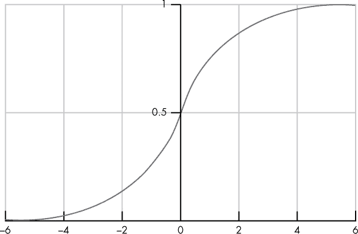

*图 6-12：逻辑回归中使用的逻辑函数的图示*

在这里，逻辑函数接受一个分数（显示在 x 轴上），并将其转换为一个介于 0 和 1 之间的值（即概率）。

##### 数学原理如何运作

让我们回到图 6-11 中看到的决策边界，看看这个数学是如何在实践中运作的。回想一下我们是如何计算我们的概率的：

```
logistic_function(feature1_weight * feature1 + feature2_weight*feature2 + bias)
```

例如，如果我们在图 6-11 中展示的特征空间的每个点上绘制结果概率，使用相同的特征权重和`bias`参数，我们最终会得到该图中显示的阴影区域，这些区域展示了模型“认为”恶意样本和良性样本的位置以及它的置信度。

如果我们设置一个阈值为 0.5（记住，当概率超过 50%时，文件被定义为恶意的），那么在图 6-11 中，线条就会作为我们的决策边界。我鼓励你实验我的示例代码，输入一些特征权重和偏差项，亲自试试。

**注意**

*逻辑回归并不局限于仅使用两个特征。实际上，我们通常使用逻辑回归来处理数十、数百甚至数千个特征。但数学原理并没有改变：我们只需按照以下方式计算任何数量特征的概率：*

```
logistic_function(feature1 * feature1_weight + feature2 * feature2_weight +
feature3 * feature3_weight ... + bias)
```

那么，逻辑回归是如何根据训练数据将决策边界放置在正确的位置的呢？它使用一种基于微积分的迭代方法，称为*梯度下降*。我们在本书中不会深入探讨这种方法的细节，但基本的思路是：无论使用的是线、平面还是超平面（这取决于你使用的特征数量），它都会通过迭代调整，最大化逻辑回归模型在训练集中的数据点是否为恶意样本或良性样本时给出正确答案的概率。

你可以训练逻辑回归模型，调整逻辑回归学习算法，以便得出关于什么构成恶意软件和良性软件的更简单或更复杂的理论。这些训练方法超出了本书的范围，但如果你有兴趣了解这些有用的方法，我鼓励你在谷歌上搜索“逻辑回归与正则化”，并在线阅读相关解释。

##### 何时使用逻辑回归

逻辑回归相对于其他机器学习算法有明显的优缺点。逻辑回归的一个优点是可以轻松解释逻辑回归模型认为构成良性软件和恶意软件的标准。例如，我们可以通过查看模型的特征权重来理解一个给定的逻辑回归模型。权重较高的特征是模型认为恶意的特征，负权重的特征则是模型认为良性的特征。逻辑回归是一种相对简单的方法，当你所处理的数据中包含明确的恶意指示时，它可以很好地工作。但当数据更复杂时，逻辑回归往往会失败。

现在让我们探讨另一种简单的机器学习方法，它可以表示更复杂的决策边界：k-近邻算法。

#### *K-近邻算法*

k-近邻算法是一种基于这样一个思想的机器学习算法：如果一个二进制文件在特征空间中接近其他恶意的二进制文件，那么它就是恶意的；如果它的特征使得它接近良性二进制文件，那么它必须是良性的。更准确地说，如果与一个未知二进制文件最接近的*k*个二进制文件中的大多数是恶意的，那么该文件就是恶意的。请注意，*k*表示我们自己定义的邻居数量，取决于我们认为在确定样本是否是恶意或良性时，应该考虑多少个邻居。

在现实世界中，这个方法是直观的。例如，如果你有一个包含篮球运动员和乒乓球运动员的体重和身高数据集，篮球运动员的体重和身高很可能彼此更接近，而不是和乒乓球运动员的数据接近。类似地，在安全领域，恶意软件通常与其他恶意软件具有相似的特征，而良性软件则通常与其他良性软件有相似的特征。

我们可以将这个思想转化为 k-近邻算法，使用以下步骤计算二进制文件是否是恶意的或良性的：

1.  提取二进制文件的特征，并在特征空间中找到与其最接近的*k*个样本。

1.  将接近样本的恶意软件样本数量除以*k*，以获得最近邻中恶意的比例。

1.  如果足够多的样本是恶意的，则将该样本定义为恶意的。

图 6-13 展示了 k-近邻算法的高层次工作原理。

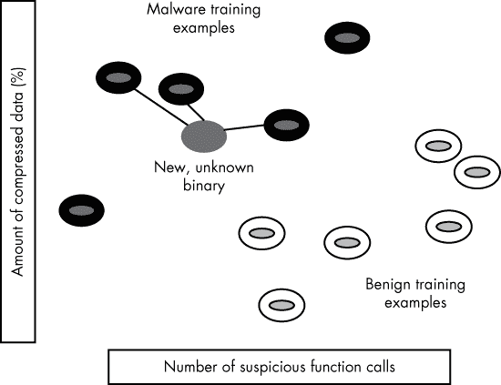

*图 6-13：k-最近邻用于检测之前未见过的恶意软件的示意图*

我们看到左上角是一组恶意软件的训练样本，右下角是一组良性软件的样本。我们还看到一个新的未知二进制文件，它与其三个最近的邻居相连。在这种情况下，我们将 *k* 设置为 3，这意味着我们正在查看未知二进制文件的三个最近邻居。由于这三个最近邻居都是恶意的，我们会将这个新二进制文件分类为恶意的。

##### K-最近邻背后的数学原理

现在让我们讨论一下使我们能够计算新未知二进制特征与训练集中的样本之间距离的数学原理。我们使用一个*距离函数*来实现这一点，它告诉我们新样本与训练集样本之间的距离。最常见的距离函数是*欧几里得距离*，即我们特征空间中两点之间最短路径的长度。列表 6-2 显示了我们样本二维特征空间中欧几里得距离的伪代码。


*列表 6-2：编写* euclidean_distance *函数的伪代码*

让我们一起来看看这段代码中的数学是如何工作的。列表 6-2 通过计算一对样本之间基于特征差异的距离来工作。首先，调用者传入二进制特征 ➊，其中 `compression1` 是第一个样本的压缩特征，`suspicious_calls1` 是第一个样本的 `suspicious_calls` 特征，`compression2` 是第二个样本的压缩特征，`suspicious_calls2` 是第二个样本的可疑呼叫特征。

然后我们计算每个样本的压缩特征之间的平方差 ➋，并计算每个样本的可疑呼叫特征之间的平方差 ➌。我们不会在此讨论为什么使用平方距离，但需要注意的是，结果差异始终为正数。最后，我们计算这两个差异的平方根，它就是两个特征向量之间的欧几里得距离，并将其返回给调用者 ➍。虽然也有其他计算样本之间距离的方法，但欧几里得距离是 k-最近邻算法中最常用的，它在安全数据科学问题中表现良好。

##### 选择投票的邻居数量

现在让我们看看 k-最近邻算法在本章中使用的样本数据集上产生的决策边界和概率。在图 6-14 中，我将 *k* 设置为 5，因此允许 5 个最接近的邻居进行“投票”。

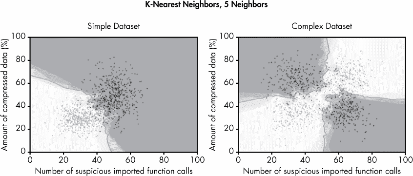

*图 6-14：当* k *设置为 5 时，k-最近邻创建的决策边界*

但是在图 6-15 中，我将 *k* 设置为 50，允许 50 个最接近的邻居进行“投票”。


*图 6-15：当 k 设置为 50 时，k 近邻算法创建的决策边界*

请注意，模型在不同邻居投票数的情况下差异明显。图 6-14 中的模型展示了一个复杂、曲折的决策边界，适用于两个数据集，这个模型是过拟合的，因为它在异常值周围画出了局部的决策边界，但又是欠拟合的，因为它未能捕捉到简单的、普遍的趋势。相比之下，图 6-15 中的模型非常适合这两个数据集，因为它没有被异常值干扰，能够清晰地识别出一般趋势。

正如你所看到的，k 近邻算法能够生成比逻辑回归更复杂的决策边界。我们可以通过调整*k*（即投票判断样本是恶意还是良性的邻居数目）来控制决策边界的复杂度，从而防止过拟合和欠拟合。而图 6-11 中的逻辑回归模型完全判断错误，k 近邻算法则能很好地区分恶意软件和良性软件，尤其是当我们让 50 个邻居参与投票时。由于 k 近邻算法不受线性结构的限制，它只是通过查看每个点的最近邻居来做出决策，因此它能够创建具有任意形状的决策边界，从而更有效地建模复杂的数据集。

##### 何时使用 K 近邻算法

K 近邻算法是一个值得考虑的好算法，尤其是当你的数据中，特征无法直接映射到可疑性概念时，但接近恶意样本却能强烈指示恶意性。例如，如果你试图将恶意软件按代码相似度划分为不同的家族，k 近邻算法可能是一个不错的选择，因为你希望将一个恶意软件样本分类到某个家族中，如果它的特征与该家族中的已知成员相似的话。

使用 k 近邻算法的另一个原因是，它能够清楚地解释*为什么*它做出了某个分类决策。换句话说，它很容易识别和比较样本与未知样本之间的相似性，从而弄清楚算法为什么将其分类为恶意软件或良性软件。

#### *决策树*

决策树是另一种常用于解决检测问题的机器学习方法。决策树通过训练过程自动生成一系列问题，以决定某个二进制文件是否为恶意软件，类似于“二十个问题”游戏。图 6-16 展示了我通过对本章使用的简单数据集进行训练，自动生成的决策树。让我们按照树中逻辑的流程来分析。

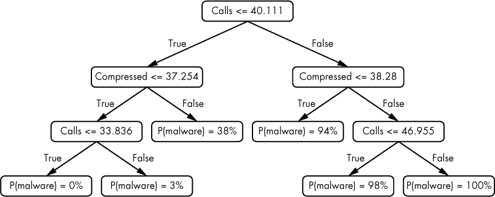

*图 6-16：为我们的简单数据集示例学习到的决策树*

决策树的流程开始时，我们将从一个新的、之前未见过的二进制文件中提取的特征输入到树中。然后，树定义出一系列问题来询问这个二进制文件的特征。树顶端的框，我们称之为*节点*，提出第一个问题：树中的可疑调用次数是否小于或等于 40.111？请注意，决策树在这里使用浮动小数点数字，因为我们已将每个二进制文件中的可疑调用次数归一化到 0 到 100 之间的范围。如果答案是“是”，我们接着问另一个问题：文件中压缩数据的百分比是否小于或等于 37.254？如果答案是“是”，我们继续问下一个问题：二进制文件中的可疑调用次数是否小于或等于 33.836？如果答案是“是”，我们就到达了决策树的终点。此时，二进制文件是恶意软件的概率为 0%。

图 6-17 展示了这个决策树的几何解释。

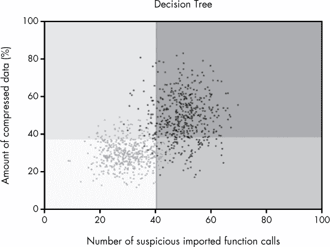

*图 6-17：决策树为我们的简单数据集示例创建的决策边界*

在这里，阴影区域表示决策树认为样本是恶意的地方。较亮的区域表示决策树认为样本是良性的地方。由图 6-16 中的一系列问题和答案所分配的概率应该与图 6-17 中的阴影区域相对应。

##### 选择一个好的根节点

那么我们如何使用机器学习算法从训练数据中生成像这样的决策树呢？基本的想法是，决策树从一个叫做*根节点*的初始问题开始。最好的根节点是那种对于一种类型的大部分（如果不是全部）样本，能得到“是”的答案，对于另一种类型的大部分（如果不是全部）样本，能得到“否”的答案。例如，在图 6-16 中，根节点问题询问一个之前未见过的二进制文件是否有 40.111 次或更少的调用。（请注意，这里每个二进制文件的调用次数已归一化为 0 到 100 的范围，使得浮动小数点值是有效的。）从图 6-17 中的垂直线可以看到，大部分良性数据的调用次数少于这个数字，而大部分恶意数据的调用次数则超过这个数目，这使得这个问题成为一个很好的初始问题。

##### 选择后续问题

选择了根节点之后，可以使用类似选择根节点时的方法来选择下一个问题。例如，根节点让我们将样本分成了两组：一组可疑调用次数小于或等于 40.111（负特征空间），另一组可疑调用次数大于 40.111（正特征空间）。为了选择下一个问题，我们只需要提出那些能够进一步区分每个特征空间区域内的恶意和良性训练样本的问题。

我们可以从图 6-16 和 6-17 中看到这一点。例如，图 6-16 显示，在我们提出有关可疑调用二进制文件数量的初始“根”问题后，我们会询问关于二进制文件中压缩数据量的问题。图 6-17 显示了我们为什么这么做的原因：在我们提出关于可疑函数调用的第一个问题之后，图中有一个粗略的决策边界，将大多数恶意软件与大多数良性软件分开。我们如何通过提出后续问题来进一步细化决策边界呢？从图中可以清楚地看到，接下来最好的问题是关于二进制文件中压缩数据量的问题，它将进一步细化我们的决策边界。

##### 何时停止提问

在我们创建决策树的过程中，某个时刻我们需要决定决策树何时停止提问，并仅根据我们对答案的确信程度来判断一个二进制文件是良性还是恶意的。一种方法是简单地限制决策树可以提出的问题数量，或者限制其*深度*（即我们可以对任何二进制文件提出的最大问题数）。另一种方法是允许决策树继续生长，直到我们完全确定训练集中每个示例是恶意软件还是良性软件。

限制树的大小的优势在于，如果树更简单，我们就有更大的机会得出正确的答案（想想奥卡姆剃刀——越简单的理论越好）。换句话说，如果我们保持树的简洁，决策树就更不容易过拟合训练数据。

相反，如果我们*欠拟合*训练数据，允许树长到最大尺寸可能会很有用。例如，允许树进一步生长会增加决策边界的复杂度，而如果我们欠拟合的话，这正是我们想要的。一般来说，机器学习从业者通常会尝试多个深度，或者允许树在以前未见过的二进制文件上达到最大深度，并重复这个过程，直到获得最准确的结果。

##### 使用伪代码探索决策树生成算法

现在让我们来看看一个自动化的决策树生成算法。你已经了解，这个算法背后的基本思想是通过找到最能增加我们对训练样本是否为恶意或良性的确信度的问题来创建树的根节点，然后再找到后续的问题，以进一步增加我们的确信度。一旦算法对训练样本的确信度超过了我们事先设定的某个阈值，它就应该停止提问并做出决策。

在程序上，我们可以递归地执行这一过程。清单 6-3 中的类 Python 伪代码以简化形式展示了构建决策树的完整过程。

```
   tree = Tree()
   def add_question(training_examples):
    ➊ question = pick_best_question(training_examples)
    ➋ uncertainty_yes,yes_samples=ask_question(question,training_examples,"yes")
    ➌ uncertainty_no,no_samples=ask_question(question,training_examples,"no")
    ➍ if not uncertainty_yes < MIN_UNCERTAINTY:
          add_question(yes_samples)
    ➎ if not uncertainty_no < MIN_UNCERTAINTY:
          add_question(no_samples)
➏ add_question(training_examples)
```

*清单 6-3：构建决策树算法的伪代码*

伪代码递归地向决策树添加问题，从根节点开始，一直到算法确信决策树可以提供一个高度确定的答案，来判断一个新文件是良性还是恶意。

当我们开始构建树时，我们使用`pick_best_question()`来选择我们的根节点 ➊（暂时不必担心这个函数如何工作）。然后，我们查看对于那些我们对初始问题回答“是”的训练样本，现在我们有多少不确定性 ➋。这将帮助我们决定是否需要继续对这些样本提问，或者我们是否可以停止，并预测这些样本是恶意的还是良性的。我们对那些我们对初始问题回答“否”的样本做同样的事情 ➌。

接下来，我们检查对于那些我们回答“是”（`uncertainty_yes`）的样本，其不确定性是否足够低，以决定它们是恶意的还是良性的 ➍。如果我们此时能确定它们是恶意的还是良性的，我们就不再提出其他问题。但是如果不能，我们会再次调用`add_question()`，使用`yes_samples`（即我们回答“是”的样本数量）作为输入。这是*递归*的经典例子，递归是一种调用自身的函数。我们使用递归对训练样本的子集执行与根节点相同的过程。接下来的`if`语句对我们的“否”样本执行相同的操作 ➎。最后，我们对我们的训练样本调用决策树构建函数 ➏。

`pick_best_question()`的具体工作原理涉及一些超出本书范围的数学内容，但其思路很简单。为了在决策树构建过程中任何时刻选择最佳问题，我们查看我们仍然不确定的训练样本，列举出可以对它们提出的所有问题，然后选择最能减少我们对这些样本是恶意软件还是良性软件的不确定性的问题。我们使用一种叫做*信息增益*的统计度量来衡量这种不确定性的减少。这种选择最佳问题的简单方法效果出奇地好。

**注意**

*这是一个简化的示例，展示了真实世界中决策树生成机器学习算法的工作方式。我省略了计算给定问题如何增加我们对文件是否为恶意的确定性的数学部分。*

现在让我们看看在本章中使用的两个示例数据集上决策树的表现。图 6-18 展示了决策树检测器学习到的决策边界。

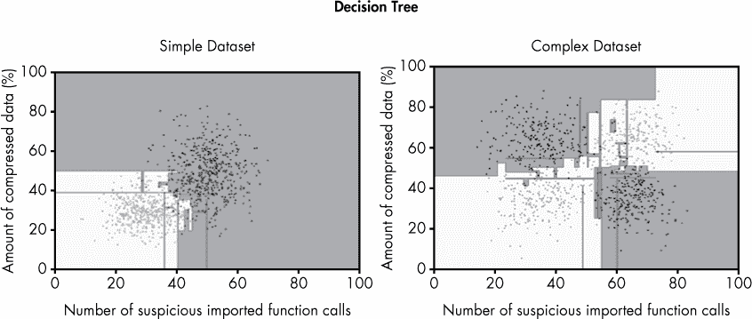

*图 6-18：我们示例数据集通过决策树方法生成的决策边界*

在这种情况下，我们不是为树设置最大深度，而是允许它们生长到没有假阳性或假阴性，相对于训练数据而言，每个训练样本都能被正确分类的位置。

请注意，决策树只能在特征空间中绘制水平和垂直线，即使当看起来曲线或对角线可能更合适时也是如此。这是因为决策树仅允许我们在单个特征上表达简单的条件（例如，大于或等于、小于或等于），这总是导致水平或垂直线。

你还可以看到，尽管这些示例中的决策树成功地将良性软件与恶意软件分开，但决策边界看起来非常不规则，并且存在奇怪的伪影。例如，恶意软件区域以奇怪的方式扩展到良性软件区域，反之亦然。从积极的一面来看，决策树在为复杂数据集创建决策边界方面远远优于逻辑回归。

现在让我们将图 6-18 中的决策树与图 6-19 中的决策树模型进行比较。

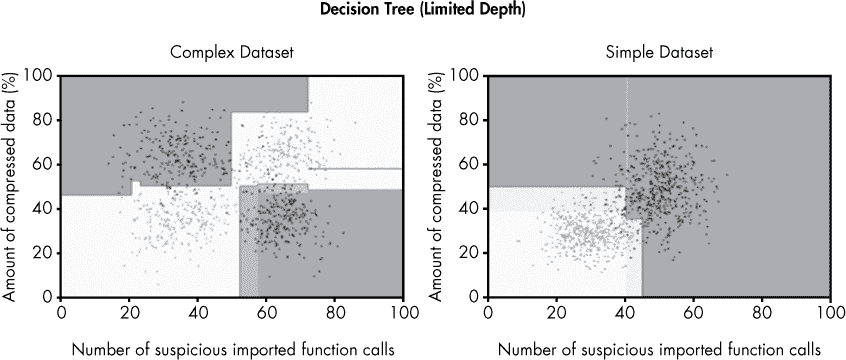

*图 6-19：由有限深度决策树生成的示例数据集的决策边界*

图 6-19 中的决策树使用了与图 6-18 中相同的决策树生成算法，唯一的区别是我将树的深度限制为五个节点。这意味着，对于任何给定的二叉树，我最多可以问五个关于其特征的问题。

结果非常显著。虽然图 6-18 中显示的决策树模型明显是过拟合的，专注于异常值并绘制出过于复杂的边界，未能捕捉到总体趋势，图 6-19 中的决策树则更加优雅地拟合了数据，在两个数据集中识别出了一个普遍的模式，而没有专注于异常值（唯一的例外是简单数据集右上方较窄的决策区域）。正如你所看到的，选择一个合适的最大决策树深度对你的基于决策树的机器学习检测器有很大影响。

##### 何时使用决策树

由于决策树既具有表现力又简单，它们可以通过简单的是或否问题来学习简单的以及高度不规则的边界。我们还可以设置最大深度，以控制它们对恶意软件与良性软件的理解应该有多简单或多复杂。

不幸的是，决策树的缺点是它们通常无法生成非常准确的模型。造成这种情况的原因很复杂，但与决策树表达不规则决策边界的事实有关，这些边界不能很好地拟合训练数据，也不能很好地推广到先前未见过的示例。

同样，决策树通常不会在其决策边界周围学习到准确的概率。我们可以通过检查图 6-19 中决策边界周围的阴影区域来看到这一点。衰减并不自然或渐进，且并没有在它应该发生的区域——恶意软件和良性软件样本重叠的地方发生。

接下来，我将讨论随机森林方法，它结合了多棵决策树以获得更好的结果。

#### *随机森林*

尽管安全社区在恶意软件检测中大量依赖决策树，但他们几乎从不单独使用它们。相反，成百上千棵决策树会联合起来，通过一种叫做*随机森林*的方法进行检测。我们不是训练一棵决策树，而是训练许多，通常是一百棵或更多，但我们以不同的方式训练每棵决策树，使其对数据有不同的看法。最后，为了决定一个新的二进制文件是恶意还是良性，我们让这些决策树进行投票。一个二进制文件是恶意软件的概率是正投票数除以总树数。

当然，如果所有的决策树完全相同，它们将会做出相同的投票，随机森林将简单地复制个别决策树的结果。为了解决这个问题，我们希望决策树对什么构成恶意软件和良性软件有不同的看法，我们使用接下来要讨论的两种方法，将这种多样性引入我们的决策树集合中。通过引入多样性，我们在模型中产生了“集体智慧”的动态，通常会导致一个更准确的模型。

我们使用以下步骤来生成随机森林算法：

1.  训练：对于我们计划生成的每棵树（通常是 100 棵或更多）

    +   从我们的训练集中随机抽取一些训练样本。

    +   从随机样本中建立一棵决策树。

    +   对于我们建立的每棵树，每次我们考虑“提问”时，只考虑向少数特征提问，忽略其他特征。

1.  对一个以前未见过的二进制文件进行检测

    +   对每棵树在二进制文件上进行检测。

    +   根据投票“是”的树的数量决定二进制文件是否为恶意软件。

为了更详细地理解这一点，让我们查看使用随机森林方法在我们两个示例数据集上生成的结果，如图 6-20 所示。这些结果是使用 100 棵决策树生成的。

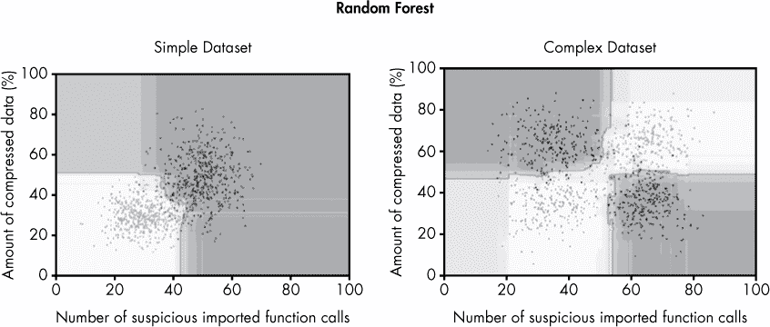

*图 6-20：使用随机森林方法创建的决策边界*

与图 6-18 和图 6-19 中显示的单个决策树结果相比，随机森林能够为简单和复杂的数据集表达更平滑、更直观的决策边界。实际上，随机森林模型对训练数据集的拟合非常干净，没有任何锯齿边缘；该模型似乎已经学到了关于“恶意与良性”构成的良好理论，适用于这两个数据集。

此外，阴影区域是直观的。例如，离良性或恶意样本越远，随机森林对于样本是恶意还是良性的判断越不确定。这对随机森林在未见过的二进制文件上的表现预示着积极的前景。事实上，正如你将在下一章看到的，随机森林是所有本章讨论的方法中在未见过的二进制文件上表现最好的模型。

为了理解为什么随机森林相比单个决策树能够画出如此干净的决策边界，让我们思考一下这 100 棵决策树在做什么。每棵树只看到大约三分之二的训练数据，并且每当它做出关于要问什么问题的决策时，只会考虑一个随机选择的特征。这意味着在幕后，我们有 100 个不同的决策边界，这些边界被*平均*以创建示例中的最终决策边界（以及阴影区域）。这种“集体智慧”的动态创造了一个能够识别数据趋势的汇聚意见，比单个决策树能够以更复杂的方式识别数据趋势。

### 总结

在本章中，你获得了基于机器学习的恶意软件检测的高层次介绍，以及机器学习的四种主要方法：逻辑回归、k 近邻、决策树和随机森林。基于机器学习的检测系统可以自动化编写检测签名的工作，并且在实践中，它们通常比手写签名表现得更好。

在接下来的章节中，我将向你展示这些方法在实际恶意软件检测问题中的表现。具体而言，你将学习如何使用开源的机器学习软件构建机器学习检测器，以准确地将文件分类为恶意或良性，并且如何使用基本统计学来评估你的检测器在之前未见过的二进制文件上的表现。
