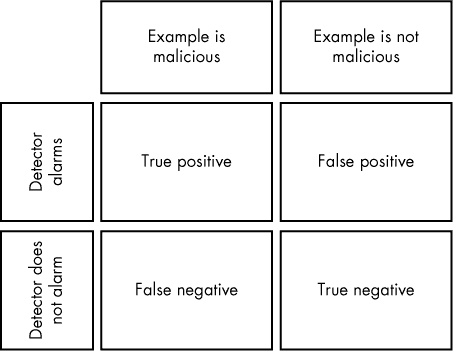
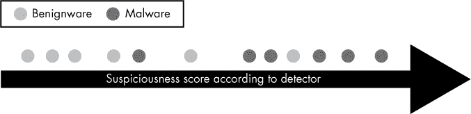
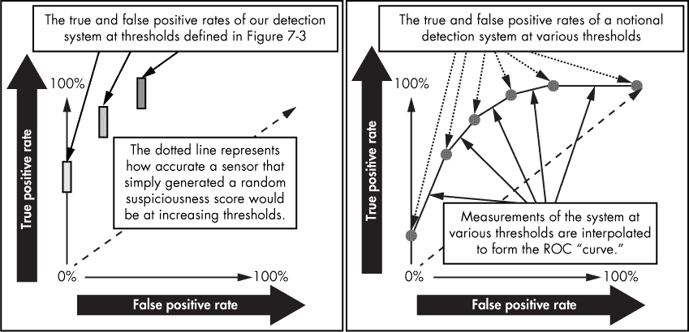
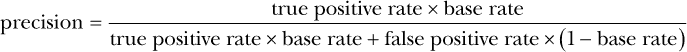

## 第七章：**评估恶意软件检测系统**

在上一章中，你学习了机器学习如何帮助你构建恶意软件检测器。在本章中，你将学习预测恶意软件检测系统性能所需的基本概念。你在这里学到的概念对于改进你构建的任何恶意软件检测系统至关重要，因为如果没有衡量系统性能的方法，你将无法知道如何改进它。请注意，虽然本章致力于介绍基本的评估概念，第八章将继续这一话题，介绍诸如交叉验证等重要评估概念。

首先，我介绍了检测准确性评估的基本概念，然后我介绍了在评估系统性能时，关于你部署系统的环境的更高级的概念。为此，我将带你通过一个假设的恶意软件检测系统的评估。

### 四种可能的检测结果

假设你在一个软件二进制文件上运行恶意软件检测系统，并得到系统关于该二进制文件是否恶意的“判断”。如图 7-1 所示，可能出现四种结果。

*图 7-1：四种可能的检测结果*

这些结果可以定义如下：

**真阳性** 二进制文件是恶意软件，系统说它是恶意软件。

**假阴性** 二进制文件是恶意软件，但系统说它不是恶意软件。

**假阳性** 二进制文件不是恶意软件，但系统说它是恶意软件。

**真阴性** 二进制文件不是恶意软件，系统也说它不是恶意软件。

如你所见，恶意软件检测系统可能产生不准确结果的两种情况：假阴性和假阳性。实际上，真阳性和真阴性结果是我们希望得到的，但通常很难获得。

你将在本章中看到这些术语。事实上，大多数检测评估理论都是建立在这一简单词汇基础上的。

#### *真阳性和假阳性率*

现在假设你想使用一组良性软件和恶意软件来测试检测系统的准确性。你可以在每个二进制文件上运行检测器，并记录整个测试集中检测器给出的四种可能结果。在这一点上，你需要一些总结统计量，以便整体了解系统的准确性（即，系统生成假阳性或假阴性的可能性有多大）。

其中一个总结统计量是检测系统的*真阳性率*，你可以通过将测试集中真阳性的数量除以测试集中恶意软件样本的总数来计算它。因为这计算了系统能够检测到的恶意软件样本的百分比，因此它衡量了系统在“看到”恶意软件时识别恶意软件的能力。

然而，仅仅知道检测系统在看到恶意软件时会触发警报，仍然不足以评估其准确性。例如，如果你只使用真正正例率作为评估标准，一个简单的函数，针对所有文件都说“是的，这是恶意软件”，将会产生一个完美的真正正例率。检测系统的真正考验在于它是否在看到恶意软件时说“是的，这是恶意软件”，而在看到良性软件时说“不是，这不是恶意软件”。

为了衡量一个系统判断某个文件是否为恶意软件的能力，你还需要衡量系统的*假正例率*，即系统在看到良性软件时错误地触发恶意软件警报的频率。你可以通过将系统标记为恶意软件的良性样本数量除以测试的所有良性样本的总数来计算系统的假正例率。

#### *真正正例率与假正例率之间的关系*

在设计一个检测系统时，你希望尽可能降低假正例率，同时尽可能提高真正正例率。除非你构建一个真正完美的恶意软件检测系统，它永远不会出错（但考虑到恶意软件的不断演化，这实际上是不可能的），否则在追求高真正正例率和低假正例率之间总会存在矛盾。

为了理解为什么会这样，假设有一个检测系统，在决定某个二进制文件是否是恶意软件之前，首先会将所有表明该二进制文件是恶意软件的证据加起来，从而为该二进制文件生成一个*可疑性评分*。我们将这个假设的可疑性评分生成系统称为 MalDetect。图 7-2 展示了 MalDetect 可能为 12 个示例二进制文件输出的值，其中圆圈代表各个软件二进制文件。二进制文件距离右侧越远，MalDetect 给出的可疑性评分越高。

*图 7-2：假设的 MalDetect 系统为个别软件二进制文件输出的可疑性评分*

可疑性评分具有信息性，但为了计算 MalDetect 在我们文件上的真正正例率和假正例率，我们需要将 MalDetect 的可疑性评分转换为关于某个软件二进制文件是否为恶意软件的“是”或“否”答案。为此，我们使用一个阈值规则。例如，我们决定，如果可疑性评分大于或等于某个数字，则该二进制文件会触发恶意软件警报。如果评分低于阈值，则不会触发。

这种阈值规则是将可疑性评分转换为二进制检测选择的标准方法，但我们应该将阈值设置在哪里呢？问题在于没有正确答案。图 7-3 展示了这一困境：我们设置的阈值越高，假正例的可能性越低，但假负例的可能性则越高。

*图 7-3：决定阈值时假阳性率与真阳性率之间关系的示意图*

例如，我们考虑图 7-3 中显示的最左侧阈值，在这个阈值左侧的二进制文件被分类为良性，而右侧的则被分类为恶意软件。由于这个阈值较低，我们得到了很高的真阳性率（正确分类了 100%的恶意软件样本），但假阳性率却很差（错误地将 33%的良性样本分类为恶意）。

我们的直觉可能是提高阈值，使只有具有较高可疑性得分的样本才会被认为是恶意软件。这种解决方案由图 7-3 中的中间阈值给出。在这里，假阳性率下降到 0.17，但不幸的是，真阳性率也下降到 0.83。如果我们继续将阈值向右移动，如最右侧的阈值所示，我们消除了所有假阳性，但只检测到 50%的恶意软件。

如你所见，实际上并不存在完美的阈值。一个能够产生低假阳性率（好）的检测阈值通常会漏掉更多的恶意软件，从而导致较低的真阳性率（不好）。相反，使用一个具有较高真阳性率（好）的检测阈值也会提高假阳性率（不好）。

#### *ROC 曲线*

检测系统的真阳性率与假阳性率之间的权衡是所有检测器面临的普遍问题，不仅仅是恶意软件检测器。工程师和统计学家经过长时间的思考，提出了*接收器操作特性（ROC）*曲线来描述和分析这一现象。

**注意**

*如果你对“接收器操作特性”（Receiver Operating Characteristic）这个词感到困惑，不用担心——这个词的确令人困惑，它与 ROC 曲线最初被开发时的背景有关，即基于雷达的物体探测。*

ROC 曲线通过绘制不同阈值设置下的假阳性率与其相关的真阳性率，来表征检测系统。这有助于我们评估假阳性率与真阳性率之间的权衡，从而确定适合我们情况的“最佳”阈值。

例如，针对我们假设的 MalDetect 系统，在图 7-3 中，当假阳性率为 0 时（低阈值），系统的真阳性率为 0.5；当假阳性率为 0.33 时（高阈值），系统的真阳性率为 1.00。

图 7-4 展示了这个过程的更详细情况。

*图 7-4：ROC 曲线的含义及其构建方式的示意图*

为了构建 ROC 曲线，我们从图 7-3 中使用的三个阈值开始，绘制它们产生的假阳性率和真阳性率，这些数据展示在图 7-3 的左半部分。图 7-4 右侧的图显示了相同的内容，但涵盖了所有可能的阈值。正如你所看到的，假阳性率越高，真阳性率也越高。同样，假阳性率越低，真阳性率也越低。

ROC 曲线的“曲线”是二维 ROC 图中的一条线，表示我们认为检测系统在所有可能的假阳性值下的真阳性率表现，以及我们认为检测系统在所有可能的真阳性值下的假阳性率表现。生成这种曲线的方法有很多，但超出了本书的范围。

然而，一种简单的方法是尝试许多阈值，观察相应的假阳性率和真阳性率，绘制它们并用线连接这些点。这个连接的线，如图 7-4 右侧的图所示，便是我们的 ROC 曲线。

### 在评估中考虑基准率

正如你所看到的，ROC 曲线可以告诉你系统在将恶意二进制文件判定为恶意的速率（真阳性率）和将无害二进制文件判定为恶意的速率（假阳性率）方面的表现。然而，ROC 曲线并不能告诉你系统报警中有多少比例会是实际的真阳性，这就是我们所说的系统的*精确度*。系统的精确度与系统遇到的二进制文件中实际是恶意软件的比例相关，这就是我们所说的*基准率*。下面是每个术语的详细解释：

**精确度** 系统检测报警中真实阳性（即实际检测到的恶意软件）所占的比例。换句话说，*精确度*是检测系统的*真实阳性 /（真实阳性 + 假阳性）*，当它在一些二进制文件集上进行测试时的表现。

**基准率** 系统接收到的数据中符合我们需求的质量比例。在我们的例子中，*基准率*指的是*实际恶意软件*的二进制文件所占的百分比。

我们将在下一节讨论这两个指标之间的关系。

#### *基准率如何影响精确度*

尽管检测系统的真阳性率和假阳性率在基准率变化时不会改变，但系统的精确度会受到恶意软件基准率变化的影响——通常影响非常显著。为了理解这一点，我们来看以下两个案例。

假设 MalDetect 的假阳性率为 1%，真阳性率为 100%。现在假设我们将 MalDetect 部署在一个我们已经知道没有恶意软件的网络上（可能这个网络刚刚在实验室中创建）。因为我们事先知道网络中没有恶意软件，所以 MalDetect 发出的每一个警报都必定是一个假阳性，因为 MalDetect 遇到的唯一二进制文件将是良性软件。换句话说，精度将是 0%。

相比之下，如果我们将 MalDetect 运行在一个完全由恶意软件组成的数据集上，那么它的警报将永远不会是假阳性：由于数据集中没有良性软件，MalDetect 永远没有机会产生假阳性。因此，精度将是 100%。

在这两种极端情况下，基本比率对 MalDetect 的精度产生了巨大影响，或者说，它的警报是误报的概率。

#### *在部署环境中估算精度*

现在你知道，根据测试数据集中恶意软件的比例（基本比率），你的系统将产生非常不同的精度值。如果你想根据你部署环境中基本比率的估计来估算系统的精度，你只需使用你部署环境的估计基本比率来估算精度公式中的变量：*真阳性 / (真阳性 + 假阳性)*。你需要三个数字：

+   **真阳性率 (TPR)**，即系统正确检测到的恶意软件样本的比例

+   **假阳性率 (FPR)**，即系统错误报警的良性样本的比例

+   **二进制文件的基本比率 (BR)**，即你将使用该系统的二进制文件的比例（例如，你预计从盗版网站下载的二进制文件中有多少比例会是恶意软件，如果这是你使用系统的场景）

精度公式的分子——真阳性的数量——可以通过*真阳性率 × 基本比率*来估算，从而得出系统将正确检测到的恶意软件的比例。同样，公式的分母——即*(真阳性 + 假阳性)*——可以通过*真阳性率 × 基本比率 + 假阳性率 × (1 – 基本比率)*来估算，从而得出系统将报警的*所有*二进制文件的比例，通过计算将正确检测到的恶意软件二进制文件和产生假阳性的良性软件二进制文件的比例。

总结来说，你可以通过以下方式计算系统的预期精度：

让我们考虑另一个例子，看看基准率如何对检测系统的性能产生深远的影响。例如，假设我们有一个检测系统，它的真实正例率为 80%，假正例率为 10%，并且我们运行的 50%的软件二进制文件预计是恶意软件。这将导致预期精度为 89%。但是，当基准率为 10%时，我们的精度降至 47%。

如果我们的基准率非常低，会发生什么呢？例如，在现代企业网络中，实际上很少有软件二进制文件是恶意软件。使用我们的精度公式，如果假设基准率为 1%（100 个二进制文件中有 1 个是恶意软件），我们得到的精度大约为 7.5%，这意味着我们系统的 92.5%的警报将是误报！如果假设基准率为 0.1%（1000 个二进制文件中有 1 个可能是恶意软件），我们得到的精度为 1%，这意味着 99%的警报将是误报！最后，在基准率为 0.01%（10000 个二进制文件中有 1 个可能是恶意软件——这可能是企业网络中最现实的假设）时，我们的预期精度降至 0.1%，这意味着我们系统的大部分警报将是误报。

从这一分析中可以得出的一个结论是，具有高假正例率的检测系统在企业环境中几乎永远不会有用，因为它们的精度太低。因此，构建恶意软件检测系统的一个关键目标是最小化假正例率，使得系统的精度合理。

另一个相关的结论是，当你进行本章前面介绍的 ROC 曲线分析时，如果你正在开发一个将在企业环境中部署的系统，你应该有效地忽略假正例率超过 1%的情况，因为任何更高的假正例率都可能导致系统的精度低到无法使用的程度。

### 总结

在本章中，你学习了基本的检测评估概念，包括真实正例率、假正例率、ROC 曲线、基准率和精度。你了解了最大化真实正例率和最小化假正例率在构建恶意软件检测系统中的重要性。由于基准率对精度的影响，如果你想在企业环境中部署你的检测系统，减少假正例率尤其重要。

如果你对这些概念还不完全熟悉，不用担心。你将在下一章中获得更多的练习，在那时你将从头开始构建和评估一个恶意软件检测系统。在这个过程中，你将学习更多与机器学习相关的评估概念，这将帮助你改进基于机器学习的检测器。
