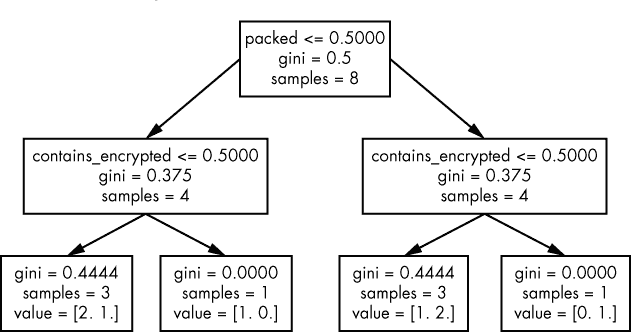
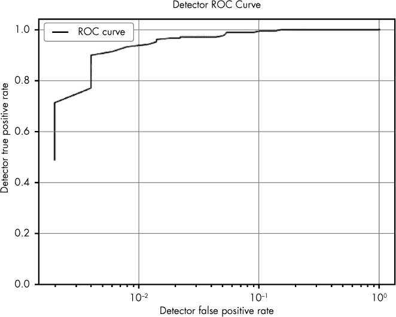
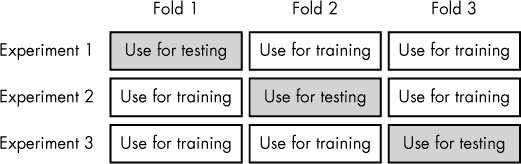
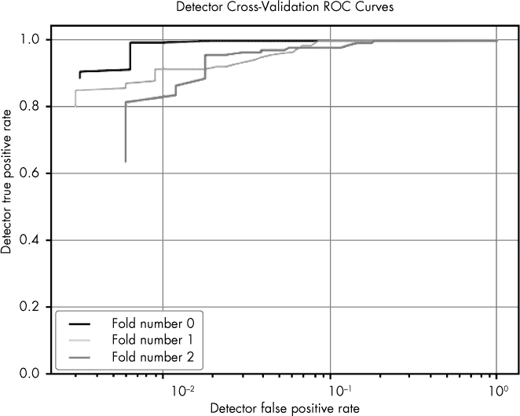

## 8

**构建机器学习检测器**


如今，得益于高质量的开源软件，它处理了实现机器学习系统的繁重数学工作，任何了解基本 Python 并掌握关键概念的人都可以使用机器学习。

在本章中，我将向你展示如何使用`scikit-learn`（我认为最受欢迎且最好的开源机器学习包）构建机器学习恶意软件检测系统。本章包含了大量的示例代码。主要的代码块可以在目录*malware_data_science/ch8/code*中访问，相应的示例数据可以在本书附带的代码和数据（以及虚拟机）中的目录*malware_data_science/ch8/data*中找到。

通过跟随文本、检查示例代码，并尝试提供的示例，你应该能够在本章结束时自信地构建和评估自己的机器学习系统。你还将学会构建一个通用的恶意软件检测器，并使用必要的工具为特定恶意软件家族构建恶意软件检测器。你在这里获得的技能将有广泛的应用，使你能够将机器学习应用于其他安全问题，比如检测恶意邮件或可疑的网络流量。

首先，你将学习在使用`scikit-learn`之前需要了解的术语和概念。接下来，你将使用`scikit-learn`实现一个基于你在第六章中学到的决策树概念的基本决策树检测器。然后，你将学习如何将特征提取代码与`scikit-learn`集成，构建一个使用真实世界特征提取和随机森林方法检测恶意软件的实际恶意软件检测器。最后，你将学习如何使用`scikit-learn`评估机器学习系统，并通过示例的随机森林检测器进行验证。

### 术语与概念

首先让我们回顾一下术语。开源库`scikit-learn`（简称`sklearn`）在机器学习社区中变得非常流行，因为它既强大又易于使用。许多数据科学家在计算机安全社区以及其他领域使用该库，许多人将其作为执行机器学习任务的主要工具箱。尽管`sklearn`不断更新，引入新的机器学习方法，但它提供了一个一致的编程接口，使得使用这些机器学习方法变得简单。

像许多机器学习框架一样，`sklearn` 需要以 *向量* 形式提供训练数据。向量是数字数组，其中数组的每个索引对应训练示例软件二进制文件的单个特征。例如，如果我们的机器学习检测器使用的软件二进制文件的两个特征是 `是否压缩` 和 `是否包含加密数据`，那么训练示例二进制文件的特征向量可能是 `[0,1]`。在这里，向量中的第一个索引表示二进制文件是否压缩，零表示“否”，第二个索引表示二进制文件是否包含加密数据，1 表示“是”。

向量的使用可能会有些麻烦，因为你需要记住每个索引映射到的特征。幸运的是，`sklearn` 提供了辅助代码，可以将其他数据表示形式转换为向量形式。例如，你可以使用 `sklearn` 的 `DictVectorizer` 类将训练数据的字典表示（例如 `{"is compressed":1,"contains encrypted data":0}`）转换为 `sklearn` 操作的向量表示形式，比如 `[0,1]`。之后，你可以使用 `DictVectorizer` 恢复向量索引与原始特征名称之间的映射关系。

要训练基于 `sklearn` 的检测器，您需要将两个独立的对象传递给 `sklearn`：特征向量（如前所述）和标签向量。*标签向量* 每个训练示例包含一个数字，在我们的例子中，这个数字表示示例是恶意软件还是良性软件。例如，如果我们将三个训练示例传递给 `sklearn`，然后传递标签向量 `[0,1,0]`，我们就在告诉 `sklearn` 第一个样本是良性软件，第二个样本是恶意软件，第三个样本是良性软件。根据惯例，机器学习工程师使用大写的 `X` 变量表示训练数据，使用小写的 `y` 变量表示标签。大小写的区别反映了数学中大写变量表示矩阵（我们可以将其视为向量数组），小写变量表示单个向量的惯例。你将在在线机器学习示例代码中看到这种惯例，在本书的后续部分，我也会使用这种惯例，以帮助你熟悉它。

`sklearn`框架使用了你可能会觉得陌生的其他术语。`sklearn`并不称机器学习基础的检测器为“检测器”，而是称其为“分类器”。在这个上下文中，术语*分类器*仅指一个将事物归类为两个或更多类别的机器学习系统。因此，*检测器*（这是我在本书中始终使用的术语）是分类器的一种特殊类型，将事物归入两个类别，比如恶意软件和良性软件。此外，`sklearn`的文档和 API 通常不使用*训练*这个术语，而是使用*fit*。例如，你会看到类似“使用训练示例拟合机器学习分类器”这样的句子，这相当于说“使用训练示例训练机器学习检测器”。

最后，在分类器的上下文中，`sklearn`并未使用*detect*这个术语，而是使用了*predict*这个术语。这个术语在`sklearn`的框架中，以及在更广泛的机器学习社区中被使用，当一个机器学习系统用于执行某个任务时，无论是预测一周后股票的价值，还是检测某个未知二进制文件是否为恶意软件。

### 构建一个基于决策树的玩具检测器

现在你已经熟悉了`sklearn`的技术术语，让我们创建一个简单的决策树，按照我们在第六章中讨论的内容，使用`sklearn`框架来实现。回想一下，决策树就像是在玩“20 个问题”的游戏，它会对输入向量提出一系列问题，以决定这些向量是恶意的还是良性的。我们将一步一步地构建一个决策树分类器，然后探讨一个完整程序的示例。清单 8-1 展示了如何从`sklearn`导入所需的模块。

```
from sklearn import tree
from sklearn.feature_extraction import DictVectorizer
```

*清单 8-1：导入* sklearn *模块*

我们导入的第一个模块是`tree`，这是`sklearn`的决策树模块。第二个模块是`feature_extraction`，它是`sklearn`的辅助模块，我们从中导入了`DictVectorizer`类。`DictVectorizer`类方便地将以可读字典形式提供的训练数据转换为`sklearn`所需的向量表示，以实际训练机器学习检测器。

在我们从`sklearn`导入所需模块之后，我们实例化了所需的`sklearn`类，如清单 8-2 所示。

```
classifier = ➊tree.DecisionTreeClassifier()
vectorizer = ➋DictVectorizer(sparse=➌False)
```

*清单 8-2：初始化决策树分类器和向量化器*

我们实例化的第一个类是`DecisionTreeClassifier` ➊，它代表了我们的检测器。尽管`sklearn`提供了许多参数来精确控制我们的决策树如何工作，但在这里我们没有选择任何参数，因此我们使用的是`sklearn`的默认决策树设置。

接下来我们实例化的类是`DictVectorizer` ➋。我们在构造函数中将`sparse`设置为`False` ➌，告诉`sklearn`我们不希望使用稀疏向量，尽管稀疏向量节省内存但操作复杂。由于`sklearn`的决策树模块不能使用稀疏向量，我们关闭了这个功能。

现在我们已经实例化了我们的类，可以初始化一些示例训练数据，如列表 8-3 所示。

```
   # declare toy training data
➊ training_examples = [
   {'packed':1,'contains_encrypted':0},
   {'packed':0,'contains_encrypted':0},
   {'packed':1,'contains_encrypted':1},
   {'packed':1,'contains_encrypted':0},
   {'packed':0,'contains_encrypted':1},
   {'packed':1,'contains_encrypted':0},
   {'packed':0,'contains_encrypted':0},
   {'packed':0,'contains_encrypted':0},
   ]
➋ ground_truth = [1,1,1,1,0,0,0,0]
```

*列表 8-3：声明训练向量和标签向量*

在这个例子中，我们初始化了两个结构——特征向量和标签向量——它们一起构成了我们的训练数据。特征向量被赋值给`training_examples`变量 ➊，以字典形式给出。如你所见，我们使用了两个简单的特征。第一个是`packed`，表示一个文件是否被打包，第二个是`contains_encrypted`，表示文件是否包含加密数据。标签向量被赋值给`ground_truth`变量 ➋，表示每个训练示例是恶意的还是良性的。在本书中，并且通常在安全数据科学家中，0 总是代表良性，1 总是代表恶意。在这种情况下，标签向量声明前四个特征向量是恶意的，后四个是良性的。

#### *训练你的决策树分类器*

现在我们已经声明了训练向量和标签向量，让我们通过调用决策树类实例的`fit`方法来训练我们的决策树模型，如列表 8-4 所示。

```
   # initialize the vectorizer with the training data
➊ vectorizer.fit(training_examples)
   # transform the training examples to vector form
➋ X = vectorizer.transform(training_examples)
   y = ground_truth # call ground truth 'y', by convention
```

*列表 8-4：用训练数据初始化* 向量化器 *类*

列表 8-4 中的代码首先初始化了我们在列表 8-2 中初始化的`vectorizer`类，通过调用`fit`方法 ➊。这里，`fit`方法告诉`sklearn`创建`packed`特征和`contains_encrypted`特征与向量数组索引之间的映射。然后，我们通过调用`vectorizer`类的`transform`方法 ➋，将基于字典的特征向量转换为数值向量形式。回想一下，我们将特征向量赋值给一个名为`X`的变量，将标签向量赋值给一个名为`y`的变量，这是机器学习领域中的命名约定。

现在我们的训练数据已经准备好，我们可以通过在决策树分类器实例上调用`fit`方法来训练我们的决策树检测器，如下所示：

```
# train the classifier (a.k.a. 'fit' the classifier)
classifier.fit(X,y)
```

正如你所看到的，训练`sklearn`检测器就这么简单。但在背后，`sklearn`正在通过算法过程来识别一个好的决策树，以便准确地检测新软件是恶意的还是良性的，这与我们在上一章讨论的算法思路相符。

现在我们已经训练好了检测器，接下来使用列表 8-5 中的代码来检测一个二进制文件是恶意的还是良性的。

```
   test_example = ➊{'packed':1,'contains_encrypted':0}
   test_vector = ➋vectorizer.transform(test_example)
➌ print classifier.predict(test_vector) # prints [1]
```

*列表 8-5：判断二进制文件是否恶意*

在这里，我们为一个假设的软件二进制文件实例化一个基于字典的特征向量➊，使用我们在代码中之前声明的`vectorizer`➋将其转换为数值向量形式，然后运行我们构建的决策树检测器➌，以确定该二进制文件是否恶意。当我们运行代码时，你会看到分类器“认为”该新二进制文件是恶意的（因为它的输出为“1”），当我们可视化决策树时，你将看到为什么会这样。

#### *决策树的可视化*

我们可以如清单 8-6 所示，直观地展示`sklearn`基于我们的训练数据自动创建的决策树。

```
# visualize the decision tree
with open(➊"classifier.dot","w") as output_file:
  ➋ tree.export_graphviz(
        classifier,
        feature_names=vectorizer.get_feature_names(),
        out_file=output_file
    )

import os
os.system("dot classifier.dot -Tpng -o classifier.png")
```

*清单 8-6：使用 GraphViz 创建决策树图像文件*

在这里，我们打开一个名为*classifier.dot*的文件➊，并使用`sklearn`的`tree`模块提供的`export_graphviz()`函数将决策树的网络表示写入该文件。然后，我们调用`tree.export_graphviz`➋将一个 GraphViz 的*.dot*文件写入*classifier.dot*，该文件将决策树的网络表示写入磁盘。最后，我们使用 GraphViz 的`dot`命令行程序创建一个图像文件，以可视化决策树，形式与第六章中学习的决策树相符。当你运行这个程序时，你应该会得到一个名为*classifier.png*的输出图像文件，像图 8-1 一样。



*图 8-1：决策树可视化*

尽管这个决策树的可视化在第六章中应该很熟悉，但它包含了一些新的词汇。每个框的第一行包含该节点提问的特征名称（在机器学习术语中，我们说节点“根据”该特征进行分裂）。例如，第一个节点根据特征“packed”进行分裂：如果二进制文件没有被打包，我们沿左箭头走；否则，我们沿右箭头走。

每个框中第二行的文本表示该节点的*基尼指数*，它衡量与该节点匹配的恶意软件和良性软件训练样本之间的不平等程度。基尼指数越高，匹配该节点的样本越倾向于恶意软件或良性软件。这意味着每个节点中较高的基尼指数是好的，因为训练样本越倾向于恶意软件或良性软件，我们就越确信新的测试样本是恶意的还是良性的。每个框中的第三行只给出了与该节点匹配的训练样本数量。

你会注意到，在决策树的叶节点中，框中的文本有所不同。这些节点不是“提问”，而是提供了“这个二进制文件是恶意的还是良性的？”这个问题的答案。例如，在最左边的叶节点中，我们看到“value = [2\. 1.]”，这意味着两个良性训练样本与此节点匹配（没有打包且没有加密），一个恶意软件训练样本与此节点匹配。也就是说，如果我们到达这个节点，我们会给这个二进制文件分配 33%的概率是恶意软件（1 个恶意样本 / 3 个样本总数 = 33%）。这些框中的基尼值显示了在我们根据直接引导到这些节点的问题进行拆分时，关于二进制文件是恶意软件还是良性软件所获得的信息量。如你所见，检查`sklearn`生成的决策树可视化图可以帮助我们理解决策树是如何做出检测的。

#### *完整示例代码*

列表 8-7 展示了我迄今为止描述的决策树工作流的完整代码。既然我们已经逐步解析过这段代码，它现在应该对你来说非常易读。

```
#!/usr/bin/python

# import sklearn modules
from sklearn import tree
from sklearn.feature_extraction import DictVectorizer

# initialize the decision tree classifier and vectorizer
classifier = tree.DecisionTreeClassifier()
vectorizer = DictVectorizer(sparse=False)

# declare toy training data
training_examples = [
{'packed':1,'contains_encrypted':0},
{'packed':0,'contains_encrypted':0},
{'packed':1,'contains_encrypted':1},
{'packed':1,'contains_encrypted':0},
{'packed':0,'contains_encrypted':1},
{'packed':1,'contains_encrypted':0},
{'packed':0,'contains_encrypted':0},
{'packed':0,'contains_encrypted':0},
]
ground_truth = [1,1,1,1,0,0,0,0]

# initialize the vectorizer with the training data
vectorizer.fit(training_examples)

# transform the training examples to vector form
X = vectorizer.transform(training_examples)
y = ground_truth # call ground truth 'y', by convention

# train the classifier (a.k.a. 'fit' the classifier)
classifier.fit(X,y)

test_example = {'packed':1,'contains_encrypted':0}
test_vector = vectorizer.transform(test_example)
print `classifier.predict(test_vector)` # prints [1]

#visualize the decision tree
with open("classifier.dot","w") as output_file:
    tree.export_graphviz(
        classifier,
        feature_names=vectorizer.get_feature_names(),
        out_file=output_file
    )

import os
os.system("dot classifier.dot -Tpng -o classifier.png")
```

*列表 8-7：完整的决策树工作流示例代码*

我们刚刚探讨的示例机器学习恶意软件检测器展示了如何开始使用`sklearn`的功能，但它缺少一些构建真实世界恶意软件检测器所需的基本特性。现在，让我们探讨一下真实世界恶意软件检测器需要具备哪些内容。

### 构建真实世界的机器学习检测器（使用 sklearn）

要构建一个真实世界的检测器，你需要使用软件二进制文件的工业级特性，并编写代码从软件二进制文件中提取这些特性。工业级特性是指能够反映二进制文件内容复杂性的特性，这意味着我们需要使用数百或数千个特性。所谓“提取”特性，我指的是你需要编写代码来识别这些特性在二进制文件中的存在。你还需要使用数千个训练样本，并在大规模上训练一个机器学习模型。最后，你需要使用`sklearn`的更高级的检测方法，因为我们刚刚探讨的简单决策树方法无法提供足够的检测精度。

#### *真实世界的特性提取*

我之前使用的示例特征，如`is packed`和`contains encrypted data`，是简单的示例特征，这两个特征单独使用永远无法成为一个有效的恶意软件检测器。正如我之前提到的，现实世界中的恶意软件检测系统使用数百、数千甚至数百万个特征。例如，基于机器学习的检测器可能会使用软件二进制文件中的数百万个字符字符串作为特征。或者，它可能会使用软件二进制文件的可移植可执行文件（PE）头部的值、某个特定二进制文件导入的函数，或者这些特征的某种组合。尽管我们在本章中只讨论字符串特征，但让我们花一点时间探讨机器学习驱动的恶意软件检测中常用的特征类别，从字符串特征开始。

##### 字符串特征

软件二进制文件的字符串特征是文件中所有至少达到最小长度的可打印字符的连续字符串（在本书中，最小长度设定为五个字符）。例如，假设一个二进制文件包含以下可打印字符序列：

```
["A", "The", "PE executable", "Malicious payload"]
```

在这种情况下，我们可以用作特征的字符串是`"PE executable"`和`"Malicious payload"`，因为这两个字符串包含的字符超过了五个。

为了将字符串特征转换为`sklearn`能够理解的格式，我们需要将它们放入一个 Python 字典中。我们通过使用实际的字符串作为字典的键，并将它们的值设置为 1，以表示该二进制文件包含该字符串。例如，前面提到的示例二进制文件将得到一个特征向量`{"PE executable": 1, "Malicious payload": 1}`。当然，大多数软件二进制文件中包含的可打印字符串不止两个，而是成百上千个，而且这些字符串可以包含关于程序行为的丰富信息。

事实上，字符串特征与基于机器学习的检测方法非常契合，因为它们能够捕获有关软件二进制文件的大量信息。如果二进制文件是一个被打包的恶意软件样本，那么它可能包含的信息性字符串很少，这本身就是文件恶意的一个线索。另一方面，如果文件的资源部分没有被打包或混淆，那么这些字符串就能揭示文件的行为。例如，如果相关二进制程序发出 HTTP 请求，通常可以在文件的字符串集中看到类似`"GET %s"`的字符串。

然而，字符串特征也有一些局限性。例如，它们无法捕捉到二进制程序的实际逻辑，因为它们不包含实际的程序代码。因此，尽管字符串特征在打包的二进制文件中仍然可能是有用的，但它们并不能揭示打包二进制文件的实际行为。因此，基于字符串特征的检测器并不适合用于检测打包恶意软件。

##### 可移植可执行文件（PE）头部特征

PE 头部特征是从每个 Windows *.exe*和*.dll*文件中的 PE 头部元数据提取的。有关这些头部格式的更多信息，请参阅第一章。要从静态程序二进制文件中提取 PE 特征，可以使用该章节中提供的代码，然后将文件特征编码为 Python 字典形式，其中头部字段名称是字典的键，字段值是对应于每个键的值。

PE 头部特征与字符串特征互补。例如，尽管字符串特征通常能很好地捕捉程序的函数调用和网络传输，比如`"GET %s"`的例子，PE 头部特征则捕捉程序二进制文件的编译时间戳、PE 部分的布局，以及哪些部分被标记为可执行且它们在磁盘上的大小。它们还捕捉程序启动时分配的内存量，以及许多其他字符串特征无法捕捉的程序二进制的运行时特性。

即使在处理被打包的二进制文件时，PE 头部特征仍然能够有效区分恶意软件和良性软件。这是因为，尽管我们无法看到被混淆后的二进制代码，但我们仍然可以看到代码在磁盘上占用的空间，以及二进制文件如何在磁盘上布局，或如何在多个文件部分中被压缩。这些细节能够帮助机器学习系统区分恶意软件和良性软件。缺点是，PE 头部特征并不能捕捉程序在运行时实际执行的指令或它调用的函数。

##### 导入地址表（IAT）特征

导入地址表（IAT），你在第一章中学习到的，也是机器学习特征的重要来源。IAT 包含了软件二进制文件从外部 DLL 文件导入的函数和库的列表。因此，IAT 包含有关程序行为的重要信息，可以用来补充上一节中描述的 PE 头部特征。

要将 IAT 作为机器学习特征的来源，你需要将每个文件表示为一个特征字典，其中导入的库和函数的名称是键，键的值为 1，表示该文件包含特定的导入项（例如，键为`"KERNEL32.DLL:LoadLibraryA"`，其中`KERNEL32.DLL`是 DLL，`LoadLibraryA`是函数调用）。通过这种方式计算 IAT 特征后，得到的特征字典可能是{ `KERNEL32.DLL:LoadLibraryA: 1, ... }`，其中我们将 1 分配给二进制文件中出现的任何键。

在我构建恶意软件检测器的经验中，我发现 IAT 特征单独使用时很少能发挥良好的效果——尽管这些特征能够捕捉到有关程序行为的有用高级信息，但恶意软件经常会混淆 IAT，使其看起来像良性软件。即使恶意软件没有进行混淆，它通常也会导入与良性软件相同的 DLL 调用，这使得仅凭 IAT 信息很难区分恶意软件和良性软件。最后，当恶意软件被打包（被压缩或加密，直到恶意软件执行并解压或解密后才能看到真正的恶意代码）时，IAT 只包含打包器使用的导入，而不是恶意软件使用的导入。也就是说，当你将 IAT 特征与其他特征，如 PE 头特征和字符串特征结合使用时，它们可以提高系统的准确性。

##### N-grams

到目前为止，你已经学习了不涉及顺序概念的机器学习特征。例如，我们讨论了字符串特征来检查二进制文件是否包含特定字符串，但没有讨论特定字符串在二进制文件布局中是否位于另一个字符串之前或之后。

但有时顺序很重要。例如，我们可能会发现一个重要的恶意软件家族只导入常用的函数，但它们按非常特定的顺序导入，这样当我们观察这些函数的顺序时，就知道我们看到的是该恶意软件家族，而不是良性软件。为了捕捉这种顺序信息，你可以使用一个机器学习概念，叫做 N-gram。

N-gram 听起来比实际要复杂：它们只需要按照特征出现的顺序排列，然后将长度为 *n* 的窗口滑过序列，在每一步中将窗口内的特征序列视为一个整体特征。例如，如果我们有序列 `["how", "now", "brown", "cow"]`，并且我们想从这个序列中提取长度为 2（*n* = 2）的 N-gram 特征，那么我们的特征就是 `[("how","now"), ("now","brown"), ("brown","cow")]`。

在恶意软件检测的背景下，有些数据最自然的表示方式是 N-gram 特征。例如，当你将一个二进制文件反汇编成其组成指令时，如`["inc", "dec", "sub", "mov"]`，使用 N-gram 方法来捕捉这些指令序列是很有意义的，因为表示指令序列对于检测特定的恶意软件实现非常有用。或者，当你执行二进制文件以检查其动态行为时，你可以使用 N-gram 方法来表示二进制文件中 API 调用或高级行为的序列。

我建议在使用基于机器学习的恶意软件检测系统时，针对那些包含某种序列类型的数据，实验使用 N-gram 特征。通常需要通过一些试验和错误来确定 *n* 应设置为多少，这决定了你的 N-gram 的长度。这个试验过程包括变动 *n* 值，看看哪个值能在你的测试数据上获得最佳的准确度。一旦找到了合适的值，N-gram 就可以成为捕捉程序二进制文件实际顺序行为的强大特征，从而提高系统的准确性。

#### *为什么不能使用所有可能的特征*

既然你已经了解了不同类别特征的优缺点，你可能会想知道为什么不能同时使用所有这些特征来构建最强的检测器。事实上，使用所有可能的特征并不是一个好主意，原因有几个。

首先，提取我们刚才探讨的所有特征需要很长时间，这会影响系统扫描文件的速度。更重要的是，如果你在机器学习算法中使用太多特征，你可能会遇到内存问题，且系统训练时间过长。因此，在构建系统时，我建议尝试不同的特征，并集中精力选择那些对你要检测的恶意软件有效的特征（以及对你想避免产生假阳性结果的良性软件）。

不幸的是，即使你聚焦于某一类特征，比如字符串特征，你通常会遇到比大多数机器学习算法能够处理的更多的特征。使用字符串特征时，你必须为训练数据中出现的每一个独特字符串准备一个特征。例如，如果训练样本 A 包含字符串 `"hello world"`，而训练样本 B 包含字符串 `"hello world!"`，那么你需要将 `"hello world"` 和 `"hello world!"` 视为两个独立的特征。这意味着当你处理成千上万的训练样本时，你很快会遇到成千上万的独特字符串，系统最终将使用这么多的特征。

#### *使用哈希技巧压缩特征*

为了解决特征过多的问题，你可以使用一种流行且简单的解决方案，称为 *哈希技巧*，也叫 *特征哈希*。其原理如下：假设你的训练集中有一百万个独特的字符串特征，但你使用的机器学习算法和硬件只能处理全体训练集中 4,000 个独特的特征。你需要某种方法将一百万个特征压缩成一个只有 4,000 个条目的特征向量。

哈希技巧通过将每个特征哈希到 4,000 个索引中的一个，使这些数百万个特征适应于一个 4,000 维的特征空间。然后，你将原始特征的值加到该索引位置的 4,000 维特征向量中的数字上。当然，由于特征值会在相同维度上相加，这种方法经常会导致特征碰撞。这可能会影响系统的准确性，因为你使用的机器学习算法再也无法“看到”单个特征的值。但在实践中，这种准确性下降通常非常小，而通过压缩特征表示所获得的好处远远超过了由于压缩操作带来的轻微准确性下降。

##### 实现哈希技巧

为了使这些概念更加清晰，我将通过示例代码来演示哈希技巧的实现。这里我展示这段代码以说明算法的工作原理；稍后，我们将使用`sklearn`对该功能的实现。我们的示例代码从一个函数声明开始：

```
def apply_hashing_trick(feature_dict, vector_size=2000):
```

`apply_hashing_trick()`函数接受两个参数：原始特征字典和应用哈希技巧后我们将特征存储在其中的较小特征向量的大小。

接下来，我们使用以下代码创建新的特征数组：

```
    new_features = [0 for x in range(vector_size)]
```

`new_features`数组存储了应用哈希技巧后的特征信息。接着，我们在`for`循环中执行哈希技巧的关键操作，如清单 8-8 所示。

```
    for key in ➊feature_dict:
        array_index = ➋hash(key) % vector_size
        new_features[array_index] += ➌feature_dict[key]
```

*清单 8-8：使用* `for` *循环执行哈希操作*

在这里，我们使用`for`循环遍历特征字典中的每个特征 ➊。为此，首先我们对字典的键进行哈希（对于字符串特征，这些键对应软件二进制文件中的各个字符串），并对`vector_size`取模，使得哈希值介于 0 和`vector_size – 1`之间 ➋。我们将此操作的结果存储在`array_index`变量中。

仍然在`for`循环中，我们将原始特征数组中某个特征的值加到`new_feature`数组中对应`array_index`位置的值 ➌。对于字符串特征，当我们的特征值被设置为 1 以表示该软件二进制文件包含某个特定字符串时，我们会将该项的值加一。对于 PE 头特征，其中的特征值有一个范围（例如，表示 PE 段所占用的内存量），我们会将该特征值加到对应项中。

最后，在`for`循环之外，我们简单地返回`new_features`字典，如下所示：

```
    return new_features
```

此时，`sklearn`可以使用仅包含数千个而非数百万个唯一特征的`new_features`进行操作。

##### 哈希技巧的完整代码

清单 8-9 展示了哈希技巧的完整代码，现在你应该已经熟悉它了。

```
def apply_hashing_trick(feature_dict,vector_size=2000):
    # create an array of zeros of length 'vector_size'
    new_features = [0 for x in range(vector_size)]

    # iterate over every feature in the feature dictionary
    for key in feature_dict:

        # get the index into the new feature array
        array_index = hash(key) % vector_size

        # add the value of the feature to the new feature array
        # at the index we got using the hashing trick
        new_features[array_index] += feature_dict[key]

    return new_features
```

*清单 8-9：实现哈希技巧的完整代码*

正如你所看到的，特征哈希技巧容易自己实现，这样做能够确保你理解其工作原理。然而，你也可以直接使用`sklearn`的实现，它既易于使用又经过了优化。

##### 使用 sklearn 的 FeatureHasher

要使用`sklearn`的内置实现而不是自己实现哈希解决方案，首先需要导入`sklearn`的`FeatureHasher`类，如下所示：

```
from sklearn.feature_extraction import FeatureHasher
```

接下来，实例化`FeatureHasher`类：

```
hasher = FeatureHasher(n_features=2000)
```

为此，你需要声明`n_features`为应用哈希技巧后生成的新数组的大小。

然后，要将哈希技巧应用于一些特征向量，只需将它们传入`FeatureHasher`类的`transform`方法：

```
features = [{'how': 1, 'now': 2, 'brown': 4},{'cow': 2, '.': 5}]
hashed_features = hasher.transform(features)
```

结果实际上与我们自定义实现的特征哈希技巧相同，如清单 8-9 所示。不同之处在于这里我们仅仅使用了`sklearn`的实现，因为使用一个维护良好的机器学习库要比自己编写代码更为便捷。完整的示例代码见清单 8-10。

```
from sklearn.feature_extraction import FeatureHasher
hasher = FeatureHasher(n_features=10)
features = [{'how': 1, 'now': 2, 'brown': 4},{'cow': 2, '.': 5}]
hashed_features = hasher.transform(features)
```

*清单 8-10：实现* FeatureHasher

在我们继续之前，有几点需要注意的特征哈希内容。首先，正如你可能猜到的那样，特征哈希通过简单地基于特征值哈希到相同的桶来混淆你传入机器学习算法的特征信息。这意味着，通常情况下，你使用的桶越少（或者将更多特征哈希到某些固定数量的桶中），算法的表现会越差。令人惊讶的是，即使使用了哈希技巧，机器学习算法仍然能够良好运作，因为我们根本无法在现代硬件上处理数百万甚至数十亿个特征，所以我们通常需要在安全数据科学中使用特征哈希技巧。

特征哈希技巧的另一个限制是，在分析模型内部时，它使得恢复你哈希的原始特征变得困难或不可能。以决策树为例：因为我们将任意特征哈希到特征向量的每个条目中，所以我们不知道哪些特征导致决策树算法基于这个条目进行划分，因为任何特征都可能让决策树认为在这个条目上划分是个好主意。尽管这是一个显著的限制，但安全数据科学家依然接受这一点，因为特征哈希技巧在将数百万个特征压缩为一个可管理的数量时带来了巨大的好处。

现在我们已经了解了构建一个现实世界恶意软件检测器所需的基本构件，让我们来探索如何构建一个端到端的机器学习恶意软件检测器。

### 构建工业级检测器

从软件需求的角度来看，我们的实际检测器需要完成三件事：从软件二进制文件中提取特征，以便用于训练和检测；使用训练数据自我训练以检测恶意软件；并且实际对新的软件二进制文件进行检测。让我们逐步查看执行这些操作的代码，这将向你展示它们是如何结合在一起的。

你可以在本书附带的代码中，或在本书提供的虚拟机中的`malware_data_science/ch8/code/complete_detector.py`中访问我在本节中使用的代码。一个一行的 Shell 脚本`malware_data_science/ch8/code/run_complete_detector.sh`展示了如何从 Shell 中运行检测器。

#### *提取特征*

为了创建我们的检测器，首先实现的是从训练二进制文件中提取特征的代码（这里略过了模板代码，专注于程序的核心功能）。提取特征涉及从训练二进制文件中提取相关数据，将这些特征存储在 Python 字典中，然后，如果我们认为唯一特征的数量会变得过大，我们会使用`sklearn`实现的哈希技巧对它们进行转换。

为了简化起见，我们仅使用字符串特征并选择使用哈希技巧。列表 8-11 展示了如何同时进行这两者。

```
def get_string_features(➊path,➋hasher):
    # extract strings from binary file using regular expressions
    chars = r" -~"
    min_length = 5
    string_regexp = '[%s]{%d,}' % (chars, min_length)
    file_object = open(path)
    data = file_object.read()
    pattern = re.compile(string_regexp)
    strings = pattern.findall(data)

    # store string features in dictionary form
  ➌ string_features = {}
    for string in strings:
        string_features[string] = 1

    # hash the features using the hashing trick
  ➍ hashed_features = hasher.transform([string_features])

    # do some data munging to get the feature array
    hashed_features = hashed_features.todense()
    hashed_features = numpy.asarray(hashed_features)
    hashed_features = hashed_features[0]

    # return hashed string features
  ➎ print "Extracted {0} strings from {1}".format(len(string_features),path)
    return hashed_features
```

*列表 8-11：定义* get_string_features *函数*

在这里，我们声明了一个名为`get_string_features`的函数，它以目标二进制文件的路径➊和`sklearn`的特征哈希类实例➋作为参数。然后，我们使用正则表达式提取目标文件的字符串，该正则表达式解析出所有最小长度为 5 的可打印字符串。接着，我们将特征存储在一个 Python 字典中➌，以便进一步处理，通过将每个字符串的值设置为 1，简单地表示该特征在二进制文件中存在。

接下来，我们使用`sklearn`的哈希技巧实现通过调用`hasher`来哈希特征。注意，在将`string_features`字典传递给`hasher`实例时，我们将其包装在一个 Python 列表中➍，因为`sklearn`要求我们传入一个字典列表进行转换，而不是单个字典。

因为我们将特征字典作为字典列表传入，所以返回的特征是一个数组列表。此外，返回的特征采用*稀疏*格式，这是一种压缩表示，适用于处理大矩阵，但我们在本书中不会讨论它。我们需要将数据转换回常规的`numpy`向量格式。

为了将数据恢复为常规格式，我们调用`.todense()`和`.``asarray``()`，然后选择`hasher`结果列表中的第一个数组，以恢复我们的最终特征向量。函数的最后一步是简单地将特征向量`hashed_features` ➎返回给调用者。

#### *训练检测器*

因为`sklearn`完成了大部分训练机器学习系统的繁重工作，训练一个检测器只需要少量代码，一旦我们从目标二进制文件中提取了机器学习特征。

要训练一个检测器，我们首先需要从训练示例中提取特征，然后实例化特征哈希器和我们希望使用的`sklearn`机器学习检测器（在本例中，我们使用随机森林分类器）。接着，我们需要调用`sklearn`的`fit`方法来训练检测器。最后，我们将检测器和特征哈希器保存到磁盘，以便将来扫描文件时使用。

示例 8-12 展示了训练检测器的代码。

```
def ➊get_training_data(benign_path,malicious_path,hasher):
    def ➋get_training_paths(directory):
        targets = []
        for path in os.listdir(directory):
            targets.append(os.path.join(directory,path))
        return targets
  ➌ malicious_paths = get_training_paths(malicious_path)
  ➍ benign_paths = get_training_paths(benign_path)
  ➎ X = [get_string_features(path,hasher) 
    for path in malicious_paths + benign_paths]
    y = [1 for i in range(len(malicious_paths))] 
    + [0 for i in range(len(benign_paths))]
    return X, y
def ➏train_detector(X,y,hasher):
    classifier = tree.RandomForestClassifier()
  ➐ classifier.fit(X,y)
  ➑ pickle.dump((classifier,hasher),open("saved_detector.pkl","w+"))
```

*示例 8-12：编程* sklearn *以训练检测器*

我们从声明`get_training_data()`函数 ➊ 开始，该函数从我们提供的训练示例中提取特征。该函数有三个参数：包含良性二进制程序示例的目录路径（`benign_path`），包含恶意二进制程序示例的目录路径（`malicious_path`），以及用于执行特征哈希的`sklearn`的`FeatureHasher`类实例（`hasher`）。

接下来，我们声明`get_training_paths()` ➋，这是一个本地辅助函数，用于获取给定目录中出现的文件的绝对路径列表。在接下来的两行中，我们使用`get_training_paths`来获取出现在恶意 ➌ 和良性 ➍ 训练示例目录中的路径列表。

最后，我们提取了特征并创建了标签向量。我们通过在每个训练示例文件路径 ➎ 上调用示例 8-11 中描述的`get_string_features`函数来完成这一步。注意，标签向量中每个恶意路径对应的值是 1，每个良性路径对应的值是 0，因此标签向量中的索引值与`X`数组中相应索引的特征向量的标签相对应。这是`sklearn`期望的特征和标签数据格式，它使我们能够为每个特征向量指定标签。

现在我们已经完成了特征提取，并创建了我们的特征向量`X`和标签向量`y`，我们可以告诉`sklearn`使用特征向量和标签向量来训练我们的检测器。

我们使用`train_detector()`函数 ➏ 来完成这一步，函数接收三个参数：训练示例的特征向量（`X`），标签向量（`y`），以及`sklearn`特征哈希器（`hasher`）的实例。在函数体内，我们实例化`tree.RandomForestClassifier`，这是`sklearn`的检测器。然后我们将`X`和`y`传递给检测器的`fit`方法来训练它 ➐，接着使用 Python 的`pickle`模块 ➑ 来保存检测器和哈希器，以便将来使用。

#### *在新二进制文件上运行检测器*

现在，让我们来看看如何使用我们刚刚训练的保存的检测器来检测新的程序二进制文件中的恶意软件。列表 8-13 展示了如何编写 `scan_file()` 函数来实现这一点。

```
def scan_file(path):
    if not os.path.exists("saved_detector.pkl"):
        print "Train a detector before scanning files."
        sys.exit(1)
  ➊ with open("saved_detector.pkl") as saved_detector:
        classifier, hasher = pickle.load(saved_detector)
    features = ➋get_string_features(path,hasher)
    result_proba = ➌classifier.predict_proba(features)[1]
    # if the user specifies malware_paths and 
    # benignware_paths, train a detector
  ➍ if result_proba > 0.5:
        print "It appears this file is malicious!",`result_proba`
    else:
        print "It appears this file is benign.",`result_proba`
```

*列表 8-13：在新的二进制文件上运行检测器*

在这里，我们声明了 `scan_file()` 函数，用于扫描文件以确定它是恶意的还是良性的。它的唯一参数是我们将要扫描的二进制文件的路径。该函数的第一项任务是加载从 `pickle` 文件中保存的检测器和哈希器 ➊。

接下来，我们使用在 列表 8-11 中定义的 `get_string_features` 函数 ➋ 提取目标文件的特征。

最后，我们调用检测器的 `predict` 方法，根据提取的特征来判断目标文件是否为恶意文件。我们通过使用 `classifier` 实例的 `predict_proba` 方法 ➌，并选择返回数组的第二个元素，该元素对应文件为恶意的概率。如果该概率超过 0.5 或 50% ➍，我们认为文件是恶意的；否则，我们告诉用户文件是良性的。我们可以将此决策阈值调高，以减少误报。

#### *我们到目前为止实现的内容*

列表 8-14 展示了这个小规模但现实的恶意软件检测器的完整代码。我希望在你已经了解每个单独模块如何工作的基础上，代码能够流畅地读懂。

```
#!/usr/bin/python

import os
import sys
import pickle
import argparse
import re
import numpy
from sklearn.ensemble import RandomForestClassifier
from sklearn.feature_extraction import FeatureHasher

def get_string_features(path,hasher):
    # extract strings from binary file using regular expressions
    chars = r" -~"
    min_length = 5
    string_regexp = '[%s]{%d,}' % (chars, min_length)
    file_object = open(path)
    data = file_object.read()
    pattern = re.compile(string_regexp)
    strings = pattern.findall(data)

    # store string features in dictionary form
    string_features = {}
    for string in strings:
        string_features[string] = 1

    # hash the features using the hashing trick
    hashed_features = hasher.transform([string_features])

    # do some data munging to get the feature array
    hashed_features = hashed_features.todense()
    hashed_features = numpy.asarray(hashed_features)
    hashed_features = hashed_features[0]

    # return hashed string features
    print "Extracted {0} strings from {1}".format(len(string_features),path)
    return hashed_features

def scan_file(path):
    # scan a file to determine if it is malicious or benign
    if not os.path.exists("saved_detector.pkl"):
        print "Train a detector before scanning files."
        sys.exit(1)
    with open("saved_detector.pkl") as saved_detector:
        classifier, hasher = pickle.load(saved_detector)
    features = get_string_features(path,hasher)
    result_proba = classifier.predict_proba([features])[:,1]
    # if the user specifies malware_paths and 
    # benignware_paths, train a detector
    if result_proba > 0.5:
        print "It appears this file is malicious!",`result_proba`
    else:
        print "It appears this file is benign.",`result_proba`

def train_detector(benign_path,malicious_path,hasher):
    # train the detector on the specified training data
    def get_training_paths(directory):
        targets = []
        for path in os.listdir(directory):
            targets.append(os.path.join(directory,path))
        return targets
    malicious_paths = get_training_paths(malicious_path)
    benign_paths = get_training_paths(benign_path)
    X = [get_string_features(path,hasher) for path in malicious_paths + benign_paths]
    y = [1 for i in range(len(malicious_paths))] + [0 for i in range(len(benign_paths))]
    classifier = tree.RandomForestClassifier(64)
    classifier.fit(X,y)
    pickle.dump((classifier,hasher),open("saved_detector.pkl","w+"))

def get_training_data(benign_path,malicious_path,hasher):
    def get_training_paths(directory):
        targets = []
        for path in os.listdir(directory):
            targets.append(os.path.join(directory,path))
        return targets
    malicious_paths = get_training_paths(malicious_path)
    benign_paths = get_training_paths(benign_path)
    X = [get_string_features(path,hasher) for path in malicious_paths + benign_paths]
    y = [1 for i in range(len(malicious_paths))] + [0 for i in range(len(benign_paths))]
    return X, y

parser = argparse.ArgumentParser("get windows object vectors for files")
parser.add_argument("--malware_paths",default=None,help="Path to malware training files")
parser.add_argument("--benignware_paths",default=None,help="Path to benignware training files")
parser.add_argument("--scan_file_path",default=None,help="File to scan")
args = parser.parse_args()

hasher = FeatureHasher(20000)
if args.malware_paths and args.benignware_paths:
    train_detector(args.benignware_paths,args.malware_paths,hasher)
elif args.scan_file_path:
    scan_file(args.scan_file_path)
else:
    print "[*] You did not specify a path to scan," \
        " nor did you specify paths to malicious and benign training files" \
        " please specify one of these to use the detector.\n"
    parser.print_help()
```

*列表 8-14：基础的机器学习恶意软件检测器代码*

编写基于机器学习的恶意软件检测器是很棒的，但如果你打算自信地部署该检测器，你需要评估并改进它的性能。接下来，你将学习评估检测器性能的不同方法。

### 评估检测器的性能

方便的是，`sklearn` 提供了便于使用 ROC 曲线等度量标准来评估检测系统的代码，正如你在 第七章 中学到的那样。`sklearn` 库还提供了额外的评估功能，专门用于评估机器学习系统。例如，你可以使用 `sklearn` 的函数进行交叉验证，这是预测检测器在部署后效果的强大方法。

在本节中，你将学习如何使用 `sklearn` 绘制 ROC 曲线，以展示检测器的准确性。你还将了解交叉验证，并学习如何在 `sklearn` 中实现它。

#### *使用 ROC 曲线评估检测器效果*

还记得接收者操作特征（ROC）曲线衡量的是检测器的真正阳性率（它成功检测到的恶意软件的百分比）和假阳性率（它错误标记为恶意软件的良性软件的百分比），这些值会随着你调整敏感度而变化。

灵敏度越高，假阳性越多，但检测率越高；灵敏度越低，假阳性越少，但检测到的数量也会减少。要计算 ROC 曲线，你需要一个能够输出*威胁评分*的检测器，评分越高，二进制文件被判定为恶意的可能性就越大。幸运的是，`sklearn`中实现的决策树、逻辑回归、k-近邻、随机森林和本书中介绍的其他机器学习方法都提供了输出威胁评分的选项，该评分反映了一个文件是恶意软件还是良性软件。让我们探讨如何利用 ROC 曲线来确定检测器的准确性。

#### *计算 ROC 曲线*

要为我们在 Listing 8-14 中构建的机器学习检测器计算 ROC 曲线，我们需要做两件事：首先，定义一个实验设置，其次，使用`sklearn`的`metrics`模块实现该实验。对于我们的基本实验设置，我们将训练样本分成两半，一半用于训练，另一半用于计算 ROC 曲线。这种分割模拟了检测零日恶意软件的问题。基本上，通过分割数据，我们告诉程序：“给我展示一组恶意软件和良性软件的样本，我将用它们来学习如何识别恶意软件和良性软件，然后展示另一组给我测试，看看我学会了多好。”因为检测器从未见过测试集中的恶意软件（或良性软件），这个评估设置是预测检测器如何应对全新恶意软件的简单方法。

使用`sklearn`来实现这种分割是非常直接的。首先，我们在检测器程序的参数解析类中添加一个选项，以表明我们想要评估检测器的准确性，像这样：

```
parser.add_argument("--evaluate",default=False,
action="store_true",help="Perform cross-validation")
```

然后，在程序中处理命令行参数的部分，见 Listing 8-15，我们添加了另一个`elif`语句来处理用户添加了`-evaluate`到命令行参数的情况。

```
elif args.malware_paths and args.benignware_paths and args.evaluate:
  ➊ hasher = FeatureHasher()
    X, y = ➋get_training_data(
    args.benignware_paths,args.malware_paths,hasher)
    evaluate(X,y,hasher)
def ➌evaluate(X,y,hasher):
    import random
    from sklearn import metrics
    from matplotlib import pyplot
```

*Listing 8-15: 在新二进制文件上运行检测器*

让我们详细分析一下这段代码。首先，我们实例化一个`sklearn`特征哈希器 ➊，获取我们评估实验所需的训练数据 ➋，然后调用一个名为`evaluate`的函数 ➌，该函数接收训练数据（`X, y`）和特征哈希器实例（`hasher`）作为参数，然后导入进行评估所需的三个模块。我们使用`random`模块来随机选择用于训练检测器的训练示例以及用于测试的训练示例。我们使用`sklearn`中的`metrics`模块来计算 ROC 曲线，并使用`matplotlib`中的`pyplot`模块（这是 Python 中标准的数据可视化库）来可视化 ROC 曲线。

#### *将数据分割为训练集和测试集*

现在我们已经随机排序了与训练数据对应的`X`和`y`数组，可以将这些数组拆分成大小相等的训练集和测试集，如列表 8-16 所示，接着继续定义在列表 8-15 中开始的`evaluate()`函数。

```
    ➊ X, y = numpy.array(X), numpy.array(y)
    ➋ indices = range(len(y))
    ➌ random.shuffle(indices)
    ➍ X, y = X[indices], y[indices]
       splitpoint = len(X) * 0.5
    ➎ splitpoint = int(splitpoint)
    ➏ training_X, test_X = X[:splitpoint], X[splitpoint:]
       training_y, test_y = y[:splitpoint], y[splitpoint:]
```

*列表 8-16：将数据分割成训练集和测试集*

首先，我们将`X`和`y`转换为`numpy`数组 ➊，然后创建一个索引列表，表示`X`和`y`中元素的数量 ➋。接下来，我们随机打乱这些索引 ➌，并根据这个新顺序重新排列`X`和`y` ➍。这样，我们就为随机分配样本到训练集或测试集做好了准备，确保我们不是单纯按实验数据目录中的顺序来拆分样本。为了完成随机拆分，我们通过查找一个将数据集均分的数组索引，将该点四舍五入为最接近的整数，使用`int()`函数 ➎，然后将`X`和`y`数组实际拆分为训练集和测试集 ➏。

现在我们已经拥有了训练集和测试集，可以使用以下方法，利用训练数据实例化并训练我们的决策树检测器：

```
    classifier = RandomForestClassifier()
    classifier.fit(training_X,training_y)
```

然后我们使用训练好的分类器，获取测试样本的得分，这些得分对应于这些测试样本是恶意的可能性：

```
    scores = classifier.predict_proba(test_X)[:,-1]
```

在这里，我们调用`predict_proba()`方法对分类器进行预测，该方法预测我们的测试样本是良性软件还是恶意软件的概率。然后，使用`numpy`索引技巧，我们仅提取出样本是恶意的概率，而不是良性概率。请记住，这些概率是冗余的（例如，如果某个样本是恶意软件的概率是 0.99，那么它是良性软件的概率就是 0.01，因为概率总和为 1.00），因此这里我们只需要恶意软件的概率。

#### *计算 ROC 曲线*

现在我们已经使用检测器计算了恶意软件概率（我们也可以称之为“得分”），是时候计算我们的 ROC 曲线了。我们通过首先调用`sklearn`的`metrics`模块中的`roc_curve`函数来完成这一步，如下所示：

```
    fpr, tpr, thresholds = metrics.roc_curve(test_y, scores)
```

`roc_curve`函数测试各种*决策阈值*，即我们认为软件二进制文件是恶意软件的得分阈值，并衡量如果我们使用该检测器时，假阳性率和真阳性率的变化。

你可以看到，`roc_curve`函数接受两个参数：我们的测试样本的标签向量（`test_y`）和`score`数组，该数组包含了我们检测器对每个训练样本是否为恶意软件的判断。该函数返回三个相关数组：`fpr`（假阳性率），`tpr`（真阳性率），和`thresholds`（阈值）。这些数组长度相等，因此在每个索引处的假阳性率、真阳性率和决策阈值是相互对应的。

现在我们可以使用`matplotlib`来可视化我们刚刚计算出的 ROC 曲线。我们通过调用`matplotlib`的`pyplot`模块中的`plot`方法来实现，代码如下所示：

```
    pyplot.plot(fpr,tpr,'r-')
    pyplot.xlabel("Detector false positive rate")
    pyplot.ylabel("Detector true positive rate")
    pyplot.title("Detector ROC Curve")
    pyplot.show()
```

我们调用`xlabel`、`ylabel`和`title`方法来标记图表的坐标轴和标题，然后使用`show`方法让图表窗口弹出。

结果的 ROC 曲线如图 8-2 所示。



*图 8-2：可视化检测器的 ROC 曲线*

从图 8-2 中的图表可以看出，我们的检测器在这样的基本示例中表现良好。在大约 1%的假阳性率（10^(–2)）下，它能够检测出测试集中的约 94%的恶意软件样本。我们这里只在几百个训练样本上进行训练；要提高准确性，我们需要在成千上万、几十万，甚至百万级的样本上进行训练（唉，扩展机器学习到如此规模超出了本书的范围）。

#### *交叉验证*

尽管可视化 ROC 曲线是有用的，但实际上我们可以通过对训练数据进行多次实验来更好地预测我们检测器在现实世界中的准确性，而不仅仅是进行一次实验。回想一下，我们为了进行测试，将训练样本分为两部分，在前一部分上训练检测器，在后一部分上测试检测器。这实际上是对检测器的不充分测试。在现实世界中，我们的准确性将不会仅仅在这一特定的测试集上进行衡量，而是针对新出现、以前未见过的恶意软件来衡量。为了更好地了解我们部署后的表现，我们需要在多个测试集上进行多次实验，并了解整体的准确性趋势。

我们可以使用*交叉验证*来做到这一点。交叉验证的基本思想是将我们的训练样本分成若干个折叠（这里我使用了三折，你可以使用更多）。例如，如果你有 300 个样本并决定将它们分成三折，第一个 100 个样本会进入第一折，第二个 100 个样本进入第二折，第三个 100 个样本进入第三折。

然后我们进行三次测试。在第一次测试中，我们在第 2 折和第 3 折上训练系统，在第 1 折上测试系统。在第二次测试中，我们重复这一过程，但在第 1 折和第 3 折上训练系统，在第 2 折上测试系统。在第三次测试中，如你所料，我们在第 1 折和第 2 折上训练系统，在第 3 折上测试系统。图 8-3 展示了这一交叉验证过程。



*图 8-3：一个示例交叉验证过程的可视化*

`sklearn`库使得实现交叉验证变得简单。为了做到这一点，让我们将清单 8-15 中的`evaluate`函数重写为`cv_evaluate`。

```
def cv_evaluate(X,y,hasher):
    import random
    from sklearn import metrics
    from matplotlib import pyplot
    from sklearn.cross_validation import KFold
```

我们以与开始初步评估函数相同的方式启动`cv_evaluate()`函数，唯一不同的是这里我们还从`sklearn`的`cross_validation`模块中导入了`KFold`类。*K 折交叉验证*，简称`KFold`，与我刚才讨论的交叉验证类型是同义的，也是最常用的交叉验证方法。

接下来，我们将训练数据转换为`numpy`数组，以便我们可以对其使用`numpy`增强的数组索引：

```
    X, y = numpy.array(X), numpy.array(y)
```

以下代码实际上启动了交叉验证过程：

```
    fold_counter = 0
       for train, test in KFold(len(X),3,➊shuffle=True):
        ➋ training_X, training_y = X[train], y[train]
           test_X, test_y = X[test], y[test]
```

我们首先实例化`KFold`类，将训练样本的数量作为第一个参数传入，并将希望使用的折数作为第二个参数传入。第三个参数`shuffle=True` ➊，告诉`sklearn`在将训练数据分成三折之前随机排序。`KFold`实例实际上是一个迭代器，在每次迭代时提供不同的训练或测试样本拆分。在`for`循环内，我们将训练实例和测试实例分配给包含相应元素的`training_X`和`training_y`数组 ➋。

在准备好训练数据和测试数据后，我们就可以像本章前面学到的那样实例化并训练`RandomForestClassifier`：

```
        classifier = RandomForestClassifier()
        classifier.fit(training_X,training_y)
```

最后，我们为这个特定的折计算 ROC 曲线，然后绘制一条代表该 ROC 曲线的线：

```
        scores = classifier.predict_proba(test_X)[:,-1]
        fpr, tpr, thresholds = metrics.roc_curve(test_y, scores)
        pyplot.semilogx(fpr,tpr,label="Fold number {0}".format(fold_counter))
        fold_counter += 1
```

请注意，我们暂时还没有调用`matplotlib`的`show`方法来显示图表。我们会在所有折评估完成并准备好一次性显示所有三条曲线时再做此操作。就像在上一节中一样，我们给坐标轴添加标签并为图表添加标题，像这样：

```
    pyplot.xlabel("Detector false positive rate")
    pyplot.ylabel("Detector true positive rate")
    pyplot.title("Detector Cross-Validation ROC Curves")
    pyplot.legend()
    pyplot.grid()
    pyplot.show()
```

结果的 ROC 曲线显示在图 8-4 中。

如你所见，我们的结果在每一折上都类似，但确实存在一定的波动。在三次运行中，我们的检测率（真正率）在 1%的假阳性率下平均约为 90%。这个估计考虑了所有三次交叉验证实验，比我们只在数据上进行一次实验时得到的结果更准确；在后者的情况下，训练和测试样本的选择会导致一个有些随机的结果。通过进行更多的实验，我们可以更可靠地了解我们解决方案的有效性。



*图 8-4：使用交叉验证绘制检测器的 ROC 曲线*

请注意，这些结果并不理想，因为我们训练的数据量非常小：只有几百个恶意软件和良性软件样本。在我的日常工作中，我们训练大规模的机器学习恶意软件检测系统，通常使用数亿个样本。你不需要数亿个样本来训练自己的恶意软件检测器，但你应该至少准备几万的样本集，以便开始获得真正优秀的性能（例如，在 0.1%的假阳性率下达到 90%的检测率）。

### 下一步

到目前为止，我讲解了如何使用 Python 和`sklearn`从软件二进制文件的训练数据集中提取特征，然后训练和评估基于决策树的机器学习方法。为了改善系统，你可以使用除可打印字符串特征之外的其他特征（例如之前讨论的 PE 头、指令 N-gram 或导入地址表特征），或者你可以使用不同的机器学习算法。

为了使检测器更加准确，我建议超越`sklearn`的`RandomForestClassifier`（`sklearn.ensemble.RandomForestClassifier`）尝试其他分类器。回想上一章，*随机森林检测器*也基于决策树，但它们不仅仅构建一个决策树，而是构建许多决策树，并随机化它们的构建方式。为了判断一个新文件是恶意软件还是良性软件，每棵决策树都会做出独立的判断，我们通过将它们的结果相加并除以树的总数来获得平均结果。

你还可以使用`sklearn`提供的其他算法，例如逻辑回归。使用这些算法中的任何一种，只需在本章讨论的示例代码中进行简单的搜索和替换。例如，在本章中，我们通过以下方式实例化并训练我们的决策树：

```
        classifier = RandomForestClassifier()
        classifier.fit(training_X,training_y)
```

但是你可以简单地将那段代码替换为以下内容：

```
        from sklearn.linear_model import LogisticRegression
        classifier = LogisticRegression()
        classifier.fit(training_X,training_y)
```

这个替代方法会生成一个逻辑回归检测器，而不是基于决策树的检测器。通过对这个逻辑回归检测器进行基于交叉验证的评估，并将其与图 8-4 中的结果进行比较，你可以确定哪种方法效果更好。

### 总结

在本章中，你学习了构建基于机器学习的恶意软件检测器的方方面面。具体来说，你学习了如何从软件二进制文件中提取特征用于机器学习，如何使用哈希技巧压缩这些特征，以及如何使用这些提取的特征训练基于机器学习的恶意软件检测器。你还学习了如何绘制 ROC 曲线，以检查检测器的检测阈值与其真正和假阳性率之间的关系。最后，你了解了交叉验证这一更高级的评估概念，以及其他可能的扩展，用于增强本章中使用的检测器。

本书的讨论已经结束，内容涵盖了基于`sklearn`的机器学习恶意软件检测方法。我们将在第十章和第十一章中介绍另一类机器学习方法，即深度学习方法或人工神经网络。现在你已经掌握了在恶意软件识别中有效使用机器学习所需的基础知识。我鼓励你进一步阅读有关机器学习的内容。由于计算机安全在许多方面是一个数据分析问题，机器学习将在安全行业中持续存在，并且不仅在检测恶意二进制文件时有用，还能在检测网络流量、系统日志及其他环境中的恶意行为时发挥作用。

在下一章中，我们将深入探讨恶意软件关系的可视化，这有助于我们快速理解大量恶意软件样本之间的相似性和差异性。
