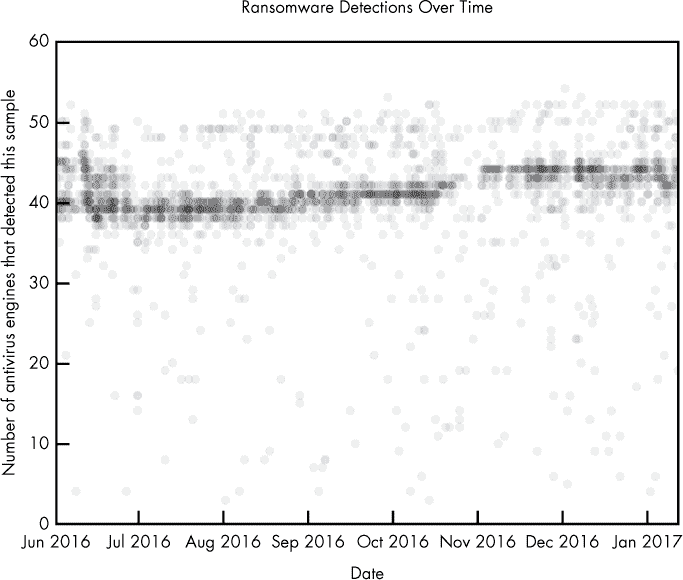
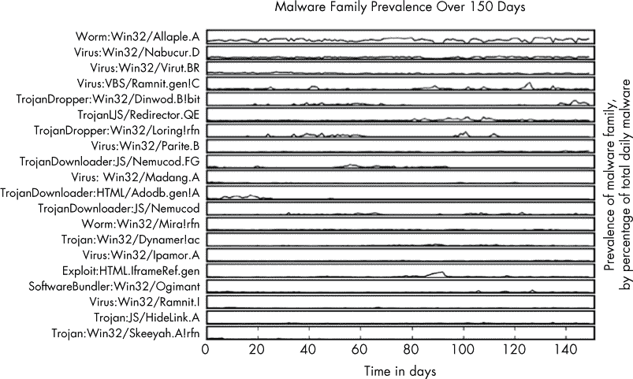
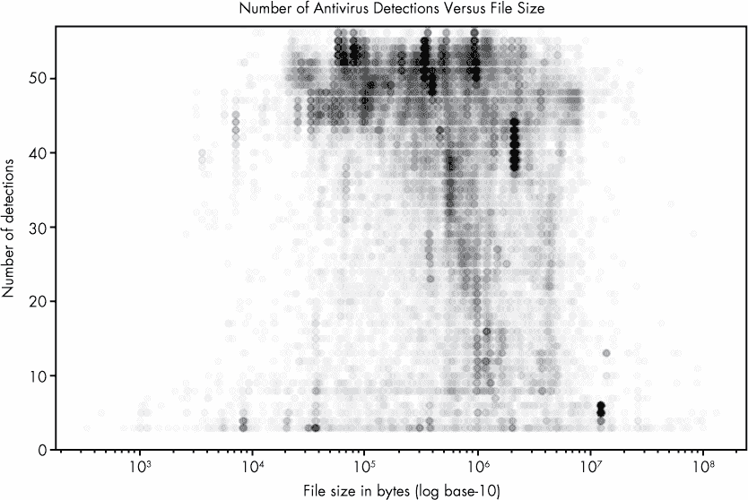
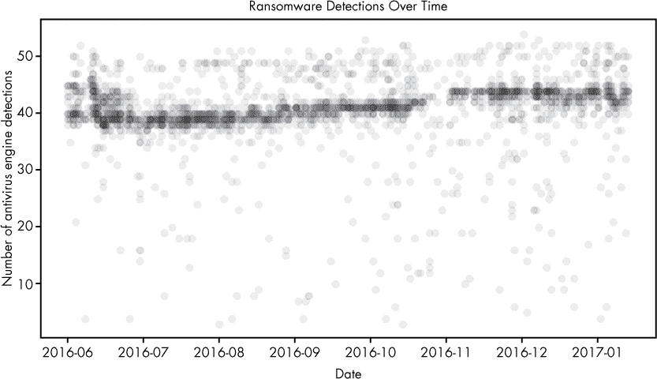
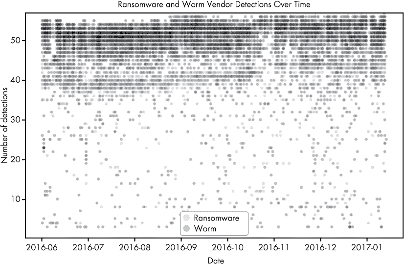
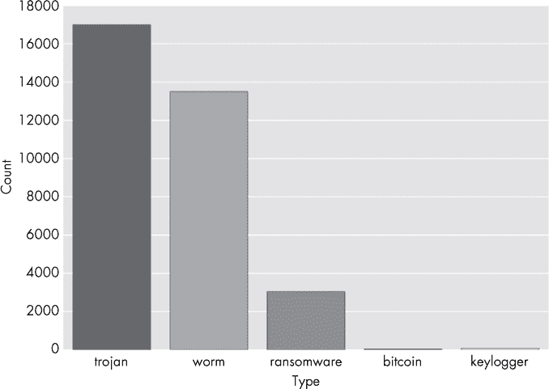
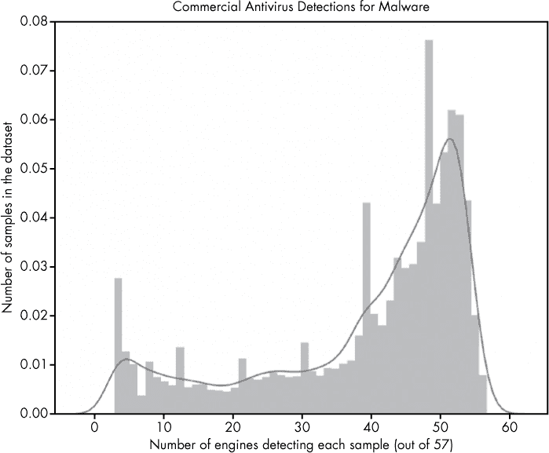
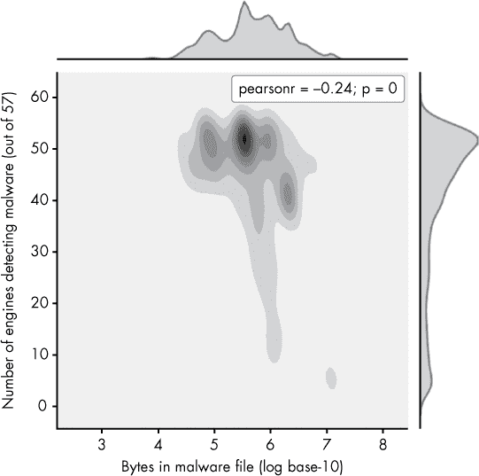
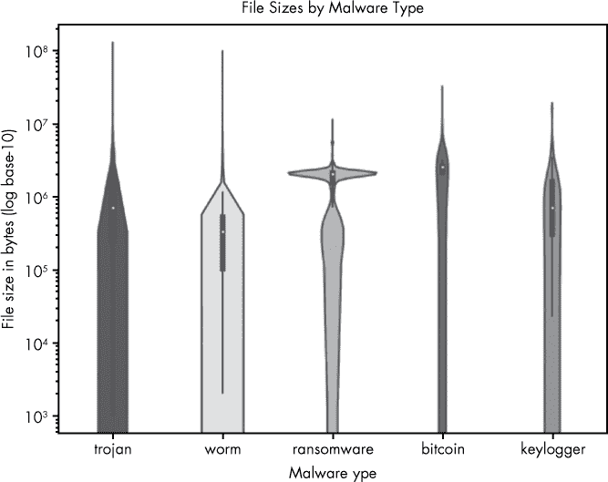
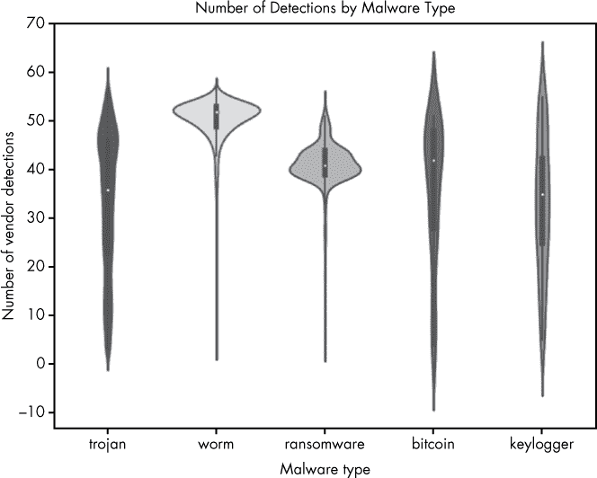

## 9

**恶意软件趋势的可视化**


有时候，分析恶意软件集合的最佳方式就是可视化。可视化安全数据可以帮助我们快速识别恶意软件及整个威胁环境中的趋势。这些可视化图通常比非可视化统计数据更直观，并且可以帮助向不同的受众传达见解。例如，在本章中，你将看到如何通过可视化帮助我们识别数据集中流行的恶意软件类型、恶意软件数据集中的趋势（例如 2016 年勒索软件的出现）以及商业杀毒系统在检测恶意软件方面的相对有效性。

通过这些例子的讲解，你将明白如何使用 Python 数据分析包`pandas`，以及 Python 数据可视化包`seaborn`和`matplotlib`，创建你自己的可视化图表，这些图表能够通过数据分析提供有价值的见解。`pandas`包主要用于加载和处理数据，与数据可视化本身关系不大，但它对于为可视化准备数据非常有用。

### 为什么可视化恶意软件数据很重要

为了展示可视化恶意软件数据如何有助于分析，让我们通过两个例子进行探讨。第一个可视化图解答了以下问题：杀毒行业检测勒索软件的能力是否在提升？第二个可视化图展示了在一年内哪些类型的恶意软件有所增加。我们来看第一个例子，如图 9-1 所示。



*图 9-1：勒索软件检测的时间可视化*

我使用从成千上万的勒索软件样本收集的数据创建了这个勒索软件可视化图。这些数据包含了 57 个独立杀毒引擎对每个文件进行扫描的结果。每个圆圈代表一个恶意软件样本。纵轴表示每个恶意软件样本在扫描时从杀毒引擎接收到的检测次数，或者说是阳性结果。请记住，虽然纵轴的最大值为 60，但给定扫描的最大检测次数是 57，即扫描引擎的总数。横轴表示每个恶意软件样本首次出现在恶意软件分析网站*[VirusTotal.com](http://VirusTotal.com)*并被扫描的时间。

在这个图表中，我们可以看到杀毒社区在 2016 年 6 月时对这些恶意文件的检测能力相对较强，但在 2016 年 7 月左右有所下降，随后在全年内逐步回升。到 2016 年底，勒索软件文件仍然有大约 25%的概率未被杀毒引擎检测到，因此我们可以得出结论，安全社区在这一时期内对这些文件的检测能力仍然较弱。

为了扩展这项调查，你可以创建一个可视化，显示 *哪些* 杀毒引擎正在检测勒索软件及其检测率，以及它们随着时间的推移如何改进。或者你可以查看其他类别的恶意软件（例如木马）。这样的图表在决定购买哪些杀毒引擎，或者决定哪些类型的恶意软件可能需要设计定制的检测解决方案时非常有用——或许是为了补充商业杀毒检测系统（有关构建定制检测系统的更多信息，请参见 第八章）。

现在让我们看看 图 9-2，这是另一个样本可视化图，使用与 图 9-1 相同的数据集生成。



*图 9-2：按家族恶意软件检测的时间可视化*

图 9-2 显示了在 150 天时间段内最常见的前 20 个恶意软件家族及其出现频率的相对关系。该图揭示了一些关键见解：虽然最流行的恶意软件家族 Allaple.A 在 150 天内持续出现，其他恶意软件家族，如 Nemucod.FG，则在较短时间内盛行，随后沉寂。这类图表，可以使用在自己工作网络中检测到的恶意软件生成，能够揭示有助于了解随着时间推移，哪些类型的恶意软件在攻击组织时较为频繁。没有类似的对比图，理解并比较这些恶意软件类型在时间上的相对峰值和数量将会变得困难且耗时。

这两个示例展示了恶意软件可视化的实用性。本章的其余部分将展示如何创建你自己的可视化图。我们从讨论本章使用的示例数据集开始，然后使用 `pandas` 包来分析数据。最后，我们使用 `matplotlib` 和 `seaborn` 包来可视化数据。

### 理解我们的恶意软件数据集

我们使用的数据集包含了由病毒检测聚合服务 VirusTotal 收集的 37,000 个独特恶意软件二进制文件的数据。每个二进制文件都标注了四个字段：标记该二进制文件为恶意的杀毒引擎数量（从 57 个引擎中筛选）（我将其称为每个样本的 *阳性* 数量）、每个二进制文件的大小、二进制文件的 *类型*（比特币矿工、键盘记录器、勒索软件、木马或蠕虫）、以及该二进制文件首次出现的日期。我们将看到，即使每个二进制文件的元数据相对有限，我们仍然可以以一种揭示数据集重要见解的方式分析和可视化数据。

#### *将数据加载到 pandas 中*

流行的 Python 数据分析库`pandas`使得将数据加载到名为`DataFrame`的分析对象中变得容易，然后提供方法来切片、转换和分析这些重新包装的数据。我们使用`pandas`来加载和分析数据，并为轻松可视化做准备。我们可以使用示例 9-1 来定义并将一些示例数据加载到 Python 解释器中。

```
In [135]: import pandas

In [136]: example_data = [➊{'column1': 1, 'column2': 2},
    ...:  {'column1': 10, 'column2': 32},
    ...:  {'column1': 3, 'column2': 58}]

In [137]: ➋pandas.DataFrame(example_data)
Out[137]:
  column1  column2
0        1        2
1       10       32
2        3       58
```

*示例 9-1：直接将数据加载到* pandas*

在这里，我们定义一些数据，称之为`example_data`，它是一个 Python 字典的列表 ➊。创建了这个`dicts`列表后，我们将它传递给`DataFrame`构造函数 ➋，从而得到相应的`pandas` `DataFrame`。这些`dicts`中的每一个都成为生成的`DataFrame`中的一行。字典中的键（`column1`和`column2`）变成列。这是将数据直接加载到`pandas`的一种方式。

你还可以从外部 CSV 文件加载数据。我们使用示例 9-2 中的代码来加载本章的数据集（可在虚拟机上或本书随附的数据和代码归档中找到）。

```
import pandas
malware = pandas.read_csv("malware_data.csv")
```

*示例 9-2：从外部 CSV 文件加载数据到* pandas*

当你导入*malware_data.csv*时，生成的`malware`对象应类似于下方所示：

```
      positives      size        type            fs_bucket
0             45    251592      trojan  2017-01-05 00:00:00
1             32    227048      trojan  2016-06-30 00:00:00
2             53    682593        worm  2016-07-30 00:00:00
3             39    774568      trojan  2016-06-29 00:00:00
4             29    571904      trojan  2016-12-24 00:00:00
5             31    582352      trojan  2016-09-23 00:00:00
6             50   2031661        worm  2017-01-04 00:00:00
```

我们现在有一个由我们的恶意软件数据集组成的`pandas` `DataFrame`。它有四列：`positives`（该样本在 57 个杀毒引擎中检测到的病毒数），`size`（恶意软件二进制文件在磁盘上占用的字节数），`type`（恶意软件的类型，如木马、蠕虫等），以及`fs_bucket`（首次出现该恶意软件的日期）。

#### *与 pandas DataFrame 一起工作*

现在我们已经有了`pandas` `DataFrame`中的数据，让我们看看如何通过调用`describe()`方法来访问和操作这些数据，如示例 9-3 所示。

```
In [51]: malware.describe()
Out[51]:
         positives          size
count  37511.000000  3.751100e+04
mean      39.446536  1.300639e+06
std       15.039759  3.006031e+06
min        3.000000  3.370000e+02
25%       32.000000  1.653960e+05
50%       45.000000  4.828160e+05
75%       51.000000  1.290056e+06
max       57.000000  1.294244e+08
```

*示例 9-3：调用* describe() *方法*

如示例 9-3 所示，调用`describe()`方法可以显示关于我们的`DataFrame`的一些有用统计信息。第一行，`count`，统计非空`positives`行的总数，以及非空行的总数。第二行给出了`mean`，即每个样本的平均正检测数，以及恶意软件样本的平均大小。接下来是`positives`和`size`的标准差，以及数据集中每一列的最小值。最后，我们可以看到每一列的百分位值和每一列的最大值。

假设我们想要检索恶意软件`DataFrame`中的某一列数据，例如`positives`列（例如，查看每个文件的平均检测数，或绘制展示数据集中`positives`分布的直方图）。为此，我们只需要写`malware['positives']`，它将返回`positives`列的数字列表，如示例 9-4 所示。

```
In [3]: malware['positives']
Out[3]:
0        45
1        32
2        53
3        39
4        29
5        31
6        50
7        40
8        20
9        40
--snip--
```

*示例 9-4：返回* positives *列*

在检索到一列数据后，我们可以直接对其进行统计计算。例如，`malware['positives'].mean()`计算该列的均值，`malware['positives'].max()`计算最大值，`malware['positives'].min()`计算最小值，`malware['positives'].std()`计算标准差。清单 9-5 展示了每个操作的示例。

```
In [7]: malware['positives'].mean()
Out[7]: 39.446535682866362

In [8]: malware['positives'].max()
Out[8]: 57

In [9]: malware['positives'].min()
Out[9]: 3

In [10]: malware['positives'].std()
Out[10]: 15.039759380778822
```

*清单 9-5：计算均值、最大值、最小值和标准差*

我们还可以对数据进行切片处理，进行更详细的分析。例如，清单 9-6 计算了特洛伊木马、比特币和蠕虫类型恶意软件的均值检测率。

```
In [67]: malware[malware['type'] == 'trojan']['positives'].mean()
Out[67]: 33.43822473365119

In [68]: malware[malware['type'] == 'bitcoin']['positives'].mean()
Out[68]: 35.857142857142854

In [69]: malware[malware['type'] == 'worm']['positives'].mean()
Out[69]: 49.90857904874796
```

*清单 9-6：计算不同恶意软件的平均检测率*

我们首先通过以下表示法选择`DataFrame`中`type`为`trojan`的行：`malware[malware['type'] == 'trojan']`。为了选择结果数据的`positives`列并计算均值，我们将该表达式扩展为：`malware[malware['type'] == 'trojan']['positives'].mean()`。清单 9-6 得出了一个有趣的结果，即蠕虫（worm）比比特币挖矿和特洛伊木马恶意软件的检测频率更高。因为 49.9 > 35.8 和 33.4，平均而言，恶意的`worm`样本（49.9）比恶意的`bitcoin`和`trojan`样本（35.8，33.4）更频繁地被多个厂商检测到。

#### *使用条件筛选数据*

我们还可以使用其他条件选择数据的子集。例如，我们可以对数字数据（如恶意软件文件大小）使用“大于”和“小于”样式的条件来筛选数据，然后对结果子集进行统计计算。如果我们有兴趣了解杀毒引擎的有效性是否与文件大小相关，这将非常有用。我们可以使用清单 9-7 中的代码来检查这一点。

```
In [84]: malware[malware['size'] > 1000000]['positives'].mean()
Out[84]: 33.507073192162373

In [85]: malware[malware['size'] > 2000000]['positives'].mean()
Out[85]: 32.761442050415432

In [86]: malware[malware['size'] > 3000000]['positives'].mean()
Out[86]: 27.20672682526661

In [87]: malware[malware['size'] > 4000000]['positives'].mean()
Out[87]: 25.652548725637182

In [88]: malware[malware['size'] > 5000000]['positives'].mean()
Out[88]: 24.411069317571197
```

*清单 9-7：按恶意软件文件大小筛选结果*

以前面的代码中的第一行为例：首先，我们通过仅选择文件大小超过一百万的样本来对子集进行筛选（`malware[malware['size'] > 1000000]`）。然后，我们抓取`positives`列并计算均值（`['positives'].mean()`），结果大约是 33.5。随着文件大小逐渐增大，我们看到每组的平均检测次数下降。这意味着我们发现了恶意软件文件大小和检测这些恶意软件样本的杀毒引擎平均数量之间确实存在关系，这一点很有趣，值得进一步研究。接下来，我们通过使用`matplotlib`和`seaborn`进行可视化分析。

### 使用 matplotlib 可视化数据

Python 数据可视化的首选库是`matplotlib`；事实上，大多数其他 Python 可视化库本质上都是`matplotlib`的便捷封装。使用`pandas`与`matplotlib`非常方便：我们使用`pandas`来获取、切片和处理我们想要绘制的数据，然后使用`matplotlib`来绘制它。对我们而言，最有用的`matplotlib`函数是`plot`函数。图 9-3 展示了`plot`函数可以做什么。



*图 9-3：恶意软件样本的大小与防病毒检测次数的图表*

在这里，我绘制了我们的恶意软件数据集中的`positives`和`size`属性。一个有趣的结果出现了，正如我们在上一节中讨论`pandas`时所预示的那样。它显示小文件和非常大的文件很少被这 57 个扫描这些文件的防病毒引擎检测到。然而，中等大小的文件（大约在 10^(4.5)–10⁷之间）却被大多数引擎检测到了。这可能是因为小文件不包含足够的信息，使得引擎无法判断它们是恶意的，而大文件扫描速度太慢，导致许多防病毒系统干脆放弃扫描它们。

#### *绘制恶意软件大小与供应商检测之间的关系*

让我们通过使用清单 9-8 中的代码，演示如何生成图 9-3 中所示的图表。

```
➊ import pandas
   from matplotlib import pyplot
   malware = ➋pandas.read_csv("malware_data.csv")
   pyplot.plot(➌malware['size'], ➍malware['positives'],
               ➎'bo', ➏alpha=0.01)
   pyplot.xscale(➐"log")
➑ pyplot.ylim([0,57])
   pyplot.xlabel("File size in bytes (log base-10)")
   pyplot.ylabel("Number of detections")
   pyplot.title("Number of Antivirus Detections Versus File Size")
➒ pyplot.show()
```

*清单 9-8：使用* plot() *函数可视化数据*

如你所见，渲染这个图表并不需要太多代码。让我们逐行分析每一行的功能。首先，我们导入 ➊ 所需的库，包括`pandas`和`matplotlib`库中的`pyplot`模块。然后我们调用`read_csv`函数 ➋，正如你之前学到的，它将我们的恶意软件数据集加载到一个`pandas DataFrame`中。

接下来，我们调用`plot()`函数。该函数的第一个参数是恶意软件的`size`数据 ➌，第二个参数是恶意软件的`positives`数据 ➍，即每个恶意软件样本的正检测次数。这些参数定义了`matplotlib`将要绘制的数据，第一个参数代表将在 x 轴上显示的数据，第二个参数代表将在 y 轴上显示的数据。下一个参数`'bo'` ➎，告诉`matplotlib`使用何种颜色和形状来表示数据。最后，我们将`alpha`（即圆圈的透明度）设置为`0.1` ➏，这样即使圆圈完全重叠，我们也能看到数据在图表不同区域的密度。

**注意**

*`bo`中的* b *代表蓝色*，* o *代表圆形*，这意味着我们告诉* matplotlib *绘制蓝色圆圈来表示我们的数据。你还可以尝试其他颜色，例如绿色（*g*）、红色（*r*）、青色（*c*）、品红色（*m*）、黄色（*y*）、黑色（*k*）和白色（*w*）。你可以尝试的其他形状有点（*.*）、每个数据点一个像素（* ,*）、方形（*s*）和五边形（*p*）。有关完整细节，请参阅* matplotlib *文档：[`matplotlib.org`](http://matplotlib.org)。

在调用`plot()`函数后，我们将 x 轴的尺度设置为对数尺度 ➐。这意味着我们将以 10 的幂次方来查看恶意软件文件的大小数据，从而使得我们能够更容易地看到非常小的文件与非常大文件之间的关系。

现在我们已经绘制了数据，接下来我们对坐标轴进行标注，并为图表命名。x 轴代表恶意软件文件的大小`("文件大小（字节，log10 底数）")`，y 轴代表检测次数`("检测次数")`。由于我们分析了 57 个杀毒引擎，因此我们将 y 轴的尺度设置为 0 到 57 的范围 ➑。最后，我们调用`show()`函数 ➒来显示图表。如果我们想将图表保存为图像文件，可以将此调用替换为`pyplot.savefig("myplot.png")`。

现在我们已经完成了一个初步示例，让我们再做一个。

#### *绘制勒索病毒检测率*

这一次，让我们尝试再现图 9-1，我在本章开头展示的勒索病毒检测图。清单 9-9 展示了绘制勒索病毒检测随时间变化的完整代码。

```
import dateutil
import pandas
from matplotlib import pyplot

malware = pandas.read_csv("malware_data.csv")
malware['fs_date'] = [dateutil.parser.parse(d) for d in malware['fs_bucket']]
ransomware = malware[malware['type'] == 'ransomware']
pyplot.plot(ransomware['fs_date'], ransomware['positives'], 'ro', alpha=0.05)
pyplot.title("Ransomware Detections Over Time")
pyplot.xlabel("Date")
pyplot.ylabel("Number of antivirus engine detections")
pyplot.show()
```

*清单 9-9：绘制勒索病毒检测率随时间变化的图表*

清单 9-9 中的部分代码应该是我们到目前为止已经讲解过的内容，有些则不是。让我们逐行分析代码：

```
import dateutil
```

有用的 Python 包`dateutil`可以帮助你轻松地解析多种不同格式的日期。我们导入`dateutil`是因为我们需要解析日期，以便进行可视化展示。

```
import pandas
from matplotlib import pyplot
```

我们还导入了`matplotlib`库的`pyplot`模块以及`pandas`。

```
malware = pandas.read_csv("malware_data.csv")
malware['fs_date'] = [dateutil.parser.parse(d) for d in malware['fs_bucket']]
ransomware = malware[malware['type'] == 'ransomware']
```

这些代码行读取我们的数据集，并创建一个名为`ransomware`的过滤数据集，里面仅包含勒索病毒样本，因为这正是我们这里要绘制的数据类型。

```
pyplot.plot(ransomware['fs_date'], ransomware['positives'], 'ro', alpha=0.05)
pyplot.title("Ransomware Detections Over Time")
pyplot.xlabel("Date")
pyplot.ylabel("Number of antivirus engine detections")
pyplot.show()
```

这五行代码与清单 9-8 中的代码相对应：它们绘制数据，给图表命名，标注 x 轴和 y 轴，然后将所有内容渲染到屏幕上（参见图 9-4）。同样，如果我们想将图表保存到磁盘上，可以将`pyplot.show()`调用替换为`pyplot.savefig("myplot.png")`。



*图 9-4：勒索病毒检测随时间变化的可视化*

让我们再使用`plot()`函数尝试绘制一个图表。

#### *绘制勒索病毒和蠕虫病毒检测率*

这次，我们不仅绘制勒索病毒随时间变化的检测情况，还将在同一图表中绘制蠕虫检测情况。图 9-5 清楚地显示出，抗病毒行业在检测蠕虫（较旧的恶意软件趋势）方面优于勒索病毒（较新的恶意软件趋势）。

在这个图表中，我们看到的是每个时间点有多少个抗病毒引擎检测到恶意软件样本（纵轴），以及随时间变化的趋势（横轴）。每个红点代表一个`type="ransomware"`的恶意软件样本，而每个蓝点代表一个`type="worm"`的样本。我们可以看到，平均而言，更多的引擎检测到蠕虫样本，而非勒索病毒样本。然而，检测到这两种样本的引擎数量随时间缓慢上升。



*图 9-5：勒索病毒和蠕虫恶意软件检测的可视化随时间变化*

列表 9-10 显示了绘制此图表的代码。

```
import dateutil
import pandas
from matplotlib import pyplot

malware = pandas.read_csv("malware_data.csv")
malware['fs_date'] = [dateutil.parser.parse(d) for d in malware['fs_bucket']]

ransomware = malware[malware['type'] == 'ransomware']
worms = malware[malware['type'] == 'worm']

pyplot.plot(ransomware['fs_date'], ransomware['positives'],
            'ro', label="Ransomware", markersize=3, alpha=0.05)
pyplot.plot(worms['fs_date'], worms['positives'],
            'bo', label="Worm", markersize=3, alpha=0.05)
pyplot.legend(framealpha=1, markerscale=3.0)
pyplot.xlabel("Date")
pyplot.ylabel("Number of detections")
pyplot.ylim([0, 57])
pyplot.title("Ransomware and Worm Vendor Detections Over Time")
pyplot.show()
```

*列表 9-10：随时间变化绘制勒索病毒和蠕虫检测率*

让我们通过查看列表 9-10 的第一部分来逐步解析代码：

```
   import dateutil
   import pandas
   from matplotlib import pyplot

   malware = pandas.read_csv("malware_data.csv")
   malware['fs_date'] = [dateutil.parser.parse(d) for d in malware['fs_bucket']]

   ransomware = malware[malware['type'] == 'ransomware']
➊ worms = malware[malware['type'] == "worm"]
   --snip--
```

这段代码与之前的示例类似。到目前为止，唯一的区别是我们使用相同的方法创建了`worm`（蠕虫）过滤后的数据 ➊，与创建`ransomware`（勒索病毒）过滤后的数据的方式相同。现在，让我们来看看其余的代码：

```
   --snip--
➊ pyplot.plot(ransomware['fs_date'], ransomware['positives'],
               'ro', label="Ransomware", markersize=3, alpha=0.05)
➋ pyplot.plot(worms['fs_bucket'], worms['positives'],
               'bo', label="Worm", markersize=3, alpha=0.05)
➌ pyplot.legend(framealpha=1, markerscale=3.0)
   pyplot.xlabel("Date")
   pyplot.ylabel("Number of detections")
   pyplot.ylim([0,57])
   pyplot.title("Ransomware and Worm Vendor Detections Over Time")
   pyplot.show()
   pyplot.gcf().clf()
```

这段代码与列表 9-9 的主要区别在于，我们调用了`plot()`函数两次：一次使用`ro`选择器 ➊ 为勒索病毒数据创建红色圆点，另一次使用`bo`选择器 ➋ 为蠕虫数据创建蓝色圆点。请注意，如果我们想绘制第三个数据集，也可以这么做。另外，与列表 9-9 不同，在这里，➌我们为图例创建了一个标签，显示蓝色标记代表蠕虫恶意软件，红色标记代表勒索病毒。参数`framealpha`决定了图例背景的透明度（将其设置为 1 时，背景完全不透明），而参数`markerscale`则调整图例中标记的大小（在此例中，放大三倍）。

在这一节中，你学会了如何在`matplotlib`中制作一些简单的图表。然而，说实话——它们并不美观。在下一节中，我们将使用另一个绘图库，它应该能帮助我们让图表看起来更专业，并且帮助我们更快地实现更复杂的可视化。

### 使用 seaborn 可视化数据

现在我们已经讨论了`pandas`和`matplotlib`，接下来让我们介绍`seaborn`，这是一个建立在`matplotlib`之上的可视化库，但它提供了更为简洁的封装。它包括内置的主题来美化我们的图形，以及预设的更高级函数，这些都能节省在进行复杂分析时的时间。这些特点使得生成复杂且美观的图表变得简单易行。

为了探索`seaborn`，我们首先制作一个条形图，显示数据集中每种恶意软件类型的样本数量（见图 9-6）。



*图 9-6：本章数据集中不同类型恶意软件的条形图*

清单 9-11 展示了绘制该图的代码。

```
   import pandas
   from matplotlib import pyplot
   import seaborn

➊ malware = pandas.read_csv("malware_data.csv")
➋ seaborn.countplot(x='type', data=malware)
➌ pyplot.show()
```

*清单 9-11：根据恶意软件类型绘制恶意软件数量的条形图*

在这段代码中，我们首先通过`pandas.read_csv` ➊读取数据，然后使用`seaborn`的`countplot`函数创建一个显示`DataFrame`中`type`列的条形图 ➋。最后，通过调用`pyplot`的`show()`方法在 ➌ 使图表显示出来。请记住，`seaborn`封装了`matplotlib`，这意味着我们需要请求`matplotlib`来显示我们的`seaborn`图形。接下来我们来看一个更复杂的示例图表。

#### *绘制杀毒软件检测分布图*

以下图表的前提是：假设我们想了解数据集中恶意软件样本的杀毒软件检测分布（频率），以便了解大多数杀毒引擎漏掉了多少恶意软件，哪些恶意软件被大多数引擎检测到。这些信息能帮助我们了解商业杀毒软件行业的有效性。我们可以通过绘制一个条形图（直方图）来实现，显示每个检测次数下，具有该检测次数的恶意软件样本所占的比例，如图 9-7 所示。



*图 9-7：杀毒软件检测（阳性）分布的可视化*

该图的 x 轴代表恶意软件样本的分类，按 57 个总杀毒引擎检测到的数量排序。如果一个样本被 57 个引擎中的 50 个检测为恶意，它就被放置在 50 的位置；如果它仅被 57 个引擎中的 10 个检测到，则放在 10 的位置。每个条形的高度与该类别中样本的总数成正比。

该图清楚地表明，许多恶意软件样本被我们 57 个防病毒引擎中的大多数检测到（在图表的右上方区域频率的大幅峰值所示），但也表明，少数样本只被少数几个引擎检测到（图表最左侧区域所示）。我们没有显示被少于五个引擎检测到的样本，这是因为我在构建该数据集时使用的方法：我将恶意软件定义为被五个或更多防病毒引擎检测到的样本。这个绘制结果表明，仍然存在防病毒引擎之间的显著分歧，许多样本仅被 5-30 个引擎检测到。这些样本中，有的在 57 个引擎中只被 10 个引擎检测到，这意味着要么 47 个引擎没有检测到它，要么 10 个引擎犯了错误，对一个无害文件发出了误报。后一种可能性非常小，因为防病毒厂商的产品具有非常低的误报率：更可能的是，大多数引擎没有检测到这些样本。

创建这个图只需要几行绘图代码，如清单 9-12 所示。

```
   import pandas
   import seaborn
   from matplotlib import pyplot
   malware = pandas.read_csv("malware_data.csv")
➊ axis = seaborn.distplot(malware['positives'])
➋ axis.set(xlabel="Number of engines detecting each sample (out of 57)",
            ylabel="Amount of samples in the dataset",
            title="Commercial Antivirus Detections for Malware")
   pyplot.show()
```

*清单 9-12：绘制阳性检测结果的分布图*

`seaborn`包内置了一个函数，用于创建分布图（直方图），因此我们所做的只是将我们想要显示的数据`malware['positives']`传递给`distplot`函数➊。然后，我们使用`seaborn`返回的轴对象来配置图表标题、x 轴标签和 y 轴标签，以描述我们的图表➋。

现在让我们尝试一个包含两个变量的`seaborn`图：恶意软件的阳性检测次数（被五个或更多检测到的文件）及其文件大小。我们之前已经在图 9-3 中用`matplotlib`创建了这个图，但我们可以通过使用`seaborn`的`jointplot`函数，获得一个更具吸引力和信息量的结果。得到的图，如图 9-8 所示，信息丰富，但一开始可能有些难以理解，因此我们一步步来分析。

这个图与我们在图 9-7 中制作的直方图类似，但它不是通过条形高度显示单一变量的分布，而是通过颜色强度显示*两个*变量的分布（恶意软件文件的大小在 x 轴上，检测数量在 y 轴上）。区域越暗，数据在该区域中的数量越多。例如，我们可以看到，文件最常见的大小约为 10^(5.5)，阳性值约为 53。主图上方和右侧的子图显示了大小和检测数据的平滑版本，揭示了检测（如我们在前一个图中看到的）和文件大小的分布。



*图 9-8：恶意软件文件大小与阳性检测结果的分布可视化*

中间的图最为有趣，因为它展示了文件大小与正面检测之间的关系。与图 9-3 中使用`matplotlib`展示单个数据点不同，它以更清晰的方式显示了整体趋势。这表明，文件非常大的恶意软件（大小为 10⁶及以上）较少被杀毒引擎检测到，这告诉我们可能需要定制一个专门检测这类恶意软件的解决方案。

创建这个图只需要一次`seaborn`绘图调用，如清单 9-13 所示。

```
   import pandas
   import seaborn
   import numpy
   from matplotlib import pyplot

   malware = pandas.read_csv("malware_data.csv")
➊ axis=seaborn.jointplot(x=numpy.log10(malware['size']),
                          y=malware['positives'],
                          kind="kde")
➋ axis.set_axis_labels("Bytes in malware file (log base-10)",
                        "Number of engines detecting malware (out of 57)")
   pyplot.show()
```

*清单 9-13：绘制恶意软件文件大小与正面检测的分布图*

在这里，我们使用`seaborn`的`jointplot`函数来创建`positives`和`size`列的联合分布图 ➊。另外，有些令人困惑的是，对于`seaborn`的`jointplot`函数，我们必须调用与清单 9-11 中不同的函数来标记坐标轴：`set_axis_labels()`函数 ➋，该函数的第一个参数是 x 轴标签，第二个参数是 y 轴标签。

#### *创建小提琴图*

本章我们探讨的最后一种图表类型是`seaborn`的小提琴图。该图可以帮助我们优雅地探索给定变量在多种恶意软件类型之间的分布。例如，假设我们对查看数据集中每种恶意软件类型的文件大小分布感兴趣。那么我们可以创建类似图 9-9 的图。



*图 9-9：按恶意软件类型可视化文件大小*

在这个图的 y 轴上是文件大小，以 10 的幂表示。x 轴上列出了每种恶意软件类型。如你所见，表示每种文件类型的条形宽度在不同大小级别上有所不同，显示了该恶意软件类型的数据中有多少是该大小。例如，你可以看到有大量非常大的勒索软件文件，而蠕虫的文件大小往往较小——这可能是因为蠕虫旨在快速传播到网络中，因此蠕虫的作者通常会将文件大小最小化。了解这些模式可能有助于我们更好地分类未知文件（较大的文件更可能是勒索软件，较小的文件则更可能是蠕虫），或者帮助我们了解在针对特定类型恶意软件的防御工具中，应该关注哪些文件大小。

创建小提琴图只需要一次绘图调用，如清单 9-14 所示。

```
   import pandas
   import seaborn
   from matplotlib import pyplot

   malware = pandas.read_csv("malware_data.csv")

➊ axis = seaborn.violinplot(x=malware['type'], y=malware['size'])
➋ axis.set(xlabel="Malware type", ylabel="File size in bytes (log base-10)",
            title="File Sizes by Malware Type", yscale="log")
➌ pyplot.show()
```

*清单 9-14：创建小提琴图*

在清单 9-14 中，首先我们创建小提琴图 ➊。接着我们告诉`seaborn`设置坐标轴标签和标题，并将 y 轴设置为对数尺度 ➋。最后，我们使图表显示出来 ➌。我们还可以绘制一个类似的图，显示每种恶意软件类型的正面检测数量，如图 9-10 所示。



*图 9-10：按恶意软件类型可视化杀毒软件检测到的数量（阳性结果）*

图 9-9 和图 9-10 的唯一区别在于，我们不再查看 y 轴上的文件大小，而是查看每个文件收到的阳性结果数量。结果显示了一些有趣的趋势。例如，勒索软件几乎总是被 30 个以上的扫描器检测到。相比之下，比特币、木马和键盘记录器类型的恶意软件，常常在不到 30 个扫描器的情况下被检测到，这意味着这些恶意软件类型中的更多部分正悄悄突破安全行业的防线（没有安装能够检测这些文件的扫描器的用户，很可能会被这些样本感染）。列表 9-15 展示了如何创建图 9-10 中所示的图表。

```
import pandas
import seaborn
from matplotlib import pyplot

malware = pandas.read_csv("malware_data.csv")

axis = seaborn.violinplot(x=malware['type'], y=malware['positives'])
axis.set(xlabel="Malware type", ylabel="Number of vendor detections",
         title="Number of Detections by Malware Type")
pyplot.show()
```

*列表 9-15：按恶意软件类型可视化杀毒软件检测*

这段代码与之前的唯一不同之处在于，我们传递给`violinplot`函数的数据不同（使用`malware['positives']`而不是`malware['size']`），我们对坐标轴的标签进行了不同的设置，标题也有所不同，并且我们省略了将 y 轴刻度设置为对数 10 的操作。

### 总结

在本章中，你学习了如何通过可视化恶意软件数据，帮助你获得关于趋势性威胁和安全工具效果的宏观洞察。你使用了`pandas`、`matplotlib`和`seaborn`来创建自己的可视化图表，并从样本数据集中获得洞察。

你还学习了如何使用`pandas`中的`describe()`方法来显示有用的统计信息，以及如何提取数据集的子集。接着，你利用这些数据子集创建了自己的可视化图表，以评估杀毒软件检测的改进情况，分析趋势性恶意软件类型，并回答其他更广泛的问题。

这些都是强大的工具，可以将你手头的安全数据转化为可操作的情报，帮助指导新工具和技术的开发。我希望你能更多地了解数据可视化，并将其融入到你的恶意软件和安全分析工作流程中。
