## **10**

**深度学习基础**

深度学习是机器学习的一种类型，近年来由于处理能力和深度学习技术的进步而迅速发展。通常，*深度学习*指的是深度或多层神经网络，这些网络在执行非常复杂、通常以人为主的任务（如图像识别和语言翻译）方面表现出色。

例如，检测一个文件是否包含你以前见过的恶意代码的完全复制对计算机程序来说很简单，不需要高级的机器学习技术。但检测一个文件是否包含与以前见过的恶意代码相似的恶意代码则是一个复杂得多的任务。传统的基于签名的检测方案是死板的，对于以前未见过或经过混淆的恶意软件表现不佳，而深度学习模型能够看穿表面变化，识别出使样本具有恶意特征的核心要素。网络活动、行为分析和其他相关领域也同样适用。深度学习通过从一堆噪声中提取有用特征的能力，使其成为网络安全应用中极为强大的工具。

深度学习只是机器学习的一种类型（我们在第六章和第七章中讨论了机器学习的总体内容）。但它通常会产生比我们在前几章中讨论的方法更高的准确性，这也是为什么在过去五年左右，整个机器学习领域都强调深度学习的原因。如果你有兴趣在安全数据科学的前沿工作，那么学习如何使用深度学习是至关重要的。然而，需要注意的是：深度学习比我们在本书前面讨论的机器学习方法更难理解，完全掌握它需要一定的时间投入，以及高中水平的微积分知识。你会发现，投入的时间将会为你在安全数据科学工作中带来回报，尤其是在构建更精确的机器学习系统方面。因此，我们敦促你仔细阅读这一章，并努力理解，直到完全掌握！让我们开始吧。

### **什么是深度学习？**

深度学习模型学会将它们的训练数据视为一个嵌套的概念层次结构，这使它们能够表示非常复杂的模式。换句话说，这些模型不仅考虑你给它们的原始特征，还会自动将这些特征组合成新的、优化的元特征，接着再将这些元特征组合成更多的特征，依此类推。

“深度”也指的是用于实现这一目标的架构，通常由多个处理单元层组成，每一层使用上一层的输出作为其输入。每个处理单元被称为*神经元*，整体架构被称为*神经网络*，如果有很多层，则称为*深度神经网络*。

要了解这种架构如何有所帮助，我们可以考虑一个程序，该程序尝试将图像分类为自行车或独轮车。对于人类来说，这是一项简单的任务，但编程让计算机查看像素网格并判断图像代表的是什么物体却相当困难。如果独轮车稍微移动、放置在不同的角度，或者颜色发生变化，那么在一张图片中表示独轮车的某些像素，在下一张图片中可能完全代表其他意思。

深度学习模型通过将问题分解成更易管理的部分来解决这个问题。例如，深度神经网络的第一层神经元可能首先将图像分解成部分，只识别图像中的低级视觉特征，如边缘和形状的边界。这些创建的特征被送入网络的下一层，以便在这些特征中找到模式。然后，这些模式被送入后续层，直到网络识别出一般形状，最终识别出完整的物体。在我们的独轮车示例中，第一层可能会找到线条，第二层可能会看到线条形成圆形，第三层可能会识别出某些圆形实际上是车轮。通过这种方式，模型不再只是查看一堆像素，而是能够看到每张图像中有一定数量的“车轮”元特征。它可以学到，例如，两个车轮可能表示一辆自行车，而一个车轮则意味着一辆独轮车。

本章我们将重点讲解神经网络的工作原理，包括其数学原理和结构。首先，我将使用一个非常基础的神经网络作为示例，解释什么是神经元以及它如何连接到其他神经元，从而构建出一个神经网络。其次，我将描述用于训练这些网络的数学过程。最后，我将介绍一些流行的神经网络类型，它们的特殊之处以及它们擅长的领域。这将为你后续在第十一章中实际使用 Python 创建深度学习模型打下基础。

### **神经网络的工作原理**

机器学习模型本质上只是大型的数学函数。例如，我们输入数据（比如表示为一系列数字的 HTML 文件），应用一个机器学习函数（比如神经网络），然后得到一个输出，告诉我们 HTML 文件看起来有多恶意。每个机器学习模型实际上就是一个包含可调参数的函数，这些参数在训练过程中会不断优化。

但深度学习函数究竟是如何工作的，长什么样呢？神经网络，顾名思义，就是由许多神经元组成的网络。所以，在我们理解神经网络如何工作之前，首先需要了解什么是神经元。

#### ***神经元的结构***

神经元本身只是一个小而简单的函数。图 10-1 展示了一个单独神经元的样子。

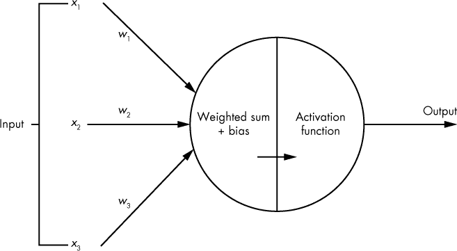

*图 10-1：单个神经元的可视化*

你可以看到输入数据从左侧进入，单一的输出值从右侧输出（尽管某些类型的神经元会产生多个输出）。输出的值是神经元输入数据和一些参数的函数（这些参数在训练过程中得到优化）。每个神经元内部进行两步操作，将输入数据转换为输出。

首先，计算神经元输入的加权和。在图 10-1 中，每个输入值*x*[i]，进入神经元后都会与相应的*权重*值*w*[i]相乘。将得到的结果相加（得到加权和），然后加上一个*偏置*项。偏置和权重是神经元的参数，这些参数在训练过程中会被调整，以优化模型。

第二步，应用一个*激活函数*于加权和加偏置的值。激活函数的目的是对加权和进行非线性变换，而加权和本身是神经元输入数据的*线性*变换。常见的激活函数类型有很多，并且它们通常都很简单。激活函数唯一的要求是可微分，这使我们可以利用反向传播来优化参数（我们将在 “训练神经网络” 中进一步讨论此过程，参见第 189 页）。

表 10-1 展示了各种常见的激活函数，并解释了哪些激活函数适合用于哪些目的。

**表 10-1：** 常见激活函数

| **名称** | **图示** | **方程** | **描述** |
| --- | --- | --- | --- |
| Identity | 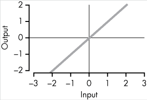 | *f*(*x*) = *x* | 基本上：没有激活函数！ |
| ReLU | 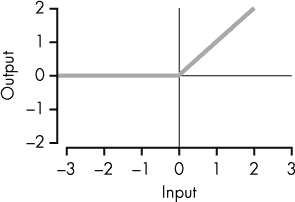 | 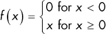 | 仅为 max(0, *x*)。与其他激活函数（如 sigmoid）相比，ReLU 能够实现快速学习，并且在应对梯度消失问题（将在本章后面解释）时更加稳定。 |
| Leaky ReLU | 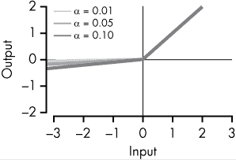 | 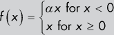 | 类似于普通的 ReLU，但返回的是一个小常数*α*与*x*的乘积，而不是 0。通常你会选择*α*非常小，比如 0.01。而且，*α*在训练过程中保持固定。 |
| PReLU | 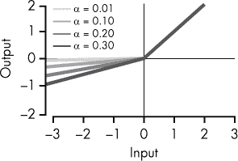 | 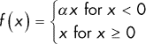 | 这与 Leaky ReLU 类似，但在 PReLU 中，*α*是一个参数，其值会在训练过程中与标准的权重和偏置参数一起优化。 |
| ELU | 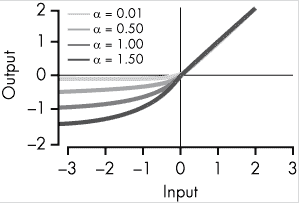 | 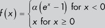 | 类似于 PReLU，其中*α*是一个参数，但当* x * < 0 时，曲线不是无限下降而是被* α *所限制，因为* e *^(*x*) 在 *x* < 0 时始终介于 0 和 1 之间。 |
| 步骤 | 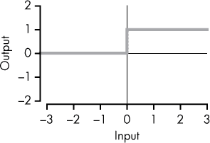 | 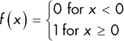 | 仅仅是一个阶跃函数：该函数除非* x * ≤ 0，否则返回 0；当* x * ≤ 0 时，函数返回 1。 |
| 高斯 | 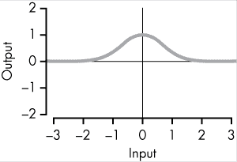 | *f*(*x*) = *e*^(*-x*²) | 一条钟形曲线，当 *x* = 0 时，最大值为 1。 |
| Sigmoid | 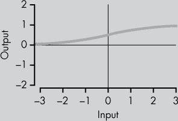 | 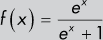 | 由于消失梯度问题（本章后面会解释），Sigmoid 激活函数通常只用于神经网络的最后一层。由于输出是连续的并且被限制在 0 和 1 之间，Sigmoid 神经元非常适合用作输出概率的代理。 |
| Softmax | （多输出） | 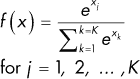 | 输出多个加和为 1 的值。Softmax 激活函数通常用于网络的最后一层来表示分类概率，因为 Softmax 强制神经元的所有输出加和为 1。 |

*修正线性单元（ReLU）* 迄今为止是最常用的激活函数，它就是 max(0, *s*)。举个例子，假设你的加权和加偏置值叫做 *s*。如果 *s* 大于零，那么神经元的输出就是 *s*；如果 *s* 小于或等于零，则神经元的输出为 0。你可以简单地将 ReLU 神经元的整个函数表示为 max(0, *加权和输入* + *偏置*)，或者更具体地说，对于 *n* 个输入如下所示：

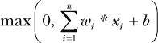

非线性激活函数实际上是使得这种神经元网络能够逼近任何连续函数的关键原因，这也是它们如此强大的一个重要原因。在接下来的部分中，你将学习神经元如何连接在一起形成一个网络，随后你将理解为什么非线性激活函数如此重要。

#### ***神经元网络***

要创建一个神经网络，你将神经元安排在一个*有向图*（一个网络）中，形成多个层级，连接起来构成一个更大的函数。图 10-2 展示了一个小型神经网络的示例。

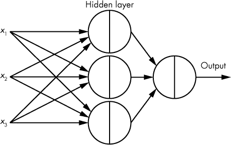

*图 10-2：一个非常小的四神经元神经网络示例，数据通过连接从神经元传递到神经元。*

在图 10-2 中，我们有原始输入：*x*[1]、*x*[2]和*x*[3]在左侧。这些*x*[*i*]值的副本沿着连接发送到每个神经元的*隐藏层*（一个神经元的层，其输出不是模型的最终输出），从而产生三个输出值，每个神经元一个。最后，这三个神经元的每个输出都被发送到最终神经元，该神经元输出神经网络的最终结果。

神经网络中的每个连接都与一个*权重*参数，*w*，相关联，每个神经元还包含一个*偏置*参数，*b*（加到加权和中），因此一个基本神经网络中可以优化的参数总数是连接输入到神经元的边的数量，再加上神经元的数量。例如，在图 10-2 中，总共有 4 个神经元，加上 9 + 3 条边，总共 16 个可优化参数。由于这是一个示例，我们使用了一个非常小的神经网络——实际的神经网络通常有成千上万个神经元和数百万条连接。

#### ***通用逼近定理***

神经网络的一个显著特点是它们是*通用逼近器*：只要有足够的神经元，以及正确的权重和偏置值，神经网络几乎可以模拟任何类型的行为。在图 10-2 中显示的神经网络是*前馈型*的，这意味着数据始终是向前流动的（在图像中从左到右）。

*通用逼近定理*更正式地描述了普遍性概念。它声明，一个具有单个隐藏层的前馈网络（该层的神经元具有非线性激活函数）可以逼近（具有任意小的误差）**R**^(**n**)的任何连续函数。¹ 这有点复杂，但它的意思是，通过足够的神经元，神经网络可以*非常*精确地逼近任何具有有限输入和输出的连续有界函数。

换句话说，定理指出，不管我们想要逼近什么函数，理论上总有一个神经网络，具备正确的参数，可以完成这个任务。例如，如果你画一个波动的连续函数，*f*(*x*)，就像在图 10-3 中那样，存在某个神经网络，对于每一个可能的*x*输入，*f*(*x*) ≈ 网络(*x*)，无论*f*(*x*)多么复杂。这也是神经网络如此强大的原因之一。

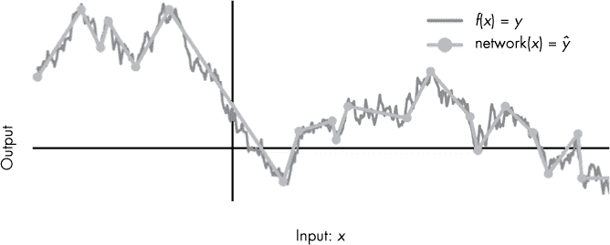

*图 10-3：小型神经网络如何逼近复杂函数的示例。随着神经元数量的增加，*y*与ŷ之间的差异将接近 0。*

在接下来的章节中，我们手动构建一个简单的神经网络，以帮助你理解在给定正确参数的情况下，如何以及为什么我们可以建模如此不同的行为。虽然我们仅使用单一的输入和输出进行非常小规模的操作，但同样的原理适用于处理多个输入和输出，以及极其复杂的行为。

#### ***构建你自己的神经网络***

为了看到这种普遍性，让我们尝试构建我们自己的神经网络。我们从两个 ReLU 神经元开始，使用单一的输入 *x*，如图 10-4 所示。然后，我们看看不同的权重和偏置值（参数）如何用于建模不同的函数和结果。

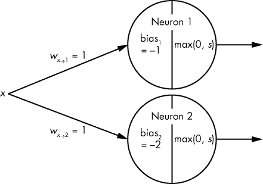

*图 10-4：两个神经元输入数据 x 的可视化*

在这里，两个神经元的权重都是 1，并且都使用 ReLU 激活函数。它们之间的唯一区别是神经元[1]应用了一个偏置值 –1，而神经元[2]应用了偏置值 –2。让我们看看当我们向神经元[1]输入不同的 *x* 值时会发生什么。表格 10-2 总结了结果。

**表格 10-2：** 神经元[1]

| **输入** | **加权和** | **加权和 + 偏置** | **输出** |
| --- | --- | --- | --- |
| *x* | *x** *w*[*x*→1] | *x** *w*[*x*→1] + bias[1] | max(0, *x** *w*[*x*→1] + bias[1]) |
| --- | --- | --- | --- |
| 0 | 0 * 1 = 0 | 0 + –1 = –1 | max(0, –1) = 0 |
| 1 | 1 * 1 = 1 | 1 + –1 = 0 | max(0, 0) = 0 |
| 2 | 2 * 1 = 2 | 2 + –1 = 1 | max(0, 1) = 1 |
| 3 | 3 * 1 = 3 | 3 + –1 = 2 | max(0, 2) = 2 |
| 4 | 4 * 1 = 4 | 4 + –1 = 3 | max(0, 3) = 3 |
| 5 | 5 * 1 = 5 | 5 + –1 = 4 | max(0, 4) = 4 |

第一列展示了一些 *x* 的输入示例，第二列展示了相应的加权和。第三列加上了偏置参数，第四列应用 ReLU 激活函数，得到给定 *x* 输入时神经元的输出。图 10-5 展示了神经元[1]的函数图。

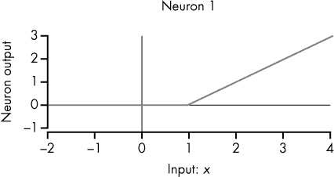

*图 10-5：神经元[1]作为函数的可视化。x 轴表示神经元的单一输入值，y 轴表示神经元的输出。*

由于神经元[1]的偏置是 –1，神经元[1]的输出始终为 0，直到加权和超过 1，然后以一定的斜率上升，正如你在图 10-5 中看到的那样。斜率为 1，这与 *w*[*x*→1] 的权重值 1 相关。想象一下如果权重是 2 会发生什么：因为加权和值会翻倍，图 10-5 中的角度会出现在 *x* = 0.5，而不是 *x* = 1，直线的斜率将变为 2，而不是 1。

现在让我们看看神经元[2]，它的偏置值为 –2（见表格 10-3）。

**表格 10-3：** 神经元[2]

| **输入** | **加权和** | **加权和 + 偏置** | **输出** |
| --- | --- | --- | --- |
| *x* | *x** *w*[*x*→2] | *x** *w*[*x*→2] + bias[2] | max(0, *x** *w*[*x*→2]) + bias[2]) |
| --- | --- | --- | --- |
| 0 | 0 * 1 = 0 | 0 + –2 = –2 | max(0, –2) = 0 |
| 1 | 1 * 1 = 1 | 1 + –2 = –1 | max(0, –1) = 0 |
| 2 | 2 * 1 = 2 | 2 + –2 = 0 | max(0, 0) = 0 |
| 3 | 3 * 1 = 3 | 3 + –2 = 1 | max(0, 1) = 1 |
| 4 | 4 * 1 = 4 | 4 + –2 = 2 | max(0, 2) = 2 |
| 5 | 5 * 1 = 5 | 5 + –2 = 3 | max(0, 3) = 3 |

因为 neuron[2]的偏置是–2，所以图 10-6 中的角度出现在*x* = 2 而不是*x* = 1。

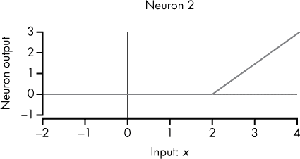

*图 10-6：neuron[2]作为函数的可视化*

所以现在我们已经构建了两个非常简单的函数（神经元），它们在一段时间内什么都不做，然后以斜率 1 无限增长。因为我们使用的是 ReLU 神经元，每个神经元的函数斜率会受到其权重的影响，而其偏置和权重项则决定了斜率的起点。当使用其他激活函数时，也会遵循类似的规则。通过调整参数，我们可以随意改变每个神经元函数的角度和斜率。

然而，为了实现普适性，我们需要将神经元组合在一起，这将使我们能够逼近更复杂的函数。让我们将两个神经元连接到第三个神经元，如图 10-7 所示。这将创建一个由 neuron[1]和 neuron[2]组成的小型三神经元网络，并包含一个隐藏层。

在图 10-7 中，输入数据*x*被发送到 neuron[1]和 neuron[2]。然后，neuron[1]和 neuron[2]的输出作为输入传送到 neuron[3]，最终得出网络的输出结果。

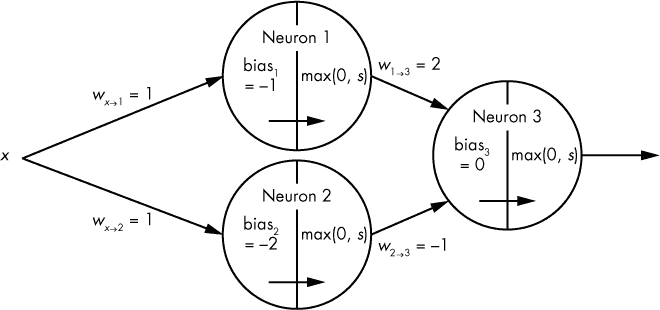

*图 10-7：小型三神经元网络的可视化*

如果你检查图 10-7 中的权重，你会发现权重 *w*[1→3] 是 2，意味着 neuron[1]对 neuron[3]的贡献被放大了两倍。同时，*w*[2→3] 是–1，表示 neuron[2]的贡献被反转。本质上，neuron[3]只是在将其激活函数应用于 neuron[1] * 2 – neuron[2]。 表 10-4 总结了该网络的输入和相应的输出。

**表 10-4：三神经元网络**

| **原始网络输入** | **输入到 neuron[3]的值** | **加权和** | **加权和 + 偏置** | **最终网络输出** |
| --- | --- | --- | --- | --- |
| *x* | neuron[1] | neuron[2] | (neuron[1] * *w*[1→3]) + (neuron[2] * *w*[2→3]) | (neuron[1] * *w*[1→3]) + (neuron[2] * *w*[2→3]) + bias[3] | max(0, (neuron[1] * *w*[1→3]) + (neuron[2] * *w*[2→3]) + bias[3]) |
| --- | --- | --- | --- | --- | --- |
| 0 | 0 | 0 | (0 * 2) + (0 * –1) = 0 | 0 + 0 + 0 = 0 | max(0, 0) = 0 |
| 1 | 0 | 0 | (0 * 2) + (0 * –1) = 0 | 0 + 0 + 0 = 0 | max(0, 0) = 0 |
| 2 | 1 | 0 | (1 * 2) + (0 * –1) = 2 | 2 + 0 + 0 = 2 | max(0, 2) = 2 |
| 3 | 2 | 1 | (2 * 2) + (1 * –1) = 3 | 4 + –1 + 0 = 3 | max(0, 3) = 3 |
| 4 | 3 | 2 | (3 * 2) + (2 * –1) = 4 | 6 + –2 + 0 = 4 | max(0, 4) = 4 |
| 5 | 4 | 3 | (4 * 2) + (3 * –1) = 5 | 8 + –3 + 0 = 5 | max(0, 5) = 5 |

第一列显示原始网络输入 *x*，随后是神经元[1]和神经元[2]的输出。其余列显示神经元[3]如何处理输出：计算加权和，加入偏置，最后在最后一列应用 ReLU 激活函数，从而得出每个原始输入值 *x* 的神经元和网络输出。图 10-8 显示了网络的功能图。

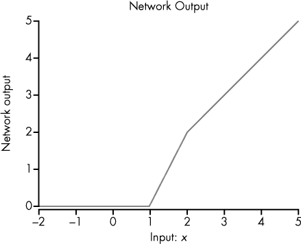

*图 10-8：我们的网络输入和相应输出的可视化*

我们可以看到，通过这些简单函数的组合，我们可以创建一个图形，使其在不同点上具有任意的上升斜率或周期，正如我们在图 10-8 中所做的那样。换句话说，我们离能够为我们的输入 *x* 表示任何有限函数的目标更近了！

#### ***向网络中添加另一个神经元***

我们已经看到如何通过添加神经元使网络的功能图上升（具有任意斜率），但我们如何让图形下降呢？让我们向网络中添加另一个神经元（神经元[4]），如图 10-9 所示。

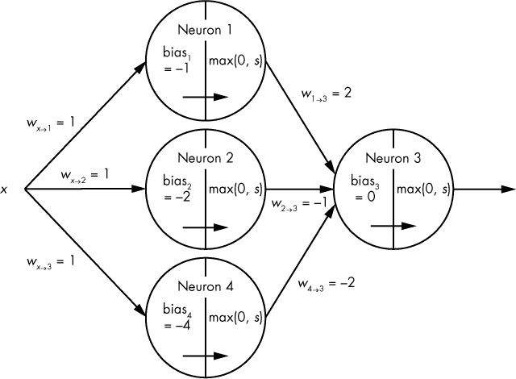

*图 10-9：带有单个隐藏层的小型四神经元网络的可视化*

在图 10-9 中，输入数据 *x* 被传送到神经元[1]、神经元[2] 和神经元[4]。它们的输出随后作为输入传递给神经元[3]，最终产生网络的最终输出。神经元[4]与神经元[1]和神经元[2]相同，但其偏置被设置为–4。表 10-5 总结了神经元[4]的输出。

**表 10-5：神经元[4]**

| **输入** | **加权和** | **加权和 + 偏置** | **输出** |
| --- | --- | --- | --- |
| *x* | *x* * *w*[*x*→4] | (*x* * *w*[*x*→4]) + 偏置[4] | max(0, (*x* * *w*[*x*→4]) + 偏置[4]) |
| --- | --- | --- | --- |
| 0 | 0 * 1 = 0 | 0 + –4 = –4 | max(0, –4) = 0 |
| 1 | 1 * 1 = 1 | 1 + –4 = –3 | max(0, –3) = 0 |
| 2 | 2 * 1 = 2 | 2 + –4 = –2 | max(0, –2) = 0 |
| 3 | 3 * 1 = 3 | 3 + –4 = –1 | max(0, –1) = 0 |
| 4 | 4 * 1 = 4 | 4 + –4 = 0 | max(0, 0) = 0 |
| 5 | 5 * 1 = 5 | 5 + –4 = 1 | max(0, 1) = 1 |

为了让我们的网络图形下降，我们通过将连接神经元[4]到神经元[3]的权重设置为–2，从神经元[1]和神经元[2]的函数中减去神经元[4]的函数，来调整神经元[3]的加权和。表 10-6 显示了整个网络的新输出。

**表 10-6：四神经元网络**

| **原始网络输入** | **神经元[3]的输入** | **加权和** | **加权和 + 偏置** | **最终网络输出** |
| --- | --- | --- | --- | --- |
| *x* | 神经元[1] | 神经元[2] | 神经元[4] | (神经元[1] * *w*[1→3]) + (神经元[2] * *w*[2→3]) + (神经元[4] * *w*[4→3]) | (神经元[1] * *w*[1→3]) + (神经元[2] * *w*[2→3]) + (神经元[4] * *w*[4→3]) +偏置[3] | max(0, (神经元[1] * *w*[1→3]) + (神经元[2] * *w*[2→3]) + (神经元[4] * *w*[4→3]) + 偏置[3]) |
| --- | --- | --- | --- | --- | --- | --- |
| 0 | 0 | 0 | 0 | (0 * 2) + (0 * –1) + (0 * –2) = 0 | 0 + 0 + 0 + 0 = 0 | max(0, 0) = 0 |
| 1 | 0 | 0 | 0 | (0 * 2) + (0 * –1) + (0 * –2) = 0 | 0 + 0 + 0 + 0 = 0 | max (0, 0) = 1 |
| 2 | 1 | 0 | 0 | (1 * 2) + (0 * –1) + (0 * –2) = 2 | 2 + 0 + 0 + 0 = 2 | max (0, 2) = 2 |
| 3 | 2 | 1 | 0 | (2 * 2) + (1 * –1) + (0 * –2) = 3 | 4 + –1 + 0 + 0 = 3 | max (0, 3) = 3 |
| 4 | 3 | 2 | 0 | (3 * 2) + (2 * –1) + (0 * –2) = 4 | 6 + –2 + 0 + 0 = 4 | max (0, 4) = 4 |
| 5 | 4 | 3 | 1 | (4 * 2) + (3 * –1) + (1 * –2) = 5 | 8 + –3 + –2 + 0 = 3 | max (0, 3) = 3 |

图 10-10 显示了这一过程的具体样子。

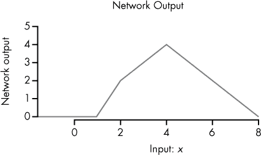

*图 10-10：我们的四神经元网络的可视化*

希望现在你能看到神经网络架构是如何通过结合多个简单的神经元（普适性！）来使我们在图表上的任何点上以任意速率上下移动的。我们可以继续添加更多神经元，以创建更加复杂的功能。

#### ***自动特征生成***

你已经学到，具有单个隐藏层的神经网络可以通过足够的神经元来逼近任何有限的函数。这是一个相当强大的想法。但如果我们有多个隐藏层的神经元会怎样呢？简而言之，自动特征生成发生了，这可能是神经网络的一个更强大的方面。

历史上，构建机器学习模型的一个重要部分是特征提取。对于 HTML 文件来说，通常会花费大量时间来决定 HTML 文件的哪些数字特征（例如章节标题的数量、唯一单词的数量等等）可能有助于模型。

拥有多个层和自动特征生成的神经网络使我们能够卸载大量的工作。一般来说，如果你将相对原始的特征（例如 HTML 文件中的字符或单词）提供给神经网络，每一层神经元都可以学习以适当的方式表示这些原始特征，这些表示将作为后续层的输入。换句话说，神经网络将学会统计字母*a*在 HTML 文档中出现的次数，如果这对检测恶意软件特别相关，即使没有人类明确指出它是否相关。

在我们的图像处理自行车示例中，没人特别告诉网络边缘或车轮的元特征是有用的。模型在训练过程中学会了这些特征作为输入传递到下一个神经元层时的有用性。特别有用的是，这些低级的学习到的特征可以被后续层以不同的方式使用，这意味着深度神经网络可以使用比单层网络更少的神经元和参数来估计许多极其复杂的模式。

神经网络不仅完成了以前需要大量时间和精力的特征提取工作，而且它们以优化和节省空间的方式完成这些工作，且由训练过程引导。

### **训练神经网络**

到目前为止，我们已经探讨了如何在给定大量神经元以及合适的权重和偏置项的情况下，神经网络可以逼近复杂的函数。在我们迄今为止的所有示例中，我们手动设置了这些权重和偏置参数。然而，由于真实的神经网络通常包含成千上万的神经元和数百万个参数，我们需要一种高效的方式来优化这些值。

通常，在训练一个模型时，我们从一个训练数据集和一个拥有一堆未优化（随机初始化）参数的网络开始。训练需要优化参数，以最小化目标函数。在监督学习中，我们试图训练模型以预测标签，比如 0 代表“良性”而 1 代表“恶意软件”，这个*目标函数*将与网络在训练过程中的预测误差相关。对于某个给定的输入 *x*（例如，特定的 HTML 文件），这是我们知道的正确标签 *y*（例如，1.0 代表“是恶意软件”）和我们从当前网络得到的输出 *ŷ*（例如，0.7）之间的差异。你可以把误差看作是预测标签 *ŷ* 和已知的真实标签 *y* 之间的差异，其中网络 (*x*) = *ŷ*，而网络试图逼近某个未知的函数 *f*，使得 *f*(*x*) = *y*。换句话说，网络 = 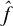。

训练网络的基本思想是将一个来自训练数据集的观测值 *x* 输入网络，接收一个输出 *ŷ*，然后找出如何改变参数能使 *ŷ* 更接近你的目标 *y*。想象你在一个宇宙飞船中，飞船上有各种旋钮。你不知道每个旋钮的作用，但你知道你想去的方向是 (*y*)。为了解决这个问题，你踩下油门并记录你行进的方向 (*ŷ*)。然后，你稍微调节一个旋钮，再次踩下油门。你第一次和第二次的方向差异告诉你那个旋钮对方向的影响有多大。通过这种方式，你最终可以学会如何非常好地驾驶飞船。

训练神经网络类似。首先，你将一个来自训练数据集的观测值，*x*，输入网络，并接收到某些输出，*ŷ*。这一步骤被称为*前向传播*，因为你将输入 *x* 向前传递通过网络，得到最终的输出 *ŷ*。接下来，你需要确定每个参数如何影响你的输出 *ŷ*。例如，如果你的网络输出是 0.7，但你知道正确的输出应该更接近 1，你可以尝试稍微增加一个参数，*w*，看看 *ŷ* 是接近还是远离 *y*，并且相差多少。² 这就叫做 *ŷ* 关于 *w* 的偏导数，或者 *∂ŷ/∂w*。

网络中的所有参数随后都会在一个方向上微调一个 *极小* 的量，使得 *ŷ* 稍微接近 *y*（从而网络更接近 *f*）。如果 *∂ŷ/∂w* 为正，则说明你应该增加 *w* 一个小量（具体来说，比例为 *∂*(*y* – *ŷ*)/*∂w*），以使新的 *ŷ* 从 0.7 稍微远离，接近 1（*y*）。换句话说，你通过纠正训练数据中带标签的错误，教会你的网络近似 *未知* 函数 *f*。

反复计算这些偏导数、更新参数，然后重复这一过程的过程称为 *梯度下降*。然而，对于包含成千上万神经元、数百万参数和通常数百万训练样本的网络来说，所有这些微积分运算需要大量计算。为了绕开这个问题，我们使用一个巧妙的算法，称为 *反向传播*，它使得这些计算在计算上可行。反向传播的核心是，它允许我们高效地沿着计算图（如神经网络）计算偏导数！

#### ***使用反向传播优化神经网络***

在这一节中，我们构建了一个简单的神经网络，展示反向传播是如何工作的。假设我们有一个训练样本，其值为 *x* = 2，并且其真实标签为 *y* = 10。通常，*x* 会是一个包含多个值的数组，但为了简单起见，我们就用一个单一的值。将这些值代入后，我们可以看到在 图 10-11 中，当输入 *x* 为 2 时，网络输出的 *ŷ* 值为 5。

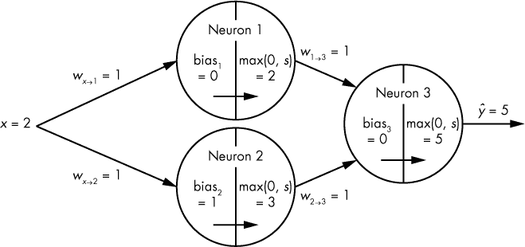

*图 10-11：我们三层神经网络的可视化，输入为* x *= 2*

为了调整我们的参数，使得网络的输出 *ŷ*（在 *x* = 2 下）更接近我们已知的 *y* 值 10，我们需要计算 *w*[1→3] 如何影响最终的输出 *ŷ*。让我们来看一下，当我们将 *w*[1→3] 增加一点（比如 0.01）时会发生什么。神经元[3]中的加权和变为 1.01 * 2 + (1 * 3)，使得最终的输出 *ŷ* 从 5 改变为 5.02，结果增加了 0.02。换句话说，*ŷ* 关于 *w*[1→3] 的偏导数为 2，因为改变 *w*[1→3] 会使 *ŷ* 改变两倍。

因为 *y* 为 10，而当前的输出 *ŷ*（在当前参数值和 *x* = 2 下）为 5，所以我们现在知道应该稍微增加 *w*[1→3]，以将 *y* 移动得更接近 10。

这相当简单。但是我们需要能够知道在网络中如何调整*所有*参数的方向，而不仅仅是最终层中神经元的参数。例如，*w*[*x*→1]呢？计算 *∂ŷ*/*∂w*[*x*→1] 更复杂，因为它只是*间接地*影响*ŷ*。首先，我们询问神经元[3]的函数，看看神经元[1]的输出如何影响*ŷ*。如果我们将神经元[1]的输出从 2 改为 2.01，神经元[3]的最终输出将从 5 改为 5.01，所以 *∂ŷ*/*∂*neuron[1] = 1。为了知道 *w*[*x*→1] 如何影响 *ŷ*，我们只需要将 *∂ŷ*/*∂*neuron[1] 乘以 *w*[*x*→1] 如何影响神经元[1]的输出。如果我们将 *w*[*x*→1] 从 1 改为 1.01，神经元[1]的输出将从 2 改为 2.02，所以 *∂*neuron[1]/*∂w*[*x*→1] 是 2。因此：

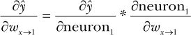

或者：

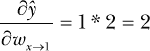

你可能已经注意到，我们刚才使用了链式法则。³

换句话说，要弄清楚像 *w*[*x*→1] 这样深处于网络中的参数如何影响我们的最终输出 *ŷ*，我们需要将每一条路径上偏导数的值相乘，直到路径结束。也就是说，如果 *w*[*x*→1] 输入到一个神经元，这个神经元的输出输入到十个其他神经元，那么计算 *w*[*x*→1] 对 *ŷ* 的影响将涉及对所有从 *w*[*x*→1] 到 *ŷ* 的路径进行求和，而不仅仅是计算一条路径的影响。图 10-12 可视化了由示例权重参数 *w*[*x*→2] 影响的路径。

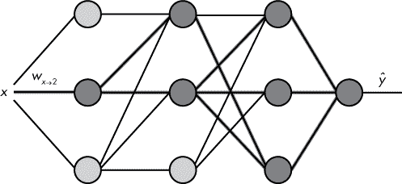

*图 10-12：受* w[*x*→2] *影响的路径的可视化（显示为深灰色）：输入数据* x *与第一层（最左边）中间神经元之间连接的权重*

请注意，这个网络中的隐藏层并不是完全连接的层，这有助于解释为什么第二个隐藏层的底部神经元没有被高亮显示。

#### ***路径爆炸***

但是当我们的网络变得更大时会发生什么呢？我们需要添加的路径数量以指数级增加，以计算低层参数的偏导数。考虑一个神经元，它的输出输入到一层 1000 个神经元，这些神经元的输出再输入到另外 1000 个神经元，最后这些输出再输入到一个最终的输出神经元。

这导致了上百万条路径！幸运的是，逐条遍历每一条路径并将其加总以获得 *∂ŷ*/(*∂*parameter) 是不必要的。这时反向传播就显得非常有用了。我们不需要沿着每一条路径走到最终输出 *ŷ*，而是逐层计算偏导数，从上到下，或者反向进行。

使用上一节中的链式法则逻辑，我们可以计算任何偏导数 *∂ŷ*/*∂w*，其中 *w* 是连接层[*i*–1]的输出到层[*i*]中神经元[*i*]的一个参数，通过对所有神经元[*i*][+1]进行求和，其中每个神经元[*i*][+1] 是层[*i*][+1] 中与神经元[*i*]（即 *w* 所连接的神经元）相连的神经元：

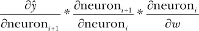

通过从上到下逐层进行，我们通过在每一层合并导数来限制路径爆炸。换句话说，在顶层[*i*+1]中计算的导数（如*∂ŷ*/*∂*neuron[*i*+1]）会被记录下来，帮助计算第[*i*]层的导数。然后，为了计算第[*i*]层的导数[–1]，我们使用来自第[*i*]层的已保存导数（如*∂ŷ*/*∂*neuron[*i*]）。接着，第[*i*]层[–2]使用来自第[*i*–1]层的导数，以此类推。这个技巧大大减少了我们需要重复的计算量，并帮助我们更快速地训练神经网络。

#### ***梯度消失***

很深的神经网络面临的一个问题是*梯度消失*问题。考虑一个神经网络中第一层的权重参数，这个网络有十层。它从反向传播中得到的信号是该权重的神经元到最终输出的所有路径信号的总和。

问题在于，每条路径的信号可能会变得非常微小，因为我们通过在沿着十层神经元深的路径的每一点上乘以偏导数来计算该信号，这些偏导数的值往往小于 1。这意味着低层神经元的参数是基于大量非常小的数值的总和来更新的，其中许多数值会相互抵消。因此，网络很难协调向较低层的参数发送强信号。随着更多层的添加，这个问题会呈指数级恶化。正如你在下一部分中将学到的，某些网络设计试图绕过这个普遍存在的问题。

### **神经网络的类型**

为了简便起见，到目前为止我展示的每个例子都使用了一种叫做前馈神经网络的网络类型。实际上，还有许多其他有用的网络结构可以用于不同类别的问题。让我们讨论一些最常见的神经网络类别，以及它们在网络安全背景下的应用。

#### ***前馈神经网络***

最简单（也是最初）类型的神经网络——前馈神经网络——就像是没有配件的芭比娃娃：其他类型的神经网络通常只是这种“默认”结构的变种。前馈架构应该听起来很熟悉：它由一层层神经元堆叠组成。每一层神经元都与下一层中的某些或所有神经元相连，但连接从不反向或形成循环，因此得名“前馈”。

在前馈神经网络中，存在的每个连接都是将第*i*层的神经元（或原始输入）连接到第*j*层的神经元，其中*j* > *i*。第*i*层中的每个神经元不一定要与第*i*+1 层中的每个神经元连接，但所有连接必须是前馈的，将前面的层与后面的层连接起来。

前馈网络通常是你在面对问题时首先采用的网络，除非你已经知道另一种在当前问题上表现特别好的架构（比如用于图像识别的卷积神经网络）。

#### ***卷积神经网络***

一个*卷积神经网络（CNN）*包含卷积层，其中每个神经元输入的内容是通过一个滑动窗口定义的，该窗口在输入空间上滑动。想象一个小方形窗口在一张较大的图片上滑动，只有通过窗口可见的像素才会连接到下一层的特定神经元。然后，窗口继续滑动，新的像素集合连接到新的神经元。图 10-13 展示了这一过程。

这些网络的结构鼓励局部特征学习。例如，网络的低层更专注于图像中相邻像素之间的关系（这些关系形成边缘、形状等），而不是专注于图像中随机散布的像素之间的关系（这些关系通常意义不大）。滑动窗口明确地强制了这种聚焦，这有助于在局部特征提取尤为重要的领域加快学习速度。

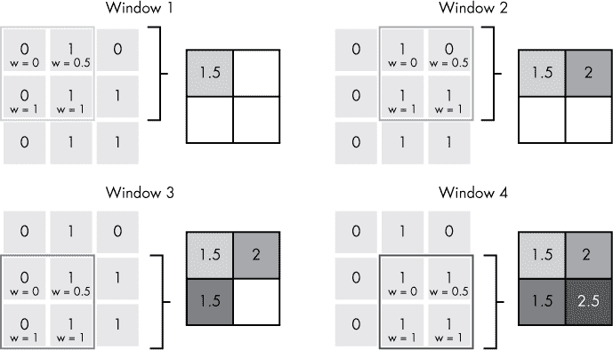

*图 10-13：一个 2 × 2 的卷积窗口在 3 × 3 的输入空间上滑动，步幅（步长）为 1，得到 2 × 2 的输出*

由于能够专注于输入数据的局部部分，卷积神经网络在图像识别和分类中非常有效。它们也已被证明在某些类型的自然语言处理任务中有效，这对网络安全有重要意义。

在每个卷积窗口的值被输入到卷积层的特定神经元后，窗口再次滑动，覆盖*这些*神经元的输出，但不同于将其输入到标准神经元（例如 ReLU）并为每个输入分配权重的方式，它们被输入到没有权重的神经元（即固定为 1）和最大值（或类似）激活函数中。换句话说，一个小窗口被滑过卷积层的输出，每个窗口的最大值被取出并传递到下一层。这称为*池化层*。池化层的目的是对数据（通常是图像）进行“缩小”，从而减少特征的大小以加速计算，同时保留最重要的信息。

卷积神经网络可以包含一个或多个卷积层和池化层的组合。标准架构可能包括一个卷积层，一个池化层，接着是另一组卷积层和池化层，最后是几层全连接层，就像在前馈神经网络中一样。这个架构的目标是使这些最终的全连接层接收相对较高层次的特征作为输入（例如单轮车的轮子），从而能够准确地分类复杂的数据（如图像）。

#### ***自编码神经网络***

*自编码器* 是一种神经网络，它试图在原始训练输入和解压后的输出之间保持最小差异，来压缩并解压输入。自编码器的目标是学习一组数据的高效表示。换句话说，自编码器充当像优化过的有损压缩程序一样，它们将输入数据压缩成更小的表示，再解压回原始输入大小。

自编码器网络不是通过最小化已知标签（*y*）与预测标签（*ŷ*）之间的差异来优化参数，而是通过最小化原始输入 *x* 与重建输出之间的差异来优化！images。

在结构上，自编码器通常与标准的前馈神经网络非常相似，不同之处在于中间层的神经元数量比早期和后期的层要少，正如图 10-14 所示。

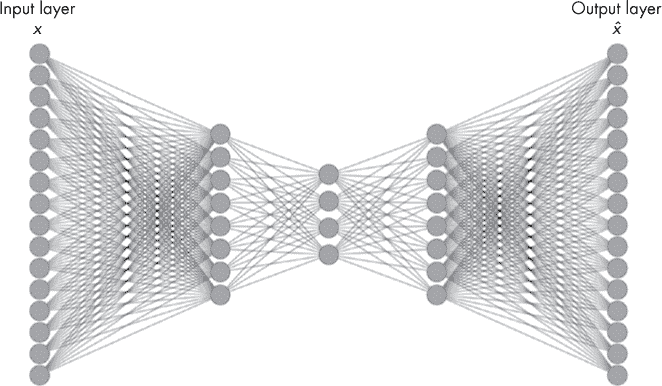

*图 10-14：自编码器网络的可视化*

如你所见，中间层比最左侧（输入）和最右侧（输出）层要小得多，而这两层的大小相同。最后一层应始终包含与原始输入相同数量的输出，这样每个训练输入 *x*[*i*] 就可以与其压缩和重建后的副本进行比较！images。

自编码器网络训练完成后，可以用于不同的目的。自编码器网络可以简单地作为高效的压缩/解压程序。例如，训练用于压缩图像文件的自编码器，可以创建比使用 JPEG 压缩相同图像到相同大小时更加清晰的图像。

#### ***生成对抗网络***

*生成对抗网络（GAN）* 是一组 *两个* 神经网络互相竞争、提升各自任务的系统。通常，*生成* 网络尝试从随机噪声中生成假样本（例如某种图像）。然后，第二个 *判别器* 网络试图区分真实样本和假生成样本之间的差异（例如，区分真实卧室图像与生成的图像）。

GAN 中的两个神经网络都通过反向传播进行优化。生成器网络根据它在某一回合中如何欺骗判别器网络来优化其参数，而判别器网络则根据它能够多准确地区分生成样本和真实样本来优化其参数。换句话说，它们的损失函数是彼此的直接对立面。

GANs 可用于生成逼真的数据或增强低质量或损坏的数据。

#### ***递归神经网络***

*递归神经网络（RNN）* 是一类相对广泛的神经网络，其中神经元之间的连接形成有向循环，其激活函数依赖于时间步。这样，网络就能发展出记忆，帮助它学习数据序列中的模式。在 RNN 中，输入、输出或输入和输出都可以是某种时间序列。

RNNs 非常适用于数据顺序重要的任务，如连写识别、语音识别、语言翻译和时间序列分析。在网络安全领域，它们与诸如网络流量分析、行为检测和静态文件分析等问题相关。因为程序代码类似于自然语言，顺序同样重要，因此可以将其视为时间序列。

RNNs 的一个问题是，由于梯度消失问题，RNN 中每个时间步引入的内容类似于前馈神经网络中的整个额外层。在反向传播过程中，梯度消失问题使得低层（或在这种情况下，较早的时间步）中的信号变得非常微弱。

*长短期记忆（LSTM）网络*是一种专门设计用来解决这一问题的 RNN。LSTM 包含 *记忆单元* 和特殊的神经元，旨在决定记住哪些信息以及忘记哪些信息。丢弃大部分信息大大限制了梯度消失问题，因为它减少了路径爆炸。

#### ***ResNet***

*ResNet*（*残差网络*的简称）是一种神经网络，通过在网络的早期/浅层与更深层之间创建 *跳跃连接*，即跳过一个或多个中间层来实现。这里的 *残差* 一词指的是这些网络学习直接在层之间传递数据信息，而无需通过我们在 表 10-1 中说明的激活函数。

这种结构大大减少了梯度消失问题，使得 ResNet 能够变得非常深——有时可以达到超过 100 层。

非常深的神经网络擅长建模输入数据中极其复杂和异常的关系。由于 ResNet 可以拥有如此多的层，它们特别适合复杂问题。像前馈神经网络一样，ResNet 更重要的是因其在解决复杂问题方面的通用有效性，而不是在非常具体的领域中的专长。

### **总结**

在本章中，你学习了神经元的结构以及它们如何连接在一起形成神经网络。你还探讨了这些网络是如何通过反向传播进行训练的，并且发现了一些神经网络的优缺点，例如普适性、自动特征生成以及梯度消失问题。最后，你了解了几种常见神经网络的结构和优点。

在下一章，你将使用 Python 的`Keras`包实际构建神经网络来检测恶意软件。
