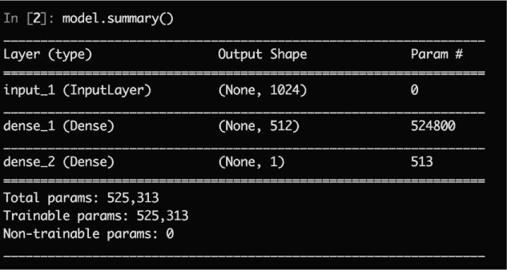
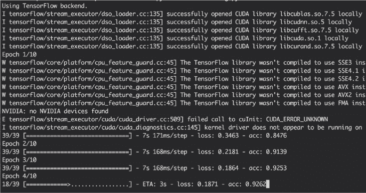
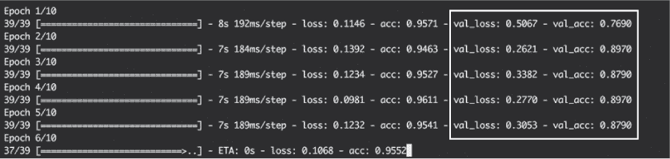
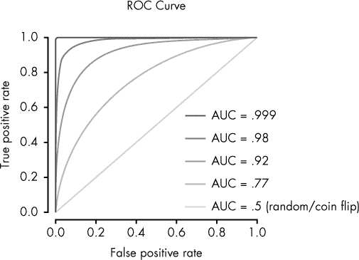
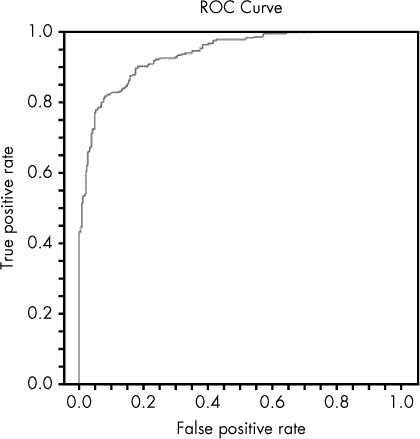
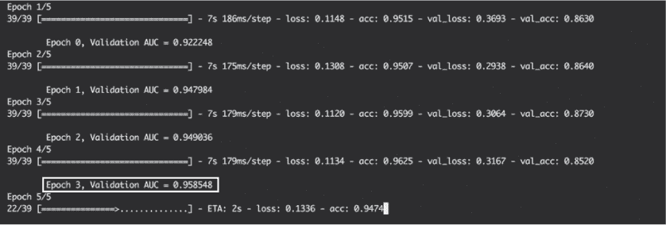

## 11

使用 Keras 构建一个神经网络恶意软件检测器


十年前，构建一个功能完善、可扩展且快速的神经网络既费时又需要大量代码。然而，在过去的几年里，这一过程变得不那么痛苦了，因为越来越多的高级神经网络设计接口已经开发出来。Python 包 `Keras` 就是其中之一。

在本章中，我将带你通过使用 `Keras` 包构建一个示例神经网络。首先，我会解释如何在 `Keras` 中定义模型架构。其次，我们将训练这个模型来区分良性和恶意的 HTML 文件，你将学习如何保存和加载这些模型。第三，使用 Python 包 `sklearn`，你将学习如何评估模型在验证数据上的准确性。最后，我们将用你所学的知识将验证准确性报告集成到模型训练过程中。

我鼓励你在阅读本章的同时，阅读并编辑附带本书的数据中的相关代码。你可以在那里找到本章讨论的所有代码（已经组织成参数化函数，便于运行和调整），以及一些额外的示例。到本章结束时，你将感到准备好开始构建自己的神经网络了！

要运行本章中的代码示例，你不仅需要安装本章中 *ch11/requirements.txt* 文件中列出的包（`pip install –r requirements.txt`），还需要按照指示在系统中安装 `Keras` 的后端引擎（TensorFlow、Theano 或 CNTK）。按照这里的说明安装 TensorFlow： *[`www.tensorflow.org/install/`](https://www.tensorflow.org/install/)*。

### 定义模型架构

要构建一个神经网络，你需要定义它的架构：哪些神经元去哪里，它们如何连接到后续的神经元，以及数据如何在整个网络中流动。幸运的是，`Keras` 提供了一个简单、灵活的接口来定义这一切。`Keras` 实际上支持两种相似的模型定义语法，但我们将使用功能 API 语法，因为它比其他（“顺序”）语法更加灵活和强大。

在设计模型时，你需要三样东西：输入、中间的处理部分以及输出。有时，你的模型会有多个输入、多个输出，并且中间的部分非常复杂，但基本的思路是，当定义一个模型的架构时，你只是定义了输入——你的数据，比如与 HTML 文件相关的特征——是如何通过各个神经元（即中间部分）流动的，直到最后的神经元输出某些结果。

为了定义这个架构，`Keras`使用层。*层*是一组神经元，这些神经元使用相同的激活函数，所有神经元接收来自上一层的数据，并将它们的输出发送到后一层神经元。在神经网络中，输入数据通常会被送入初始层的神经元，这些神经元将其输出传递给后续的层，然后继续传递，直到最后一层神经元生成网络的最终输出。

清单 11-1 是一个使用`Keras`的函数式 API 语法定义的简单模型示例。我鼓励你打开一个新的 Python 文件，跟着我们逐行讲解代码，同时自己动手编写和运行代码。或者，你也可以尝试运行本书附带的数据中的相关代码，可以通过将*ch11/model_architecture.py*文件的部分内容复制并粘贴到 ipython 会话中，或者在终端窗口中运行`python ch11/model_architecture.py`来尝试。

```
➊ from keras import layers
➋ from keras.models import Model

   input = layers.Input(➌shape=(1024,), ➍dtype='float32')
➎ middle = layers.Dense(units=512, activation='relu')(input)
➏ output = layers.Dense(units=1, activation='sigmoid')(middle)
➐ model = Model(inputs=input, outputs=output)
   model.compile(➑optimizer='adam', 
                 ➒loss='binary_crossentropy', 
                 ➓metrics=['accuracy'])
```

*清单 11-1：使用函数式 API 语法定义简单模型*

首先，我们导入`Keras`包的`layers`子模块➊，以及`Keras`的`models`子模块中的`Model`类➋。

接下来，我们通过将一个`shape`值（一个整数元组）➌和数据类型（字符串）➍传递给`layers.Input()`函数来指定此模型将接受的单个观测数据的类型。在这里，我们声明输入数据将是一个包含 1,024 个浮点数的数组。如果我们的输入是整数矩阵，第一行代码将更像是`input = Input(shape=(100, 100,) dtype='int32')`。

**注意**

*如果模型在一个维度上接受可变大小的输入，可以使用* None *代替数字——例如，*(100, None,)*。*

接下来，我们指定该输入数据将被发送到的神经网络层。为此，我们再次使用导入的`layers`子模块，特别是`Dense`函数➎，来指定这一层将是一个密集连接层（也称为全连接层），这意味着前一层的每个输出都会发送到这一层的每个神经元。`Dense`是你在开发`Keras`模型时最常用的层类型。其他层则允许你执行一些操作，例如更改数据的形状（`Reshape`）或实现自定义层（`Lambda`）。

我们将两个参数传递给 `Dense` 函数：`units=512`，表示我们希望这一层有 512 个神经元，以及 `activation='relu'`，表示我们希望这些神经元使用修正线性单元（ReLU）激活函数。（回想一下 第十章，ReLU 神经元使用一种简单的激活函数，输出两者中较大的值：要么是 0，要么是神经元输入的加权和。）我们使用 `layers.Dense(units=512, activation='relu')` 来定义这一层，然后行尾的 `（input）` 表示该层的输入（即我们的 `input` 对象）。理解这一点很重要，因为传递 `input` 给我们的层就是定义模型中数据流的方式，而不是代码行的顺序。

在下一行，我们定义了模型的输出层，同样使用了 `Dense` 函数。但这次，我们为该层指定了一个神经元，并使用 `'sigmoid'` 激活函数 ➏，该激活函数非常适合将大量数据合并成一个介于 0 和 1 之间的单一评分。输出层将 `(middle)` 对象作为输入，声明我们在 `middle` 层的 512 个神经元的输出都将发送到这个神经元。

现在我们已经定义了各层，使用 `models` 子模块中的 `Model` 类将所有这些层组合成一个模型 ➐。注意，你*只*需要指定输入层和输出层。因为每一层的输入来自前一层，所以最终的输出层包含了模型所需的所有前一层的信息。我们可以在 `input` 和 `output` 层之间再声明 10 个 `middle` 层，但在 ➐ 处的代码行将保持不变。

### 编译模型

最后，我们需要编译模型。我们已经定义了模型的架构和数据流，但还没有指定如何执行训练。为此，我们使用模型的 `compile` 方法，并传入三个参数：

+   第一个参数 `optimizer` ➑ 指定了要使用的反向传播算法类型。你可以通过字符字符串指定想要使用的算法名称，如我们这里所做的，或者直接从 `keras.optimizers` 导入一个算法，传入特定的参数，甚至设计你自己的算法。

+   `loss` 参数 ➒ 指定了在训练过程中（反向传播）要最小化的目标。具体来说，它指定了你希望用来表示真实训练标签和模型预测标签（输出）之间差异的公式。同样，你可以指定一个损失函数的名称，或者直接传入一个实际的函数，例如 `keras.losses.mean_squared_error`。

+   最后，对于`metrics`参数 ➓，你可以传递一个包含你希望`Keras`在训练期间和训练后分析模型性能时报告的度量列表。例如，你可以传递字符串或实际的度量函数，比如`['categorical_accuracy', keras.metrics.top_k_categorical_accuracy]`。

在运行列表 11-1 中的代码后，运行`model.summary()`以查看模型结构输出到你的屏幕上。你的输出应当类似于图 11-1。



*图 11-1：* `model.summary()` *的输出*

图 11-1 展示了`model.summary()`的输出。每一层的描述都会打印到屏幕上，连同与该层相关的参数数量。例如，`dense_1`层有 524,800 个参数，因为它的每个 512 个神经元都从输入层获取每一个 1,024 个输入值的副本，这意味着有 1,024 × 512 个权重。再加上 512 个偏置参数，得到 1,024 × 512 + 512 = 524,800。

虽然我们还没有训练我们的模型或在验证数据上测试它，但这是一个已编译的`Keras`模型，准备好进行训练！

**注意**

*查看 ch11/model_architecture.py 中的示例代码，了解一个稍微复杂一点的模型示例！*

### 训练模型

为了训练我们的模型，我们需要训练数据。本书随附的虚拟机包含约 50 万份良性和恶意 HTML 文件的数据。这些数据包括两个文件夹，分别是良性(*ch11/data/html/benign_files/*)和恶意(*ch11/data/html/malicious_files/*)HTML 文件。（记住不要在浏览器中打开这些文件！）在本节中，我们使用这些数据训练神经网络，预测 HTML 文件是良性（0）还是恶意（1）。

#### *特征提取*

为了实现这一点，我们首先需要决定如何表示我们的数据。换句话说，我们想从每个 HTML 文件中提取哪些特征作为模型的输入？例如，我们可以简单地将每个 HTML 文件的前 1,000 个字符传递给模型，或者传递字母表中所有字母的频率计数，或者我们可以使用 HTML 解析器来开发一些更复杂的特征。为了简化操作，我们将每个可变长度、可能非常大的 HTML 文件转换为一个统一大小的压缩表示，以便我们的模型能够快速处理并学习重要的模式。

在这个例子中，我们将每个 HTML 文件转换为一个长度为 1,024 的类别计数向量，其中每个类别计数表示 HTML 文件中哈希值解析为给定类别的标记数量。列表 11-2 展示了特征提取代码。

```
import numpy as np
import murmur
import re
import os

def read_file(sha, dir):
    with open(os.path.join(dir, sha), 'r') as fp:
       file = fp.read()
    return file

def extract_features(sha, path_to_files_dir,
                     hash_dim=1024, ➊split_regex=r"\s+"):
  ➋ file = read_file(sha=sha, dir=path_to_files_dir)
  ➌ tokens = re.split(pattern=split_regex, string=file)
    # now take the modulo(hash of each token) so that each token is replaced
    # by bucket (category) from 1:hash_dim.
    token_hash_buckets = [
      ➍ (murmur.string_hash(w) % (hash_dim - 1) + 1) for w in tokens
    ]
    # Finally, we'll count how many hits each bucket got, so that our features
    # always have length hash_dim, regardless of the size of the HTML file:
    token_bucket_counts = np.zeros(hash_dim)
    # this returns the frequency counts for each unique value in
    # token_hash_buckets:
    buckets, counts = np.unique(token_hash_buckets, return_counts=True)
    # and now we insert these counts into our token_bucket_counts object:
    for bucket, count in zip(buckets, counts):
      ➎ token_bucket_counts[bucket] = count
    return np.array(token_bucket_counts)
```

*列表 11-2：特征提取代码*

你不必理解这段代码的所有细节来理解`Keras`的工作原理，但我鼓励你阅读代码中的注释，更好地理解代码的执行过程。

`extract_features` 函数首先将一个 HTML 文件作为一个大字符串读取 ➋，然后根据正则表达式 ➌ 将这个字符串拆分成一组标记。接着，取每个标记的数字哈希值，并通过对每个哈希值取模 ➍ 将这些哈希值分为不同的类别。最终的特征集是每个类别中的哈希数量 ➎，类似于直方图的箱数。如果你愿意，可以尝试更改正则表达式 `split_regex` ➊，该表达式将 HTML 文件拆分成多个块，看看它如何影响结果的标记和特征。

如果你跳过了或者没有理解所有内容，也没关系：只需知道我们的 `extract_features` 函数接受一个 HTML 文件的路径作为输入，然后将其转换为一个长度为 1,024 的特征数组，或者任何 `hash_dim` 的值。

#### *创建数据生成器*

现在我们需要让我们的 `Keras` 模型真正基于这些特征进行训练。当数据量较少且已经加载到内存中时，你可以使用类似于 Listing 11-3 的一行代码来在 `Keras` 中训练你的模型。

```
# first you would load in my_data and my_labels via some means, and then:
model.fit(my_data, my_labels, epochs=10, batch_size=32)
```

*Listing 11-3: 当数据已经加载到内存时训练模型*

然而，当你开始处理大量数据时，这并不太实用，因为你无法一次性将所有训练数据加载到计算机内存中。为了解决这个问题，我们使用了稍微复杂但更具扩展性的 `model.fit_generator` 函数。你不会一次性将所有训练数据传递给这个函数，而是传递一个生成器，这个生成器会批量生成训练数据，以避免计算机的内存崩溃。

Python 生成器与 Python 函数非常相似，唯一不同的是它们有一个 `yield` 语句。生成器不会返回单一的结果，而是返回一个可以多次调用的对象，以产生多个或无限数量的结果。 Listing 11-4 展示了我们如何使用特征提取函数创建自己的数据生成器。

```
def my_generator(benign_files, malicious_files,
                 path_to_benign_files, path_to_malicious_files,
                 batch_size, features_length=1024):
    n_samples_per_class = batch_size / 2
  ➊ assert len(benign_files) >= n_samples_per_class
    assert len(malicious_files) >= n_samples_per_class
  ➋ while True:
        ben_features = [
            extract_features(sha, path_to_files_dir=path_to_benign_files,
                             hash_dim=features_length)
            for sha in np.random.choice(benign_files, n_samples_per_class,
                                        replace=False)
        ]
        mal_features = [
          ➌ extract_features(sha, path_to_files_dir=path_to_malicious_files,
                             hash_dim=features_length)
          ➍ for sha in np.random.choice(malicious_files, n_samples_per_class,
                                        replace=False)
        ]
      ➎ all_features = ben_features + mal_features
        labels = [0 for i in range(n_samples_per_class)] + [1 for i in range(
                  n_samples_per_class)]

        idx = np.random.choice(range(batch_size), batch_size)
      ➏ all_features = np.array([np.array(all_features[i]) for i in idx]) 
        labels = np.array([labels[i] for i in idx])
      ➐ yield all_features, labels
```

*Listing 11-4: 编写数据生成器*

首先，代码做了两个 `assert` 语句来检查数据是否足够 ➊。然后，在一个 `while` ➋ 循环中（这样它就会无限迭代），通过随机选择文件键的样本 ➍ 来抓取良性和恶性特征，然后使用我们的 `extract_features` 函数提取这些文件的特征 ➌。接下来，将良性和恶性特征及其关联标签（0 和 1）连接起来 ➎ 并打乱 ➏。最后，返回这些特征和标签 ➐。

一旦实例化，生成器应该每次调用生成器的 `next()` 方法时，生成 `batch_size` 个特征和标签供模型训练（50% 恶性，50% 良性）。

Listing 11-5 展示了如何使用本书随附的数据创建训练数据生成器，以及如何通过将生成器传递给模型的 `fit_generator` 方法来训练模型。

```
   import os

   batch_size = 128
   features_length = 1024
   path_to_training_benign_files = 'data/html/benign_files/training/'
   path_to_training_malicious_files = 'data/html/malicious_files/training/'
   steps_per_epoch = 1000 # artificially small for example-code speed!

➊ train_benign_files = os.listdir(path_to_training_benign_files)
➋ train_malicious_files = os.listdir(path_to_training_malicious_files)

   # make our training data generator!
➌ training_generator = my_generator(
       benign_files=train_benign_files,
       malicious_files=train_malicious_files,
       path_to_benign_files=path_to_training_benign_files,
       path_to_malicious_files=path_to_training_malicious_files,
       batch_size=batch_size,
       features_length=features_length
   )

➍ model.fit_generator(
    ➎ generator=training_generator,
    ➏ steps_per_epoch=steps_per_epoch,
    ➐ epochs=10
   )
```

*Listing 11-5: 创建训练生成器并使用它来训练模型*

尝试阅读这段代码以理解发生了什么。在导入必要的包并创建一些参数变量后，我们将无害数据 ➊ 和恶意数据 ➋ 的文件名读入内存（但不读取文件本身）。我们将这些值传递给新的`my_generator`函数 ➌ 来获取我们的训练数据生成器。最后，使用来自清单 11-1 的`model`，我们使用`model`内置的`fit_generator`方法 ➍ 开始训练。

`fit_generator`方法接受三个参数。`generator`参数 ➎ 指定了生成每个*批次*训练数据的数据生成器。在训练过程中，参数会通过对每个批次中的所有训练数据的信号进行平均来更新。`steps_per_epoch`参数 ➏ 设置我们希望模型每个*周期*处理的批次数量。因此，模型在每个周期看到的观察总数是`batch_size*steps_per_epoch`。按照惯例，模型每个周期看到的观察数量应等于数据集的大小，但在本章及虚拟机示例代码中，我减少了`steps_per_epoch`以加快代码的运行速度。`epochs`参数 ➐ 设置我们希望运行的周期数。

尝试在本书随附的*ch11/*目录中运行此代码。根据你计算机的性能，每个训练周期需要一定的时间来运行。如果你使用的是交互式会话，运行几轮后如果训练耗时较长，可以随时取消进程（CTRL-C）。这会停止训练而不丢失进度。取消进程后（或代码完成），你将拥有一个训练好的模型！你虚拟机屏幕上的输出应该类似于图 11-2。



*图 11-2：训练一个* Keras *模型的控制台输出*

顶部的几行表明，作为`Keras`默认后端的 TensorFlow 已加载。你还会看到一些警告，像在图 11-2 中那样；这些警告只是意味着训练将使用 CPU 而非 GPU（通常 GPU 在训练神经网络时比 CPU 快 2 到 20 倍，但对于本书的目的，基于 CPU 的训练是可以的）。最后，你会看到每个训练周期的进度条，显示当前周期剩余的时间，以及该周期的损失和准确率指标。

#### *结合验证数据*

在上一节中，你学会了如何使用可扩展的`fit_generator`方法在 HTML 文件上训练一个`Keras`模型。正如你所看到的，模型在训练过程中会打印出每个周期当前的损失和准确率统计数据。然而，你真正关心的是训练好的模型在*验证数据*上的表现，或者说它从未见过的数据。这更能代表模型在真实生产环境中将面临的数据。

在尝试设计更好的模型并确定训练时长时，应该尽量最大化 *验证准确度*，而不是 *训练准确度*，后者在 图 11-2 中展示过。更理想的是使用来自训练数据之后日期的验证文件，以更好地模拟生产环境。

列表 11-6 展示了如何使用 列表 11-4 中的 `my_generator` 函数将我们的验证特征加载到内存中。

```
   import os
   path_to_validation_benign_files = 'data/html/benign_files/validation/'
   path_to_validation_malicious_files = 'data/html/malicious_files/validation/'
   # get the validation keys:
   val_benign_file_keys = os.listdir(path_to_validation_benign_files)
   val_malicious_file_keys = os.listdir(path_to_validation_malicious_files)
   # grab the validation data and extract the features:
➊ validation_data = my_generator(
       benign_files=val_benign_files,
       malicious_files=val_malicious_files,
       path_to_benign_files=path_to_validation_benign_files,
       path_to_malicious_files=path_to_validation_malicious_files,
     ➋ batch_size=10000,
       features_length=features_length
➌ ).next()
```

*列表 11-6：通过使用* my_generator *函数将验证特征和标签读取到内存中*

这段代码与我们创建训练数据生成器的方式非常相似，唯一的区别是文件路径发生了变化，现在我们希望将所有验证数据加载到内存中。所以，我们不仅仅是创建生成器，而是创建了一个验证数据生成器 ➊，其 `batch_size` ➋ 设置为我们想要验证的文件数量，并且我们立即调用其 `.next()` ➌ 方法，仅调用一次。

现在我们已经将一些验证数据加载到内存中，`Keras` 允许我们在训练过程中简单地将验证数据传递给 `fit_generator()`，正如在 列表 11-7 中所示。

```
model.fit_generator(
  ➊ validation_data=validation_data,
    generator=training_generator,
    steps_per_epoch=steps_per_epoch,
    epochs=10
)
```

*列表 11-7：在训练期间使用验证数据进行自动监控*

列表 11-7 与 列表 11-5 的结尾几乎相同，唯一的不同是现在将 `validation_data` 传递给了 `fit_generator` ➊。这样有助于通过确保在计算训练损失和准确度的同时也计算验证损失和准确度，来增强模型监控。

现在，训练语句应该类似于 图 11-3 中的内容。



*图 11-3：使用验证数据训练* Keras *模型的控制台输出*

图 11-3 类似于 图 11-2，不同之处在于，现在不仅显示每个 epoch 的训练 `loss` 和 `acc` 指标，`Keras` 还计算并显示每个 epoch 的 `val_loss`（验证损失）和 `val_acc`（验证准确度）。一般来说，如果验证准确度下降而不是上升，那说明模型可能在过拟合训练数据，这时最好停止训练。如果验证准确度在上升，像这里的情况一样，就意味着模型仍在不断改进，你应该继续训练。

#### *保存和加载模型*

现在你已经知道如何构建和训练神经网络，让我们来看看如何保存它，以便你能与他人共享。

列表 11-8 展示了如何将训练好的模型保存到 *.h5* 文件 ➊ 中并重新加载 ➋（可能在稍后的时间）。

```
   from keras.models import load_model
   # save the model
➊ model.save('my_model.h5')
   # load the model back into memory from the file:
➋ same_model = load_model('my_model.h5')
```

*列表 11-8：保存和加载* Keras *模型*

### 评估模型

在模型训练部分，我们观察到一些默认的模型评估指标，如训练损失和准确率，以及验证损失和准确率。接下来，让我们回顾一些更复杂的指标，以便更好地评估我们的模型。

一个用于评估二分类预测器准确度的有用指标叫做*曲线下面积（AUC）*。这条曲线指的是接收者操作特征（ROC）曲线（见第八章），该曲线将假阳性率（x 轴）与真阳性率（y 轴）对所有可能的分数阈值进行绘制。

例如，我们的模型尝试通过使用 0（良性）到 1（恶性）之间的分数来预测文件是否为恶意。如果我们选择一个相对较高的分数阈值来将文件分类为恶意，那么我们会得到较少的假阳性（好）但也会得到较少的真正阳性（坏）。另一方面，如果我们选择较低的分数阈值，我们可能会有较高的假阳性率（坏）但检测率会非常高（好）。

这两种样本情况将作为两个点表示在我们模型的 ROC 曲线上，第一个点位于曲线的左侧，而第二个点则靠近右侧。AUC 通过简单地计算 ROC 曲线下方的面积来表示所有这些可能性，如图 11-4 所示。

简单来说，AUC 为 0.5 代表了抛硬币的预测能力，而 AUC 为 1 则表示完美。



*图 11-4：各种样本的 ROC 曲线。每条 ROC 曲线（线）对应一个不同的 AUC 值。*

我们可以使用我们的验证数据，通过示例 11-9 中的代码来计算验证集的 AUC。

```
   from sklearn import metrics

➊ validation_labels = validation_data[1]
➋ validation_scores = [el[0] for el in model.predict(validation_data[0])]
➌ fpr, tpr, thres = metrics.roc_curve(y_true=validation_labels,
                                       y_score=validation_scores)
➍ auc = metrics.auc(fpr, tpr)
   print('Validation AUC = {}'.format(auc))
```

*示例 11-9：使用* sklearn*的* metric *子模块计算验证 AUC*

在这里，我们将`validation_data`元组拆分为两个对象：表示验证标签的`validation_labels` ➊，以及表示展平的验证模型预测值的`validation_scores` ➋。然后，我们使用`sklearn`中的`metrics.roc_curve`函数来计算假阳性率、真阳性率和与模型预测相关的阈值 ➌。利用这些，我们再次使用`sklearn`函数计算 AUC 指标 ➍。

虽然我在这里不会详细介绍函数代码，但你也可以使用本书附带数据中的`ch11/model_evaluation.py`文件中的`roc_plot()`函数来绘制实际的 ROC 曲线，正如示例 11-10 中所示。

```
from ch11.model_evaluation import roc_plot
roc_plot(fpr=fpr, tpr=tpr, path_to_file='roc_curve.png')
```

*示例 11-10：使用* roc_plot *函数从本书附带的数据中创建 ROC 曲线图，位于* ch11/model_evaluation.py 中。

运行示例 11-10 中的代码应该会生成一张图（保存在*roc_curve.png*中），其样式如图 11-5 所示。



*图 11-5：一条 ROC 曲线！*

图 11-5 中的 ROC 曲线上的每个点都代表一个特定的假阳性率（x 轴）和真阳性率（y 轴），这些是与各种模型预测阈值（从 0 到 1）相关的。当假阳性率增加时，真阳性率也会增加，反之亦然。在生产环境中，您通常需要选择一个特定的阈值（即曲线上的某个点，假设验证数据与生产数据相似）来做出决策，依据您愿意容忍的假阳性率和您愿意冒着漏掉恶意文件的风险之间的平衡。

### 通过回调增强模型训练过程

到目前为止，您已经学习了如何设计、训练、保存、加载和评估`Keras`模型。尽管这已经足够让您有一个不错的起步，但我还想介绍一下`Keras`回调，它们可以让我们的模型训练过程变得更好。

`Keras`回调代表一组在训练过程中的某些阶段由`Keras`应用的函数。例如，您可以使用`Keras`回调来确保在每个训练周期结束时保存一个*.h5*文件，或者在每个训练周期结束时将验证 AUC 打印到屏幕上。这有助于记录并更精确地告知您模型在训练过程中的表现。

我们首先使用一个内置回调，然后再尝试编写自定义回调。

#### *使用内置回调*

要使用内置回调，只需在训练期间将回调实例传递给模型的`fit_generator()`方法即可。我们将使用`callbacks.ModelCheckpoint`回调，它会在每个训练周期后评估验证损失，并在当前模型的验证损失小于之前任何一个周期的验证损失时保存模型。为了实现这一点，回调需要访问我们的验证数据，因此我们将在`fit_generator()`方法中传入这些数据，如清单 11-11 所示。

```
from keras import callbacks

model.fit_generator(
    generator=training_generator,
    # lowering steps_per_epoch so the example code runs fast:
    steps_per_epoch=50,
    epochs=5,
    validation_data=validation_data,
    callbacks=[
        callbacks.ModelCheckpoint(save_best_only=True,➊
                                  ➋ filepath='results/best_model.h5',
                                  ➌ monitor='val_loss')
   ],
)
```

*清单 11-11：向训练过程中添加一个 ModelCheckpoint 回调*

这段代码确保每当`'val_loss'`（验证损失）达到新低时，模型会被覆盖到一个单独的文件`'results/best_model.h5'` ➊。这样可以确保当前保存的模型（`'results/best_model.h5'`）始终代表所有已完成训练周期中验证损失最小的最佳模型。

或者，我们可以使用清单 11-12 中的代码，在每个周期后将模型保存到一个*单独*的文件中，而不考虑验证损失。

```
callbacks.ModelCheckpoint(save_best_only=False,➍
                        ➎ filepath='results/model_epoch_{epoch}.h5',
                          monitor='val_loss')
```

*清单 11-12：向训练过程中添加一个 ModelCheckpoint 回调，在每个周期后将模型保存到不同的文件中*

为此，我们使用清单 11-11 中的相同代码和相同的 `ModelCheckpoint` 函数，但设置 `save_best_only=False` ➍，并指定一个 `filepath`，让 `Keras` 填入周期编号 ➎。与只保存“最佳”版本的模型不同，清单 11-12 中的回调函数会保存每个周期的模型版本，分别存储为 *results/model_epoch_0.h5*、*results/model_epoch_1.h5*、*results/model_epoch_2.h5* 等。

#### *使用自定义回调函数*

尽管 `Keras` 不直接支持 AUC，但我们可以设计自己的自定义回调函数，例如，让我们在每个周期后将 AUC 打印到屏幕上。

要创建一个自定义的 `Keras` 回调函数，我们需要创建一个继承自 `keras.callbacks.Callback` 的类，这是用于构建新回调函数的抽象基类。我们可以添加一个或多个方法，这些方法会在训练期间自动运行，并且会在它们的名称指定的时间运行：`on_epoch_begin`、`on_epoch_end`、`on_batch_begin`、`on_batch_end`、`on_train_begin` 和 `on_train_end`。

清单 11-13 展示了如何创建一个回调函数，在每个训练周期结束时计算并打印验证 AUC 到屏幕。

```
   import numpy as np
   from keras import callbacks
   from sklearn import metrics

➊ class MyCallback(callbacks.Callback):

    ➋ def on_epoch_end(self, epoch, logs={}):
        ➌ validation_labels = self.validation_data[1]
           validation_scores = self.model.predict(self.validation_data[0])
           # flatten the scores:
           validation_scores = [el[0] for el in validation_scores]
           fpr, tpr, thres = metrics.roc_curve(y_true=validation_labels,
                                               y_score=validation_scores)
        ➍ auc = metrics.auc(fpr, tpr)
           print('\n\tEpoch {}, Validation AUC = {}'.format(epoch,
                                                            np.round(auc, 6)))
   model.fit_generator(
       generator=training_generator,
       # lowering steps_per_epoch so the example code runs fast:
       steps_per_epoch=50,
       epochs=5,
    ➎ validation_data=validation_data,
    ➏ callbacks=[
           callbacks.ModelCheckpoint('results/model_epoch_{epoch}.h5',
                                     monitor='val_loss',
                                     save_best_only=False,
                                     save_weights_only=False)
       ]
   )
```

*清单 11-13：创建并使用自定义回调函数，在每个训练周期后将 AUC 打印到屏幕*

在这个例子中，我们首先创建了我们的 `MyCallback` 类 ➊，它继承自 `callbacks.Callbacks`。为了简化，我们只重写了一个方法，`on_epoch_end` ➋，并给它提供了 `Keras` 期望的两个参数：`epoch` 和 `logs`（日志信息字典），这两个参数会在训练期间由 `Keras` 调用该函数时传入。

然后，我们获取 `validation_data` ➌，它已经通过继承自 `callbacks.Callback` 存储在 `self` 对象中，并像在“评估模型”一节中提到的那样计算并打印出 AUC ➍，这在第 209 页有讲解。注意，为了使这段代码正常工作，验证数据需要传递给 `fit_generator()`，这样回调函数才能在训练过程中访问到 `self.validation_data` ➎。最后，我们告诉模型进行训练，并指定我们的新回调函数 ➏。结果应该类似于图 11-6 所示。



*图 11-6：使用自定义 AUC 回调训练 Keras 模型时的控制台输出*

如果你真正关心的是最小化验证 AUC，这个回调函数能帮助你轻松查看模型在训练过程中的表现，从而帮助你评估是否应该停止训练过程（例如，如果验证准确率持续下降）。

### 总结

在本章中，你学习了如何使用 `Keras` 构建自己的神经网络。你还学习了如何训练、评估、保存和加载模型。接着，你学习了如何通过添加内置和自定义回调来提升模型训练过程。我鼓励你尝试修改本书附带的代码，看看改变模型架构和特征提取对模型准确性的影响。

本章旨在让你入门，但并非作为参考指南。请访问 *[`keras.io`](https://keras.io)* 获取最新的官方文档。我强烈建议你花时间研究你感兴趣的 `Keras` 方面。希望本章能为你所有的安全深度学习冒险提供一个良好的起点！
