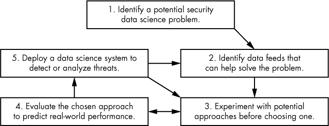

## 12

**成为数据科学家**

为了总结本书，让我们退后一步，讨论一下你如何在恶意软件数据科学家或一般安全数据科学家的职业生涯中取得成功。尽管这是一个非技术性的章节，但它与本书中的技术性章节同样重要，甚至可能更为重要。这是因为，成为一名成功的安全数据科学家，涉及的远不只是理解主题内容。

在本章节中，我们作为作者，分享了自己成为专业安全数据科学家的职业路径。你将了解到作为一名安全数据科学家的日常生活是什么样子的，以及成为一名有效数据科学家需要具备什么条件。我们还分享了一些如何应对数据科学问题的技巧，以及如何在面对不可避免的挑战时保持韧性。

### 成为安全数据科学家的路径

由于安全数据科学是一个新兴领域，成为安全数据科学家的道路有很多。许多数据科学家通过研究生院接受正式训练，而许多人则是自学成才。例如，我在 1990 年代的计算机黑客圈子中成长，学会了用 C 语言和汇编语言编程，并编写黑帽黑客工具。后来，我获得了人文学科的学士学位和硕士学位，然后重新进入技术领域，成为一名安全软件开发人员。在此过程中，我自学了数据可视化和机器学习，最终进入了 Sophos，一家安全研发公司，担任正式的安全数据科学家角色。我的合著者 Hillary Sanders，在大学学习了统计学和经济学，曾在一段时间内担任数据科学家，后来在一家安全公司找到工作，成为数据科学家，并在工作中获得了安全知识。

我们 Sophos 团队同样具有多样性。我们的同事们在心理学、数据科学、数学、生物化学、统计学和计算机科学等众多领域拥有不同的学位。尽管安全数据科学偏向于那些在科学定量方法方面接受过正式训练的人，但它也吸引了来自这些领域的具有不同背景的人。尽管科学和定量训练对学习安全数据科学有帮助，但根据我的经验，只要你愿意自学，凭借非传统背景进入并在这一领域取得卓越成就也是完全可能的。

在安全数据科学领域取得成功，关键在于一个人是否愿意不断学习新知识。这是因为，在我们的领域，实践知识与理论知识同等重要，而实践知识是通过*做*来获得的，而不是通过学术作业。

愿意学习新知识也很重要，因为机器学习、网络分析和数据可视化在不断变化，所以你在学校学到的知识很快就会过时。例如，深度学习仅在 2012 年左右成为一个趋势，并且自那时以来迅速发展，因此几乎所有在此之前毕业的数据科学家都不得不自学这些强大的理念。这对那些寻求专业进入安全数据科学领域的人来说是个好消息。由于那些已经在该领域的人必须不断自学新技能，因此你可以通过已经掌握这些技能来打开大门。

### 安全数据科学家的一天

安全数据科学家的工作是将本书中教授的技能应用于棘手的安全问题。但这些技能的应用往往是嵌入在一个更大的工作流程中的，这个流程还涉及其他技能。图 12-1 展示了我们以及其他公司和组织同事的经验基础上，安全数据科学家的典型工作流程。

*图 12-1：安全数据科学工作流程模型*

如图 12-1 所示，安全数据科学工作流程涉及五个工作领域之间的相互作用。第一个领域，*问题识别*，涉及识别数据科学可以帮助解决的安全问题。例如，我们可以假设通过数据科学方法来识别网络钓鱼邮件，或者识别用于掩盖已知恶意软件的特定方法是一个值得研究的问题。

在这个阶段，任何假设某个问题可以通过数据科学解决的观点都只是一个假设。当你手里有一把锤子（数据科学）时，每个问题看起来都像一根钉子（机器学习、数据可视化或网络分析问题）。我们必须反思这些问题是否*真的是*通过数据科学方法来解决的最佳方式，并牢记这将需要构建一个原型数据科学解决方案，然后测试这个解决方案，以便更好地理解数据科学是否真的提供了*最佳*的解决方案。

当你在一个组织中工作时，识别一个好的问题几乎总是涉及与那些不是数据科学家的利益相关者互动。例如，在我们的公司中，我们经常与产品经理、高层管理人员、软件开发人员和销售人员互动，他们认为数据科学就像一根魔杖，可以解决任何问题，或者认为数据科学类似于“人工智能”，因此具有某种神奇的能力，可以实现不切实际的结果。

处理这类利益相关者时要记住的关键是，要诚实地说明基于数据科学的方法的能力和局限性，并保持一种精明、谨慎的态度，以免追逐错误的问题。你应该放弃那些没有数据支持数据科学算法，或者没有方法评估你的数据科学方法是否有效的问题，此外，还有那些明显可以通过更手动的方法解决的问题。

例如，以下是我们在别人要求我们解决后拒绝的几个问题：

+   **自动识别可能向竞争对手泄露数据的内部员工。** 目前没有足够的数据来驱动机器学习算法，但可以通过数据可视化或网络分析来尝试。

+   **解密网络流量。** 机器学习的数学原理表明，机器学习根本无法解密武器级加密数据！

+   **自动识别根据对员工生活方式的详细背景知识手工制作的钓鱼邮件。** 同样，没有足够的数据来驱动机器学习算法，但这可能通过时间序列或电子邮件数据的可视化来实现。

一旦你*成功*识别出一个潜在的安全数据科学问题，接下来的任务就是确定可以帮助你解决问题的数据流，并运用本书中解释的数据科学技术来实现。这在图 12-1 的第 2 步中有所展示。最终，如果你没有可以用来训练机器学习模型、生成可视化内容或推动网络分析以解决你选择的安全问题的数据流，那么数据科学可能不会对你有帮助。

在你选择了一个问题并确定了能够让你构建基于数据科学的解决方案的数据流后，是时候开始构建你的解决方案了。实际上，这个过程发生在图 12-1 的第 3 步和第 4 步之间的迭代循环中：你构建某些东西，评估它，改进它，重新评估，依此类推。

最后，一旦你的系统准备好，你就可以部署它，正如图 12-1 中的第 5 步所示。只要你的系统保持部署状态，你需要回去并整合新的数据流，尝试新的数据科学方法，并重新部署系统的新版本。

### 有效的安全数据科学家特征

成功的安全数据科学在很大程度上取决于你的态度。在本节中，我们列出了我们认为对安全数据科学工作成功至关重要的一些心理特质。

#### *开放心态*

数据充满了惊喜，这颠覆了我们对问题的先入之见。保持心态开放，接受数据可能证明我们原有的观点是错误的，这一点非常重要。如果你做不到这一点，你会错过从数据中获得的重要洞察，甚至可能会把随机噪声过度解读，试图说服自己某个错误的理论。幸运的是，做得越多安全数据科学，你就越能保持开放心态，从数据中“学习”，也会更能接受自己知道的少、每个新问题都需要学习的多。随着时间的推移，你会开始享受并期待数据带来的惊喜。

#### *无限好奇*

数据科学项目与软件工程和 IT 项目非常不同，因为它们需要探索数据以寻找模式、异常值和趋势，然后利用这些信息构建我们的系统。识别这些动态并不容易：这通常需要运行数百次实验或分析，才能对数据的整体形态和其中隐藏的故事有所了解。有些人天生具有设计巧妙实验并深入挖掘数据的动力，几乎是上瘾的，而另一些人则没有。前者是更容易在数据科学中取得成功的人。因此，好奇心是这个领域的*必要条件*，因为它决定了我们是否能够深入理解数据，而不是仅仅停留在表面。你在构建模型和数据可视化时越能培养好奇心，你的系统就会变得越有用。

#### *对结果的执着*

一旦你定义了一个好的安全数据科学问题，并开始反复尝试解决方案并评估它们，特别是在机器学习项目中，结果的执着可能会完全占据你。这是一个好兆头。例如，当我深度参与一个机器学习项目时，我会有多个实验 24 小时、每周 7 天持续运行。这意味着我可能会在夜里多次醒来检查实验的状态，并且常常需要在凌晨 3 点修复错误并重新启动实验。我倾向于在每晚睡前检查实验状态，并且在周末也会多次查看。

这种全天候的工作流程常常是构建一流安全数据科学系统所必需的。如果没有它，容易满足于平庸的结果，无法突破困境或克服因错误假设而形成的障碍。

#### *对结果的怀疑*

很容易让自己误以为在一个安全数据科学项目上取得了成功。例如，也许你错误地设置了评估标准，以至于系统的准确率看起来比实际情况要好。对与你的训练数据过于相似或与现实世界数据过于不同的数据进行评估是一个常见的陷阱。你也可能无意中从你的网络可视化中挑选出你认为有用但大多数用户认为没什么价值的例子。或者也许你在方法上花费了大量精力，以至于你让自己相信评估统计数据是好的，而实际上它们还不足以让你的系统在现实中有用。保持对结果的健康怀疑态度非常重要，否则你有可能在某一天发现自己陷入尴尬的境地。

### 下一步该做什么

本书中我们已经涵盖了很多内容，但我们也只是刚刚触及表面。如果本书已经让你决定认真从事安全数据科学，我们有两个建议：首先，立即将你在本书中学到的工具应用到你关心的问题中。其次，阅读更多关于数据科学和安全数据科学的书籍。以下是一些你可能考虑将你新学的技能应用到的实际问题：

+   检测恶意域名

+   检测恶意 URL

+   检测恶意电子邮件附件

+   可视化网络流量以发现异常

+   可视化电子邮件发送者/接收者模式以检测钓鱼邮件

为了扩展你对数据科学方法的知识，我们建议从简单的开始，阅读你想了解更多的关于数据科学算法的 Wikipedia 文章。对于数据科学来说，Wikipedia 是一个出奇容易访问且权威的资源，而且它是免费的。对于那些想深入了解的人，特别是在机器学习方面，我们建议阅读关于线性代数、概率论、统计学、图分析和多变量微积分的书籍，或者参加免费的在线课程。学习这些基础知识将为你未来的数据科学职业生涯带来回报，因为它们是我们领域的基础。除了专注于这些基础知识外，我们还建议学习关于 Python、`numpy`、`sklearn`、`matplotlib`、`seaborn`、`Keras` 以及本书中涉及的其他在数据科学社区中广泛使用的工具的课程或阅读更多“应用”的书籍。
