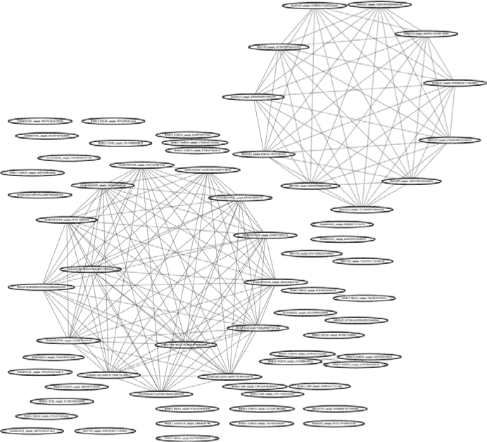
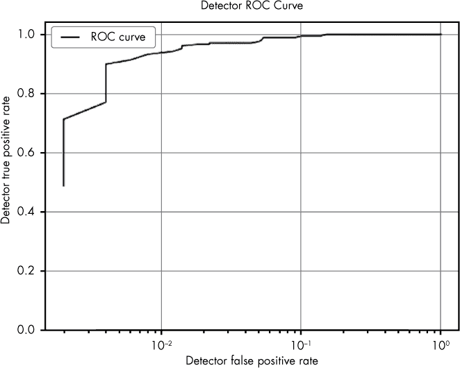

## 数据集和工具概述


本书的所有数据和代码都可以在 *[`www.malwaredatascience.com/`](http://www.malwaredatascience.com/)* 下载。请注意：数据中包含 Windows 恶意软件。如果你在安装了杀毒引擎的机器上解压数据，许多恶意软件示例可能会被删除或隔离。

**注意**

*我们已修改了每个恶意软件可执行文件中的几个字节，以禁用其执行。话虽如此，你仍然需要小心存储位置。我们建议将其存储在与家庭或企业网络隔离的非 Windows 机器上。*

理想情况下，你应该只在一个隔离的虚拟机中实验代码和数据。为了方便起见，我们提供了一个预加载数据和代码的 VirtualBox Ubuntu 实例，地址是 *[`www.malwaredatascience.com/`](http://www.malwaredatascience.com/)*，并且安装了所有必需的开源库。

### 数据集概述

现在让我们来逐步了解本书每一章附带的数据集。

#### *第一章：基本的静态恶意软件分析*

回想一下，在第一章中，我们演示了一个名为 *ircbot.exe* 的恶意软件二进制文件的基本静态分析。这个恶意软件是一个*植入程序*，意味着它会隐藏在用户的系统上，等待攻击者的命令，从而允许攻击者收集受害者计算机的私人数据或达到恶意目的，比如擦除受害者的硬盘。这个二进制文件可以在本书附带的数据中找到，路径为 *ch1/ircbot.exe*。

本章中，我们还使用了一个名为 *fakepdfmalware.exe* 的示例（位于 *ch1/fakepdfmalware.exe*）。这是一个恶意程序，具有 Adobe Acrobat/PDF 桌面图标，旨在欺骗用户以为他们正在打开 PDF 文档，而实际上是在运行恶意程序并感染他们的系统。

#### *第二章：超越基本静态分析：x86 反汇编*

在这一章中，我们探讨了恶意软件逆向工程的一个更深层次的主题：分析 x86 反汇编。在本章中，我们重新使用了第一章中的 *ircbot.exe* 示例。

#### *第三章：动态分析简要介绍*

在我们讨论第三章中的动态恶意软件分析时，我们使用了存储在路径 *ch3/d676d9dfab6a4242258362b8ff579cfe6e5e6db3f0cdd3e0069ace50f80af1c5* 下的勒索病毒示例，这些数据附带在本书中。文件名对应文件的 SHA256 加密哈希。这个勒索病毒并没有什么特别之处，我们通过在 *[VirusTotal.com](http://VirusTotal.com)* 的恶意软件数据库中搜索勒索病毒示例获取了它。

#### *第四章：使用恶意软件网络识别攻击活动*

第四章 介绍了网络分析和可视化在恶意软件中的应用。为了展示这些技术，我们使用了一组用于高调攻击的高质量恶意软件样本，并将分析重点放在由中国军事团体生产的恶意软件样本上，该团体在安全界被称为 *高级持续性威胁 1*（简称 *APT1*）。

这些样本和生成它们的 APT1 组由网络安全公司 Mandiant 发现并公开。在其报告中（摘录如下）标题为“APT1：揭露中国的网络间谍单位” (*[`www.fireeye.com/content/dam/fireeye-www/services/pdfs/mandiant-apt1-report.pdf`](https://www.fireeye.com/content/dam/fireeye-www/services/pdfs/mandiant-apt1-report.pdf)*)，Mandiant 发现了以下内容：

+   自 2006 年以来，Mandiant 观察到 APT1 入侵了 141 家跨越 20 个主要行业的公司。

+   APT1 拥有明确的攻击方法论，这一方法论经过多年的打磨，旨在窃取大量有价值的知识产权。

+   一旦 APT1 建立了访问权限，他们会定期在几个月或几年的时间内重新访问受害者的网络，窃取广泛类别的知识产权，包括技术蓝图、专有制造工艺、测试结果、商业计划、定价文件、合作协议，以及受害组织领导层的电子邮件和联系人列表。

+   APT1 使用了一些我们尚未观察到其他组织使用的工具和技术，其中包括两个用于窃取电子邮件的工具：GETMAIL 和 MAPIGET。

+   APT1 平均在受害者网络中保持访问权限的时间为 356 天。

+   APT1 保持对某一受害者网络访问的最长时间为 1,764 天，即四年十个月。

+   在其他大规模知识产权盗窃事件中，我们观察到 APT1 在十个月的时间里，从一个单一的组织窃取了 6.5TB 的压缩数据。

+   在 2011 年的第一个月，APT1 成功地入侵了至少 17 个新的受害者，这些受害者来自 10 个不同的行业。

正如本报告的摘录所示，APT1 样本被用于高风险的国家级间谍活动。这些样本可以在本书随附的数据中找到，位置为 *ch4/data/APT1_MALWARE_FAMILIES*。

#### *第五章：共享代码分析*

第五章 重用了在第四章中使用的 APT1 样本。为了方便起见，这些样本也位于 第五章 目录下，位于 *ch5/data/APT1_MALWARE_FAMILIES*。

#### *第六章：理解基于机器学习的恶意软件检测器，第七章：评估恶意软件检测系统*

这些概念章节不需要任何样本数据。

#### *第八章：构建机器学习检测器*

第八章探讨了如何构建基于机器学习的恶意软件检测器，并使用了 1,419 个示例二进制文件作为训练你自己的机器学习检测系统的样本数据集。这些二进制文件位于*ch8/data/benignware*文件夹中，良性样本存储在那里，恶意软件样本存储在*ch8/data/malware*文件夹中。

数据集包含 991 个良性文件样本和 428 个恶意软件样本，我们从*[VirusTotal.com](http://VirusTotal.com)*获取了这些数据。这些样本具有代表性，在恶意软件的情况下，代表了 2017 年互联网上观察到的恶意软件类型，在良性文件的情况下，代表了用户在 2017 年上传到*[VirusTotal.com](http://VirusTotal.com)*的二进制文件类型。

#### *第九章：恶意软件趋势的可视化*

第九章探讨了数据可视化，并使用了文件*ch9/code/malware_data.csv*中的示例数据。该文件中共有 37,511 行数据，每一行都记录了一个恶意软件文件的相关信息，包括首次出现时间、多少款杀毒软件检测到了它，以及它属于什么类型的恶意软件（例如，特洛伊木马、勒索软件等）。这些数据来自*[VirusTotal.com](http://VirusTotal.com)*。

#### *第十章：深度学习基础*

本章介绍了深度神经网络，并未使用任何样本数据。

#### *第十一章：使用 Keras 构建神经网络恶意软件检测器*

本章讲解了如何构建一个神经网络恶意软件检测器，用于检测恶意和良性 HTML 文件。良性 HTML 文件来自合法的网页，恶意网页来自那些通过浏览器尝试感染受害者的网站。我们通过付费订阅从*[VirusTotal.com](http://VirusTotal.com)*获取了这两个数据集，订阅使我们能够访问数百万个恶意和良性 HTML 页面的样本。

所有数据都存储在根目录*ch11/data/html*中。良性文件存储在*ch11/data/html/benign_files*中，恶意软件文件存储在*ch11/data/html/malicious_files*中。此外，在这些目录中还有子目录*training*和*validation*。*training*目录包含我们在本章中用来训练神经网络的文件，*validation*目录包含我们用来测试神经网络准确性的文件。

#### *第十二章：成为数据科学家*

第十二章讨论了如何成为数据科学家，并未使用任何样本数据。

### 工具实现指南

尽管本书中的所有代码都是*示例代码*，旨在展示书中的思想，而不是完全复制并应用于现实世界，但我们提供的一些代码可以作为你自己恶意软件分析工作中的工具，尤其是如果你愿意为自己的目的扩展它的话。

**注意**

*这些工具旨在作为完整恶意软件数据科学工具的示例和起点，并未经过强健的实现。它们已在 Ubuntu 17 上进行测试，预计在该平台上能正常工作，但通过一些安装正确依赖项的工作，您应该能相对轻松地让这些工具在其他平台（如 macOS 和其他 Linux 发行版）上运行。*

本节将按照它们出现的顺序，逐步介绍本书中提供的初步工具。

#### *共享主机名网络可视化*

在第四章中提供了一个共享主机名网络可视化工具，位于*ch4/code/listing-4-8.py*。该工具从目标恶意软件文件中提取主机名，然后根据它们共享的主机名显示文件之间的连接。

该工具接受恶意软件目录作为输入，然后输出三个 GraphViz 文件，您可以用它们进行可视化。要安装此工具的依赖项，请在*ch4/code*目录中运行命令`run bash install_requirements.sh`。清单 A-1 展示了该工具的“帮助”输出，之后我们将讨论这些参数的含义。

```
usage: Visualize shared hostnames between a directory of malware samples
       [-h] target_path output_file malware_projection hostname_projection

positional arguments:
➊ target_path          directory with malware samples
➋ output_file          file to write DOT file to
➌ malware_projection   file to write DOT file to
➍ hostname_projection  file to write DOT file to

optional arguments:
  -h, --help           show this help message and exit
```

*清单 A-1：来自第四章的共享主机名网络可视化工具的帮助输出*

如清单 A-1 所示，共享主机名可视化工具需要四个命令行参数：`target_path` ➊、`output_file` ➋、`malware_projection` ➌和`hostname_projection` ➍。参数`target_path`是您希望分析的恶意软件样本的目录路径。`output_file`参数是程序将写入表示将恶意软件样本与其包含的主机名连接的网络的 GraphViz *.dot* 文件的文件路径。

`malware_projection`和`hostname_projection`参数也是文件路径，并指定程序将写入表示这些派生网络的*.dot*文件的位置（有关网络投影的更多信息，请参见第四章）。运行程序后，您可以使用在第四章和第五章中讨论的 GraphViz 工具集来可视化这些网络。例如，您可以使用命令`fdp malware_projection.dot -Tpng -o malware_``projection``.png`，生成类似图 A-1 中的*.png*文件，用于您自己的恶意软件数据集。



*图 A-1：来自第四章的共享主机名可视化工具的示例输出*

#### *共享图像网络可视化*

我们在第四章中介绍了一个共享图像网络可视化工具，位于*ch4/code/listing-4-12.py*。该程序显示基于恶意软件样本共享的嵌入图像之间的网络关系。

该工具将恶意软件目录作为输入，然后输出三个 GraphViz 文件，您可以使用这些文件进行可视化。要安装此工具的依赖项，请在*ch4/code*目录下运行命令`run bash install_requirements.sh`。让我们来讨论一下工具“帮助”输出中的参数（参见清单 A-2）。

```
usage: Visualize shared image relationships between a directory of malware samples
       [-h] target_path output_file malware_projection resource_projection

positional arguments:
➊ target_path          directory with malware samples
➋ output_file          file to write DOT file to
➌ malware_projection   file to write DOT file to
➍ resource_projection  file to write DOT file to

optional arguments:
  -h, --help           show this help message and exit
```

*清单 A-2：来自共享资源网络可视化工具的帮助输出，见第四章*

如清单 A-2 所示，共享图像关系可视化工具需要四个命令行参数：`target_path` ➊，`output_file` ➋，`malware_projection` ➌，和`resource_projection` ➍。与共享主机名程序类似，这里`target_path`是您希望分析的恶意软件样本目录的路径，`output_file`是程序将写入 GraphViz *.dot*文件的文件路径，该文件表示连接恶意软件样本与其包含的图像之间的二分图（二分图在第四章中讨论）。`malware_projection`和`resource_projection`参数也是文件路径，指定程序将写入表示这些网络的*.dot*文件的位置。

与共享主机名程序一样，运行程序后，您可以使用 GraphViz 工具套件来可视化这些网络。例如，您可以在自己的恶意软件数据集上使用命令`fdp resource_projection.dot -Tpng -o resource_``projection``.png`来生成一个文件，就像在第 4-12 图中渲染的*.png*文件一样，见第 55 页。

#### *恶意软件相似性可视化*

在第五章中，我们讨论了恶意软件相似性、共享代码分析和可视化。我们提供的第一个示例工具位于*ch5/code/listing_5_1.py*。该工具将包含恶意软件的目录作为输入，并可视化该目录中恶意软件样本之间的共享代码关系。要安装此工具的依赖项，请在*ch5/code*目录下运行命令`run bash install_requirements.sh`。清单 A-3 显示了该工具的帮助输出。

```
usage: listing_5_1.py [-h] [--jaccard_index_threshold THRESHOLD]
                      target_directory output_dot_file

Identify similarities between malware samples and build similarity graph

positional arguments:
➊ target_directory      Directory containing malware
➋ output_dot_file       Where to save the output graph DOT file

optional arguments:
  -h, --help            show this help message and exit
➌ --jaccard_index_threshold THRESHOLD, -j THRESHOLD
                        Threshold above which to create an 'edge' between
                        samples
```

*清单 A-3：来自恶意软件相似性可视化工具的帮助输出，见第五章*

当您从命令行运行此共享代码分析工具时，您需要传入两个命令行参数：`target_directory` ➊和`output_dot_file` ➋。您可以使用可选参数`jaccard_index_threshold` ➌来设置程序使用的 Jaccard 指数相似性阈值，用于判断两个样本之间是否创建边。Jaccard 指数在第五章中有详细讨论。

图 A-2 显示了在使用命令`fdp output_dot_file.dot -Tpng -o similarity_network.png`生成`output_dot_file`后，该工具的示例输出。这是该工具为我们刚刚描述的 APT1 恶意软件样本推断的共享代码网络。


*图 A-2：在第五章中给出的恶意软件相似性分析工具的示例输出*

#### *恶意软件相似性搜索系统*

我们在第五章中提供的第二个代码共享估算工具位于*ch5/code/listing_5_2.py*。该工具允许您将成千上万的样本索引到数据库中，然后使用查询的恶意软件样本对它们进行相似性搜索，从而找到可能与该样本共享代码的恶意软件样本。要安装该工具的依赖项，请在*ch5/code*目录中运行命令`run bash install_requirements.sh`。列表 A-4 展示了该工具的帮助输出。

```
usage: listing_5_2.py [-h] [-l LOAD] [-s SEARCH] [-c COMMENT] [-w]

Simple code-sharing search system which allows you to build up a database of
malware samples (indexed by file paths) and then search for similar samples
given some new sample

optional arguments:
  -h, --help            show this help message and exit
➊ -l LOAD, --load LOAD Path to directory containing malware, or individual
                        malware file, to store in database
➋ -s SEARCH, --search SEARCH
                        Individual malware file to perform similarity search
                        on
➌ -c COMMENT, --comment COMMENT
                        Comment on a malware sample path
➍ -w, --wipe           Wipe sample database
```

*列表 A-4：在第五章中给出的恶意软件相似性搜索系统的帮助输出*

该工具有四种运行模式。第一种模式，`LOAD` ➊，将恶意软件加载到相似性搜索数据库中，并将路径作为其参数，该路径应指向一个包含恶意软件的目录。您可以多次运行`LOAD`，每次都向数据库添加新的恶意软件。

第二种模式，`SEARCH` ➋，将单个恶意软件文件的路径作为参数，然后在数据库中搜索相似的样本。第三种模式，`COMMENT` ➌，将恶意软件样本路径作为参数，并提示您输入关于该样本的简短文本评论。使用`COMMENT`功能的好处是，当您搜索与查询的恶意软件样本相似的样本时，您可以看到与相似样本对应的评论，从而丰富您对查询样本的了解。

第四种模式，`wipe` ➍，删除相似性搜索数据库中的所有数据，以防您想重新开始并索引不同的恶意软件数据集。列表 A-5 展示了一个`SEARCH`查询的示例输出，帮助您了解该工具的输出格式。在这里，我们使用`LOAD`命令索引了之前描述的 APT1 样本，随后在数据库中搜索与其中一个 APT1 样本相似的样本。

```
Showing samples similar to WEBC2-GREENCAT_sample_E54CE5F0112C9FDFE86DB17E85A5E2C5
Sample name                                                      Shared code
[*] WEBC2-GREENCAT_sample_55FB1409170C91740359D1D96364F17B       0.9921875
[*] GREENCAT_sample_55FB1409170C91740359D1D96364F17B             0.9921875
[*] WEBC2-GREENCAT_sample_E83F60FB0E0396EA309FAF0AED64E53F       0.984375
    [comment] This sample was determined to definitely have come from the advanced persistent
              threat group observed last July on our West Coast network
[*] GREENCAT_sample_E83F60FB0E0396EA309FAF0AED64E53F             0.984375
```

*列表 A-5：在第五章中给出的恶意软件相似性搜索系统的示例输出*

#### *机器学习恶意软件检测系统*

你在自己的恶意软件分析工作中可以使用的最终工具是第八章 中使用的机器学习恶意软件检测器，位于 *ch8/code/complete_detector.py*。该工具允许你在恶意软件和良性软件上训练恶意软件检测系统，然后使用该系统来检测新样本是恶意还是良性。你可以通过在 *ch8/code* 目录下运行 `bash install.sh` 命令来安装该工具的依赖项。列表 A-6 显示了此工具的帮助输出。

```
usage: Machine learning malware detection system [-h]
                                         [--malware_paths MALWARE_PATHS]
                                         [--benignware_paths BENIGNWARE_PATHS]
                                         [--scan_file_path SCAN_FILE_PATH]
                                         [--evaluate]

optional arguments:
  -h, --help            show this help message and exit
➊ --malware_paths MALWARE_PATHS
                        Path to malware training files
➋ --benignware_paths BENIGNWARE_PATHS
                        Path to benignware training files
➌ --scan_file_path SCAN_FILE_PATH
                        File to scan
➍ --evaluate           Perform cross-validation
```

*列表 A-6：第八章 中提供的机器学习恶意软件检测工具的帮助输出*

此工具有三种模式可供运行。`evaluate` 模式 ➍ 测试你选择的用于训练和评估系统的数据上的系统准确性。你可以通过运行 `python complete_detector.py –malware_paths <包含恶意软件的目录路径> --benignware_paths <包含良性软件的目录路径> --evaluate` 来启动此模式。此命令将调用一个 `matplotlib` 窗口，显示检测器的 ROC 曲线（ROC 曲线在 第七章 中有讨论）。图 A-3 显示了 `evaluate` 模式的示例输出。



*图 A-3：第八章 中提供的恶意软件检测工具在 evaluate *模式下的示例输出*

训练模式用于训练恶意软件检测模型并将其保存到磁盘。你可以通过运行 `python complete_detector.py –malware_paths` ➊ `<包含恶意软件的目录路径> --benignware_paths` ➋ `<包含良性软件的目录路径>` 来启动此模式。请注意，这个命令调用与 `evaluate` 模式的调用唯一不同之处在于我们没有添加 `--evaluate` 标志。此命令的结果是它生成一个模型，并将其保存到名为 *saved_detector.pkl* 的文件中，该文件保存在当前工作目录。

第三种模式，`scan` ➌，加载 *saved_detector.pkl*，然后扫描目标文件，预测它是否为恶意文件。请确保在运行扫描之前已运行过训练模式。你可以在训练系统的目录中运行 `python complete_detector.py –scan_file_path <PE EXE 文件>` 来进行扫描。输出将是目标文件是否恶意的概率。
