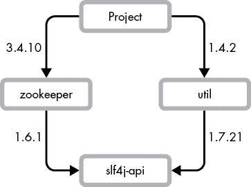
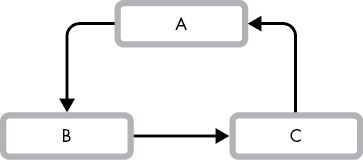

# 第五章：依赖管理

2016 年 3 月，当一个名为 `left-pad` 的包消失时，成千上万的 JavaScript 项目开始无法编译。`left-pad` 是一个只有一个方法的库，这个方法只是将字符串填充到指定的字符宽度。几个基础的 JavaScript 库依赖于 `left-pad`，而这些库又被许多项目依赖。由于传递性依赖的病毒式传播，成千上万的开源和商业代码库在这个相对微不足道的库上有一个关键依赖。当这个包从 NPM（JavaScript 的节点包管理器）中移除时，许多程序员度过了艰难的一天。

添加对现有代码的依赖看似是一个简单的决定。不要重复自己（DRY）是一个常见的原则。我们为什么要自己编写 `left-pad` 呢？数据库驱动程序、应用框架、机器学习包——有许多不应该从头开始编写的库。然而，依赖项带来了风险：不兼容的变化、循环依赖、版本冲突和缺乏控制。你必须考虑这些风险以及如何降低它们。

本章中，我们将讨论依赖管理的基础知识，并谈论每个工程师的噩梦：依赖地狱。

## 依赖管理基础

在我们讨论问题和最佳实践之前，我们必须向你介绍常见的依赖项和版本管理概念。

*依赖项*是你的代码所依赖的代码。依赖项需要的时间——是编译时、测试时还是运行时——被称为它的*范围*。

依赖项在包管理或构建文件中声明：Java 的 Gradle 或 Maven 配置，Python 的 *setup.py* 或 *requirements.txt*，以及 JavaScript 的 NPM *package.json*。以下是一个 Java 项目的 *build.gradle* 文件片段：

```
dependencies { compile 'org.apache.httpcomponents:httpclient:4.3.6' compile 'org.slf4j:slf4j-api:1.7.2'
}
```

项目依赖于版本 4.3.6 的 HTTP 客户端库和版本 1.7.2 的 SLF4J 应用程序编程接口（API）库。每个依赖项都声明为 `compile` 范围，意味着在编译代码时需要这些依赖项。每个包都有一个定义的版本：`httpclient` 为 4.3.6，`slf4j` 为 1.7.2。使用带版本的包来控制依赖项的变化，并在出现不同版本的同一包时解决冲突（稍后会详细说明）。

一个好的版本管理方案应该具有如下版本：

1.  唯一版本应当永远不被重用。构件会被分发、缓存并通过自动化工作流拉取。绝不要在现有版本下重新发布更改的代码。

1.  可比版本应该帮助人类和工具推断版本的优先级。*优先级*用于解决当构建依赖于同一构件的多个版本时的冲突。

1.  信息化版本区分了预发布和发布的代码，将构建号与构件关联，并设置稳定性和兼容性的期望。

Git 哈希值或类似 Android 操作系统甜点系列（Android Cupcake、Android Froyo）或 Ubuntu 的押头动物命名（Trusty Tahr、Disco Dingo）等“市场相关”版本满足唯一性属性，但它们不可比且缺乏信息性。同样，单调递增的版本号（1、2、3）既是唯一的也是可比的，但信息量不大。

### 语义版本控制

前面的示例中的包使用了一种名为*语义版本控制*（*Semantic Versioning*，简称 SemVer）的版本控制方案，这是最常用的版本控制方案之一。官方 SemVer 规范可以在[`semver.org/`](https://semver.org/)找到。该规范定义了三个数字：主版本号、次版本号和修补版本号（有时称为*微版本*）。版本号以单一的 MAJOR.MINOR.PATCH 形式组合。`httpclient`版本 4.3.6 的主版本、次版本和修补版本分别是 4、3 和 6。

语义版本具有唯一性、可比性和信息性。每个版本号只使用一次，可以通过从左到右进行比较（2.13.7 在 2.14.1 之前）。它们提供了不同版本之间兼容性的信息，并且可以选择性地编码发布候选版本或构建号信息。

主版本号为 0 的版本被视为“预发布”版本，旨在快速迭代；不做兼容性保证。开发者可以以破坏旧代码的方式修改 API，比如添加一个新的必需参数或删除一个公共方法。从主版本号 1 开始，项目应保证以下内容：

+   修补版本号在进行向后兼容的错误修复时递增。

+   次版本号在进行向后兼容的新特性添加时递增。

+   主版本号在出现不兼容的变更时递增。

SemVer 还通过在修补版本号后附加`-`字符来定义预发布版本。预发布标识符使用点分隔的字母数字序列（2.13.7-alpha.2）。预发布版本可以在不增加主版本号的情况下进行破坏性更改。许多项目使用*发布候选版本（RC）*构建。早期采用者可以在正式发布之前在 RC 版本中发现 bug。RC 预发布版本有递增的标识符，如 3.0.0-rc.1。最终的 RC 版本会通过去除 RC 后缀重新发布为正式版本。所有预发布版本都将被最终版本所取代（在我们的示例中是 3.0.0）。有关发布管理机制的更多内容，请参见第八章。

构建号附加在版本号和预发布元数据后：2.13.7-alpha.2+1942。包括构建号有助于开发者和工具查找任何已编译版本的构建日志。

SemVer 的方案还允许使用*通配符*版本范围（2.13.*）。由于 SemVer 承诺在次版本和修补版本之间保持兼容性，即使更新版本带有错误修复和新功能，构建也应继续正常工作。

### 传递依赖

包管理或构建文件显示的是项目的直接依赖，但直接依赖只是构建或打包系统实际使用的依赖的一部分。依赖通常还依赖于其他库，这些库成为*传递依赖*。依赖报告显示的是完全解析后的*依赖树*（或*依赖图*）。大多数构建和打包系统都可以生成依赖报告。继续之前的示例，以下是`gradle dependencies`的输出：

```
compile - Compile classpath for source set 'main'.
+--- org.apache.httpcomponents:httpclient:4.3.6
|    +--- org.apache.httpcomponents:httpcore:4.3.3
|    +--- commons-logging:commons-logging:1.1.3
|    \--- commons-codec:commons-codec:1.6
\--- org.slf4j:slf4j-api:1.7.2
```

依赖树显示了构建系统在编译项目时实际使用的依赖。报告是几层嵌套的。依赖的依赖的依赖等被一层层引入。`httpclient`库引入了三个传递依赖：`httpcore`、`commons-logging`和`commons-codec`。该项目并不直接依赖这些库，但通过`httpclient`，它确实依赖这些库。

理解传递依赖是依赖管理的一个关键部分。添加一个依赖看似是一个小变动，但如果该库依赖于 100 个其他库，那么你的代码现在依赖于 101 个库。任何依赖项的变化都可能影响你的程序。确保你知道如何获取像我们示例中那样的依赖树信息，这样你才能调试依赖冲突。

## 依赖地狱

向任何一位软件工程师询问“依赖地狱”，你会听到一段痛苦的故事。相同库的版本冲突，或不兼容的库升级，可能会导致构建失败和运行时错误。最常见的依赖地狱罪魁祸首是循环依赖、钻石型依赖和版本冲突。

之前的依赖报告很简单。一个更现实的报告将显示版本冲突，并让你一窥“依赖地狱”：

```
compile - Compile classpath for source set 'main'.
+--- com.google.code.findbugs:annotations:3.0.1
|    +--- net.jcip:jcip-annotations:1.0
|    \--- com.google.code.findbugs:jsr305:3.0.1
+--- org.apache.zookeeper:zookeeper:3.4.10
|    +--- org.slf4j:slf4j-api:1.6.1 -> 1.7.21
|    +--- org.slf4j:slf4j-log4j12:1.6.1
|    +--- log4j:log4j:1.2.16
|    +--- jline:jline:0.9.94
|    \--- io.netty:netty:3.10.5.Final
\--- com.mycompany.util:util:1.4.2 \--- org.slf4j:slf4j-api:1.7.21
```

这个树状图显示了三个直接依赖：`annotations`、`zookeeper`和`util`。这些库都依赖于其他库，这些就是它们的传递依赖。报告中出现了两个版本的`slf4j-api`。`util`依赖于`slf4j-api`版本 1.7.21，而`zookeeper`依赖于`slf4j-api`版本 1.6.1。

这些依赖形成了一个*钻石型依赖*，如图 5-1 所示。



图 5-1：钻石型依赖

一个项目不能同时使用两个库版本，因此构建系统必须选择一个版本。在 Gradle 依赖报告中，版本选择会用注解的方式显示，如下所示：

```
|    +--- org.slf4j:slf4j-api:1.6.1 -> 1.7.21
```

`1.6.1 -> 1.7.21`意味着整个项目中的`slf4j-api`都被升级到了 1.7.21 版本，以解决版本冲突。Zookeeper 可能无法与不同版本的`slf4j-api`正常工作，尤其是因为相关的依赖`slf4j-log4j12`没有被升级。升级*应该*能成功，因为 Zookeeper 依赖的主版本号保持不变（SemVer 保证在相同主版本下向后兼容）。但实际上，兼容性只是一个理想。项目通常在没有兼容性检查的情况下设置版本号，即使是自动化工具也无法完全保证兼容性。不兼容的变化会悄悄出现在次要版本或修补版本中，给你的代码库带来灾难。

更糟糕的是*循环依赖*（或*循环依赖关系*），即一个库间接依赖于自身（A 依赖 B，B 依赖 C，C 依赖 A，如图 5-2 所示）。



图 5-2：一个循环依赖

循环依赖会造成“先有鸡还是先有蛋”的问题：升级一个库会导致另一个库无法工作。实用工具或辅助项目通常会出现循环依赖。例如，一个自然语言处理（NLP）库依赖于一个用于字符串解析的实用库；不经意间，另一位开发者将 NLP 库作为一个词干提取实用方法的依赖。

## 避免依赖地狱

你绝对会遇到依赖地狱。依赖是不可避免的，但每一个新的依赖都伴随着成本。问问自己，这个依赖的价值是否超过了它的成本。

+   你真的需要这些功能吗？

+   这个依赖有多好维护？

+   如果出了问题，修复这个依赖有多容易？

+   这个依赖有多成熟？

+   这个依赖多久会引入不兼容的变化？

+   你、你的团队和你的组织对这个依赖的了解程度如何？

+   自己编写这段代码有多容易？

+   代码是如何授权的？

+   你在这个依赖中使用的代码与未使用的代码比例如何？

当你决定添加依赖时，请遵循以下最佳实践。

### 隔离依赖

你不必将依赖管理交给构建和打包系统。依赖代码也可以被复制、包含或遮蔽。将代码复制到你的项目中是以牺牲依赖管理自动化为代价，换取更多的隔离（稳定性）。你将能够精确选择使用的代码，但你必须自己管理代码的复制。

许多开发者是在 DRY（Don't Repeat Yourself）哲学的影响下成长起来的，这种哲学提倡避免代码重复。务实一些；如果复制代码能帮助你避免一个庞大或不稳定的依赖（并且软件许可允许），就不要害怕复制代码。

复制代码最适合用于小而稳定的代码片段。手动复制整个库有一些缺点：版本历史可能会丢失，而且每次更新代码时你必须重新复制代码。使用*供应商*工具管理历史记录和更新，以便在将整个库嵌入你的代码库时进行管理。供应商文件夹包含完整的库副本。像 git-subtree 和`git-vendor`这样的工具有助于管理代码库中的供应商文件夹。一些打包系统（如 Go）甚至内建了对供应商文件夹的支持。

依赖*着色*也可以隔离依赖。着色会自动将依赖重定向到不同的命名空间，以避免冲突：`some.package.space`变成`shaded.some.package.space`。这是一种友好的方式，可以避免库将其依赖强加给应用程序。着色源自 Java 生态系统，但这一概念是广泛适用的。像 Rust 这样的其他语言也使用类似的技术。

着色是一种高级技术，应谨慎使用。绝不在公共 API 中暴露已着色依赖的对象；这样做意味着开发者必须在着色的包空间中创建对象（`shaded.some.package.space.Class`）。着色旨在隐藏依赖的存在；为库用户创建已着色的对象既复杂又有时是不可能的。此外，要小心，着色的依赖可能会让开发者混淆，因为构建产物中的包名会有所不同。我们建议仅在创建一个具有广泛使用且可能产生冲突的依赖的库时，才使用着色。

### 有意添加依赖

显式声明所有使用的库作为依赖。即使看起来可以正常工作，也不要使用传递性依赖中的方法和类。库可以自由更改它们的依赖，即使是在修补级别的版本升级中。如果在升级过程中，依赖的传递性依赖被移除，你的代码将无法工作。

一个只依赖于`httpclient`库（来自前面示例）的项目不应显式使用`httpcore`、`commons-logging`和`commons-codec`中的类（`httpclient`的依赖）；如果使用了这些类，应该直接声明对这些库的依赖。

不要仅依赖 IDE 进行依赖管理。在构建文件中显式声明你的依赖。IDE 通常将依赖存储在自己的项目配置中，而构建工具并不会查看这些配置。IDE 与构建文件之间的不一致会导致代码在 IDE 中正常工作，但在实际构建代码时却不行，反之亦然。

### 锁定版本

显式设置每个依赖的版本号，这种做法被称为*版本锁定*。未锁定的版本将由构建系统或包管理系统为你决定。将命运交给构建系统并不是一个好主意。当依赖版本在连续的构建过程中发生变化时，你的代码会不稳定。

以下代码片段声明了一份 Go 库依赖列表，其中包含了锁定版本：

```
require ( github.com/bgentry/speakeasy v0.1.0 github.com/cockroachdb/datadriven v0.0.0-20190809214429-80d97fb3cbaa github.com/coreos/go-semver v0.2.0 github.com/coreos/go-systemd v0.0.0-20180511133405-39ca1b05acc7 github.com/coreos/pkg v0.0.0-20160727233714-3ac0863d7acf ...
)
```

相比之下，以下是 Apache Airflow 依赖项的片段，使用了三种不同的版本管理策略：

```
flask_oauth = [ 'Flask-OAuthlib>=0.9.1', 'oauthlib!=2.0.3,!=2.0.4,!=2.0.5,<3.0.0,>=1.1.2', 'requests-oauthlib==1.1.0'
]
```

`requests-oauthlib` 库被明确锁定为 1.1.0。`Flask-OAuthlib` 依赖项被设置为 0.9.1 或更高版本。`oauthlib` 库则非常具体：要求版本为 1.1.2 或更新，但不超过 3.0.0，也不能是 2.0.3、2.0.4 或 2.0.5。版本 2.0.3 到 2.0.5 被排除，因为存在已知的 bug 或不兼容问题。

限定版本范围是一个在无限制范围和完全锁定版本之间的折衷。依赖解析系统可以自由解决冲突并更新依赖项，但暴露破坏性更改的风险是有限的。但任何未锁定的版本将不仅拉取最新的 bug 修复；它们还会拉取最新的 bug、行为，甚至是不兼容的更改。

即使你锁定了直接依赖项，传递依赖项仍可能使用通配符。通过生成所有已解析依赖项及其版本的完整清单，可以锁定传递依赖项的版本。依赖清单有许多名称：在 Python 中你会冻结需求，在 Ruby 中生成 *Gemfile.lock*，在 Rust 中创建 *Cargo.lock*。构建系统使用清单来确保每次执行都能产生相同的结果。开发者在需要更改版本时会显式重新生成清单。将清单与代码一起提交，允许你显式跟踪依赖项的更改，从而提供机会防止潜在问题。

### 狭窄依赖作用域

之前讨论的依赖作用域，定义了在构建生命周期中的何时使用某个依赖项。作用域有层次结构：编译时依赖项在运行时使用，但运行时依赖项不会用于编译代码，仅用于运行代码。测试依赖项仅在测试执行时拉取，并且对于发布代码的正常使用并不必要。

对每个依赖项使用最窄的作用域。声明所有依赖项为编译时作用域虽然可行，但不是最佳实践。狭窄的作用域有助于避免冲突并减少运行时二进制文件的大小。

### 保护自己免受循环依赖的影响

永远不要引入循环依赖。循环依赖会导致构建系统行为异常以及部署顺序问题。构建可能看似正常，但突然失败，且应用程序会出现难以捉摸且间歇性的错误。

使用构建工具来保护自己。许多构建系统内置了循环依赖探测器，能够在检测到循环时提醒你。如果你的构建系统不防止循环依赖，通常会有插件可以帮助你。

## 应做与不应做

| **应做** | **不应做** |
| --- | --- |
| **应做** 使用语义化版本控制。  | **不应做** 使用 Git 哈希作为版本号。  |
| **应做** 锁定依赖项版本范围。  | **不应做** 除非其价值超出成本，否则不添加依赖项。  |
| **请**使用依赖报告工具来检查传递依赖。 | **请不要**直接使用传递依赖。 |
| **请**在添加新依赖时保持怀疑态度。 | **请不要**引入循环依赖。 |
| **请**限定你的依赖范围。 |  |

## 提升技能

依赖冲突和不兼容变化的问题普遍存在，通常称之为*依赖地狱*（许多生态系统有自己版本的地狱——DLL 地狱，JAR 地狱，“每次我必须触碰 pip”）。尽管依赖管理复杂，但关于这个主题的书籍并不多；生态系统特定的讨论和解释在网上非常丰富。要了解历史背景，可以看看维基百科关于依赖地狱的文章及其参考资料。

请参见[`semver.org/`](https://semver.org/)了解关于语义版本控制的简明易读的规范。Python 也有类似的方案，定义在[`www.python.org/dev/peps/pep-0440/`](https://www.python.org/dev/peps/pep-0440/)中。这两种版本控制方案在使用中非常广泛，值得学习。还有许多其他方案，在同一个项目中遇到使用不同版本控制方案的构件并不罕见。根据帕累托原则，除非这是你工作的一部分，或者你需要更多信息来解决一个具体问题，我们不建议你在刚开始时深入研究版本语义。本章内容应该足以应对大多数日常工作。

本章中的许多版本控制概念适用于库和服务 API。我们将在第十一章中更详细地讨论 API 版本控制。
