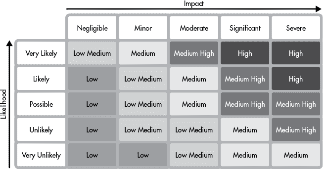

# 第六章：测试

编写、运行和修复测试可能会让人觉得是在做无意义的工作。实际上，测试很容易变成*无意义的工作*。糟糕的测试会增加开发者的负担而没有提供价值，并且可能增加测试套件的不稳定性。本章将教你如何高效地进行测试。我们将讨论测试的用途、不同类型的测试、不同的测试工具、如何负责任地进行测试，以及如何应对测试中的非确定性问题。

## 测试的多种用途

大多数开发者知道测试的基本功能：测试检查代码是否正常工作。但测试还有其他用途。它们保护代码免受未来更改的影响，这些更改可能会无意中改变其行为，鼓励编写干净的代码，迫使开发者使用自己的 API，记录组件如何交互，并作为实验的平台。

最重要的是，测试验证软件是否按预期行为运行。不可预测的行为会给用户、开发者和操作员带来问题。最初，测试显示代码是否按照规格工作。测试随后留下来，保护现有行为不受新更改的影响。当一个旧的测试失败时，必须做出决定：开发者是否有意改变行为，还是引入了一个 bug？

编写测试也迫使开发者思考他们程序的接口和实现。开发者通常首先通过测试与代码进行交互。新代码通常会有一些不完善之处；测试能够及早暴露笨拙的接口设计，以便进行修正。测试还能够暴露混乱的实现。*意大利面条代码*，或者是具有过多依赖的代码，很难进行测试。编写测试迫使开发者保持代码的良好结构，通过改善关注点分离和减少紧密耦合来提升代码质量。

测试代码的副作用如此强烈，以至于*测试驱动开发*（*TDD*）已成为一种常见做法。TDD 是先编写测试，再编写代码的实践。编写测试时，测试会失败，然后编写代码使其通过。TDD 迫使开发者在编写大量代码之前思考行为、接口设计和集成。

测试作为一种文档形式，说明了代码的交互方式。它们是经验丰富的程序员开始阅读以理解新代码库的第一站。测试套件是一个很好的实验平台。开发者运行测试时，会附加调试器逐步执行代码。当发现 bug 或行为出现疑问时，可以添加新测试来理解它们。

## 测试类型

有很多不同类型的测试和测试方法。我们的目标不是涵盖该主题的所有内容，而是讨论最常见的几种类型——单元测试、集成测试、系统测试、性能测试和验收测试——以为你打下坚实的基础。

*单元测试*验证“单元”代码——一个单独的方法或行为。单元测试应该快速、小巧且聚焦。速度很重要，因为这些测试运行频繁——通常在开发者的笔记本电脑上运行。小型的测试专注于单一的代码单元，当测试失败时，能够更容易理解是什么导致了问题。

*集成测试*验证多个组件是否协同工作。如果你发现自己在测试中实例化了多个相互作用的对象，那你可能是在编写集成测试。集成测试通常比单元测试执行得更慢，并且需要比单元测试更复杂的设置。开发者运行集成测试的频率较低，因此反馈周期较长。这些测试能发现一些通过单独测试独立单元难以识别的问题。

*系统测试*验证整个系统。端到端（e2e，简写）工作流程模拟真实用户在预生产环境中的交互。系统测试自动化的方式各不相同。一些组织要求系统测试在发布之前必须通过，这意味着所有组件都会同步测试和发布。其他组织发布的系统非常庞大，无法实现同步发布；这些组织通常进行广泛的集成测试，并通过持续的合成监控生产测试来补充。*合成监控*脚本在生产环境中运行，模拟用户注册、浏览并购买商品等行为。合成监控需要仪表化，使得计费、会计和其他系统能够区分这些生产测试和真实活动。

*性能测试*，例如负载测试和压力测试，衡量系统在不同配置下的性能。*负载测试*衡量系统在不同负载级别下的性能：例如，当 10、100 或 1000 个用户同时访问系统时，系统的表现如何。*压力测试*将系统负载推至故障点。压力测试揭示了系统能承受的极限以及在过载情况下会发生什么。这些测试对于容量规划和定义 SLO（服务水平目标）非常有用。

*验收测试*由客户或其代理执行，用于验证交付的软件是否符合验收标准。这些测试在企业软件中相当常见，正式的验收测试和标准是昂贵合同的一部分。*国际标准化组织（ISO）*要求验收测试验证明确的业务需求，作为其安全标准的一部分；认证审计员会要求提供需求和相应测试的文档证明。在不太受监管的组织中，较为不正式的验收测试通常变成了“我刚刚修改了一个功能，你能告诉我一切是否正常吗？”

## 测试工具

测试工具分为几类：测试编写工具、测试执行框架和代码质量工具。*测试编写工具*（如模拟库）帮助你编写简洁高效的测试。*测试框架*帮助通过模拟测试的生命周期（从设置到清理）来运行测试。测试框架还会保存测试结果，集成构建系统并提供其他辅助工具。*代码质量工具*用于分析代码覆盖率和代码复杂性，通过静态分析发现 bug，并检查样式错误。分析工具通常会在构建或编译步骤中运行。

每个添加到你的设置中的工具都会带来额外负担。每个人必须理解该工具及其所有特殊性。工具可能依赖于许多其他库，这将进一步增加系统的复杂性。有些工具会减慢测试速度。因此，在你能够证明复杂性权衡的合理性之前，避免使用外部工具，并确保你的团队认可这些工具。

### Mock 库

Mock 库通常在单元测试中使用，特别是在面向对象的代码中。代码通常依赖于外部系统、库或对象。*Mocks* 用存根替代外部依赖，这些存根模拟了真实系统提供的接口。Mocks 通过用硬编码的响应来回应输入，执行测试所需的功能。

消除外部依赖可以保持单元测试快速且专注。模拟远程系统使测试能够绕过网络调用，从而简化了设置并避免了慢操作。模拟方法和对象使开发人员能够编写专注的单元测试，测试单一特定的行为。

Mocks 还可以防止应用程序代码中充斥着与测试相关的方法、参数或变量。与测试相关的更改很难维护，使代码难以阅读，并可能导致混乱的 bug（不要在方法中添加布尔型的 `isTest` 参数！）。Mocks 帮助开发人员在不修改常规代码的情况下访问受保护的方法和变量。

虽然模拟很有用，但不要过度使用。具有复杂内部逻辑的 mocks 会使你的测试变得脆弱且难以理解。从单元测试中的基本内联 mocks 开始，只有在测试之间重复模拟逻辑时，才编写共享的模拟类。

过度依赖 mock 是一种代码异味，表明代码之间紧密耦合。每当使用 mock 时，考虑是否可以重构代码以去除对模拟系统的依赖。将计算和数据转换逻辑与 I/O 代码分离有助于简化测试，并使程序更加健壮。

### 测试框架

测试框架帮助你编写和执行测试。你会找到帮助协调和执行单元测试、集成测试、性能测试甚至 UI 测试的框架。框架执行以下操作：

+   管理测试的设置和清理

+   管理测试执行和协调

+   生成测试结果报告

+   提供工具，如额外的断言方法

+   与代码覆盖工具集成

设置和拆解方法允许开发人员指定在每个测试或测试集之前或之后需要执行的步骤，例如数据结构设置或文件清理。许多测试框架提供多种设置和拆解执行选项——在每个测试之前、在文件中的所有测试之前，或在构建中的所有测试之前。使用设置和拆解方法之前，请阅读文档以确保正确使用它们。不要指望在所有情况下都能运行拆解方法。例如，如果测试发生灾难性失败，导致整个测试过程退出，则不会执行拆解。

测试框架帮助通过测试编排控制测试的速度和隔离性。测试可以串行或并行执行。串行测试一个接一个地运行。一次运行一个测试更安全，因为测试之间相互影响的可能性较小。并行执行速度更快，但由于共享状态、资源或其他污染，更容易出错。

框架可以配置为在每个测试之间启动一个新进程。这进一步隔离了测试，因为每个测试都会从头开始。注意，为每个测试启动新进程是一个昂贵的操作。有关测试隔离的更多信息，请参见本章后面的“测试中的确定性”部分。

测试报告帮助开发人员调试构建失败。报告详细列出了哪些测试通过、失败或被跳过。当测试失败时，报告显示哪条断言失败。报告还会根据每个测试整理日志和堆栈跟踪，以便开发人员快速调试失败。注意：测试结果存储位置并不总是显而易见——总结会打印到控制台，而完整的报告会写入磁盘。如果你无法找到报告，可以查看测试和构建目录。

### 代码质量工具

利用帮助你编写高质量代码的工具。强制执行代码质量规则的工具被称为*代码检查器*。代码检查器运行静态分析并执行风格检查。代码质量监控工具报告复杂度、测试覆盖率等度量指标。

*静态代码分析器*寻找常见错误，如未关闭文件句柄或使用未设置的变量。静态分析器对于像 Python 和 JavaScript 这样的动态语言尤为重要，因为它们没有编译器来捕获语法错误。分析器会查找已知的代码异味并突出显示可疑代码，但它们并非没有误报，因此你应该批判性地思考静态分析器报告的问题，并通过代码注解覆盖误报，告诉分析器忽略特定的违规行为。

*代码风格检查器*确保所有源代码格式一致：每行的最大字符数、驼峰命名法与蛇形命名法、正确的缩进等等。统一的风格有助于多个程序员在共享代码库中协作。我们强烈建议设置 IDE，使所有的风格规则自动应用。

*代码复杂度* *工具* 通过计算*圈复杂度*来防止过于复杂的逻辑，圈复杂度大致是指通过代码的路径数。代码复杂度越高，测试越困难，也越容易包含缺陷。圈复杂度通常随着代码库的大小增加，因此高的总分不一定是坏事；然而，复杂度的突然跃升可能是一个值得关注的问题，单独复杂的函数方法也可能是一个警告。

*代码覆盖率* *工具* 测量测试套件执行了多少行代码。如果你的修改降低了代码覆盖率，你应该编写更多的测试。确保测试涵盖了你所做的任何新修改。目标是合理的覆盖率（经验法则是介于 65%到 85%之间）。记住，覆盖率本身并不是衡量测试质量的好标准：它可能会产生误导，无论是覆盖率高还是低。自动生成的代码，如框架代码或序列化类，可能会导致误导性低覆盖率指标。相反，过于追求 100%的覆盖率并不保证你的代码能够安全地集成。

工程师们常常过于关注代码质量指标。仅仅因为某个工具发现了质量问题，并不意味着它真的是一个问题，也不代表它值得立刻修复。在处理未通过质量检查的代码库时要务实。不要让代码变得更差，但避免进行破坏性的“停止一切清理”项目。使用第三章中的“技术债务”部分作为指南，决定何时修复代码质量问题。

## 编写你自己的测试

你有责任确保你团队的代码按预期工作。编写自己的测试；不要指望别人来为你清理。许多公司都有正式的*质量保证（QA）*团队，职责各异，包括以下内容：

+   编写黑盒或白盒测试

+   编写性能测试

+   执行集成、用户接受或系统测试

+   提供和维护测试工具

+   维护测试环境和基础设施

+   定义正式的测试认证和发布流程

QA 团队可以帮助你验证代码是否稳定，但永远不要把所有测试都交给他们来做，不能“把代码丢过去”让他们处理所有测试。QA 团队现在不再编写单元测试了；那些日子已经过去。如果你所在的公司有正式的 QA 团队，了解他们的责任以及如何与他们合作是很重要的。如果他们在你的团队中，可能会参与到 scrum 和冲刺计划会议中（有关敏捷开发的更多信息，请参见第十二章）。如果他们是一个集中式的组织，可能需要通过提交工单或正式请求来获得他们的帮助。

### 编写清晰的测试

以与编写其他代码相同的细心程度编写测试。测试引入了依赖关系，需要维护，并且随着时间的推移需要重构。粗糙的测试有很高的维护成本，会减慢未来的开发速度。粗糙的测试也更不稳定，不太可能提供可靠的结果。

在测试中使用良好的编程实践。记录测试的工作原理、如何运行以及为什么编写它们。避免硬编码的值，避免代码重复。使用设计最佳实践来保持关注点分离，并保持测试的凝聚性和解耦性。

集中测试基本功能而非实现细节。这有助于代码库重构时，测试依然能正常运行。如果测试代码与实现细节过于紧密耦合，主代码体的更改将破坏测试。这种破坏不再意味着出现了问题，只是表明代码发生了变化。这样做没有任何价值。

将测试依赖与常规代码依赖分开。如果测试需要某个库才能运行，不要强迫整个代码库都依赖这个库。大多数构建和打包系统允许你为测试定义特定的依赖关系；应充分利用这一特性。

### 不要过度测试

不要被编写测试所淹没。很容易失去对哪些测试值得编写的判断。编写有意义的失败测试。避免仅仅为了提高覆盖率指标而追求更高的代码覆盖率。即使提高了覆盖率指标，测试薄数据库包装器、第三方库或基本变量赋值也毫无意义。应专注于对代码风险影响最大的测试。

一个失败的测试应该告诉开发者，程序的行为发生了重要变化。当做出微小更改，或者将一种有效的实现替换为另一种有效实现时，导致测试失败会增加不必要的工作量，并且使程序员麻木。代码没有坏时，不应该需要修复测试。

将代码覆盖率作为指导，而不是规则。高代码覆盖率并不能保证正确性。在测试中执行代码会计入覆盖率，但这并不意味着它被有效地执行。即便是 100%测试覆盖率的代码库，也完全有可能存在严重的错误。追求特定的代码覆盖率百分比是短视的。

不要为自动生成的代码（例如 web 框架脚手架或 OpenAPI 客户端）手动编写测试。如果你的覆盖率工具没有配置为忽略生成的代码，这些工具会报告该代码未经过测试。在这种情况下，修复覆盖工具的配置。代码生成器经过充分测试，因此测试生成的代码是浪费时间的（除非你手动对生成的文件进行了更改，在这种情况下应测试这些更改）。如果因某种原因你发现需要测试生成的代码，想办法将测试添加到生成器中。

将精力集中在高价值的测试上。编写和维护测试需要时间。专注于高价值的测试可以在成本效益比上获得最大的收益。使用风险矩阵来找出需要关注的重点区域。*风险矩阵*定义了失败的可能性和影响。

图 6-1 是一个示例风险矩阵。失败的可能性在纵轴上测量，失败的影响在横轴上测量。事件的可能性和影响的交点定义了其风险。



图 6-1：风险矩阵

测试将代码风险降低到图表的下方——更多的测试使失败变得不太可能。首先，专注于代码中可能性高、影响大的部分。低风险或一次性的代码，比如概念验证代码，不值得进行测试。

## 测试中的确定性

*确定性代码*对于相同的输入始终产生相同的输出。相比之下，*非确定性代码*对于相同的输入可能返回不同的结果。一个调用网络套接字上的远程 Web 服务的单元测试是非确定性的；如果网络失败，测试就会失败。非确定性测试是许多项目中的一个问题。了解为什么非确定性测试是有害的，如何修复它们，以及如何避免编写它们，至关重要。

非确定性测试会降低测试价值。间歇性的测试失败（称为*波动测试*）难以重现和调试，因为它们并不是每次运行时都会发生，甚至不是每十次运行中都会发生。你无法判断问题是出在测试本身还是代码上。由于波动测试没有提供有意义的信息，开发人员可能会忽略它们，从而提交有问题的代码。

间歇性失败的测试应该立即禁用或修复。在循环中反复运行波动测试以重现失败。集成开发环境（IDE）有功能可以迭代运行测试，但命令行中的循环也能实现。有时候，非确定性是由于测试之间的相互作用或特定机器配置引起的——你需要进行实验。一旦你重现了失败，就可以通过消除非确定性或修复漏洞来解决问题。

非确定性通常是由于不当处理睡眠、超时和随机数生成引入的。留下副作用或与远程系统交互的测试也会导致非确定性。通过使时间和随机性变得确定性、清理测试后的环境以及避免网络调用，可以摆脱非确定性。

### 为随机数生成器提供种子

*随机数生成器*（*RNGs*）必须用一个值来进行初始化，该值决定了你从中获得的随机数。默认情况下，随机数生成器会使用系统时钟作为种子。系统时钟会随着时间变化，因此两次运行带有随机数生成器的测试将产生不同的结果——即非确定性。

为随机数生成器提供一个常量种子，以强制它们每次运行时生成相同的序列。使用常量种子生成器的测试将始终通过或始终失败。

### 不要在单元测试中调用远程系统

远程系统调用需要网络跳转，这些跳转是不稳定的。网络调用可能会超时，这会给单元测试引入非确定性。一个测试可能通过几百次，然后因为网络超时失败一次。远程系统也不可靠，它们可能被关闭、重启或冻结。如果远程系统出现故障，你的测试将失败。

避免远程调用（因为它们很慢）还可以保持单元测试快速且便携。速度和便携性对单元测试至关重要，因为开发人员频繁地在本地开发机器上运行它们。依赖远程系统的单元测试不可移植，因为运行测试的主机必须能够访问远程系统，而远程测试系统通常位于不容易访问的内部集成测试环境中。

通过使用模拟对象，或者通过重构代码使得远程系统仅在集成测试中被使用，你可以消除单元测试中的远程系统调用。

### 注入时钟

依赖于特定时间间隔的代码，如果处理不当，会引起非确定性。网络延迟和 CPU 速度等外部因素会影响操作的持续时间，而系统时钟是独立前进的。等待 500 毫秒才能发生某事的代码是脆弱的。如果代码在 499 毫秒内运行，测试通过，但在 501 毫秒内运行时测试失败。像`now`或`sleep`这样的静态系统时钟方法表明你的代码依赖于时间。应使用可注入的时钟，而不是静态时间方法，这样你就可以控制代码在测试中看到的时间。

以下是`SimpleThrottler` Ruby 类，展示了这个问题。`SimpleThrottler`在操作计数超过阈值时调用`throttle`方法，但时钟不可注入：

```
class SimpleThrottler def initialize(max_per_sec=1000) @max_per_sec = max_per_sec @last_sec = Time.now.to_i @count_this_sec = 0 end def do_work @count_this_sec += 1 # ... end def maybe_throttle if Time.now.to_i == @last_sec and @count_this_sec > @max_per_sec throttle() @count_this_sec = 0 end @last_sec = Time.now.to_i end def throttle # ... end
end
```

在之前的例子中，我们不能保证在测试中触发`maybe_throttle`条件。如果测试机器出现故障，或者操作系统决定不公平地调度测试进程，两个连续操作可能需要无限量的时间才能完成。如果没有时钟的控制，就无法正确测试节流逻辑。

相反，应该让系统时钟可注入。可注入的时钟将允许你使用模拟对象（mock）精确控制测试中的时间流逝。

```
class SimpleThrottler def initialize(max_per_sec=1000, clock=Time) @max_per_sec = max_per_sec @clock = clock @last_sec = clock.now.to_i @count_this_sec = 0 end def do_work @count_this_sec += 1 # ... end def maybe_throttle if @clock.now.to_i == @last_sec and @count_this_sec > @max_per_sec throttle() @count_this_sec = 0 end @last_sec = @clock.now.to_i end def throttle # ... end
end
```

这种方法叫做*依赖注入*，它通过将模拟对象注入时钟参数，允许测试覆盖时钟行为。模拟对象可以返回触发`maybe_throttle`的整数值。常规代码可以默认使用常规的系统时钟。

### 避免使用睡眠和超时

当测试需要在单独的线程、进程或机器上执行工作才能验证结果时，开发人员通常会使用 `sleep()` 调用或超时。这个方法的问题在于，它假设其他执行线程会在特定时间内完成，而这并不是你可以依赖的。如果语言虚拟机或解释器进行了垃圾回收，或者操作系统决定让执行测试的进程“饿死”，你的测试就会（有时）失败。

在测试中使用睡眠，或者设置较长的超时，也会减慢测试执行速度，从而拖慢开发和调试过程。如果你有一个测试需要睡眠 30 分钟，那么测试的最快执行时间也就是 30 分钟。如果你的超时设置很高（或没有超时），测试可能会卡住。

如果你发现自己在测试中很想使用睡眠或设置超时，看看能否重构测试，使其所有操作都能按确定的顺序执行。如果不行，也没关系，但请尽力而为。在测试并发或异步代码时，确定性并不总是可能的。

### 关闭网络套接字和文件句柄

很多测试会泄漏操作系统资源，因为开发人员假设测试的生命周期很短，操作系统会在测试结束时清理所有内容。然而，测试执行框架通常会使用相同的进程执行多个测试，这意味着像网络套接字或文件句柄这样的泄漏的系统资源不会被立即清理。

泄漏的资源会导致非确定性。操作系统对套接字和文件句柄的数量有限制，当资源泄漏过多时，它会开始拒绝新的请求。无法打开新套接字或文件句柄的测试会失败。泄漏的网络套接字也会破坏使用相同端口的测试。即使测试是串行运行的，第二个测试也会因为端口被打开但没有关闭而无法绑定。

对于范围较小的资源，使用标准的资源管理技术，如 try-with-resource 或 with 块。对于在多个测试中共享的资源，应通过设置和拆卸方法关闭。

### 绑定到端口零

测试不应该绑定到特定的网络端口。静态端口绑定会导致非确定性：一个在某台机器上运行良好的测试，在另一台机器上会失败，如果端口已经被占用。将所有测试绑定到相同端口是一种常见做法；这些测试串行运行时没有问题，但并行运行时会失败。测试失败是非确定性的，因为测试执行的顺序并不总是相同的。

相反，可以将网络套接字绑定到端口零，这样操作系统会自动选择一个空闲端口。测试可以获取选择的端口并在测试的其余部分使用该端口。

### 生成唯一的文件和数据库路径

测试不应写入静态定义的位置。数据持久化和网络端口绑定有相同的问题。常量的文件路径和数据库位置会导致测试相互干扰。

动态生成唯一的文件名、目录路径和数据库或表名。动态 ID 使得测试能够并行运行，因为它们会读取和写入不同的位置。许多编程语言提供了生成临时目录的工具库（例如 Python 中的`tempfile`）。将 UUID 附加到文件路径或数据库位置也是可行的。

### 隔离并清理剩余的测试状态

不清理状态的测试会导致非确定性。状态存在于任何数据持久化的地方，通常是在内存或磁盘上。像计数器这样的全局变量是常见的内存状态，而数据库和文件是常见的磁盘状态。如果一个测试插入了一个数据库记录并断言某行存在，而另一个测试也向同一表写入数据，测试将失败。该测试在干净的数据库上单独运行时会通过。剩余的状态还会占用磁盘空间，进而使测试环境不稳定。

集成测试环境复杂且难以设置，因此通常是共享的。许多测试并行运行，读取和写入相同的数据存储。在这种环境中要小心，因为资源共享会导致意外的测试行为。测试可能会影响彼此的性能和稳定性。共享的数据存储可能会导致测试互相干扰数据。请遵循之前“生成唯一文件和数据库路径”部分的指导，避免冲突。

无论测试是否通过，都必须重置状态；不要让失败的测试留下垃圾数据。使用设置和拆卸方法删除测试文件、清理数据库，并在每次执行之间重置内存中的测试状态。在测试套件运行之间重建环境，清除测试机器上的剩余状态。像容器或虚拟化技术这样的工具可以轻松地丢弃整个机器并重新启动；然而，丢弃并启动新的虚拟机比运行设置和拆卸方法要慢，因此这些工具最适用于大量测试。

### 不要依赖测试顺序

测试不应依赖于特定的执行顺序。顺序依赖通常发生在一个测试写入数据，随后的测试假设数据已写入。这种模式有许多问题：

+   如果第一个测试失败，第二个也会失败。

+   测试的并行化更困难，因为在第一个测试完成之前无法运行第二个测试。

+   第一个测试的更改可能会意外地破坏第二个测试。

+   对测试运行器的更改可能会导致测试顺序不同。

使用设置（setup）和拆卸（teardown）方法在测试之间共享逻辑。在设置方法中为每个测试提供数据，在拆卸方法中清理数据。每次运行之间重置状态将防止测试互相破坏，尤其是当它们改变状态时。

## 注意事项

| **注意事项** | **禁忌事项** |
| --- | --- |
| **应该**使用测试来重现 bug。  | **不应该**忽视增加新测试工具的成本。 |
| **应该**使用模拟工具来帮助编写单元测试。  | **不应该**依赖他人为你编写测试。 |
| **应该**使用代码质量工具来验证覆盖率、格式和复杂度。  | **不应该**为了提高代码覆盖率而编写测试。 |
| **应该**在测试中为随机数生成器设置种子。  | **不应该**仅依赖代码覆盖率作为质量的衡量标准。 |
| **应该**在测试中关闭网络套接字和文件句柄。  | **不应该**在测试中使用可避免的睡眠和超时。 |
| **应该**在测试中生成唯一的文件路径和数据库 ID。  | **不应该**在单元测试中调用远程系统。 |
| **应该**在每次测试执行之间清理剩余的测试状态。  | **不应该**依赖于测试执行顺序。 |

## 提升技能

已经有许多（长篇）书籍讨论了软件测试。我们建议专注于具体的测试技术，而不是阅读冗长的测试教材。

如果你想了解更多关于测试最佳实践的内容，可以阅读 Vladimir Khorikov 所著的《*Unit Testing*》（Manning Publications, 2020）。这本书介绍了单元测试的哲学以及常见的单元测试模式和反模式。尽管书名如此，它也涉及到集成测试。

Kent Beck 所著的《*Test-Driven Development*》（Addison-Wesley Professional, 2002）详细介绍了 TDD。如果你在一个实践 TDD 的组织中工作，这本书是必读的。

查看 Andrew Hunt 和 David Thomas 所著的《The Pragmatic Programmer》中的关于基于属性的测试的章节（Addison-Wesley Professional, 1999）。我们在书中没有详细讨论基于属性的测试，但如果你想扩展自己的能力，基于属性的测试是一个很好的学习技术。

Elisabeth Hendrickson 所著的《*Explore It!*》（Pragmatic Bookshelf, 2013）讨论了探索性测试，以帮助了解代码。如果你正在处理复杂的代码，*Explore It!* 是一本值得一读的书。
