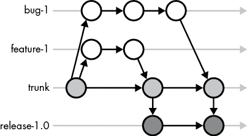
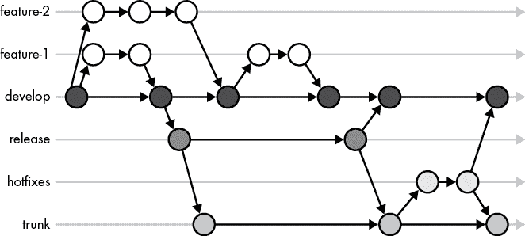
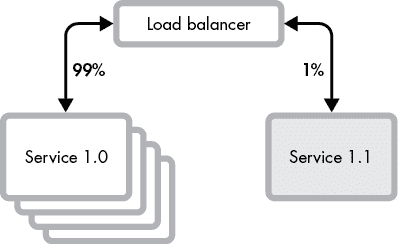
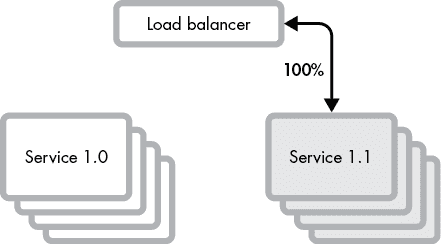
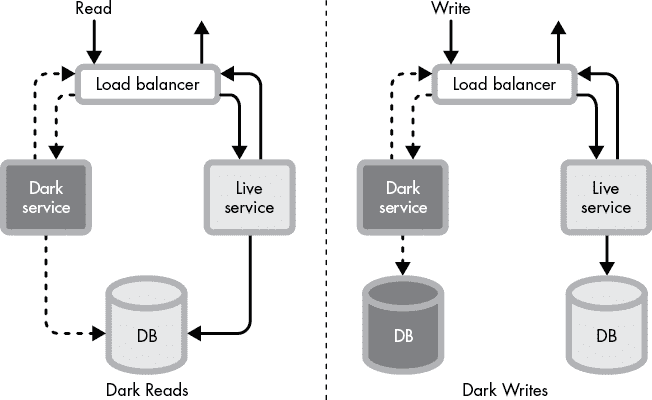

# 第八章：软件交付

你应该了解你的代码是如何呈现给用户的。理解交付过程将帮助你排查问题并控制何时进行更改。你可能不会直接参与这一过程——它可能是自动化的，或者由发布工程师来执行——但从`git commit`到实时流量之间的步骤不应该是一个谜。

当软件在生产环境中稳定运行并且客户在使用时，它就被认为是交付的。交付包含了发布、部署和上线等步骤。本章描述了将软件交付给客户的不同阶段、源代码控制分支策略（它们影响软件的发布方式）和当前的最佳实践。

## 软件交付阶段

不幸的是，交付阶段没有行业标准的定义。根据你与谁交谈，像*发布*和*部署*这样的词语可以指交付管道中完全不同的部分。你的团队可能会将整个过程，从打包到上线，称为*发布*。他们可能会将打包一个工件称为*发布*，而将使工件可供下载称为*发布*。他们可能不会说某个功能是*发布*的，直到它在生产环境中启用，而在此之前的一切都被称为*部署*。

本章中，我们将提到四个软件交付阶段，分别是*构建*、*发布*、*部署*和*上线*，如图 8-1 所示。软件首先必须*构建*成包。包应该是不可变的并且是版本化的。然后，包必须*发布*。发布说明和变更日志会更新，包被发布到一个集中式的仓库中。发布的工件必须*部署*到预生产和生产环境中。已部署的软件尚未对用户可访问——它只是被安装了。部署后，软件通过将用户切换到新软件来*上线*。一旦上线完成，软件就被交付了。

图 8-1：软件交付阶段

交付过程是更大产品开发周期的一部分。上线后，会收集反馈，发现 bug，并收集新的产品需求。功能开发重新开始，最终启动下一个版本的构建。

每个交付阶段都有一套最佳实践。这些实践将帮助你快速且安全地交付软件。但是在深入每个交付步骤之前，我们需要了解*源代码控制分支策略*。分支策略决定了代码更改被提交到哪里，以及如何维护发布代码。正确的分支策略将使软件交付变得轻松且可预测，而错误的策略则会使交付变成与流程本身的斗争。

## 分支策略

发布包是从版本控制系统中的代码构建的。*主干*——有时称为*main*或*mainline*——包含代码库的主要版本及其变更历史。*分支*是从主干“切出”的，用于修改代码；多个分支允许开发人员并行工作，并在准备好时将更改合并回主干。不同的分支策略定义了分支应该持续多久，它们与已发布版本的软件的关系，以及如何将更改传播到多个分支。两种主要的分支策略家族是基于主干的开发和基于功能分支的开发。

在*基于主干的开发*中，所有开发人员都在主干上工作。分支用于实现单个小功能、修复 bug 或进行更新。

图 8-2 展示了一个基于主干的开发策略。创建了一个功能分支 feature-1，并将其合并回主干。bug-1 分支被创建用来修复一个 bug。同时也切出了一个发布分支，开发人员决定将 bug 修复挑选到 1.0 版本发布中。

图 8-2：基于主干的开发分支

基于主干的开发在分支能够快速合并回主干时最为有效，通常在几天甚至几小时内完成，并且不共享给多个开发人员。频繁的合并被称为*持续集成*（*CI*）。持续集成减少了风险，因为更改会迅速传播到所有开发人员，从而减少彼此显著分歧的可能性。保持开发人员的代码库同步可以避免潜在的最后一刻集成难题，并及早暴露错误和不兼容性。作为一种权衡，主干中的错误会拖慢所有开发人员的进度。为了防止错误，通常会运行快速的自动化测试，以验证在分支合并到主干之前所有测试是否通过。团队通常会有明确的流程来应对主干损坏的情况；一般预期是主干应该始终可以发布，并且发布通常会很频繁。

在*基于功能分支的开发*中，许多开发人员同时在长期存在的功能分支上工作，每个分支与产品中的一个功能相关。由于功能分支的生命周期较长，开发人员需要进行*变基*——从主干拉取更改——以确保功能分支不会偏离主干太远。通过控制何时进行变基，可以保持分支的稳定性。在准备发布时，功能分支会合并到发布分支中。发布分支会进行测试，而功能分支可能会继续演化。包是从稳定的发布分支构建的。

基于功能分支的开发在主干（trunk）不稳定且无法发布给用户时非常常见，开发人员希望避免进入功能冻结状态，在此期间功能提交被禁止，而主干正在稳定。基于功能分支的开发在封闭式软件中更为常见，因为不同客户使用不同版本的程序；而面向服务的系统通常使用基于主干的开发策略。

最流行的功能分支方法，由 Vincent Driesen 在 2010 年描述，称为 *Gitflow*。Gitflow 使用一个 develop 分支、hotfix 分支和 release 分支。develop 分支作为主要分支，功能分支与其合并和变基。当准备发布时，从 develop 分支切出 release 分支。在发布稳定期间，开发工作继续在功能分支上进行。发布稳定后，将其合并到 trunk 分支。trunk 分支始终被视为生产就绪，因为它只包含稳定的发布版本。如果 trunk 分支不稳定，因为它包含严重的 bug，将立即通过 hotfix 解决这些问题，而不是等待正常的发布周期。Hotfix 会应用到 hotfix 分支，并合并到 trunk 和 develop 分支。

图 8-3 中的 Gitflow 示例包含两个功能分支：feature-1 和 feature-2。功能分支长期存在；它们与 develop 分支之间来回提交和合并。发布分支上有两个版本，都被拉入 trunk 分支。一个 hotfix 分支用来修复 trunk 中发现的 bug。这个 hotfix 也已被拉入 develop 分支，以便功能分支能够将其合并。

图 8-3：基于 Gitflow 功能分支的开发

了解并遵循团队的分支策略。分支策略定义了变更的发布时间、设定了测试期望、定义了 bug 修复选项，并决定了变更需要移植到多少个版本。许多公司开发了内部工具来帮助管理他们的版本控制系统工作流程。这些脚本会自动为你创建分支、合并和打标签。

除非确实需要长期存在的功能分支，否则请坚持使用基于 trunk 的分支策略。管理功能分支会变得复杂。实际上，Driesen 已经修改了他原本关于 Gitflow 的博客文章，建议不再使用 Gitflow 来处理可以持续集成和交付的软件。

## 构建阶段

软件包必须在交付前构建。构建软件需要许多步骤：解决和链接依赖关系、运行静态检查工具、编译、测试，最后是打包软件。大多数构建步骤在开发过程中也会使用，相关内容已经在第 3 到第六章中讨论过。在本节中，我们将重点关注构建的输出：软件包。

每个发布都会构建软件包，因此软件不必在每台运行的机器上重新构建。预构建的软件包比每台机器使用其自己的环境和独特工具组合编译和运行代码更一致。

如果软件面向多个平台或环境，构建会生成多个软件包。构建通常会为不同的操作系统、CPU 架构或语言运行时生成软件包。你可能已经遇到过像这样的 Linux 软件包名称：

+   *mysql-server-8.0_8.0.21-1_amd64.deb*

+   *mysql-server-8.0_8.0.21-1_arm64.deb*

+   *mysql-server-8.0_8.0.21-1_i386.deb*

这些 MySQL 包都是为相同的 MySQL 版本构建的，但每个包都是为不同的架构编译的：AMD、ARM 和 Intel 386。

包的内容和结构各不相同。包可以包含二进制文件或源代码、依赖项、配置文件、发布说明、文档、媒体文件、许可证、校验和，甚至虚拟机镜像。库被打包成特定语言的格式，如*JAR*、*wheels* 和 *crates*，它们大多是按照规格排列的压缩目录。应用程序包通常构建为 zip 文件、tar 包（*.tar* 文件）或安装包（*.dmg* 或 *setup.exe* 文件）。容器和机器包使开发者能够构建不仅仅是他们的软件，还包括运行它的环境。

打包决定了软件的发布方式。错误的打包会使软件难以部署和调试。为了避免麻烦，始终对包进行版本控制，并按资源类型拆分包。

### 版本包

包应该进行版本控制并分配唯一标识符。唯一标识符帮助运维人员和开发人员将正在运行的应用程序与特定的源代码、功能集和文档联系起来。没有版本，你无法知道一个包的行为。如果不确定使用什么版本控制策略，语义版本控制是一个安全的选择。大多数包遵循某种形式的语义版本控制（参见第五章）。

### 单独打包不同的资源

软件不仅仅是代码。配置、架构、图片和语言包（翻译）都是软件的一部分。不同的资源有不同的发布节奏、不同的构建时间，以及不同的测试和验证需求。

不同的资源应该单独打包，这样它们可以在不重新构建整个软件包的情况下进行修改。单独打包使得每种资源类型可以拥有独立的发布生命周期，并且可以独立地向前和向后滚动。

如果你要将一个完整的应用程序交付给客户，那么最终的包就是一个元包：由多个包组成的包。如果你要交付一个 Web 服务或自我升级的应用程序，可以将包单独交付，允许配置和翻译与代码独立升级。

## 发布阶段

发布发布使软件能够提供给用户并启用部署，这是交付的下一个阶段。发布流程根据软件的类型、规模和用户的技术水平而有所不同。内部 Web 服务的发布流程可能只有一个步骤：将软件包发布到共享的软件包库。面向用户的发布需要发布构件、更新文档、发布说明以及与用户的沟通。

发布管理是以可预测的节奏发布稳定、文档完备的软件的艺术。适当的发布管理能够带来满意的客户。对于有多个团队在其中进行开发的复杂软件，通常会有发布经理的角色。发布经理协调整个过程——测试、功能验证、安全程序、文档等。

理解发布管理将帮助你更有效地与公司发布流程协作。通过频繁发布不可变的包，来承担软件发布的责任。明确发布的时间表，并在发布新版本时附带更新日志和发布说明。

### 不要把发布“扔过篱笆”

负责你的软件发布工作。即使你的组织有发布工程或运维团队，你也应该了解你的软件是如何以及何时呈现在用户面前的。发布和运维团队在设置工具、提供最佳实践建议、自动化繁琐任务和记录方面可以提供很大帮助，但他们不如你了解你的代码。最终，确保软件得到适当部署并正常运行是你的责任。

确保你的代码在测试环境中正常运行，跟踪发布进度，了解可用的选项，并为你的应用选择正确的发布方法。如果只有部分应用发布，或者一个关键的错误进入了生产环境，你需要参与调查发生了什么，并找出如何防止类似问题再次发生。

### 将包发布到发布仓库

发布包通常会发布到包仓库，或者直接在 Git 这样的版本控制系统中打上标签并存储。尽管这两种做法都可以，但我们建议你将发布包发布到专门的包仓库。

发布仓库为最终用户提供发布工件。Docker Hub、GitHub Release Pages、PyPI 和 Maven Central 都是公共仓库。许多公司还会先发布到内部仓库，再进行发布操作。

包仓库使发布工件（也就是可部署包）可供部署。仓库还充当档案库——以前的发布工件可以用于调试、回滚和分阶段部署。包的内容和元数据都会被索引并可浏览。搜索功能让你能轻松找到依赖项、版本信息和发布时间等信息，这在故障排除时非常有价值。发布仓库还专门为满足部署需求而建设，能够处理数千个用户同时下载新版本。

像 Git 这样的版本控制系统也可以作为发布仓库。例如，Go 就采用了这种方法。Go 的依赖通过 Git URI（通常是 GitHub 仓库）来表示，而不是使用集中式的包仓库。

版本控制系统作为发布仓库使用，但它们并非为此目的而设计。版本控制系统没有那么多有用的搜索和部署功能。它们并非为大规模部署而设计，可能会不堪重负。如果你发现自己正在从版本控制系统中发布，确保它能够处理负载。将发布和开发共享同一系统会导致操作问题，因为部署和开发的需求非常不同。开发人员进行频繁的小提交和较少的检出操作，而部署则是一次性检出代码，往往是从多台机器上进行。如果它们共享相同的仓库或物理机器，部署需求和开发工具的使用可能会相互影响性能。

### 保持发布包不可变

一旦发布，绝不更改或覆盖发布包。不可变的发布保证了所有运行特定版本的应用实例在字节级别上完全一致。相同的发布包让开发人员能够推测应用中包含了哪些代码以及它应该如何表现。版本化的包如果发生变化，其效果与没有版本化的包没有区别。

### 经常发布

尽可能频繁地发布。缓慢的发布周期会给人一种虚假的安全感：发布之间的长时间间隔让人觉得有充足的时间来测试变更。实际上，快速发布周期能产生更稳定的软件，且在发现错误时更容易修复。每个周期发布的变更较少，因此每次发布的风险较小。当一个错误进入生产环境时，调试时需要查看的变更也更少。开发人员对代码还记忆犹新，这使得修复错误变得更加容易和快速。

配备自动化包发布和部署的软件应该能够在每次提交时发布。对于较大且难以部署的软件，需要平衡发布的频率与发布、部署、维护成本以及用户采纳速度之间的关系。

### 对发布计划保持透明

*发布计划*定义了软件发布的频率。一些项目有可预测的时间表，每季度或每年发布一次。其他项目则在特定功能完成时发布（基于里程碑的发布），或者仅仅是根据开发人员的意愿发布。内部系统通常会在每次提交时发布版本。无论发布方式如何，都要明确发布计划。发布计划应该公开，并在新版本发布时通知用户。

### 发布变更日志和发布说明

变更日志和发布说明帮助你的用户和支持团队了解发布内容。*变更日志*列出在发布中修复的每个票证或提交。为了自动化生成变更日志，可以追踪提交信息或问题追踪标签中的变更。发布说明是对发布中包含的新特性和错误修复的总结。变更日志主要供支持和开发团队阅读，而发布说明是为用户准备的。

## 部署阶段

部署软件是将软件包放置到需要运行的地方的过程。部署机制各不相同——移动应用程序的部署与核反应堆的部署有所不同——但相同的基本原则适用。

### 自动化部署

使用脚本而非手动步骤进行软件部署。自动化部署更具可预测性，因为脚本行为是可复现并且版本受控的。当出现问题时，操作人员能够推理部署行为。

脚本比人类更不容易出错，它们消除了手动调整系统、登录机器或手动复制包的诱惑。在现有机器上更改状态是很难做到正确的。两次不同的软件部署可能会导致不一致的行为，这使得调试变得非常困难。

高度进化的自动化促成了*持续交付*。通过持续交付，人工完全被从部署过程中移除。打包、测试、发布、部署，甚至发布阶段都实现了自动化。部署可以按需求频繁进行——每天、每小时，甚至是持续进行。通过持续交付，团队能够快速将新特性交付给用户，并从中获得反馈。成功的持续交付需要承诺自动化测试（参见第六章）、自动化工具的支持，以及能够适应快速变化的用户群体。

我们建议使用现成工具来自动化部署。自定义部署脚本易于入门，但很快就会变得难以管理。像 Puppet、Salt、Ansible 和 Terraform 这样的现成解决方案可以与现有工具集成，并且是为部署自动化而专门设计的。

你可能会发现完全自动化部署是不可行的——这没关系。依赖于物理操作或第三方的部署有时是无法完全自动化的。尽力通过自动化周围的任务来缩小阻塞任务的范围。

### 使部署具备原子性

安装脚本通常涉及多个步骤。不要假设每个步骤在每次执行时都会成功。机器可能会用完磁盘空间、在错误的时间重启，或者遇到意外的文件权限问题。如果脚本假定安装位置为空，部分部署的应用程序可能会导致未来的部署失败。为了避免部分部署失败，应使部署要么全部完成，要么完全不完成（原子性）。部分部署的安装不应该部分替换先前成功的安装，并且应该允许多次将相同的包安装到同一台机器，即使之前的安装尝试突然中止。

使部署原子化的最简单方法是将软件安装在与旧版本不同的位置；不要覆盖任何内容。安装完包之后，只需通过一个快捷方式或符号链接来原子性地切换。将包安装在新位置的另一个好处是，回滚变得更加容易——只需再次指向旧版本。在某些情况下，甚至可以在同一台机器上同时运行同一软件的不同版本！

### 独立部署应用程序

部署顺序是一个常见问题，当一个应用程序的部署需要先升级另一个应用程序时，特别是在有多个应用程序或服务相互通信的软件中。开发人员要求运维先部署一个应用程序，然后再部署另一个，或者将几个系统下线进行升级。避免部署顺序的请求。部署顺序要求会拖慢部署速度，因为应用程序必须互相等待。顺序还会导致冲突，例如两个应用程序相互依赖，必须先升级另一个才能进行部署。

构建可以独立部署的应用程序。无需依赖部署顺序的软件必须向前向后兼容。例如，通信协议必须继续与新旧版本互操作。兼容性将在第十一章中详细讨论。

当某个依赖无法避免时，使用接下来讨论的推出技术来安全地无序部署。将更改关闭并在特定顺序下再开启，通常比强制执行部署顺序更快更简单。

## 推出阶段

一旦新代码部署完成，你可以将其启用（推出）。一次性将所有内容切换到新代码是有风险的。再多的测试也无法消除潜在的 bug，而一次性将代码推出给所有用户可能会导致所有人同时出现问题。相反，最好的做法是逐步推出更改并监控健康指标。

有许多发布策略：功能开关、断路器、暗发布、金丝雀发布和蓝绿发布。*功能开关*让你控制多少用户使用某一代码路径而非另一条。*断路器*会在出现问题时自动切换代码路径。*暗发布*、*金丝雀发布*和*蓝绿发布*允许你同时运行多个部署版本的软件。这些模式在正确使用时可以减少危险更改的风险。不过，别在发布策略上过度使用复杂的技术——它们会增加操作复杂性。操作员和开发人员必须同时支持多个代码版本，并跟踪哪些功能被切换开或关。将复杂的发布策略留在工具箱中，适用于更大的变更。

### 监控发布

在新代码激活时，监控健康指标，如错误率、响应时间和资源消耗。监控可以手动进行，也可以自动进行。高级发布管道会根据观察到的统计数据，自动将更改发布给更多用户，或回滚更改。即使在完全自动化的过程中，人类也应当留意统计数据和发布进度。更常见的是，是否逐步发布的决定仍然由人类根据日志和指标来做出。

提前确定哪些是常规的健康指标。*服务水平指标*（*SLIs*），在第九章中有更多讨论，是指示服务健康状况的指标；需要观察这些指标以判断是否有退化的迹象。思考一下你期望在指标或日志中看到什么，以判断你的更改是否按预期工作。验证预期发生的事情是否确实发生了。

记住，代码提交后你的工作并未结束，代码发布后也仍然没有完成。在看到指标和日志显示你的更改成功运行之前，不要急着庆祝。

### 使用功能开关逐步发布

功能开关（有时称为*功能切换*或*代码分支*）允许开发人员控制何时将新代码发布给用户。代码被包装在`if`语句中，检查一个标志（由静态配置或动态服务设置），以确定应运行哪一分支代码。

功能开关可以是开关布尔值、允许列表、基于百分比的逐步发布，甚至是小功能。布尔值会为所有用户切换功能。允许列表为特定用户启用功能。基于百分比的逐步发布允许开发人员慢慢地为更大范围的用户启用该功能。通常会从公司拥有的测试账户开始，然后逐步推广到单一客户，再进行按百分比的增量发布。函数根据输入参数动态地决定功能开关的状态，通常是在请求时传递。

需要特别注意那些会改变状态的特性标志代码。数据库通常不受特性标志控制。新旧代码都与相同的表进行交互。你的代码必须向前和向后兼容。当特性被关闭时，状态并不会消失。如果一个特性对用户禁用后再启用，在该特性禁用期间所做的任何状态更改依然存在。一些更改，比如数据库修改，不适合渐进式发布，必须格外小心地协调。如果可能，隔离特性标志数据，在所有标志状态下测试代码，并编写脚本来清理回滚的特性数据。

确保清理掉那些已经完全发布或不再使用的旧特性标志。代码中布满特性标志很难推理，甚至可能导致 bug；例如，关闭一个已经启用很长时间的特性可能会引发混乱。清理特性标志需要一定的纪律性。创建工单来移除未来的旧标志。就像重构一样，清理工作应当逐步进行，趁机进行。

特性标志有时用于*A/B 测试*，这是一种通过新特性衡量用户行为的技术。如果用户被以统计学上有意义的方式分组，那么使用特性标志进行 A/B 测试是可以的。除非标志系统为你创建了测试分组，并且实验由数据科学家运行，否则不要尝试使用特性标志进行 A/B 测试。

### 用熔断器保护代码

大多数特性标志由人工控制。熔断器是一种特殊的特性标志，由操作事件控制，如延迟激增或异常。熔断器有几个独特的特点：它们是二进制的（开/关），它们是永久性的，并且是自动化的。

熔断器用于防止性能下降。如果超过延迟阈值，某些特性可以被自动禁用或限速。同样，如果日志显示异常行为——例如异常或日志冗余度激增，电路也可以断开。

熔断器还可以防止永久性损害。那些执行不可逆操作的应用程序，例如发送电子邮件或从银行账户转账，当不确定是否继续时会使用熔断器。数据库也可以通过切换到只读模式来保护自己。如果数据库检测到磁盘损坏，许多数据库和文件系统会自动这样做。

### 并行发布服务版本

可以将新的 Web 服务版本与旧版本并行部署。软件包可以放置在同一台机器上，或部署到全新的硬件上。并行部署允许你缓慢地增加负载，以降低风险，并在出现问题时快速回滚。通过类似于功能标志的开关，将一定比例的入站服务调用从旧版本切换到新版本，但该开关位于应用入口点——通常是负载均衡器或代理。金丝雀部署和蓝绿部署是最常见的两种并行部署策略。

Canary 部署适用于处理大量流量并部署到多个实例的服务。新的应用版本首先部署到有限的机器集上。少量用户子集会被引导到金丝雀版本。图 8-6 显示了金丝雀版本 1.1 接收 1% 的入站流量。就像矿井中的金丝雀（用于检测有害气体的存在）一样，金丝雀部署是新应用版本的预警系统。出现故障的金丝雀只会影响一小部分用户，遇到错误时可以迅速将他们引导回旧版本。

图 8-6：在金丝雀部署中，负载均衡器将一部分入站流量引导到新的部署版本。

*蓝绿部署*运行两个不同版本的应用：一个是活动版本，一个是被动版本。图 8-7 显示了一个运行版本 1.0 的被动集群（称为 *蓝*），以及一个运行版本 1.1 的活动集群（称为 *绿*）。新版本部署到被动环境；当其准备就绪时，流量会切换到新版本，成为活动版本，而旧版本成为被动版本。与金丝雀部署类似，如果新版本出现问题，流量可以切换回去。与金丝雀部署不同的是，流量切换是原子性的，并且蓝绿环境尽可能保持一致。在云环境中，一旦发布被认为稳定，通常会销毁被动环境。

图 8-7：在蓝绿部署中，服务 1.0 被保留作为回退，以防服务 1.1 出现故障。

蓝绿部署在流量无法轻易子集化或无法并行运行不同版本时非常有用。与金丝雀部署不同，每个环境必须能够处理 100% 的用户流量。在灾难场景中，当所有用户都需要从故障系统迁移时，能够迅速启动并运行并行环境是极其宝贵的。

与功能标志一样，涉及数据库和缓存状态的并行部署需要特别小心。应用的两个版本必须和谐共处。必须强制执行所有模式的向后和向前兼容性。本章第十一章将进一步讨论这一话题。

### 启动深色模式

特性标志、金丝雀发布和蓝绿发布将代码部署到一部分用户，并在出现问题时提供缓解机制。暗启动，有时称为*流量影子*，将新代码暴露给真实流量，但完全不让最终用户看到。即使暗代码有问题，也不会影响用户。

暗启动的软件仍然启用，并且代码被调用，但结果会被丢弃。暗启动帮助开发人员和运维人员在生产环境中学习他们的软件，且对用户的影响最小。每当你发布特别复杂的变更时，利用暗启动是一个好方法。这个模式对于验证系统迁移尤其有用。

在暗启动中，应用代理位于实时流量和应用程序之间。代理将请求复制到暗系统。来自两个系统的相同请求的响应会被比较，差异会被记录下来。只有生产系统的响应会发送给用户。这一做法使运维人员能够在真实流量下观察他们的服务，而不会影响客户。当系统仅接收读流量且没有数据被修改时，它被称为“暗读”模式。一个系统可能在暗读模式下使用与生产系统相同的数据存储。当写入操作也发送到该系统并且它使用完全独立的数据存储时，它被称为“暗写”模式。图 8-8 展示了这两种模式。

由于同一请求在生产系统和暗系统上都执行一次，因此需要小心避免与重复相关的错误。发送到暗系统的流量应排除在用户分析之外，并且需要避免诸如重复计费等副作用。可以通过修改头信息来标记请求，以突出显示被影藏的流量。一些服务网格（如 Istio）和 API 网关（如 Gloo）内置了对这些操作的支持。

图 8-8：暗读和暗写

你可以通过暗启动做各种很酷的事情。例如，开源工具 Diffy 会将暗流量发送到后端服务的三个实例：两个运行生产版本代码，一个运行新发布候选版本。Diffy 比较新版本和旧版本的响应，以识别所有差异，并比较两个旧版本的响应，以识别非确定性的噪声。这使得 Diffy 可以自动识别预期的差异，并排除假阳性结果。

## 应做与不应做

| **应做** | **不应做** |
| --- | --- |
| **做** 如果可能，使用基于主干的开发和持续集成。 | **不做** 发布没有版本的包。 |
| **做** 使用版本控制工具管理分支。 | **不做** 将配置、架构、图像和语言包捆绑在一起。 |
| **做**与发布和运维团队合作，为你的应用创建正确的流程。  | **不做**盲目依赖发布经理和运维团队。  |
| **做**发布发布日志和版本说明。  | **不做**使用版本控制系统（VCS）分发软件。  |
| **做**在发布时通知用户。  | **不做**发布后更改发布包。  |
| **做**使用现成的工具自动化部署。  | **不做**在没有监控结果的情况下进行发布。  |
| **做**通过功能标志逐步推出更改。  | **不做**依赖于部署顺序。  |
| **做**使用电路断路器防止应用程序造成重大损害。  |  |
| **做**对重大更改使用流量影像和暗启动。  |  |

## 升级

*《团队中的 Git》*，作者 Emma Jane Hogbin Westby（O’Reilly Media，2015），详细介绍了分支策略。这是一本很好的基础书籍，即使你不使用 Git，也非常有价值。

Jez Humble 和 David Farley 的*《持续交付》*（Addison-Wesley Professional，2010）深入探讨了本章涵盖的话题。如果你花很多时间在发布工程上，读这本书。对于简短的阅读，Google 的*《站点可靠性工程》*（O’Reilly Media，2016）在第八章中涵盖了发布工程。

Michael T. Nygard 的*《Release It!》*（Pragmatic Bookshelf，2018）对我们书中第八章和第九章讨论的运维话题进行了全面深入的探讨。Nygard 的书还重点介绍了运维的设计模式，这是我们在第四章讨论的内容。我们强烈推荐开发人员阅读*《Release It!》*，尤其是从事 Web 服务开发的人员。

亚马逊的*《构建者库》*也是一个很好的免费资源，提供交付最佳实践。该库位于[`aws.amazon.com/builders-library/`](https://aws.amazon.com/builders-library/)，里面有关于持续交付、自动化部署和回滚的文章。
