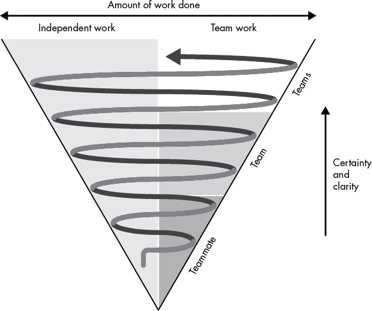

# 第十章：技术设计过程

当被要求进行更改时，大多数初级工程师会直接跳入编码。刚开始跳入代码是有效的，但最终你会遇到一个任务，任务太大无法立即着手，你将需要思考技术设计。

*技术设计过程*帮助每个人达成一致，为大规模变更制定设计。设计工作分为两个活动：独立的深度思考工作和协作小组讨论。研究、头脑风暴和写作构成了深度工作。设计讨论和对设计文档的评论构成了协作部分。这个过程的实际产出是一个设计文档。

本章描述了一个扩展版的设计过程，适用于大规模变更。这个过程看起来可能很慢且令人生畏。有些工程师因沉重的设计过程而心生创伤。如果是小规模变更，可以适当简化。你所解决的问题可能只需要三句话来概述，而不是一篇长篇文章。设计模板的部分内容可能不相关，多轮反馈可能不必要，其他团队的审查可能也不需要。你会逐渐摸索出解决问题所需的适当输入和协作量。在开始时，可以采取保守的态度：向你的技术负责人或经理寻求指导，并广泛分享你的设计。如果做得正确，参与和领导技术设计工作将是有益且有价值的。

## 技术设计过程锥形图

设计软件不是从研究和头脑风暴到文档和批准的线性过程。它更像是一个螺旋过程，在独立工作和协作工作之间交替进行，每一步都在澄清和完善设计（见图 10-1）。

图 10-1：设计过程螺旋图

每一次迭代，设计文档都会变得更加清晰和详细。作者对解决方案的信心不断增长，设计背后的工作量也在增加——实验、概念验证和基准测试。咨询设计的人数和种类随着时间的推移也在增长。

你从锥形图的底部开始。你对问题空间、需求和可能的解决方案尚不明确。因此，在过程的早期，你不可能拥有一个你有信心的解决方案。

在研究过程中，你会在独立工作和与小组成员或领域专家的讨论之间来回切换。你进行头脑风暴和实验。目标是学习——增加确定性和清晰度。

最终，你的研究、实验和头脑风暴将引导你找到一个首选设计。在与合作伙伴进行合理性检查后，你撰写设计文档。在写作过程中，你会发现更多未知的问题。你创建了一些小的原型来验证你的设计，回答问题，并帮助选择可行的替代方案。你进行更多的研究，向专家请教意见。你完善设计文档的草稿。

锥形漏斗中的箭头进一步向上螺旋。你现在更确定自己理解了问题空间。你的原型让你对解决方案越来越有信心。你已经有了设计提案，并准备开始传播。你将其分享给团队，获取更多反馈。你进行研究、讨论，并更新你的设计文档。

你现在处于漏斗的最高层级。你已经为设计投入了大量工作，并对自己的方法充满信心。你将设计传播到整个组织。安全、运营、相关团队以及架构师都需要了解你所作的更改，不仅仅是为了提供反馈，更是为了更新他们对系统工作方式的心智模型。

设计被批准后，实施开始，但设计工作并未结束。实施过程中会浮现出更多意外情况。如果你和你的团队在编码过程中有任何大的偏差，你必须更新设计文档。

## 关于设计的思考

设计漏斗的基础始于探索。在你开始开发设计之前，你需要了解问题空间和需求。探索需要思考、研究、实验和讨论。正如漏斗所示，探索既是个人的也是团队的工作。

### 定义问题

你的首要任务是定义并理解你试图解决的问题（或问题）。你需要理解问题的边界，才能知道如何解决它，避免构建错误的东西。你甚至可能会发现根本没有问题，或者问题根本不值得解决。

首先，向利益相关者询问他们认为问题是什么。这些利益相关者可能是你的经理、团队成员、产品经理或技术负责人。并不是每个人都能以相同的方式看待问题。

将问题用你自己的话重新表述给利益相关者。询问你的理解是否与他们一致。如果存在多个问题，询问哪些问题是最优先的。

“如果我们不解决这个问题，会发生什么？”是一个强有力的问题。当利益相关者回答时，接着问是否可以接受这个结果。你会发现，许多问题实际上并不需要解决。

在你收集了各个利益相关者的反馈后，尽量将反馈信息整合成一个清晰的问题陈述。不要仅凭问题描述表面进行判断。要批判性地思考你所得到的信息。特别要关注问题的范围——包括哪些内容，哪些内容本可以包括但没有包括。不要将所有利益相关者的问题合并在一起，这样会变得繁琐。不要害怕剔除低优先级的改动。编写并传播问题陈述——包括范围内和范围外的内容——以验证你的理解并获取反馈。

初始的功能需求可能如下所示：

> 供应经理希望在库存页面上查看每个物品的目录和页码。显示目录信息可以帮助在库存不足时更方便地重新订购物品。我们可以利用合同工扫描所有目录，并使用机器学习模型将扫描的图像映射到数据库中的物品描述。

这个请求会引发很多问题，需要产品经理解答：

+   供应经理现在是如何下订单的？

+   一件物品能出现在多个目录中吗？

+   用户在没有这个功能的情况下是如何满足需求的？

+   当前解决方案的痛点是什么？

+   哪个痛点对业务的影响最大？

对这些问题的回答可能会导致修订后的问题陈述：

> 供应室经理需要一种简便的方法来重新订购库存不足的物品。目前，他们在 Excel 电子表格中维护我们生成的库存条目标识符与供应商名称和 SKU 的映射，并进行交叉引用。从我们的软件切换到 Excel 进行查询，然后从供应商下单，既慢又容易出错。
> 
> 一个单一的 SKU 可能有多个供应商。供应室经理希望能够访问所有供应商信息，以便最大限度地降低成本。由于电子表格的限制，他们目前只能跟踪每个物品的单一供应商。
> 
> 供应室经理按以下顺序排列优先级：数据准确性、下单时间、订单成本最小化。
> 
> 一些供应商提供在线目录，大约一半的供应商提供在线购买。

精炼后的问题描述将导致与原始方案完全不同的解决方案。工程师专注于问题并列出优先级。诸如合同工作和机器学习模型之类的提议已被舍弃。还包含了关于在线供应商目录的信息，以便为潜在解决方案提供参考。

### 做好你的研究

不要直接从问题定义跳到“最终”设计。要考虑相关的研究、替代方案和权衡。你提出的设计应该是你最好的设计，而不是第一个想法。

网上有大量资源可供参考。看看别人是如何解决类似问题的。许多公司运营着工程博客，描述他们是如何解决问题并实现功能的。虽然公司博客部分是营销活动，且通常描述的是简化的架构，省略了复杂的部分，但博客文章仍然是了解别人做法的一个合理途径。通过社交网络或电子邮件联系作者，可能会获得博客文章中没有提到的细节。

行业会议是另一个值得参考的资源。演示文稿或录音通常会发布在网上。别忘了学术研究和白皮书；使用论文结尾的参考文献部分找到更多的阅读材料。

与你正在探索的领域中的专家交流。向公司内的专家寻求意见，但不要仅限于你的同事。你会发现许多博客和论文的作者以及演讲者都乐于讨论他们的工作。只是要小心，避免在与外部人士交流时泄露公司机密信息。

最后，批判性地思考。并不是你在网上看到的每个点子都值得采纳。一种常见的错误是拿一个与自己问题相似但不完全相同的解决方案照搬过来。即使你的问题看起来类似，也不代表它和谷歌的问题是一样的（即便你在谷歌工作）。

### 进行实验

通过编写草稿代码并运行测试来实验你的想法。编写草稿 API 和部分实现。进行性能测试，甚至是 A/B 用户测试，以了解系统和用户的行为。

实验会让你对自己的想法充满信心，暴露设计上的权衡，并且澄清问题的范围。你还可以感受到你的代码将如何被使用。与团队分享你的原型，以便获取反馈。

不要对实验代码产生依赖。概念验证代码旨在说明一个想法，之后应丢弃或重写。把精力集中在展示或测试你的想法上。不要编写测试或浪费时间去打磨代码。你要尽可能快地学习更多的知识。

### 给它时间

良好的设计需要创造力。不要指望一下子就能完成一个设计。给自己充足的时间，休息一下，换个环境，保持耐心。

设计需要深入思考。你不能在 15 分钟的间隙内进行设计；要给自己几小时专注的时间。保罗·格雷厄姆（Paul Graham）写过一篇文章，名为《经理的日程，创作者的日程》（[`www.paulgraham.com/makersschedule.html`](http://www.paulgraham.com/makersschedule.html)）。文章描述了“创作者”——也就是你——有连续专注时间的重要性。找出你最能保持深度集中注意力的时段，并将其安排在日程上。克里斯（Chris）偏好午餐后的安静设计时光，而德米特里（Dmitriy）则在清晨感觉最有生产力。找到适合你的时间，并为之保护。

打断是深度工作的大敌。避免所有通讯手段：关闭聊天，关闭电子邮件，禁用手机通知，甚至可以换个地方坐。确保你有需要的工具——白板、笔记本、纸张——如果你换了地方。

你不会在整个预定的时间里一直“设计”。你的大脑需要时间放松。休息一下，给自己喘息的空间。让思维放松并自由徜徉。散步、泡茶、读书、写作、画图表。

设计是一个全天候的工作，因此要有耐心。你的大脑总是在酝酿想法。思绪会在一天中的任何时候（甚至在你睡觉时）突然出现。

放松的设计方法并不意味着可以无限期拖延。你有交付日期需要遵守。设计突发事件（*spike*）是管理创造性工作与可预测交付之间张力的好方法。*Spike*是极限编程（XP）中的一个术语，指的是一个时间有限的探索。将一个 spike 任务分配到冲刺中，将为你提供时间进行深入思考，而无需担心其他任务。

## 编写设计文档

设计文档是一种可扩展的方式，可以清晰地传达你的想法。写作过程能够结构化你的思维，并突出薄弱环节。记录你的想法并非总是自然而然的。要创建有用的设计文档，重点放在最重要的变化上，牢记目标和受众，练习写作，并保持文档的最新性。

### 文档后续变化

并非每个变化都需要设计文档，更不用说正式的设计审查过程了。你的组织可能有自己的相关指导原则；如果没有，可以使用以下三个标准来决定是否需要设计文档：

+   该项目将需要至少一个月的工程工作。

+   这一变化将对软件的扩展和维护产生深远的影响。

+   这一变化将对其他团队产生重大影响。

第一个情况不言自明：如果项目需要较长时间才能实现，最好在前期花些时间记录设计，以确保自己不会走错方向。

第二种情况需要稍微解释一下。一些变化虽然引入迅速，但却伴随有长期影响。这可能是引入了一种新的基础设施——缓存层、网络代理或存储系统。也可能是一个新的公共 API 或安全措施。虽然可能有快速的方式来解决一些眼前的问题，但这种变化往往伴随有长期成本，这些成本可能不容易显现。通过编写设计文档并进行审查，可以让相关问题浮现并得到解决。审查还将确保整个团队理解新增内容及其原因，从而有助于避免未来的意外。

对于那些会显著影响多个团队的变化，也需要有设计文档。团队需要知道你在做什么，以便提供反馈，并适应你的变动。影响范围广泛的变化通常需要代码审查或重构，其他设计也可能会受到影响。你的设计文档将通知团队你即将做出的变动。

### 明白你为什么写作

表面上，设计文档告诉他人一个软件组件是如何工作的。但设计文档的功能不仅仅是简单的文档记录。设计文档是一种工具，帮助你思考、获取反馈、保持团队信息同步、帮助新工程师快速上手，并推动项目规划。

写作有时会暴露你所不懂的东西（相信我们这一点）。逼迫自己把设计写下来，迫使你去探索问题空间，并凝练出你的想法。你必须面对替代方案和理解中的空白。这是一个动荡的过程，但你会因为经历过这一过程而对自己的设计和其权衡有更好的理解。通过写下设计所获得的思维清晰度，也会使设计讨论更具生产力。

征求关于书面设计的反馈更容易。书面文档可以广泛传播，其他人可以在自己的时间里阅读和回应。即使反馈较少，传播设计文档仍能让团队保持信息更新。

传播设计知识有助于他人保持对系统工作原理的准确思维模型。团队以后能够做出更好的设计和实施决策。值班工程师也能正确理解系统的行为。工程师们还可以通过设计文档向队友学习。

设计文档对新加入团队的工程师特别有帮助。没有设计文档的情况下，工程师们会通过爬取代码、画框图、从资深工程师那里逐步获取知识来理解系统。阅读大量设计文档要高效得多。

最后，管理者和技术负责人使用设计文档进行项目规划。许多设计文档包含完成项目所需的里程碑或实施步骤。如果项目是跨部门的，拥有一份具体的设计文档可以更容易地与其他团队协调。

### 学会写作

那些觉得自己写作不好的工程师，可能会对写作感到畏惧；但不要害怕。写作是一项技能，和任何其他技能一样，它是通过练习培养的。抓住机会多写——设计文档、邮件、代码审查评论——并努力写得清晰。

清晰地写作会让你的生活变得更加轻松。写作是一种有损的信息传递方式：你把想法写下来，而你的团队成员在脑海中不完美地重建这些想法。好的写作能够提高这种传递的准确性。好的写作也是职业发展的助推器。写得好的文档能够轻松地传阅给大范围的人群，包括高层管理人员，而优秀的写作者也不会被忽视。

从目标受众的角度重读你写的内容：重要的不是你自己是否理解，而是他们是否理解。要简洁明了。为了帮助获取读者的视角，可以阅读他人写的内容。思考如何修改他们的写作：哪些内容是多余的，哪些内容是缺失的。向公司中优秀的文档写作者寻求反馈，看看他们对你写的内容有什么建议。更多写作资源请参见“Level Up”。

不是以母语为英语的开发人员有时会因为书面沟通感到压力。软件工程是一个全球性的行业。团队中每个人说自己母语的情况很少见。不要让语言障碍阻止你编写设计文档。不要担心语法是否完美，关键是要清晰地表达你的想法。

### 保持设计文档的最新状态

我们一直在讨论设计文档作为一种工具，用来在实现之前提出并最终确定设计。一旦你开始实施，设计文档就从提案转变为描述软件如何实现的文档：它们是*活文档*。

在从提案到文档的过渡过程中，有两个常见的陷阱。第一个陷阱是提案文档被放弃，之后再也没有更新。随着实施的变化，文档变得对未来的用户具有误导性。第二个陷阱是文档被更新，但提案的历史被遗失。未来的开发人员看不到导致设计决策的讨论，可能会重蹈覆辙，犯过去的错误。

在进行过程中保持文档的最新状态。如果你的设计提案和设计文档是两个独立的部分（比如 Python PEP 与 Python 文档），你需要确保文档跟随实现的提案进行更新。在进行代码审查时，也要确保其他人保持文档的更新。

对设计文档进行版本控制。一个好方法是将设计文档与代码一起在同一个仓库中进行版本控制。代码审查可以用作设计意见的审查。随着代码的演进，文档也可以进行更新。不过，并不是每个人都喜欢在 Markdown 或 AsciiDoc 中审查设计文档；如果你更喜欢使用 Wiki、Google Docs 或 Word 等工具，可以将文档的完整历史记录，包括讨论内容，保留下来。

## 使用设计文档模板

设计文档应描述当前的代码设计、变更的动机、潜在的解决方案以及提议的解决方案。文档应包括有关提议解决方案的详细信息：架构图、重要的算法细节、公共 API、模式、与替代方案的权衡、假设和依赖关系。

设计文档没有通用的模板，但开源设计文档可以让你了解重大变更是如何被记录的。我们已在本章末的“提升”部分中提供了 Python 增强提案、Kafka 改进提案和 Rust 评论请求（RFC）的链接。如果你的团队有模板，请使用它；如果没有，可以尝试这种结构，我们将在下面详细描述：

+   引言

+   当前状态与背景

+   变更动机

+   需求

+   潜在解决方案

+   提议的解决方案

+   设计与架构

    +   系统图

    +   UI/UX 变更

    +   代码变更

    +   API 变更

    +   持久化层变更

+   测试计划

+   部署计划

+   未解决的问题

+   附录

### 前言

介绍正在解决的问题并说明为什么值得解决。提供一段关于提议变更的总结，并给出一些指导，指引不同的读者——安全工程师、运维工程师、数据科学家——查看相关部分。

### 当前状态与背景

描述正在修改的架构并定义术语。解释具有不明显名称的系统功能：“Feedler 是我们的用户注册系统。它建立在 Rouft 之上，Rouft 是提供有状态工作流处理的基础设施。”谈论当前问题的解决方式。是否有正在使用的变通方法？这些方法有什么缺点？

### 变更动机

软件团队通常有比他们能处理的项目更多的任务。为什么这个特定问题值得解决，为什么现在是解决它的时机？描述此举带来的好处，并将这些好处与业务需求挂钩：“我们可以将内存占用减少 50%”不如“通过将内存需求减少 50%，我们可以解决安装我们软件时最常见的反对意见，从而推动更广泛的采用。”但要小心不要过度承诺！

### 需求

列出可接受的解决方案必须满足的要求。这些要求可以分为以下几类：

+   **面向用户的要求：** 这些通常是大部分的要求，定义了从用户角度来看变更的性质。

+   **技术要求：** 这些是必须满足的解决方案的硬性要求。技术要求通常由互操作性问题或严格的内部指南引起，例如“存储层必须支持 MySQL”或“必须提供 OpenAPI 规范以与我们的应用程序网关配合使用。”服务水平目标也可以在此处定义。

+   **安全和合规要求：** 尽管这些可能被视为面向用户或技术的需求，但通常会单独列出，以确保安全需求得到明确讨论。数据保留和访问政策通常在此部分中涉及。

+   **其他：** 这可能包括关键的截止日期、预算以及其他重要的考虑因素。

### 潜在的解决方案

通常解决问题的方式有多种。撰写这一部分不仅是对你作为作者的工具，它也是对读者的工具；它旨在迫使你不仅思考你的第一个想法，还要考虑其他的想法及其利弊。描述合理的替代方案以及为何你放弃了它们。描述潜在的解决方案将预先回答“为什么不做 X？”的评论。如果你因为错误的理由放弃了某个解决方案，评论者将有机会发现你可能存在的误解。读者甚至可能会指出你没有考虑到的替代方案。

### 提议的解决方案

描述你最终确定的解决方案。这个描述比简介中的简要说明更详细，可能包含突出变化的图示。如果你的提议包括多个阶段，这里和接下来的部分应解释解决方案是如何从一个阶段过渡到另一个阶段的。

### 设计与架构

设计和架构通常构成文档的主体。所有值得讨论的技术细节都应包含在此。突出显示感兴趣的实现细节，如所采用的关键库和框架、实现模式以及任何偏离公司常规做法的地方。设计和架构应包括组件的框图、调用和数据流、UI、代码、API 和架构的草图。

#### 系统图

包括一个图示，展示主要组件及其相互作用。通过突出显示新的和已更改的组件，或创建“变更前”和“变更后”的图示，来解释发生了什么变化。该图示应配有文字说明，帮助读者理解这些变化。

#### UI/UX 变更

如果你的项目更改了用户界面，请创建草图。使用这些草图展示用户的活动流程。如果你的更改没有视觉组件，本部分可以讨论开发者与您创建的库的使用体验，或用户可能使用你的命令行工具的方式。目标是深入思考将与您的更改交互的人的体验。

#### 代码变更

描述你的实施计划。突出说明现有代码需要何时、如何进行更改。描述需要引入的任何新抽象。

#### API 变更

文档中应列出现有 API 的变更以及任何新提议的 API。讨论向后/向前兼容性和版本控制。记得在 API 提议中包括错误处理：当遇到格式错误的输入、约束违例和意外的内部错误或异常时，应返回有用的信息。

#### 持久层变更

解释正在引入或修改的存储技术。讨论新的数据库、文件和文件系统布局、搜索索引以及数据转换管道。包括所有架构变更以及关于其向后兼容性的说明。

### 测试计划

不要提前定义所有测试；而是解释你计划如何验证你的变更。讨论测试数据的来源或生成，强调需要覆盖的使用案例，讨论你预计将利用的库和测试策略，并解释如何验证是否满足安全要求。

### 发布计划

描述你将使用的策略，以避免复杂的部署顺序要求。记录你需要设置的功能标志以控制发布，并说明是否会使用第八章中的部署模式。考虑如何发现变更是否*未*生效，以及如果发现问题，你将如何回滚。

### 未解答的问题

明确列出设计中尚未解答的紧迫问题。这是向读者征求意见并阐明“已知的未知”问题的好方法。

### 附录

将额外的有趣细节放在附录中。这也是添加相关工作和进一步阅读参考的好地方。

## 设计协作

与团队进行建设性合作将有助于更好的设计。但协作并不总是容易的。开发人员通常有较强的主观看法。解读和凝练反馈成有意义的设计并不简单。通过在团队的设计流程中协作，尽早且频繁地沟通以避免意外，并通过设计讨论进行头脑风暴，来进行设计协作。

### 了解团队的设计评审流程

设计评审通知架构师即将发生的大规模变化，并为负责人提供反馈的机会。一些组织有健全的评审政策，而其他组织则更加非正式。架构评审委员会和“决策请求”流程是两种较为常见的模式。

*架构评审*是更正式、更复杂的过程。设计必须获得外部利益相关者的批准，如运营和安全成员。需要设计文档，可能会有多轮会议或演示。由于其高时间成本，架构评审通常用于大型或高风险的变更。

在编写代码之前不要等待最终批准。花时间实现原型和概念验证“突击”工作，以增强对设计的信心，并为生产提供更短的路径。但不要超出概念验证工作范围。你可能需要根据设计反馈更改代码。

我们将另一种设计评审过程称为*决策请求*，或*RFD*（不要与互联网协会的评论请求过程 RFC 混淆）。RFD 这个术语并不常见，但其模式确实存在；RFD 是快速的团队内部评审，旨在迅速做出一些需要讨论但不需要全面评审的决策。请求决策的工程师会简要描述要做出的决策——一个简化的设计文档。团队成员然后在白板上讨论、提出建议，并做出决定。

当然，还有其他的设计评审模式。重要的是你要理解你们团队遵循的哪些流程。跳过设计评审步骤可能会导致你的项目在最后一刻脱轨。了解谁需要被通知或批准你的设计工作，以及谁有决策权。

### 不要让人感到惊讶

温和且逐步地让人们适应你的设计提案。如果一个正式的设计文档是其他团队和技术负责人第一次了解你工作的方式，那你就为失败铺路了。每个团队的视角和利益不同，面对一个他们无法参与的突然设计文档，可能会有强烈的反应。

相反，在你进行初步研究时，提前向其他团队和技术负责人征求反馈；这将带来更好的设计，让他们了解你的工作，并让他们对你的设计产生兴趣。早期参与的各方，后来可能会成为你工作的拥护者。

反馈会议不需要正式或预定。午餐时的随意交谈、走廊中的小聊，或是在会议开始前的讨论都可以——甚至更为理想。你的目标仅仅是让人们了解你在做什么，提供反馈的机会，并让他们开始思考你的工作。

在你工作进展时保持人员更新。在状态会议和站立会议上提供更新，继续进行随意的交流。注意你提议的变更可能带来的二次影响，以及可能受到影响的人；通知相关团队即将发生的变更。尤其是支持、质量保证和运维团队要特别注意。要有包容性——邀请人们参与头脑风暴会议，倾听他们的想法。

### 与设计讨论一起进行头脑风暴

设计讨论帮助你理解问题空间、共享知识、讨论权衡，并巩固设计。这些头脑风暴会议是非正式的，交谈自由流动，白板上布满了标记。讨论发生在设计周期的早期，此时问题已较为清楚，但设计尚未确定；应该有一个草案设计文档，但它可能仍然有许多空白和未解答的问题。将头脑风暴分成多次会议，邀请不同的参与者，关注设计的不同方面。

头脑风暴会议的规模从两个人到大约五个人不等。对于那些特别复杂或有争议的问题，可以选择较大的、更具包容性的头脑风暴会议。对于更直接的讨论，保持邀请人数较少，以使对话更顺畅。

设计讨论会议需要安排较长的时间——大约两个小时。创意需要时间发展。尽量不要提前结束讨论；让人们的想法用尽，或让他们感到疲惫。你可能需要多次头脑风暴会议才能得出结论。

在头脑风暴会议前，制定一个松散的议程，涵盖问题、范围和提议的设计（或多个设计），以及潜在的权衡和未解问题。参与者应提前阅读议程，因此要保持简短。目的是提供足够的信息以启动自由流畅的讨论。

在会议过程中，不要强加过多的结构；人们需要跳跃式地探索想法。使用白板而不是幻灯片，如果可能的话，尽量即兴发言。（不过参考笔记是可以的。）

记笔记可能会在头脑风暴会议中分散注意力。有些团队会正式指定一名记录员来进行会议记录。确保这个角色由所有团队成员平等分享，否则长期担任记录员的人将无法贡献其他内容。白板也是一个记录工具；在讨论进行时拍摄照片，或者如果使用虚拟白板，可以保存中间状态。会议结束后，根据你的回忆写一个总结，并以白板图片为指导。将笔记发送给与会者和其他相关团队成员。

### 贡献于设计

你应该为团队的设计工作做出贡献，而不仅仅是自己的设计。就像代码评审一样，参与设计可能会让人感到不舒服。你可能会觉得自己在更资深的开发者的设计中没有什么可贡献的。阅读设计文档和参加头脑风暴会议可能会感觉像是一种干扰。但无论如何都要去做。你的参与将改善团队的设计并帮助你学习。

当你参与设计时，要提出建议并提问。遵循我们对代码评审的建议。要全面考虑设计，考虑安全性、可维护性、性能、规模等方面。特别要注意设计对你擅长领域的影响。沟通时要清晰且尊重他人。

提问和提出建议同样重要。提问有助于你成长。就像在课堂上，你可能不是唯一对设计决策有疑问的人，所以你的问题也有助于其他人进步。此外，你的问题可能会激发新的想法，或者暴露出设计中尚未考虑的空白。

## 做与不做

| **做的事** | **不做的事** |
| --- | --- |
| **做** 使用设计文档模板。 | **不做** 对实验性代码产生依赖；它会变化。 |
| **做** 阅读博客、论文和演示文稿来获得灵感。 | **不要** 只探索一个解决方案。 |
| **做** 对你阅读的每一件事都进行批判性思考。 | **不要** 让非母语成为你写作的障碍。 |
| **做** 在设计阶段进行代码实验。 | **不要** 忘记在实现偏离计划时更新设计文档。 |
| **做** 学会清晰地写作，并经常练习。 | **不要** 不愿意参与团队设计讨论。 |
| **做** 版本控制设计文档。 |  |
| **做** 提问关于团队成员设计的问题。 |  |

## 提升技能

《Clojure》作者理查德·希基在他的演讲《吊床驱动开发》（[`youtu.be/f84n5oFoZBc/`](https://youtu.be/f84n5oFoZBc/)）中，提供了关于软件设计的“现场报告”。希基的演讲是我们看到的关于软件设计这一复杂过程的最佳介绍之一。

使用大型开源项目来查看真实世界中的设计进展。Python 增强提案（[`github.com/python/peps/`](https://github.com/python/peps/)）、Kafka 改进提案（[`cwiki.apache.org/confluence/display/KAFKA/Kafka+Improvement+Proposals/`](https://cwiki.apache.org/confluence/display/KAFKA/Kafka+Improvement+Proposals/)）以及 Rust 请求评论（RFCs）（[`github.com/rust-lang/rfcs/`](https://github.com/rust-lang/rfcs/)）都是现实世界设计的良好示例。

想要了解内部设计过程，可以参考 WePay 的工程博客文章《有效的软件设计文档》([`wecode.wepay.com/posts/effective-software-design-documents`](https://wecode.wepay.com/posts/effective-software-design-documents))。文章描述了 WePay 的设计方法及其多年来的发展历程。WePay 用于数百个内部设计的设计模板可在 GitHub 上获取 ([`github.com/wepay/design_doc_template/`](https://github.com/wepay/design_doc_template/))。

*写作风格要素*（William Strunk 和 E.B. White 著，Auroch Press，2020 年）是清晰写作的经典参考书。我们还强烈推荐阅读 William Zissner 的《写得好》（Harper Perennial，2016 年）。这两本书将显著提升你的写作清晰度。Y Combinator 的 Paul Graham 有两篇关于写作的文章：《如何有用地写作》([`paulgraham.com/useful.html`](http://paulgraham.com/useful.html)) 和《像说话一样写作》([`www.paulgraham.com/talk.html`](http://www.paulgraham.com/talk.html))。
