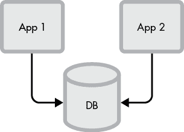
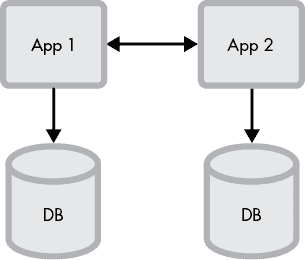
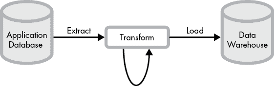

# 第十一章：创建可演化架构

需求波动——客户需求的变化——是软件项目中不可避免的挑战。产品需求和环境会随着时间发生变化；你的应用也必须做出相应的改变。但需求的变化会导致不稳定，并可能使开发偏离轨道。

管理者通过采用迭代开发流程（如敏捷开发，下一章会讨论）来应对需求波动。你可以通过构建*可演化架构*来为适应需求变化做出贡献。可演化架构避免了复杂性——演化的敌人。

本章将教你一些可以使软件更简单、从而更易于演化的技巧。矛盾的是，实现软件的简单性可能是困难的；如果没有有意识的努力，代码会变得混乱和复杂。我们将首先描述复杂性及其如何导致僵化和混乱的代码库。然后，我们将展示减少复杂性的设计原则。最后，我们会将这些设计原则转化为具体的 API 和数据层最佳实践。

## 理解复杂性

在《软件设计哲学》（Yaknyam Press，2018 年）一书中，斯坦福大学计算机科学教授约翰·奥斯特豪特（John Ousterhout）写道：“复杂性是与系统结构相关的任何因素，使得理解和修改系统变得困难。”根据奥斯特豪特的观点，复杂系统有两个特征：高*依赖性*和高*模糊性*。我们增加了第三个特征：高*惯性*。

高*依赖性*使软件依赖于其他代码的 API 或行为。依赖性显然是不可避免的，甚至是值得追求的，但必须找到一个平衡点。每一个新的连接和假设都会让代码变得更难修改。高依赖性的系统很难修改，因为它们具有*紧密耦合*和高*变更放大*。紧密耦合描述的是模块之间的高度依赖关系，这会导致高变更放大效应，其中一次更改会导致依赖项的修改。精心设计的 API 和克制使用抽象可以最小化紧密耦合和变更放大。

高*模糊性*使程序员难以预测变更的副作用、代码的行为以及需要修改的地方。模糊的代码学习起来更困难，开发人员更容易无意中破坏东西。*神对象*（拥有过多知识）、鼓励副作用的全局状态、过度间接化导致代码模糊和*远程操作*（影响程序中远距离部分的行为）都是高模糊性的症状。具有清晰契约和标准模式的 API 可以减少模糊性。

*惯性*，是我们在 Ousterhout 列表中新增的特性，是指软件倾向于保持使用状态。用于快速实验的容易被丢弃的代码惯性较低，而支撑多个业务关键应用的服务则具有较高的惯性。复杂度的成本随着时间的推移积累，因此高惯性、高变化的系统应该简化，而低惯性或低变化的系统则可以保持复杂（只要你愿意丢弃它们或继续置之不理）。

复杂性并不总能被消除，但你可以选择将它放在哪里。向后兼容的变更（稍后讨论）可能会使代码更容易使用，但实现上却更复杂。通过引入间接层来解耦子系统，减少了依赖性，但也增加了模糊性。在管理复杂性时，要深思熟虑地选择何时、何地以及如何进行处理。

## 设计可演化性

面对未知的未来需求，工程师通常会选择两种策略中的一种：他们要么试图猜测未来需要什么，要么构建抽象作为逃生舱，使后续的代码更易于修改。不要玩这个游戏；这两种方式都会导致复杂性。保持简单（即 KISS——*保持简单，傻瓜*——感谢美国海军对首字母缩略词和“严厉关爱”的偏好）。使用 KISS 助记符来提醒自己在构建时考虑简洁。简单的代码让你可以在需要变得明确且变化不可避免时，稍后添加复杂性。

保持代码简单的最简单方法就是完全避免编写它。告诉自己*你不会*需要它*(YAGNI)*。当你编写代码时，使用最小惊讶原则和封装原则。这些设计原则将使你的代码更容易演化。

### 你*不会*需要它

YAGNI 是一种看似简单的设计实践：不要构建你不需要的东西。YAGNI 违规发生在开发人员变得过于激动、执着或担心某些代码细节时。很难预测你会需要什么，什么又是不需要的。每一个错误的猜测都是浪费的努力。在初始的浪费之后，代码继续拖慢进展，它需要被维护，开发人员需要理解它，且必须构建并进行测试。

幸运的是，你可以培养一些习惯来避免不必要的开发。避免过早优化、不必要的灵活抽象，以及对*最小可行产品*（*MVP*）——你为了获取用户反馈所需的最低功能集——不必要的产品特性。

*过早优化*发生在开发者在代码未证明需要优化之前就添加了性能优化。在经典场景中，开发者看到某段代码可以通过添加复杂的逻辑和架构层（如缓存、分片数据库或队列）来加快速度或提高可扩展性。开发者在代码发布前进行了优化，在代码发布之前没人使用过它。发布代码后，开发者发现这个优化其实并不需要。优化很少会被移除，复杂性不断增加。大多数性能和可扩展性改进都伴随着高复杂性的代价。例如，缓存虽然很快，但也可能与底层数据不一致。

灵活的抽象——插件架构、包装接口以及像键值对这样的通用数据结构——是另一种诱惑。开发者认为如果出现新的需求，他们可以轻松调整。但抽象是有代价的；它将实现封装在僵化的边界中，开发者最终会为此而苦恼。灵活性还使得代码更难以阅读和理解。以这个分布式队列接口为例：

```
interface IDistributedQueue { void send*(String queue, Object message)*; Object receive*(String queue)*;
}
```

`IDistributedQueue` 看起来很简单：你发送和接收消息。但如果底层队列支持消息的键和值（就像 Apache Kafka 所做的那样）或消息确认（就像 Amazon 的简单队列服务所做的那样）怎么办？开发者面临一个选择：接口应该是所有消息队列特性的并集，还是所有特性的交集？所有特性的并集会产生一个接口，使得没有任何单一实现适用于所有方法。所有特性的交集则会导致一个有限的接口，它没有足够的功能来发挥作用。直接使用某个实现会更好。如果你决定以后需要支持另一种实现，再进行重构也不迟。

保持代码灵活的最佳方法就是简单地减少代码量。对于你构建的每一项内容，问问自己什么是绝对必要的，其余的就抛弃掉。这种方法——叫做 *Muntzing*——能保持你的软件精简且具有适应性。

添加酷炫的新产品特性也是一种诱惑。开发者因各种原因陷入酷炫特性的陷阱：他们把自己的使用误认为是大多数用户的需求，认为添加特性很容易，或者觉得它很酷！每个新特性都需要时间来构建和维护，而且你无法确定它是否真的有用。

构建一个 MVP 能让你对自己真正需要的东西保持清醒。MVP 让你在不投入完整实现的情况下测试一个想法。

当然，YAGNI（你不需要它）也有一些警告。随着经验的积累，你会更好地预测什么时候需要灵活性和优化。与此同时，在你怀疑可能需要插入优化的地方放置接口适配器，但不要实际实现它们。例如，如果你正在创建一个新的文件格式，并且怀疑以后可能需要压缩或加密，可以提供一个指定编码的头部，但只实现未压缩的编码。以后可以添加压缩功能，而头部会使得新代码能够轻松读取旧文件。

### 最小惊讶原则

*最小惊讶原则*非常明确：不要让用户感到惊讶。构建行为符合用户预期的功能。具有高学习曲线或奇怪行为的功能会让用户感到沮丧。同样，不要让开发者感到惊讶。令人惊讶的代码是晦涩的，增加了复杂性。通过保持代码的具体性，避免隐性知识，并使用标准库和模式，可以消除惊讶。

任何开发者需要知道的，并且不是 API 本身一部分的非显性信息，都被认为是*隐性知识*。需要隐性知识的 API 会让开发者感到惊讶，从而导致错误和较高的学习曲线。两种常见的隐性知识违规情况是隐藏的排序要求和隐藏的参数要求。

*排序要求*规定了操作必须按照特定的顺序进行。方法排序是常见的违反规则：方法 A 必须在方法 B 之前调用，但 API 却允许先调用方法 B，从而在运行时让开发者感到意外并出现错误。记录排序要求是有益的，但最好一开始就不要有这种要求。通过让方法调用子方法来避免方法排序：

```
pontoonWorples() { if(!flubberized) { flubberize() } // ...
}
```

还有其他避免排序的方法：将方法合并为一个，使用*构建者模式*，使用类型系统，并让`pontoonWorples`只作用于`FlubberizedWorples`而不是所有的`Worples`，等等。所有这些方法都比要求用户了解隐藏的要求要好。如果没有其他办法，至少你可以通过命名方法为`pontoonFlubberizedWorples()`来让开发者提前意识到。与直觉相反，短的函数和变量名实际上增加了认知负担。更具体、更长的函数名更具描述性，更容易理解。

*隐含的参数要求*发生在方法签名暗示了一个比方法实际接受的更广泛的有效输入范围。例如，接受一个`int`类型却只允许 1 到 10 之间的数字，这是一个隐含的约束。要求在普通的 JSON 对象中设置某个字段值，也是在要求用户具备隐含的知识。让参数要求变得具体和可见。使用具体的类型来准确捕捉你的约束；在使用像 JSON 这样的灵活类型时，考虑使用 JSON Schema 来描述预期的对象。至少，在文档中宣传参数要求，特别是当它们不能通过编程方式可见时。

最后，使用标准库和开发模式。实现你自己的平方根方法很惊人；使用语言内置的`sqrt()`方法则不然。同样的规则适用于开发模式：使用地道的代码风格和开发模式。

### 封装领域知识

随着业务需求的变化，软件也会变化。通过按业务领域（如会计、账单、运输等）分组软件来封装领域知识。将软件组件映射到业务领域，将有助于保持代码变更的集中和简洁。

封装的领域自然趋向于*高内聚*和*低耦合*——这些是理想的特性。具有高内聚和低耦合的软件更具可演化性，因为变更的影响范围通常较小。当方法、变量和类相互关联并在模块或包中靠近时，代码就具有很高的*内聚性*。*解耦*的代码是自包含的；其逻辑变更不需要修改其他软件组件。

开发者常常将软件视为多个层次：前端、中间层和后端。分层的代码按照技术领域进行分组，所有 UI 代码集中在一个地方，所有对象持久化代码集中在另一个地方。按技术领域分组代码在单一业务领域内非常有效，但随着业务的扩展，这种方式会变得混乱。围绕每一层形成的独立团队会增加协调成本，因为每次业务逻辑的变更都会影响到所有层次。而共享的横向层次则让开发者在不同领域间混淆业务逻辑，导致复杂的代码。

确定领域边界并封装领域知识既是一门艺术，也是一门科学。有一种叫做*领域驱动设计*(DDD*)的架构方法，它定义了一整套概念和实践，用于将业务概念映射到软件中。只有在最复杂的情况中，才需要全面实施 DDD。不过，熟悉 DDD 将有助于你做出更好的设计决策。

## 可演化的 API

随着需求的变化，你需要更改你的 API，即代码之间共享的接口。更改 API 很容易做到，但要做到正确却很难。许多小而合理的变更可能导致一团糟。更糟糕的是，微小的 API 更改可能完全破坏兼容性。如果 API 发生不兼容的更改，客户端将无法正常工作；这些故障可能不会立即显现，特别是那些在运行时发生的更改，而不是在编译时发生的更改。小而清晰、兼容且版本化的 API 会更容易使用和演进。

### 保持 API 小巧

小型 API 更容易理解和演进。大型 API 会增加开发者的认知负担，并且你需要为更多代码编写文档、提供支持、调试和维护。每新增一个方法或字段，就会增加 API 的复杂度，并将你锁定在特定的使用模式中。

遵循 YAGNI（你不需要的东西）哲学：只添加当前需要的 API 方法或字段。在创建 API 数据模型时，只添加你当时需要的方法。当使用框架或生成工具启动 API 时，删除你不使用的字段或方法。

拥有大量字段的 API 方法应该有合理的默认值。开发者可以专注于相关字段，因为他们知道其他字段会继承默认值。默认值让大型 API 感觉更小巧。

### 曝露定义良好的服务 API

可演进的系统具有清晰定义的请求和响应模式，这些模式是版本化的，并且具有明确的兼容性契约。模式定义应当公开，以便可以用来自动测试客户端和服务器代码（更多信息请参见第八章中的“分别打包不同资源”）。

使用标准工具来定义服务 API。定义良好的服务将声明其模式、请求和响应方法以及异常。OpenAPI 通常用于 RESTful 服务，而非 REST 服务则使用 Protocol Buffers、Thrift 或类似的*接口定义语言*（*IDL*）。定义良好的服务 API 可以简化编译时验证，并保持客户端、服务器和文档的一致性。

接口定义工具配有代码生成器，可将服务定义转换为客户端和服务器代码。文档也可以生成，测试工具可以使用 IDL 来生成存根和模拟数据。有些工具甚至具有可发现性功能，用于查找服务，了解谁在维护它们，并展示如何使用该服务。

如果公司已经选择了某个 API 定义框架，使用该框架。如果选择一个“更好”的框架将需要大量的互操作性工作。如果公司仍在手动编写 REST API，而 JSON 接口在没有正式规范的情况下在代码中演进，最佳选择是 OpenAPI，因为它可以适配现有的 REST 服务，并且采用时不需要进行大规模迁移。

### 保持 API 变更兼容

保持 API 变更的兼容性可以让客户端和服务器版本独立演进。有两种兼容性需要考虑：前向兼容和向后兼容。

*向前兼容* 的更改允许客户端在调用旧版服务时使用新版本的 API。一个运行着 1.0 版本 API 的 Web 服务，如果能够接收来自使用 1.1 版本 API 的客户端的调用，则是向前兼容的。

*向后兼容* 的更改正好相反：库或服务的新版本不需要对旧的客户端代码进行修改。如果基于版本 1.0 的 API 开发的代码仍然可以在使用版本 1.1 时编译和运行，那么这个更改就是向后兼容的。

让我们看一个简单的使用 Protocol Buffers 定义的 gRPC Hello World 服务 API：

```
service Greeter { rpc SayHello (HelloRequest) returns (HelloReply) {}
}
message HelloRequest { string name = 1; int32 favorite_number = 2;
}
message HelloReply { string message = 1;
}
```

`Greeter` 服务有一个方法，名为 `SayHello`，它接收一个 `HelloRequest` 并返回一个包含 `favorite_number` 的有趣消息的 `HelloReply`。每个字段旁边的数字是*字段序号*；Protocol Buffers 在内部通过数字而非字符串来引用字段。

假设我们决定通过电子邮件发送问候语。我们需要添加一个电子邮件字段：

```
message HelloRequest { string name = 1; int32 favorite_number = 2; required string email = 3;
}
```

这是一个*向后不兼容*的更改，因为旧客户端不提供电子邮件。当客户端使用旧版 `HelloRequest` 调用新版的 `SayHello` 时，电子邮件将缺失，因此服务无法解析请求。移除 `required` 关键字并在未提供地址时跳过电子邮件将保持向后兼容性。

`required` 字段是一个可演化性问题，因此在 Protocol Buffers v3 中被移除。Protocol Buffers v2 的主要作者 Kenton Varda 说：“Protocol Buffers 中的 `required` 关键字证明是一个可怕的错误” ([`capnproto.org/faq.html#how-do-i-make-a-field-required-like-in-protocol-buffers`](https://capnproto.org/faq.html#how-do-i-make-a-field-required-like-in-protocol-buffers))。许多其他系统有必填字段，因此需要小心，记住，“`required` 是永远有效的”。

我们可以通过调整 `HelloRequest` 来创建一个*向前不兼容*的更改。也许我们想要支持负数的最喜欢数字。Protocol Buffers 文档写道：“如果你的字段可能包含负值，请使用 `sint32`，”因此我们相应地更改了 `favorite_number` 的类型：

```
message HelloRequest { string name = 1; sint32 favorite_number = 2;
}
```

将 `int32` 改为 `sint32` 是既向后又向前不兼容的。使用新 `HelloRequest` 的客户端将使用与旧版 `Greeter` 不同的序列化方案对 `favorite_number` 进行编码，因此服务将无法解析；而新版的 `Greeter` 也将无法解析来自旧客户端的消息！

`sint32` 的更改可以通过添加新字段来实现向前兼容。Protocol Buffers 允许我们重命名字段，只要字段编号保持不变。

```
message HelloRequest { string name = 1; int32 _deprecated_favorite_number = 2; sint32 favorite_number = 3;
}
```

服务器代码需要处理两个字段，直到旧客户端被支持为止。推出后，我们可以监控客户端使用弃用字段的频率，并在客户端升级或弃用计划到期后进行清理。

我们的示例使用了协议缓冲（Protocol Buffers），因为它们有强类型系统，并且类型兼容性更容易展示和推理。在其他环境中也会出现相同的问题，包括“简单”的 REST 服务。当客户端和服务器的内容期望出现分歧时，无论你使用什么格式，错误都会出现。此外，不仅仅是消息字段需要关注：消息的*语义*变化，或者在某些事件发生时的逻辑变化，也可能导致向后或向前的不兼容。

### 版本 API

随着 API 随着时间演变，你需要决定如何处理多个版本之间的兼容性。完全向后兼容和向前兼容的更改可以与 API 的所有先前版本和未来版本互操作；但是，这种方式很难维护，可能会产生像处理已弃用字段的逻辑这样的*杂乱*。不那么严格的兼容性保证允许更激进的更改。

最终，你可能会需要以不兼容旧客户端的方式更改你的 API——例如，增加一个新字段。版本控制 API 意味着在做出更改时会引入新版本。旧客户端可以继续使用旧版本的 API。追踪版本也有助于与客户沟通——他们可以告诉你正在使用哪个版本，而你可以通过新版本来推广新特性。

API 版本通常通过 API 网关或服务网格进行管理。版本化请求会被路由到适当的服务：一个 v2 请求将被路由到 v2.X.X 服务实例，而 v3 请求将被路由到 v3.X.X 服务实例。如果没有网关，客户端会直接调用指定版本的 RPC 服务，或者一个服务实例内部运行多个版本。

API 版本控制是有成本的。服务的较旧主要版本需要维护，且需要将修复的 bug 回传到先前版本。开发人员需要跟踪哪些版本支持哪些特性。缺乏版本管理工具可能会将版本管理的工作推给工程师。

在版本控制方法上要务实。语义化版本控制（在第五章讨论过）是一种常见的 API 版本管理方案，但许多公司使用日期或其他数字方案来进行 API 版本控制。版本号可以在 URI 路径、查询参数、HTTP Accept 头中指定，或者使用其他各种技术。这些方法之间存在权衡，也有很多不同的强烈观点。请遵循公司标准；如果没有标准，可以向经理和技术负责人询问他们对最佳实践的看法。

保持文档版本与您的 API 一起更新。处理旧版本代码的开发者需要准确的文档。对于用户来说，引用不同版本的文档并发现他们使用的 API 不匹配，确实会感到困惑。在主代码库中提交 API 文档有助于保持文档和代码的同步。代码的拉取请求可以在更改 API 和行为时更新文档。

当客户端代码难以更改时，API 版本控制最为重要。你通常对外部（客户）客户端的控制最少，因此面向客户的 API 最需要版本控制。如果你的团队同时控制服务端和客户端，可能可以在内部 API 中省略版本控制。

## 可演化数据

API 比持久化数据更为短暂；一旦客户端和服务器的 API 升级完毕，工作就完成了。数据必须随着应用程序的变化而演化。数据演化的范围从简单的模式更改（如添加或删除列）到重写记录以适应新模式、修复损坏、重写以匹配新业务逻辑，以及从一个数据库迁移到另一个数据库的大规模迁移。

隔离数据库并使用明确的模式将使数据演化更加可控。通过使用隔离的数据库，你只需要关注变更对自己应用程序的影响。模式可以保护你免于读取或写入格式不正确的数据，自动化的模式迁移使得模式变化变得可预测。

### 隔离数据库

共享数据库很难演化，会导致*自治性*的丧失——即开发者或团队独立修改系统的能力。你将无法安全地修改架构，甚至无法读写数据，而不必担心其他人如何使用你的数据库。随着架构的演化，模式会成为一个非正式且根深蒂固的 API，架构变得脆弱。分离的应用程序数据库让修改变得更容易。

隔离的数据库仅由单个应用程序访问，而共享数据库则由多个应用程序访问（见图 11-1）。



图 11-1：共享数据库

共享数据库存在几个问题。具有共享数据库的应用程序可能会直接依赖于彼此的数据。应用程序充当它们服务的基础数据的控制点。在提供数据之前，您无法在原始数据上应用业务逻辑，也无法在迁移期间轻松重定向查询，如果查询绕过您的应用程序的话。如果有多个应用程序进行写入，数据的语义可能会发散，使读者更难以理解。应用程序数据没有受到保护，因此其他应用程序可能会以意外的方式对其进行更改。模式不是隔离的；一个应用程序模式的更改可能会影响其他应用程序。性能也不是隔离的，因此如果一个应用程序压倒性地影响了数据库，所有其他应用程序都会受到影响。在某些情况下，安全边界可能会被违反。

相比之下，隔离的数据库只有一个读取者和写入者（见图 11-2）。所有其他流量都通过远程过程调用进行。



图 11-2：隔离的数据库

隔离的数据库为您提供了共享数据库所不具备的所有灵活性和隔离性。在进行数据库模式更改时，您只需关注自己的应用程序，并且数据库性能由您的使用情况管理。

偶尔有些情况下，共享数据库是有价值的。在拆分单体应用程序时，共享数据库可以作为在数据迁移到新的隔离数据库之前的有用中间步骤。管理多个数据库的操作成本高昂。早期可能有理由将许多数据库放置在同一台机器上。但请确保任何共享数据库最终都得到隔离、拆分或替换。

### 使用模式

预定义的刚性列和类型以及演变它们的繁重过程，导致了流行的*无模式*数据管理的出现。大多数现代数据存储支持存储 JSON 或类 JSON 对象，而无需预先声明其结构。无模式并不字面意味着“无模式”（数据将无法使用）；相反，无模式数据在读取时具有隐式模式，该模式在读取时提供或推断。

实际上，我们发现无模式方法存在重要的数据完整性和复杂性问题。强类型模式推进方法减少了应用程序的晦涩度和复杂性。短期内的简单通常不值得为了晦涩性的权衡。像代码本身一样，数据有时被描述为“写一次，多次读取”；使用模式使读取更容易。

你可能认为没有模式会使更改更容易：你只需根据需要开始或停止写入字段，以便数据得以演变。然而，无模式的数据实际上会使更改变得更加困难，因为你不知道在演变数据时会破坏什么。数据很快变得不成形，各种记录类型杂乱无章。开发人员、业务分析师和数据科学家都很难跟上进度。对于想要解析这些 JSON 数据的数据科学家来说，今天会是艰难的一天：

```
{"name": "Fred", "location": [37.33, -122.03], "enabled": true}
{"name": "Li", "enabled": "false"}
{"name": "Willa", "location": "Boston, MA", "enabled": 0}
```

明确的数据模式定义将使你的应用程序保持稳定，并使数据更易于使用。显式模式可以在数据写入时对其进行合理性检查。使用显式模式解析数据通常也更快。模式还有助于你发现前向和后向不兼容的更改。数据科学家可以根据下表预期数据的内容。

```
CREATE TABLE users ( id BIGINT AUTO_INCREMENT PRIMARY KEY, name VARCHAR(100) NOT NULL, latitude DECIMAL, longitude DECIMAL, enabled BOOLEAN NOT NULL
);
```

显式模式的刚性也有其成本：它们可能很难更改。这是有意为之的。模式迫使你放慢速度，仔细思考现有数据将如何迁移，以及下游用户将如何受到影响。

不要将无模式数据隐藏在有模式的数据中。虽然很有诱惑力去懒惰地把一个 JSON 字符串放入一个名为“data”的字段中，或者定义一个字符串到任意键值对的映射，但隐藏无模式数据是自我失败的；你将面临显式模式的所有痛苦，却没有获得任何好处。

在某些情况下，无模式的方法是合理的。如果你的主要目标是快速推进——也许是在你还不知道需要什么的时候，或者当你在快速迭代时，或者当旧数据几乎没有价值时——无模式的方法让你可以节省时间。一些数据本身就是不规则的；某些记录可能有一些其他记录没有的字段。当迁移数据时，从显式模式切换到隐式模式也是一个有用的技巧；你可能暂时将数据设置为无模式，以便顺利过渡到新的显式模式。

### 自动化模式迁移

更改数据库的模式是危险的。一点小改动——比如添加索引或删除列——可能会导致整个数据库或应用程序停滞不前。通过手动执行*数据库描述语言* *(DDL)* 命令直接在数据库上管理数据库更改是容易出错的。不同环境中的数据库模式会发生分歧，数据库的状态变得不确定，没有人知道谁在什么时候更改了什么，性能影响也不清楚。易出错的更改和可能的长时间停机结合在一起，是一种爆炸性的组合。

数据库模式管理工具能让数据库更改减少出错。自动化工具为你做了两件事：它迫使你跟踪模式的整个历史，并且提供工具来将模式从一个版本迁移到另一个版本。跟踪模式更改，使用自动化数据库工具，并与数据库团队合作管理模式演变。

模式的整个历史通常保存在一系列文件中，这些文件定义了从最初创建模式到其当前形式的每个更改。通过文件跟踪 DDL 更改，帮助开发人员了解模式随着时间的推移如何变化。通过版本控制系统跟踪的文件将显示是谁在何时进行了哪些更改，以及为什么进行这些更改。拉取请求将提供模式审查和代码检查的机会。

我们可以从“使用模式”部分获取用户表，并将其放入一个版本化文件中，以供像 Liquibase 这样的模式迁移工具使用：

```
--liquibase formatted sql
--changeset criccomini:create-users-table
CREATE TABLE users ( id BIGINT AUTO_INCREMENT PRIMARY KEY, name VARCHAR(100) NOT NULL, latitude DECIMAL, longitude DECIMAL, enabled BOOLEAN NOT NULL
);
--rollback DROP TABLE users
```

然后我们可以在单独的代码块中定义一个`ALTER`：

```
--changeset dryaboy:add-email
ALTER TABLE users ADD email VARCHAR(255);
--rollback DROP COLUMN email
```

Liquibase 可以通过 CLI 使用这些文件来升级或降级模式：

```
$ liquibase update
```

如果 Liquibase 指向一个空数据库，它将运行`CREATE`和`ALTER`命令。如果它指向一个已经执行过`CREATE`命令的数据库，它将只运行`ALTER`命令。像 Liquibase 这样的工具通常在数据库中使用特殊的元数据表来跟踪数据库模式的当前版本，因此如果你发现名为`DATABASECHANGELOG`或`DATABASECHANGELOGLOCK`的表，不必感到惊讶。

在前面的示例中，Liquibase 命令通常由*数据库管理员*（*DBA*）从命令行运行。一些团队会通过提交钩子或 Web UI 自动执行该操作。

不要将数据库和应用程序生命周期耦合。将模式迁移与应用程序部署绑定是危险的。模式更改是非常细致的，可能会对性能产生严重影响。将数据库迁移与应用程序部署分开，可以让你控制模式更改何时发布。

Liquibase 只是其中一个可以管理数据库迁移的工具；还有像 Flyway 和 Alembic 这样的工具。许多*对象-资源映射器*（*ORMs*）也附带了模式迁移管理器。如果你的公司已经有了这样的工具，使用它；如果没有，请与团队合作找出应该使用哪个工具。一旦选择了，就使用数据库迁移系统来处理所有更改；绕过它会导致工具的好处失效，因为现实已经与追踪的内容不一致。

也有更复杂的数据库操作工具。像 GitHub 的 gh-ost 和 Percona 的 pt-online-schema-change 这样的工具帮助数据库管理员在不影响性能的情况下执行大规模的模式更改。其他工具，如 Skeema 和 Square 的 Shift，提供了更复杂的版本控制，允许你“比较”数据库模式并自动推导出更改。所有这些工具都有助于让数据库演进更加安全。

大多数迁移工具都支持回滚，回滚会撤销迁移的更改。回滚能做的事有限，所以要小心。例如，回滚列删除操作将重新创建该列，但不会重新创建曾经存储在该列中的数据！在删除之前备份表是明智的。

由于这些类型的变化具有长期性和大规模的特性，组织通常会有专门的子团队负责确保这些变化的正确实施。这些团队可能是 DBA、运维人员或 SRE，或者是熟悉工具、性能影响和应用特定问题的高级工程师。 这些团队是理解数据存储系统细微差别的宝贵资源；向他们学习。

### 维护架构兼容性

写入磁盘的数据与 API 存在相同的兼容性问题。像 API 一样，数据的读写方可以独立变化；它们可能不是同一个软件，也可能不在同一台机器上。像 API 一样，数据有一个包含字段名称和类型的架构。以向前或向后不兼容的方式更改架构可能会破坏应用程序。使用架构兼容性检查来检测不兼容的更改，并使用数据产品来解耦内部和外部架构。

开发人员认为数据库是隐藏在其他系统背后的实现细节。完全封装的数据库是理想的，但在实践中不常实现。即使生产数据库隐藏在应用程序后面，数据通常也会被导出到数据仓库中。

数据仓库是用于分析和报告的数据库。组织会设置一个*提取、转换、加载*（*ETL*）数据管道，该管道从生产数据库中提取数据，并将其转换后加载到数据仓库中（见图 11-3）。



图 11-3：ETL 数据管道

ETL 管道在很大程度上依赖于数据库架构。简单地删除生产数据库中的某一列可能会导致整个数据管道停滞。即使删除某列不会破坏数据管道，下游用户也可能正在使用该字段进行报告、机器学习模型或临时查询。

其他系统可能也依赖于你的数据库架构。*变更数据捕获*（*CDC*）是一种基于事件的架构，将插入、更新和删除操作转换为消息，供下游消费者使用。向“members”表插入一条记录可能会触发一条消息，电子邮件服务使用这条消息向新用户发送邮件。这些消息是隐式的 API，进行不兼容的架构更改可能会破坏其他服务。

数据仓库管道和下游用户必须避免因为架构更改而导致故障。在生产环境中执行架构更改之前，确保验证这些更改的安全性。兼容性检查应该尽早进行，理想情况下是在代码提交时通过检查数据库 DDL 语句来完成。如果有预生产集成测试环境，执行 DDL 语句也可以防止更改带来问题。运行 DDL 语句并进行集成测试，确保下游系统不会因此而故障。

你还可以通过导出*数据产品*来保护内部模式，从而明确地将内部模式与下游用户解耦。数据产品将内部模式映射到独立的面向用户的模式；开发团队同时拥有生产数据库和发布的数据产品。独立的数据产品，可能只是数据库视图，使团队能够在不冻结内部数据库模式的情况下与数据消费者保持兼容性。

## 做的事项与不做的事项

| **做的事项** | **不做的事项** |
| --- | --- |
| **做** 记住 YAGNI：“你不会需要它。” | **不要** 构建没有明确目的的过多抽象。 |
| **做** 使用标准库和开发模式。 | **不要** 编写具有隐式排序或参数要求的方法。 |
| **做** 使用 IDL 来定义你的 API。 | **不要** 用奇异的代码让其他开发者感到惊讶。 |
| **做** 对外部 API 和文档进行版本控制。 | **不要** 做出不兼容的 API 更改。 |
| **做** 将应用数据库相互隔离。 | **不要** 对内部 API 版本控制过于固执。 |
| **做** 为所有数据定义明确的模式。 | **不要** 在字符串或字节字段中嵌入无模式数据。 |
| **做** 使用迁移工具来自动化数据库模式管理。 |  |
| **做** 如果下游消费者使用你的数据，请保持模式兼容性。 |  |

## 升级

有关可演化架构的详细讨论可以在*《构建演化架构》*一书中找到，作者为 Neal Ford、Rebecca Parsons 和 Patrick Kua（O'Reilly Media，2017）。欲了解更多关于可演化 API 和数据的深度内容，请参考他们的作品。书中简要讨论了领域驱动设计（DDD）；要深入了解，建议阅读 Vaughn Vernon 的*《实施领域驱动设计》*（Addison-Wesley Professional，2013）。  

我们在本章开头引用了 John Ousterhout 关于复杂性的研究。请参阅他那本简短且精彩的书*《软件设计哲学》*（Yaknyam Press，2018），以了解更多关于复杂性以及如何管理复杂性。

Zach Tellman 的*《Clojure 元素》*（[lulu.com](http://lulu.com)，2019）是一本精彩的书，只有四个章节：“命名”，“习惯用法”，“间接性”和“组合”。这是对这四个主题的简洁明了的讨论，它将帮助你构建可演化的架构（即使你从未接触过一行 Clojure 代码）。

Richard Hickey 有一场精彩的演讲，名为*《简化使之更易》*（[`www.youtube.com/watch?v=oytL881p-nQ`](https://www.youtube.com/watch?v=oytL881p-nQ)）。Hickey 的演讲讨论了简洁、复杂性、"简易性"以及如何构建优秀的软件。这场演讲不容错过。

*《数据网格：构建下一代数据架构》*由 Zhamak Dehghani 编写（2021 年底发布），书中深入讨论了数据产品。

*《设计数据密集型应用》*由 Martin Kleppman 编写（O'Reilly Media，2017）是一本优秀的书，涵盖了数据演化、数据模式、IDL 和变更数据捕获等主题。这本书是一本即时经典，强烈推荐。
