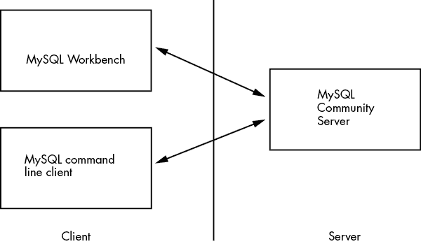
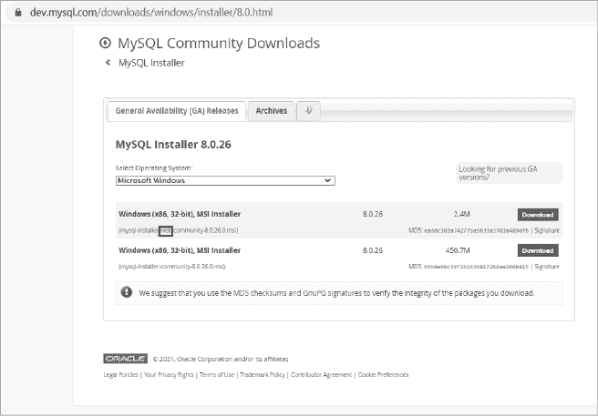
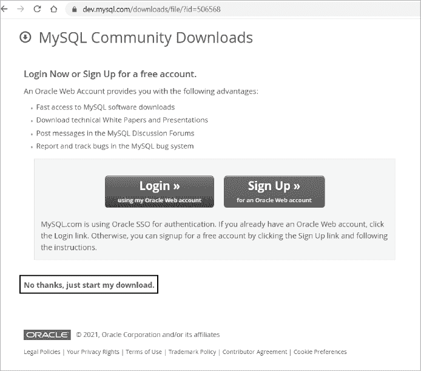

# 第一章：安装 MySQL 及工具

要开始使用数据库，你将安装 MySQL 的免费版本，称为*MySQL 社区版服务器*（也叫做*MySQL 社区版*），以及两个实用工具：MySQL Workbench 和 MySQL 命令行客户端。这些软件可以从 MySQL 官网免费下载。你将使用这些工具在本书中的项目和练习中进行工作。

## MySQL 架构

MySQL 使用*客户端/服务器架构*，如图 1-1 所示。

图 1-1：客户端/服务器架构

该架构的服务器端托管并管理客户端需要访问的资源或服务。这意味着，在实际的生产环境中，服务器软件（MySQL 社区版）将运行在一个专用计算机上，该计算机上托管着 MySQL 数据库。用于访问数据库的工具，MySQL Workbench 和 MySQL 命令行客户端，将驻留在用户的计算机上。

由于你正在为学习目的设置开发环境，你将会在同一台计算机上安装 MySQL 客户端工具和 MySQL 社区版服务器软件。换句话说，你的计算机将同时作为客户端和服务器。

## 安装 MySQL

安装 MySQL 的说明可以在[`dev.mysql.com`](https://dev.mysql.com)找到。点击**MySQL 文档**，在 MySQL 服务器标题下，点击**MySQL 参考手册**，然后选择最新版本。你将会进入该版本的参考手册。在左侧菜单中，点击**安装和升级 MySQL**。在目录中找到你的操作系统，按照说明下载并安装 MySQL 社区版服务器。

安装 MySQL 的方法有很多种——例如，从 ZIP 压缩包、源代码或 MySQL 安装程序进行安装。安装步骤会根据你的操作系统和你要使用的 MySQL 产品有所不同，因此，最好的安装资源始终是 MySQL 官方网站。不过，我会提供一些建议：

+   当你安装 MySQL 时，它会创建一个名为`root`的数据库用户，并要求你选择一个密码。*不要丢失这个密码*；你以后会用到它。

+   通常，如果有 MySQL 安装程序可用，我发现使用安装程序程序更为方便。

+   如果你使用的是 Windows，你将会有两个不同的安装程序选项：一个是网络安装程序，另一个是完整的捆绑安装程序。然而，哪个是哪个并不明显，如图 1-2 所示。

    图 1-2：为 Windows 选择网络安装程序

    网络安装程序文件更小，其文件名包含*web*字样，如图所示。我建议选择这个选项，因为它允许你选择要安装的 MySQL 产品，并从网络下载它们。完整的捆绑安装程序包含所有 MySQL 产品，这通常并不需要。

    截至本文撰写时，两个安装程序在此网页上显示为 32 位。这指的是安装应用程序，而非 MySQL 本身。任意一个安装程序都可以安装 64 位二进制文件。实际上，在 Windows 上，MySQL 仅适用于 64 位操作系统。

+   如果你愿意，也可以在不创建账户的情况下下载 MySQL。在图 1-3 所示的网页中，选择屏幕底部的**不，谢谢，直接开始下载**。

图 1-3：在不创建账户的情况下下载 MySQL

接下来，你的下一步是下载 MySQL Workbench，这是一个用于访问 MySQL 数据库的图形化工具。使用此工具，你可以探索数据库、对数据库运行 SQL 语句，并查看返回的数据。要下载 MySQL Workbench，请访问[`dev.mysql.com/doc/workbench/en/`](https://dev.mysql.com/doc/workbench/en/)。这将直接带你到 MySQL Workbench 的参考手册。点击左侧菜单中的**安装**，选择你的操作系统，并按照指示进行操作。

当你在计算机上安装 MySQL Community Server 或 MySQL Workbench 时，MySQL 命令行客户端应该会自动安装。此客户端允许你通过计算机的*命令行界面*（也叫*控制台*、*命令提示符*或*终端*）连接到 MySQL 数据库。你可以使用此工具对 MySQL 数据库执行一个或多个保存在脚本文件中的 SQL 语句。当你不需要通过图形化用户界面查看结果时，MySQL 命令行客户端非常有用。

在 MySQL 中，你将使用这三款 MySQL 产品来完成大部分工作，包括本书中的练习。

现在，既然你的计算机已经安装了 MySQL，你可以开始创建数据库了！

## 摘要

在这一章中，你从官方网站安装了 MySQL、MySQL Workbench 和 MySQL 命令行客户端。你还找到了 MySQL Server 和 MySQL Workbench 的参考手册，其中包含了大量有用的信息。如果你遇到问题、有疑问，或者想了解更多内容，我建议使用这些手册。

在下一章，你将学习如何查看和创建 MySQL 数据库和表。
